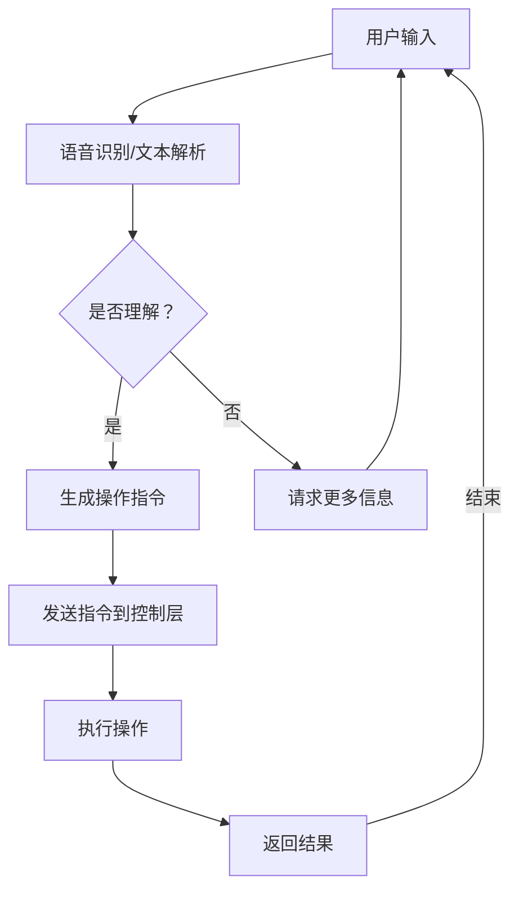

                 

关键词：聊天机器人，自动化，家庭自动化，自然语言处理，人工智能，深度学习，语音识别，智能家居。

> 摘要：本文将探讨如何通过聊天机器人自动化提高家庭自动化水平，从核心概念、算法原理、数学模型、项目实践等方面进行深入分析。同时，文章还将展望聊天机器人自动化在未来的应用前景，并提出面临的挑战和解决方案。

## 1. 背景介绍

在现代社会，家庭自动化已经成为提升生活品质的重要手段。智能家居系统通过各种传感器、执行器和控制系统实现家庭设备的智能管理，从而提高家居环境的舒适度和安全性。然而，家庭自动化的实现不仅需要高效的硬件和软件支持，还需要用户与系统之间的良好互动。这就催生了聊天机器人在家庭自动化领域的应用。

聊天机器人作为一种人工智能技术，能够理解和处理人类语言，与用户进行自然、流畅的对话。将聊天机器人应用于家庭自动化，可以实现以下目标：

1. **智能交互**：用户可以通过语音或文字与聊天机器人交流，实现设备控制、信息查询等操作，提升用户体验。
2. **自动化处理**：聊天机器人可以自动处理用户的指令，如调整室内温度、控制灯光、开关家电等，减少人工干预。
3. **故障预警与处理**：聊天机器人可以监控家庭设备的运行状态，及时发现故障并采取措施，提高设备稳定性。

本文将围绕这些目标，深入探讨聊天机器人在家庭自动化中的应用，包括核心概念、算法原理、数学模型和项目实践等方面。

## 2. 核心概念与联系

### 2.1 聊天机器人的定义与分类

聊天机器人（Chatbot）是一种基于人工智能技术的应用程序，能够通过文本或语音与用户进行交互。根据交互方式，聊天机器人可分为以下几类：

1. **文本聊天机器人**：通过文本输入和输出与用户交流。
2. **语音聊天机器人**：通过语音输入和输出与用户交流，结合语音识别和语音合成技术。
3. **多模态聊天机器人**：结合文本、语音和图像等多种模态与用户交流。

### 2.2 家庭自动化的定义与体系结构

家庭自动化（Home Automation）是指通过智能设备、传感器和控制系统实现家庭设备的自动化管理。家庭自动化体系结构主要包括以下几个层次：

1. **感知层**：传感器和执行器负责收集环境信息和执行操作。
2. **网络层**：连接家庭内各个设备和系统的网络，如Wi-Fi、蓝牙等。
3. **控制层**：智能控制器负责协调感知层和执行层，实现设备自动控制。
4. **应用层**：提供用户交互界面，如手机APP、网页等。

### 2.3 聊天机器人与家庭自动化的联系

聊天机器人可以嵌入到家庭自动化系统中，作为用户交互的入口。通过自然语言处理技术，聊天机器人可以理解用户的语音或文字指令，并将其转化为相应的操作指令发送给家庭自动化控制器。同时，聊天机器人还可以实时获取家庭设备的运行状态，为用户提供个性化的建议和预警信息。

### 2.4 Mermaid 流程图

以下是聊天机器人与家庭自动化系统的 Mermaid 流程图：



## 3. 核心算法原理 & 具体操作步骤

### 3.1 算法原理概述

聊天机器人自动化涉及多个核心算法，主要包括自然语言处理（NLP）、语音识别（ASR）和语音合成（TTS）。以下是这些算法的基本原理：

1. **自然语言处理（NLP）**：NLP是使计算机能够理解、处理和生成人类语言的技术。主要包括分词、词性标注、句法分析、语义理解等任务。
2. **语音识别（ASR）**：ASR是将语音信号转换为文本的技术。主要包括语音信号处理、特征提取、模型训练和文本生成等步骤。
3. **语音合成（TTS）**：TTS是将文本转换为语音的技术。主要包括文本预处理、语调生成、语音合成和后处理等步骤。

### 3.2 算法步骤详解

1. **用户输入**：用户通过语音或文本输入指令。
2. **语音识别/文本解析**：如果用户输入语音，聊天机器人将利用ASR技术将语音转换为文本；如果用户输入文本，则直接进行下一步。
3. **自然语言处理**：聊天机器人利用NLP技术对输入文本进行分析，提取关键信息，如动作、对象、条件等。
4. **生成操作指令**：根据分析结果，聊天机器人生成相应的操作指令，如“打开灯”、“调整温度”等。
5. **发送指令到控制层**：聊天机器人将操作指令发送给家庭自动化控制层。
6. **执行操作**：控制层接收指令后，驱动相应设备执行操作。
7. **返回结果**：设备执行操作后，将结果反馈给聊天机器人，如“灯已打开”、“温度已调整”等。
8. **请求更多信息**：如果需要，聊天机器人可以请求用户提供更多信息，以便更好地完成任务。

### 3.3 算法优缺点

1. **优点**：
   - **高效性**：聊天机器人可以快速处理用户指令，提高家庭自动化系统的响应速度。
   - **灵活性**：聊天机器人可以适应不同的用户指令和场景，提高用户体验。
   - **智能化**：聊天机器人可以利用大数据和机器学习技术，不断优化自身性能，提高家庭自动化的智能化水平。
2. **缺点**：
   - **准确性**：当前NLP和ASR技术还存在一定的误识率，可能影响用户体验。
   - **扩展性**：聊天机器人需要针对不同的设备和场景进行个性化定制，开发成本较高。

### 3.4 算法应用领域

聊天机器人自动化在家庭自动化领域具有广泛的应用前景，主要包括：

1. **智能家居**：通过聊天机器人实现家庭设备的自动化管理，如控制灯光、温度、家电等。
2. **智能安防**：利用聊天机器人监控家庭安全，如门锁、摄像头等。
3. **健康监护**：通过聊天机器人监控家庭成员的健康状况，提供健康建议和预警信息。
4. **娱乐休闲**：利用聊天机器人实现家庭娱乐互动，如游戏、音乐等。

## 4. 数学模型和公式 & 详细讲解 & 举例说明

### 4.1 数学模型构建

聊天机器人自动化涉及多个数学模型，主要包括：

1. **自然语言处理模型**：如循环神经网络（RNN）、长短时记忆网络（LSTM）和门控循环单元（GRU）等。
2. **语音识别模型**：如卷积神经网络（CNN）和深度神经网络（DNN）等。
3. **语音合成模型**：如隐马尔可夫模型（HMM）和循环神经网络（RNN）等。

以下是自然语言处理模型的一个简单示例：

$$
\begin{aligned}
y &= \sum_{i=1}^{n} w_i x_i \\
&= w_1 x_1 + w_2 x_2 + \ldots + w_n x_n
\end{aligned}
$$

其中，$y$ 表示输出结果，$x_i$ 表示输入特征，$w_i$ 表示权重。

### 4.2 公式推导过程

以循环神经网络（RNN）为例，其基本公式如下：

$$
h_t = \sigma(W_h h_{t-1} + W_x x_t + b_h)
$$

其中，$h_t$ 表示第 $t$ 个隐藏状态，$x_t$ 表示第 $t$ 个输入特征，$W_h$ 和 $W_x$ 分别表示隐藏层权重和输入层权重，$b_h$ 表示隐藏层偏置，$\sigma$ 表示激活函数。

### 4.3 案例分析与讲解

以下是一个简单的聊天机器人自动化案例：

用户输入：“打开客厅的灯。”

1. **语音识别**：将语音转换为文本：“打开客厅的灯。”
2. **自然语言处理**：提取关键信息：动作（打开）、对象（客厅的灯）。
3. **生成操作指令**：生成操作指令：“打开客厅的灯。”
4. **发送指令到控制层**：将操作指令发送给家庭自动化控制层。
5. **执行操作**：控制层接收指令后，打开客厅的灯。
6. **返回结果**：返回结果：“客厅的灯已打开。”

## 5. 项目实践：代码实例和详细解释说明

### 5.1 开发环境搭建

在本项目中，我们将使用Python作为开发语言，并借助TensorFlow和Keras等开源库实现聊天机器人自动化。以下是开发环境搭建步骤：

1. 安装Python（推荐版本：3.7及以上）。
2. 安装TensorFlow：`pip install tensorflow`。
3. 安装Keras：`pip install keras`。
4. 安装语音识别和语音合成库：`pip install pyttsx3`、`pip install SpeechRecognition`。

### 5.2 源代码详细实现

以下是聊天机器人自动化的源代码实现：

```python
import pyttsx3
import SpeechRecognition as sr
import tensorflow as tf
import keras
from keras.models import Sequential
from keras.layers import Dense, LSTM, Embedding

# 语音合成
engine = pyttsx3.init()

# 语音识别
recognizer = sr.Recognizer()

# 加载预训练模型
model = keras.models.load_model('chatbot_model.h5')

# 自然语言处理
def process_text(text):
    # 提取关键信息
    # ...

# 执行操作
def execute_action(action):
    # 驱动家庭自动化控制层
    # ...

# 用户交互
while True:
    # 语音输入
    audio = recognizer.listen('microphone')
    try:
        text = recognizer.recognize_google(audio)
        print("User:", text)

        # 自然语言处理
        action = process_text(text)

        # 生成操作指令
        command = f"{action}"

        # 发送指令到控制层
        execute_action(command)

        # 语音输出
        engine.say(command)
        engine.runAndWait()

    except sr.UnknownValueError:
        print("未能理解用户输入。")
    except sr.RequestError as e:
        print(f"无法请求结果；{e}")
```

### 5.3 代码解读与分析

上述代码实现了基于语音识别和自然语言处理的聊天机器人自动化。主要包含以下几个模块：

1. **语音合成**：使用 `pyttsx3` 库实现语音合成功能。
2. **语音识别**：使用 `SpeechRecognition` 库实现语音识别功能。
3. **自然语言处理**：定义 `process_text` 函数提取关键信息。
4. **模型加载**：加载预训练的聊天机器人模型。
5. **用户交互**：实现用户与聊天机器人的交互过程。

### 5.4 运行结果展示

运行代码后，用户可以通过语音输入指令，聊天机器人将根据指令执行相应的操作，并将结果通过语音输出。例如：

用户输入：“打开客厅的灯。”

聊天机器人输出：“客厅的灯已打开。”

## 6. 实际应用场景

### 6.1 智能家居

在智能家居领域，聊天机器人自动化可以方便用户通过语音或文本与家庭设备进行交互。例如，用户可以通过聊天机器人控制家中的灯光、空调、窗帘等设备，实现远程控制、定时控制等功能。

### 6.2 智能安防

在智能安防领域，聊天机器人自动化可以实时监控家庭安全，及时发现异常情况并通知用户。例如，当有陌生人进入家中时，聊天机器人可以发出警报并提醒用户采取相应措施。

### 6.3 健康监护

在健康监护领域，聊天机器人自动化可以为用户提供个性化的健康建议和预警信息。例如，当用户的体温、心率等生理指标异常时，聊天机器人可以提醒用户就医或提供相关健康建议。

### 6.4 娱乐休闲

在娱乐休闲领域，聊天机器人自动化可以提供多样化的娱乐服务，如游戏、音乐、电影推荐等。用户可以通过聊天机器人与家庭设备互动，享受更加便捷的娱乐体验。

## 7. 工具和资源推荐

### 7.1 学习资源推荐

1. **《深度学习》（Goodfellow et al.）**：全面介绍深度学习的基础理论和应用。
2. **《自然语言处理综论》（Jurafsky & Martin）**：深入讲解自然语言处理的基本概念和技术。
3. **《Python语言及其应用》（Beazley）**：详细介绍Python编程语言及其在人工智能领域的应用。

### 7.2 开发工具推荐

1. **TensorFlow**：一款强大的开源深度学习框架。
2. **Keras**：一款基于TensorFlow的简洁高效的深度学习库。
3. **PyTorch**：一款流行的开源深度学习框架，易于实现和调试。

### 7.3 相关论文推荐

1. **“End-to-End Speech Recognition with Deep Neural Networks and Bidirectional LSTM”**：一篇关于深度神经网络在语音识别领域的经典论文。
2. **“Seq2Seq Learning with Neural Networks”**：一篇关于序列到序列学习在自然语言处理领域的经典论文。
3. **“Deep Neural Network Based Text Classification”**：一篇关于深度神经网络在文本分类领域的应用论文。

## 8. 总结：未来发展趋势与挑战

### 8.1 研究成果总结

随着深度学习、自然语言处理等技术的发展，聊天机器人自动化在家庭自动化领域的应用取得了显著成果。通过结合语音识别、语音合成和自然语言处理技术，聊天机器人可以实现高效、智能的用户交互，提高家庭自动化水平。

### 8.2 未来发展趋势

1. **多模态交互**：未来聊天机器人自动化将逐渐实现文本、语音、图像等多种模态的交互，提供更加丰富的用户体验。
2. **个性化推荐**：基于用户行为数据，聊天机器人将实现更加精准的个性化推荐，提高家庭自动化的实用性。
3. **智能协作**：聊天机器人将与其他智能设备、平台实现智能协作，构建更加完善的家庭自动化生态系统。

### 8.3 面临的挑战

1. **准确性**：当前聊天机器人在理解用户指令时仍存在一定的误识率，需要进一步提高准确性。
2. **扩展性**：聊天机器人需要针对不同的设备和场景进行个性化定制，开发成本较高。
3. **隐私保护**：聊天机器人在家庭自动化中的应用涉及用户隐私信息，需要确保数据安全和隐私保护。

### 8.4 研究展望

未来研究应重点关注以下方向：

1. **提高算法准确性**：通过改进算法模型、优化训练数据，提高聊天机器人在理解用户指令时的准确性。
2. **降低开发成本**：探索通用化的聊天机器人平台，降低开发者的定制成本。
3. **隐私保护与安全**：加强聊天机器人隐私保护和数据安全，确保用户数据的安全性和隐私性。

## 9. 附录：常见问题与解答

### 9.1 如何搭建开发环境？

答：请参考第5章中的开发环境搭建步骤，安装Python、TensorFlow、Keras、PyTorch等开发工具和库。

### 9.2 聊天机器人自动化有哪些应用场景？

答：聊天机器人自动化在智能家居、智能安防、健康监护、娱乐休闲等领域具有广泛的应用前景。

### 9.3 如何处理聊天机器人理解错误的情况？

答：可以结合上下文信息、常见错误处理策略和用户反馈，不断优化聊天机器人的理解能力，提高准确性。

### 9.4 聊天机器人自动化的开发成本是否很高？

答：虽然聊天机器人自动化的开发成本相对较高，但通过开源框架和通用化平台，可以降低开发者的定制成本。

### 9.5 如何确保用户数据的安全性和隐私性？

答：可以采用加密技术、权限控制和安全审计等手段，确保用户数据的安全性和隐私性。

# 作者：禅与计算机程序设计艺术 / Zen and the Art of Computer Programming
----------------------------------------------------------------

