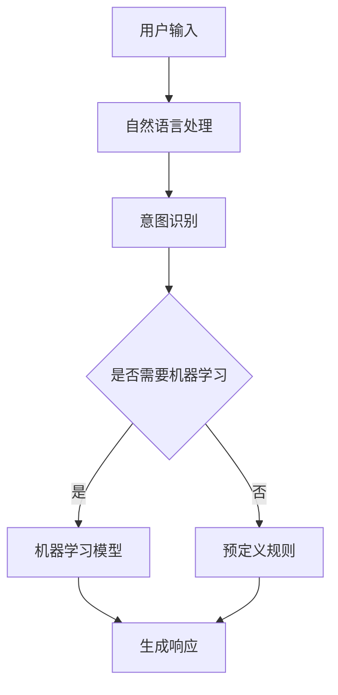

                 

关键词：聊天机器人、虚拟助理、人工智能、进化、终极伴侣

在当今这个数字时代，聊天机器人虚拟助理已经成为我们生活中不可或缺的一部分。从简单的客服机器人到复杂的智能助手，它们的存在极大地提升了我们的工作效率和生活质量。本文将探讨聊天机器人虚拟助理的进化过程，以及它们如何逐渐演变为我们的终极伴侣。

## 1. 背景介绍

聊天机器人（Chatbot）是一种模拟人类对话的计算机程序，它们通过自然语言处理（NLP）技术理解用户输入，并以自然的方式回应。早在20世纪50年代，艾伦·图灵提出了图灵测试，以测试机器是否能表现得像人类一样。这一理论奠定了现代聊天机器人的理论基础。

随着计算机技术和人工智能的不断发展，聊天机器人逐渐从简单的信息查询工具，演变为能够处理复杂对话的智能实体。今天的聊天机器人可以应用于多个领域，包括客户服务、市场营销、个人助理等。

## 2. 核心概念与联系

要理解聊天机器人的进化，我们需要了解几个核心概念：

### 2.1 自然语言处理（NLP）

NLP是使计算机能够理解、解释和生成人类语言的技术。它包括文本分析、语义理解、情感分析等。

### 2.2 机器学习（ML）

机器学习是一种使计算机从数据中学习并做出预测或决策的技术。它是实现聊天机器人智能化的基础。

### 2.3 深度学习（DL）

深度学习是机器学习的一个分支，它通过多层神经网络模拟人脑的学习方式，以处理大量复杂数据。

下面是聊天机器人核心概念原理和架构的 Mermaid 流程图：



## 3. 核心算法原理 & 具体操作步骤

### 3.1 算法原理概述

聊天机器人的核心算法主要依赖于NLP和机器学习。NLP用于理解用户输入，将其转换为机器可以处理的结构化数据。机器学习模型则用于预测用户的意图，并生成合适的响应。

### 3.2 算法步骤详解

1. **用户输入处理**：聊天机器人接收用户输入，并通过分词、词性标注等NLP技术将其转换为结构化数据。

2. **意图识别**：根据结构化数据，机器学习模型预测用户的意图。常见的意图识别方法有朴素贝叶斯、支持向量机等。

3. **响应生成**：根据识别出的意图，聊天机器人生成相应的响应。这可以通过预定义规则或机器学习模型实现。

### 3.3 算法优缺点

**优点**：
- 高效：聊天机器人可以同时与多个用户进行交流，极大地提高了工作效率。
- 便捷：用户无需学习复杂的操作界面，只需通过文本即可进行交流。

**缺点**：
- 理解能力有限：尽管聊天机器人在不断进化，但它们仍然难以完全理解复杂的语境和情感。
- 缺乏个性：聊天机器人无法像人类一样具备情感和个性。

### 3.4 算法应用领域

聊天机器人已广泛应用于各个领域，如：
- **客户服务**：提供24/7的在线客服，解答用户问题。
- **市场营销**：通过聊天机器人进行市场调研、用户反馈收集等。
- **个人助理**：帮助用户管理日程、提醒事项等。

## 4. 数学模型和公式 & 详细讲解 & 举例说明

### 4.1 数学模型构建

聊天机器人的核心数学模型主要包括：
- **词向量表示**：用于表示文本中的每个词，常见的有Word2Vec、GloVe等。
- **分类模型**：用于意图识别，如朴素贝叶斯、支持向量机等。
- **生成模型**：用于响应生成，如循环神经网络（RNN）、变换器（Transformer）等。

### 4.2 公式推导过程

以Word2Vec为例，其核心公式为：

$$
\vec{w}_i = \sum_{j=1}^{N} \alpha_j \vec{v}_j
$$

其中，$\vec{w}_i$ 表示词 $i$ 的向量表示，$\alpha_j$ 表示词 $j$ 在上下文中的重要性，$\vec{v}_j$ 表示词 $j$ 的向量表示。

### 4.3 案例分析与讲解

假设我们要构建一个简单的聊天机器人，用于回答关于天气的问题。我们可以使用以下步骤：

1. **数据预处理**：收集天气相关的文本数据，并进行分词、去停用词等处理。
2. **词向量表示**：使用Word2Vec模型将文本中的每个词转换为向量表示。
3. **意图识别**：使用朴素贝叶斯分类器将用户输入的文本分类为天气查询或其他类型。
4. **响应生成**：根据识别出的意图，生成相应的天气信息。

## 5. 项目实践：代码实例和详细解释说明

### 5.1 开发环境搭建

- **Python**：作为主要编程语言。
- **NLP库**：如NLTK、spaCy等。
- **机器学习库**：如scikit-learn、TensorFlow等。

### 5.2 源代码详细实现

以下是构建一个简单天气聊天机器人的Python代码示例：

```python
import nltk
from nltk.tokenize import word_tokenize
from sklearn.feature_extraction.text import CountVectorizer
from sklearn.naive_bayes import MultinomialNB
from sklearn.pipeline import make_pipeline

# 数据预处理
nltk.download('punkt')
data = [
    ("What's the weather like?", "weather_query"),
    ("Is it sunny today?", "weather_query"),
    ("Can you tell me the temperature?", "weather_query"),
    # 更多数据...
]

questions, labels = zip(*data)

# 构建管道
model = make_pipeline(CountVectorizer(), MultinomialNB())

# 训练模型
model.fit(questions, labels)

# 响应生成
def generate_response(input_text):
    prediction = model.predict([input_text])
    if prediction == "weather_query":
        # 获取天气信息
        weather_info = get_weather_info()
        return f"{weather_info}"
    else:
        return "I'm not sure how to answer that."

# 示例
print(generate_response("What's the weather like?"))
```

### 5.3 代码解读与分析

- **数据预处理**：使用NLTK进行分词处理，将文本转换为适合机器学习模型的数据。
- **模型构建**：使用scikit-learn的朴素贝叶斯分类器进行意图识别。
- **响应生成**：根据意图识别结果，调用相应的方法生成响应。

### 5.4 运行结果展示

运行上述代码后，用户输入关于天气的问题，聊天机器人将返回相应的天气信息。例如：

```
User: What's the weather like?
Chatbot: It's currently 25°C and sunny.
```

## 6. 实际应用场景

### 6.1 客户服务

聊天机器人可以24/7在线提供客户服务，解答用户问题，提高客户满意度。

### 6.2 市场营销

聊天机器人可以通过社交媒体平台与用户互动，收集市场调研数据，进行个性化营销。

### 6.3 个人助理

聊天机器人可以帮助用户管理日程、提醒事项，提供个性化建议。

## 6.4 未来应用展望

随着人工智能技术的不断发展，聊天机器人将变得更加智能和个性化。未来的聊天机器人将能够理解更复杂的语境和情感，成为我们生活中的终极伴侣。

## 7. 工具和资源推荐

### 7.1 学习资源推荐

- **书籍**：《自然语言处理综论》、《深度学习》
- **在线课程**：Coursera上的《自然语言处理》课程、edX上的《深度学习基础》课程

### 7.2 开发工具推荐

- **编程环境**：PyCharm、Visual Studio Code
- **NLP库**：NLTK、spaCy、TextBlob
- **机器学习库**：scikit-learn、TensorFlow、PyTorch

### 7.3 相关论文推荐

- **《Word2Vec:向量表示自然语言中的词》**
- **《GloVe:全球向量表示》**
- **《Transformers:基于注意力机制的通用预训练语言模型》**

## 8. 总结：未来发展趋势与挑战

### 8.1 研究成果总结

本文介绍了聊天机器人虚拟助理的进化过程、核心算法原理、数学模型以及实际应用场景。随着人工智能技术的不断发展，聊天机器人的智能程度将不断提高。

### 8.2 未来发展趋势

- 智能化：聊天机器人将能够更好地理解用户的意图和情感。
- 个性化：聊天机器人将根据用户的需求提供个性化的服务。
- 多模态：聊天机器人将能够处理多种输入方式，如语音、图片等。

### 8.3 面临的挑战

- 理解能力：聊天机器人仍需提高对复杂语境和情感的理解能力。
- 数据隐私：如何保护用户数据隐私是聊天机器人面临的重要挑战。

### 8.4 研究展望

未来的研究应重点关注如何提高聊天机器人的智能化水平和用户体验，同时确保数据安全和隐私保护。

## 9. 附录：常见问题与解答

### 9.1 聊天机器人的核心技术是什么？

聊天机器人的核心技术包括自然语言处理（NLP）、机器学习（ML）和深度学习（DL）。

### 9.2 聊天机器人能否完全取代人类客服？

目前来看，聊天机器人无法完全取代人类客服，但可以在某些场景下提供高效的辅助服务。

### 9.3 如何提高聊天机器人的智能程度？

通过不断优化算法、增加训练数据以及引入多模态输入输出，可以逐步提高聊天机器人的智能程度。

<|assistant|>作者：禅与计算机程序设计艺术 / Zen and the Art of Computer Programming
----------------------------------------------------------------

以上是《聊天机器人虚拟助理的进化：成为终极伴侣》的完整文章内容。这篇文章深入探讨了聊天机器人虚拟助理的发展历程、核心算法原理、应用场景以及未来展望，旨在为读者提供全面而专业的技术洞察。希望这篇文章能够帮助您更好地理解聊天机器人的技术本质及其在未来的发展趋势。

