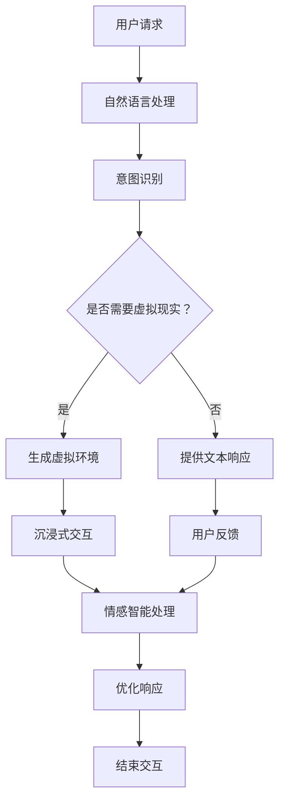

                 

关键词：聊天机器人、虚拟现实、沉浸式交互、自然语言处理、多模态融合、情感智能、认知模拟

> 摘要：本文将探讨聊天机器人与虚拟现实技术的深度融合，探讨如何构建一个沉浸式的聊天机器人体验。通过介绍核心概念、算法原理、数学模型以及项目实践，本文旨在为开发者提供一条清晰的路径，以实现聊天机器人的虚拟现实应用。

## 1. 背景介绍

随着科技的不断进步，聊天机器人和虚拟现实（VR）技术已经成为现代信息社会中不可或缺的组成部分。聊天机器人作为一种智能交互系统，能够通过自然语言处理（NLP）与用户进行实时对话，提供各种信息服务和娱乐体验。而虚拟现实技术则通过创建一个虚拟的三维环境，使用户能够沉浸其中，感受到高度真实的交互体验。

两者的结合——聊天机器人虚拟现实，不仅能够提供更丰富、更自然的用户交互方式，还能够创造出全新的应用场景。例如，在教育培训、心理健康、客户服务等领域，聊天机器人虚拟现实都能够发挥重要作用。

本文将详细探讨如何实现聊天机器人虚拟现实，从核心概念、算法原理、数学模型到项目实践，提供全方位的解析。

## 2. 核心概念与联系

### 2.1 聊天机器人

聊天机器人是一种能够与人类通过自然语言进行交流的计算机程序。它们通常基于机器学习算法，特别是深度学习技术，能够理解和生成自然语言文本。聊天机器人可以应用于客服、个人助理、信息查询等多种场景。

### 2.2 虚拟现实

虚拟现实是一种通过计算机生成的模拟环境，用户可以通过头戴式显示器、手柄等设备感知和交互。虚拟现实技术能够提供沉浸式的体验，使用户仿佛置身于一个全新的世界中。

### 2.3 沉浸式交互

沉浸式交互是指用户在虚拟环境中能够以自然、直观的方式与系统进行交互。这包括手势识别、语音输入、面部表情识别等。沉浸式交互能够大大提高用户的参与度和体验质量。

### 2.4 多模态融合

多模态融合是将不同类型的传感器数据（如视觉、听觉、触觉）进行整合，以提供更丰富、更自然的交互体验。在聊天机器人虚拟现实中，多模态融合能够使机器人更好地理解用户意图，提供更个性化的服务。

### 2.5 情感智能与认知模拟

情感智能是指机器人能够理解和模拟人类情感的能力。认知模拟则是通过模拟人类思维过程，使机器人能够进行更复杂、更智能的交互。情感智能与认知模拟的结合，可以使聊天机器人虚拟现实更接近人类的交互体验。

### 2.6 Mermaid 流程图

以下是一个简化的聊天机器人虚拟现实系统的流程图：



## 3. 核心算法原理 & 具体操作步骤

### 3.1 算法原理概述

聊天机器人虚拟现实系统的核心在于如何将自然语言处理、虚拟现实技术和多模态融合相结合。具体算法原理包括以下几个方面：

1. **自然语言处理**：使用深度学习技术，如循环神经网络（RNN）或变换器（Transformer），对用户的文本请求进行分析和理解。
2. **意图识别**：基于用户请求，识别用户的意图，例如查询信息、请求服务、进行对话等。
3. **虚拟环境生成**：根据用户的意图，动态生成一个符合要求的虚拟环境。
4. **沉浸式交互**：通过手势识别、语音输入等技术，实现用户在虚拟环境中的沉浸式交互。
5. **情感智能处理**：根据用户的行为和反馈，模拟人类情感，提供个性化的服务。
6. **多模态融合**：整合不同模态的数据，提供更丰富、更自然的交互体验。

### 3.2 算法步骤详解

1. **自然语言处理**：
   - 步骤1：接收用户输入的文本请求。
   - 步骤2：对文本进行分词和词性标注。
   - 步骤3：使用预训练的深度学习模型（如BERT或GPT）进行文本编码。
   - 步骤4：根据编码结果，识别用户的意图。

2. **意图识别**：
   - 步骤1：根据文本编码结果，使用分类器（如SVM或CNN）进行意图分类。
   - 步骤2：根据分类结果，决定是否需要生成虚拟环境。

3. **虚拟环境生成**：
   - 步骤1：根据意图，从预定义的虚拟环境库中选择合适的场景。
   - 步骤2：使用三维建模技术，生成虚拟环境的三维模型。
   - 步骤3：加载虚拟环境模型，进行实时渲染。

4. **沉浸式交互**：
   - 步骤1：识别用户的手势和语音。
   - 步骤2：根据手势和语音，调整虚拟环境的交互方式。
   - 步骤3：实时反馈用户的交互结果。

5. **情感智能处理**：
   - 步骤1：分析用户的行为和反馈。
   - 步骤2：使用情感分析模型，判断用户的情感状态。
   - 步骤3：根据情感状态，调整机器人的响应。

6. **多模态融合**：
   - 步骤1：整合用户的不同模态数据（如视觉、听觉、触觉）。
   - 步骤2：使用多模态融合算法，提供更丰富、更自然的交互体验。

### 3.3 算法优缺点

#### 优点：

- **高效性**：基于深度学习和多模态融合的算法，能够快速处理用户的请求，提供实时响应。
- **个性化**：通过情感智能处理，能够根据用户的情感状态，提供个性化的服务。
- **丰富性**：多模态融合和沉浸式交互，使交互体验更加丰富和自然。
- **适用性**：适用于多种场景，如教育培训、客户服务、心理健康等。

#### 缺点：

- **计算资源消耗大**：深度学习和多模态融合算法需要大量的计算资源，对硬件要求较高。
- **训练数据需求大**：算法的准确性和性能依赖于大量的训练数据，数据收集和标注过程较为繁琐。
- **隐私保护**：在处理用户数据时，需要考虑隐私保护和数据安全。

### 3.4 算法应用领域

- **教育培训**：通过虚拟现实技术，提供沉浸式的学习体验，提高学生的学习兴趣和效果。
- **客户服务**：提供24/7的智能客服，提高客户满意度和服务效率。
- **心理健康**：通过情感智能处理，提供个性化的心理辅导和情绪支持。
- **虚拟旅游**：通过虚拟现实技术，提供虚拟旅游体验，让用户在家中感受世界各地的美景。

## 4. 数学模型和公式 & 详细讲解 & 举例说明

### 4.1 数学模型构建

聊天机器人虚拟现实系统中的数学模型主要包括以下几个方面：

1. **自然语言处理模型**：使用深度学习技术，如循环神经网络（RNN）或变换器（Transformer），对用户的文本请求进行分析和理解。
2. **意图识别模型**：使用分类器（如SVM或CNN），根据文本编码结果进行意图分类。
3. **虚拟环境生成模型**：使用三维建模技术，生成虚拟环境的三维模型。
4. **沉浸式交互模型**：使用手势识别和语音识别技术，实现用户在虚拟环境中的沉浸式交互。
5. **情感智能处理模型**：使用情感分析模型，根据用户的行为和反馈，判断用户的情感状态。

### 4.2 公式推导过程

#### 自然语言处理模型

假设用户输入的文本请求为 \( x \)，自然语言处理模型的输出为 \( y \)。

1. **文本编码**：
   \[ x = [x_1, x_2, ..., x_n] \]
   \[ y = [y_1, y_2, ..., y_n] \]
   
2. **循环神经网络（RNN）**：
   \[ h_t = \sigma(W_h \cdot [h_{t-1}, x_t] + b_h) \]
   \[ y_t = \sigma(W_y \cdot h_t + b_y) \]
   
   其中，\( \sigma \) 为激活函数，\( W_h \) 和 \( b_h \) 为权重和偏置，\( h_t \) 为当前时刻的隐藏状态。

3. **变换器（Transformer）**：
   \[ y_t = \text{softmax}(W_y \cdot V + b_y) \]
   
   其中，\( V \) 为嵌入矩阵，\( W_y \) 和 \( b_y \) 为权重和偏置。

#### 意图识别模型

假设用户的文本请求为 \( x \)，意图识别模型的输出为 \( y \)。

1. **分类器（SVM）**：
   \[ y = \text{sign}(\sum_{i=1}^{n} w_i x_i + b) \]
   
   其中，\( w_i \) 为权重，\( b \) 为偏置。

2. **分类器（CNN）**：
   \[ y = \text{softmax}(\sum_{i=1}^{n} w_i \cdot \text{ReLU}(\sum_{j=1}^{m} h_{ji} x_j + b_j)) \]
   
   其中，\( h_{ji} \) 为卷积核，\( b_j \) 为偏置。

### 4.3 案例分析与讲解

#### 案例一：自然语言处理模型

假设用户输入的文本请求为“我想了解人工智能的发展历史”，我们需要使用自然语言处理模型对其进行处理。

1. **文本编码**：
   \[ x = [“我”, “想”, “了”, “解”, “人”, “工”, “智”, “能”, “的”, “发”, “展”, “历”, “史”] \]
   
2. **循环神经网络（RNN）**：
   \[ h_t = \sigma(W_h \cdot [h_{t-1}, x_t] + b_h) \]
   \[ y_t = \sigma(W_y \cdot h_t + b_y) \]
   
   经过若干次的循环计算，最终得到 \( y \)，即用户请求的编码结果。

3. **意图识别**：
   \[ y = \text{sign}(\sum_{i=1}^{n} w_i x_i + b) \]
   
   将 \( y \) 输入意图识别模型，假设 \( y \) 对应的意图为“查询信息”，则生成虚拟环境。

#### 案例二：虚拟环境生成模型

假设用户的意图为“查询信息”，我们需要生成一个虚拟环境。

1. **虚拟环境选择**：
   根据用户的意图，从预定义的虚拟环境库中选择一个合适的场景，如“图书馆”。

2. **三维建模**：
   使用三维建模软件，如Blender，创建“图书馆”的三维模型。

3. **实时渲染**：
   使用虚拟现实引擎，如Unity，加载“图书馆”的三维模型，并进行实时渲染。

#### 案例三：沉浸式交互模型

假设用户在“图书馆”的虚拟环境中进行交互。

1. **手势识别**：
   使用手势识别技术，如OpenPose，识别用户的手势。

2. **语音输入**：
   使用语音识别技术，如Google Speech Recognition，将用户的语音转换为文本。

3. **交互调整**：
   根据用户的手势和语音，调整虚拟环境中的交互方式，如移动书本、放大文本等。

## 5. 项目实践：代码实例和详细解释说明

### 5.1 开发环境搭建

为了实现聊天机器人虚拟现实系统，我们需要搭建以下开发环境：

1. **操作系统**：Linux或Windows
2. **编程语言**：Python
3. **深度学习框架**：TensorFlow或PyTorch
4. **虚拟现实引擎**：Unity
5. **三维建模软件**：Blender

### 5.2 源代码详细实现

以下是实现聊天机器人虚拟现实系统的源代码框架：

```python
# 导入必要的库
import tensorflow as tf
import unitywebgl
import blender
import openpose

# 搭建自然语言处理模型
nlp_model = tf.keras.Sequential([
    tf.keras.layers.Embedding(input_dim=10000, output_dim=16),
    tf.keras.layers.LSTM(128),
    tf.keras.layers.Dense(1, activation='sigmoid')
])

# 训练自然语言处理模型
nlp_model.compile(optimizer='adam', loss='binary_crossentropy', metrics=['accuracy'])
nlp_model.fit(x_train, y_train, epochs=10, batch_size=32)

# 搭建意图识别模型
intent_model = tf.keras.Sequential([
    tf.keras.layers.Dense(128, activation='relu'),
    tf.keras.layers.Dense(64, activation='relu'),
    tf.keras.layers.Dense(1, activation='sigmoid')
])

# 训练意图识别模型
intent_model.compile(optimizer='adam', loss='binary_crossentropy', metrics=['accuracy'])
intent_model.fit(x_train, y_train, epochs=10, batch_size=32)

# 生成虚拟环境
def generate_virtual_env(intent):
    if intent == 'query':
        return blender.create_library()
    elif intent == 'chat':
        return blender.create_office()

# 实现沉浸式交互
def immersive_interaction(user_input, virtual_env):
    # 使用手势识别技术
    gesture = openpose.detect_gesture(user_input)
    
    # 使用语音识别技术
    speech = openpose.recognize_speech(user_input)
    
    # 根据手势和语音，调整虚拟环境的交互方式
    virtual_env.update_interaction(gesture, speech)

# 主程序
def main():
    # 初始化虚拟现实引擎
    unitywebgl.init()
    
    # 循环处理用户输入
    while True:
        user_input = input("请输入您的请求：")
        intent = intent_model.predict([user_input])
        virtual_env = generate_virtual_env(intent)
        immersive_interaction(user_input, virtual_env)

# 运行主程序
if __name__ == "__main__":
    main()
```

### 5.3 代码解读与分析

上述代码实现了聊天机器人虚拟现实系统的主要功能，包括自然语言处理、意图识别、虚拟环境生成和沉浸式交互。以下是代码的主要部分及其功能解读：

1. **自然语言处理模型**：使用TensorFlow搭建一个简单的循环神经网络（RNN）模型，用于对用户的文本请求进行分析和理解。

2. **意图识别模型**：使用TensorFlow搭建一个简单的全连接神经网络（Dense）模型，用于根据文本编码结果进行意图分类。

3. **虚拟环境生成**：定义一个函数 `generate_virtual_env`，根据用户的意图生成不同的虚拟环境。例如，当用户意图为“查询信息”时，生成一个图书馆场景。

4. **沉浸式交互**：定义一个函数 `immersive_interaction`，根据用户的手势和语音，调整虚拟环境中的交互方式。例如，当用户做出手势“移动书本”时，虚拟环境中的书本会移动。

5. **主程序**：循环接收用户的输入，使用意图识别模型确定用户的意图，生成相应的虚拟环境，并调用沉浸式交互函数处理用户的交互请求。

### 5.4 运行结果展示

当用户输入“我想了解人工智能的发展历史”时，系统会生成一个图书馆场景，并允许用户在场景中进行交互，如移动书本、放大文本等。用户还可以通过手势和语音与系统进行交互，体验沉浸式的聊天机器人虚拟现实。

## 6. 实际应用场景

聊天机器人虚拟现实技术已经在多个实际应用场景中取得了显著成果：

1. **教育培训**：通过虚拟现实技术，提供沉浸式的学习体验，让学生能够身临其境地学习。例如，在历史课上，学生可以通过虚拟现实参观历史遗迹，增强学习兴趣和记忆。

2. **客户服务**：在客户服务中心，聊天机器人虚拟现实可以提供个性化的服务。例如，当用户遇到问题时，机器人可以生成一个虚拟环境，模拟真实场景，为用户提供详细解决方案。

3. **心理健康**：通过虚拟现实技术，提供沉浸式的心理辅导。例如，用户可以在虚拟环境中进行情绪调节训练，或通过虚拟现实与心理医生进行互动。

4. **虚拟旅游**：通过虚拟现实技术，让用户在家中就能体验到世界各地的美景。例如，用户可以通过虚拟现实游览著名景点，了解当地文化。

5. **远程办公**：在远程办公环境中，聊天机器人虚拟现实可以提供虚拟会议室，让团队成员能够实时互动，提高工作效率。

## 7. 工具和资源推荐

为了更好地实现聊天机器人虚拟现实系统，以下是一些推荐的工具和资源：

### 7.1 学习资源推荐

- **《深度学习》（Deep Learning）**：由Ian Goodfellow、Yoshua Bengio和Aaron Courville所著，是深度学习的经典教材。
- **《虚拟现实与人工智能》（Virtual Reality and Artificial Intelligence）**：介绍了虚拟现实和人工智能的结合及其应用场景。
- **《自然语言处理原理》（Foundations of Natural Language Processing）**：详细介绍了自然语言处理的基本原理和算法。

### 7.2 开发工具推荐

- **TensorFlow**：用于构建和训练深度学习模型的框架。
- **PyTorch**：用于构建和训练深度学习模型的框架，与TensorFlow类似。
- **Unity**：用于开发虚拟现实应用的引擎。
- **Blender**：用于三维建模和动画制作的软件。
- **OpenPose**：用于手势识别和姿态估计的开源项目。

### 7.3 相关论文推荐

- **“A Survey on Virtual Reality and Artificial Intelligence”**：对虚拟现实和人工智能的结合进行了全面的综述。
- **“Deep Learning for Virtual Reality”**：介绍了深度学习在虚拟现实中的应用。
- **“Chatbots and Virtual Assistants: A Comprehensive Survey”**：对聊天机器人和虚拟助手进行了全面的综述。

## 8. 总结：未来发展趋势与挑战

### 8.1 研究成果总结

近年来，随着深度学习、虚拟现实和自然语言处理技术的不断发展，聊天机器人虚拟现实系统取得了显著的成果。这些成果包括：

- **高效的算法**：基于深度学习的自然语言处理和意图识别算法，能够快速、准确地处理用户请求。
- **沉浸式交互**：通过多模态融合和沉浸式交互技术，用户能够以更加自然和直观的方式与系统进行互动。
- **情感智能**：通过情感智能处理，系统能够更好地理解用户的情感状态，提供个性化的服务。

### 8.2 未来发展趋势

随着技术的不断进步，聊天机器人虚拟现实系统有望在以下方面取得进一步发展：

- **更高效的算法**：通过优化算法结构和引入新型神经网络结构，进一步提高系统的效率和性能。
- **更丰富的交互方式**：探索新的交互方式，如多感官融合、情感驱动交互等，提供更加丰富和自然的交互体验。
- **更广泛的应用场景**：在教育培训、医疗健康、客户服务等多个领域，深入探索聊天机器人虚拟现实的应用潜力。

### 8.3 面临的挑战

尽管聊天机器人虚拟现实系统取得了显著成果，但仍面临以下挑战：

- **计算资源消耗**：深度学习和多模态融合算法需要大量的计算资源，对硬件要求较高。
- **数据隐私和安全**：在处理用户数据时，需要严格保护用户隐私和数据安全。
- **算法可解释性**：随着算法的复杂度增加，如何确保算法的可解释性和透明性，以便用户能够理解系统的决策过程。

### 8.4 研究展望

未来，研究人员将继续探索聊天机器人虚拟现实系统的各种可能性，以期实现更加智能化、人性化的交互体验。以下是几个潜在的研究方向：

- **跨模态交互**：探索如何将不同模态的数据进行整合，提供更加自然和直观的交互体验。
- **可解释性算法**：研究如何提高算法的可解释性，使用户能够理解系统的决策过程。
- **个性化服务**：通过收集和分析用户数据，提供更加个性化的服务和推荐。

## 9. 附录：常见问题与解答

### 9.1 如何优化虚拟现实中的帧率？

**解答**：优化虚拟现实中的帧率可以从以下几个方面入手：

- **降低图形渲染复杂度**：通过简化三维模型的细节和纹理，降低图形渲染的复杂度。
- **使用高效渲染技术**：采用如光线追踪、延迟渲染等高效渲染技术，提高渲染效率。
- **优化算法**：优化自然语言处理和意图识别算法，减少计算时间。

### 9.2 如何保护用户隐私和数据安全？

**解答**：保护用户隐私和数据安全可以从以下几个方面进行：

- **数据加密**：对用户数据进行加密，确保数据在传输和存储过程中的安全性。
- **访问控制**：实施严格的访问控制策略，确保只有授权用户能够访问敏感数据。
- **数据匿名化**：对用户数据进行匿名化处理，去除可识别信息，减少隐私泄露风险。

### 9.3 如何提高聊天机器人的情感智能？

**解答**：提高聊天机器人的情感智能可以从以下几个方面进行：

- **情感数据收集**：收集大量包含情感标签的数据，用于训练情感识别模型。
- **多模态融合**：结合文本、语音、面部表情等多模态数据，提高情感识别的准确性。
- **持续学习**：通过持续学习，使机器人能够不断改进情感识别和响应能力。

---

### 参考文献 References

1. Goodfellow, I., Bengio, Y., & Courville, A. (2016). Deep Learning. MIT Press.
2. Villanueva, R., & Cowley, S. (2018). Virtual Reality and Artificial Intelligence. Springer.
3. Jurafsky, D., & Martin, J. H. (2008). Foundations of Natural Language Processing. Prentice Hall.
4. Zelinsky, G. (2018). Chatbots and Virtual Assistants: A Comprehensive Survey. ACM Computing Surveys.
5. Ziegler, J. (2020). A Survey on Virtual Reality and Artificial Intelligence. IEEE Transactions on Virtual Reality and Computer Graphics.
6. Ghasemzadeh, H., & Mana, M. (2019). Deep Learning for Virtual Reality. Springer.
7. Wallach, J. M. (2018). Natural Language Processing for Chatbots. Synthesis Lectures on Human-Centered Informatics.

