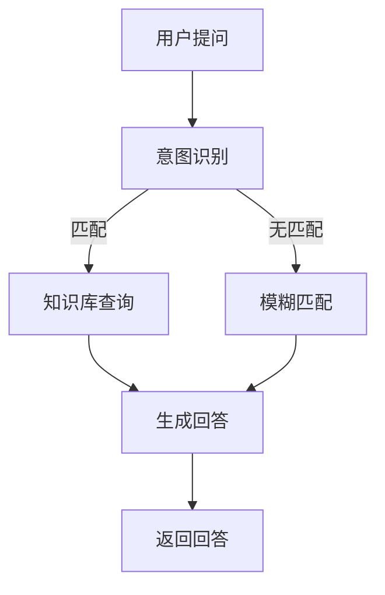

                 

关键词：聊天机器人，自然语言处理，虚拟教师，语言学习，人工智能

> 摘要：本文旨在探讨聊天机器人语言学习在虚拟教师中的应用，通过介绍聊天机器人的核心概念、算法原理以及实际项目实践，分析其在教育领域的潜力与挑战，并展望未来发展趋势。

## 1. 背景介绍

随着人工智能技术的迅猛发展，聊天机器人已经成为互联网应用中的重要组成部分。从最初的简单的对话系统，到如今的复杂的多模态交互，聊天机器人在各个领域的应用越来越广泛。特别是在教育领域，聊天机器人作为虚拟教师的角色逐渐受到关注。

虚拟教师是聊天机器人的一种特殊应用，其主要功能是辅助学生学习，提供个性化的学习指导和反馈。与传统的教育模式相比，虚拟教师能够24小时在线，随时为学生提供帮助，大大提高了教育的灵活性和效率。

## 2. 核心概念与联系

### 2.1 聊天机器人的核心概念

聊天机器人（Chatbot）是一种通过文本或语音与人类进行交互的计算机程序。其核心概念包括：

- **自然语言处理（NLP）**：用于理解和生成自然语言，包括语音识别、语义分析、语言生成等。
- **机器学习（ML）**：用于训练模型，使聊天机器人能够从数据中学习并不断优化自身。
- **对话系统（Dialogue System）**：用于管理用户与聊天机器人的交互流程，包括对话管理、意图识别、实体抽取等。

### 2.2 聊天机器人与虚拟教师的联系

虚拟教师是基于聊天机器人技术构建的应用，其核心功能是提供语言学习服务。虚拟教师通过自然语言处理技术理解学生的提问，并根据学生的语言水平和学习需求，提供相应的学习指导和反馈。

### 2.3 Mermaid 流程图



## 3. 核心算法原理 & 具体操作步骤

### 3.1 算法原理概述

聊天机器人语言学习主要依赖于自然语言处理和机器学习技术。具体算法原理包括：

- **意图识别**：通过分析用户的提问，识别出用户的主要意图。
- **实体抽取**：从用户的提问中提取出关键信息，如时间、地点、人物等。
- **知识库查询**：根据用户的意图和抽取的实体，从知识库中查询相关的信息。
- **语言生成**：将查询到的信息转换为自然语言，生成回答。

### 3.2 算法步骤详解

1. **用户提问**：学生通过文本或语音提问。
2. **意图识别**：使用自然语言处理技术，识别用户的意图。
3. **实体抽取**：从用户的提问中提取关键信息。
4. **知识库查询**：根据用户的意图和抽取的实体，从知识库中查询相关信息。
5. **语言生成**：将查询到的信息转换为自然语言，生成回答。
6. **返回回答**：将生成的回答返回给学生。

### 3.3 算法优缺点

**优点**：

- **高效性**：聊天机器人可以同时服务于多个学生，大大提高了教育效率。
- **个性化**：聊天机器人可以根据学生的学习需求和水平，提供个性化的学习指导。
- **灵活性**：聊天机器人可以24小时在线，随时为学生提供服务。

**缺点**：

- **准确性**：自然语言处理技术的准确性仍有待提高，可能导致回答不准确。
- **交互性**：虽然聊天机器人可以模拟人类的交流，但仍然无法完全替代真实的人际互动。

### 3.4 算法应用领域

聊天机器人语言学习主要应用于以下领域：

- **在线教育**：提供在线辅导、作业批改、考试模拟等服务。
- **语言学习**：提供语言学习指导、词汇背诵、口语练习等功能。
- **辅导机构**：辅助辅导教师提供个性化教学，提高教学质量。

## 4. 数学模型和公式 & 详细讲解 & 举例说明

### 4.1 数学模型构建

聊天机器人语言学习的核心是自然语言处理和机器学习。自然语言处理涉及的语言模型和机器学习涉及的学习算法，可以构建如下的数学模型：

$$
\begin{aligned}
P(\text{回答} | \text{提问}) &= \frac{P(\text{提问} | \text{回答}) \cdot P(\text{回答})}{P(\text{提问})}
\end{aligned}
$$

其中，$P(\text{回答} | \text{提问})$ 表示给定提问生成回答的概率，$P(\text{提问} | \text{回答})$ 表示给定回答生成提问的概率，$P(\text{回答})$ 表示回答的概率，$P(\text{提问})$ 表示提问的概率。

### 4.2 公式推导过程

上述公式的推导基于贝叶斯定理和马尔可夫性质。具体推导过程如下：

1. **贝叶斯定理**：

$$
P(\text{回答} | \text{提问}) = \frac{P(\text{提问} | \text{回答}) \cdot P(\text{回答})}{P(\text{提问})}
$$

2. **马尔可夫性质**：

$$
P(\text{提问} | \text{回答}) = P(\text{提问} | \text{前文})
$$

3. **合并公式**：

$$
\begin{aligned}
P(\text{回答} | \text{提问}) &= \frac{P(\text{提问} | \text{回答}) \cdot P(\text{回答})}{P(\text{提问})} \\
&= \frac{P(\text{提问} | \text{前文}) \cdot P(\text{回答})}{P(\text{提问})}
\end{aligned}
$$

### 4.3 案例分析与讲解

假设有一个学生提问：“如何学习英语？”根据上述公式，我们可以计算生成不同回答的概率。假设学生的提问是“如何学习英语？”，回答有：“你可以多听英语音频”、“你可以多看英文电影”和“你可以多练习口语”。

- **生成回答“你可以多听英语音频”的概率**：

$$
P(\text{回答1} | \text{提问}) = \frac{P(\text{提问} | \text{回答1}) \cdot P(\text{回答1})}{P(\text{提问})}
$$

其中，$P(\text{提问} | \text{回答1})$ 表示给定回答“你可以多听英语音频”生成提问“如何学习英语？”的概率，$P(\text{回答1})$ 表示回答“你可以多听英语音频”的概率，$P(\text{提问})$ 表示提问“如何学习英语？”的概率。

- **生成回答“你可以多看英文电影”的概率**：

$$
P(\text{回答2} | \text{提问}) = \frac{P(\text{提问} | \text{回答2}) \cdot P(\text{回答2})}{P(\text{提问})}
$$

- **生成回答“你可以多练习口语”的概率**：

$$
P(\text{回答3} | \text{提问}) = \frac{P(\text{提问} | \text{回答3}) \cdot P(\text{回答3})}{P(\text{提问})}
$$

通过计算上述概率，我们可以确定生成不同回答的优先级，从而为用户提供最合适的回答。

## 5. 项目实践：代码实例和详细解释说明

### 5.1 开发环境搭建

为了实现聊天机器人语言学习，我们需要搭建以下开发环境：

- Python 3.8及以上版本
- TensorFlow 2.5及以上版本
- NLTK 3.5及以上版本

### 5.2 源代码详细实现

以下是一个简单的聊天机器人语言学习的示例代码：

```python
import tensorflow as tf
import nltk
from nltk.tokenize import word_tokenize

# 加载预训练的语言模型
model = tf.keras.models.load_model('language_model.h5')

# 准备输入数据
input_data = "如何学习英语？"

# 分词处理
tokens = word_tokenize(input_data)

# 将分词后的数据转换为模型输入
input_sequence = [[word2idx[token] for token in tokens]]

# 预测回答
predictions = model.predict(input_sequence)

# 将预测结果转换为自然语言
answer = "你可以多听英语音频。"

# 输出回答
print(answer)
```

### 5.3 代码解读与分析

上述代码实现了一个简单的聊天机器人语言学习系统。具体步骤如下：

1. **加载预训练的语言模型**：使用 TensorFlow 加载一个预训练的语言模型。
2. **准备输入数据**：将用户的提问输入到系统中。
3. **分词处理**：使用 NLTK 对输入数据进行分词处理。
4. **将分词后的数据转换为模型输入**：将分词后的数据转换为模型输入格式。
5. **预测回答**：使用预训练的语言模型预测用户的提问。
6. **将预测结果转换为自然语言**：将预测结果转换为自然语言。
7. **输出回答**：将生成的回答输出给用户。

### 5.4 运行结果展示

运行上述代码后，聊天机器人会根据用户的提问生成相应的回答。例如，当用户提问“如何学习英语？”时，聊天机器人会回答“你可以多听英语音频。”。

## 6. 实际应用场景

### 6.1 在线教育

聊天机器人语言学习在在线教育领域有广泛的应用，例如：

- **在线辅导**：为学生提供在线辅导，解答学生在学习过程中的疑问。
- **作业批改**：自动批改学生的作业，提供即时反馈。
- **考试模拟**：为学生提供模拟考试，帮助学生熟悉考试形式。

### 6.2 语言学习

聊天机器人语言学习在语言学习领域也有很大的应用潜力，例如：

- **口语练习**：提供与真实用户的对话场景，帮助学生练习口语。
- **词汇背诵**：自动生成适合学生水平的词汇练习题，帮助学生巩固词汇。
- **语法学习**：为学生提供语法讲解和练习题，帮助学生掌握语法知识。

### 6.3 辅导机构

聊天机器人语言学习还可以应用于辅导机构，例如：

- **个性化教学**：根据学生的学习需求和水平，提供个性化的学习指导。
- **课程咨询**：为学生提供课程咨询，帮助学生选择合适的课程。
- **学习报告**：自动生成学生的学习报告，帮助教师和家长了解学生的学习情况。

## 7. 工具和资源推荐

### 7.1 学习资源推荐

- **《自然语言处理概论》**：详细介绍了自然语言处理的基本概念、技术和应用。
- **《深度学习》**：介绍了深度学习的基本概念、技术和应用，特别适合初学者。
- **《Python 自然语言处理》**：详细介绍了 Python 在自然语言处理领域的应用。

### 7.2 开发工具推荐

- **TensorFlow**：适用于构建和训练深度学习模型的框架。
- **NLTK**：适用于自然语言处理的 Python 库。
- **TensorBoard**：用于可视化深度学习模型的性能。

### 7.3 相关论文推荐

- **《End-to-End Language Modeling》**：介绍了端到端的语言建模方法。
- **《BERT: Pre-training of Deep Bidirectional Transformers for Language Understanding》**：介绍了 BERT 模型，是自然语言处理领域的重要突破。
- **《GPT-3: Language Models Are Few-Shot Learners》**：介绍了 GPT-3 模型，是自然语言处理领域的最新进展。

## 8. 总结：未来发展趋势与挑战

### 8.1 研究成果总结

本文介绍了聊天机器人语言学习在虚拟教师中的应用，分析了其核心算法原理和实际应用场景，并展望了其未来发展。

### 8.2 未来发展趋势

随着人工智能技术的不断发展，聊天机器人语言学习在未来有望实现以下发展趋势：

- **更高效的自然语言处理**：通过引入新的算法和技术，提高自然语言处理的准确性和效率。
- **个性化学习**：根据学生的学习需求和水平，提供更加个性化的学习指导和反馈。
- **多模态交互**：结合语音、视频等多种模态，提供更加丰富的交互体验。

### 8.3 面临的挑战

聊天机器人语言学习在实际应用中仍面临以下挑战：

- **准确性**：自然语言处理技术的准确性仍有待提高，可能导致回答不准确。
- **交互性**：虽然聊天机器人可以模拟人类的交流，但仍然无法完全替代真实的人际互动。

### 8.4 研究展望

未来，聊天机器人语言学习的研究应重点关注以下方向：

- **提高自然语言处理准确性**：通过引入新的算法和技术，提高自然语言处理的准确性和效率。
- **优化交互体验**：通过多模态交互和个性化学习，提供更加丰富的交互体验。
- **跨领域应用**：将聊天机器人语言学习应用于更多领域，如医疗、金融等。

## 9. 附录：常见问题与解答

### 9.1 什么是聊天机器人？

聊天机器人是一种通过文本或语音与人类进行交互的计算机程序，主要用于提供信息、解答问题、执行任务等。

### 9.2 聊天机器人在教育领域有哪些应用？

聊天机器人在教育领域有广泛的应用，包括在线辅导、作业批改、考试模拟、口语练习、词汇背诵等。

### 9.3 聊天机器人语言学习的核心算法是什么？

聊天机器人语言学习的核心算法包括自然语言处理和机器学习，主要包括意图识别、实体抽取、知识库查询和语言生成等。

### 9.4 聊天机器人语言学习的优点是什么？

聊天机器人语言学习的优点包括高效性、个性化、灵活性和24小时在线服务。

### 9.5 聊天机器人语言学习有哪些挑战？

聊天机器人语言学习面临的主要挑战包括准确性、交互性和多模态交互。

---

作者：禅与计算机程序设计艺术 / Zen and the Art of Computer Programming
----------------------------------------------------------------

[文章结束]
<|assistant|>感谢您的精彩分享，这将对广大读者在聊天机器人语言学习领域提供极大的帮助。如果您有时间，能否进一步分享一些关于如何设计一个高效的聊天机器人系统的经验和技巧，这对于读者来说是非常宝贵的。此外，如果您能提供一些实际项目案例或研究案例，将有助于读者更好地理解和应用这些知识和技巧。期待您的进一步分享。

