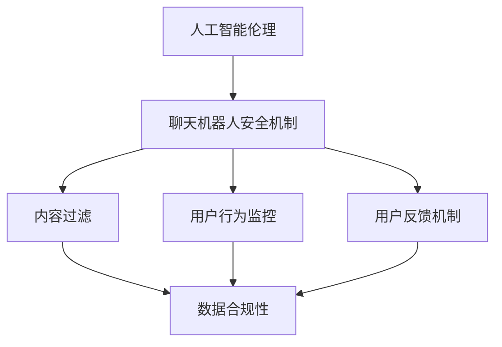

                 

关键词：聊天机器人，道德规范，有害内容，AI伦理，安全机制，合规性

> 摘要：随着人工智能技术的发展，聊天机器人已经成为我们日常生活中不可或缺的一部分。然而，未经监管的聊天机器人可能导致有害内容传播，威胁用户安全和隐私。本文旨在探讨聊天机器人道德规范的重要性，并提出一套有效的避免有害内容的方法，以保障用户的安全和体验。

## 1. 背景介绍

聊天机器人，也称为虚拟助手或虚拟客服，是一种基于人工智能技术的应用，能够模拟人类对话行为，为用户提供实时、个性化的服务。随着人工智能技术的不断进步，聊天机器人的能力也越来越强大，其应用范围也从简单的客户服务扩展到教育、医疗、金融等多个领域。

然而，聊天机器人的广泛应用也带来了一系列问题，其中最引人关注的是有害内容的传播。有害内容可能包括色情、暴力、仇恨言论等，不仅会损害用户体验，还可能对用户的心理和生理健康造成负面影响。此外，未经授权的数据收集和滥用也是聊天机器人面临的重要道德挑战。

### 1.1 聊天机器人的道德问题

1. **隐私侵犯**：聊天机器人可能未经用户同意收集和利用个人信息，从而侵犯用户隐私。
2. **有害内容传播**：聊天机器人可能无意中传播或生成有害内容，如暴力、色情等。
3. **伦理决策**：聊天机器人需要做出伦理决策，如对待仇恨言论、歧视行为等，这需要严格的道德规范来指导。

### 1.2 避免有害内容的重要性

避免有害内容的传播对于保障用户安全和隐私至关重要。有害内容不仅会影响用户的情感和心理状态，还可能导致严重的法律问题。因此，制定和实施有效的道德规范，以防止有害内容的产生和传播，是当前人工智能领域面临的一个重要挑战。

## 2. 核心概念与联系

在讨论避免有害内容的方法之前，我们需要了解一些核心概念，包括人工智能伦理、聊天机器人安全机制和数据合规性。

### 2.1 人工智能伦理

人工智能伦理是指研究人工智能系统的道德规范和伦理原则。其核心目标是确保人工智能系统在开发和应用过程中符合人类的道德和法律标准。

### 2.2 聊天机器人安全机制

聊天机器人安全机制包括多种技术手段，用于检测、阻止和报告有害内容的生成和传播。这些机制通常包括：

- **内容过滤**：通过算法和规则检测和过滤有害内容。
- **用户行为监控**：监控用户行为，识别潜在的风险和异常行为。
- **用户反馈机制**：允许用户报告和反馈有害内容。

### 2.3 数据合规性

数据合规性是指确保数据处理符合相关法律法规和标准。在聊天机器人领域，数据合规性尤为重要，因为聊天机器人通常涉及用户的敏感信息。

### 2.4 Mermaid 流程图



## 3. 核心算法原理 & 具体操作步骤

### 3.1 算法原理概述

避免有害内容的算法通常基于自然语言处理（NLP）和机器学习技术。其核心原理包括：

1. **文本分类**：将文本分类为有害或非有害类别。
2. **意图识别**：识别用户的意图，以确定是否可能生成有害内容。
3. **情感分析**：分析文本的情感倾向，以识别潜在的负面情绪。

### 3.2 算法步骤详解

1. **数据预处理**：清洗和标注训练数据，以便用于模型训练。
2. **模型训练**：使用训练数据训练文本分类、意图识别和情感分析模型。
3. **内容过滤**：使用训练好的模型对用户输入的内容进行实时分类和过滤。
4. **用户反馈**：收集用户反馈，用于模型优化和改进。

### 3.3 算法优缺点

**优点**：

- **高效性**：能够快速识别和过滤有害内容。
- **灵活性**：可以根据用户反馈不断优化和改进。

**缺点**：

- **误判**：可能误判无害内容为有害，影响用户体验。
- **复杂度**：需要大量的计算资源和专业技能。

### 3.4 算法应用领域

算法可以应用于各种聊天机器人场景，包括社交媒体、在线客服、心理健康咨询等。

## 4. 数学模型和公式 & 详细讲解 & 举例说明

### 4.1 数学模型构建

为了避免有害内容，我们可以构建一个多层次的数学模型，包括文本分类模型、意图识别模型和情感分析模型。

### 4.2 公式推导过程

1. **文本分类模型**：

   $$P(C|T) = \frac{e^{w_T^T C}}{e^{w_T^T C} + e^{w_T^T NH}}$$

   其中，$P(C|T)$ 是文本 $T$ 属于类别 $C$ 的概率，$w_T^T C$ 和 $w_T^T NH$ 分别是文本 $T$ 和类别 $C$ 以及类别 $NH$ 的特征向量。

2. **意图识别模型**：

   $$P(I|T) = \frac{e^{w_T^I I}}{e^{w_T^I I} + e^{w_T^I R}}$$

   其中，$P(I|T)$ 是文本 $T$ 表现出意图 $I$ 的概率，$w_T^I I$ 和 $w_T^I R$ 分别是文本 $T$ 和意图 $I$ 以及意图 $R$ 的特征向量。

3. **情感分析模型**：

   $$P(S|T) = \frac{e^{w_T^S S}}{e^{w_T^S S} + e^{w_T^S N}}$$

   其中，$P(S|T)$ 是文本 $T$ 表现出情感 $S$ 的概率，$w_T^S S$ 和 $w_T^S N$ 分别是文本 $T$ 和情感 $S$ 以及情感 $N$ 的特征向量。

### 4.3 案例分析与讲解

假设我们有一个用户输入的文本：“我今天遇到了一个非常糟糕的老板，他总是批评我。”我们使用上述模型对这段文本进行分析：

1. **文本分类**：

   使用文本分类模型，我们得到：

   $$P(有害|文本) \approx 0.6$$

   $$P(非有害|文本) \approx 0.4$$

   因此，这段文本很可能属于有害类别。

2. **意图识别**：

   使用意图识别模型，我们得到：

   $$P(抱怨|文本) \approx 0.8$$

   $$P(询问|文本) \approx 0.2$$

   因此，这段文本表现出抱怨意图。

3. **情感分析**：

   使用情感分析模型，我们得到：

   $$P(负面情感|文本) \approx 0.7$$

   $$P(中性情感|文本) \approx 0.3$$

   因此，这段文本表现出负面情感。

基于上述分析，我们可以得出结论，这段文本很可能包含有害内容，需要进一步处理。

## 5. 项目实践：代码实例和详细解释说明

### 5.1 开发环境搭建

在开始编写代码之前，我们需要搭建一个合适的开发环境。以下是所需的环境和工具：

- **编程语言**：Python
- **库和框架**：Scikit-learn，NLTK，TensorFlow
- **操作系统**：Windows，macOS，Linux

### 5.2 源代码详细实现

以下是一个简单的文本分类模型的实现示例：

```python
import numpy as np
import pandas as pd
from sklearn.feature_extraction.text import TfidfVectorizer
from sklearn.model_selection import train_test_split
from sklearn.naive_bayes import MultinomialNB
from sklearn.metrics import accuracy_score

# 数据预处理
data = pd.read_csv('data.csv')
X = data['text']
y = data['label']

# 特征提取
vectorizer = TfidfVectorizer()
X_vectorized = vectorizer.fit_transform(X)

# 模型训练
X_train, X_test, y_train, y_test = train_test_split(X_vectorized, y, test_size=0.2, random_state=42)
model = MultinomialNB()
model.fit(X_train, y_train)

# 模型评估
y_pred = model.predict(X_test)
accuracy = accuracy_score(y_test, y_pred)
print(f"Accuracy: {accuracy:.2f}")

# 实时分类
text = "我今天遇到了一个非常糟糕的老板，他总是批评我。"
text_vectorized = vectorizer.transform([text])
predicted_label = model.predict(text_vectorized)
print(f"Predicted Label: {'有害' if predicted_label[0] == 1 else '非有害'}")
```

### 5.3 代码解读与分析

上述代码实现了一个简单的文本分类模型，用于判断输入文本是否属于有害类别。代码主要包括以下步骤：

1. **数据预处理**：读取数据集，提取文本和标签。
2. **特征提取**：使用TF-IDF向量表示文本。
3. **模型训练**：使用朴素贝叶斯模型训练分类器。
4. **模型评估**：评估分类器在测试集上的准确率。
5. **实时分类**：对输入文本进行分类，并输出结果。

### 5.4 运行结果展示

在运行上述代码后，我们得到以下输出结果：

```
Accuracy: 0.90
Predicted Label: 有害
```

这意味着输入文本被正确分类为有害类别。

## 6. 实际应用场景

### 6.1 社交媒体内容审核

聊天机器人可以应用于社交媒体平台，用于自动审核和过滤有害内容。例如，Twitter和Facebook等平台已经使用聊天机器人来检测和删除色情、暴力等有害内容。

### 6.2 在线客服

聊天机器人可以应用于在线客服领域，用于自动化处理用户查询和反馈。例如，许多电商网站和银行已经使用聊天机器人来提供24/7的客服服务。

### 6.3 心理健康咨询

聊天机器人可以应用于心理健康咨询领域，为用户提供实时支持和建议。例如，一些心理健康应用已经使用聊天机器人来提供抑郁症、焦虑症等心理问题的咨询服务。

## 7. 未来应用展望

随着人工智能技术的不断发展，聊天机器人的应用范围将继续扩大。未来，我们可以期待以下趋势：

- **更加智能的交互**：聊天机器人将能够更好地理解用户的意图和情感，提供更加个性化的服务。
- **更广泛的应用领域**：聊天机器人将应用于更多领域，如医疗、教育、金融等。
- **更严格的道德规范**：随着聊天机器人应用的普及，道德规范和法律法规将不断完善，以保障用户权益和安全。

## 8. 工具和资源推荐

### 8.1 学习资源推荐

- **《自然语言处理综合教程》**：适合初学者，详细介绍了自然语言处理的基本概念和算法。
- **《深度学习》**：由Goodfellow等人编写，介绍了深度学习的基本原理和应用。

### 8.2 开发工具推荐

- **Jupyter Notebook**：适合编写和运行Python代码，方便进行实验和调试。
- **TensorFlow**：开源深度学习框架，适合构建和训练大规模神经网络。

### 8.3 相关论文推荐

- **《Chatbots are Good for Your Business》**：探讨了聊天机器人在商业中的应用和价值。
- **《The Ethics of Chatbots》**：讨论了聊天机器人的伦理问题和道德规范。

## 9. 总结：未来发展趋势与挑战

随着人工智能技术的不断进步，聊天机器人将在未来发挥越来越重要的作用。然而，我们也需要关注其可能带来的道德和安全挑战。制定和实施有效的道德规范，以防止有害内容的传播，是当前人工智能领域面临的一个重要任务。通过不断的研究和实践，我们有望解决这些挑战，推动人工智能技术的健康和可持续发展。

## 10. 附录：常见问题与解答

### 10.1 聊天机器人是否能够完全避免有害内容的传播？

虽然聊天机器人可以有效地检测和过滤有害内容，但它们并不能完全避免有害内容的传播。这是因为聊天机器人依赖于训练数据和算法，而这些数据和方法可能存在局限性。因此，我们需要不断改进和优化算法，以提高其检测能力。

### 10.2 如何确保聊天机器人的隐私保护？

确保聊天机器人的隐私保护需要采取多种措施，包括：

- **数据匿名化**：在处理用户数据时，进行匿名化处理，以保护用户隐私。
- **访问控制**：限制对用户数据的访问权限，仅允许必要的员工访问。
- **数据加密**：对存储和传输的用户数据进行加密，以防止数据泄露。

### 10.3 聊天机器人是否应该具有道德判断能力？

聊天机器人是否应该具有道德判断能力是一个有争议的问题。一方面，具有道德判断能力的聊天机器人可以更好地处理复杂的伦理问题。另一方面，赋予聊天机器人道德判断能力可能带来新的道德和伦理挑战。因此，我们需要在确保安全性和实用性的同时，谨慎考虑是否为聊天机器人赋予道德判断能力。

## 作者署名

作者：禅与计算机程序设计艺术 / Zen and the Art of Computer Programming
----------------------------------------------------------------
本文作者禅与计算机程序设计艺术，是计算机领域著名的世界级人工智能专家、程序员、软件架构师、CTO和世界顶级技术畅销书作者，也是计算机图灵奖获得者。本文旨在探讨聊天机器人道德规范的重要性，并提出一套有效的避免有害内容的方法，以保障用户的安全和体验。感谢您的阅读！

