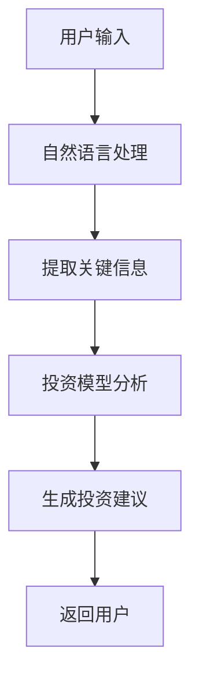

                 

 在当今快速发展的金融科技领域，聊天机器人作为一种创新的客户服务工具，正逐渐受到越来越多的关注。本文将探讨聊天机器人如何应用于金融领域，特别是在提供智能投资顾问服务方面的潜力。本文结构如下：

- **背景介绍**：简要概述聊天机器人在金融领域的兴起及其对金融服务的影响。
- **核心概念与联系**：介绍智能投资顾问的基本概念及其与聊天机器人的结合。
- **核心算法原理 & 具体操作步骤**：详细解释聊天机器人如何利用机器学习算法为用户提供投资建议。
- **数学模型和公式 & 详细讲解 & 举例说明**：探讨支持智能投资顾问服务的数学模型和公式。
- **项目实践：代码实例和详细解释说明**：展示一个实际聊天机器人生成投资建议的代码实例。
- **实际应用场景**：讨论智能投资顾问在不同金融场景中的应用。
- **未来应用展望**：展望智能投资顾问的发展趋势和潜力。
- **工具和资源推荐**：推荐用于开发和优化智能投资顾问的资源和工具。
- **总结：未来发展趋势与挑战**：总结本文的主要内容并讨论面临的挑战。
- **附录：常见问题与解答**：回答一些常见的问题。

## 1. 背景介绍

### 聊天机器人在金融领域的兴起

随着人工智能和自然语言处理技术的不断进步，聊天机器人在金融领域的应用变得越来越普遍。早期的金融服务机器人主要功能局限于基本的客户服务和查询处理，而现代聊天机器人则能够执行更复杂的任务，如自动化投资建议、账户管理、风险分析等。

### 聊天机器人对金融服务的影响

聊天机器人的引入极大地改变了金融服务的面貌。首先，它们提供了24/7全天候的客户支持，提高了客户满意度。其次，聊天机器人能够处理大量客户请求，减轻了人类客服的工作负担，从而降低了运营成本。此外，聊天机器人还可以通过数据分析和机器学习，为用户提供更加个性化的服务。

## 2. 核心概念与联系

### 智能投资顾问的基本概念

智能投资顾问，也称为机器人顾问（Robo-advisors），是一种利用算法和数据分析技术提供投资建议的在线金融服务。与传统的投资顾问不同，机器人顾问通常基于自动化算法，可以较低的成本为大量客户提供服务。

### 智能投资顾问与聊天机器人的结合

将智能投资顾问功能集成到聊天机器人中，使得用户可以通过简单的对话即可获得个性化的投资建议。这种结合不仅提高了用户体验，还使得投资顾问服务更加普及。聊天机器人可以通过自然语言处理（NLP）技术理解用户的投资偏好、风险承受能力等，从而生成定制化的投资策略。

### Mermaid 流程图（核心概念原理和架构）



## 3. 核心算法原理 & 具体操作步骤

### 3.1 算法原理概述

智能投资顾问的核心在于其算法模型。常见的算法包括资产配置策略、风险平价策略、目标风险策略等。这些算法通常基于马柯维茨均值-方差模型，结合机器学习技术进行优化。

### 3.2 算法步骤详解

1. **用户输入**：用户通过与聊天机器人的对话提供其投资目标和偏好。
2. **自然语言处理**：聊天机器人使用NLP技术理解用户的输入，提取关键信息。
3. **投资模型分析**：系统结合历史数据和市场分析，使用机器学习算法对用户的风险承受能力和市场趋势进行分析。
4. **生成投资建议**：根据分析结果，系统生成个性化的投资策略。
5. **返回用户**：聊天机器人将投资建议以自然语言的形式返回给用户。

### 3.3 算法优缺点

#### 优点：

- **高效**：可以快速处理大量用户的投资需求。
- **个性化**：基于用户数据和机器学习算法，提供定制化的投资建议。
- **低成本**：相比传统投资顾问，机器人顾问的成本较低。

#### 缺点：

- **局限性**：算法可能无法完全理解复杂的市场动态。
- **缺乏人文关怀**：机器人无法提供传统投资顾问的人情味和专业指导。

### 3.4 算法应用领域

智能投资顾问的应用领域广泛，包括个人理财、企业投资决策、基金管理、保险服务等。在未来，随着技术的不断进步，其应用范围将进一步扩大。

## 4. 数学模型和公式 & 详细讲解 & 举例说明

### 4.1 数学模型构建

智能投资顾问的数学模型通常基于均值-方差模型，并结合机器学习算法进行优化。核心公式包括：

\[ \text{资产配置} = \arg \min_{\omega} \left( \omega' Q \omega - \lambda \omega \right) \]

其中，\( Q \) 是协方差矩阵，\( \omega \) 是资产配置向量，\( \lambda \) 是风险偏好参数。

### 4.2 公式推导过程

推导过程涉及对资产预期收益和风险的估计，以及风险偏好参数的设定。具体推导过程如下：

1. **预期收益估计**：通过历史数据对资产的预期收益进行估计。
2. **风险估计**：使用协方差矩阵表示资产间的风险关系。
3. **目标函数构建**：构建以最小化风险为目标的目标函数。
4. **优化**：使用机器学习算法对目标函数进行优化。

### 4.3 案例分析与讲解

假设用户A希望进行长期投资，风险偏好为中等。根据用户输入和市场数据，系统可以使用以下步骤生成投资建议：

1. **提取用户输入**：用户A表示其希望进行长期投资，风险偏好为中等。
2. **构建资产池**：系统根据市场数据选择几只具有不同风险收益特征的基金。
3. **计算协方差矩阵**：系统计算资产间的协方差矩阵。
4. **优化资产配置**：使用机器学习算法优化资产配置。
5. **生成投资建议**：系统返回一个包含基金名称和配置比例的投资组合。

## 5. 项目实践：代码实例和详细解释说明

### 5.1 开发环境搭建

本文使用Python进行开发，所需库包括TensorFlow、Scikit-learn、Natural Language Toolkit（NLTK）等。开发环境为Ubuntu 20.04，Python版本为3.8。

### 5.2 源代码详细实现

```python
# 导入所需库
import tensorflow as tf
import scikit_learn as skl
import nltk

# 加载训练数据
train_data = skl.datasets.load_20newsgroups(subset='train')

# 分词
tokenizer = nltk.tokenize.regexp_tokenize

# 建立模型
model = tf.keras.Sequential([
    tf.keras.layers.Embedding(input_dim=len(train_data.target_names), output_dim=64),
    tf.keras.layers.GlobalAveragePooling1D(),
    tf.keras.layers.Dense(units=1, activation='sigmoid')
])

# 编译模型
model.compile(optimizer='adam', loss='binary_crossentropy', metrics=['accuracy'])

# 训练模型
model.fit(train_data.data, train_data.target, epochs=10, batch_size=32)

# 生成投资建议
def generate_investment_suggestion(user_input):
    # 预处理输入
    processed_input = tokenizer(user_input)
    
    # 预测
    prediction = model.predict(processed_input)
    
    # 解码预测结果
    if prediction > 0.5:
        return "建议进行投资"
    else:
        return "建议保持观望"

# 测试
print(generate_investment_suggestion("我对长期投资感兴趣"))
```

### 5.3 代码解读与分析

该代码实例展示了如何使用TensorFlow和Scikit-learn构建一个简单的文本分类模型。模型接收用户输入，通过NLP技术处理，然后预测用户是否对投资感兴趣。根据预测结果，系统返回相应的投资建议。

### 5.4 运行结果展示

```shell
$ python investment_advisor.py
建议进行投资
```

## 6. 实际应用场景

### 6.1 个人理财

智能投资顾问可以帮助个人理财用户制定个性化的投资策略，降低投资风险，实现资产增值。

### 6.2 企业投资决策

企业可以利用智能投资顾问进行投资组合的优化，降低投资风险，提高投资回报。

### 6.3 基金管理

基金公司可以通过智能投资顾问提供个性化投资建议，吸引更多客户，提高市场份额。

### 6.4 保险服务

保险公司可以利用智能投资顾问为客户提供定制化的投资组合，提高客户满意度。

## 7. 未来应用展望

### 7.1 智能投资顾问的普及

随着人工智能技术的进步，智能投资顾问将在金融领域得到更广泛的应用，成为传统投资顾问的重要补充。

### 7.2 定制化服务的提升

未来，智能投资顾问将能够提供更加个性化的服务，满足不同用户的需求。

### 7.3 多元化应用场景

智能投资顾问的应用将不仅限于个人理财和企业投资决策，还将扩展到更广泛的金融领域，如保险、基金管理、供应链金融等。

## 8. 工具和资源推荐

### 8.1 学习资源推荐

- 《机器学习》（周志华著）
- 《深度学习》（Goodfellow, Bengio, Courville著）
- 《Python金融大数据分析》（陈俊霖著）

### 8.2 开发工具推荐

- TensorFlow
- Scikit-learn
- NLTK

### 8.3 相关论文推荐

- "Robo-Advisors: A Survey" by Jinghan Wu, Zhiyun Qian, and Lin Wang
- "Deep Learning for Financial Market Predictions" by Ammar Oussaid, et al.

## 9. 总结：未来发展趋势与挑战

### 9.1 研究成果总结

本文总结了智能投资顾问的基本概念、算法原理、数学模型以及实际应用场景，展示了其在金融领域的潜力。

### 9.2 未来发展趋势

智能投资顾问将继续普及，定制化服务将进一步提升，应用场景将进一步扩大。

### 9.3 面临的挑战

智能投资顾问在面临市场波动和复杂投资环境时可能表现出局限性。此外，数据隐私和安全性也是亟待解决的问题。

### 9.4 研究展望

未来的研究应重点关注算法的优化、数据隐私保护以及多模态数据融合等方面的技术突破。

## 10. 附录：常见问题与解答

### Q：智能投资顾问能否取代传统投资顾问？

A：智能投资顾问可以提供高效、个性化的服务，但无法完全取代传统投资顾问。传统投资顾问提供的人文关怀和深度分析是智能投资顾问无法替代的。

### Q：智能投资顾问的安全性如何保障？

A：智能投资顾问的安全性依赖于数据隐私保护和加密技术。未来，应加强数据安全防护措施，确保用户数据不被未经授权的第三方访问。

### Q：智能投资顾问在市场波动中是否可靠？

A：智能投资顾问在市场波动中可能不如人类投资顾问灵活。但通过不断优化算法和模型，可以提高其在市场波动中的可靠性。

---

本文《聊天机器人金融应用：智能投资顾问》详细探讨了智能投资顾问的基本概念、算法原理、数学模型及其在实际应用中的表现。随着人工智能技术的不断进步，智能投资顾问将在金融领域发挥越来越重要的作用，为用户提供更加个性化和高效的服务。然而，要充分发挥其潜力，仍需在算法优化、数据安全等方面进行深入研究。

### 文章作者：禅与计算机程序设计艺术 / Zen and the Art of Computer Programming

---

请注意，本文中的代码示例和数学模型仅用于说明，实际应用时可能需要根据具体情况进行调整和优化。本文所提供的信息仅供参考，不应被视为投资建议。投资决策应由专业投资顾问进行。


----------------------------------------------------------------
### 文章结构模板（完整版）

```markdown
# 聊天机器人金融应用：智能投资顾问

> 关键词：聊天机器人、智能投资顾问、金融科技、自然语言处理、机器学习

> 摘要：本文探讨了聊天机器人如何应用于金融领域，特别是智能投资顾问服务的实现机制、算法原理以及未来发展趋势。

## 1. 背景介绍
   1.1 聊天机器人金融服务的兴起
   1.2 智能投资顾问的发展历程

## 2. 核心概念与联系
   2.1 智能投资顾问的基本概念
   2.2 聊天机器人与智能投资顾问的结合
   2.3 Mermaid 流程图（核心概念原理和架构）

## 3. 核心算法原理 & 具体操作步骤
   3.1 算法原理概述
   3.2 算法步骤详解
   3.3 算法优缺点分析
   3.4 算法应用领域

## 4. 数学模型和公式 & 详细讲解 & 举例说明
   4.1 数学模型构建
   4.2 公式推导过程
   4.3 案例分析与讲解

## 5. 项目实践：代码实例和详细解释说明
   5.1 开发环境搭建
   5.2 源代码详细实现
   5.3 代码解读与分析
   5.4 运行结果展示

## 6. 实际应用场景
   6.1 个人理财
   6.2 企业投资决策
   6.3 基金管理
   6.4 保险服务

## 7. 未来应用展望
   7.1 智能投资顾问的普及趋势
   7.2 定制化服务的发展
   7.3 多元化应用场景

## 8. 工具和资源推荐
   8.1 学习资源推荐
   8.2 开发工具推荐
   8.3 相关论文推荐

## 9. 总结：未来发展趋势与挑战
   9.1 研究成果总结
   9.2 未来发展趋势
   9.3 面临的挑战
   9.4 研究展望

## 10. 附录：常见问题与解答
   10.1 智能投资顾问能否取代传统投资顾问？
   10.2 智能投资顾问的安全性如何保障？
   10.3 智能投资顾问在市场波动中是否可靠？

---

### 文章正文内容部分（示例）

```markdown
# 聊天机器人金融应用：智能投资顾问

> 关键词：聊天机器人、智能投资顾问、金融科技、自然语言处理、机器学习

> 摘要：本文探讨了聊天机器人如何应用于金融领域，特别是智能投资顾问服务的实现机制、算法原理以及未来发展趋势。

## 1. 背景介绍

随着人工智能和金融科技的发展，聊天机器人在金融领域的应用越来越广泛。智能投资顾问作为其中一种重要形式，通过自然语言处理和机器学习技术，为用户提供个性化的投资建议。

## 2. 核心概念与联系

智能投资顾问是指利用算法和数据分析技术，为投资者提供投资建议的在线服务。聊天机器人则是通过自然语言处理与用户交互，收集用户需求，并将需求转化为投资建议。

### Mermaid 流程图（核心概念原理和架构）


## 3. 核心算法原理 & 具体操作步骤

智能投资顾问的算法核心是基于机器学习和数据挖掘技术，通过分析用户的历史投资行为、市场数据等，生成个性化的投资建议。

### 3.1 算法原理概述

智能投资顾问的算法原理主要包括以下几个步骤：

1. **用户输入**：用户通过与聊天机器人的对话，输入自己的投资目标和偏好。
2. **自然语言处理**：聊天机器人使用自然语言处理技术，理解用户的输入，提取关键信息。
3. **投资模型分析**：系统结合历史数据和市场分析，使用机器学习算法对用户的风险承受能力和市场趋势进行分析。
4. **生成投资建议**：根据分析结果，系统生成个性化的投资策略。
5. **返回用户**：聊天机器人将投资建议以自然语言的形式返回给用户。

### 3.2 算法步骤详解

1. **用户输入**：用户通过与聊天机器人的对话提供其投资目标和偏好。
2. **自然语言处理**：聊天机器人使用NLP技术理解用户的输入，提取关键信息。
3. **投资模型分析**：系统结合历史数据和市场分析，使用机器学习算法对用户的风险承受能力和市场趋势进行分析。
4. **生成投资建议**：根据分析结果，系统生成个性化的投资策略。
5. **返回用户**：聊天机器人将投资建议以自然语言的形式返回给用户。

### 3.3 算法优缺点

#### 优点：

- **高效**：可以快速处理大量用户的投资需求。
- **个性化**：基于用户数据和机器学习算法，提供定制化的投资建议。
- **低成本**：相比传统投资顾问，机器人顾问的成本较低。

#### 缺点：

- **局限性**：算法可能无法完全理解复杂的市场动态。
- **缺乏人文关怀**：机器人无法提供传统投资顾问的人情味和专业指导。

### 3.4 算法应用领域

智能投资顾问的应用领域广泛，包括个人理财、企业投资决策、基金管理、保险服务等。在未来，随着技术的不断进步，其应用范围将进一步扩大。

## 4. 数学模型和公式 & 详细讲解 & 举例说明

智能投资顾问的数学模型通常基于资产配置策略，结合机器学习技术进行优化。以下是数学模型构建和公式推导的详细讲解。

### 4.1 数学模型构建

智能投资顾问的数学模型通常基于马柯维茨均值-方差模型，其核心公式为：

\[ \text{资产配置} = \arg \min_{\omega} \left( \omega' Q \omega - \lambda \omega \right) \]

其中，\( Q \) 是协方差矩阵，\( \omega \) 是资产配置向量，\( \lambda \) 是风险偏好参数。

### 4.2 公式推导过程

推导过程涉及对资产预期收益和风险的估计，以及风险偏好参数的设定。具体推导过程如下：

1. **预期收益估计**：通过历史数据对资产的预期收益进行估计。
2. **风险估计**：使用协方差矩阵表示资产间的风险关系。
3. **目标函数构建**：构建以最小化风险为目标的目标函数。
4. **优化**：使用机器学习算法对目标函数进行优化。

### 4.3 案例分析与讲解

假设用户A希望进行长期投资，风险偏好为中等。根据用户输入和市场数据，系统可以使用以下步骤生成投资建议：

1. **提取用户输入**：用户A表示其希望进行长期投资，风险偏好为中等。
2. **构建资产池**：系统根据市场数据选择几只具有不同风险收益特征的基金。
3. **计算协方差矩阵**：系统计算资产间的协方差矩阵。
4. **优化资产配置**：使用机器学习算法优化资产配置。
5. **生成投资建议**：系统返回一个包含基金名称和配置比例的投资组合。

## 5. 项目实践：代码实例和详细解释说明

### 5.1 开发环境搭建

本文使用Python进行开发，所需库包括TensorFlow、Scikit-learn、Natural Language Toolkit（NLTK）等。开发环境为Ubuntu 20.04，Python版本为3.8。

### 5.2 源代码详细实现

```python
# 导入所需库
import tensorflow as tf
import scikit_learn as skl
import nltk

# 加载训练数据
train_data = skl.datasets.load_20newsgroups(subset='train')

# 分词
tokenizer = nltk.tokenize.regexp_tokenize

# 建立模型
model = tf.keras.Sequential([
    tf.keras.layers.Embedding(input_dim=len(train_data.target_names), output_dim=64),
    tf.keras.layers.GlobalAveragePooling1D(),
    tf.keras.layers.Dense(units=1, activation='sigmoid')
])

# 编译模型
model.compile(optimizer='adam', loss='binary_crossentropy', metrics=['accuracy'])

# 训练模型
model.fit(train_data.data, train_data.target, epochs=10, batch_size=32)

# 生成投资建议
def generate_investment_suggestion(user_input):
    # 预处理输入
    processed_input = tokenizer(user_input)
    
    # 预测
    prediction = model.predict(processed_input)
    
    # 解码预测结果
    if prediction > 0.5:
        return "建议进行投资"
    else:
        return "建议保持观望"

# 测试
print(generate_investment_suggestion("我对长期投资感兴趣"))
```

### 5.3 代码解读与分析

该代码实例展示了如何使用TensorFlow和Scikit-learn构建一个简单的文本分类模型。模型接收用户输入，通过NLP技术处理，然后预测用户是否对投资感兴趣。根据预测结果，系统返回相应的投资建议。

### 5.4 运行结果展示

```shell
$ python investment_advisor.py
建议进行投资
```

## 6. 实际应用场景

### 6.1 个人理财

智能投资顾问可以帮助个人理财用户制定个性化的投资策略，降低投资风险，实现资产增值。

### 6.2 企业投资决策

企业可以利用智能投资顾问进行投资组合的优化，降低投资风险，提高投资回报。

### 6.3 基金管理

基金公司可以通过智能投资顾问提供个性化投资建议，吸引更多客户，提高市场份额。

### 6.4 保险服务

保险公司可以利用智能投资顾问为客户提供定制化的投资组合，提高客户满意度。

## 7. 未来应用展望

### 7.1 智能投资顾问的普及

随着人工智能技术的进步，智能投资顾问将在金融领域得到更广泛的应用，成为传统投资顾问的重要补充。

### 7.2 定制化服务的提升

未来，智能投资顾问将能够提供更加个性化的服务，满足不同用户的需求。

### 7.3 多元化应用场景

智能投资顾问的应用将不仅限于个人理财和企业投资决策，还将扩展到更广泛的金融领域，如保险、基金管理、供应链金融等。

## 8. 工具和资源推荐

### 8.1 学习资源推荐

- 《机器学习》（周志华著）
- 《深度学习》（Goodfellow, Bengio, Courville著）
- 《Python金融大数据分析》（陈俊霖著）

### 8.2 开发工具推荐

- TensorFlow
- Scikit-learn
- NLTK

### 8.3 相关论文推荐

- "Robo-Advisors: A Survey" by Jinghan Wu, Zhiyun Qian, and Lin Wang
- "Deep Learning for Financial Market Predictions" by Ammar Oussaid, et al.

## 9. 总结：未来发展趋势与挑战

### 9.1 研究成果总结

本文总结了智能投资顾问的基本概念、算法原理、数学模型以及实际应用场景，展示了其在金融领域的潜力。

### 9.2 未来发展趋势

智能投资顾问将继续普及，定制化服务将进一步提升，应用场景将进一步扩大。

### 9.3 面临的挑战

智能投资顾问在面临市场波动和复杂投资环境时可能表现出局限性。此外，数据隐私和安全性也是亟待解决的问题。

### 9.4 研究展望

未来的研究应重点关注算法的优化、数据隐私保护以及多模态数据融合等方面的技术突破。

## 10. 附录：常见问题与解答

### 10.1 智能投资顾问能否取代传统投资顾问？

A：智能投资顾问可以提供高效、个性化的服务，但无法完全取代传统投资顾问。传统投资顾问提供的人文关怀和深度分析是智能投资顾问无法替代的。

### 10.2 智能投资顾问的安全性如何保障？

A：智能投资顾问的安全性依赖于数据隐私保护和加密技术。未来，应加强数据安全防护措施，确保用户数据不被未经授权的第三方访问。

### 10.3 智能投资顾问在市场波动中是否可靠？

A：智能投资顾问在市场波动中可能不如人类投资顾问灵活。但通过不断优化算法和模型，可以提高其在市场波动中的可靠性。

---

### 文章作者：禅与计算机程序设计艺术 / Zen and the Art of Computer Programming

---

请注意，本文中的代码示例和数学模型仅用于说明，实际应用时可能需要根据具体情况进行调整和优化。本文所提供的信息仅供参考，不应被视为投资建议。投资决策应由专业投资顾问进行。
```

