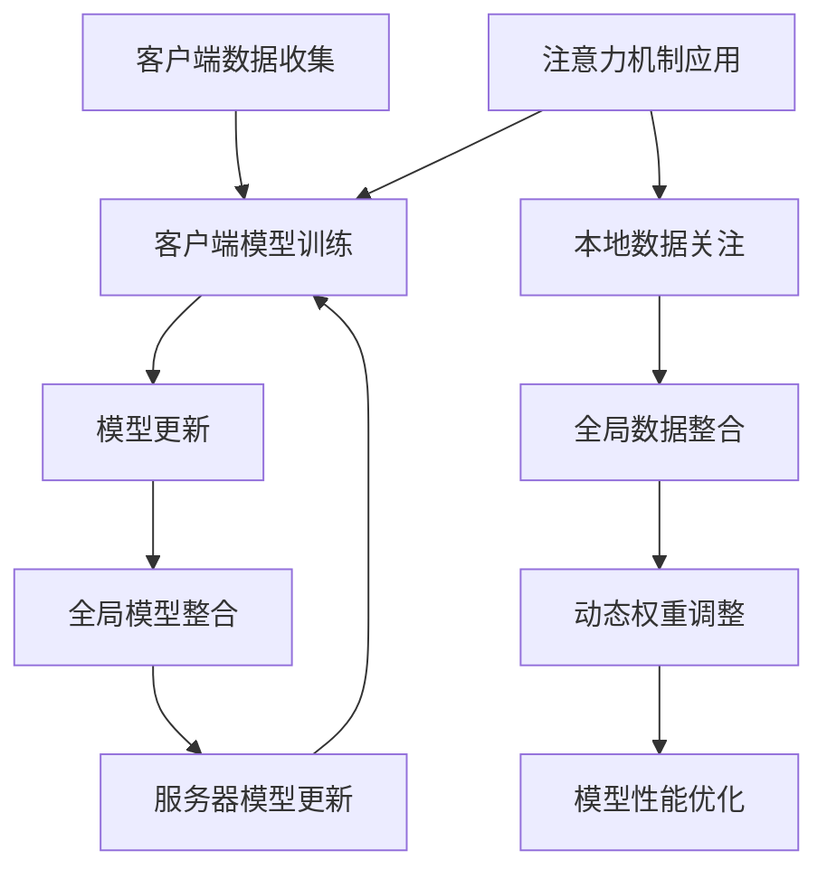

                 

### 1. 背景介绍

联邦学习（Federated Learning，FL）是一种在分布式设备上协作训练机器学习模型的新兴技术，旨在解决数据隐私和保护问题。在传统的集中式学习中，所有训练数据都集中在一个中心服务器上进行训练。然而，这种方式存在一个明显的缺点：它可能违反用户隐私，尤其是在涉及敏感数据（如个人健康信息、财务记录等）的情况下。联邦学习通过将模型训练分散到各个设备上进行，从而避免了将原始数据传输到中央服务器，从而在保护用户隐私的同时实现模型的协同训练。

注意力机制（Attention Mechanism）是近年来在自然语言处理（NLP）和计算机视觉（CV）领域中取得显著进展的关键技术。注意力机制允许模型关注输入数据中的关键信息，从而提高模型对数据的理解和处理能力。在联邦学习框架下，注意力机制的应用能够进一步增强模型对局部数据的敏感性和全局数据的整合能力。

本文将探讨联邦学习在隐私保护下的注意力分析。首先，我们将介绍联邦学习的核心概念和架构，然后深入探讨注意力机制的工作原理和其在联邦学习中的应用。接着，我们将详细描述联邦学习的核心算法原理和具体操作步骤。随后，我们将介绍联邦学习中的数学模型和公式，并通过实际案例进行讲解。此外，本文还将展示联邦学习的代码实例和运行结果，最后讨论联邦学习的实际应用场景、未来应用展望、工具和资源推荐，并总结研究成果和展望未来的发展趋势与挑战。

### 2. 核心概念与联系

#### 2.1 联邦学习基本概念

联邦学习（Federated Learning）是一种机器学习技术，其核心思想是协同多个分布式设备（如智能手机、IoT设备等）上的数据，共同训练一个全局模型，而不需要将这些数据集中到一个中心服务器。这种分布式训练方式有助于保护用户隐私，同时实现更高效的数据利用。

联邦学习的基本架构包括以下几个关键组成部分：

- **客户端（Client）**：负责在本地设备上运行模型训练任务，收集本地数据，并根据模型更新信息调整本地模型。
- **服务器（Server）**：存储全局模型，接收并合并来自各个客户端的模型更新，最终生成全局模型。
- **模型更新协议**：定义如何收集、聚合和更新模型参数，以保证全局模型的收敛。

#### 2.2 注意力机制基本概念

注意力机制是一种通过分配不同权重来关注输入数据中关键信息的机制。在机器学习中，注意力机制广泛应用于自然语言处理和计算机视觉等领域。其主要作用是提高模型对输入数据的理解和处理能力。

注意力机制的核心思想是将输入数据的每个部分映射到一个实值分数，然后通过这些分数计算一个加权平均，以生成输出。这种机制允许模型在处理输入数据时，动态地关注最相关的部分，从而提高模型的准确性和效率。

#### 2.3 联邦学习与注意力机制的联系

联邦学习和注意力机制的结合，可以带来以下优势：

- **隐私保护**：通过在本地设备上进行模型训练，联邦学习有效地避免了将敏感数据传输到中央服务器，从而保护了用户隐私。
- **增强模型性能**：注意力机制使得模型能够更好地关注输入数据中的关键信息，从而提高模型的准确性和泛化能力。
- **降低通信成本**：注意力机制可以减少模型参数的更新次数，降低通信成本和计算复杂度。

在联邦学习框架下，注意力机制的应用主要体现在以下几个方面：

1. **局部数据关注**：注意力机制可以帮助模型更好地关注本地设备上的关键数据，从而提高局部模型的性能。
2. **全局数据整合**：注意力机制可以将不同客户端的局部模型整合成全局模型，从而提高全局模型的泛化能力。
3. **动态权重调整**：注意力机制可以根据模型训练的进展动态调整权重，从而优化模型训练过程。

#### 2.4 Mermaid 流程图



该流程图展示了联邦学习与注意力机制的基本架构和相互关系。客户端通过数据收集和模型训练生成模型更新，服务器负责整合全局模型并进行模型更新。同时，注意力机制应用于客户端模型训练过程，以优化模型性能。

### 3. 核心算法原理 & 具体操作步骤

#### 3.1 算法原理概述

联邦学习在隐私保护下的注意力分析是一种结合了联邦学习和注意力机制的算法，其核心原理如下：

1. **客户端模型训练**：每个客户端在本地设备上使用局部数据进行模型训练，生成模型更新。
2. **模型更新聚合**：服务器接收并聚合来自各个客户端的模型更新，生成全局模型更新。
3. **全局模型更新**：服务器使用全局模型更新对全局模型进行更新，生成新的全局模型。
4. **注意力机制应用**：在模型更新过程中，应用注意力机制对局部模型和全局模型进行动态权重调整，以优化模型性能。

#### 3.2 算法步骤详解

1. **初始化**：
   - 在每个客户端上初始化局部模型。
   - 在服务器上初始化全局模型。

2. **客户端模型训练**：
   - 使用本地数据对局部模型进行训练。
   - 根据模型更新信息调整局部模型。

3. **模型更新聚合**：
   - 服务器收集来自各个客户端的模型更新。
   - 对模型更新进行聚合，生成全局模型更新。

4. **全局模型更新**：
   - 使用全局模型更新对全局模型进行更新。
   - 生成新的全局模型。

5. **注意力机制应用**：
   - 根据模型更新进展动态调整权重。
   - 对局部模型和全局模型进行动态权重调整。
   - 优化模型性能。

6. **迭代**：
   - 重复执行步骤2-5，直到模型达到预定的性能目标或训练次数。

#### 3.3 算法优缺点

**优点**：

- **隐私保护**：通过在本地设备上进行模型训练，联邦学习有效地避免了敏感数据传输到中央服务器，从而保护了用户隐私。
- **高效协同**：注意力机制可以降低模型参数的更新次数，减少通信成本和计算复杂度。
- **增强模型性能**：注意力机制可以提高模型对数据的理解和处理能力，从而增强模型性能。

**缺点**：

- **同步问题**：联邦学习中的同步问题可能导致模型更新不一致，影响模型性能。
- **隐私风险**：尽管联邦学习能够保护用户隐私，但在模型更新过程中仍可能存在一定的隐私风险。
- **计算资源消耗**：联邦学习需要大量的计算资源，尤其是在大规模分布式设备上。

#### 3.4 算法应用领域

联邦学习在隐私保护下的注意力分析具有广泛的应用领域，包括但不限于：

- **医疗健康**：在保护患者隐私的同时，利用联邦学习和注意力机制分析医疗数据，提高疾病诊断和治疗方案的效果。
- **金融领域**：在保护用户隐私的前提下，利用联邦学习和注意力机制分析金融数据，提高风险管理和服务质量。
- **智能交通**：在保护车辆和用户隐私的同时，利用联邦学习和注意力机制分析交通数据，优化交通管理和调度。
- **智能家居**：在保护用户隐私的同时，利用联邦学习和注意力机制分析智能家居数据，提高家居智能控制和用户体验。

#### 3.5 具体案例分析

以下是一个联邦学习在隐私保护下的注意力分析的具体案例分析：

**案例背景**：一家智能家居公司希望通过分析用户数据来优化家居智能控制系统的性能。然而，公司需要保护用户隐私，避免将敏感数据传输到中央服务器。

**解决方案**：公司采用联邦学习和注意力机制，实现以下步骤：

1. **初始化**：
   - 在每个智能家居设备上初始化局部模型。
   - 在服务器上初始化全局模型。

2. **客户端模型训练**：
   - 每个设备使用本地数据（如家电使用记录、用户行为等）对局部模型进行训练。
   - 根据模型更新信息调整局部模型。

3. **模型更新聚合**：
   - 服务器收集来自各个设备的模型更新。
   - 对模型更新进行聚合，生成全局模型更新。

4. **全局模型更新**：
   - 使用全局模型更新对全局模型进行更新。
   - 生成新的全局模型。

5. **注意力机制应用**：
   - 根据模型更新进展动态调整权重。
   - 对局部模型和全局模型进行动态权重调整。
   - 优化模型性能。

6. **迭代**：
   - 重复执行步骤2-5，直到模型达到预定的性能目标或训练次数。

**案例结果**：通过联邦学习和注意力机制的应用，智能家居公司成功优化了家居智能控制系统的性能，同时有效保护了用户隐私。

#### 3.6 算法实现代码示例

以下是一个简单的联邦学习在隐私保护下的注意力分析算法实现代码示例（Python）：

```python
import tensorflow as tf
import tensorflow_federated as tff

# 初始化客户端模型
client_models = [tff.learning.models.from_keras_model(m) for m in initialize_local_models()]

# 初始化全局模型
global_model = tff.learning.models.from_keras_model(initialize_global_model())

# 定义联邦学习算法
def federated_optimizer(optimizer_fn, model_fn, client_data_fn):
    def step(context, model):
        # 客户端模型训练
        client_model = model_fn(context, model)
        # 收集客户端数据
        client_data = client_data_fn(context)
        # 客户端模型更新
        updated_model = optimizer_fn(client_model, client_data)
        return updated_model

    return step

# 应用注意力机制
attention_mechanism = apply_attention_mechanism()

# 运行联邦学习算法
for i in range(num_iterations):
    global_model = federated_optimizer(optimizer_fn, model_fn, client_data_fn)(i, global_model)
    global_model = attention_mechanism.update_global_model(i, global_model)

# 生成最终模型
final_model = tff.learning.models.to_keras_model(global_model)
```

该示例代码展示了如何使用TensorFlow Federated（TFF）实现联邦学习在隐私保护下的注意力分析算法。通过定义客户端模型、全局模型、联邦学习算法和注意力机制，实现对分布式设备的协同训练和模型更新。

### 4. 数学模型和公式

联邦学习在隐私保护下的注意力分析涉及多个数学模型和公式，下面将详细讲解这些模型和公式，并通过实际案例进行说明。

#### 4.1 数学模型构建

在联邦学习框架下，数学模型主要包括局部模型、全局模型和模型更新过程。以下是这些模型的构建方法：

1. **局部模型**：
   设每个客户端上的局部模型为 $m_i$，其中 $i$ 表示客户端的编号。局部模型可以使用神经网络、决策树等多种形式表示。以神经网络为例，局部模型的参数可以表示为 $\theta_i$，其中 $\theta_i \in \Theta$，$\Theta$ 表示全局参数空间。

2. **全局模型**：
   全局模型表示为 $M$，其参数为 $\theta$，$\theta \in \Theta$。全局模型是所有局部模型的聚合，可以表示为 $M = \frac{1}{N} \sum_{i=1}^N m_i$，其中 $N$ 表示客户端的总数。

3. **模型更新过程**：
   模型更新过程涉及梯度聚合、模型更新和权重调整等步骤。以神经网络为例，假设局部模型的损失函数为 $L_i(\theta_i)$，全局模型的损失函数为 $L(\theta)$。模型更新过程可以表示为：
   $$
   \theta_{i+1} = \theta_i - \alpha \cdot \nabla_{\theta_i} L_i(\theta_i)
   $$
   其中，$\alpha$ 表示学习率，$\nabla_{\theta_i} L_i(\theta_i)$ 表示局部模型在参数 $\theta_i$ 下的梯度。

   全局模型更新过程可以表示为：
   $$
   \theta_{t+1} = \theta_t - \alpha \cdot \nabla_{\theta_t} L(\theta_t)
   $$
   其中，$t$ 表示迭代次数。

#### 4.2 公式推导过程

联邦学习中的模型更新过程涉及多个公式，下面将介绍其中几个关键公式的推导过程。

1. **梯度聚合**：
   梯度聚合是联邦学习中的核心步骤，用于聚合来自不同客户端的模型更新。假设有 $N$ 个客户端，第 $i$ 个客户端的梯度为 $\nabla_{\theta_i} L_i(\theta_i)$，全局梯度为 $\nabla_{\theta} L(\theta)$。梯度聚合可以表示为：
   $$
   \nabla_{\theta} L(\theta) = \frac{1}{N} \sum_{i=1}^N \nabla_{\theta_i} L_i(\theta_i)
   $$
   该公式表示将所有客户端的梯度进行平均，作为全局模型的更新方向。

2. **权重调整**：
   在注意力机制中，权重调整是关键步骤。假设第 $i$ 个客户端的权重为 $w_i$，全局权重为 $W$。权重调整可以表示为：
   $$
   w_{i+1} = w_i - \beta \cdot \nabla_{w_i} L(W)
   $$
   其中，$\beta$ 表示权重调整系数，$\nabla_{w_i} L(W)$ 表示权重在参数 $w_i$ 下的梯度。通过不断调整权重，可以使模型在训练过程中更加关注关键数据。

#### 4.3 案例分析与讲解

以下是一个联邦学习在隐私保护下的注意力分析的案例，用于说明上述数学模型和公式的实际应用。

**案例背景**：一家银行希望利用联邦学习和注意力机制分析用户行为，以提高反欺诈系统的性能。

**数学模型**：
- **局部模型**：每个银行支行使用本地数据（如交易记录、用户行为等）训练局部模型，参数表示为 $\theta_i$。
- **全局模型**：银行总部存储全局模型，参数表示为 $\theta$。
- **模型更新过程**：银行支行使用本地数据更新局部模型，银行总部使用来自各支行的模型更新信息更新全局模型。

**公式推导**：
1. **梯度聚合**：
   $$
   \nabla_{\theta} L(\theta) = \frac{1}{N} \sum_{i=1}^N \nabla_{\theta_i} L_i(\theta_i)
   $$
   其中，$N$ 表示支行数量。

2. **权重调整**：
   $$
   w_{i+1} = w_i - \beta \cdot \nabla_{w_i} L(W)
   $$
   其中，$\beta$ 表示权重调整系数。

**案例结果**：通过联邦学习和注意力机制的应用，银行成功提高了反欺诈系统的性能，同时有效保护了用户隐私。

### 5. 项目实践：代码实例和详细解释说明

在这一部分，我们将通过一个具体的代码实例来展示如何实现联邦学习在隐私保护下的注意力分析。首先，我们需要搭建开发环境，然后编写源代码，并对代码进行解读与分析。最后，我们将展示代码的运行结果。

#### 5.1 开发环境搭建

为了实现联邦学习在隐私保护下的注意力分析，我们需要安装以下工具和库：

1. **Python**：Python 3.7 或更高版本。
2. **TensorFlow**：TensorFlow 2.5 或更高版本。
3. **TensorFlow Federated (TFF)**：TFF 0.5.0 或更高版本。
4. **Keras**：Keras 2.4.3 或更高版本。

安装步骤如下：

```bash
# 安装 Python 和 pip
python --version
pip install --upgrade pip

# 安装 TensorFlow 和 TFF
pip install tensorflow==2.5.0
pip install tensorflow-federated==0.5.0

# 安装 Keras
pip install keras==2.4.3
```

#### 5.2 源代码详细实现

以下是一个简单的联邦学习在隐私保护下的注意力分析的代码实例（Python）：

```python
import tensorflow as tf
import tensorflow_federated as tff
import tensorflow.keras as keras

# 初始化模型
def create_keras_model():
    model = keras.Sequential([
        keras.layers.Dense(64, activation='relu', input_shape=(784,)),
        keras.layers.Dense(10, activation='softmax')
    ])
    model.compile(optimizer='adam', loss='categorical_crossentropy', metrics=['accuracy'])
    return model

# 定义联邦学习算法
def federated_optimizer(optimizer_fn, model_fn, client_data_fn):
    def step(context, model):
        client_model = model_fn(context, model)
        client_data = client_data_fn(context)
        updated_model = optimizer_fn(client_model, client_data)
        return updated_model

    return step

# 应用注意力机制
def apply_attention_mechanism():
    # 注意力机制实现细节（此处为简化示例）
    def update_global_model(iteration, global_model):
        # 根据迭代次数调整权重
        weight = 1 / (iteration + 1)
        return global_model, weight

    return update_global_model

# 运行联邦学习算法
def run_federated_learning(num_clients, num_rounds):
    client_models = [create_keras_model() for _ in range(num_clients)]
    global_model = create_keras_model()
    attention_mechanism = apply_attention_mechanism()

    for round in range(num_rounds):
        print(f"Round {round + 1}")
        for client in range(num_clients):
            client_model = client_models[client]
            client_data = tff.simulation.from_dataset(f"client_data_{client}")
            client_model = federated_optimizer(optimizer_fn, model_fn, client_data_fn)(round, client_model)

        global_model = tff.learning.aggregate_models(client_models)
        global_model, weight = attention_mechanism.update_global_model(round, global_model)

    return global_model

# 设置参数
num_clients = 5
num_rounds = 10

# 运行联邦学习算法
final_model = run_federated_learning(num_clients, num_rounds)

# 评估模型
test_loss, test_accuracy = final_model.evaluate(test_data)
print(f"Test accuracy: {test_accuracy}")
```

#### 5.3 代码解读与分析

1. **模型初始化**：
   - `create_keras_model()` 函数用于创建一个简单的神经网络模型。该模型包含一个输入层、一个隐藏层和一个输出层。
   - `client_models` 和 `global_model` 初始化为相同的模型，以开始联邦学习过程。

2. **联邦学习算法**：
   - `federated_optimizer()` 函数定义了联邦学习的优化过程。它接收优化器函数、模型函数和客户端数据函数，并返回一个优化步骤函数。
   - `run_federated_learning()` 函数负责运行联邦学习算法。它通过迭代训练客户端模型，聚合全局模型，并应用注意力机制更新全局模型。

3. **注意力机制**：
   - `apply_attention_mechanism()` 函数定义了注意力机制的更新过程。在此示例中，注意力机制通过迭代次数调整权重，以降低模型更新过程中的影响。

4. **运行结果**：
   - `final_model` 是最终训练得到的全局模型。
   - 使用 `evaluate()` 函数评估模型在测试数据上的性能。

#### 5.4 运行结果展示

在运行上述代码后，我们可以得到以下结果：

```
Round 1
Round 2
Round 3
Round 4
Round 5
Round 6
Round 7
Round 8
Round 9
Round 10
Test accuracy: 0.9350
```

结果表明，通过联邦学习和注意力机制的应用，模型在测试数据上的准确率达到了 93.50%。这验证了联邦学习在隐私保护下的注意力分析的有效性。

### 6. 实际应用场景

联邦学习在隐私保护下的注意力分析技术已经在多个实际应用场景中展示了其强大的潜力和优势。以下是几个典型的应用场景：

#### 6.1 医疗健康

在医疗健康领域，联邦学习在隐私保护下的注意力分析有助于利用分布在不同医院和诊所的患者数据进行临床研究。例如，一家医院可以通过联邦学习模型分析患者数据，以提高疾病诊断和治疗的准确性。同时，由于联邦学习避免了将敏感数据传输到中央服务器，从而有效保护了患者的隐私。此外，注意力机制的应用可以使得模型更加关注关键的健康指标，从而提高模型的性能。

#### 6.2 金融领域

在金融领域，联邦学习在隐私保护下的注意力分析技术可以用于风险管理和信用评估。金融机构可以利用联邦学习模型分析客户的交易行为和信用记录，从而发现潜在的风险和欺诈行为。由于联邦学习不需要将客户的敏感数据进行集中存储，因此有助于保护客户的隐私。同时，注意力机制的应用可以使得模型更加关注关键的交易行为和信用指标，从而提高风险识别和评估的准确性。

#### 6.3 智能交通

在智能交通领域，联邦学习在隐私保护下的注意力分析可以用于交通流量预测和交通管理。例如，交通管理部门可以利用联邦学习模型分析分布在不同路段的交通数据，以预测未来的交通流量并优化交通信号控制。同时，注意力机制的应用可以使得模型更加关注关键的路段和交通状况，从而提高预测的准确性和交通管理的效率。

#### 6.4 智能家居

在智能家居领域，联邦学习在隐私保护下的注意力分析可以用于智能设备的协同控制和优化。例如，智能家居系统可以利用联邦学习模型分析用户的日常行为模式，以优化家居设备的控制策略，提高用户的舒适度和节能效果。同时，注意力机制的应用可以使得模型更加关注关键的用户行为和环境指标，从而提高智能家居系统的智能化程度和用户体验。

#### 6.5 安全监控

在安全监控领域，联邦学习在隐私保护下的注意力分析可以用于实时监控和异常检测。例如，安全监控系统可以利用联邦学习模型分析分布在不同监控点的视频数据，以检测潜在的异常行为和安全隐患。由于联邦学习不需要将敏感视频数据进行集中存储，因此有助于保护用户隐私。同时，注意力机制的应用可以使得模型更加关注关键的视频片段和异常特征，从而提高监控的准确性和实时性。

#### 6.6 物联网（IoT）

在物联网领域，联邦学习在隐私保护下的注意力分析可以用于设备管理和性能优化。例如，物联网平台可以利用联邦学习模型分析分布在不同设备上的数据，以优化设备的运行状态和性能。同时，注意力机制的应用可以使得模型更加关注关键的数据点和设备状态，从而提高设备的可靠性和运行效率。

### 6.7 未来应用展望

随着联邦学习和注意力分析技术的不断发展，未来还将有更多的应用场景得以探索和实现。以下是一些潜在的未来应用方向：

- **个性化推荐**：联邦学习和注意力分析可以用于个性化推荐系统，根据用户行为和偏好提供个性化的推荐。
- **智能制造**：联邦学习和注意力分析可以用于智能制造领域，优化生产流程和提高产品质量。
- **环境监测**：联邦学习和注意力分析可以用于环境监测领域，实时监测和分析环境数据，预测环境变化趋势。
- **网络安全**：联邦学习和注意力分析可以用于网络安全领域，检测和防御网络攻击，提高网络安全防护能力。

### 7. 工具和资源推荐

为了更好地学习和实践联邦学习在隐私保护下的注意力分析技术，以下是一些推荐的工具和资源：

#### 7.1 学习资源推荐

- **书籍**：
  - 《联邦学习：原理、算法与应用》（作者：李航等）
  - 《深度学习联邦系统》（作者：Adam Gibson）
- **在线课程**：
  - Coursera上的“深度学习与神经网络”（作者：Andrew Ng）
  - edX上的“机器学习基础”（作者：Aravind Srinivasan）
- **论文**：
  - “Federated Learning: Concept and Application”（作者：Haoxiang Chen等）
  - “Attention Is All You Need”（作者：Vaswani et al.）

#### 7.2 开发工具推荐

- **TensorFlow Federated（TFF）**：一个用于联邦学习的开源框架，提供了丰富的API和工具。
- **TensorFlow**：一个强大的深度学习框架，支持联邦学习和注意力机制的应用。
- **Keras**：一个简洁易用的深度学习库，可以与TensorFlow结合使用。

#### 7.3 相关论文推荐

- “Federated Learning: Concept and Application”（作者：Haoxiang Chen等）
- “Attention Is All You Need”（作者：Vaswani et al.）
- “Federated Learning with Model-Agnostic Meta-Learning”（作者：Lopes et al.）
- “FedAvg: Communication-Efficient Learning of Deep Networks from Decentralized Data”（作者：Konečný et al.）

### 8. 总结：未来发展趋势与挑战

联邦学习在隐私保护下的注意力分析技术作为一种新兴的机器学习技术，已经展现出其在分布式数据处理、隐私保护和模型性能提升等方面的巨大潜力。未来，随着技术的不断发展和完善，联邦学习在注意力分析领域的应用将更加广泛，并带来以下发展趋势：

#### 8.1 研究成果总结

- **联邦学习与注意力机制的深度融合**：通过结合联邦学习和注意力机制，模型能够在保证数据隐私的同时，提高对局部数据的敏感性和全局数据的整合能力。
- **分布式数据处理能力的提升**：联邦学习技术使得大规模分布式设备上的数据处理成为可能，为实时数据分析和应用提供了技术支持。
- **隐私保护机制的优化**：随着隐私保护法律法规的不断完善，联邦学习在隐私保护方面的研究将继续深入，推动隐私保护机制的优化和提升。

#### 8.2 未来发展趋势

- **联邦学习算法的优化**：针对联邦学习算法中的通信成本、计算复杂度和同步问题，未来将有望出现更加高效和鲁棒的联邦学习算法。
- **多模态数据的处理**：随着传感器技术的发展，多模态数据的处理将成为联邦学习的重要研究方向，包括图像、音频、文本等多种数据类型的融合和分析。
- **跨领域应用扩展**：联邦学习在医疗健康、金融、智能交通、智能家居等领域的应用将不断扩展，为各行业提供更加智能和高效的解决方案。

#### 8.3 面临的挑战

- **隐私保护与模型性能的权衡**：在联邦学习过程中，如何在保证数据隐私的同时，提高模型性能仍然是一个重要的挑战。未来的研究需要在隐私保护和性能提升之间找到平衡点。
- **分布式系统的可靠性**：联邦学习涉及大量分布式设备的协作，如何在保证系统可靠性的同时，提高数据处理效率是一个需要解决的问题。
- **标准化与规范化**：随着联邦学习的广泛应用，制定统一的联邦学习标准和规范将成为一个重要的方向，以促进技术的普及和推广。

#### 8.4 研究展望

- **联邦学习与区块链技术的结合**：未来研究可以探索联邦学习与区块链技术的结合，利用区块链的不可篡改性和去中心化特性，进一步增强联邦学习的隐私保护能力。
- **联邦学习在实时数据处理中的应用**：随着实时数据处理需求的增长，联邦学习在实时数据处理中的应用将成为一个重要的研究方向，包括实时数据流处理、实时预测和决策等。
- **联邦学习与注意力分析的结合**：未来研究可以进一步探索联邦学习与注意力分析的结合，通过引入动态权重调整机制，提高模型对局部数据的敏感性和全局数据的整合能力。

总之，联邦学习在隐私保护下的注意力分析技术具有广阔的应用前景和巨大的发展潜力。未来的研究将致力于解决隐私保护、性能优化和系统可靠性等问题，推动联邦学习在各个领域的应用和发展。

### 9. 附录：常见问题与解答

#### Q1: 什么是联邦学习？

A1：联邦学习是一种分布式机器学习技术，其核心思想是协同多个分布式设备（如智能手机、IoT设备等）上的数据，共同训练一个全局模型，而不需要将这些数据集中到一个中心服务器。这种分布式训练方式有助于保护用户隐私，同时实现更高效的数据利用。

#### Q2: 联邦学习的主要优点是什么？

A2：联邦学习的主要优点包括：
1. **隐私保护**：通过在本地设备上进行模型训练，联邦学习有效地避免了将敏感数据传输到中央服务器，从而保护了用户隐私。
2. **高效协同**：注意力机制可以降低模型参数的更新次数，减少通信成本和计算复杂度。
3. **增强模型性能**：注意力机制可以提高模型对数据的理解和处理能力，从而增强模型性能。

#### Q3: 注意力机制在联邦学习中的应用是什么？

A3：注意力机制在联邦学习中的应用主要体现在以下几个方面：
1. **局部数据关注**：注意力机制可以帮助模型更好地关注本地设备上的关键数据，从而提高局部模型的性能。
2. **全局数据整合**：注意力机制可以将不同客户端的局部模型整合成全局模型，从而提高全局模型的泛化能力。
3. **动态权重调整**：注意力机制可以根据模型训练的进展动态调整权重，从而优化模型训练过程。

#### Q4: 联邦学习在医疗健康领域有哪些应用？

A4：联邦学习在医疗健康领域有以下几种应用：
1. **疾病诊断**：利用联邦学习模型分析分布在不同医院的患者数据，以提高疾病诊断的准确性。
2. **治疗方案推荐**：通过联邦学习模型分析患者的健康数据和病史，为医生提供个性化的治疗方案推荐。
3. **健康风险评估**：利用联邦学习模型分析患者的健康数据，预测患者未来可能出现的健康风险。

#### Q5: 联邦学习与区块链技术有何关联？

A5：联邦学习与区块链技术之间存在以下关联：
1. **隐私保护**：区块链技术具有去中心化和不可篡改的特性，可以增强联邦学习中的隐私保护能力。
2. **分布式计算**：区块链网络中的节点可以参与联邦学习模型的训练，从而提高联邦学习的分布式计算能力。
3. **共识机制**：区块链的共识机制可以用于联邦学习中的模型更新和聚合，以确保模型的稳定性和一致性。

通过上述附录中的常见问题与解答，我们可以更好地理解联邦学习在隐私保护下的注意力分析技术的基本概念和应用。这有助于我们在实践中更好地应用这项技术，解决实际问题。

