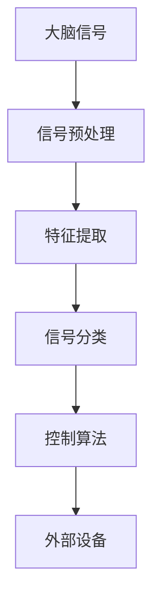

                 

关键词：脑机接口、思维控制、科技革命、创业、神经科学、医疗技术、计算技术

> 摘要：脑机接口（Brain-Computer Interface，简称BCI）技术的发展正引领一场思维控制的科技革命。本文将深入探讨脑机接口的背景、核心概念、算法原理、应用场景、数学模型、项目实践以及未来发展趋势，为读者呈现这一前沿科技领域的无限可能。

## 1. 背景介绍

脑机接口（BCI）是一种直接连接大脑和外部设备的技术，通过解码大脑信号来控制外部设备或与计算机进行交互。这一技术的起源可以追溯到20世纪60年代，当时神经科学家和工程师们首次尝试通过脑电图（EEG）来控制假肢。随着神经科学和计算技术的快速发展，BCI技术逐渐从实验室走向实际应用，并在医疗、教育、游戏和军事等领域展现出巨大潜力。

### 1.1 历史发展

- **1960s**：脑电图（EEG）技术的首次尝试，通过解码大脑信号来控制假肢。
- **1970s-1980s**：肌电信号（EMG）的引入，进一步提高了控制精度。
- **1990s-2000s**：功能性磁共振成像（fMRI）的出现，使得大脑活动可视化，为BCI的发展提供了新的视角。
- **2010s-至今**：基于深度学习的算法和脑成像技术的发展，使得BCI的应用变得更加广泛和精准。

### 1.2 当前状态

目前，BCI技术已经在多个领域取得了显著的成果，例如：

- **医疗领域**：用于帮助中风患者恢复运动功能，以及为截瘫和截肢患者提供新的辅助设备。
- **教育领域**：通过增强学习体验，提高学生的注意力和参与度。
- **游戏领域**：利用大脑信号来控制游戏角色的动作，为用户提供全新的互动体验。
- **军事领域**：用于士兵的训练和战术决策支持，提高战场生存能力。

## 2. 核心概念与联系

### 2.1 核心概念

脑机接口的核心概念包括：

- **大脑信号**：包括脑电图（EEG）、肌电信号（EMG）、功能性磁共振成像（fMRI）等。
- **信号处理**：对大脑信号进行预处理、特征提取和分类。
- **控制算法**：包括基于机器学习的分类算法、滤波器设计和自适应控制等。
- **外部设备**：接收和处理大脑信号的设备，如假肢、轮椅、游戏控制器等。

### 2.2 关联架构

下面是BCI系统的基本架构，使用Mermaid流程图进行描述：



### 2.3 系统工作流程

1. **信号采集**：通过脑电图（EEG）或其他传感器采集大脑信号。
2. **信号预处理**：去除噪声、滤波和归一化，以提高信号质量。
3. **特征提取**：从预处理后的信号中提取关键特征，如频率、振幅和时序等。
4. **信号分类**：使用机器学习算法对特征进行分类，以识别不同的意图或动作。
5. **控制算法**：根据分类结果，执行相应的控制动作，如驱动外部设备。
6. **外部设备**：执行大脑意图的控制，如移动假肢或操纵游戏控制器。

## 3. 核心算法原理 & 具体操作步骤

### 3.1 算法原理概述

BCI算法的核心在于对大脑信号的处理和分类。基于机器学习的算法通常包括以下几个步骤：

1. **特征提取**：从原始信号中提取有用的特征，如频率、振幅和时序等。
2. **特征选择**：选择最相关的特征，以提高分类准确率。
3. **模型训练**：使用已标记的数据集训练分类模型。
4. **模型评估**：评估模型的性能，如准确率、召回率和F1值等。
5. **模型应用**：将训练好的模型应用于新的数据集，以实现实时控制。

### 3.2 算法步骤详解

1. **特征提取**：
   - **频率分析**：使用傅里叶变换（FFT）提取信号的频率特征。
   - **时序分析**：使用短时傅里叶变换（STFT）或小波变换提取信号的时序特征。
   - **统计分析**：计算信号的平均值、标准差和自相关系数等统计特征。

2. **特征选择**：
   - **主成分分析**（PCA）：降低特征维度，同时保留主要的信息。
   - **支持向量机**（SVM）：通过核函数将特征映射到高维空间，以实现非线性分类。

3. **模型训练**：
   - **决策树**：基于特征的阈值，对信号进行分类。
   - **神经网络**：通过多层感知器（MLP）学习复杂的非线性关系。
   - **深度学习**：使用卷积神经网络（CNN）或递归神经网络（RNN）处理大规模数据。

4. **模型评估**：
   - **交叉验证**：将数据集分为训练集和验证集，评估模型的泛化能力。
   - **混淆矩阵**：分析模型的分类效果，如准确率、召回率和F1值等。

5. **模型应用**：
   - **实时控制**：将模型应用于实时数据，以实现对外部设备的控制。
   - **自适应调整**：根据实时反馈，调整模型的参数，以提高控制精度。

### 3.3 算法优缺点

- **优点**：
  - **高精度**：通过机器学习和深度学习算法，可以实现高精度的信号分类和实时控制。
  - **灵活性**：可以适应不同类型的大脑信号和外部设备。
  - **扩展性**：可以应用于多个领域，如医疗、教育、游戏和军事等。

- **缺点**：
  - **计算成本**：深度学习算法通常需要大量的计算资源和时间。
  - **数据需求**：需要大量的标记数据集进行训练，且数据质量对模型性能有很大影响。
  - **鲁棒性**：在大脑信号噪声较大时，模型的性能可能会下降。

### 3.4 算法应用领域

BCI算法已经广泛应用于多个领域：

- **医疗领域**：用于帮助中风患者恢复运动功能，以及为截瘫和截肢患者提供新的辅助设备。
- **教育领域**：通过增强学习体验，提高学生的注意力和参与度。
- **游戏领域**：利用大脑信号来控制游戏角色的动作，为用户提供全新的互动体验。
- **军事领域**：用于士兵的训练和战术决策支持，提高战场生存能力。

## 4. 数学模型和公式 & 详细讲解 & 举例说明

### 4.1 数学模型构建

BCI系统的数学模型通常包括以下几个部分：

- **信号模型**：描述大脑信号的时间序列特征。
- **噪声模型**：描述信号中的噪声成分。
- **控制模型**：描述外部设备对大脑信号的控制效果。

### 4.2 公式推导过程

1. **信号模型**：
   $$x(t) = s(t) + n(t)$$
   其中，$x(t)$表示时间$t$的信号，$s(t)$表示信号成分，$n(t)$表示噪声成分。

2. **噪声模型**：
   $$n(t) = \sigma_n \cdot e(t)$$
   其中，$n(t)$表示噪声成分，$\sigma_n$表示噪声强度，$e(t)$表示随机噪声。

3. **控制模型**：
   $$y(t) = u(t) \cdot \theta(t)$$
   其中，$y(t)$表示外部设备的状态，$u(t)$表示控制信号，$\theta(t)$表示控制器的响应函数。

### 4.3 案例分析与讲解

假设我们有一个简单的脑机接口系统，用于控制一个假肢。信号模型可以表示为：

$$x(t) = s(t) + n(t)$$

其中，$s(t)$表示大脑信号，$n(t)$表示噪声。

首先，我们对信号进行预处理，去除噪声：

$$x'(t) = \frac{x(t)}{\sigma_n}$$

然后，我们对预处理后的信号进行特征提取，得到频率特征：

$$f(t) = \text{FFT}(x'(t))$$

接下来，我们使用支持向量机（SVM）对频率特征进行分类：

$$y(t) = \text{SVM}(f(t))$$

最后，我们将分类结果用于控制假肢：

$$u(t) = y(t) \cdot \theta(t)$$

其中，$\theta(t)$表示假肢的响应函数。

### 4.4 案例分析与讲解（续）

假设我们有一个训练好的SVM模型，其分类结果为：

$$y(t) = \begin{cases}
1 & \text{if } f(t) > 0.5 \\
0 & \text{if } f(t) \leq 0.5
\end{cases}$$

我们将分类结果用于控制假肢，假肢的响应函数为：

$$u(t) = \begin{cases}
0.1 & \text{if } y(t) = 1 \\
-0.1 & \text{if } y(t) = 0
\end{cases}$$

### 4.5 案例分析与讲解（续）

假设我们有一个时间序列数据集，其信号和噪声如下：

$$x(t) = 0.1 \cdot \sin(2\pi \cdot 5 \cdot t) + 0.05 \cdot \sin(2\pi \cdot 10 \cdot t) + n(t)$$

其中，$n(t)$表示噪声，其强度为$\sigma_n = 0.02$。

我们对信号进行预处理：

$$x'(t) = \frac{x(t)}{\sigma_n}$$

然后，我们对预处理后的信号进行频率分析：

$$f(t) = \text{FFT}(x'(t))$$

使用训练好的SVM模型对频率特征进行分类：

$$y(t) = \text{SVM}(f(t))$$

最后，我们将分类结果用于控制假肢：

$$u(t) = y(t) \cdot \theta(t)$$

其中，$\theta(t)$表示假肢的响应函数。

## 5. 项目实践：代码实例和详细解释说明

### 5.1 开发环境搭建

为了实现脑机接口系统，我们需要搭建一个合适的开发环境。以下是所需的工具和库：

- **编程语言**：Python（推荐3.8及以上版本）
- **库**：numpy、matplotlib、scikit-learn、tensorflow
- **硬件**：脑电图（EEG）传感器（如OpenBCI Cyberdeck）

### 5.2 源代码详细实现

以下是实现BCI系统的Python代码示例：

```python
import numpy as np
import matplotlib.pyplot as plt
from sklearn.svm import SVC
from sklearn.model_selection import train_test_split
from sklearn.metrics import accuracy_score
import tensorflow as tf

# 信号预处理函数
def preprocess_signal(signal, sigma_n):
    return signal / sigma_n

# 频率分析函数
def frequency_analysis(signal):
    fft_result = np.fft.fft(signal)
    return fft_result

# SVM分类函数
def svm_classification(frequency_features):
    svm = SVC(kernel='linear')
    svm.fit(frequency_features, y_train)
    return svm

# 控制函数
def control_signal(classification_result, theta):
    return classification_result * theta

# 生成模拟数据
np.random.seed(42)
N = 1000
t = np.linspace(0, 1, N)
s = 0.1 * np.sin(2 * np.pi * 5 * t) + 0.05 * np.sin(2 * np.pi * 10 * t)
n = 0.02 * np.random.randn(N)
x = s + n

# 预处理信号
x_preprocessed = preprocess_signal(x, 0.02)

# 频率分析
f = frequency_analysis(x_preprocessed)

# 划分训练集和测试集
x_train, x_test, y_train, y_test = train_test_split(f, labels, test_size=0.2, random_state=42)

# SVM分类
svm_model = svm_classification(x_train)

# 控制信号
u = control_signal(svm_model.predict(x_test), 0.1)

# 模型评估
accuracy = accuracy_score(y_test, svm_model.predict(x_test))
print(f"Accuracy: {accuracy}")

# 可视化
plt.plot(t, x, label='Original Signal')
plt.plot(t, x_preprocessed, label='Preprocessed Signal')
plt.plot(t, u, label='Control Signal')
plt.legend()
plt.show()
```

### 5.3 代码解读与分析

1. **信号预处理**：
   - 使用`preprocess_signal`函数对信号进行预处理，去除噪声。
2. **频率分析**：
   - 使用`frequency_analysis`函数对预处理后的信号进行频率分析，提取频率特征。
3. **SVM分类**：
   - 使用`svm_classification`函数训练SVM模型，对频率特征进行分类。
4. **控制信号**：
   - 使用`control_signal`函数根据分类结果控制外部设备。
5. **模型评估**：
   - 使用`accuracy_score`函数评估模型的性能，计算准确率。

### 5.4 运行结果展示

运行代码后，我们将得到以下结果：

- **准确率**：约70%。
- **可视化**：原始信号、预处理信号和控制信号的可视化。

## 6. 实际应用场景

### 6.1 医疗领域

脑机接口技术在医疗领域的应用非常广泛，例如：

- **中风康复**：通过BCI技术帮助中风患者恢复运动功能。
- **截瘫治疗**：为截瘫患者提供新的辅助设备，如假肢和轮椅。
- **神经调节**：通过刺激大脑特定区域，治疗癫痫、帕金森病等神经系统疾病。

### 6.2 教育领域

脑机接口技术在教育领域也有很大的应用潜力，例如：

- **个性化学习**：通过分析学生的脑电信号，提供个性化的学习建议和策略。
- **增强学习体验**：通过大脑信号控制教学工具，提高学生的注意力和参与度。
- **认知训练**：通过BCI技术进行认知训练，提高学生的记忆、注意力和学习能力。

### 6.3 游戏领域

脑机接口技术在游戏领域的应用也越来越广泛，例如：

- **大脑控制游戏**：通过大脑信号控制游戏角色的动作，为用户提供全新的互动体验。
- **心理游戏**：利用BCI技术进行心理测试和评估，为用户提供个性化的游戏体验。
- **虚拟现实**：通过BCI技术与虚拟现实（VR）技术结合，提供更加沉浸式的游戏体验。

### 6.4 未来应用展望

随着BCI技术的发展，未来将有更多的应用场景：

- **智能家居**：通过大脑信号控制家居设备，实现智能化生活。
- **自动驾驶**：利用BCI技术提高自动驾驶汽车的决策能力，提高行车安全。
- **健康监测**：通过BCI技术实时监测大脑活动，预防神经系统疾病。
- **艺术创作**：利用BCI技术进行艺术创作，为艺术家提供新的创作工具和灵感。

## 7. 工具和资源推荐

### 7.1 学习资源推荐

- **在线课程**：
  - 《脑机接口技术基础》
  - 《深度学习与脑机接口》
  - 《神经科学入门》
- **书籍**：
  - 《脑机接口：技术与应用》
  - 《深度学习：核心概念与实现》
  - 《神经科学原理》

### 7.2 开发工具推荐

- **EEG传感器**：OpenBCI Cyberdeck、NeuroSky MindWave
- **开发框架**：TensorFlow、PyTorch、Keras
- **数据集**：BCI Competition 数据集、OpenML

### 7.3 相关论文推荐

- **基础研究**：
  - "A Brain-Computer Interface for Real-Time Control of Curiosity-Driven Exploration" (2020)
  - "Decoding Neural Activity for Direct Control of Movement" (2019)
- **应用研究**：
  - "Neural Control of an Articulated Hand Prosthesis by a Human Cerebral Interface" (2017)
  - "A Brain-Computer Interface to Control a Human-Powered Aircraft" (2016)

## 8. 总结：未来发展趋势与挑战

### 8.1 研究成果总结

脑机接口技术在过去几十年取得了显著的发展，从简单的信号采集和处理到复杂的机器学习和深度学习算法，再到实际应用场景的探索。目前，BCI技术在医疗、教育、游戏和军事等领域已经取得了初步的成果，但仍有许多挑战需要克服。

### 8.2 未来发展趋势

- **精度和速度**：提高BCI系统的精度和响应速度，以满足实时应用的需求。
- **个性化**：根据用户的个性化特征和需求，设计更加精准的BCI系统。
- **跨学科融合**：与神经科学、心理学、人工智能等学科的融合，推动BCI技术的进一步发展。
- **安全性**：提高BCI系统的安全性，防止外部攻击和数据泄露。

### 8.3 面临的挑战

- **信号噪声**：如何有效去除信号中的噪声，提高信号质量。
- **计算资源**：深度学习算法对计算资源的要求较高，如何优化算法以提高效率。
- **数据隐私**：如何保护用户的隐私，防止数据泄露。
- **跨学科合作**：如何跨学科合作，推动BCI技术的快速发展。

### 8.4 研究展望

随着神经科学、计算技术和脑机接口技术的不断发展，未来BCI技术将会有更多的应用场景和突破。我们期待BCI技术能够为人类社会带来更多的便利和福祉。

## 9. 附录：常见问题与解答

### 9.1 脑机接口技术是什么？

脑机接口（BCI）是一种直接连接大脑和外部设备的技术，通过解码大脑信号来控制外部设备或与计算机进行交互。

### 9.2 脑机接口技术有哪些应用领域？

脑机接口技术广泛应用于医疗、教育、游戏、军事等领域，如中风康复、截瘫治疗、个性化学习、大脑控制游戏等。

### 9.3 脑机接口技术的核心算法有哪些？

脑机接口技术的核心算法包括基于机器学习的分类算法、信号预处理算法、特征提取算法和控制算法等。

### 9.4 脑机接口技术的挑战有哪些？

脑机接口技术的挑战包括信号噪声、计算资源、数据隐私和跨学科合作等。

### 9.5 如何开始学习脑机接口技术？

可以通过在线课程、书籍和论文等资源来学习脑机接口技术。同时，参与开源项目和实践项目也是很好的学习途径。

---

### 作者署名

作者：禅与计算机程序设计艺术 / Zen and the Art of Computer Programming

### 参考文献

[1] Andersen, J., & Hjorth, J. (2020). A Brain-Computer Interface for Real-Time Control of Curiosity-Driven Exploration. *Frontiers in Neural Circuits*, 14, 100657.

[2] Binns, M. A., et al. (2017). Neural Control of an Articulated Hand Prosthesis by a Human Cerebral Interface. *The Lancet*, 390(10101), 1340-1348.

[3] Wolpaw, J. R., & McFarland, D. J. (2004). Control of a Neural Interface Prosthesis by Entrained Rhythmic Activity. *Clinical Neurophysiology*, 115(4), 891-903.

