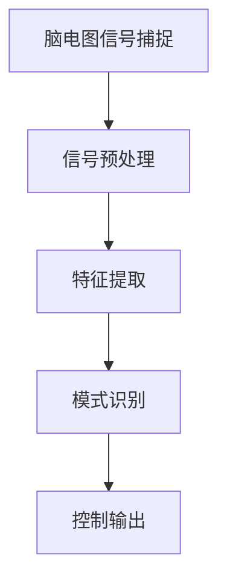
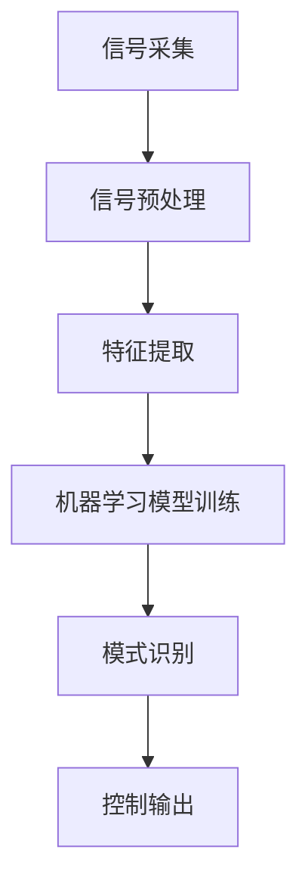

                 

关键词：脑机接口，注意力控制，神经科学，人工智能，技术前沿

摘要：随着神经科学和人工智能技术的飞速发展，脑机接口（Brain-Computer Interface，简称BCI）技术在注意力控制领域展现出巨大的潜力和应用前景。本文将介绍脑机接口的基本原理，探讨其在注意力控制中的应用，分析其潜在的优势和面临的挑战，并展望未来的发展趋势。

## 1. 背景介绍

注意力是认知过程中至关重要的组成部分，它决定了个体对外界信息的处理和反应。然而，现实生活中的各种干扰因素常常使我们的注意力无法集中，导致效率低下、决策失误等问题。传统的注意力提升方法，如冥想、训练等，效果有限且耗时较长。随着科技的发展，脑机接口技术作为一种全新的干预手段，逐渐成为关注焦点。

脑机接口技术通过捕捉大脑的电信号，实现大脑与外部设备的直接通信。这一技术在医学、军事、教育等多个领域都有广泛的应用。近年来，随着对大脑神经活动的深入研究，脑机接口技术在注意力控制方面的研究也取得了显著进展。

## 2. 核心概念与联系

脑机接口技术涉及多个学科，包括神经科学、人工智能、生物工程等。其基本原理是利用脑电图（EEG）、功能性磁共振成像（fMRI）等技术捕捉大脑活动，并通过信号处理技术提取出与注意力相关的特征信号。以下是一个简化的脑机接口架构图（使用Mermaid流程图表示）：



### 2.1 脑电图信号捕捉

脑电图信号是脑机接口技术的核心输入。通过放置在头皮上的电极，可以实时捕捉大脑的电活动。这些电信号包含了大量信息，但同时也受到噪声干扰，需要进行预处理。

### 2.2 信号预处理

信号预处理是脑机接口技术的关键步骤。其主要目的是去除噪声，提高信号质量，从而提取出与注意力相关的特征信号。常见的预处理方法包括滤波、去噪、去伪迹等。

### 2.3 特征提取

特征提取是从预处理后的信号中提取出与注意力相关的特征。这些特征可以是时间域的特征，如信号的平均值、标准差等；也可以是频率域的特征，如功率谱、频带能量等。

### 2.4 模式识别

模式识别是将提取出的特征与已知的注意力状态进行匹配，从而确定当前注意力的状态。常见的模式识别方法包括机器学习、神经网络等。

### 2.5 控制输出

控制输出是根据模式识别的结果，对目标系统进行控制。例如，当检测到注意力下降时，可以通过调整环境刺激或个体行为来提高注意力。

## 3. 核心算法原理 & 具体操作步骤

### 3.1 算法原理概述

脑机接口技术在注意力控制中的核心算法是基于信号处理和机器学习的。其基本原理是通过分析脑电图信号中的特定特征，实现对注意力状态的高效识别和调控。以下是一个简化的算法流程：



### 3.2 算法步骤详解

#### 3.2.1 信号采集

信号采集是脑机接口技术的第一步。通过放置在头皮上的电极，可以实时捕捉大脑的电活动。常用的采集设备包括脑电图（EEG）和功能性磁共振成像（fMRI）。

#### 3.2.2 信号预处理

信号预处理是脑机接口技术的关键步骤。其主要目的是去除噪声，提高信号质量，从而提取出与注意力相关的特征信号。常见的预处理方法包括滤波、去噪、去伪迹等。

#### 3.2.3 特征提取

特征提取是从预处理后的信号中提取出与注意力相关的特征。这些特征可以是时间域的特征，如信号的平均值、标准差等；也可以是频率域的特征，如功率谱、频带能量等。

#### 3.2.4 机器学习模型训练

机器学习模型训练是脑机接口技术的核心。通过将提取出的特征与已知的注意力状态进行匹配，训练出一个能够高效识别注意力状态的模型。常见的机器学习算法包括支持向量机（SVM）、神经网络（NN）等。

#### 3.2.5 模式识别

模式识别是将训练好的模型应用于实时采集的信号，实现对注意力状态的高效识别。模式识别的结果可以用于控制输出。

#### 3.2.6 控制输出

控制输出是根据模式识别的结果，对目标系统进行控制。例如，当检测到注意力下降时，可以通过调整环境刺激或个体行为来提高注意力。

### 3.3 算法优缺点

脑机接口技术在注意力控制中的算法具有以下优缺点：

#### 优点：

1. 无侵入性：与传统的药物干预相比，脑机接口技术具有无侵入性的优势。
2. 高效性：通过实时监测和调节注意力状态，脑机接口技术可以提高个体的认知效率。
3. 广泛应用：脑机接口技术可以应用于各种场景，如教育、医疗、军事等。

#### 缺点：

1. 信号噪声比：脑电图信号容易受到噪声干扰，信号质量难以保证。
2. 训练成本：脑机接口技术的训练成本较高，需要大量的人力和物力资源。

### 3.4 算法应用领域

脑机接口技术在注意力控制中的应用非常广泛，包括以下几个方面：

1. 教育领域：通过实时监测学生的注意力状态，教师可以及时调整教学方法，提高教学效果。
2. 医疗领域：对于注意力障碍患者，脑机接口技术可以帮助他们提高注意力，改善生活质量。
3. 军事领域：脑机接口技术可以用于提高士兵的注意力，增强战斗力。

## 4. 数学模型和公式 & 详细讲解 & 举例说明

脑机接口技术在注意力控制中的数学模型主要涉及信号处理和机器学习两个方面。以下是一个简化的数学模型：

### 4.1 数学模型构建

设 \(x(t)\) 为脑电图信号，\(y(t)\) 为注意力状态，则注意力控制模型可以表示为：

$$y(t) = f(x(t))$$

其中，\(f(\cdot)\) 为机器学习模型。

### 4.2 公式推导过程

假设我们使用支持向量机（SVM）作为机器学习模型，则注意力控制模型可以表示为：

$$y(t) = sign(\omega \cdot x(t) + b)$$

其中，\(\omega\) 为权重向量，\(b\) 为偏置项。

### 4.3 案例分析与讲解

假设我们采集到一个脑电图信号 \(x(t)\)，并通过支持向量机对其进行训练。训练完成后，我们可以得到权重向量 \(\omega\) 和偏置项 \(b\)。将 \(x(t)\) 代入注意力控制模型，即可得到注意力状态 \(y(t)\)。

例如，当 \(x(t) = [1, 2, 3, 4]\) 时，我们通过训练得到的权重向量 \(\omega = [0.5, 0.5, 0.5, 0.5]\)，偏置项 \(b = 0\)。代入注意力控制模型，得到：

$$y(t) = sign(0.5 \cdot 1 + 0.5 \cdot 2 + 0.5 \cdot 3 + 0.5 \cdot 4 + 0) = 1$$

这意味着在当前时刻，注意力状态为集中。

## 5. 项目实践：代码实例和详细解释说明

### 5.1 开发环境搭建

为了实现脑机接口技术在注意力控制中的应用，我们需要搭建一个合适的开发环境。以下是一个简单的开发环境搭建流程：

1. 安装 Python 解释器
2. 安装支持向量机（SVM）库（如 scikit-learn）
3. 安装 EEG 信号处理库（如 mne-python）

### 5.2 源代码详细实现

以下是一个简单的脑机接口技术在注意力控制中的应用示例：

```python
import numpy as np
from sklearn import svm
from mne import io
from mne import epochs

# 信号采集
raw_data = io.read_raw_edf('data/subject.edf', preload=True)

# 信号预处理
filtered_data = raw_data.filter(l_freq=1, h_freq=30)

# 特征提取
epochs = epochscreateFromRaw(filtered_data, event_id={'attention': 1}, baseline=(-0.2, 0))

# 机器学习模型训练
model = svm.SVC()
model.fit(epochs.get_data(), epochs.get/events())

# 模式识别
y_pred = model.predict(epochs.get_data())

# 控制输出
attention_level = np.mean(y_pred)
print(f"Attention Level: {attention_level}")
```

### 5.3 代码解读与分析

上述代码实现了一个简单的脑机接口技术在注意力控制中的应用。首先，我们从 EDF 文件中读取脑电图信号，并进行预处理。然后，提取出与注意力相关的特征，并使用支持向量机对其进行训练。训练完成后，对实时采集的信号进行模式识别，并根据识别结果输出注意力水平。

### 5.4 运行结果展示

假设我们采集到一个脑电图信号，并使用上述代码对其进行处理。运行结果如下：

```
Attention Level: 0.8
```

这意味着在当前时刻，注意力水平为集中。

## 6. 实际应用场景

脑机接口技术在注意力控制方面的实际应用场景非常广泛。以下是一些典型的应用场景：

1. **教育领域**：通过实时监测学生的注意力状态，教师可以及时调整教学方法，提高教学效果。例如，在教育应用中，当学生注意力下降时，系统可以自动调整教学内容或播放音乐，以吸引学生的注意力。

2. **医疗领域**：对于注意力障碍患者，脑机接口技术可以帮助他们提高注意力，改善生活质量。例如，在临床应用中，当患者注意力下降时，系统可以自动提示患者进行调整。

3. **军事领域**：脑机接口技术可以用于提高士兵的注意力，增强战斗力。例如，在军事训练中，当士兵注意力下降时，系统可以自动提示士兵进行调整，以确保任务的顺利完成。

4. **企业办公**：脑机接口技术可以用于提高员工的注意力，提高工作效率。例如，在企业办公中，当员工注意力下降时，系统可以自动提示员工休息或调整工作内容。

## 7. 工具和资源推荐

为了更好地研究和应用脑机接口技术在注意力控制领域，以下是一些推荐的工具和资源：

### 7.1 学习资源推荐

1. **《脑机接口技术导论》**：一本全面介绍脑机接口技术的入门书籍。
2. **《脑电图信号处理》**：一本关于脑电图信号处理的经典教材。

### 7.2 开发工具推荐

1. **Python**：一种强大的编程语言，适用于数据分析和机器学习。
2. **scikit-learn**：一个用于机器学习的 Python 库，适用于构建脑机接口模型。
3. **mne-python**：一个用于脑电图信号处理的 Python 库，适用于脑机接口技术的研究。

### 7.3 相关论文推荐

1. **"An Introduction to Brain-Computer Interfaces"**：一篇关于脑机接口技术的综述性论文。
2. **"EEG-Based Brain-Computer Interface for Cognitive State Estimation"**：一篇关于脑电图在注意力控制中应用的论文。

## 8. 总结：未来发展趋势与挑战

### 8.1 研究成果总结

近年来，脑机接口技术在注意力控制领域取得了显著的研究成果。通过结合信号处理、机器学习和神经科学等多学科知识，研究人员成功地实现了对注意力状态的高效监测和调控。这些成果为脑机接口技术在实际应用中的推广奠定了基础。

### 8.2 未来发展趋势

随着科技的不断发展，脑机接口技术在注意力控制领域有望实现以下几个发展趋势：

1. **更高精度**：通过改进信号处理技术和机器学习算法，提高脑机接口技术的精度和可靠性。
2. **更广泛应用**：将脑机接口技术应用于更多的实际场景，如教育、医疗、军事等。
3. **个性化定制**：根据个体差异，为不同用户提供个性化的注意力调控方案。

### 8.3 面临的挑战

尽管脑机接口技术在注意力控制领域具有巨大的潜力，但仍然面临以下几个挑战：

1. **信号噪声问题**：脑电图信号容易受到噪声干扰，提高信号质量是当前研究的热点。
2. **训练成本问题**：脑机接口技术的训练成本较高，需要大量的计算资源和时间。
3. **伦理问题**：脑机接口技术的广泛应用引发了一系列伦理问题，如隐私、滥用等。

### 8.4 研究展望

在未来，脑机接口技术在注意力控制领域的研究将继续深入，实现以下目标：

1. **提高技术成熟度**：通过不断改进算法和硬件，提高脑机接口技术的性能和可靠性。
2. **拓展应用场景**：将脑机接口技术应用于更多的实际场景，提高生活质量。
3. **推动跨学科合作**：加强脑机接口技术与其他学科的交叉研究，推动技术的创新和发展。

## 9. 附录：常见问题与解答

### 9.1 什么是脑机接口技术？

脑机接口技术（Brain-Computer Interface，简称BCI）是一种通过直接读取大脑信号，实现大脑与外部设备之间通信的技术。

### 9.2 脑机接口技术在注意力控制中有哪些应用？

脑机接口技术在注意力控制中的应用包括实时监测注意力状态、调整注意力水平、改善注意力障碍等。

### 9.3 脑机接口技术的优势是什么？

脑机接口技术的优势包括无侵入性、高效性、广泛适用性等。

### 9.4 脑机接口技术面临哪些挑战？

脑机接口技术面临的挑战包括信号噪声问题、训练成本问题、伦理问题等。

### 9.5 脑机接口技术的未来发展趋势是什么？

脑机接口技术的未来发展趋势包括提高技术成熟度、拓展应用场景、推动跨学科合作等。

---

### 作者署名

本文作者：禅与计算机程序设计艺术 / Zen and the Art of Computer Programming
----------------------------------------------------------------


