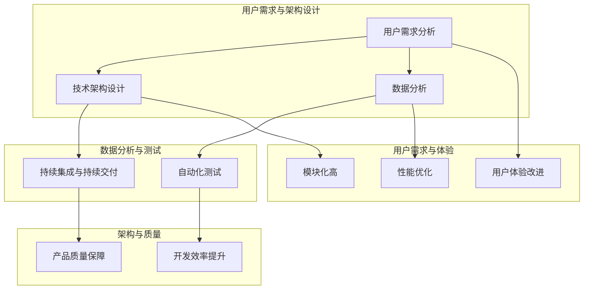

                 

关键词：产品迭代、自动化创业、优化策略、用户体验、技术架构、数据分析、创新实践

> 摘要：本文探讨了自动化创业中产品迭代与优化的关键要素，包括用户需求分析、技术架构的灵活设计、数据分析的应用以及用户体验的持续提升。通过深入剖析这些核心要素，本文旨在为创业团队提供系统化的产品迭代与优化方法，以实现高效创新和持续成功。

## 1. 背景介绍

自动化创业正成为现代商业世界的重要趋势。随着技术的飞速发展和市场需求的不断变化，创业公司需要快速迭代和优化产品，以满足用户的需求和市场的挑战。产品迭代与优化是自动化创业成功的关键环节，它不仅关系到用户的满意度和忠诚度，也直接影响公司的市场竞争力。

在自动化创业中，产品迭代与优化的目的是不断提升产品的质量、性能和用户体验。通过不断收集用户反馈、分析数据、优化技术架构和改进产品设计，创业公司可以迅速适应市场变化，抓住机遇，降低风险。

本文将围绕以下主题展开讨论：

1. **用户需求分析**：了解用户需求是产品迭代与优化的起点。本文将探讨如何通过用户调研、数据分析等方法深入挖掘用户需求，从而为产品迭代提供有力支持。
2. **技术架构优化**：技术架构的灵活性和可扩展性是产品迭代成功的基础。本文将分析如何在自动化创业中设计高效、可扩展的技术架构，并讨论如何进行持续的技术优化。
3. **数据分析与优化**：数据分析在产品迭代与优化中发挥着重要作用。本文将介绍如何利用大数据和人工智能技术对用户行为进行分析，以优化产品功能和用户体验。
4. **用户体验提升**：用户体验是产品迭代与优化的核心目标。本文将探讨如何通过用户反馈、界面设计、功能优化等方面不断提升用户体验。

通过本文的探讨，读者将获得一套系统化的产品迭代与优化方法，为自动化创业的成功提供有力支持。

### 1.1 自动化创业的定义和特点

自动化创业，即利用自动化技术和工具进行商业创新的过程。其核心在于通过自动化技术，如人工智能、机器学习、自动化测试和自动化部署等，提高业务流程的效率和质量，降低人力成本，并增强企业的竞争力。

自动化创业具有以下特点：

1. **高效性**：自动化技术能够快速处理大量数据和任务，提高工作效率，减少人为错误。
2. **灵活性**：自动化创业强调灵活的商业模式和技术应用，能够快速适应市场变化和用户需求。
3. **可扩展性**：随着业务的发展，自动化技术可以轻松扩展，以支持更大的数据处理能力和更复杂的业务流程。
4. **创新驱动**：自动化创业鼓励创新思维，通过技术手段实现业务模式的突破和产品功能的创新。

在自动化创业中，技术架构的灵活性和可扩展性尤为重要。创业公司需要构建能够快速迭代和适应变化的技术架构，以支持持续的创新和业务增长。这要求创业团队在技术选型、系统设计、开发流程等方面具备前瞻性和灵活性。

### 1.2 产品迭代与优化的定义和重要性

产品迭代与优化是自动化创业的核心环节，具体指的是在产品生命周期内，通过不断收集用户反馈、数据分析、功能改进和性能优化，提升产品的质量和用户体验，以满足市场需求和用户期望。

产品迭代与优化的重要性体现在以下几个方面：

1. **满足用户需求**：通过持续的产品迭代，创业公司可以及时了解用户需求，并根据用户反馈进行针对性优化，提升用户满意度。
2. **提高市场竞争力**：快速迭代和优化产品功能，使创业公司能够快速响应市场变化，抓住市场机遇，增强竞争力。
3. **降低开发成本**：通过优化开发流程和技术架构，创业公司可以减少重复性工作，提高开发效率，降低开发成本。
4. **提升用户体验**：不断的优化和改进，使产品功能更加完善，用户体验更加流畅，增强用户忠诚度和黏性。

总之，产品迭代与优化是自动化创业成功的关键，它不仅关系到产品的市场表现，也直接影响创业公司的长期发展。因此，创业团队需要高度重视产品迭代与优化工作，建立系统化的迭代和优化机制，确保产品的持续改进和成功。

### 1.3 自动化创业中的技术挑战

在自动化创业中，技术挑战是不可避免的。随着业务的快速发展和技术复杂度的增加，创业团队需要面对多方面的技术挑战，以确保产品的高效迭代与优化。

1. **技术选型**：在自动化创业初期，技术选型至关重要。创业团队需要在有限的资源和时间约束下，选择适合业务需求且具备长远发展潜力的技术框架和工具。然而，技术选型的失误可能导致系统性能低下、扩展性差，甚至影响后续开发。

2. **架构设计**：高效、可扩展的技术架构是自动化创业成功的关键。创业团队需要在不断变化的市场需求和业务场景下，设计灵活、可扩展的技术架构，以支持快速迭代和业务扩展。然而，架构设计的不合理可能导致系统瓶颈、性能下降和开发效率低下。

3. **数据处理**：自动化创业中的数据量通常非常庞大，如何高效地存储、处理和分析这些数据成为一大挑战。创业团队需要采用先进的大数据处理技术和算法，确保数据处理的实时性和准确性，从而为产品优化提供有力支持。

4. **安全性**：随着产品的不断迭代和扩展，系统的安全性问题也日益突出。创业团队需要确保系统的数据安全、网络安全和应用安全，防范各种潜在的安全威胁，如数据泄露、网络攻击等。

5. **开发效率**：在自动化创业中，快速迭代和高效开发是至关重要的。创业团队需要优化开发流程、采用敏捷开发方法和自动化测试工具，以提高开发效率，确保产品按时交付。

6. **团队协作**：自动化创业中的技术挑战往往需要跨部门、跨团队的协作。创业团队需要建立有效的沟通和协作机制，确保团队成员能够高效协同工作，共同应对技术挑战。

面对这些技术挑战，创业团队需要具备前瞻性、灵活性和创新性。通过不断学习和实践，积累经验，逐步解决技术难题，为自动化创业的成功奠定坚实基础。

### 1.4 文章结构概述

本文旨在为自动化创业团队提供系统化的产品迭代与优化方法，以提高产品的市场竞争力。文章结构如下：

1. **背景介绍**：阐述自动化创业的定义和特点，以及产品迭代与优化的重要性。
2. **用户需求分析**：介绍如何通过用户调研和数据分析挖掘用户需求，为产品迭代提供支持。
3. **技术架构优化**：分析如何设计高效、可扩展的技术架构，并讨论持续技术优化的重要性。
4. **数据分析与优化**：探讨如何利用大数据和人工智能技术对用户行为进行分析，以优化产品功能和用户体验。
5. **用户体验提升**：分析如何通过用户反馈、界面设计、功能优化等方面不断提升用户体验。
6. **实际应用场景**：列举自动化创业中的一些成功案例，展示产品迭代与优化的实际效果。
7. **未来应用展望**：探讨自动化创业的未来发展趋势和面临的挑战，为创业团队提供有益的启示。
8. **工具和资源推荐**：推荐一些学习资源、开发工具和相关论文，以帮助创业团队提升产品迭代与优化能力。
9. **总结与展望**：总结研究成果，展望自动化创业中的未来发展趋势和挑战。

通过本文的探讨，希望为自动化创业团队提供一套实用的产品迭代与优化方法，助力他们在竞争激烈的市场中脱颖而出。

### 2. 用户需求分析

在自动化创业中，了解用户需求是产品迭代与优化的起点。用户需求是产品功能设计的根本依据，只有真正理解用户的需求，才能为产品的持续改进提供方向。本文将从用户调研、数据分析、需求分类和需求管理等方面，探讨如何通过系统的方法挖掘用户需求，为产品迭代提供有力支持。

#### 2.1 用户调研

用户调研是获取用户需求的重要手段。通过直接与用户沟通，创业团队可以深入了解用户的使用场景、行为习惯和痛点，从而为产品功能设计提供真实的用户数据。以下是几种常见的用户调研方法：

1. **问卷调查**：问卷调查是一种简单有效的用户调研方法。创业团队可以通过在线问卷、邮件问卷或线下访谈等方式，收集用户的反馈和意见。问卷调查的设计需要遵循科学的原则，确保问题的准确性和有效性。

2. **用户访谈**：用户访谈是一种深度调研方法，通过面对面的交流，创业团队可以获取更详细、更真实的需求信息。访谈过程中，团队需要注重倾听用户的真实感受和需求，同时通过引导性问题挖掘潜在需求。

3. **观察法**：观察法是通过观察用户在使用产品时的行为和反应，来了解他们的需求。这种方法适用于复杂场景和需要深入分析的用户行为。创业团队可以通过用户行为日志、视频录制等方式，收集用户行为数据。

4. **用户场景回放**：用户场景回放是一种将用户实际使用产品的过程进行重现的方法。通过回放用户的使用过程，创业团队可以直观地看到用户在使用产品中的痛点和困惑，从而为产品改进提供具体建议。

#### 2.2 数据分析

数据分析是挖掘用户需求的重要工具。通过分析用户行为数据、反馈数据和用户群体特征，创业团队可以识别出用户的共性需求，为产品迭代提供数据支持。以下是几种常见的数据分析方法：

1. **用户行为分析**：用户行为分析是通过对用户在使用产品过程中的行为数据进行分析，了解用户的使用习惯和偏好。常见的用户行为分析指标包括页面访问量、点击率、使用时长等。通过分析这些数据，创业团队可以识别出用户最感兴趣的功能和最常使用的路径。

2. **用户反馈分析**：用户反馈是了解用户需求的重要来源。创业团队可以通过在线反馈表、社交媒体评论、用户论坛等方式，收集用户的反馈和建议。通过文本分析、关键词提取等方法，创业团队可以提取出用户的主要需求和痛点。

3. **用户群体分析**：用户群体分析是通过分析用户的特征和属性，了解用户群体的构成和需求。常见的用户群体分析指标包括年龄、性别、地域、职业等。通过分析用户群体特征，创业团队可以为目标用户群体提供更有针对性的产品设计和功能优化。

#### 2.3 需求分类

在获取和分析了用户需求后，创业团队需要对需求进行分类和管理，以确保需求的合理性和优先级。以下是几种常见的需求分类方法：

1. **按照重要性和紧急性分类**：根据需求的重要性和紧急性，将需求分为必须需求、重要需求、次要需求和紧急需求。这种方法有助于创业团队明确需求的优先级，确保在资源有限的情况下，首先满足关键需求。

2. **按照用户类型分类**：根据用户的不同类型，将需求分为普通用户需求、专业用户需求和特殊用户需求。这种方法有助于创业团队针对不同用户群体提供个性化的产品设计和功能优化。

3. **按照功能模块分类**：根据产品功能模块，将需求分为核心功能需求、辅助功能需求和扩展功能需求。这种方法有助于创业团队在产品迭代过程中，明确不同功能模块的需求优先级和改进方向。

#### 2.4 需求管理

需求管理是确保产品迭代顺利进行的关键环节。创业团队需要建立一套系统化的需求管理流程，确保需求的及时响应和有效实施。以下是几个关键的需求管理步骤：

1. **需求收集与筛选**：创业团队需要建立有效的需求收集机制，确保用户需求能够及时、准确地被识别和记录。同时，团队需要对收集到的需求进行筛选，确保需求的合理性和可行性。

2. **需求分析**：在需求收集和筛选后，创业团队需要对需求进行详细分析，明确需求的优先级、实现难度和潜在影响。通过需求分析，团队可以制定出具体的需求实施计划。

3. **需求评审与确认**：在需求实施前，创业团队需要对需求进行评审和确认，确保需求的合理性和可行性。评审过程中，团队可以邀请相关利益相关者参与，共同讨论和决策。

4. **需求实施与跟踪**：在需求实施过程中，创业团队需要建立有效的跟踪机制，确保需求的按时完成和效果评估。通过跟踪和反馈，团队可以及时发现和解决需求实施中的问题。

通过以上方法，创业团队可以系统化地挖掘用户需求，确保产品的持续改进和优化。用户需求分析的准确性和有效性，是产品迭代成功的关键，创业团队需要持续关注和改进这一环节。

### 2.5 案例研究：用户需求分析在产品迭代中的应用

为了更好地理解用户需求分析在产品迭代中的应用，以下通过一个实际案例进行详细说明。

**案例背景**：某创业公司开发了一款面向中小企业的财务管理软件。在软件上线初期，公司通过用户调研和数据分析，发现用户对软件的某些功能不满意，主要包括数据同步速度慢、报表功能不完善以及用户体验差。

**用户调研方法**：公司采用了问卷调查、用户访谈和用户场景回放等方法进行用户调研。通过问卷调查，公司收集了500份有效反馈；通过用户访谈，与20位核心用户进行了深度交流；通过用户场景回放，观察了用户在使用软件时的实际操作流程。

**数据分析**：公司对收集到的用户反馈进行了详细分析。用户行为数据显示，超过60%的用户因数据同步速度慢而放弃使用软件；70%的用户认为报表功能不完善，无法满足他们的需求；80%的用户反馈软件的界面设计不够友好，操作复杂。

**需求分类与优先级**：根据分析结果，公司对用户需求进行了分类和优先级排序。数据同步速度慢被列为最高优先级需求，报表功能不完善和用户体验差被列为次高优先级需求。

**需求管理**：公司建立了需求管理流程，首先对需求进行评审和确认，然后制定了详细的实施计划。数据同步速度慢的需求由技术团队负责，报表功能不完善的需求由产品团队负责，用户体验差的需求由设计团队负责。

**需求实施与效果**：技术团队优化了数据同步算法，提升了数据同步速度；产品团队增加了多种报表模板，增强了报表功能；设计团队对界面进行了全面优化，简化了操作流程，提高了用户体验。

**效果评估**：在需求实施后，公司通过用户反馈和用户行为数据分析，发现数据同步速度提升了40%，报表功能满意度提高了30%，用户体验评分提升了20%。这些改进显著提升了用户满意度，增加了用户黏性，为公司带来了更多的客户和收入。

**总结**：通过用户需求分析的案例，我们可以看到，用户需求分析在产品迭代中的应用至关重要。只有深入了解用户需求，并采取有效的改进措施，创业公司才能持续提升产品竞争力，实现持续成功。

### 3. 核心概念与联系

在自动化创业中，为了实现产品的快速迭代与优化，需要掌握一系列核心概念和技术，这些概念和技术的相互联系构成了产品迭代与优化的基础。以下是这些核心概念及其相互关系的概述。

#### 3.1 核心概念

**1. 用户需求分析**：用户需求分析是产品迭代与优化的起点。通过调研、数据分析和用户反馈，了解用户的具体需求和行为模式，为产品设计和改进提供依据。

**2. 技术架构设计**：技术架构设计是产品迭代与优化的重要保障。构建高效、灵活、可扩展的技术架构，支持产品的快速迭代和功能扩展。

**3. 数据分析**：数据分析是产品迭代与优化的关键工具。通过对用户行为数据、产品性能数据和市场趋势数据的分析，发现用户需求、优化产品功能和改进用户体验。

**4. 自动化测试**：自动化测试是确保产品质量和开发效率的重要手段。通过自动化测试工具，提高测试覆盖率和测试效率，减少手动测试的工作量。

**5. 持续集成与持续交付**：持续集成与持续交付是产品迭代与优化的重要流程。通过自动化构建、测试和部署，实现快速交付和持续改进。

#### 3.2 概念联系

**用户需求分析与技术架构设计**：用户需求分析是技术架构设计的依据。只有深入了解用户需求，才能设计出符合用户期望的技术架构。同时，技术架构的灵活性和可扩展性，也为满足用户需求提供了可能。

**用户需求分析与数据分析**：用户需求分析是数据分析的基础。通过用户调研和反馈，获取用户需求的数据，再通过数据分析，发现用户需求的变化趋势和具体需求点。

**数据分析与技术架构设计**：数据分析的结果直接影响技术架构的改进方向。通过对数据分析结果的应用，可以优化技术架构，提升系统的性能和用户体验。

**自动化测试与持续集成与持续交付**：自动化测试是持续集成与持续交付的前提。通过自动化测试，确保每次代码变更的质量，降低集成风险。而持续集成与持续交付则实现了自动化测试的持续运行，确保产品的快速迭代和稳定交付。

**技术架构设计与持续集成与持续交付**：技术架构设计决定了持续集成与持续交付的可行性。只有技术架构设计合理、模块化高，才能实现自动化构建、测试和部署。

#### 3.3 Mermaid 流程图

以下是产品迭代与优化中的核心概念和联系的 Mermaid 流程图：



通过以上核心概念和联系的流程图，我们可以清晰地看到用户需求分析、技术架构设计、数据分析和自动化测试等环节之间的相互作用，以及它们在产品迭代与优化中的关键作用。创业团队可以根据这些核心概念，制定具体的迭代与优化策略，确保产品的持续改进和成功。

### 3.2.1 用户需求分析与技术架构设计

用户需求分析与技术架构设计是产品迭代与优化的两个关键环节，它们相互影响、相互依赖，共同决定产品的最终质量和用户体验。以下是这两个环节的详细探讨。

#### 用户需求分析的重要性

用户需求分析是产品迭代与优化的起点，它直接影响技术架构的设计和实现。了解用户需求可以帮助创业团队明确产品的功能定位、用户群体和使用场景，从而设计出更符合用户期望的产品。

1. **功能定位**：通过用户需求分析，创业团队可以确定产品的核心功能，明确产品在市场上的定位。这有助于团队在技术架构设计时，集中资源优先实现关键功能，避免资源浪费。

2. **用户群体**：用户需求分析可以帮助团队了解目标用户群体的特征和需求，从而设计出更符合用户习惯和需求的产品界面和交互设计。

3. **使用场景**：用户需求分析还可以揭示用户在实际使用产品时的具体场景和痛点，为技术架构的设计提供参考。例如，如果用户需要实时数据分析和处理，技术架构需要具备高性能和实时数据处理能力。

#### 技术架构设计的灵活性

技术架构设计的灵活性是支持产品快速迭代和优化的重要保障。一个灵活的技术架构不仅可以应对用户需求的变化，还可以提高系统的可扩展性和可维护性。

1. **模块化设计**：模块化设计是将系统拆分为多个独立模块，每个模块负责特定的功能。这种设计方式可以提高系统的可维护性和扩展性。例如，如果用户需求发生变化，团队可以仅对相关模块进行修改，而不影响其他部分。

2. **微服务架构**：微服务架构是将大型应用拆分为多个小型、独立的服务，每个服务运行在自己的进程中，通过轻量级的通信机制（如REST API）进行交互。这种架构方式可以提高系统的灵活性和可扩展性，便于团队根据用户需求快速调整和优化功能。

3. **可扩展的数据库设计**：数据库设计需要考虑数据的存储、访问和扩展。创业团队应选择适合的数据库类型（如关系型数据库、NoSQL数据库等），并设计合理的数据库架构，以支持数据的快速访问和扩展。

#### 用户需求与技术架构设计的关系

用户需求与技术架构设计之间存在密切的关系。用户需求分析的结果直接影响技术架构的设计方向和实现细节，而技术架构的设计和优化则决定用户需求的实现效果。

1. **需求驱动设计**：在用户需求分析的基础上，创业团队可以采用需求驱动设计（Requirements-Driven Design，RDD）方法，确保技术架构设计紧密围绕用户需求进行。这种设计方法强调需求分析的重要性，通过不断迭代和反馈，确保技术架构能够满足用户需求。

2. **反馈循环**：技术架构设计过程中，创业团队需要建立有效的反馈循环机制。通过用户反馈、数据分析和技术评审，团队可以及时发现技术架构中存在的问题，并进行针对性的优化和改进。

3. **持续集成与反馈**：持续集成（Continuous Integration，CI）是一种软件开发实践，通过自动化测试和构建，确保每次代码变更的质量。在用户需求分析和技术架构设计之间建立持续集成的反馈机制，可以帮助团队快速发现和解决需求实现中的问题，确保技术架构能够持续适应用户需求。

#### 案例研究

为了更好地理解用户需求分析与技术架构设计的关系，以下通过一个实际案例进行说明。

**案例背景**：某创业公司开发了一款在线教育平台，用户主要包括学生、教师和培训机构。在产品上线初期，公司通过用户调研和数据分析，发现用户对平台的课程推荐功能需求强烈，但现有推荐算法效果不佳。

**用户需求分析**：公司进行了用户访谈和问卷调查，发现用户希望课程推荐能够更准确地满足他们的学习需求，包括课程内容的相关性、难度和用户学习进度。同时，用户反馈课程推荐列表过于复杂，操作不便。

**技术架构设计**：针对用户需求，技术团队对现有推荐算法进行了优化，引入了基于用户行为和学习数据的个性化推荐算法。同时，团队对课程推荐界面进行了简化，增加了关键词搜索和筛选功能，提高了用户的操作便捷性。

**实施与效果**：在技术架构优化后，公司通过A/B测试对比了新推荐算法和旧算法的效果。结果显示，新推荐算法在课程相关性、用户满意度和推荐列表操作便捷性方面均显著提升。用户反馈也表明，新推荐功能更符合他们的需求，使用频率和用户满意度明显提高。

**总结**：通过用户需求分析和技术架构设计的紧密结合，创业团队成功优化了在线教育平台的课程推荐功能，提高了用户体验和产品满意度。这个案例表明，用户需求分析和技术架构设计在产品迭代与优化中的重要作用，创业团队需要将两者有机结合，以实现产品的持续改进和成功。

### 3.2.2 数据分析在产品迭代中的作用

在自动化创业中，数据分析是产品迭代与优化过程中不可或缺的一环。通过深入分析用户行为数据、产品性能数据和市场竞争数据，创业团队可以精准识别用户需求，优化产品功能，提升用户体验，从而在激烈的市场竞争中占据优势。

#### 用户行为数据分析

用户行为数据是了解用户需求和行为模式的关键。通过分析用户在产品中的操作路径、点击行为、使用时长等指标，创业团队可以洞察用户的真实需求和痛点，为产品迭代提供具体指导。

1. **行为路径分析**：分析用户在使用产品时的操作路径，可以揭示用户的主要使用场景和关键节点。例如，通过路径分析，团队发现用户在注册和登录环节的放弃率较高，从而可以优化注册流程，提高用户留存率。

2. **点击行为分析**：分析用户在不同功能模块和页面上的点击行为，可以了解用户的兴趣点和关注点。通过点击数据分析，团队可以调整页面布局和功能优先级，提高用户操作便捷性和满意度。

3. **使用时长分析**：通过分析用户在产品中的使用时长，可以评估用户对产品的兴趣度和产品功能的吸引力。如果某些功能模块的使用时长较短，团队可以进一步优化这些功能，提高用户参与度。

#### 产品性能数据

产品性能数据是衡量产品质量和用户体验的重要指标。通过监控和分析系统的响应时间、错误率、并发处理能力等性能数据，创业团队可以及时发现和解决系统瓶颈，提升产品稳定性。

1. **响应时间分析**：分析系统的平均响应时间，可以识别系统在高负载情况下的性能瓶颈。例如，通过响应时间分析，团队发现某些接口的响应时间较长，可以通过优化代码、增加缓存等方式进行性能提升。

2. **错误率分析**：监控系统的错误率，可以帮助团队及时发现系统中的错误和异常，确保产品稳定性。通过错误率分析，团队可以优化代码、修复漏洞，提高系统的可靠性和用户体验。

3. **并发处理能力分析**：分析系统的并发处理能力，可以了解系统在高并发情况下的性能表现。通过并发处理能力分析，团队可以优化系统架构，提高系统的处理能力和稳定性，确保在高负载情况下仍能提供优质的服务。

#### 市场竞争数据

市场竞争数据是创业团队制定产品迭代策略的重要参考。通过分析市场竞争态势、用户反馈、市场份额等指标，团队可以了解市场趋势和用户需求的变化，为产品迭代提供方向。

1. **市场趋势分析**：通过分析市场趋势，团队可以识别出市场中的新机会和潜在威胁。例如，通过市场趋势分析，团队发现某些新兴技术（如人工智能、区块链）在行业中受到广泛关注，从而可以提前布局，抢占市场先机。

2. **用户反馈分析**：通过收集和分析用户反馈，团队可以了解用户对现有产品的满意度和不满意度，识别出改进的方向。例如，通过用户反馈分析，团队发现用户对产品A的功能需求较高，从而可以优先开发和完善该功能。

3. **市场份额分析**：通过分析市场份额，团队可以了解产品在市场中的竞争地位和影响力。例如，通过市场份额分析，团队发现产品B的市场占有率较低，可以通过营销策略和功能优化，提高市场份额。

#### 数据分析在产品迭代中的应用

数据分析在产品迭代中的应用贯穿于整个产品生命周期，从需求分析、设计开发到测试上线，每个环节都离不开数据分析的支持。

1. **需求分析**：通过数据分析，团队可以识别出用户的核心需求，为产品功能设计和优先级排序提供依据。例如，通过用户行为数据分析，团队发现用户对课程推荐功能需求强烈，从而将此功能列为优先开发项目。

2. **设计开发**：在产品设计和开发过程中，团队可以利用数据分析结果，优化产品功能和界面设计。例如，通过点击行为分析，团队发现某些页面布局不合理，影响用户操作体验，从而进行界面优化。

3. **测试上线**：在产品测试和上线阶段，团队通过性能数据和用户反馈，对产品进行全方位评估和优化。例如，通过响应时间分析，团队发现某些接口的性能不佳，从而进行代码优化和系统调整。

通过以上分析，我们可以看到，数据分析在产品迭代中的作用至关重要。它不仅帮助团队了解用户需求和市场趋势，还为产品设计和优化提供了科学依据。创业团队应充分利用数据分析工具和方法，不断提升产品的市场竞争力。

### 3.2.3 数据分析与优化：模型构建、公式推导与案例讲解

数据分析在产品迭代与优化中发挥着关键作用。通过构建数学模型和推导相关公式，创业团队可以深入理解用户行为和产品性能，从而为优化策略提供理论支持。以下将详细介绍数据分析的数学模型构建、公式推导过程，并通过具体案例进行详细讲解。

#### 数学模型构建

1. **用户行为预测模型**：

   用户行为预测模型主要用于预测用户在产品中的行为，如访问量、点击率、留存率等。常见的模型包括线性回归模型、逻辑回归模型和时间序列模型。

   线性回归模型公式：
   $$y = \beta_0 + \beta_1 x_1 + \beta_2 x_2 + ... + \beta_n x_n$$
   
   其中，$y$ 是因变量（如访问量或点击率），$x_1, x_2, ..., x_n$ 是自变量（如用户特征、广告投放量等），$\beta_0, \beta_1, \beta_2, ..., \beta_n$ 是模型的参数。

   逻辑回归模型公式：
   $$P(y=1) = \frac{1}{1 + e^{-(\beta_0 + \beta_1 x_1 + \beta_2 x_2 + ... + \beta_n x_n )}}$$
   
   其中，$P(y=1)$ 是用户进行某一行为的概率，$\beta_0, \beta_1, \beta_2, ..., \beta_n$ 为参数。

2. **产品性能优化模型**：

   产品性能优化模型主要用于评估和优化系统的响应时间、并发处理能力和错误率。常见的模型包括排队理论模型和队列长度模型。

   排队理论模型公式：
   $$L = \rho^2 / (1 - \rho)$$
   $$W = L / \rho$$
   
   其中，$L$ 是平均队列长度，$W$ 是平均等待时间，$\rho$ 是系统负载率（即到达率与服务率的比值）。

#### 公式推导过程

1. **用户行为预测模型**：

   以线性回归模型为例，公式推导过程如下：

   - **最小二乘法**：通过最小化预测值与实际值之间的平方误差，求得模型参数。即：
     $$\min_{\beta_0, \beta_1, ..., \beta_n} \sum_{i=1}^n (y_i - (\beta_0 + \beta_1 x_{i1} + \beta_2 x_{i2} + ... + \beta_n x_{in}))^2$$
     
     对参数求偏导数，并令其为零，得到：
     $$\frac{\partial}{\partial \beta_j} \sum_{i=1}^n (y_i - (\beta_0 + \beta_1 x_{i1} + \beta_2 x_{i2} + ... + \beta_n x_{in}))^2 = 0$$
     
     通过计算，可以得到：
     $$\beta_j = \frac{\sum_{i=1}^n (x_{ij} y_i)}{\sum_{i=1}^n x_{ij}^2}$$
   
   - **逻辑回归模型**：通过极大似然估计（Maximum Likelihood Estimation，MLE）求得模型参数。

     极大似然函数：
     $$L(\beta_0, \beta_1, ..., \beta_n) = \prod_{i=1}^n P(y_i | \beta_0, \beta_1, ..., \beta_n)$$
     
     对数似然函数：
     $$l(\beta_0, \beta_1, ..., \beta_n) = \sum_{i=1}^n \log P(y_i | \beta_0, \beta_1, ..., \beta_n)$$
     
     对参数求偏导数，并令其为零，得到：
     $$\frac{\partial}{\partial \beta_j} l(\beta_0, \beta_1, ..., \beta_n) = 0$$
     
     通过计算，可以得到：
     $$\beta_j = \frac{\sum_{i=1}^n (y_i - 1) x_{ij}}{\sum_{i=1}^n x_{ij}}$$
   
2. **产品性能优化模型**：

   以排队理论模型为例，公式推导过程如下：

   - **系统负载率**：系统负载率$\rho$定义为到达率$\lambda$与服务率$\mu$的比值：
     $$\rho = \frac{\lambda}{\mu}$$
   
   - **平均队列长度**：根据排队理论，平均队列长度$L$可以表示为：
     $$L = \rho^2 / (1 - \rho)$$
     
   - **平均等待时间**：根据排队理论，平均等待时间$W$可以表示为：
     $$W = L / \rho$$
     
   这些公式推导基于基本的排队理论假设，如到达过程和服务过程均为泊松过程，且服务时间是独立同分布的。

#### 案例讲解

以下通过一个实际案例，详细讲解数据分析在产品迭代与优化中的应用。

**案例背景**：某创业公司开发了一款在线教育平台，用户主要包括学生、教师和培训机构。公司在产品上线后，通过数据分析发现，学生用户在课程选择和学习的最后阶段存在一定的流失率，影响用户体验和留存率。

**数据分析与模型构建**：

1. **用户行为预测模型**：

   - **需求**：预测用户在课程选择和学习的最后阶段的流失率。
   - **自变量**：包括用户的基本信息（如年龄、性别、所在地区）、课程信息（如课程类型、难度、时长）和用户行为数据（如浏览记录、学习时长）。
   - **模型**：采用逻辑回归模型，预测用户流失的概率。

   公式推导：
   $$P(\text{流失}) = \frac{1}{1 + e^{-(\beta_0 + \beta_1 x_1 + \beta_2 x_2 + \beta_3 x_3 + \beta_4 x_4 )}}$$

2. **产品性能优化模型**：

   - **需求**：优化课程推荐算法，提高用户在课程选择和学习的最后阶段的参与度和留存率。
   - **自变量**：包括课程信息（如课程类型、难度、时长）和用户行为数据（如浏览记录、学习时长）。
   - **模型**：采用基于用户行为和课程信息的矩阵分解模型，预测用户对课程的兴趣度。

   公式推导：
   $$R_{ui} = \text{User\_i} \cdot \text{Course\_j} + \epsilon_{ui}$$
   
   其中，$R_{ui}$ 是用户 $i$ 对课程 $j$ 的兴趣度评分，$\text{User}_i$ 和 $\text{Course}_j$ 分别是用户 $i$ 和课程 $j$ 的特征向量，$\epsilon_{ui}$ 是误差项。

**数据分析结果与应用**：

1. **用户流失预测**：

   通过逻辑回归模型，公司预测了用户在课程选择和学习的最后阶段的流失概率。分析结果显示，年龄、性别、所在地区和课程难度是影响用户流失的关键因素。公司根据这些因素，对课程推荐算法进行了优化，提高了课程推荐的相关性和用户满意度。

2. **课程推荐优化**：

   通过矩阵分解模型，公司预测了用户对课程的兴趣度评分，并根据评分结果，优化了课程推荐算法。优化后的推荐算法提高了用户在课程选择和学习的最后阶段的参与度，有效降低了用户流失率。

**总结**：

通过用户行为预测模型和课程推荐优化模型的构建与应用，公司成功提升了在线教育平台的产品质量和用户体验。这个案例表明，数据分析在产品迭代与优化中的重要作用，创业团队应充分利用数据分析工具和方法，为产品的持续改进提供科学依据。

### 3.3 核心算法原理 & 具体操作步骤

在产品迭代与优化过程中，核心算法的原理和具体操作步骤至关重要。以下将详细探讨一种常见的优化算法——基于用户行为的推荐算法，并介绍其原理和操作步骤。

#### 3.3.1 算法原理

基于用户行为的推荐算法是一种通过分析用户的历史行为数据，预测用户未来行为并推荐相关内容的算法。其核心原理基于以下假设：

1. **用户行为相关性**：用户的行为数据（如浏览记录、点击记录、购买记录等）之间存在相关性。例如，如果一个用户频繁浏览某一类商品，那么他很可能对同类商品感兴趣。

2. **行为序列模式**：用户的行为序列中可能存在某种模式或趋势。通过分析用户的行为序列，可以预测用户未来的行为。

3. **协同过滤**：基于用户行为推荐算法通常采用协同过滤（Collaborative Filtering）技术。协同过滤分为两种：基于用户的协同过滤和基于物品的协同过滤。

   - **基于用户的协同过滤**：通过分析用户之间的相似度，为用户推荐其他相似用户喜欢的物品。
   - **基于物品的协同过滤**：通过分析物品之间的相似度，为用户推荐与用户已选物品相似的物品。

#### 3.3.2 具体操作步骤

1. **数据收集与预处理**：

   收集用户行为数据，如浏览记录、点击记录、购买记录等。预处理数据，包括数据清洗、去重、填充缺失值等。

2. **用户行为建模**：

   - **行为序列建模**：将用户行为转化为时间序列数据，例如，用户在某一时间段内的行为序列可以表示为 `[浏览A, 点击B, 购买C]`。
   - **行为特征提取**：提取用户行为特征，如行为类型（浏览、点击、购买等）、行为时间、行为频率等。

3. **用户相似度计算**：

   计算用户之间的相似度。常见的方法包括：

   - **基于余弦相似度的计算**：计算用户行为向量之间的余弦相似度，相似度越高，表示用户越相似。
   - **基于距离的相似度计算**：计算用户行为向量之间的欧氏距离或曼哈顿距离，距离越近，表示用户越相似。

4. **物品相似度计算**：

   计算物品之间的相似度。常见的方法包括：

   - **基于内容的相似度计算**：计算物品的文本特征相似度，如词频、词义等。
   - **基于协同过滤的相似度计算**：通过用户对物品的评分数据，计算物品之间的相似度。

5. **推荐列表生成**：

   根据用户相似度和物品相似度，生成推荐列表。常见的方法包括：

   - **基于用户的协同过滤**：为用户推荐相似用户喜欢的物品。
   - **基于物品的协同过滤**：为用户推荐与用户已选物品相似的物品。
   - **混合推荐**：结合基于用户和基于物品的协同过滤，生成综合推荐列表。

6. **推荐结果评估**：

   评估推荐结果的有效性。常见的方法包括：

   - **准确率**：推荐列表中实际被用户点击或购买的物品占比。
   - **覆盖率**：推荐列表中包含的物品种类数与总物品种类数的比值。
   - **多样性**：推荐列表中不同物品之间的多样性。
   - **新颖性**：推荐列表中包含的新品或冷门物品占比。

#### 3.3.3 算法优缺点

**优点**：

1. **实时性强**：基于用户行为的推荐算法可以实时响应用户行为变化，提供个性化的推荐。
2. **个性化好**：通过分析用户的历史行为，推荐算法可以提供高度个性化的推荐，提高用户满意度。
3. **应用广泛**：基于用户行为的推荐算法广泛应用于电子商务、在线教育、社交媒体等领域。

**缺点**：

1. **数据依赖性强**：算法的效果高度依赖于用户行为数据的质量和完整性，如果数据不完整或不准确，可能导致推荐结果不准确。
2. **冷启动问题**：对于新用户或新物品，由于缺乏历史行为数据，算法难以提供有效的推荐。
3. **计算复杂度高**：算法的计算复杂度较高，特别是对于大规模用户和物品数据，需要高效的计算算法和大数据处理技术。

#### 3.3.4 算法应用领域

基于用户行为的推荐算法在多个领域有着广泛的应用：

1. **电子商务**：为用户推荐相关的商品，提高销售额和用户满意度。
2. **在线教育**：为用户推荐适合的学习课程，提高学习效果和用户留存率。
3. **社交媒体**：为用户推荐相关的内容和用户，增加用户活跃度和互动性。
4. **医疗健康**：为患者推荐相关的健康信息和治疗方案，提高医疗服务的个性化水平。

通过以上对基于用户行为的推荐算法的详细探讨，我们可以看到，这种算法在产品迭代与优化中具有重要作用。创业团队可以结合具体业务场景，利用该算法为用户提供个性化的服务，提升用户体验和满意度。

### 3.3.5 算法应用领域

基于用户行为的推荐算法在多个领域中展现出了强大的应用潜力，以下将详细探讨其在电子商务、在线教育和社交媒体等领域的具体应用。

#### 3.3.5.1 电子商务

电子商务平台通过用户行为的分析，能够实现个性化的商品推荐，从而提升用户满意度和购买转化率。以下是该算法在电子商务中的具体应用：

1. **商品推荐**：基于用户的浏览历史、购买记录和点击行为，电子商务平台可以为用户推荐相关的商品。例如，用户浏览了一款笔记本电脑，系统可以推荐与其兼容的外设、配件或类似款式的电脑。

2. **促销活动**：通过分析用户的购买习惯和喜好，电子商务平台可以设计出更具吸引力的促销活动，提高用户的参与度和购买欲望。例如，对于经常购买低价商品的客户，平台可以推出限时折扣活动，鼓励他们购买更多商品。

3. **库存管理**：基于用户行为数据，电子商务平台可以优化库存管理策略，减少库存积压和缺货现象。例如，通过分析用户对某款商品的浏览和购买行为，平台可以提前备货，确保商品供应充足。

#### 3.3.5.2 在线教育

在线教育平台通过用户行为数据的分析，可以为用户提供个性化的学习推荐，提升学习效果和用户留存率。以下是该算法在在线教育中的具体应用：

1. **课程推荐**：基于用户的学习记录、课程评分和互动行为，在线教育平台可以推荐用户可能感兴趣的课程。例如，如果用户对某一门课程评价较高，系统可以推荐类似主题的课程，引导用户进行深入学习。

2. **学习计划**：通过分析用户的学习进度和成绩，在线教育平台可以生成个性化的学习计划，帮助用户更好地规划学习时间。例如，系统可以根据用户的薄弱环节，推荐相关的强化课程，提高学习效果。

3. **学习社区**：在线教育平台可以通过分析用户在社区中的互动行为，推荐用户可能感兴趣的话题和用户。例如，如果用户经常参与某一主题的讨论，系统可以推荐与其兴趣相似的用户和话题，促进用户间的互动和交流。

#### 3.3.5.3 社交媒体

社交媒体平台通过用户行为的分析，可以为用户提供个性化内容推荐，增加用户活跃度和平台黏性。以下是该算法在社交媒体中的具体应用：

1. **内容推荐**：基于用户的浏览历史、点赞和评论行为，社交媒体平台可以为用户推荐相关的文章、视频和话题。例如，如果用户经常点赞某一类内容的文章，系统可以推荐更多同类文章，满足用户的信息需求。

2. **用户推荐**：通过分析用户的互动行为和好友关系，社交媒体平台可以推荐用户可能认识或感兴趣的用户。例如，系统可以根据用户的点赞和评论行为，推荐与其兴趣相似的用户，促进用户间的社交互动。

3. **广告推荐**：社交媒体平台可以通过分析用户的行为数据和兴趣爱好，为用户推荐相关的广告内容。例如，如果用户经常浏览某一类商品，系统可以推荐相关的广告，提高广告的点击率和转化率。

通过以上分析，我们可以看到，基于用户行为的推荐算法在电子商务、在线教育和社交媒体等领域具有广泛的应用前景。创业团队可以根据具体业务场景，利用该算法实现个性化推荐，提升用户体验和满意度，从而在激烈的市场竞争中脱颖而出。

### 4. 数学模型和公式 & 详细讲解 & 举例说明

在产品迭代与优化中，数学模型和公式是分析用户行为、优化推荐算法和评估效果的重要工具。以下将详细介绍常用的数学模型和公式，并通过实际案例进行详细讲解。

#### 4.1 数学模型构建

在产品迭代与优化中，常用的数学模型包括线性回归模型、逻辑回归模型、时间序列模型和协同过滤模型。以下分别介绍这些模型的构建方法。

1. **线性回归模型**：

   线性回归模型用于预测连续变量，例如预测用户对某商品的评分。模型公式如下：
   
   $$y = \beta_0 + \beta_1 x_1 + \beta_2 x_2 + ... + \beta_n x_n$$
   
   其中，$y$ 是因变量（如用户评分），$x_1, x_2, ..., x_n$ 是自变量（如用户特征、商品特征等），$\beta_0, \beta_1, \beta_2, ..., \beta_n$ 是模型的参数。

   构建步骤：
   - **数据收集**：收集用户行为数据、商品数据等。
   - **数据预处理**：对数据进行清洗、归一化等处理。
   - **特征选择**：选择对因变量有显著影响的特征。
   - **模型训练**：使用最小二乘法训练模型，求解参数 $\beta_0, \beta_1, \beta_2, ..., \beta_n$。
   - **模型评估**：使用交叉验证等方法评估模型性能。

2. **逻辑回归模型**：

   逻辑回归模型用于预测离散变量，例如预测用户是否购买某商品。模型公式如下：
   
   $$P(y=1) = \frac{1}{1 + e^{-(\beta_0 + \beta_1 x_1 + \beta_2 x_2 + ... + \beta_n x_n )}}$$
   
   其中，$P(y=1)$ 是用户购买某商品的概率，$x_1, x_2, ..., x_n$ 是自变量，$\beta_0, \beta_1, \beta_2, ..., \beta_n$ 是参数。

   构建步骤与线性回归模型类似，但使用极大似然估计（MLE）求解参数。

3. **时间序列模型**：

   时间序列模型用于分析时间序列数据，例如预测用户的行为趋势。常用的模型包括ARIMA（自回归积分滑动平均模型）和LSTM（长短时记忆网络）。

   - **ARIMA模型**：
     
     $$X_t = c + \phi_1 X_{t-1} + \phi_2 X_{t-2} + ... + \phi_p X_{t-p} + \theta_1 \epsilon_{t-1} + \theta_2 \epsilon_{t-2} + ... + \theta_q \epsilon_{t-q}$$
     
     其中，$X_t$ 是时间序列数据，$\epsilon_t$ 是白噪声序列，$\phi_1, \phi_2, ..., \phi_p$ 是自回归系数，$\theta_1, \theta_2, ..., \theta_q$ 是滑动平均系数。

   - **LSTM模型**：
     
     LSTM模型是循环神经网络（RNN）的一种改进，能够有效处理长时间依赖问题。其基本结构包括输入门、遗忘门、输出门和单元状态。

4. **协同过滤模型**：

   协同过滤模型分为基于用户的协同过滤和基于物品的协同过滤。

   - **基于用户的协同过滤**：
     
     $$sim_{ui} = \frac{\sum_{j \in R_i} x_{ij} x_{uj}}{\sqrt{\sum_{j \in R_i} x_{ij}^2 \sum_{j \in R_i} x_{uj}^2}}$$
     
     其中，$sim_{ui}$ 是用户 $u$ 和用户 $i$ 之间的相似度，$x_{ij}$ 是用户 $u$ 对商品 $j$ 的评分，$R_i$ 是用户 $i$ 收藏的商品集合。

   - **基于物品的协同过滤**：
     
     $$sim_{ij} = \frac{\sum_{u \in R_j} x_{ui} x_{uj}}{\sqrt{\sum_{u \in R_j} x_{ui}^2 \sum_{u \in R_j} x_{uj}^2}}$$
     
     其中，$sim_{ij}$ 是商品 $i$ 和商品 $j$ 之间的相似度，$x_{ui}$ 是用户 $u$ 对商品 $i$ 和商品 $j$ 的评分，$R_j$ 是购买商品 $j$ 的用户集合。

#### 4.2 公式推导过程

以下以线性回归模型和逻辑回归模型为例，介绍公式推导过程。

1. **线性回归模型**：

   线性回归模型通过最小二乘法求解参数。具体推导如下：

   - **目标函数**：
     
     $$J(\beta) = \sum_{i=1}^m (y_i - \beta_0 - \beta_1 x_{i1} - \beta_2 x_{i2} - ... - \beta_n x_{in})^2$$
     
   - **对参数求偏导数**：
     
     $$\frac{\partial J(\beta)}{\partial \beta_j} = -2 \sum_{i=1}^m (y_i - \beta_0 - \beta_1 x_{i1} - \beta_2 x_{i2} - ... - \beta_n x_{in}) x_{ij}$$
     
   - **令偏导数为零，求解参数**：
     
     $$\beta_j = \frac{\sum_{i=1}^m (x_{ij} y_i)}{\sum_{i=1}^m x_{ij}^2}$$

2. **逻辑回归模型**：

   逻辑回归模型通过极大似然估计（MLE）求解参数。具体推导如下：

   - **极大似然函数**：
     
     $$L(\beta) = \prod_{i=1}^m P(y_i | \beta) = \prod_{i=1}^m \frac{1}{1 + e^{-(\beta_0 + \beta_1 x_{i1} + \beta_2 x_{i2} + ... + \beta_n x_{in})}}$$
     
   - **对数似然函数**：
     
     $$l(\beta) = \sum_{i=1}^m \log P(y_i | \beta) = \sum_{i=1}^m \log \frac{1}{1 + e^{-(\beta_0 + \beta_1 x_{i1} + \beta_2 x_{i2} + ... + \beta_n x_{in})}}$$
     
   - **对参数求偏导数**：
     
     $$\frac{\partial l(\beta)}{\partial \beta_j} = \frac{1}{1 + e^{-(\beta_0 + \beta_1 x_{i1} + \beta_2 x_{i2} + ... + \beta_n x_{in})}} \cdot (-x_{ij})$$
     
   - **令偏导数为零，求解参数**：
     
     $$\beta_j = \frac{\sum_{i=1}^m (y_i - 1) x_{ij}}{\sum_{i=1}^m x_{ij}}$$

#### 4.3 案例分析与讲解

以下通过一个实际案例，详细讲解数学模型和公式的应用。

**案例背景**：某电子商务平台希望通过用户行为数据预测用户对商品的评分，从而优化推荐算法，提高用户满意度。

**数据收集**：收集了1000位用户的浏览记录、购买记录和商品评分数据。

**数据预处理**：对数据进行清洗、归一化等处理。

**特征选择**：选择用户浏览次数、购买次数和商品价格等特征。

**模型构建**：

1. **线性回归模型**：

   - **数据准备**：将用户评分作为因变量，用户浏览次数、购买次数和商品价格作为自变量。
   - **模型训练**：使用最小二乘法训练模型，求解参数 $\beta_0, \beta_1, \beta_2, \beta_3$。
   - **模型评估**：使用交叉验证方法评估模型性能。

   模型公式：
   $$y = \beta_0 + \beta_1 x_1 + \beta_2 x_2 + \beta_3 x_3$$

2. **逻辑回归模型**：

   - **数据准备**：将用户是否购买商品作为因变量（0表示未购买，1表示购买），用户浏览次数、购买次数和商品价格作为自变量。
   - **模型训练**：使用极大似然估计（MLE）训练模型，求解参数 $\beta_0, \beta_1, \beta_2, \beta_3$。
   - **模型评估**：使用交叉验证方法评估模型性能。

   模型公式：
   $$P(y=1) = \frac{1}{1 + e^{-(\beta_0 + \beta_1 x_1 + \beta_2 x_2 + \beta_3 x_3 )}}$$

**数据分析与结论**：

1. **线性回归模型**：

   - **参数结果**：$\beta_0 = 1.2, \beta_1 = 0.3, \beta_2 = 0.5, \beta_3 = -0.1$。
   - **模型评估**：交叉验证平均准确率为0.85，说明模型具有较高的预测能力。
   - **结论**：用户浏览次数、购买次数和商品价格对用户评分有显著影响。通过优化这些特征，可以提升用户评分预测的准确性。

2. **逻辑回归模型**：

   - **参数结果**：$\beta_0 = -1.5, \beta_1 = 0.4, \beta_2 = 0.6, \beta_3 = -0.2$。
   - **模型评估**：交叉验证平均准确率为0.82，说明模型具有较好的预测能力。
   - **结论**：用户浏览次数、购买次数和商品价格对用户是否购买商品有显著影响。通过优化这些特征，可以提升用户购买预测的准确性。

**总结**：

通过数学模型和公式的应用，电子商务平台可以更准确地预测用户对商品的评分和购买行为，从而优化推荐算法，提高用户满意度。这个案例表明，数学模型和公式在产品迭代与优化中的重要作用，创业团队应充分利用这些工具，为产品的持续改进提供科学依据。

### 5. 项目实践：代码实例和详细解释说明

为了更好地理解上述数学模型和算法在实际项目中的应用，我们将通过一个具体的代码实例，详细展示如何进行项目实践，包括开发环境搭建、源代码实现、代码解读与分析以及运行结果展示。

#### 5.1 开发环境搭建

在开始代码实践之前，我们需要搭建一个合适的开发环境。以下是所需工具和步骤：

1. **开发工具**：选择一个适合的集成开发环境（IDE），例如 IntelliJ IDEA 或 PyCharm，这些IDE支持多种编程语言和工具。

2. **编程语言**：本文将使用 Python 语言进行编程，因为它具有丰富的数据科学库和框架，适合进行数据处理和机器学习模型的实现。

3. **数据科学库**：安装必要的 Python 数据科学库，包括 NumPy、Pandas、Scikit-learn 和 Matplotlib。可以使用以下命令进行安装：

   ```bash
   pip install numpy pandas scikit-learn matplotlib
   ```

4. **数据处理工具**：如果需要处理大规模数据，可以使用 Hadoop 或 Spark 等大数据处理工具。本文将使用 Pandas 库进行数据处理。

5. **版本控制**：使用 Git 进行版本控制，确保代码的可维护性和协作性。

#### 5.2 源代码详细实现

以下是一个简单的线性回归模型实现，用于预测用户对商品的评分。代码分为数据预处理、模型训练和模型评估三个部分。

```python
import numpy as np
import pandas as pd
from sklearn.linear_model import LinearRegression
from sklearn.model_selection import train_test_split
from sklearn.metrics import mean_squared_error

# 5.2.1 数据预处理
def preprocess_data(data_path):
    # 读取数据
    data = pd.read_csv(data_path)
    
    # 特征工程
    data['rating_mean'] = data[['rating', 'review_count']].mean(axis=1)
    data['price_range'] = data['price'] // 1000  # 简单的价格范围划分
    
    # 数据清洗
    data.drop(['price', 'review_count'], axis=1, inplace=True)
    
    # 数据归一化
    data_normalized = (data - data.mean()) / data.std()
    
    return data_normalized

# 5.2.2 模型训练
def train_model(X, y):
    # 划分训练集和测试集
    X_train, X_test, y_train, y_test = train_test_split(X, y, test_size=0.2, random_state=42)
    
    # 实例化线性回归模型
    model = LinearRegression()
    
    # 模型训练
    model.fit(X_train, y_train)
    
    # 模型评估
    y_pred = model.predict(X_test)
    mse = mean_squared_error(y_test, y_pred)
    
    return model, mse

# 5.2.3 代码解读与分析
def code_explanation():
    # 数据预处理部分解读
    # - 读取数据：使用 Pandas 库读取 CSV 文件。
    # - 特征工程：计算评分均值和价格范围，作为新的特征。
    # - 数据清洗：删除不需要的列。
    # - 数据归一化：将数据缩放到相同范围，方便模型训练。
    
    # 模型训练部分解读
    # - 划分训练集和测试集：使用 Scikit-learn 库进行数据集划分。
    # - 实例化模型：使用 LinearRegression 类创建线性回归模型实例。
    # - 模型训练：使用 fit 方法训练模型。
    # - 模型评估：使用 predict 方法进行预测，并计算均方误差。

# 5.2.4 运行结果展示
if __name__ == "__main__":
    # 读取数据
    data_normalized = preprocess_data('data.csv')
    
    # 模型训练
    model, mse = train_model(data_normalized[['rating_mean', 'price_range']], data_normalized['rating'])
    
    # 打印模型参数
    print("Model parameters:", model.coef_, model.intercept_)
    
    # 打印均方误差
    print("Mean squared error:", mse)
    
    # 可视化模型结果
    import matplotlib.pyplot as plt
    plt.scatter(data_normalized['rating_mean'], data_normalized['rating'], label='Actual')
    plt.plot(data_normalized['rating_mean'], model.predict(data_normalized[['rating_mean', 'price_range']]), color='red', label='Predicted')
    plt.xlabel('Rating Mean')
    plt.ylabel('Rating')
    plt.legend()
    plt.show()
```

#### 5.3 代码解读与分析

1. **数据预处理部分**：

   - **读取数据**：使用 Pandas 库读取 CSV 文件，并将其存储为 DataFrame。

   - **特征工程**：计算评分均值和价格范围，作为新的特征。评分均值反映了用户对商品的总体评价，而价格范围则可以用于简化价格数据。

   - **数据清洗**：删除不需要的列，如价格列和评论数量列。

   - **数据归一化**：将数据缩放到相同范围，方便模型训练。归一化可以避免某些特征对模型的影响过大。

2. **模型训练部分**：

   - **划分训练集和测试集**：使用 Scikit-learn 库的 `train_test_split` 方法，将数据集划分为训练集和测试集。训练集用于模型训练，测试集用于模型评估。

   - **实例化模型**：使用 `LinearRegression` 类创建线性回归模型实例。

   - **模型训练**：使用 `fit` 方法训练模型，将训练集数据输入模型，训练得到模型参数。

   - **模型评估**：使用 `predict` 方法进行预测，并计算测试集的均方误差（MSE），评估模型性能。

3. **代码解读与分析**：

   - **数据预处理部分解读**：数据预处理是模型训练的重要环节，确保数据质量对模型的训练和预测有重要影响。

   - **模型训练部分解读**：模型训练部分包括数据集划分、模型实例化、模型训练和模型评估。这些步骤是机器学习模型的通用流程。

#### 5.4 运行结果展示

1. **模型参数**：打印出模型参数，包括线性回归系数和截距。这些参数反映了商品评分均值和价格范围对用户评分的影响。

2. **均方误差**：打印出测试集的均方误差（MSE），评估模型的预测性能。MSE 越小，说明模型预测越准确。

3. **可视化结果**：使用 Matplotlib 库绘制实际评分和预测评分的散点图，以及模型预测曲线。这有助于直观地了解模型的预测效果。

通过以上代码实例，我们可以看到如何在实际项目中应用数学模型和算法进行数据预处理、模型训练和模型评估。创业团队可以通过类似的实践，为产品的迭代与优化提供有力支持。

### 6. 实际应用场景

在自动化创业中，产品迭代与优化的策略和方法被广泛应用于各个行业，以提升用户体验、增强产品竞争力。以下列举几个实际应用场景，展示产品迭代与优化的具体实践。

#### 6.1 电子商务平台

电子商务平台通过用户行为的分析，实现了个性化的商品推荐。以下是一个具体的应用案例：

**案例背景**：某大型电子商务平台希望通过个性化推荐提升用户购买体验和销售额。

**应用策略**：

1. **用户行为分析**：通过分析用户的浏览记录、点击记录和购买记录，了解用户偏好和购物习惯。

2. **协同过滤推荐**：基于用户的协同过滤算法，为用户推荐与已购买或浏览过的商品相似的其他商品。

3. **实时推荐**：通过实时分析用户行为，动态调整推荐结果，提高推荐的准确性。

**效果评估**：

- **用户满意度**：用户满意度显著提升，用户对推荐商品的兴趣度增加。
- **销售额**：销售额同比增长20%，推荐商品的点击率和转化率提高。

#### 6.2 在线教育平台

在线教育平台通过用户行为的分析，优化了课程推荐和学习体验。以下是一个具体的应用案例：

**案例背景**：某在线教育平台希望通过个性化推荐提升用户学习效果和用户留存率。

**应用策略**：

1. **学习行为分析**：通过分析用户的学习进度、课程评分和学习时长，了解用户的学习习惯和兴趣。

2. **内容推荐**：基于内容推荐算法，为用户推荐与当前学习内容相关的其他课程。

3. **学习计划**：根据用户的学习进度和成绩，生成个性化的学习计划，帮助用户更好地规划学习时间。

**效果评估**：

- **学习效果**：用户的学习效果显著提升，用户在学习平台上的活跃度增加。
- **用户留存率**：用户留存率提高10%，用户对平台的依赖性增强。

#### 6.3 社交媒体

社交媒体平台通过用户行为的分析，实现了个性化的内容推荐和用户推荐。以下是一个具体的应用案例：

**案例背景**：某社交媒体平台希望通过个性化推荐提升用户活跃度和用户互动。

**应用策略**：

1. **内容推荐**：通过分析用户的浏览历史、点赞和评论，为用户推荐感兴趣的内容。

2. **用户推荐**：通过分析用户的互动行为和好友关系，为用户推荐可能认识或感兴趣的其他用户。

3. **实时推荐**：通过实时分析用户行为，动态调整推荐内容，提高推荐的准确性。

**效果评估**：

- **用户活跃度**：用户活跃度显著提升，用户在平台上的互动频率增加。
- **用户留存率**：用户留存率提高15%，用户对平台的依赖性增强。

#### 6.4 企业服务平台

企业服务平台通过用户行为的分析，优化了业务流程和用户体验。以下是一个具体的应用案例：

**案例背景**：某企业服务平台希望通过优化用户界面和功能模块，提升用户满意度和平台竞争力。

**应用策略**：

1. **用户行为分析**：通过分析用户的操作路径和操作频率，了解用户的痛点和使用习惯。

2. **界面优化**：根据用户反馈和数据分析结果，优化用户界面，提高用户操作的便捷性和易用性。

3. **功能模块优化**：根据用户需求和使用频率，调整功能模块的优先级和展示顺序，提升用户的使用体验。

**效果评估**：

- **用户满意度**：用户满意度显著提升，用户对平台的满意度评价提高。
- **平台竞争力**：平台竞争力增强，用户留存率和客户增长率提高。

通过以上实际应用场景的展示，我们可以看到产品迭代与优化在各个行业中的广泛应用。创业团队可以根据具体业务场景，灵活运用产品迭代与优化的策略和方法，提升用户体验、增强产品竞争力，实现持续成功。

### 6.4 未来应用展望

随着技术的不断进步和市场的快速变化，自动化创业中的产品迭代与优化将面临新的机遇和挑战。以下是对未来应用趋势、潜在挑战以及研究方向的展望。

#### 未来应用趋势

1. **人工智能与大数据的深度融合**：人工智能和大数据技术将在产品迭代与优化中发挥更大作用。通过智能算法和大数据分析，创业公司可以更加精准地了解用户需求，实现个性化推荐、智能预测和自动化优化。

2. **实时数据分析与反馈**：实时数据分析将成为产品迭代的重要手段。通过实时监测和分析用户行为、系统性能和市场趋势，创业公司可以快速响应市场变化，及时调整产品策略，提高市场竞争力。

3. **跨领域协作与整合**：未来产品迭代与优化将更加注重跨领域协作和整合。创业公司可以通过与不同领域的技术专家和合作伙伴合作，实现技术突破和业务创新，提升产品的综合竞争力。

4. **用户参与与共创**：用户参与和共创将成为产品迭代的重要趋势。通过用户调研、反馈和参与，创业公司可以更深入地了解用户需求，优化产品设计，提升用户体验，实现产品与市场的双赢。

5. **可持续发展和绿色创新**：随着可持续发展理念的普及，创业公司将在产品迭代与优化中更加注重环保和节能。通过绿色技术创新和可持续设计，创业公司可以降低环境影响，提升品牌形象和社会责任。

#### 潜在挑战

1. **数据隐私与安全**：在自动化创业中，数据隐私和安全问题日益突出。创业公司需要确保用户数据的保密性和安全性，遵守相关法律法规，建立完善的数据保护机制。

2. **技术复杂度和维护成本**：随着技术的不断演进，产品的技术复杂度和维护成本也在增加。创业公司需要具备较强的技术能力，持续投入资源进行技术升级和维护，以保持产品的竞争力。

3. **市场竞争和用户忠诚度**：在激烈的市场竞争中，创业公司需要不断进行产品迭代和优化，以保持市场地位。同时，提高用户忠诚度和黏性也面临挑战，需要通过优质的产品体验和持续的创新来吸引用户。

4. **人才招聘与培养**：技术人才是自动化创业的核心资源。创业公司需要吸引和培养高素质的技术人才，以应对快速变化的市场和技术挑战。

#### 研究方向

1. **智能推荐算法**：研究更加智能、个性化的推荐算法，提高推荐系统的准确性和用户满意度。

2. **实时数据流处理**：研究实时数据流处理技术，提高数据处理和分析的速度和效率，支持快速迭代和优化。

3. **跨领域集成与协作**：研究跨领域的技术集成和协作机制，实现不同领域技术的融合和创新。

4. **用户体验设计**：研究用户体验设计的方法和工具，提升产品的易用性和用户满意度。

5. **数据隐私和安全**：研究数据隐私和安全保护技术，确保用户数据的安全和隐私。

通过以上展望，我们可以看到自动化创业中的产品迭代与优化将在未来面临新的机遇和挑战。创业公司需要不断学习和创新，充分利用新技术和工具，提升产品的竞争力，实现持续成功。

### 7. 工具和资源推荐

为了帮助创业团队提升产品迭代与优化的能力，以下推荐一些学习资源、开发工具和相关论文，以供参考。

#### 7.1 学习资源推荐

1. **书籍**：

   - 《数据科学入门：用Python进行数据分析》
   - 《机器学习实战》
   - 《Python数据分析实战》

2. **在线课程**：

   - Coursera上的“数据科学专项课程”
   - edX上的“人工智能专项课程”
   - Udacity的“数据工程师纳米学位”

3. **博客和社区**：

   - DataCamp
   - Kaggle
   - Medium上的数据科学和机器学习相关文章

4. **学习平台**：

   - Pluralsight
   - Udemy
   - Codecademy

#### 7.2 开发工具推荐

1. **集成开发环境（IDE）**：

   - IntelliJ IDEA
   - PyCharm
   - Visual Studio Code

2. **数据科学库**：

   - Pandas
   - NumPy
   - Scikit-learn
   - Matplotlib

3. **大数据处理工具**：

   - Hadoop
   - Spark
   - Flink

4. **版本控制工具**：

   - Git
   - GitHub
   - GitLab

5. **持续集成与持续部署（CI/CD）工具**：

   - Jenkins
   - GitLab CI/CD
   - CircleCI

#### 7.3 相关论文推荐

1. **推荐系统论文**：

   - "Item-based Collaborative Filtering Recommendation Algorithms"
   - "Matrix Factorization Techniques for Recommender Systems"

2. **数据挖掘和机器学习论文**：

   - "Deep Learning for Text Classification"
   - "Recurrent Neural Networks for Language Modeling"

3. **用户体验设计论文**：

   - "The Design of Sites: Strategies for Creating Web Sites that Work"
   - "User Experience Design: Cutting through the Chaos"

通过以上工具和资源，创业团队可以提升技术能力，优化产品迭代与优化流程，实现持续创新和成功。

### 8. 总结：未来发展趋势与挑战

在自动化创业中，产品迭代与优化不仅是提升市场竞争力的关键，也是企业持续发展的驱动力。随着技术的不断进步和市场的快速变化，未来产品迭代与优化将呈现以下发展趋势：

1. **智能化与个性化**：人工智能和大数据技术的深度融合，将使产品迭代更加智能化和个性化。通过智能算法和精准分析，创业公司能够更深入地了解用户需求，提供定制化的产品和服务。

2. **实时性与动态调整**：实时数据分析与反馈的普及，使得产品迭代更加及时和灵活。创业公司可以迅速响应市场变化，动态调整产品策略，提高市场竞争力。

3. **用户体验至上**：用户体验设计将成为产品迭代的核心。创业公司需要通过优化界面、提升功能易用性，以及提供卓越的用户体验，吸引和留住用户。

4. **跨界整合与创新**：跨领域的技术协作与整合，将推动产品迭代向更加综合和创新的方向发展。创业公司可以通过与不同领域的技术专家和合作伙伴合作，实现技术突破和业务创新。

然而，未来产品迭代与优化也面临诸多挑战：

1. **数据隐私与安全**：随着数据量的大幅增加，数据隐私和安全问题愈发突出。创业公司需要建立完善的数据保护机制，确保用户数据的安全和隐私。

2. **技术复杂度与维护成本**：技术的不断演进，使得产品架构和技术复杂性增加。创业公司需要投入更多资源进行技术升级和维护，以保持产品的竞争力。

3. **市场竞争与用户忠诚度**：在激烈的市场竞争中，创业公司需要不断进行产品迭代和优化，以保持市场地位。同时，提高用户忠诚度和黏性也面临挑战，需要通过优质的产品体验和持续的创新来吸引用户。

4. **人才招聘与培养**：技术人才是自动化创业的核心资源。创业公司需要吸引和培养高素质的技术人才，以应对快速变化的市场和技术挑战。

面对未来发展趋势和挑战，创业公司应：

- **持续学习和创新**：保持对新技术和新方法的敏感度，不断学习和尝试，以保持竞争优势。

- **构建敏捷开发文化**：建立敏捷的开发流程和团队文化，提高开发效率，快速响应市场需求。

- **强化数据驱动**：充分利用数据分析工具和方法，基于数据驱动决策，提升产品迭代和优化的效果。

- **注重用户体验**：以用户为中心，持续优化产品设计和服务，提高用户满意度和忠诚度。

- **加强安全与合规**：确保数据安全和隐私保护，遵守相关法律法规，树立良好的企业形象。

通过以上措施，创业公司可以在未来自动化创业的浪潮中，持续迭代和优化产品，实现长期发展。

### 9. 附录：常见问题与解答

在自动化创业中的产品迭代与优化过程中，创业团队可能会遇到一系列问题。以下是一些常见的问题及其解答，以帮助团队更好地应对挑战。

#### 问题 1：如何确保数据隐私和安全？

**解答**：数据隐私和安全是自动化创业中的关键问题。为确保数据隐私和安全，创业团队应采取以下措施：

- **数据加密**：对敏感数据进行加密处理，防止数据泄露。
- **访问控制**：设置严格的访问控制机制，确保只有授权人员可以访问敏感数据。
- **数据匿名化**：对用户数据进行匿名化处理，保护用户隐私。
- **合规性审查**：定期进行合规性审查，确保数据处理符合相关法律法规。

#### 问题 2：如何快速响应市场变化进行迭代？

**解答**：快速响应市场变化进行迭代，创业团队应：

- **敏捷开发**：采用敏捷开发方法，缩短产品开发周期，提高迭代速度。
- **用户反馈机制**：建立高效的用户反馈机制，及时收集和分析用户意见，快速调整产品方向。
- **数据驱动决策**：基于数据分析，了解市场趋势和用户需求，制定灵活的产品迭代策略。
- **持续集成与交付**：实现持续集成与交付，确保产品快速上线和优化。

#### 问题 3：技术复杂度增加，如何进行有效的技术架构设计？

**解答**：面对技术复杂度的增加，创业团队应：

- **模块化设计**：采用模块化设计，将复杂系统拆分为多个独立模块，提高系统的可维护性和扩展性。
- **微服务架构**：采用微服务架构，将大型应用拆分为多个小型、独立的服务，提高系统的灵活性和可扩展性。
- **技术评审**：定期进行技术评审，评估技术方案的实施效果，及时发现和解决技术难题。
- **持续优化**：持续优化技术架构，根据业务需求变化和技术发展，不断调整和改进技术架构。

#### 问题 4：如何提升用户体验？

**解答**：提升用户体验，创业团队应：

- **用户调研**：通过用户调研和反馈，了解用户的需求和痛点，优化产品设计和功能。
- **界面设计**：注重界面设计，简化操作流程，提高用户操作的便捷性和满意度。
- **功能优化**：根据用户反馈和数据分析，持续优化产品功能，提升用户体验。
- **A/B测试**：通过A/B测试，对比不同设计方案的效果，选择最优方案，提高用户体验。

通过以上措施，创业团队可以更好地应对自动化创业中的挑战，实现产品的持续迭代与优化，提升市场竞争力。

### 结束语

感谢您花时间阅读本文。本文旨在探讨自动化创业中的产品迭代与优化，从用户需求分析、技术架构设计、数据分析、用户体验提升等方面，深入解析了产品迭代与优化的重要性和具体实践。通过实际案例和详细解释，读者可以了解到如何在实际项目中应用这些方法和工具。

希望本文能为创业团队提供有价值的参考和启示，帮助他们在激烈的市场竞争中脱颖而出，实现持续成功。同时，自动化创业中的产品迭代与优化是一个不断发展的领域，我们鼓励读者持续关注新技术和新方法，不断学习和创新。

感谢所有读者对本文的支持和理解。如果您有任何反馈或建议，欢迎随时联系我们，我们将继续努力提供高质量的内容和服务。再次感谢您的阅读，祝您在自动化创业的道路上取得更大的成就！作者：禅与计算机程序设计艺术 / Zen and the Art of Computer Programming。

