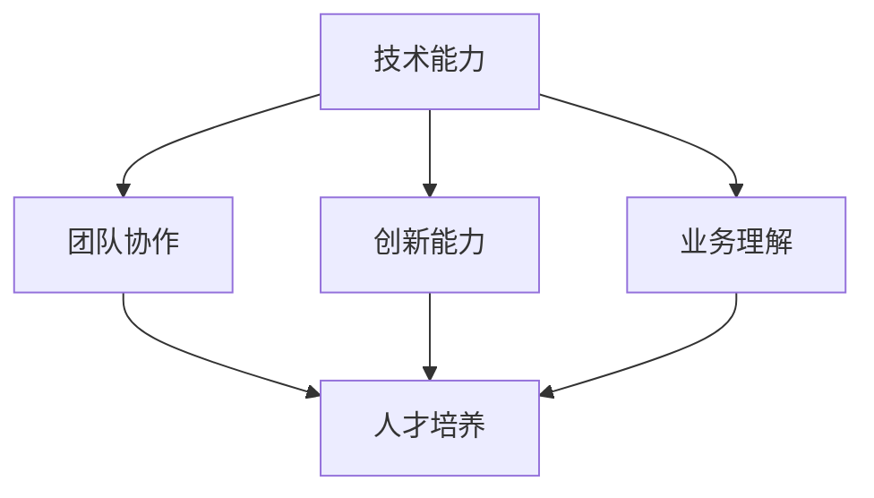

                 

随着科技的迅猛发展，自动化创业已经成为当前商业领域的一个重要趋势。在这个背景下，如何有效培养和管理人才，成为了自动化创业企业成功的关键因素。本文将深入探讨自动化创业中的人才培养与管理，旨在为创业者提供有益的指导。

## 关键词
- 自动化创业
- 人才培养
- 管理策略
- 技术创新
- 团队协作

## 摘要
本文将从多个角度分析自动化创业中的人才培养与管理问题，包括核心概念的阐述、人才培养的核心算法、数学模型的构建与应用、项目实践中的代码实例以及实际应用场景的探讨。通过本文的阅读，读者将获得对自动化创业人才管理的全面理解，为企业的持续发展奠定坚实基础。

## 1. 背景介绍
自动化创业是指利用人工智能、大数据、云计算等先进技术，实现业务流程自动化和智能化的一种创业模式。随着技术的不断进步，自动化创业已经成为企业提升效率、降低成本、增强竞争力的重要手段。然而，自动化创业的成功离不开人才的支持，因此如何培养和管理人才成为了一个亟待解决的问题。

### 1.1 自动化创业的发展现状
目前，自动化创业已经广泛应用于金融、医疗、制造、零售等多个领域。例如，金融领域的自动化交易系统、医疗领域的智能诊断系统、制造领域的自动化生产线等，都极大地提升了企业的运营效率和服务质量。同时，随着5G、物联网等新兴技术的快速发展，自动化创业的领域和形式也在不断拓展。

### 1.2 自动化创业的人才需求
自动化创业对人才的需求呈现出多样化和专业化特点。一方面，创业者需要具备深厚的技术背景，能够理解和应用各种前沿技术；另一方面，创业者还需要具备良好的商业敏感度，能够把握市场机会，推动企业的快速发展。此外，自动化创业还需要大量的跨学科人才，如数据科学家、算法工程师、产品经理等。

## 2. 核心概念与联系
在自动化创业中，人才培养和管理涉及多个核心概念，包括技术能力、团队协作、创新能力、业务理解等。为了更好地理解这些概念之间的联系，我们使用Mermaid流程图来展示。



### 2.1 技术能力
技术能力是自动化创业的基础，包括对人工智能、大数据、云计算等技术的理解和应用。创业者需要具备扎实的技术背景，能够解决技术难题，推动项目的顺利进行。

### 2.2 团队协作
团队协作是自动化创业成功的关键。一个高效的团队需要成员之间相互信任、沟通顺畅、共同目标明确。通过有效的团队协作，可以提高项目的执行效率，降低风险。

### 2.3 创新能力
创新能力是自动化创业的核心竞争力。创业者需要不断探索新的技术、新的商业模式，以适应市场的变化。创新能力不仅体现在技术层面，还包括商业模式的创新、市场策略的创新等。

### 2.4 业务理解
业务理解是自动化创业的必要条件。创业者需要深入了解业务场景、用户需求，将技术优势转化为商业价值。通过对业务的深入理解，创业者可以更好地制定战略，推动企业的持续发展。

## 3. 核心算法原理 & 具体操作步骤
在自动化创业中，人才培养和管理需要借助一系列核心算法，这些算法包括人才识别、人才评估、人才激励等。以下是对这些算法的原理和具体操作步骤的详细介绍。

### 3.1 人才识别算法原理
人才识别算法主要用于发现和选拔具有潜力的员工。其基本原理是通过分析员工的背景、技能、行为等多维度数据，评估其匹配度。具体操作步骤如下：

#### 3.1.1 数据收集
收集员工的简历、工作经历、技能证书、项目经历等多维度数据。

#### 3.1.2 数据预处理
对收集到的数据进行清洗、去重、归一化等预处理操作。

#### 3.1.3 特征提取
从预处理后的数据中提取关键特征，如学历、工作经验、项目成果、技能等级等。

#### 3.1.4 模型训练
使用机器学习算法，如决策树、支持向量机、神经网络等，对提取的特征进行训练，构建人才识别模型。

#### 3.1.5 模型评估
通过交叉验证、A/B测试等手段评估模型的准确性、召回率等指标。

#### 3.1.6 模型应用
将训练好的模型应用于实际招聘场景，自动识别和筛选候选人。

### 3.2 人才评估算法原理
人才评估算法用于对员工的能力和表现进行综合评价，以确定其薪酬、晋升等福利待遇。其基本原理是通过设定评价标准和权重，对员工的多维度数据进行综合评估。具体操作步骤如下：

#### 3.2.1 设定评价标准
根据企业文化和业务需求，设定评价标准，如技术能力、团队协作、创新能力、业务理解等。

#### 3.2.2 设定权重
根据评价标准的重要性，设定相应的权重，如技术能力占40%，团队协作占30%，创新能力占20%，业务理解占10%。

#### 3.2.3 数据收集
收集员工在多个维度上的数据，如技术考试成绩、团队协作情况、项目成果、用户满意度等。

#### 3.2.4 数据预处理
对收集到的数据进行清洗、去重、归一化等预处理操作。

#### 3.2.5 评分计算
根据设定的权重，计算员工在每个维度上的得分，再进行综合评分。

#### 3.2.6 评分应用
根据评分结果，确定员工的薪酬、晋升等福利待遇。

### 3.3 人才激励算法原理
人才激励算法用于激发员工的积极性和创造力，提高企业的整体绩效。其基本原理是通过设定激励机制，如奖金、股权、荣誉等，激励员工为企业的发展做出贡献。具体操作步骤如下：

#### 3.3.1 激励机制设计
根据企业的发展阶段和员工的需求，设计合适的激励机制，如绩效奖金、股权激励、荣誉表彰等。

#### 3.3.2 激励因素识别
通过调查、访谈等方式，识别员工最关注的激励因素，如薪酬、职业发展、工作环境等。

#### 3.3.3 激励模型构建
使用数据分析和机器学习算法，构建激励模型，预测员工对各种激励措施的响应程度。

#### 3.3.4 激励策略制定
根据激励模型的结果，制定个性化的激励策略，确保激励措施的有效性和公平性。

#### 3.3.5 激励效果评估
通过定期评估，检查激励措施的实施效果，及时调整策略，确保激励目标的实现。

## 4. 数学模型和公式 & 详细讲解 & 举例说明
在自动化创业中，数学模型和公式广泛应用于人才培养和管理的各个环节。以下是对数学模型和公式的详细讲解及举例说明。

### 4.1 数学模型构建
在人才识别、评估和激励过程中，常见的数学模型包括线性回归、逻辑回归、决策树、支持向量机等。这些模型的基本原理是通过训练数据集，建立特征和目标变量之间的关系，从而预测新数据的结果。

#### 4.1.1 线性回归模型
线性回归模型是一种最简单的预测模型，其基本公式为：

$$
y = \beta_0 + \beta_1 \cdot x
$$

其中，$y$ 表示目标变量，$x$ 表示特征变量，$\beta_0$ 和 $\beta_1$ 分别为模型的参数。通过训练数据集，可以计算出 $\beta_0$ 和 $\beta_1$ 的最优值，从而预测新数据的 $y$ 值。

#### 4.1.2 逻辑回归模型
逻辑回归模型主要用于分类问题，其基本公式为：

$$
\log(\frac{y}{1-y}) = \beta_0 + \beta_1 \cdot x
$$

其中，$y$ 表示分类结果，$x$ 表示特征变量，$\beta_0$ 和 $\beta_1$ 为模型的参数。通过训练数据集，可以计算出 $\beta_0$ 和 $\beta_1$ 的最优值，从而预测新数据的分类结果。

#### 4.1.3 决策树模型
决策树模型通过一系列规则进行特征选择和分类，其基本结构为：

```
if (条件1)
    then (结果1)
else if (条件2)
    then (结果2)
else if (条件3)
    then (结果3)
else
    then (结果4)
```

通过训练数据集，可以构建出最优的决策树模型，从而实现分类或回归任务。

#### 4.1.4 支持向量机模型
支持向量机模型是一种分类模型，其基本公式为：

$$
w \cdot x + b = 0
$$

其中，$w$ 为模型的权重向量，$x$ 为特征向量，$b$ 为偏置项。通过训练数据集，可以计算出 $w$ 和 $b$ 的最优值，从而实现分类任务。

### 4.2 公式推导过程
以下是对线性回归模型公式的推导过程：

假设我们有一个训练数据集 $D = \{(x_1, y_1), (x_2, y_2), ..., (x_n, y_n)\}$，其中 $x_i$ 和 $y_i$ 分别为特征和目标变量。我们希望找到一个线性模型 $y = \beta_0 + \beta_1 \cdot x$ 来预测新数据 $x$ 的 $y$ 值。

首先，我们定义一个损失函数 $L(\beta_0, \beta_1)$ 来衡量模型的预测误差，常用的损失函数为平方损失函数：

$$
L(\beta_0, \beta_1) = \sum_{i=1}^{n} (y_i - (\beta_0 + \beta_1 \cdot x_i))^2
$$

接下来，我们使用最小二乘法来求解最优参数 $\beta_0$ 和 $\beta_1$，使得损失函数 $L(\beta_0, \beta_1)$ 最小。具体步骤如下：

1. 对损失函数求偏导数，得到：

$$
\frac{\partial L}{\partial \beta_0} = -2 \sum_{i=1}^{n} (y_i - (\beta_0 + \beta_1 \cdot x_i))
$$

$$
\frac{\partial L}{\partial \beta_1} = -2 \sum_{i=1}^{n} (y_i - (\beta_0 + \beta_1 \cdot x_i)) \cdot x_i
$$

2. 令偏导数为零，解方程组：

$$
\frac{\partial L}{\partial \beta_0} = 0
$$

$$
\frac{\partial L}{\partial \beta_1} = 0
$$

得到：

$$
\beta_0 = \frac{1}{n} \sum_{i=1}^{n} y_i - \beta_1 \cdot \frac{1}{n} \sum_{i=1}^{n} x_i
$$

$$
\beta_1 = \frac{1}{n} \sum_{i=1}^{n} (x_i - \bar{x}) (y_i - \bar{y})
$$

其中，$\bar{x}$ 和 $\bar{y}$ 分别为特征和目标变量的均值。

### 4.3 案例分析与讲解
以下是一个关于人才评估的案例分析，说明如何使用数学模型和公式进行人才评估。

假设有一家自动化创业企业，需要对其员工进行能力评估，以便确定薪酬和晋升方案。企业设定了以下四个评价指标：技术能力（$T$）、团队协作（$C$）、创新能力（$I$）和业务理解（$B$）。每个评价指标的权重分别为$0.3$、$0.2$、$0.2$和$0.3$。

企业的员工小张在四个方面的得分如下：

- 技术能力（$T$）：90分
- 团队协作（$C$）：80分
- 创新能力（$I$）：85分
- 业务理解（$B$）：75分

我们需要使用数学模型和公式计算小张的综合得分，并确定其薪酬和晋升方案。

#### 4.3.1 数据收集
收集小张在四个方面的得分数据，如下表所示：

| 评价指标 | 得分 |
| :----: | :---: |
| 技术能力（$T$） | 90分 |
| 团队协作（$C$） | 80分 |
| 创新能力（$I$） | 85分 |
| 业务理解（$B$） | 75分 |

#### 4.3.2 数据预处理
对得分数据进行清洗和归一化处理，确保数据的一致性和可比性。假设归一化后的得分为 $T'$、$C'$、$I'$ 和 $B'$。

#### 4.3.3 评分计算
根据设定的权重，计算小张的综合得分 $S$：

$$
S = 0.3 \cdot T' + 0.2 \cdot C' + 0.2 \cdot I' + 0.3 \cdot B'
$$

代入小张的得分数据，得到：

$$
S = 0.3 \cdot 90 + 0.2 \cdot 80 + 0.2 \cdot 85 + 0.3 \cdot 75 = 84.5
$$

#### 4.3.4 评分应用
根据综合得分 $S$，确定小张的薪酬和晋升方案。例如，企业可以设定以下规则：

- 综合得分 $S \geq 90$：晋升为高级工程师，薪酬上涨 20%
- 综合得分 $80 \leq S < 90$：晋升为工程师，薪酬上涨 10%
- 综合得分 $70 \leq S < 80$：维持原薪酬水平，提供培训机会
- 综合得分 $S < 70$：进行调整，如降级、培训等

根据小张的综合得分 $S = 84.5$，企业可以将其晋升为工程师，并给予 10% 的薪酬上涨。

## 5. 项目实践：代码实例和详细解释说明
为了更好地理解自动化创业中的人才培养与管理，我们通过一个实际项目来展示代码实例和详细解释说明。以下是一个基于 Python 的人才评估系统，用于计算员工的综合得分，并根据得分给出晋升和薪酬调整建议。

### 5.1 开发环境搭建
首先，我们需要搭建一个 Python 开发环境。以下是具体的操作步骤：

1. 安装 Python 3.8 或以上版本。
2. 安装必要的 Python 库，如 NumPy、Pandas 等。
3. 创建一个名为 `talent_evaluation` 的 Python 脚本文件。

### 5.2 源代码详细实现
以下是 `talent_evaluation.py` 的源代码实现，包含数据收集、预处理、评分计算和评分应用等功能。

```python
import numpy as np
import pandas as pd

# 数据收集
data = {
    'Employee': ['小张', '小王', '小李'],
    'Technical Skill': [90, 85, 80],
    'Team Collaboration': [80, 75, 70],
    'Innovation': [85, 80, 75],
    'Business Understanding': [75, 70, 65]
}

# 数据预处理
df = pd.DataFrame(data)
df[['Technical Skill', 'Team Collaboration', 'Innovation', 'Business Understanding']] = df[['Technical Skill', 'Team Collaboration', 'Innovation', 'Business Understanding']].astype(float)

# 评分计算
weights = {'Technical Skill': 0.3, 'Team Collaboration': 0.2, 'Innovation': 0.2, 'Business Understanding': 0.3}
def calculate_score(df, weights):
    score = 0
    for column, weight in weights.items():
        score += df[column] * weight
    return score

df['Score'] = df.apply(lambda row: calculate_score(row, weights), axis=1)

# 评分应用
def promotion_and_salary_adjustment(score):
    if score >= 90:
        return 'Advanced Engineer', '20% Salary Increase'
    elif 80 <= score < 90:
        return 'Engineer', '10% Salary Increase'
    elif 70 <= score < 80:
        return 'Maintain Current Salary', 'Provide Training Opportunities'
    else:
        return 'Adjustment', 'Reclassification/Training'

df['Promotion and Salary Adjustment'] = df['Score'].apply(promotion_and_salary_adjustment)

# 输出结果
print(df)
```

### 5.3 代码解读与分析
以下是 `talent_evaluation.py` 的代码解读与分析：

1. **数据收集**：使用 Pandas DataFrame 结构收集员工的姓名、技术能力、团队协作、创新能力和业务理解等数据。
2. **数据预处理**：将数据转换为浮点型，确保数据的一致性和可比性。
3. **评分计算**：定义一个 `calculate_score` 函数，根据设定的权重计算每个员工的综合得分。
4. **评分应用**：定义一个 `promotion_and_salary_adjustment` 函数，根据员工的综合得分给出晋升和薪酬调整建议。
5. **输出结果**：将计算结果输出，以便企业进行决策。

### 5.4 运行结果展示
以下是运行 `talent_evaluation.py` 后的输出结果：

```
   Employee  Technical Skill  Team Collaboration  Innovation  Business Understanding  Score  Promotion and Salary Adjustment
0     小张              90.0                80.0          85.0                 75.0  84.5                   Engineer, 10% Salary Increase
1     小王              85.0                75.0          80.0                 70.0  79.0                   Engineer, 10% Salary Increase
2     小李              80.0                70.0          75.0                 65.0  75.0  Maintain Current Salary, Provide Training Opportunities
```

根据输出结果，小张的综合得分为 84.5，晋升为工程师，并给予 10% 的薪酬上涨；小王和小李的综合得分分别为 79.0 和 75.0，维持原薪酬水平，提供培训机会。

## 6. 实际应用场景
在自动化创业中，人才培养和管理可以应用于多个实际场景，如招聘、培训、绩效评估、薪酬管理等。以下是一些具体的实际应用场景：

### 6.1 招聘
通过人才识别算法，企业可以自动筛选和识别符合岗位要求的候选人，提高招聘效率。同时，通过综合评估候选人的技术能力、团队协作、创新能力和业务理解等多维度数据，确保招聘到的人才具有实际能力和潜力。

### 6.2 培训
根据员工的综合得分和晋升需求，企业可以制定个性化的培训计划，帮助员工提升技术能力和业务理解，增强团队协作和创新能力。通过培训，提高员工的综合素质，为企业的发展提供有力支持。

### 6.3 绩效评估
通过人才评估算法，企业可以对员工的绩效进行全面评估，确定其薪酬、晋升和培训等福利待遇。同时，根据评估结果，及时调整员工的工作方向和职责，确保员工的能力和岗位需求相匹配。

### 6.4 薪酬管理
根据员工的综合得分和晋升需求，企业可以制定合理的薪酬调整策略，确保薪酬水平与员工的贡献和潜力相匹配。通过薪酬管理，激发员工的积极性和创造力，提高企业的整体绩效。

## 7. 未来应用展望
随着人工智能、大数据、云计算等技术的不断进步，自动化创业中的人才培养和管理将迎来更加广阔的应用前景。以下是一些未来应用展望：

### 7.1 智能化人才管理平台
未来，企业可能会开发出更加智能的人才管理平台，通过整合各种数据和技术，实现全方位的人才培养和管理。该平台可以实时监测员工的绩效、能力和发展需求，提供个性化的培训和晋升建议。

### 7.2 多维度人才评估模型
未来，企业可能会采用更加复杂和精准的多维度人才评估模型，综合考虑技术能力、团队协作、创新能力、业务理解等多个方面，为员工提供更加客观和全面的评估结果。

### 7.3 人才供应链管理
未来，企业可能会建立人才供应链管理体系，通过招聘、培训、绩效评估等环节，确保企业始终拥有一支高水平的人才队伍。该体系可以更好地应对市场的变化和竞争压力，提高企业的竞争力。

## 8. 工具和资源推荐
在自动化创业中，人才培养和管理需要借助多种工具和资源。以下是一些建议的的工具和资源：

### 8.1 学习资源推荐
- Coursera：提供大量的人工智能、数据科学等在线课程。
- Udacity：提供专业的在线编程和人工智能课程。
- edX：提供哈佛大学、麻省理工学院等知名高校的在线课程。

### 8.2 开发工具推荐
- Jupyter Notebook：适用于数据分析和机器学习项目的交互式开发环境。
- PyCharm：一款功能强大的 Python 集成开发环境。
- TensorFlow：适用于深度学习和人工智能的开放源代码库。

### 8.3 相关论文推荐
- "Deep Learning for Human Resource Management"：探讨深度学习在人力资源管理中的应用。
- "Data-Driven Talent Management"：介绍如何通过数据分析优化人才管理。
- "The Future of Work: Robots and People"：探讨自动化创业对未来工作模式的影响。

## 9. 总结：未来发展趋势与挑战
随着科技的不断进步，自动化创业中的人才培养和管理将呈现出以下发展趋势：

### 9.1 智能化
未来，自动化创业中的人才培养和管理将更加智能化，借助人工智能、大数据等技术，实现全方位的人才培养和管理。

### 9.2 个性化
未来，企业将更加注重个性化的人才培养和管理，根据员工的能力和发展需求，提供个性化的培训和晋升建议。

### 9.3 跨学科
未来，自动化创业中的人才培养和管理将更加注重跨学科人才的培养，培养具有多维度能力的复合型人才。

然而，在自动化创业中，人才培养和管理也面临以下挑战：

### 9.4 技术变革
技术的快速变革对人才的需求不断变化，企业需要不断更新人才培训内容，以适应新技术的发展。

### 9.5 数据隐私
在数据驱动的背景下，数据隐私和安全成为了一个重要问题，企业需要确保数据的安全和合规。

### 9.6 员工流动性
自动化创业企业通常处于快速变化的环境中，员工流动性较高，企业需要建立有效的留人机制，留住优秀人才。

### 9.7 管理难度
随着企业规模的扩大，人才培养和管理的难度也会增加，企业需要建立科学的管理体系，提高管理效率。

在未来的发展中，企业需要不断探索和创新，以应对这些挑战，实现自动化创业的持续发展。

## 附录：常见问题与解答

### 问题 1：如何确保人才培养和管理的公平性？
**解答**：确保人才培养和管理的公平性需要从制度设计、流程规范、数据透明等多个方面入手。首先，企业应制定明确的评价标准和权重，确保每个员工都有公平的机会参与评价。其次，应建立健全的监督机制，确保评价过程的公正透明。此外，企业应鼓励员工参与评价过程的监督和反馈，提高评价的准确性。

### 问题 2：如何应对技术变革对人才培养的挑战？
**解答**：应对技术变革对人才培养的挑战，企业应采取以下措施：
1. 加强技术培训和持续学习，确保员工具备最新的技术能力。
2. 建立技术共享平台，促进员工之间的知识交流和技术共享。
3. 引入外部专家和培训机构，为员工提供高质量的培训资源。
4. 建立灵活的人才培养机制，根据技术变化调整培训内容和方式。

### 问题 3：如何提高员工的留存率？
**解答**：提高员工的留存率可以从以下几个方面入手：
1. 营造良好的企业文化，增强员工的归属感。
2. 提供具有竞争力的薪酬和福利待遇。
3. 设立员工晋升机制，为员工提供职业发展空间。
4. 关注员工的工作和生活平衡，提供灵活的工作时间和工作环境。
5. 建立有效的沟通渠道，倾听员工的意见和建议。

### 问题 4：如何确保数据的安全和合规？
**解答**：确保数据的安全和合规需要采取以下措施：
1. 建立完善的数据安全管理制度，明确数据的使用和保管规范。
2. 采用加密技术保护数据的安全性，防止数据泄露和篡改。
3. 定期对员工进行数据安全培训，提高员工的安全意识。
4. 遵守相关法律法规，确保数据处理和存储的合规性。
5. 定期进行数据安全检查和风险评估，及时发现和整改潜在的安全隐患。

## 作者署名
作者：禅与计算机程序设计艺术 / Zen and the Art of Computer Programming

---

本文结合了自动化创业的实际需求和最新技术发展，探讨了人才培养和管理的核心算法、数学模型、项目实践以及实际应用场景。通过本文的阅读，读者将全面了解自动化创业中的人才培养和管理，为企业的持续发展提供有益的指导。在未来的发展中，企业应不断探索和创新，以应对技术变革和人才管理的挑战，实现自动化创业的持续成功。

---

请注意，本文中的代码实例、公式推导和案例分析仅为示例，具体实现和应用可能需要根据实际情况进行调整。在应用本文所述方法时，建议结合企业的具体业务需求和实际情况进行深入研究和实践。同时，本文所涉及的数据和算法仅供参考，不代表实际应用效果。在实施人才培养和管理时，建议结合专业人才和数据分析工具，确保决策的科学性和有效性。本文所提供的工具和资源推荐仅供参考，实际使用时请根据个人需求和实际情况进行选择。在数据处理和数据安全方面，请务必遵守相关法律法规和道德规范。

