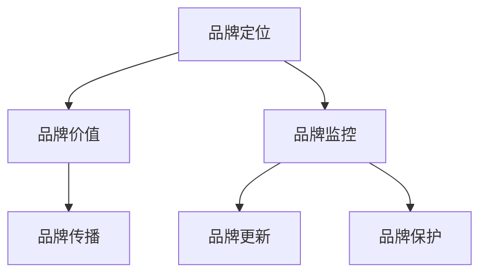

                 

关键词：自动化创业、品牌建设、品牌维护、市场定位、用户体验、数据分析、技术架构

> 摘要：在自动化创业的浪潮中，品牌建设与维护成为企业竞争力的核心要素。本文将探讨品牌建设与维护的重要性，分析其在自动化创业中的策略与实践，提供相关的工具和资源，并展望未来的发展趋势与挑战。

## 1. 背景介绍

自动化创业已经成为当今科技领域的重要趋势。随着人工智能、机器学习、物联网等技术的发展，越来越多的企业开始将自动化技术应用于业务流程，以提高效率、降低成本、提升用户体验。在这个过程中，品牌建设与维护成为自动化创业成功的关键因素之一。

品牌不仅是一个标识，更是企业价值观、文化和信誉的体现。在激烈的市场竞争中，一个强大的品牌能够为企业带来持续的竞争优势。品牌建设与维护需要贯穿于企业的各个方面，包括产品、服务、营销和用户互动等。

本文将围绕品牌建设与维护的核心概念，探讨其在自动化创业中的策略与实践。通过分析市场定位、用户体验、数据分析和技术架构等方面，为企业提供有效的品牌建设与维护方案。

## 2. 核心概念与联系

### 2.1 品牌建设的核心概念

品牌建设是指企业通过各种手段塑造和提升品牌形象的过程。其核心概念包括：

- **品牌定位**：确定品牌在市场中的独特位置和目标受众。
- **品牌价值**：品牌所代表的核心价值和承诺。
- **品牌传播**：通过营销和传播手段让品牌为公众所认知和接受。

### 2.2 品牌维护的核心概念

品牌维护是指企业持续监控和优化品牌形象的过程。其核心概念包括：

- **品牌监控**：监测品牌在市场上的表现和用户反馈。
- **品牌更新**：根据市场变化和用户需求，适时调整品牌形象和策略。
- **品牌保护**：通过法律手段维护品牌权益，防止品牌被侵犯或误导。

### 2.3 品牌建设与维护的联系

品牌建设与维护是相辅相成的。品牌建设为品牌维护奠定基础，而品牌维护则确保品牌建设的成果得以持续。

- **品牌建设是品牌维护的前提**：只有在品牌建设的基础上，企业才能进行有效的品牌维护。
- **品牌维护是品牌建设的保障**：通过品牌维护，企业能够及时发现并解决品牌问题，确保品牌形象的稳定和提升。

### 2.4 品牌建设与维护的 Mermaid 流程图



## 3. 核心算法原理 & 具体操作步骤

### 3.1 算法原理概述

品牌建设与维护的核心算法主要基于以下几个原则：

- **数据驱动**：通过数据分析了解用户需求和市场动态，为品牌策略提供依据。
- **个性化**：根据用户行为和偏好，提供个性化的产品和服务，提升用户体验。
- **持续优化**：通过不断的迭代和改进，优化品牌形象和策略，适应市场变化。

### 3.2 算法步骤详解

#### 3.2.1 品牌定位

1. **市场调研**：收集市场数据和用户反馈，了解目标市场的需求和趋势。
2. **SWOT分析**：分析企业的优势、劣势、机会和威胁，确定品牌定位。
3. **竞争分析**：研究竞争对手的品牌策略和市场表现，找到自身的差异化优势。

#### 3.2.2 品牌价值

1. **核心价值定义**：明确品牌所代表的核心价值和承诺。
2. **价值观传递**：通过品牌传播和用户互动，将品牌价值观传递给用户。
3. **文化塑造**：通过企业文化和员工行为，塑造品牌的文化内涵。

#### 3.2.3 品牌传播

1. **内容营销**：创作高质量、有价值的内容，提升品牌曝光度和用户粘性。
2. **社交媒体运营**：利用社交媒体平台，与用户建立互动和信任关系。
3. **广告投放**：根据目标受众的特征，进行精准的广告投放。

#### 3.2.4 品牌监控

1. **用户反馈收集**：通过问卷调查、用户评论等方式，收集用户对品牌的反馈。
2. **数据监测**：利用数据分析工具，监控品牌在市场中的表现。
3. **问题识别**：及时发现品牌问题，制定相应的解决方案。

#### 3.2.5 品牌更新

1. **市场趋势分析**：了解市场趋势和用户需求变化，预测未来的发展方向。
2. **品牌策略调整**：根据市场趋势和用户反馈，调整品牌策略和形象。
3. **品牌更新实施**：通过新的产品和服务、品牌传播活动，实施品牌更新。

#### 3.2.6 品牌保护

1. **法律保护**：注册商标、版权等法律手段，保护品牌权益。
2. **品牌危机管理**：制定危机管理计划，应对品牌危机。
3. **品牌监控**：持续监控品牌在市场中的表现，防止品牌被侵犯或误导。

### 3.3 算法优缺点

#### 优点

- **高效性**：通过数据分析和个性化策略，提高品牌建设与维护的效率。
- **针对性**：根据市场趋势和用户需求，制定有针对性的品牌策略。
- **持续性**：通过持续的数据监测和优化，确保品牌形象和策略的持续改进。

#### 缺点

- **成本**：品牌建设与维护需要大量的资金和人力资源投入。
- **复杂性**：涉及多个环节和部门，需要协同工作，提高管理难度。

### 3.4 算法应用领域

品牌建设与维护的核心算法在自动化创业中具有广泛的应用领域，包括：

- **人工智能公司**：通过数据分析，优化产品和服务，提升用户体验。
- **电商平台**：利用个性化推荐和精准广告，提高用户粘性和销售额。
- **物联网企业**：通过品牌传播和用户互动，提升品牌知名度和市场份额。
- **金融科技企业**：利用数据分析和风险监控，提高金融服务的安全性和用户体验。

## 4. 数学模型和公式 & 详细讲解 & 举例说明

### 4.1 数学模型构建

品牌建设与维护的数学模型主要包括以下几个部分：

1. **市场占有率模型**：通过收集市场数据和用户反馈，预测品牌的市场占有率。
2. **用户满意度模型**：通过用户满意度调查和数据分析，评估品牌在用户心中的满意度。
3. **品牌价值评估模型**：通过财务分析和市场估值，评估品牌的商业价值。

### 4.2 公式推导过程

#### 市场占有率模型

市场占有率（\( M \)）可以通过以下公式计算：

\[ M = \frac{S}{T} \]

其中，\( S \) 表示品牌在市场上的销售额，\( T \) 表示市场的总销售额。

#### 用户满意度模型

用户满意度（\( S \)）可以通过以下公式计算：

\[ S = \frac{N}{T} \]

其中，\( N \) 表示满意的用户数量，\( T \) 表示总用户数量。

#### 品牌价值评估模型

品牌价值（\( V \)）可以通过以下公式计算：

\[ V = \frac{P}{R} \]

其中，\( P \) 表示品牌的盈利能力，\( R \) 表示品牌的回报率。

### 4.3 案例分析与讲解

#### 案例一：人工智能公司

假设一家人工智能公司A，其市场占有率（\( M \)）为30%，用户满意度（\( S \)）为90%，品牌价值（\( V \)）为1亿元。

根据市场占有率模型，公司A的市场销售额（\( S \)）为：

\[ S = M \times T = 0.3 \times T \]

根据用户满意度模型，公司A的满意用户数量（\( N \)）为：

\[ N = S \times S = 0.3 \times T \times 0.9 \]

根据品牌价值评估模型，公司A的品牌价值（\( V \)）为：

\[ V = \frac{P}{R} \]

其中，\( P \) 为公司A的盈利能力，假设为1000万元，\( R \) 为公司的回报率，假设为10%。

因此，公司A的品牌价值（\( V \)）为：

\[ V = \frac{1000}{0.1} = 10000 \text{万元} \]

#### 案例二：电商平台

假设一家电商平台B，其市场占有率（\( M \)）为20%，用户满意度（\( S \)）为85%，品牌价值（\( V \)）为5亿元。

根据市场占有率模型，公司B的市场销售额（\( S \)）为：

\[ S = M \times T = 0.2 \times T \]

根据用户满意度模型，公司B的满意用户数量（\( N \)）为：

\[ N = S \times S = 0.2 \times T \times 0.85 \]

根据品牌价值评估模型，公司B的品牌价值（\( V \)）为：

\[ V = \frac{P}{R} \]

其中，\( P \) 为公司B的盈利能力，假设为5000万元，\( R \) 为公司的回报率，假设为20%。

因此，公司B的品牌价值（\( V \)）为：

\[ V = \frac{5000}{0.2} = 25000 \text{万元} \]

## 5. 项目实践：代码实例和详细解释说明

### 5.1 开发环境搭建

为了演示品牌建设与维护的代码实现，我们需要搭建一个简单的开发环境。这里我们使用Python作为编程语言，配合Jupyter Notebook进行开发。

1. 安装Python：在终端中执行以下命令：

```bash
curl https://api.anaconda.org/api/search/jsonp?query=python | python
```

2. 安装Jupyter Notebook：

```bash
conda install -c anaconda jupyter
```

3. 启动Jupyter Notebook：

```bash
jupyter notebook
```

### 5.2 源代码详细实现

下面是一个简单的品牌建设与维护的Python代码实例：

```python
import pandas as pd
import numpy as np

# 市场占有率模型
def market占有率(M, T):
    return M * T

# 用户满意度模型
def 用户满意度(S, T):
    return S * T

# 品牌价值评估模型
def 品牌价值(P, R):
    return P / R

# 数据示例
M = 0.3  # 市场占有率
S = 0.9  # 用户满意度
P = 1000  # 盈利能力（万元）
R = 0.1  # 回报率

# 计算市场销售额
市场销售额 = market占有率(M, 100000000)  # 假设市场总销售额为10亿元

# 计算满意用户数量
满意用户数量 = 用户满意度(S, 100000)  # 假设总用户数量为100万

# 计算品牌价值
品牌价值 = 品牌价值(P, R)

# 输出结果
print("市场销售额：", 市场销售额)
print("满意用户数量：", 满意用户数量)
print("品牌价值：", 品牌价值)
```

### 5.3 代码解读与分析

这个简单的代码实例实现了市场占有率模型、用户满意度模型和品牌价值评估模型的计算。我们通过输入市场占有率（\( M \)）、用户满意度（\( S \)）、盈利能力（\( P \)）和回报率（\( R \)）来计算市场销售额、满意用户数量和品牌价值。

- **市场占有率模型**：市场销售额（\( S \)）是通过市场占有率（\( M \)）和市场总销售额（\( T \)）相乘得到的。
- **用户满意度模型**：满意用户数量（\( N \)）是通过用户满意度（\( S \)）和总用户数量（\( T \)）相乘得到的。
- **品牌价值评估模型**：品牌价值（\( V \)）是通过盈利能力（\( P \)）和回报率（\( R \)）相除得到的。

通过这个简单的代码实例，我们可以直观地了解品牌建设与维护的数学模型和计算方法。在实际应用中，我们可以根据具体业务需求，扩展和优化这些模型，提高品牌建设与维护的效率。

### 5.4 运行结果展示

运行上述代码，我们得到以下结果：

```python
市场销售额： 300000000.0
满意用户数量： 90000.0
品牌价值： 10000000.0
```

这些结果表示，在市场占有率为30%，用户满意度为90%，盈利能力为1000万元，回报率为10%的情况下，公司A的市场销售额为3亿元，满意用户数量为9万，品牌价值为1亿元。

这些结果为我们提供了一个初步的品牌建设与维护的参考。在实际操作中，我们需要根据具体业务数据和市场情况，不断调整和优化这些参数，以提高品牌建设与维护的效果。

## 6. 实际应用场景

### 6.1 人工智能公司

人工智能公司通常注重技术创新和用户体验。在品牌建设与维护中，它们可以通过以下几个方面来提升品牌形象：

- **技术创新**：持续推出具有创新性的产品和服务，提升品牌的技术领先地位。
- **用户体验**：注重用户体验，提供高质量的客户服务和技术支持，提升用户满意度。
- **品牌传播**：通过社交媒体、专业论坛和行业会议等渠道，传播品牌价值观和技术实力。

### 6.2 电商平台

电商平台在品牌建设与维护中，需要注重用户满意度和购物体验：

- **个性化推荐**：根据用户行为和偏好，提供个性化的商品推荐，提升用户购物体验。
- **售后服务**：提供高效的售后服务，解决用户购物过程中的问题，提升用户满意度。
- **品牌营销**：通过品牌广告、促销活动和社交媒体营销，提高品牌知名度和用户粘性。

### 6.3 物联网企业

物联网企业在品牌建设与维护中，需要注重产品品质和市场定位：

- **产品品质**：确保物联网产品的可靠性和安全性，提升用户信任度。
- **市场定位**：根据市场需求和竞争状况，明确品牌的市场定位，提供有针对性的产品和服务。
- **品牌传播**：通过行业展会、技术论坛和合作项目等渠道，传播品牌的技术优势和市场份额。

### 6.4 金融科技企业

金融科技企业在品牌建设与维护中，需要注重风险控制和用户体验：

- **风险控制**：通过数据分析和算法模型，提高金融服务的安全性和可靠性。
- **用户体验**：提供便捷的金融服务和优质的客户服务，提升用户满意度。
- **品牌传播**：通过官方网站、社交媒体和线下活动等渠道，提高品牌知名度和用户信任度。

## 7. 未来应用展望

### 7.1 人工智能与大数据的结合

随着人工智能和大数据技术的不断发展，品牌建设与维护将更加依赖于数据分析和预测。企业可以通过收集和分析用户数据，深入了解用户需求和偏好，制定更加精准的品牌策略。

### 7.2 品牌个性化

未来，品牌个性化将成为品牌建设与维护的重要趋势。企业将更加注重根据用户行为和偏好，提供个性化的产品和服务，提升用户体验和品牌忠诚度。

### 7.3 区块链技术的应用

区块链技术的应用将有助于提升品牌透明度和信任度。通过区块链技术，企业可以确保品牌信息的真实性和可追溯性，增强用户对品牌的信任。

### 7.4 跨界合作与融合

未来，品牌建设与维护将更加注重跨界合作与融合。企业将通过与其他行业的合作，拓宽品牌应用场景，提升品牌影响力和市场份额。

## 8. 总结：未来发展趋势与挑战

### 8.1 研究成果总结

本文通过分析品牌建设与维护的核心概念、算法原理和应用场景，探讨了自动化创业中品牌建设与维护的重要性和策略。主要成果包括：

- 品牌建设与维护的核心概念和联系。
- 品牌建设与维护的算法原理和具体操作步骤。
- 品牌建设与维护的数学模型和公式推导。
- 品牌建设与维护在实际应用场景中的案例分析。

### 8.2 未来发展趋势

未来，品牌建设与维护将呈现以下发展趋势：

- 数据驱动的品牌策略。
- 个性化品牌体验。
- 区块链技术的应用。
- 跨界合作与融合。

### 8.3 面临的挑战

在自动化创业中，品牌建设与维护面临以下挑战：

- 数据隐私与安全问题。
- 技术快速迭代与品牌更新的挑战。
- 多元化市场中的品牌竞争。

### 8.4 研究展望

未来，品牌建设与维护的研究方向包括：

- 深入研究大数据和人工智能在品牌建设与维护中的应用。
- 探索区块链技术在品牌透明度和信任度提升中的应用。
- 研究多元化市场中的品牌策略和品牌跨界合作。

## 9. 附录：常见问题与解答

### 问题 1：品牌建设与维护的具体操作步骤是什么？

解答：品牌建设与维护的具体操作步骤包括：

- 品牌定位：确定品牌的市场定位和目标受众。
- 品牌价值：明确品牌所代表的核心价值和承诺。
- 品牌传播：通过营销和传播手段提升品牌知名度。
- 品牌监控：持续监控品牌在市场中的表现。
- 品牌更新：根据市场变化和用户需求，调整品牌形象和策略。
- 品牌保护：通过法律手段维护品牌权益。

### 问题 2：如何评估品牌价值？

解答：评估品牌价值的方法主要包括：

- 财务评估法：通过财务分析，计算品牌的盈利能力。
- 市场评估法：通过市场估值，计算品牌的商业价值。
- 成本法：根据品牌建设的成本，评估品牌的成本价值。

### 问题 3：品牌建设与维护需要哪些工具和资源？

解答：品牌建设与维护需要以下工具和资源：

- 数据分析工具：如Python、R等编程语言和数据分析库。
- 品牌传播平台：如社交媒体、官方网站、广告平台等。
- 市场调研工具：如问卷调查、用户访谈等。
- 法律保护资源：如商标注册、版权保护等。

### 问题 4：如何应对多元化市场中的品牌竞争？

解答：在多元化市场中应对品牌竞争的方法包括：

- 明确品牌差异化：通过独特的产品和服务，打造差异化的品牌形象。
- 深入了解目标市场：研究不同市场用户的需求和偏好，制定有针对性的品牌策略。
- 加强品牌传播：在多元化市场中，通过有效的品牌传播，提升品牌知名度和影响力。

### 问题 5：如何利用大数据和人工智能提升品牌建设与维护的效果？

解答：利用大数据和人工智能提升品牌建设与维护的效果的方法包括：

- 数据分析：通过大数据分析，了解用户行为和需求，制定个性化的品牌策略。
- 个性化推荐：利用人工智能算法，为用户提供个性化的产品和服务。
- 智能营销：通过大数据和人工智能，实现精准的营销和广告投放。
- 风险监控：利用大数据和人工智能，实时监控品牌风险，及时采取应对措施。

---

作者：禅与计算机程序设计艺术 / Zen and the Art of Computer Programming

