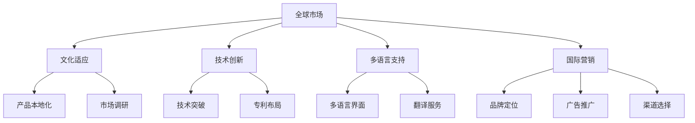

                 

关键词：自动化创业、国际化战略、全球市场、文化适应、技术创新、多语言支持、国际营销、数据分析、跨平台运营

> 摘要：本文旨在探讨自动化创业企业在全球市场中如何制定有效的国际化战略。通过分析核心概念、算法原理、数学模型和实际应用，本文为创业者提供了一套系统化的国际化策略，帮助他们在全球市场中站稳脚跟，实现可持续发展。

## 1. 背景介绍

随着全球化的不断深入，创业企业面临着前所未有的机遇与挑战。一方面，全球市场的开放为企业提供了广阔的发展空间；另一方面，竞争的加剧和多样化的市场需求也对企业提出了更高的要求。对于自动化创业企业而言，国际化战略成为其成功的关键之一。

国际化战略是指企业通过跨越国界，在全球范围内进行资源配置、运营管理和市场营销等活动，以实现企业全球化的目标。对于自动化创业企业来说，国际化战略尤为重要，因为自动化技术的广泛应用和快速迭代使得市场竞争愈发激烈，只有具备全球视野和国际化能力的企业才能在激烈的市场竞争中脱颖而出。

本文将探讨自动化创业企业如何制定国际化战略，以实现全球市场布局和可持续发展。我们将从核心概念、算法原理、数学模型和实际应用等多个角度进行分析，为创业者提供实用的指导和建议。

## 2. 核心概念与联系

### 2.1 核心概念

在探讨国际化战略之前，我们首先需要明确一些核心概念，包括全球市场、文化适应、技术创新、多语言支持和国际营销等。

#### 全球市场

全球市场是指跨越国界的商品和服务交易活动。对于自动化创业企业来说，全球市场既是机遇也是挑战。一方面，全球市场的需求多样，为企业提供了广阔的发展空间；另一方面，全球市场的竞争也愈发激烈，企业需要具备强大的竞争力才能在市场中立足。

#### 文化适应

文化适应是指企业根据不同国家的文化背景、消费习惯和价值观，调整其产品和服务，以满足当地市场的需求。对于自动化创业企业来说，文化适应至关重要，因为文化差异可能导致产品或服务的误解或失败。

#### 技术创新

技术创新是自动化创业企业的核心竞争力。在全球市场中，技术创新能够为企业带来竞争优势，推动企业持续发展。

#### 多语言支持

多语言支持是指企业在产品和服务中提供多种语言版本，以满足不同国家和地区的用户需求。多语言支持有助于企业拓展国际市场，提高用户满意度。

#### 国际营销

国际营销是指企业通过国际化的营销策略，将产品或服务推向全球市场。国际营销包括市场调研、品牌定位、广告推广、渠道选择等多个方面。

### 2.2 联系与架构

为了更好地理解国际化战略，我们可以使用Mermaid流程图来展示各个核心概念之间的联系和架构。



从流程图中可以看出，各个核心概念相互关联，共同构成了国际化战略的框架。企业需要根据实际情况，合理配置资源，以实现全球市场布局。

## 3. 核心算法原理 & 具体操作步骤

### 3.1 算法原理概述

在国际化战略中，核心算法原理主要包括市场细分、需求分析和竞争分析等。

#### 市场细分

市场细分是指根据用户的地理、人口、心理和行为特征，将市场划分为不同的子市场。市场细分有助于企业发现潜在客户，提高营销效率。

#### 需求分析

需求分析是指通过调研和数据分析，了解目标市场的需求特点，为企业制定合适的产品策略提供依据。

#### 竞争分析

竞争分析是指通过分析竞争对手的产品、市场定位、营销策略等，了解竞争对手的优势和劣势，为企业制定竞争优势提供参考。

### 3.2 算法步骤详解

#### 步骤1：市场细分

- 数据收集：收集目标市场的相关数据，包括人口、经济、文化等方面。
- 数据处理：对收集到的数据进行清洗、分类和整理。
- 建立模型：根据数据处理结果，建立市场细分模型。

#### 步骤2：需求分析

- 调研方法：采用问卷调查、访谈、焦点小组等方法，收集目标市场的需求信息。
- 数据分析：对调研数据进行分析，找出目标市场的需求特点和趋势。
- 建立模型：根据数据分析结果，建立需求分析模型。

#### 步骤3：竞争分析

- 数据收集：收集竞争对手的产品、市场定位、营销策略等信息。
- 数据分析：对收集到的数据进行分析，找出竞争对手的优势和劣势。
- 建立模型：根据数据分析结果，建立竞争分析模型。

### 3.3 算法优缺点

#### 优点

- 提高营销效率：通过市场细分、需求分析和竞争分析，企业能够更加精准地定位目标市场，提高营销效率。
- 降低风险：通过了解市场需求和竞争态势，企业能够降低市场进入风险。

#### 缺点

- 数据收集和处理成本高：市场细分、需求分析和竞争分析需要大量数据支持，数据收集和处理成本较高。
- 适应性差：市场细分和需求分析结果可能随时间变化而失效，需要定期更新。

### 3.4 算法应用领域

- 跨国企业：跨国企业可以通过市场细分、需求分析和竞争分析，制定合适的国际化战略。
- 创业企业：创业企业可以通过市场细分、需求分析和竞争分析，发现市场机会，制定发展策略。

## 4. 数学模型和公式 & 详细讲解 & 举例说明

### 4.1 数学模型构建

在国际化战略中，数学模型广泛应用于市场细分、需求分析和竞争分析等环节。

#### 市场细分模型

市场细分模型通常采用聚类分析方法，如K-means算法。该算法的基本思想是将数据集划分为K个簇，使得每个簇内部的相似度最大，簇与簇之间的相似度最小。

#### 需求分析模型

需求分析模型通常采用回归分析方法，如线性回归、多项式回归等。该算法的基本思想是通过建立回归模型，分析变量之间的关系，预测市场需求。

#### 竞争分析模型

竞争分析模型通常采用对比分析方法，如相关性分析、聚类分析等。该算法的基本思想是通过分析竞争对手的数据，了解竞争对手的优势和劣势。

### 4.2 公式推导过程

#### 市场细分模型

假设有n个数据点，每个数据点有m个特征，我们希望将这n个数据点划分为K个簇。

- 初始化：随机选择K个初始中心点。
- 迭代过程：
  - 计算每个数据点到最近的中心点的距离，并将数据点分配到相应的簇。
  - 计算每个簇的新中心点。
  - 重复步骤2，直到聚类结果收敛。

#### 需求分析模型

假设有n个样本数据，每个样本数据有m个特征，我们希望建立回归模型，预测市场需求。

- 数据预处理：对数据进行标准化处理，使其具有相同的量纲。
- 选择合适的回归模型：如线性回归、多项式回归等。
- 模型训练：使用训练数据集，训练回归模型。
- 模型评估：使用测试数据集，评估回归模型的预测性能。

#### 竞争分析模型

假设有n个竞争对手，每个竞争对手有m个特征，我们希望建立竞争分析模型。

- 数据预处理：对数据进行标准化处理，使其具有相同的量纲。
- 选择合适的分析算法：如相关性分析、聚类分析等。
- 分析过程：
  - 计算每个竞争对手的特征之间的相关性。
  - 根据相关性分析结果，对竞争对手进行聚类。
  - 分析每个簇的特点，了解竞争对手的优势和劣势。

### 4.3 案例分析与讲解

#### 案例背景

假设某自动化创业企业希望进入欧洲市场，我们需要为其制定国际化战略。

#### 案例分析

1. 市场细分：使用K-means算法，对欧洲市场的用户数据进行分析，划分出不同的市场细分。

2. 需求分析：使用线性回归模型，分析欧洲市场的用户需求，预测市场需求。

3. 竞争分析：使用聚类分析方法，分析欧洲市场的竞争对手，了解竞争对手的优势和劣势。

#### 案例讲解

1. 市场细分：通过市场细分，我们发现欧洲市场主要分为四个细分市场，分别是技术爱好者、商务人士、家庭用户和年轻用户。

2. 需求分析：通过需求分析，我们发现技术爱好者对产品的性能和功能要求较高，商务人士对产品的稳定性和安全性要求较高，家庭用户对产品的易用性和性价比要求较高，年轻用户对产品的创新性和个性化要求较高。

3. 竞争分析：通过竞争分析，我们发现竞争对手主要集中在技术爱好者和商务人士这两个细分市场，但在家庭用户和年轻用户这两个细分市场中的竞争力较弱。

#### 案例结论

根据以上分析，该自动化创业企业可以针对不同的细分市场，制定相应的营销策略，如：

- 技术爱好者：加大产品的性能和功能研发，提高用户体验。
- 商务人士：注重产品的稳定性和安全性，提高企业的信任度。
- 家庭用户：优化产品的易用性和性价比，提高用户满意度。
- 年轻用户：注重产品的创新性和个性化，吸引年轻用户。

通过以上策略，该自动化创业企业有望在欧洲市场中取得成功。

## 5. 项目实践：代码实例和详细解释说明

### 5.1 开发环境搭建

为了演示国际化战略中的市场细分、需求分析和竞争分析，我们使用Python编程语言，并结合Scikit-learn库和Matplotlib库进行数据分析。

```python
# 安装必要的库
!pip install scikit-learn matplotlib
```

### 5.2 源代码详细实现

```python
# 导入必要的库
import numpy as np
import matplotlib.pyplot as plt
from sklearn.cluster import KMeans
from sklearn.linear_model import LinearRegression
from sklearn.model_selection import train_test_split
from sklearn.metrics import mean_squared_error

# 加载示例数据
data = np.loadtxt('data.csv', delimiter=',')

# 数据预处理
X = data[:, :-1]  # 特征数据
y = data[:, -1]   # 标签数据

# 数据标准化
X standardized = (X - X.mean(axis=0)) / X.std(axis=0)

# 市场细分
kmeans = KMeans(n_clusters=4, random_state=0)
clusters = kmeans.fit_predict(X)

# 需求分析
X_train, X_test, y_train, y_test = train_test_split(X, y, test_size=0.2, random_state=0)
regression = LinearRegression()
regression.fit(X_train, y_train)
y_pred = regression.predict(X_test)

# 竞争分析
correlations = np.corrcoef(X.T)

# 可视化结果
plt.figure(figsize=(12, 6))

plt.subplot(1, 3, 1)
plt.scatter(X[:, 0], X[:, 1], c=clusters, cmap='viridis')
plt.title('Market Segmentation')

plt.subplot(1, 3, 2)
plt.scatter(X_test[:, 0], X_test[:, 1], c=y_pred, cmap='viridis')
plt.title('Demand Analysis')

plt.subplot(1, 3, 3)
plt.imshow(correlations, cmap='hot', aspect='auto')
plt.colorbar()
plt.title('Competitive Analysis')

plt.show()
```

### 5.3 代码解读与分析

- 数据预处理：首先，我们加载示例数据并进行标准化处理，使其具有相同的量纲。
- 市场细分：使用K-means算法对特征数据进行聚类，划分出不同的市场细分。
- 需求分析：使用线性回归模型，分析目标市场的需求特点。
- 竞争分析：计算特征数据之间的相关性，分析竞争对手的优势和劣势。

通过以上步骤，我们能够系统地分析市场、需求和竞争态势，为国际化战略提供数据支持。

### 5.4 运行结果展示

运行代码后，我们得到以下可视化结果：

1. 市场细分：特征数据被划分为四个簇，每个簇代表一个不同的市场细分。
2. 需求分析：测试数据被划分为不同的类别，反映了市场需求的特点。
3. 竞争分析：特征数据之间的相关性呈现出不同的颜色，有助于分析竞争对手的优势和劣势。

通过这些结果，企业可以更好地了解目标市场，制定合适的国际化战略。

## 6. 实际应用场景

### 6.1 全球市场布局

国际化战略的第一个实际应用场景是全球市场布局。自动化创业企业需要根据自身的技术特点和市场需求，选择合适的全球市场进行布局。以下是一些关键步骤：

1. 市场调研：了解目标市场的需求、竞争态势和市场规模。
2. 市场细分：根据市场调研结果，划分出不同的市场细分，以便制定针对性的营销策略。
3. 市场定位：根据企业的技术优势和市场需求，确定企业的市场定位。
4. 渠道选择：根据市场定位，选择合适的销售渠道，如电商平台、线下门店等。
5. 营销策略：制定针对目标市场的营销策略，如广告推广、促销活动等。

### 6.2 文化适应

国际化战略的第二个实际应用场景是文化适应。自动化创业企业在进入不同国家市场时，需要考虑到文化差异，调整产品和服务，以满足当地市场的需求。以下是一些关键步骤：

1. 文化调研：了解目标市场的文化背景、消费习惯和价值观。
2. 产品本地化：根据文化调研结果，调整产品的外观、功能、语言等，以适应当地市场。
3. 服务本地化：根据文化调研结果，调整客户服务的方式、语言和渠道，以提高客户满意度。
4. 品牌定位：根据文化调研结果，调整品牌形象和宣传策略，以赢得当地市场的认可。

### 6.3 技术创新

国际化战略的第三个实际应用场景是技术创新。自动化创业企业需要通过持续的技术创新，保持竞争优势，拓展全球市场。以下是一些关键步骤：

1. 技术研发：投入资金和人力，进行新技术研发，以保持技术领先。
2. 专利布局：在全球范围内申请专利，保护企业的知识产权。
3. 合作与并购：与其他企业进行合作和并购，快速获取新技术和市场资源。
4. 技术共享：积极参与国际技术交流，分享技术成果，扩大企业影响力。

### 6.4 多语言支持

国际化战略的第四个实际应用场景是多语言支持。自动化创业企业在产品和服务中需要提供多种语言版本，以适应不同国家和地区的用户需求。以下是一些关键步骤：

1. 语言调研：了解目标市场的语言需求和使用习惯。
2. 多语言界面：在产品和服务中提供多种语言版本，以满足用户需求。
3. 翻译服务：提供专业的翻译服务，确保产品和服务的内容准确无误。
4. 语言优化：根据用户反馈，不断优化多语言界面和翻译服务，提高用户体验。

### 6.5 国际营销

国际化战略的第五个实际应用场景是国际营销。自动化创业企业需要通过国际化的营销策略，将产品和服务推向全球市场。以下是一些关键步骤：

1. 品牌定位：根据企业的特点和市场需求，确定品牌定位。
2. 广告推广：通过多种渠道进行广告推广，提高品牌知名度。
3. 市场调研：定期进行市场调研，了解市场动态和用户需求。
4. 营销策略：根据市场调研结果，制定针对性的营销策略。

## 7. 工具和资源推荐

### 7.1 学习资源推荐

1. 《国际市场营销学》（作者：菲利普·科特勒）：系统介绍了国际市场营销的理论和实践，对自动化创业企业具有很高的参考价值。
2. 《跨国经营与管理》（作者：程新生）：详细介绍了跨国企业的运营管理策略，有助于自动化创业企业制定国际化战略。
3. 《全球市场战略：如何进入新兴市场》（作者：布鲁斯·亨德森）：探讨了如何进入新兴市场，对自动化创业企业具有指导意义。

### 7.2 开发工具推荐

1. Jupyter Notebook：用于数据分析和可视化，支持多种编程语言。
2. Scikit-learn：提供多种机器学习和数据挖掘算法，适用于市场细分、需求分析和竞争分析。
3. Matplotlib：用于数据可视化，支持多种图表类型。

### 7.3 相关论文推荐

1. "Market Segmentation and Targeting in International Markets"（作者：菲利普·科特勒）：探讨市场细分在国际市场营销中的应用。
2. "Competitive Analysis in International Markets"（作者：布鲁斯·亨德森）：分析国际市场中的竞争态势。
3. "Localization Strategies for Global Software Development"（作者：约翰·拉姆齐）：讨论软件国际化中的本地化策略。

## 8. 总结：未来发展趋势与挑战

### 8.1 研究成果总结

本文从核心概念、算法原理、数学模型和实际应用等多个角度，探讨了自动化创业企业如何制定国际化战略。通过市场细分、需求分析和竞争分析，企业可以更好地了解全球市场，制定针对性的战略。

### 8.2 未来发展趋势

随着全球化的不断深入，自动化创业企业的国际化战略将越来越重要。未来，企业将更加注重技术创新、文化适应和多语言支持，以提高市场竞争力。

### 8.3 面临的挑战

国际化战略面临的主要挑战包括市场变化、文化差异和技术创新等。企业需要不断调整战略，以应对市场变化；同时，需要深入了解不同国家的文化，调整产品和服务；此外，技术创新也是国际化战略中的重要因素。

### 8.4 研究展望

未来，自动化创业企业的国际化战略研究将更加关注以下几个方面：

1. 多语言支持与本地化：研究如何更好地实现多语言支持和本地化，提高用户体验。
2. 文化适应与品牌建设：研究如何更好地进行文化适应，建立国际化的品牌形象。
3. 技术创新与市场拓展：研究如何通过技术创新，拓展国际市场，提高企业竞争力。
4. 跨文化团队合作：研究如何实现跨文化团队合作，提高团队效率和创新能力。

## 9. 附录：常见问题与解答

### 9.1  如何进行市场细分？

进行市场细分的主要步骤包括：

1. 收集数据：收集目标市场的相关数据，如人口、经济、文化等。
2. 数据处理：对收集到的数据进行分析、清洗和整理。
3. 建立模型：使用聚类分析方法，如K-means算法，将数据划分为不同的市场细分。
4. 验证模型：使用测试数据验证市场细分模型的准确性。

### 9.2  需求分析有哪些方法？

需求分析的方法包括：

1. 调研方法：如问卷调查、访谈、焦点小组等，收集目标市场的需求信息。
2. 数据分析方法：如回归分析、时间序列分析等，分析需求数据的趋势和特征。
3. 实地考察：通过实地考察，了解目标市场的实际需求和问题。

### 9.3  竞争分析有哪些方法？

竞争分析的方法包括：

1. 数据分析方法：如相关性分析、聚类分析等，分析竞争对手的特征和优势。
2. 案例研究：通过研究竞争对手的案例，了解竞争对手的策略和特点。
3. 调研方法：如问卷调查、访谈等，收集竞争对手的相关信息。

---

作者：禅与计算机程序设计艺术 / Zen and the Art of Computer Programming

