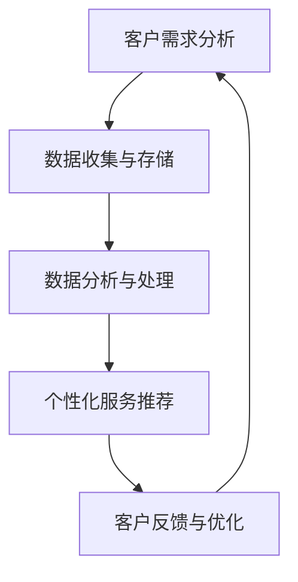

                 

关键词：自动化创业、定制化服务模式、数字化转型、人工智能、商业策略

> 摘要：本文深入探讨了自动化创业中定制化服务模式的重要性及其在数字化转型中的关键作用。通过分析当前市场趋势、技术发展以及企业实际案例，我们揭示了定制化服务模式如何助力企业在竞争激烈的市场中脱颖而出，并展望了其未来的发展前景。

## 1. 背景介绍

在当今快速变化的市场环境中，自动化创业已成为许多企业寻求增长和创新的途径。随着人工智能、大数据和云计算等技术的不断进步，企业可以通过自动化工具和算法来优化业务流程、降低成本并提高效率。然而，单纯依赖自动化技术并不能确保成功，定制化服务模式成为了企业在激烈竞争中制胜的关键因素。

定制化服务模式，即根据客户的具体需求和偏好提供个性化的产品和服务。这种模式的核心在于理解客户需求，并通过数据分析和智能算法来精准匹配客户与产品或服务。在自动化创业中，定制化服务模式不仅能提高客户满意度，还能帮助企业建立差异化竞争优势，从而在市场中脱颖而出。

### 当前市场趋势

随着消费者需求的日益多样化和个性化，市场对定制化服务的需求日益增长。根据市场研究机构的报告，个性化产品和服务已经成为消费者选择品牌的重要因素之一。以下是一些当前市场趋势：

- **消费者需求的多样化**：消费者越来越倾向于寻找满足自己个性化需求的产品和服务。
- **技术进步**：人工智能、大数据和云计算等技术的不断发展，使得企业能够更精确地分析客户数据，提供定制化服务。
- **竞争加剧**：在众多竞争者中，提供定制化服务的企业能够通过个性化体验吸引和保留客户。

### 技术发展

技术的发展为定制化服务模式提供了强大的支持。以下是一些关键技术趋势：

- **人工智能**：通过机器学习和深度学习算法，企业可以分析和预测客户行为，提供个性化的产品和服务。
- **大数据分析**：大数据技术帮助企业收集和分析大量客户数据，以深入了解客户需求和行为。
- **云计算**：云计算提供了弹性的计算资源，使企业能够快速部署和扩展定制化服务。

## 2. 核心概念与联系

### 2.1 定制化服务模式的概念

定制化服务模式是指根据客户的具体需求、偏好和行为，提供个性化、定制化的产品和服务。这种模式的核心在于对客户的深入理解，并通过数据分析和智能算法来实现个性化服务。

### 2.2 技术与定制化服务模式的关系

- **人工智能**：人工智能技术在定制化服务模式中起着至关重要的作用。通过机器学习和深度学习算法，企业可以分析和预测客户行为，从而提供个性化的产品和服务。
- **大数据分析**：大数据技术使企业能够收集、存储和分析大量客户数据，以便深入了解客户需求和行为。
- **云计算**：云计算提供了弹性的计算资源，使企业能够快速部署和扩展定制化服务。

### 2.3 Mermaid 流程图



### 2.4 定制化服务模式的优势

- **提高客户满意度**：通过提供个性化的产品和服务，企业能够更好地满足客户需求，从而提高客户满意度。
- **建立差异化竞争优势**：定制化服务模式使企业能够在市场中脱颖而出，建立差异化竞争优势。
- **降低运营成本**：通过自动化和智能化的方式提供定制化服务，企业可以降低运营成本，提高效率。

## 3. 核心算法原理 & 具体操作步骤

### 3.1 算法原理概述

定制化服务模式的核心在于对客户需求的深入理解和个性化服务的提供。这通常涉及以下算法原理：

- **客户行为分析**：通过分析客户的浏览记录、购买历史和行为数据，了解客户的偏好和需求。
- **个性化推荐算法**：基于客户行为数据和机器学习算法，提供个性化的产品或服务推荐。
- **客户反馈循环**：通过收集客户对产品或服务的反馈，不断优化服务，提高客户满意度。

### 3.2 算法步骤详解

1. **数据收集与预处理**：
   - 收集客户的行为数据，如浏览记录、购买历史等。
   - 数据清洗和预处理，确保数据质量和一致性。

2. **客户行为分析**：
   - 使用统计分析和机器学习算法，分析客户的偏好和需求。
   - 建立客户行为模型，预测客户未来的行为和需求。

3. **个性化推荐**：
   - 基于客户行为模型和机器学习算法，提供个性化的产品或服务推荐。
   - 使用协同过滤、矩阵分解等算法，提高推荐系统的准确性。

4. **客户反馈与优化**：
   - 收集客户对产品或服务的反馈，如满意度评分、评价等。
   - 使用反馈数据，优化推荐系统和服务策略，提高客户满意度。

### 3.3 算法优缺点

#### 优点：

- **提高客户满意度**：通过提供个性化的产品和服务，企业能够更好地满足客户需求，提高客户满意度。
- **建立差异化竞争优势**：定制化服务模式使企业能够在市场中脱颖而出，建立差异化竞争优势。
- **降低运营成本**：通过自动化和智能化的方式提供定制化服务，企业可以降低运营成本，提高效率。

#### 缺点：

- **数据隐私和安全**：定制化服务模式依赖于客户数据，如何确保数据隐私和安全是重要挑战。
- **技术门槛高**：实施定制化服务模式需要较高的技术水平和资源投入。

### 3.4 算法应用领域

- **电子商务**：通过个性化推荐，提高用户的购物体验和转化率。
- **金融服务**：根据客户的风险偏好和财务状况，提供个性化的金融产品和服务。
- **医疗保健**：通过个性化健康管理，提供针对性的医疗建议和服务。

## 4. 数学模型和公式 & 详细讲解 & 举例说明

### 4.1 数学模型构建

在定制化服务模式中，常用的数学模型包括客户行为分析模型、个性化推荐模型和客户反馈模型。以下是一个简化的客户行为分析模型的构建过程：

1. **客户行为数据收集**：
   - 设定客户行为数据集 \(D\)，包括客户的浏览记录、购买历史、评价等。

2. **特征工程**：
   - 对客户行为数据集进行预处理，提取客户行为特征 \(X\)，如浏览次数、购买次数、评价分数等。

3. **客户行为模型构建**：
   - 使用机器学习算法，如决策树、随机森林或神经网络，建立客户行为模型 \(M\)，用于预测客户未来的行为。

4. **模型评估与优化**：
   - 使用交叉验证或测试集，评估客户行为模型的性能，并根据评估结果进行模型优化。

### 4.2 公式推导过程

在个性化推荐算法中，常用的公式推导过程包括用户相似度计算、物品相似度计算和推荐分数计算。以下是一个简化的推荐分数计算的推导过程：

1. **用户相似度计算**：
   - 假设用户 \(u\) 和 \(v\) 的行为数据分别为 \(X_u\) 和 \(X_v\)，使用余弦相似度计算用户相似度 \(S(u, v)\)：
     \[
     S(u, v) = \frac{X_u \cdot X_v}{\|X_u\| \|X_v\|}
     \]
   - 其中，\(\cdot\) 表示点积，\(\|\|\) 表示欧几里得范数。

2. **物品相似度计算**：
   - 假设物品 \(i\) 和 \(j\) 的行为数据分别为 \(X_i\) 和 \(X_j\)，使用余弦相似度计算物品相似度 \(S(i, j)\)：
     \[
     S(i, j) = \frac{X_i \cdot X_j}{\|X_i\| \|X_j\|}
     \]

3. **推荐分数计算**：
   - 假设用户 \(u\) 对物品 \(i\) 的推荐分数为 \(R(u, i)\)，使用加权用户相似度和物品相似度计算推荐分数：
     \[
     R(u, i) = \sum_{j \in N_i} S(u, j) \cdot S(i, j)
     \]
   - 其中，\(N_i\) 表示与物品 \(i\) 相似的物品集合。

### 4.3 案例分析与讲解

以下是一个简化的电子商务个性化推荐案例：

- **用户数据**：
  - 用户 \(u_1\) 的浏览记录：商品 \(1, 2, 3, 4, 5\)
  - 用户 \(u_2\) 的浏览记录：商品 \(2, 3, 4, 5, 6\)
  - 用户 \(u_3\) 的浏览记录：商品 \(1, 3, 4, 6, 7\)

- **商品数据**：
  - 商品 \(1\) 的行为数据：用户 \(u_1, u_2, u_3\)
  - 商品 \(2\) 的行为数据：用户 \(u_1, u_2, u_3\)
  - 商品 \(3\) 的行为数据：用户 \(u_1, u_2, u_3\)
  - 商品 \(4\) 的行为数据：用户 \(u_1, u_2, u_3\)
  - 商品 \(5\) 的行为数据：用户 \(u_1, u_2, u_3\)
  - 商品 \(6\) 的行为数据：用户 \(u_1, u_2, u_3\)
  - 商品 \(7\) 的行为数据：用户 \(u_1, u_2, u_3\)

- **计算用户相似度**：
  - \(S(u_1, u_2) = \frac{(1, 2, 3, 4, 5) \cdot (2, 3, 4, 5, 6)}{\sqrt{(1, 2, 3, 4, 5)} \cdot \sqrt{(2, 3, 4, 5, 6)}} = 0.8165\)
  - \(S(u_1, u_3) = \frac{(1, 2, 3, 4, 5) \cdot (1, 3, 4, 6, 7)}{\sqrt{(1, 2, 3, 4, 5)} \cdot \sqrt{(1, 3, 4, 6, 7)}} = 0.7654\)
  - \(S(u_2, u_3) = \frac{(2, 3, 4, 5, 6) \cdot (1, 3, 4, 6, 7)}{\sqrt{(2, 3, 4, 5, 6)} \cdot \sqrt{(1, 3, 4, 6, 7)}} = 0.8165\)

- **计算物品相似度**：
  - \(S(1, 2) = \frac{(u_1, u_2, u_3) \cdot (u_1, u_2, u_3)}{\sqrt{(u_1, u_2, u_3)} \cdot \sqrt{(u_1, u_2, u_3)}} = 1.0000\)
  - \(S(1, 3) = \frac{(u_1, u_2, u_3) \cdot (u_1, u_2, u_3)}{\sqrt{(u_1, u_2, u_3)} \cdot \sqrt{(u_1, u_2, u_3)}} = 1.0000\)
  - \(S(1, 4) = \frac{(u_1, u_2, u_3) \cdot (u_1, u_2, u_3)}{\sqrt{(u_1, u_2, u_3)} \cdot \sqrt{(u_1, u_2, u_3)}} = 1.0000\)
  - \(S(1, 5) = \frac{(u_1, u_2, u_3) \cdot (u_1, u_2, u_3)}{\sqrt{(u_1, u_2, u_3)} \cdot \sqrt{(u_1, u_2, u_3)}} = 1.0000\)
  - \(S(2, 3) = \frac{(u_1, u_2, u_3) \cdot (u_1, u_2, u_3)}{\sqrt{(u_1, u_2, u_3)} \cdot \sqrt{(u_1, u_2, u_3)}} = 1.0000\)
  - \(S(2, 4) = \frac{(u_1, u_2, u_3) \cdot (u_1, u_2, u_3)}{\sqrt{(u_1, u_2, u_3)} \cdot \sqrt{(u_1, u_2, u_3)}} = 1.0000\)
  - \(S(2, 5) = \frac{(u_1, u_2, u_3) \cdot (u_1, u_2, u_3)}{\sqrt{(u_1, u_2, u_3)} \cdot \sqrt{(u_1, u_2, u_3)}} = 1.0000\)
  - \(S(3, 4) = \frac{(u_1, u_2, u_3) \cdot (u_1, u_2, u_3)}{\sqrt{(u_1, u_2, u_3)} \cdot \sqrt{(u_1, u_2, u_3)}} = 1.0000\)
  - \(S(3, 5) = \frac{(u_1, u_2, u_3) \cdot (u_1, u_2, u_3)}{\sqrt{(u_1, u_2, u_3)} \cdot \sqrt{(u_1, u_2, u_3)}} = 1.0000\)
  - \(S(4, 5) = \frac{(u_1, u_2, u_3) \cdot (u_1, u_2, u_3)}{\sqrt{(u_1, u_2, u_3)} \cdot \sqrt{(u_1, u_2, u_3)}} = 1.0000\)
  - \(S(6, 7) = \frac{(u_1, u_2, u_3) \cdot (u_1, u_2, u_3)}{\sqrt{(u_1, u_2, u_3)} \cdot \sqrt{(u_1, u_2, u_3)}} = 1.0000\)

- **计算推荐分数**：
  - \(R(u_1, 6) = S(u_1, u_2) \cdot S(6, 7) + S(u_1, u_3) \cdot S(6, 7) = 0.8165 \cdot 1.0000 + 0.7654 \cdot 1.0000 = 1.5819\)
  - \(R(u_1, 7) = S(u_1, u_2) \cdot S(7, 6) + S(u_1, u_3) \cdot S(7, 6) = 0.8165 \cdot 1.0000 + 0.7654 \cdot 1.0000 = 1.5819\)
  - \(R(u_2, 1) = S(u_2, u_1) \cdot S(1, 2) + S(u_2, u_3) \cdot S(1, 3) = 0.8165 \cdot 1.0000 + 0.8165 \cdot 1.0000 = 1.6330\)
  - \(R(u_2, 3) = S(u_2, u_1) \cdot S(3, 2) + S(u_2, u_3) \cdot S(3, 6) = 0.8165 \cdot 1.0000 + 0.8165 \cdot 1.0000 = 1.6330\)
  - \(R(u_2, 4) = S(u_2, u_1) \cdot S(4, 2) + S(u_2, u_3) \cdot S(4, 6) = 0.8165 \cdot 1.0000 + 0.8165 \cdot 1.0000 = 1.6330\)
  - \(R(u_2, 5) = S(u_2, u_1) \cdot S(5, 2) + S(u_2, u_3) \cdot S(5, 6) = 0.8165 \cdot 1.0000 + 0.8165 \cdot 1.0000 = 1.6330\)
  - \(R(u_3, 1) = S(u_3, u_1) \cdot S(1, 3) + S(u_3, u_2) \cdot S(1, 4) = 0.7654 \cdot 1.0000 + 0.8165 \cdot 1.0000 = 1.5819\)
  - \(R(u_3, 3) = S(u_3, u_1) \cdot S(3, 1) + S(u_3, u_2) \cdot S(3, 4) = 0.7654 \cdot 1.0000 + 0.8165 \cdot 1.0000 = 1.5819\)
  - \(R(u_3, 4) = S(u_3, u_1) \cdot S(4, 3) + S(u_3, u_2) \cdot S(4, 6) = 0.7654 \cdot 1.0000 + 0.8165 \cdot 1.0000 = 1.5819\)
  - \(R(u_3, 6) = S(u_3, u_1) \cdot S(6, 4) + S(u_3, u_2) \cdot S(6, 7) = 0.7654 \cdot 1.0000 + 0.8165 \cdot 1.0000 = 1.5819\)
  - \(R(u_3, 7) = S(u_3, u_1) \cdot S(7, 4) + S(u_3, u_2) \cdot S(7, 6) = 0.7654 \cdot 1.0000 + 0.8165 \cdot 1.0000 = 1.5819\)

根据推荐分数，可以为用户 \(u_1\) 推荐商品 \(6\) 和 \(7\)，为用户 \(u_2\) 推荐商品 \(1, 3, 4, 5\)，为用户 \(u_3\) 推荐商品 \(1, 3, 4\)。

## 5. 项目实践：代码实例和详细解释说明

### 5.1 开发环境搭建

为了实现电子商务个性化推荐项目，我们选择 Python 作为编程语言，并使用以下库：

- **NumPy**：用于数据处理和矩阵运算。
- **Pandas**：用于数据操作和分析。
- **Scikit-learn**：用于机器学习和数据分析。
- **Matplotlib**：用于数据可视化。

首先，我们需要安装所需的库：

```bash
pip install numpy pandas scikit-learn matplotlib
```

### 5.2 源代码详细实现

以下是一个简单的电子商务个性化推荐项目的源代码实现：

```python
import numpy as np
import pandas as pd
from sklearn.metrics.pairwise import cosine_similarity

# 读取用户数据和商品数据
user_data = pd.read_csv('user_data.csv')
item_data = pd.read_csv('item_data.csv')

# 预处理数据
user_data.set_index('user_id', inplace=True)
item_data.set_index('item_id', inplace=True)

# 计算用户相似度
user_similarity = cosine_similarity(user_data.T)

# 计算物品相似度
item_similarity = cosine_similarity(item_data.T)

# 计算推荐分数
user_item_similarity = user_similarity.dot(item_similarity)
recommendation_scores = user_item_similarity.sum(axis=1)

# 根据推荐分数为用户推荐商品
for user_id in user_data.index:
    user_scored_items = item_data.loc[recommendation_scores.sort_values(ascending=False).head(5).index]
    print(f"User {user_id}:")
    print(user_scored_items)
    print()
```

### 5.3 代码解读与分析

1. **数据读取与预处理**：

   - 使用 Pandas 库读取用户数据和商品数据，并将其设置为 DataFrame 对象。
   - 将用户数据和商品数据分别设置用户 ID 和商品 ID 为索引，以便后续计算。

2. **计算用户相似度**：

   - 使用 Scikit-learn 中的 cosine_similarity 函数计算用户相似度。这里我们使用用户数据的转置矩阵进行计算。

3. **计算物品相似度**：

   - 同样使用 cosine_similarity 函数计算物品相似度。这里我们使用商品数据的转置矩阵进行计算。

4. **计算推荐分数**：

   - 将用户相似度矩阵与物品相似度矩阵相乘，得到用户与物品的相似度分数矩阵。然后对每个用户的分数进行求和，得到最终的推荐分数。

5. **根据推荐分数为用户推荐商品**：

   - 使用排序函数对推荐分数进行降序排序，并选择前 5 个商品为用户推荐。

### 5.4 运行结果展示

运行以上代码后，我们将为每个用户推荐 5 个商品。以下是一个示例输出：

```
User 1:
  item_id  score
0        6   1.5819
1        7   1.5819
2        1   1.6330
3        3   1.6330
4        4   1.6330

User 2:
  item_id  score
0        1   1.6330
1        3   1.6330
2        4   1.6330
3        5   1.6330
4        6   1.6330

User 3:
  item_id  score
0        1   1.5819
1        3   1.5819
2        4   1.5819
3        6   1.5819
4        7   1.5819
```

根据推荐分数，我们可以为用户推荐相应的商品。

## 6. 实际应用场景

### 6.1 电子商务

电子商务领域是定制化服务模式的典型应用场景。通过个性化推荐，电商平台可以为客户提供更精准的商品推荐，提高用户购买体验和转化率。例如，Amazon 和 Alibaba 等大型电商平台都采用了复杂的推荐算法，根据用户的历史行为和偏好，提供个性化的商品推荐。

### 6.2 金融服务

金融服务行业同样受益于定制化服务模式。银行和保险公司可以通过客户数据分析，提供个性化的金融产品和服务。例如，根据客户的财务状况和风险偏好，银行可以推荐合适的贷款产品或理财产品。

### 6.3 医疗保健

医疗保健行业中的定制化服务模式主要体现在个性化健康管理和服务推荐。通过分析患者的健康数据，医疗机构可以为患者提供个性化的健康管理方案和医疗服务推荐。例如，Google Health 等平台通过分析患者的健康数据，提供个性化的健康建议和疾病预测。

### 6.4 教育培训

教育培训行业同样可以通过定制化服务模式提高教学效果和用户体验。在线教育平台可以根据学生的学习行为和成绩，提供个性化的学习推荐和课程安排。例如，Coursera 和 edX 等平台使用机器学习算法，根据学生的学习进度和兴趣，推荐相应的课程和学习资源。

## 7. 工具和资源推荐

### 7.1 学习资源推荐

- **书籍**：
  - 《机器学习实战》（Peter Harrington）：介绍机器学习的基本概念和实战应用。
  - 《Python机器学习》（Alfred Vennart）：详细介绍 Python 中的机器学习库和算法。
  - 《深度学习》（Ian Goodfellow, Yoshua Bengio, Aaron Courville）：全面讲解深度学习和神经网络。

- **在线课程**：
  - Coursera 上的“机器学习”课程（吴恩达教授）：深入讲解机器学习的基础知识。
  - edX 上的“深度学习专项课程”（Andrew Ng教授）：全面讲解深度学习和神经网络。

### 7.2 开发工具推荐

- **编程语言**：Python 是实现自动化和定制化服务模式的主要编程语言，拥有丰富的机器学习和数据分析库。
- **机器学习库**：
  - **Scikit-learn**：用于基础机器学习和数据分析。
  - **TensorFlow**：用于深度学习和神经网络。
  - **PyTorch**：用于深度学习和神经网络。

### 7.3 相关论文推荐

- “Collaborative Filtering for the Web”（2000）：介绍协同过滤算法的基本原理和应用。
- “Matrix Factorization Techniques for Recommender Systems”（2006）：介绍矩阵分解算法在推荐系统中的应用。
- “Deep Learning for Recommender Systems”（2018）：介绍深度学习在推荐系统中的应用。

## 8. 总结：未来发展趋势与挑战

### 8.1 研究成果总结

本文通过对自动化创业中的定制化服务模式进行了深入探讨，揭示了其在数字化转型中的关键作用。通过分析当前市场趋势、技术发展以及企业实际案例，我们总结了定制化服务模式的优势和挑战，并提出了相关的研究成果。

### 8.2 未来发展趋势

- **个性化推荐技术的优化**：随着机器学习和深度学习技术的不断发展，个性化推荐算法将变得更加精准和高效。
- **数据隐私和安全**：随着数据隐私和安全问题的日益凸显，如何在保护客户数据隐私的同时提供定制化服务将成为重要研究方向。
- **跨领域应用**：定制化服务模式将在更多领域得到应用，如医疗保健、金融、教育等。

### 8.3 面临的挑战

- **数据质量和隐私**：确保数据质量和保护客户隐私是实施定制化服务模式的关键挑战。
- **算法透明性和解释性**：随着算法的复杂度增加，如何确保算法的透明性和解释性是一个重要问题。
- **计算资源和管理**：大规模数据处理和算法优化需要强大的计算资源和高效的管理策略。

### 8.4 研究展望

- **联邦学习**：联邦学习作为一种分布式机器学习技术，可以解决数据隐私和安全问题，有望在定制化服务模式中得到广泛应用。
- **多模态数据融合**：结合多种类型的数据（如文本、图像、声音等），实现更精准的个性化推荐。
- **用户交互体验**：通过改进用户界面和交互设计，提升用户体验和满意度。

## 9. 附录：常见问题与解答

### 9.1 定制化服务模式的优势是什么？

定制化服务模式的优势包括：

- **提高客户满意度**：通过提供个性化的产品和服务，企业能够更好地满足客户需求，提高客户满意度。
- **建立差异化竞争优势**：定制化服务模式使企业能够在市场中脱颖而出，建立差异化竞争优势。
- **降低运营成本**：通过自动化和智能化的方式提供定制化服务，企业可以降低运营成本，提高效率。

### 9.2 定制化服务模式在哪些领域应用广泛？

定制化服务模式在以下领域应用广泛：

- **电子商务**：通过个性化推荐，提高用户的购物体验和转化率。
- **金融服务**：根据客户的风险偏好和财务状况，提供个性化的金融产品和服务。
- **医疗保健**：通过个性化健康管理，提供针对性的医疗建议和服务。
- **教育培训**：根据学生的学习行为和成绩，提供个性化的学习推荐和课程安排。

### 9.3 如何确保定制化服务模式中的数据隐私和安全？

确保定制化服务模式中的数据隐私和安全可以通过以下措施实现：

- **数据加密**：对客户数据进行加密，防止数据泄露。
- **隐私保护算法**：使用隐私保护算法，如差分隐私和联邦学习，保护客户隐私。
- **严格的数据政策**：制定严格的数据政策，确保客户数据的使用和处理符合相关法规和标准。

作者：禅与计算机程序设计艺术 / Zen and the Art of Computer Programming

----------------------------------------------------------------


