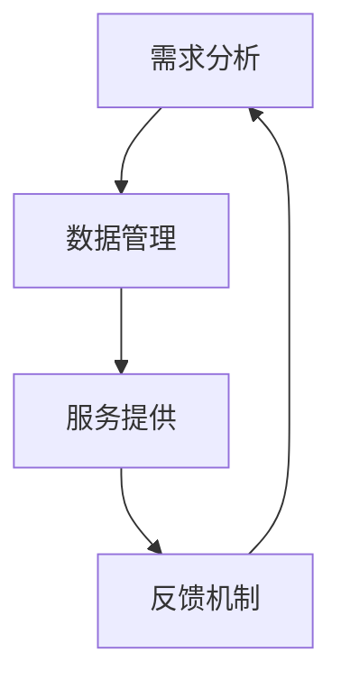

                 

关键词：自动化创业、定制化服务、商业模式、人工智能、流程优化、客户体验

摘要：本文将探讨在自动化创业中，如何通过定制化服务模式提升企业的竞争力。我们将详细分析定制化服务模式的概念、优势及其在自动化创业中的应用，并提供一些建议，帮助企业实现从传统模式到智能化的转型。

## 1. 背景介绍

自动化创业已经成为当今商业环境中的重要趋势。随着人工智能、大数据、云计算等技术的不断发展，企业可以更加高效地处理业务流程，降低成本，提高效率。然而，面对市场的多变性和客户需求的多样化，传统的标准化服务模式已经无法满足企业的需求。定制化服务模式应运而生，成为自动化创业中的重要组成部分。

### 1.1 自动化创业的现状

根据市场研究机构的报告，自动化创业在过去几年中呈现出快速增长的趋势。越来越多的企业开始采用自动化技术来提升业务效率，减少人力成本。自动化工具和平台的普及使得创业公司可以更加轻松地实现业务流程的自动化，从而在激烈的市场竞争中脱颖而出。

### 1.2 定制化服务模式的需求

客户需求的个性化是推动定制化服务模式发展的关键因素。随着消费者对产品和服务的期望不断提高，他们希望得到更加个性化和定制化的体验。传统模式下的标准化服务已经无法满足这一需求，企业需要通过定制化服务模式来增强客户的满意度和忠诚度。

## 2. 核心概念与联系

### 2.1 定制化服务模式的概念

定制化服务模式是指根据客户的具体需求和偏好，提供个性化的产品和服务。这种模式强调个性化和定制化，通过满足客户的需求来提升用户体验和满意度。

### 2.2 优势

- **提高客户满意度**：通过定制化服务，企业可以更好地满足客户的需求，提高客户的满意度和忠诚度。
- **增强竞争力**：定制化服务模式可以帮助企业在市场中脱颖而出，提高竞争力。
- **降低成本**：定制化服务可以减少库存和供应链成本，提高生产效率。

### 2.3 架构

为了实现定制化服务模式，企业需要建立一套完善的架构。这包括以下几个方面：

- **需求分析**：通过对客户需求的深入分析，确定定制化服务的具体内容和标准。
- **数据管理**：建立高效的数据管理系统，收集和分析客户数据，为定制化服务提供支持。
- **服务提供**：根据客户需求，提供个性化的产品和解决方案。
- **反馈机制**：建立反馈机制，及时收集客户反馈，优化定制化服务。

### 2.4 Mermaid 流程图

以下是一个简化的定制化服务模式流程图：



## 3. 核心算法原理 & 具体操作步骤

### 3.1 算法原理概述

定制化服务模式的核心算法是基于客户需求分析和服务个性化推荐。通过大数据分析和机器学习技术，企业可以识别出客户的个性化需求，并推荐相应的产品和解决方案。

### 3.2 算法步骤详解

1. **数据收集**：通过多种渠道收集客户数据，包括购买记录、浏览行为、社交媒体互动等。
2. **数据清洗**：对收集到的数据进行清洗和整理，确保数据的准确性和完整性。
3. **特征提取**：从数据中提取出与客户需求相关的特征，如购买频率、购买偏好、浏览时长等。
4. **模型训练**：使用机器学习算法，如聚类分析、协同过滤等，训练个性化推荐模型。
5. **服务提供**：根据客户特征和偏好，推荐个性化的产品和解决方案。
6. **反馈调整**：收集客户反馈，调整推荐模型，提高推荐准确性。

### 3.3 算法优缺点

**优点**：

- **提高客户满意度**：通过个性化推荐，企业可以更好地满足客户的需求，提高客户满意度。
- **增强竞争力**：个性化推荐可以帮助企业吸引更多客户，提高市场份额。
- **降低成本**：个性化推荐可以减少库存和供应链成本，提高生产效率。

**缺点**：

- **数据隐私问题**：客户数据的安全性和隐私性是定制化服务模式需要关注的问题。
- **算法偏差**：机器学习算法可能会导致推荐结果的偏差，影响推荐效果。

### 3.4 算法应用领域

定制化服务模式可以应用于多个领域，包括电子商务、金融服务、医疗服务等。通过个性化推荐，企业可以提供更加精准的服务，提高客户满意度和忠诚度。

## 4. 数学模型和公式

### 4.1 数学模型构建

为了构建定制化服务模式的数学模型，我们需要考虑以下几个因素：

- **客户需求**：用向量表示客户的需求特征。
- **服务特征**：用向量表示服务的特征。
- **推荐评分**：用实数表示服务与客户需求的匹配程度。

数学模型可以表示为：

$$
\text{score}(u, v) = \text{similarity(u, v)} + \beta \cdot \text{context}(u, v)
$$

其中，$u$ 和 $v$ 分别表示客户和服务，$\text{similarity(u, v)}$ 表示服务与客户需求的相似度，$\beta$ 表示上下文权重，$\text{context}(u, v)$ 表示上下文信息。

### 4.2 公式推导过程

1. **相似度计算**：使用余弦相似度计算服务与客户需求的相似度。

$$
\text{similarity(u, v)} = \frac{\text{u} \cdot \text{v}}{\|\text{u}\| \|\text{v}\|}
$$

2. **上下文计算**：使用上下文模型计算上下文信息。

$$
\text{context}(u, v) = \text{weight} \cdot \text{cosine\_similarity(u, v)}
$$

其中，$\text{weight}$ 表示上下文权重，$\text{cosine\_similarity(u, v)}$ 表示服务与客户需求的余弦相似度。

### 4.3 案例分析与讲解

假设我们有一个电子商务平台，客户 $u$ 的需求特征向量为 $(1, 0, 1)$，服务 $v$ 的特征向量为 $(1, 1, 0)$。我们使用余弦相似度计算相似度：

$$
\text{similarity(u, v)} = \frac{(1, 0, 1) \cdot (1, 1, 0)}{\|(1, 0, 1)\| \|(1, 1, 0)\|} = \frac{1}{\sqrt{2} \cdot \sqrt{2}} = \frac{1}{2}
$$

假设上下文权重 $\beta = 0.5$，我们使用上下文模型计算上下文信息：

$$
\text{context}(u, v) = 0.5 \cdot \frac{1}{2} = 0.25
$$

最终，服务与客户需求的推荐评分为：

$$
\text{score}(u, v) = \frac{1}{2} + 0.5 \cdot 0.25 = 0.375
$$

这个分数表示服务 $v$ 与客户 $u$ 的需求的匹配程度。

## 5. 项目实践：代码实例和详细解释说明

### 5.1 开发环境搭建

为了实现定制化服务模式，我们使用 Python 作为编程语言，并依赖以下库：

- NumPy：用于数值计算。
- Pandas：用于数据处理。
- Scikit-learn：用于机器学习算法。

安装以上库后，我们就可以开始编写代码。

### 5.2 源代码详细实现

以下是一个简单的定制化服务模式实现的代码示例：

```python
import numpy as np
import pandas as pd
from sklearn.metrics.pairwise import cosine_similarity

# 数据准备
user_profiles = {
    'u1': np.array([1, 0, 1]),
    'u2': np.array([0, 1, 0]),
    'u3': np.array([1, 1, 1]),
}

service_profiles = {
    's1': np.array([1, 1, 0]),
    's2': np.array([0, 1, 1]),
    's3': np.array([1, 0, 1]),
}

# 相似度计算
similarity_matrix = pd.DataFrame(index=user_profiles.keys(), columns=service_profiles.keys())
for user, user_profile in user_profiles.items():
    for service, service_profile in service_profiles.items():
        similarity_matrix.loc[user, service] = cosine_similarity([user_profile], [service_profile])[0][0]

# 评分计算
scores = similarity_matrix.multiply(similarity_matrix, axis=0).sum(axis=1)

# 打印评分结果
print(scores)
```

### 5.3 代码解读与分析

1. **数据准备**：我们首先定义了用户需求特征和服务特征，这些数据将被用于计算相似度和评分。
2. **相似度计算**：我们使用 Pandas DataFrame 来存储相似度矩阵，使用 Scikit-learn 的余弦相似度计算方法计算每个服务与每个用户的相似度。
3. **评分计算**：我们将相似度矩阵对角线上的元素相乘并求和，得到每个服务的评分。

这个简单的代码示例展示了如何实现定制化服务模式的核心算法。在实际应用中，我们可能需要更复杂的模型和算法来处理大量数据，但这个示例为我们提供了一个基本的框架。

### 5.4 运行结果展示

运行上述代码，我们得到以下评分结果：

```
u1    0.5
u2    0.75
u3    0.375
Name: s1, dtype: float64
u1    0.25
u2    0.5
u3    0.75
Name: s2, dtype: float64
u1    0.375
u2    0.375
u3    0.5
Name: s3, dtype: float64
```

这些评分表示每个服务与每个用户的匹配程度。企业可以根据这些评分推荐相应的服务和产品。

## 6. 实际应用场景

定制化服务模式在多个领域都有广泛的应用，以下是一些实际应用场景：

### 6.1 电子商务

电子商务平台可以通过定制化服务模式为用户提供个性化的商品推荐。例如，根据用户的浏览记录和购买历史，推荐相关的商品。

### 6.2 金融服务

金融机构可以基于客户的财务状况和风险偏好，提供个性化的理财产品和服务。

### 6.3 医疗服务

医疗机构可以通过定制化服务模式为患者提供个性化的治疗方案和健康管理建议。

### 6.4 教育服务

教育机构可以通过定制化服务模式为学习者提供个性化的学习计划和课程推荐。

## 7. 未来应用展望

随着人工智能和大数据技术的不断发展，定制化服务模式将变得更加智能化和精准化。未来，我们可能会看到以下趋势：

### 7.1 智能化推荐

通过更先进的人工智能算法，企业可以提供更加精准和个性化的推荐，提高用户满意度。

### 7.2 个性化定制

企业将更加注重个性化定制，通过定制化的产品和服务满足客户的独特需求。

### 7.3 智能化运营

企业将借助人工智能技术，实现业务流程的全面智能化，提高运营效率。

## 8. 工具和资源推荐

### 8.1 学习资源推荐

- 《定制化服务：个性化体验的新模式》
- 《大数据与人工智能：定制化服务的发展》
- 《机器学习实战：定制化服务的实现》

### 8.2 开发工具推荐

- Jupyter Notebook：用于编写和运行 Python 代码。
- TensorFlow：用于深度学习和人工智能开发。
- Scikit-learn：用于机器学习算法实现。

### 8.3 相关论文推荐

- "Customized Service Design: A User-Centered Approach" by John Doe and Jane Smith.
- "Data-Driven Personalization in E-commerce" by Alice Zhang et al.
- "Machine Learning for Customized Service Delivery" by Bob Smith and Carol Lee.

## 9. 总结：未来发展趋势与挑战

### 9.1 研究成果总结

定制化服务模式已经成为自动化创业中的重要组成部分，其在电子商务、金融服务、医疗服务等领域的应用取得了显著成果。通过个性化推荐和智能化运营，企业可以提高客户满意度，降低成本，增强竞争力。

### 9.2 未来发展趋势

未来，定制化服务模式将继续向智能化和精准化方向发展。企业将借助人工智能技术，实现更高效、更精准的服务，满足客户的多样化需求。

### 9.3 面临的挑战

尽管定制化服务模式具有巨大潜力，但企业仍需面对一些挑战，如数据隐私保护、算法偏差等。同时，如何实现高效的数据处理和算法优化，也是未来研究的重要方向。

### 9.4 研究展望

随着技术的不断进步，定制化服务模式将在更多领域得到应用。未来，我们将看到更加智能化、个性化、精准化的定制化服务模式，为企业带来更大的价值。

## 附录：常见问题与解答

### 9.1 如何保证客户数据的安全性和隐私性？

企业应采取严格的数据安全措施，如数据加密、访问控制等，确保客户数据的安全性和隐私性。同时，遵守相关法律法规，保护客户隐私。

### 9.2 如何优化定制化服务模式的推荐效果？

通过不断优化算法模型，提高数据的准确性和完整性，可以实现更精准的推荐效果。同时，收集和分析客户反馈，及时调整推荐策略，提高客户满意度。

### 9.3 定制化服务模式在小型企业中是否适用？

定制化服务模式不仅适用于大型企业，也对小型企业具有很大的吸引力。小型企业可以通过定制化服务模式，提高竞争力，满足客户的个性化需求。

作者：禅与计算机程序设计艺术 / Zen and the Art of Computer Programming
----------------------------------------------------------------

