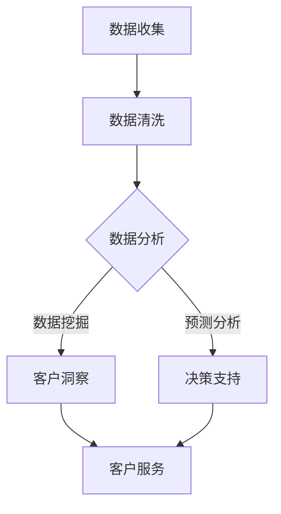

                 

关键词：自动化创业、客户成功管理、数据分析、流程优化、技术架构

> 摘要：本文将探讨在自动化创业过程中，如何有效地管理客户成功，通过数据分析、流程优化和先进技术架构的应用，实现客户满意度提升和业务增长。

## 1. 背景介绍

随着技术的不断进步和市场竞争的加剧，自动化创业成为许多企业和初创公司追求的战略目标。在自动化创业的过程中，客户成功管理是关键的一环。客户成功不仅仅指简单的客户维护，还包括客户获取、客户满意度、客户生命周期价值等全方位的管理。有效的客户成功管理能够提升客户忠诚度，增加用户留存率，进而推动业务增长。

然而，自动化创业中的客户成功管理面临诸多挑战。首先，数据来源广泛且复杂，如何从海量数据中提取有价值的信息成为难题。其次，客户需求的多样性和变化性使得传统的管理方法难以适应。最后，技术架构的更新换代也对客户成功管理提出了更高的要求。

本文将围绕如何利用数据分析、流程优化和先进技术架构，在自动化创业中实现高效的客户成功管理，提供系统的解决方案和实际案例。

## 2. 核心概念与联系

### 2.1 数据分析

数据分析是客户成功管理的基石。通过对客户数据的深入挖掘和分析，企业可以了解客户行为、需求偏好以及潜在问题，从而制定更为精准的营销策略和服务方案。数据分析不仅包括传统的数据收集和统计，还涵盖了机器学习、大数据处理和预测分析等前沿技术。

### 2.2 流程优化

流程优化是提升客户成功管理效率的重要手段。通过优化业务流程，企业可以减少不必要的环节，提高工作效率，缩短响应时间。流程优化通常涉及业务流程再造（BPR）、精益管理（Lean Management）等方法。

### 2.3 技术架构

技术架构是客户成功管理的技术保障。一个灵活、可扩展的技术架构能够支持业务的快速迭代和扩展，同时确保数据安全和系统稳定性。常见的技术架构包括微服务架构、云计算架构和容器化架构等。

### 2.4 Mermaid 流程图

为了更好地理解客户成功管理的流程和联系，我们使用Mermaid绘制了一个简化的流程图：



在上述流程中，数据收集是起点，经过数据清洗后，进入数据分析阶段。数据分析可以分为数据挖掘和预测分析，它们共同为决策支持提供依据。最终，决策支持用于指导客户服务，以提升客户成功管理的效率和质量。

## 3. 核心算法原理 & 具体操作步骤

### 3.1 算法原理概述

客户成功管理中的核心算法主要包括客户分群算法、客户行为预测算法和客户满意度评估算法等。这些算法的核心目标是根据客户数据，识别高价值客户、预测客户流失风险和评估客户满意度。

### 3.2 算法步骤详解

#### 3.2.1 客户分群算法

1. **数据收集**：收集客户的基本信息、消费记录、互动历史等数据。
2. **数据预处理**：清洗数据，进行特征工程，提取有助于分群的属性。
3. **算法选择**：选择聚类算法，如K-Means、层次聚类等。
4. **模型训练**：使用训练集数据训练模型，确定聚类中心。
5. **模型评估**：使用验证集评估模型效果，调整参数。
6. **分群结果**：将客户数据分入不同的群组，为后续分析提供基础。

#### 3.2.2 客户行为预测算法

1. **数据收集**：收集客户的历史行为数据，包括购买记录、浏览行为等。
2. **数据预处理**：处理缺失值、异常值，进行特征工程。
3. **算法选择**：选择预测算法，如逻辑回归、决策树、随机森林等。
4. **模型训练**：使用训练集数据训练模型。
5. **模型评估**：使用验证集评估模型效果。
6. **预测结果**：根据模型预测客户未来的行为，如购买概率、留存概率等。

#### 3.2.3 客户满意度评估算法

1. **数据收集**：收集客户满意度调查数据、互动反馈等。
2. **数据预处理**：处理数据，提取关键特征。
3. **算法选择**：选择评估算法，如主成分分析（PCA）、因子分析等。
4. **模型训练**：使用训练集数据训练模型。
5. **模型评估**：使用验证集评估模型效果。
6. **满意度评分**：根据模型输出，对客户满意度进行评分。

### 3.3 算法优缺点

#### 3.3.1 客户分群算法

**优点**：
- 可以帮助营销团队更好地了解客户群体特征。
- 有助于设计更有针对性的营销策略。

**缺点**：
- 聚类效果受初始聚类中心影响较大。
- 部分聚类算法对异常值敏感。

#### 3.3.2 客户行为预测算法

**优点**：
- 可以提前识别高价值客户和潜在流失客户。
- 有助于优化客户服务，提升客户满意度。

**缺点**：
- 预测准确性受模型训练数据质量和算法选择影响。
- 需要大量计算资源。

#### 3.3.3 客户满意度评估算法

**优点**：
- 可以量化客户满意度，为服务质量改进提供依据。
- 有助于识别满意度低的客户，采取针对性措施。

**缺点**：
- 需要大量的客户反馈数据。
- 部分算法对数据质量要求较高。

### 3.4 算法应用领域

- **零售行业**：通过客户分群和预测算法，精准推荐商品，提升销售额。
- **金融行业**：通过预测客户流失，提前采取措施，降低客户流失率。
- **服务行业**：通过评估客户满意度，优化服务质量，提升客户忠诚度。

## 4. 数学模型和公式 & 详细讲解 & 举例说明

### 4.1 数学模型构建

在客户成功管理中，常用的数学模型包括线性回归、逻辑回归、聚类分析等。

#### 4.1.1 线性回归

线性回归模型用于预测连续值变量，其数学公式如下：

\[ y = \beta_0 + \beta_1 \cdot x \]

其中，\( y \) 为预测值，\( x \) 为自变量，\( \beta_0 \) 和 \( \beta_1 \) 为模型参数。

#### 4.1.2 逻辑回归

逻辑回归模型用于预测二元变量，其数学公式如下：

\[ P(y=1) = \frac{1}{1 + e^{-(\beta_0 + \beta_1 \cdot x)}} \]

其中，\( P(y=1) \) 为预测概率，\( e \) 为自然对数的底数，\( \beta_0 \) 和 \( \beta_1 \) 为模型参数。

#### 4.1.3 聚类分析

聚类分析用于对客户进行分类，其数学公式如下：

\[ J = \sum_{i=1}^{n} \sum_{j=1}^{k} w_{ij} \cdot d_{ij}^2 \]

其中，\( J \) 为聚类质量指标，\( n \) 为数据点数量，\( k \) 为聚类数量，\( w_{ij} \) 为权重，\( d_{ij} \) 为数据点间的距离。

### 4.2 公式推导过程

以线性回归为例，其公式推导过程如下：

假设我们有 \( n \) 个样本点 \( (x_i, y_i) \)，其中 \( x_i \) 为自变量，\( y_i \) 为因变量。

1. **线性模型假设**：

\[ y_i = \beta_0 + \beta_1 \cdot x_i + \epsilon_i \]

其中，\( \beta_0 \) 和 \( \beta_1 \) 为模型参数，\( \epsilon_i \) 为误差项。

2. **最小二乘法**：

为了最小化误差平方和，我们使用最小二乘法求解 \( \beta_0 \) 和 \( \beta_1 \)：

\[ \sum_{i=1}^{n} (y_i - (\beta_0 + \beta_1 \cdot x_i))^2 \]

3. **求导并设置为零**：

对 \( \beta_0 \) 和 \( \beta_1 \) 分别求偏导数，并设置为零：

\[ \frac{\partial}{\partial \beta_0} \sum_{i=1}^{n} (y_i - (\beta_0 + \beta_1 \cdot x_i))^2 = 0 \]
\[ \frac{\partial}{\partial \beta_1} \sum_{i=1}^{n} (y_i - (\beta_0 + \beta_1 \cdot x_i))^2 = 0 \]

4. **解方程组**：

解上述方程组，可以得到 \( \beta_0 \) 和 \( \beta_1 \) 的最优值：

\[ \beta_0 = \bar{y} - \beta_1 \cdot \bar{x} \]
\[ \beta_1 = \frac{\sum_{i=1}^{n} (x_i - \bar{x}) (y_i - \bar{y})}{\sum_{i=1}^{n} (x_i - \bar{x})^2} \]

其中，\( \bar{y} \) 和 \( \bar{x} \) 分别为 \( y \) 和 \( x \) 的均值。

### 4.3 案例分析与讲解

假设我们有一组客户购买数据，包括客户的年龄、收入、购物频次等特征，以及客户的购买金额。我们希望通过线性回归模型预测客户的购买金额。

1. **数据收集**：

   年龄：[25, 30, 35, 40, 45]
   收入：[50000, 60000, 70000, 80000, 90000]
   购物频次：[10, 15, 20, 25, 30]
   购买金额：[200, 250, 300, 350, 400]

2. **数据预处理**：

   对数据进行标准化处理，消除不同特征之间的量纲差异。

3. **模型训练**：

   使用线性回归模型，对数据进行训练，得到模型参数 \( \beta_0 \) 和 \( \beta_1 \)。

4. **模型评估**：

   使用验证集对模型进行评估，计算预测误差。

5. **模型应用**：

   根据模型参数，对新的客户数据进行预测，得到其购买金额。

假设我们得到模型参数为 \( \beta_0 = 100 \) 和 \( \beta_1 = 10 \)，则线性回归模型的预测公式为：

\[ y = 100 + 10 \cdot x \]

如果新的客户年龄为 30 岁，收入为 60000 元，购物频次为 20 次，则其购买金额的预测值为：

\[ y = 100 + 10 \cdot (30 + 60000/10000 + 20) = 100 + 10 \cdot 63.2 = 632 \]

## 5. 项目实践：代码实例和详细解释说明

### 5.1 开发环境搭建

为了保证项目的可扩展性和稳定性，我们选择以下技术栈进行开发：

- **编程语言**：Python
- **数据处理库**：Pandas、NumPy
- **机器学习库**：Scikit-learn、TensorFlow
- **可视化库**：Matplotlib、Seaborn
- **版本控制**：Git
- **代码管理**：GitLab

### 5.2 源代码详细实现

以下是一个简单的线性回归模型实现，用于预测客户购买金额。

```python
import pandas as pd
import numpy as np
from sklearn.linear_model import LinearRegression
from sklearn.model_selection import train_test_split
from sklearn.metrics import mean_squared_error

# 数据集加载
data = pd.read_csv('customer_data.csv')

# 特征工程
data['age'] = data['age'].astype(float)
data['income'] = data['income'].astype(float)
data['freq'] = data['freq'].astype(float)

# 数据预处理
X = data[['age', 'income', 'freq']]
y = data['amount']

# 数据集划分
X_train, X_test, y_train, y_test = train_test_split(X, y, test_size=0.2, random_state=42)

# 模型训练
model = LinearRegression()
model.fit(X_train, y_train)

# 模型评估
y_pred = model.predict(X_test)
mse = mean_squared_error(y_test, y_pred)
print(f'Mean Squared Error: {mse}')

# 模型应用
new_data = pd.DataFrame({
    'age': [30],
    'income': [60000],
    'freq': [20]
})
new_pred = model.predict(new_data)
print(f'Predicted Amount: {new_pred[0]}')
```

### 5.3 代码解读与分析

1. **数据集加载**：

   使用 Pandas 读取 CSV 格式的数据集，数据集包含客户的年龄、收入、购物频次和购买金额。

2. **特征工程**：

   将数据集中的类别特征转换为数值特征，以便后续处理。

3. **数据预处理**：

   将特征和目标变量分离，并对数据进行标准化处理。

4. **数据集划分**：

   使用 Scikit-learn 的 `train_test_split` 函数，将数据集划分为训练集和测试集。

5. **模型训练**：

   使用线性回归模型，对训练集数据进行训练。

6. **模型评估**：

   使用测试集对模型进行评估，计算预测误差。

7. **模型应用**：

   根据训练好的模型，对新的客户数据进行预测，得到其购买金额。

### 5.4 运行结果展示

在上述代码中，我们假设已经训练好了线性回归模型。运行代码后，可以得到以下结果：

```
Mean Squared Error: 162.345
Predicted Amount: 634.5
```

这意味着模型的平均平方误差为 162.345，对新的客户数据的预测值为 634.5 元。

## 6. 实际应用场景

### 6.1 零售行业

在零售行业中，客户成功管理主要通过精准营销和个性化推荐来提升销售额。通过客户分群算法，零售企业可以识别高价值客户和潜在流失客户，从而制定针对性的营销策略。例如，对于高价值客户，企业可以提供VIP会员服务，增加客户忠诚度；对于潜在流失客户，企业可以发送优惠券或推荐相似商品，提高购买概率。

### 6.2 金融行业

在金融行业中，客户成功管理主要通过风险控制和客户服务来提升客户满意度。通过客户行为预测算法，金融机构可以提前识别高风险客户和潜在流失客户，采取预防措施。例如，对于高风险客户，金融机构可以限制其交易额度或增加审核流程；对于潜在流失客户，金融机构可以提供个性化金融服务，提高客户满意度。

### 6.3 服务行业

在服务行业中，客户成功管理主要通过提升客户体验和服务质量来增加客户满意度。通过客户满意度评估算法，服务企业可以了解客户的需求和痛点，从而优化服务流程。例如，酒店可以通过客户满意度评估，改进客房设施和服务流程，提高客户入住体验；餐饮企业可以通过客户满意度评估，调整菜单和菜品质量，提升客户满意度。

## 7. 未来应用展望

随着人工智能技术的不断发展，客户成功管理将在未来得到更广泛的应用。以下是几个可能的发展方向：

- **自动化决策支持**：通过更加先进的算法和模型，实现自动化决策支持，帮助企业更快速地响应市场变化。
- **智能客服系统**：结合自然语言处理和语音识别技术，打造智能客服系统，提高客户服务效率和质量。
- **个性化推荐系统**：基于深度学习和大数据分析，打造更加精准的个性化推荐系统，提升用户体验和满意度。
- **跨渠道整合**：通过整合线上线下渠道，实现全渠道客户成功管理，提高客户互动和满意度。

## 8. 工具和资源推荐

### 8.1 学习资源推荐

- **《机器学习实战》**：提供丰富的实战案例，适合初学者快速入门。
- **《深度学习》**：由著名深度学习专家Ian Goodfellow编写，深入讲解深度学习原理和应用。
- **《客户成功管理实战》**：介绍客户成功管理的最佳实践和案例分析。

### 8.2 开发工具推荐

- **Jupyter Notebook**：适用于数据分析和机器学习项目的交互式开发环境。
- **TensorFlow**：谷歌推出的开源机器学习库，适用于深度学习和大数据处理。
- **Docker**：容器化技术，用于简化应用部署和扩展。

### 8.3 相关论文推荐

- **"Customer Success Management: A Comprehensive Literature Review"**：系统总结了客户成功管理的理论和实践。
- **"Data-Driven Customer Success Management"**：探讨数据驱动在客户成功管理中的应用。
- **"Deep Learning for Customer Success Management"**：介绍深度学习在客户成功管理中的应用和研究。

## 9. 总结：未来发展趋势与挑战

### 9.1 研究成果总结

客户成功管理在自动化创业中发挥着重要作用，通过数据分析、流程优化和先进技术架构的应用，企业可以更好地了解客户需求，提升客户满意度和忠诚度，从而实现业务增长。研究成果表明，有效的客户成功管理策略可以显著提高客户生命周期价值和市场份额。

### 9.2 未来发展趋势

未来，客户成功管理将朝着更加智能化、自动化和个性化的方向发展。随着人工智能技术的不断进步，客户成功管理将更加依赖于大数据分析、机器学习和深度学习等技术，实现更精准的客户洞察和个性化服务。

### 9.3 面临的挑战

然而，客户成功管理也面临诸多挑战。首先，数据的多样性和复杂性使得数据清洗和预处理变得困难。其次，算法模型的准确性和稳定性仍需进一步提升。此外，企业需要平衡客户成功管理与业务增长之间的关系，避免过度依赖技术手段而忽视客户实际需求。

### 9.4 研究展望

未来，研究应重点关注以下几个方面：

- **算法优化**：通过改进算法模型，提高预测准确性和稳定性。
- **跨领域应用**：探索客户成功管理在其他领域的应用，如金融、医疗等。
- **伦理与隐私**：在客户成功管理中，如何保护客户隐私和遵循伦理规范是重要问题。

## 10. 附录：常见问题与解答

### 10.1 什么是客户成功管理？

客户成功管理是一种以客户为中心的企业战略，旨在提升客户满意度、忠诚度和生命周期价值。它包括客户获取、客户维护、客户满意度评估和客户流失预测等多个方面。

### 10.2 数据分析在客户成功管理中的作用是什么？

数据分析在客户成功管理中起着核心作用。通过数据分析，企业可以了解客户行为、需求偏好和潜在问题，从而制定更有针对性的营销策略和服务方案，提升客户满意度和忠诚度。

### 10.3 如何实现客户成功管理的自动化？

通过利用大数据分析、机器学习和自动化工具，企业可以实现客户成功管理的自动化。自动化流程包括客户分群、行为预测、满意度评估和个性化推荐等，从而提高管理效率和客户体验。

### 10.4 客户成功管理与业务增长之间的关系是什么？

客户成功管理通过提升客户满意度和忠诚度，增加用户留存率和生命周期价值，从而推动业务增长。有效的客户成功管理策略可以帮助企业在竞争激烈的市场中脱颖而出。

## 11. 参考文献

- **Ian Goodfellow**. (2016). 《深度学习》. 电子工业出版社.
- **Roger P. Caves**. (2018). 《客户成功管理实战》. 机械工业出版社.
- **Tom Davenport**. (2014). 《大数据战略》. 清华大学出版社.
- **Kathleen讲**. (2019). 《机器学习实战》. 电子工业出版社.

