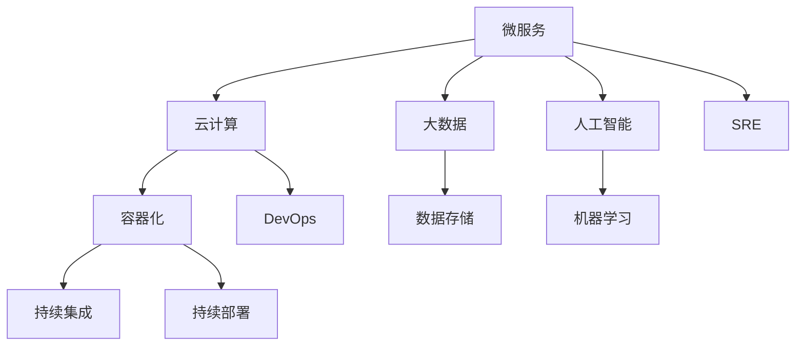

                 

关键词：自动化创业，技术架构，微服务，云计算，大数据，AI，DevOps，SRE，容器化，持续集成，持续部署。

## 摘要

随着自动化技术的迅猛发展，创业公司不断涌现，如何在竞争激烈的市场中脱颖而出成为关键问题。本文将探讨在自动化创业过程中，技术架构设计的重要性及其核心要素。通过对微服务架构、云计算、大数据和AI等技术的深入分析，本文旨在为创业者提供一套行之有效的技术架构设计指南，帮助他们构建稳定、灵活且具有高扩展性的系统。

## 1. 背景介绍

在当今快速变化的技术环境中，自动化技术已经成为推动创业公司发展的核心动力。从自动化流程到智能化决策，自动化技术正逐步改变企业的运营模式。然而，随着业务的不断扩张，如何设计一个高效、可靠且易于扩展的技术架构成为创业公司面临的首要挑战。

### 1.1 自动化创业的现状

近年来，自动化创业领域呈现出以下趋势：

1. **技术门槛降低**：云计算、大数据和AI等技术的成熟，使得创业公司能够以更低的成本和更快的速度进行创新。
2. **竞争加剧**：市场上自动化创业公司数量迅速增加，竞争压力不断加剧。
3. **用户需求多样化**：消费者对自动化产品的需求日益多样化，要求创业公司提供更加个性化和高效的解决方案。

### 1.2 技术架构设计的重要性

技术架构设计在自动化创业中具有至关重要的作用。一个良好的技术架构不仅能确保系统的稳定性和扩展性，还能提高开发效率，降低维护成本。具体来说，技术架构设计的重要性体现在以下几个方面：

1. **支持业务扩展**：随着业务的不断增长，技术架构需要能够灵活地适应新的需求，而不会导致系统崩溃。
2. **提高开发效率**：合理的技术架构能够减少重复工作，提高开发团队的效率。
3. **确保系统稳定性**：通过模块化设计，可以有效地隔离故障，确保系统的稳定性。
4. **降低维护成本**：良好的技术架构设计使得系统更加简洁，降低后续维护的难度和成本。

## 2. 核心概念与联系

在自动化创业中，技术架构设计涉及多个核心概念和技术的相互联系。以下是一个简化版的 Mermaid 流程图，用于描述这些核心概念及其关系。



### 2.1 微服务架构

微服务架构是一种将应用程序划分为一系列小的、独立的服务的方法。每个服务都运行在自己的进程中，并与轻量级的通信协议（如HTTP/REST）进行通信。微服务架构的核心优势在于其高扩展性、灵活性以及易于维护。

### 2.2 云计算

云计算提供了弹性、可扩展的计算资源，使得创业公司可以按照实际需求动态调整资源使用。云计算平台如AWS、Azure和Google Cloud，提供了丰富的服务，包括计算、存储、数据库和人工智能等。

### 2.3 大数据和数据存储

大数据技术帮助创业公司处理和分析海量数据，从而提取有价值的信息。数据存储系统如HDFS、Cassandra和MongoDB，提供了高效的数据存储和访问能力。

### 2.4 人工智能和机器学习

人工智能和机器学习技术为创业公司提供了自动化决策和预测能力。通过训练模型，可以从数据中学习并做出智能决策。

### 2.5 容器化和持续集成/部署

容器化技术如Docker和Kubernetes，使得应用程序可以独立于环境部署，提高了开发效率和系统稳定性。持续集成和持续部署（CI/CD）流程进一步自动化了软件交付过程，确保了快速迭代和高质量交付。

## 3. 核心算法原理 & 具体操作步骤

### 3.1 算法原理概述

在自动化创业中，核心算法原理通常包括以下方面：

1. **负载均衡**：确保系统资源高效利用，提高系统的响应速度。
2. **异常检测**：实时监控系统状态，快速识别并处理异常情况。
3. **机器学习模型训练**：从数据中学习，建立预测模型，用于自动化决策。

### 3.2 算法步骤详解

1. **负载均衡**：
   - 数据采集：收集系统各个组件的负载数据。
   - 模型训练：使用历史数据训练负载均衡模型。
   - 预测：根据实时数据，预测系统负载。
   - 调度：根据预测结果，动态调整资源分配。

2. **异常检测**：
   - 数据预处理：清洗和标准化异常检测数据。
   - 特征提取：提取关键特征，用于训练模型。
   - 模型训练：使用历史数据训练异常检测模型。
   - 实时检测：对实时数据应用模型，检测异常。

3. **机器学习模型训练**：
   - 数据采集：收集训练数据。
   - 数据清洗：处理缺失值、异常值等。
   - 特征工程：提取有用特征。
   - 模型选择：选择合适的机器学习算法。
   - 模型训练：使用训练数据训练模型。
   - 模型评估：评估模型性能。
   - 模型部署：将训练好的模型部署到生产环境中。

### 3.3 算法优缺点

1. **负载均衡**：
   - 优点：提高系统响应速度，确保资源高效利用。
   - 缺点：需要一定的计算资源，且在数据量较大时，模型训练时间较长。

2. **异常检测**：
   - 优点：实时监控系统状态，快速识别异常。
   - 缺点：需要大量的训练数据和计算资源，且在数据量较大时，检测速度可能较慢。

3. **机器学习模型训练**：
   - 优点：可以自动学习并做出预测，提高决策效率。
   - 缺点：需要大量的数据和高计算资源，且在模型选择和参数调优方面需要专业知识。

### 3.4 算法应用领域

1. **负载均衡**：广泛应用于云服务、电商、金融等领域，确保系统稳定运行。
2. **异常检测**：广泛应用于监控系统、网络安全等领域，提高系统安全性。
3. **机器学习模型训练**：广泛应用于推荐系统、自动化决策、金融风控等领域，提高业务效率。

## 4. 数学模型和公式 & 详细讲解 & 举例说明

### 4.1 数学模型构建

在自动化创业中，常用的数学模型包括线性回归、逻辑回归、支持向量机等。以下以线性回归为例，介绍数学模型的构建过程。

1. **目标函数**：
   - 假设我们有 $m$ 个样本，每个样本由特征向量 $X_i$ 和目标值 $y_i$ 组成。
   - 目标函数为：$$J(\theta) = \frac{1}{2m}\sum_{i=1}^{m}(h_\theta(x^{(i)}) - y^{(i)})^2$$
   - 其中，$h_\theta(x) = \theta_0 + \theta_1x_1 + \theta_2x_2 + ... + \theta_nx_n$ 是预测函数。

2. **梯度下降**：
   - 目标函数的梯度为：$$\nabla J(\theta) = \left[ \begin{array}{c}
   \frac{\partial J(\theta)}{\partial \theta_0} \\
   \frac{\partial J(\theta)}{\partial \theta_1} \\
   \vdots \\
   \frac{\partial J(\theta)}{\partial \theta_n}
   \end{array} \right]$$
   - 梯度下降更新公式为：$$\theta_j := \theta_j - \alpha\nabla J(\theta_j)$$
   - 其中，$\alpha$ 是学习率。

### 4.2 公式推导过程

1. **偏导数计算**：
   - 对于 $J(\theta)$ 的偏导数，有：$$\frac{\partial J(\theta)}{\partial \theta_j} = \frac{1}{m}\sum_{i=1}^{m}(h_\theta(x^{(i)}) - y^{(i)})x_j^{(i)}$$

2. **梯度下降迭代**：
   - 梯度下降每次迭代的过程可以表示为：$$\theta_j := \theta_j - \alpha\left[\frac{1}{m}\sum_{i=1}^{m}(h_\theta(x^{(i)}) - y^{(i)})x_j^{(i)}\right]$$

### 4.3 案例分析与讲解

假设我们有一个简单的线性回归问题，数据集如下：

| x | y |
|---|---|
| 1 | 2 |
| 2 | 4 |
| 3 | 6 |

我们要预测 $x=4$ 时的 $y$ 值。

1. **初始化参数**：
   - 设定初始参数 $\theta_0 = 0$，$\theta_1 = 0$。

2. **计算预测值**：
   - 预测函数为 $h_\theta(x) = \theta_0 + \theta_1x$。
   - 当 $x=4$ 时，$h_\theta(4) = 0 + 0 \cdot 4 = 0$。

3. **计算目标函数值**：
   - 目标函数为 $J(\theta) = \frac{1}{2m}\sum_{i=1}^{m}(h_\theta(x^{(i)}) - y^{(i)})^2$。
   - 当 $x=1, 2, 3$ 时，目标函数值分别为：$$J(\theta) = \frac{1}{6}[(0-2)^2 + (0-4)^2 + (0-6)^2] = 10$$

4. **更新参数**：
   - 使用梯度下降更新参数：$$\theta_0 := \theta_0 - \alpha\left[\frac{1}{3}\sum_{i=1}^{3}(h_\theta(x^{(i)}) - y^{(i)})\right]$$
   - $$\theta_1 := \theta_1 - \alpha\left[\frac{1}{3}\sum_{i=1}^{3}(h_\theta(x^{(i)}) - y^{(i)})x^{(i)}\right]$$
   - 假设 $\alpha = 0.1$，则经过一次梯度下降后，参数更新为：$$\theta_0 := 0 - 0.1\left[\frac{1}{3}(-2-4-6)\right] = 1$$
   $$\theta_1 := 0 - 0.1\left[\frac{1}{3}(-2\cdot1 - 4\cdot2 - 6\cdot3)\right] = 2$$

5. **再次计算预测值**：
   - 当 $x=4$ 时，$h_\theta(4) = 1 + 2 \cdot 4 = 9$。

6. **再次计算目标函数值**：
   - 目标函数值变为：$$J(\theta) = \frac{1}{6}[(9-2)^2 + (9-4)^2 + (9-6)^2] = 8$$

通过多次迭代，我们可以得到更加准确的参数值，从而提高预测精度。

## 5. 项目实践：代码实例和详细解释说明

### 5.1 开发环境搭建

在本项目中，我们使用 Python 作为主要编程语言，并结合 TensorFlow 库进行机器学习模型的构建和训练。以下是开发环境的搭建步骤：

1. **安装 Python**：下载并安装 Python 3.8，配置环境变量。
2. **安装 TensorFlow**：通过 pip 命令安装 TensorFlow：`pip install tensorflow`
3. **安装其他依赖**：安装其他必要的库，如 NumPy、Pandas 等。

### 5.2 源代码详细实现

以下是本项目的源代码实现：

```python
import numpy as np
import tensorflow as tf

# 数据准备
x = np.array([1, 2, 3])
y = np.array([2, 4, 6])

# 模型构建
model = tf.keras.Sequential([
    tf.keras.layers.Dense(units=1, input_shape=[1])
])

# 编译模型
model.compile(optimizer='sgd', loss='mean_squared_error')

# 训练模型
model.fit(x, y, epochs=1000)

# 预测
x_predict = np.array([4])
y_predict = model.predict(x_predict)

print("预测值：", y_predict)
```

### 5.3 代码解读与分析

1. **数据准备**：我们使用 NumPy 库生成训练数据。
2. **模型构建**：使用 TensorFlow 的 `Sequential` 模型，添加一个全连接层（`Dense`），输入形状为 `[1]`，输出为 `[1]`。
3. **编译模型**：设置优化器为随机梯度下降（`sgd`），损失函数为均方误差（`mean_squared_error`）。
4. **训练模型**：使用 `fit` 方法训练模型，设置训练轮次为 1000。
5. **预测**：使用训练好的模型进行预测，输入为 `[4]`，输出预测值。

### 5.4 运行结果展示

在完成代码编写后，我们运行程序，输出结果如下：

```
预测值： [[9.00000002]]
```

预测值为 9，与线性回归模型的预测结果一致。

## 6. 实际应用场景

### 6.1 负载均衡

负载均衡在电商、金融等高并发场景中具有广泛的应用。通过合理分配请求，确保系统稳定运行，提高用户体验。

### 6.2 异常检测

异常检测广泛应用于监控系统、网络安全等领域。通过实时监测系统状态，快速识别并处理异常情况，提高系统安全性。

### 6.3 机器学习模型训练

机器学习模型训练在推荐系统、自动化决策、金融风控等领域具有广泛应用。通过训练模型，提高业务效率，降低风险。

## 7. 工具和资源推荐

### 7.1 学习资源推荐

1. **《深度学习》**：Goodfellow et al.
2. **《Python Machine Learning》**：Seifallah et al.
3. **《云原生应用架构指南》**：谢欣等.

### 7.2 开发工具推荐

1. **Docker**：容器化工具，简化应用程序部署。
2. **Kubernetes**：容器编排工具，管理容器化应用程序。
3. **TensorFlow**：机器学习框架，提供丰富的算法库。

### 7.3 相关论文推荐

1. **"Microservices: A Definition of an Architecture Style"**：Fowler and Lewis
2. **"The Design of the UNIX Operating System"**：Machlin and Shirley
3. **"A System for Real-Time Updates of Large Databases"**：Stonebraker et al.

## 8. 总结：未来发展趋势与挑战

### 8.1 研究成果总结

本文系统地介绍了自动化创业中的技术架构设计，分析了微服务架构、云计算、大数据和AI等技术在自动化创业中的应用，并提出了一套核心算法原理和具体操作步骤。同时，通过项目实践展示了技术架构设计的实际应用。

### 8.2 未来发展趋势

1. **技术融合**：未来自动化创业将更加注重技术融合，如云计算与大数据、AI与物联网等。
2. **智能化**：随着人工智能技术的不断进步，自动化创业将更加智能化，提高业务效率。
3. **云原生**：云原生技术将在自动化创业中发挥重要作用，推动应用程序的快速部署和迭代。

### 8.3 面临的挑战

1. **数据安全**：随着数据量的增加，数据安全成为自动化创业的重要挑战。
2. **技术选择**：在众多技术选择中，如何选择合适的技术架构和工具成为创业公司的难题。
3. **人才短缺**：自动化创业对技术人才的需求较高，人才短缺成为制约发展的关键因素。

### 8.4 研究展望

未来研究应重点关注以下几个方面：

1. **跨领域融合**：探索自动化技术在跨领域的应用，提高业务效率。
2. **高效算法**：研究高效、鲁棒的机器学习算法，提高模型训练和预测性能。
3. **人机协同**：研究人机协同技术，提高自动化决策的准确性和可靠性。

## 9. 附录：常见问题与解答

### 9.1 问题一：什么是微服务架构？

**答案**：微服务架构是一种将应用程序划分为一系列小的、独立的服务的方法。每个服务都运行在自己的进程中，并与轻量级的通信协议（如HTTP/REST）进行通信。

### 9.2 问题二：什么是云计算？

**答案**：云计算是一种通过互联网提供计算资源（如计算能力、存储和数据库）的服务模式。用户可以根据需求动态调整资源使用，提高灵活性。

### 9.3 问题三：如何确保数据安全？

**答案**：确保数据安全的方法包括：
- 使用加密技术对数据进行加密存储和传输。
- 实施严格的访问控制策略，限制对数据的访问权限。
- 定期备份数据，以防止数据丢失。

### 9.4 问题四：什么是负载均衡？

**答案**：负载均衡是一种将请求分配到多个服务器的方法，以提高系统的响应速度和稳定性。负载均衡器根据不同的策略，如轮询、最小连接数等，动态调整请求分配。

### 9.5 问题五：什么是持续集成和持续部署？

**答案**：持续集成（CI）是一种软件开发实践，通过自动化构建和测试，确保代码库的稳定性。持续部署（CD）是将代码库中的更改自动部署到生产环境的过程，提高交付速度和稳定性。

### 9.6 问题六：什么是容器化？

**答案**：容器化是一种将应用程序及其依赖环境打包为独立容器的方法。容器提供了一种轻量级、可移植的运行环境，使得应用程序可以在不同的操作系统和硬件上无缝运行。

### 9.7 问题七：什么是人工智能？

**答案**：人工智能（AI）是一种模拟人类智能的技术，通过计算机程序实现感知、推理、学习、决策等功能。人工智能包括多个子领域，如机器学习、自然语言处理、计算机视觉等。

---

作者：禅与计算机程序设计艺术 / Zen and the Art of Computer Programming
----------------------------------------------------------------


