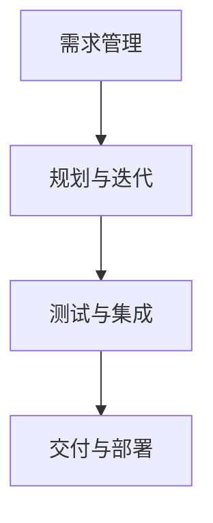

                 

关键词：敏捷开发、自动化创业、快速迭代、客户反馈、持续集成、持续交付、DevOps、敏捷团队

> 摘要：本文探讨了敏捷开发方法在自动化创业中的应用，通过快速迭代、持续集成与交付，实现高效的研发流程和产品交付。本文结合实际案例，详细阐述了敏捷开发的核心原则和实践方法，并对其优缺点和未来发展趋势进行了深入分析。

## 1. 背景介绍

在当今快速变化的市场环境中，自动化创业已经成为众多企业发展的主流趋势。敏捷开发方法作为一种高效的软件开发实践，逐渐被自动化创业企业所接受和应用。敏捷开发强调团队协作、客户需求快速响应和持续迭代，这使得企业在激烈的市场竞争中能够迅速调整方向，实现产品的高质量交付。

本文旨在探讨敏捷开发在自动化创业中的应用，分析其核心原则和实践方法，并结合实际案例，探讨其优缺点和未来发展趋势。

## 2. 核心概念与联系

### 2.1 敏捷开发的核心理念

敏捷开发是一种以人为核心、迭代、协作和适应变化的软件开发方法。其核心理念包括：

- **客户至上**：满足客户需求是敏捷开发的根本目标。
- **团队协作**：团队成员之间紧密合作，共同完成任务。
- **快速迭代**：通过快速迭代和持续交付，确保产品持续改进。
- **适应变化**：在项目开发过程中，随时准备应对需求的变化。

### 2.2 敏捷开发与传统开发方法的比较

与传统开发方法相比，敏捷开发具有以下优势：

- **快速响应**：敏捷开发强调客户参与和反馈，能够快速响应需求变化。
- **高效协作**：敏捷开发强调团队协作，提高开发效率。
- **持续交付**：通过持续集成和持续交付，确保产品按时交付。
- **灵活调整**：敏捷开发允许在开发过程中灵活调整计划和需求。

### 2.3 敏捷开发的流程与架构

敏捷开发通常包括以下关键流程和架构：

- **需求管理**：收集、分析和管理客户需求。
- **规划与迭代**：制定开发计划，进行快速迭代。
- **测试与集成**：持续集成和测试，确保产品质量。
- **交付与部署**：持续交付和部署，实现产品交付。

### 2.4 Mermaid 流程图

以下是敏捷开发流程的 Mermaid 流程图：



## 3. 核心算法原理 & 具体操作步骤

### 3.1 算法原理概述

敏捷开发方法的核心算法原理主要包括：

- **迭代与增量开发**：将整个开发过程划分为多个迭代周期，每个迭代周期实现一部分功能。
- **持续集成**：通过自动化测试和构建，确保代码质量。
- **持续交付**：通过自动化部署，确保产品按时交付。
- **客户反馈**：定期收集客户反馈，及时调整产品方向。

### 3.2 算法步骤详解

#### 3.2.1 迭代与增量开发

1. **需求分析**：收集客户需求，进行分析和优先级排序。
2. **规划迭代**：根据需求优先级，制定每个迭代周期的任务。
3. **开发与测试**：在迭代周期内，完成任务的开发和测试。
4. **评审与交付**：评审迭代周期的成果，进行交付。

#### 3.2.2 持续集成

1. **代码提交**：开发人员提交代码。
2. **自动化测试**：执行自动化测试，确保代码质量。
3. **构建与部署**：构建和部署代码，确保产品可用性。

#### 3.2.3 持续交付

1. **交付计划**：制定交付计划，确保产品按时交付。
2. **自动化部署**：通过自动化工具，实现产品的自动化部署。
3. **监控与反馈**：监控产品运行状况，收集客户反馈。

### 3.3 算法优缺点

#### 3.3.1 优点

- **快速响应**：能够快速响应客户需求，提高市场竞争力。
- **高效协作**：强调团队协作，提高开发效率。
- **持续交付**：确保产品按时交付，提高客户满意度。
- **适应变化**：允许在开发过程中灵活调整需求和计划。

#### 3.3.2 缺点

- **需求管理复杂**：需求管理难度较大，需要建立有效的需求管理机制。
- **项目管理难度**：在多个迭代周期中，项目管理难度较大。

### 3.4 算法应用领域

敏捷开发方法广泛应用于以下领域：

- **互联网产品开发**：如电商平台、社交媒体等。
- **移动应用开发**：如智能手机应用、移动游戏等。
- **自动化系统开发**：如智能硬件、自动化生产线等。

## 4. 数学模型和公式 & 详细讲解 & 举例说明

### 4.1 数学模型构建

敏捷开发中的数学模型主要包括：

- **工作量估算模型**：如故事点估算、团队效能评估等。
- **迭代效率模型**：如迭代周期时间、迭代交付量等。

### 4.2 公式推导过程

#### 4.2.1 工作量估算模型

1. **故事点估算**：

   $$ 工作量（Story Points）= 困难度 × 估计时间 $$

2. **团队效能评估**：

   $$ 效能（Efficiency）= 完成任务数 ÷ 预估任务数 $$

#### 4.2.2 迭代效率模型

1. **迭代周期时间**：

   $$ 迭代周期时间（Iteration Time）= 迭代周期数 × 单个迭代周期时间 $$

2. **迭代交付量**：

   $$ 迭代交付量（Iteration Output）= 迭代周期数 × 每个迭代周期交付量 $$

### 4.3 案例分析与讲解

#### 4.3.1 案例背景

某自动化创业公司计划开发一款智能家居应用，需要实现远程控制家居设备、设备状态监控等功能。

#### 4.3.2 案例分析

1. **工作量估算**：

   - **故事点估算**：

     $$ 工作量（Story Points）= 困难度 × 估计时间 = 3 × 5 = 15 $$

   - **团队效能评估**：

     $$ 效能（Efficiency）= 完成任务数 ÷ 预估任务数 = 3 ÷ 5 = 0.6 $$

2. **迭代效率模型**：

   - **迭代周期时间**：

     $$ 迭代周期时间（Iteration Time）= 迭代周期数 × 单个迭代周期时间 = 2 × 7 = 14 天 $$

   - **迭代交付量**：

     $$ 迭代交付量（Iteration Output）= 迭代周期数 × 每个迭代周期交付量 = 2 × 2 = 4 功能点 $$

#### 4.3.3 案例讲解

根据案例分析，该公司在两个迭代周期内完成了4个功能点的开发，团队效能达到了0.6。在下一个迭代周期，公司可以继续优化现有功能，或者根据市场需求，调整开发方向。

## 5. 项目实践：代码实例和详细解释说明

### 5.1 开发环境搭建

为了实现敏捷开发方法，需要搭建一个高效的开发环境。以下是一个典型的开发环境搭建步骤：

1. **选择开发语言和框架**：如Java、Python等。
2. **搭建开发工具**：如Eclipse、Visual Studio Code等。
3. **配置代码仓库**：如Git、SVN等。
4. **配置持续集成工具**：如Jenkins、Travis CI等。
5. **配置自动化测试工具**：如Selenium、JUnit等。

### 5.2 源代码详细实现

以下是敏捷开发方法中的一个简单示例，实现一个简单的远程控制家居设备的接口。

```java
public class HomeDeviceController {
  
  public void turnOn() {
    // 开启家居设备
    System.out.println("家居设备已开启");
  }
  
  public void turnOff() {
    // 关闭家居设备
    System.out.println("家居设备已关闭");
  }
  
  public void checkStatus() {
    // 检查家居设备状态
    System.out.println("家居设备当前状态：" + getDeviceStatus());
  }
  
  private String getDeviceStatus() {
    // 获取家居设备状态
    return "开启";
  }
}
```

### 5.3 代码解读与分析

1. **类与方法的定义**：定义了一个`HomeDeviceController`类，包括三个方法：`turnOn`、`turnOff`和`checkStatus`。
2. **方法实现**：`turnOn`方法用于开启家居设备，`turnOff`方法用于关闭家居设备，`checkStatus`方法用于检查家居设备状态。
3. **代码结构**：代码结构清晰，易于维护和扩展。

### 5.4 运行结果展示

```bash
$ java HomeDeviceController
家居设备已开启
家居设备已关闭
家居设备当前状态：开启
```

## 6. 实际应用场景

### 6.1 自动化创业中的敏捷开发

在自动化创业中，敏捷开发方法具有广泛的应用场景：

1. **快速响应市场需求**：通过敏捷开发，企业可以快速响应市场需求，调整产品方向。
2. **持续交付高质量产品**：通过持续集成和交付，确保产品按时交付，提高客户满意度。
3. **高效团队协作**：通过敏捷开发，促进团队成员之间的协作，提高开发效率。

### 6.2 敏捷开发的挑战与应对策略

敏捷开发在自动化创业中面临以下挑战：

1. **需求管理复杂**：需要建立有效的需求管理机制，确保需求变更的有序进行。
2. **项目管理难度**：在多个迭代周期中，项目管理难度较大，需要建立有效的项目管理机制。
3. **团队协作困难**：在远程办公环境下，团队协作困难，需要加强沟通和协作。

应对策略：

1. **建立需求管理机制**：建立需求管理流程，确保需求变更的有序进行。
2. **加强项目管理**：采用敏捷项目管理工具，如JIRA、Trello等，提高项目管理效率。
3. **促进团队协作**：采用远程协作工具，如Slack、Zoom等，加强团队成员之间的沟通和协作。

## 7. 工具和资源推荐

### 7.1 学习资源推荐

- 《敏捷开发实践指南》
- 《敏捷开发的艺术》
- 《持续集成实践》

### 7.2 开发工具推荐

- Eclipse、Visual Studio Code
- Git、SVN
- Jenkins、Travis CI
- Selenium、JUnit

### 7.3 相关论文推荐

- 《敏捷开发方法：原理与实践》
- 《持续集成：从理论到实践》
- 《敏捷团队协作：最佳实践》

## 8. 总结：未来发展趋势与挑战

### 8.1 研究成果总结

敏捷开发方法在自动化创业中取得了显著的成果，主要表现在：

1. **快速响应市场需求**：通过敏捷开发，企业可以快速调整产品方向，满足客户需求。
2. **高效团队协作**：敏捷开发方法促进团队成员之间的协作，提高开发效率。
3. **持续交付高质量产品**：通过持续集成和交付，确保产品按时交付，提高客户满意度。

### 8.2 未来发展趋势

未来，敏捷开发方法在自动化创业中将继续发展，主要趋势包括：

1. **更深入的实践与探索**：企业将进一步深入实践敏捷开发，探索更高效的开发方法和流程。
2. **技术融合与创新**：敏捷开发将与人工智能、大数据等新技术融合，推动自动化创业的发展。
3. **全球化与多元化**：敏捷开发将在全球范围内得到更广泛的应用，适应不同地区的市场需求。

### 8.3 面临的挑战

敏捷开发在自动化创业中仍面临以下挑战：

1. **需求管理复杂**：在多变的市场环境中，需求管理难度较大，需要建立有效的需求管理机制。
2. **团队协作困难**：在远程办公环境下，团队协作困难，需要加强沟通和协作。
3. **项目管理难度**：在多个迭代周期中，项目管理难度较大，需要建立有效的项目管理机制。

### 8.4 研究展望

未来，研究应重点关注以下方向：

1. **需求管理机制优化**：研究更有效的需求管理方法，降低需求变更风险。
2. **团队协作工具创新**：开发更高效的团队协作工具，提高远程协作效率。
3. **项目管理方法创新**：探索更适合敏捷开发的项目管理方法，提高项目管理效率。

## 9. 附录：常见问题与解答

### 9.1 敏捷开发与传统开发方法的区别是什么？

- **响应速度**：敏捷开发更注重快速响应客户需求，而传统开发方法更注重规划与设计。
- **团队协作**：敏捷开发强调团队协作，而传统开发方法可能更强调个人能力和分工。
- **持续交付**：敏捷开发强调持续交付和迭代，而传统开发方法通常在项目完成后交付。

### 9.2 敏捷开发中的迭代周期如何设置？

迭代周期应根据项目规模和团队效率进行设置，通常建议设置为2-4周。较短的迭代周期有助于快速反馈和调整，但可能增加管理成本；较长的迭代周期有助于降低管理成本，但可能降低响应速度。

### 9.3 敏捷开发中的持续集成是什么？

持续集成是指将开发过程中的代码定期集成到主分支，并进行自动化测试和构建。这有助于确保代码质量，降低集成风险，提高开发效率。

### 9.4 敏捷开发中的持续交付是什么？

持续交付是指通过自动化部署和测试，确保产品按时交付。持续交付有助于提高产品质量，降低交付风险，提高客户满意度。

### 9.5 敏捷开发中的客户反馈如何收集？

客户反馈可以通过以下途径收集：

- **用户调查**：通过在线调查、问卷等方式收集用户反馈。
- **用户访谈**：与用户进行面对面交流，了解用户需求和意见。
- **用户行为分析**：通过分析用户行为数据，了解用户需求和偏好。

### 9.6 敏捷开发中的风险管理如何进行？

敏捷开发中的风险管理主要包括以下几个方面：

- **识别风险**：识别可能影响项目的风险因素。
- **评估风险**：对识别的风险进行评估，确定风险优先级。
- **制定应对策略**：制定应对风险的策略，降低风险影响。
- **监控与调整**：在项目过程中，持续监控风险，并根据实际情况进行调整。 

----------------------------------------------------------------
作者：禅与计算机程序设计艺术 / Zen and the Art of Computer Programming
----------------------------------------------------------------


