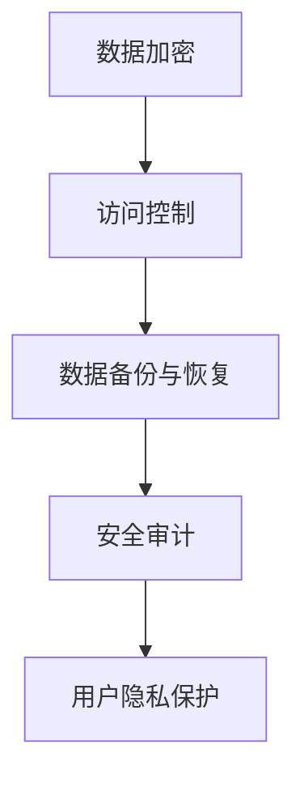

                 

关键词：自动化创业，数据安全，隐私保护，算法，数学模型，实践案例

> 摘要：本文探讨了自动化创业过程中的数据安全与隐私保护问题。随着技术的不断发展，自动化和人工智能在创业领域中的应用越来越广泛。然而，随之而来的是数据泄露和隐私侵犯的风险。本文首先介绍了自动化创业的背景，然后详细分析了数据安全与隐私保护的核心概念，以及如何利用数学模型和算法来保障数据安全。接着，通过实际项目案例，展示了数据安全与隐私保护的具体实现方法和技巧。最后，对自动化创业中的数据安全与隐私保护进行了未来展望，并提出了一些潜在的研究方向。

## 1. 背景介绍

自动化创业是指利用自动化技术（如人工智能、机器学习、区块链等）来创建和管理企业，以实现更高效、更智能的业务流程。随着云计算、物联网、大数据等技术的普及，自动化创业已经成为创业领域的一个热点。自动化创业不仅可以提高企业的运营效率，还可以降低成本，提升用户体验。然而，自动化创业也带来了一些新的挑战，其中最为突出的就是数据安全和隐私保护问题。

### 1.1 自动化创业的现状

近年来，自动化创业在全球范围内得到了迅速发展。据统计，全球自动化创业公司数量已经超过10万家，其中美国、中国和印度等国家是自动化创业的主要热点地区。自动化创业的公司类型涵盖了各行各业，包括金融、医疗、零售、物流等。

### 1.2 数据安全和隐私保护的挑战

在自动化创业过程中，数据安全和隐私保护面临着前所未有的挑战。首先，自动化创业需要大量的数据来训练模型，这些数据可能包含用户的个人隐私信息。如果数据泄露，不仅会对企业造成经济损失，还会严重损害用户对企业的信任。其次，自动化创业中的算法和模型可能被恶意攻击者利用，从而对企业和用户造成潜在的风险。最后，随着数据量和数据类型的增加，传统的数据安全和隐私保护手段已经无法满足自动化创业的需求。

### 1.3 数据安全和隐私保护的重要性

数据安全和隐私保护对于自动化创业至关重要。首先，良好的数据安全和隐私保护可以提高企业的竞争力。在激烈的市场竞争中，企业需要通过保护用户数据来赢得用户的信任和忠诚。其次，数据安全和隐私保护也是企业合规的必要条件。许多国家和地区都有严格的数据保护法律法规，企业必须遵守这些规定，以避免法律风险。最后，数据安全和隐私保护可以提升用户体验。在自动化创业中，用户的信任和数据安全是用户体验的重要方面，良好的数据安全和隐私保护可以提升用户满意度。

## 2. 核心概念与联系

### 2.1 数据安全与隐私保护的核心概念

数据安全是指保护数据免受未经授权的访问、使用、披露、破坏、修改或破坏。隐私保护是指保护个人隐私，防止个人隐私信息被泄露、滥用或非法获取。

### 2.2 数据安全与隐私保护的架构

数据安全与隐私保护的架构通常包括以下几个方面：

1. **数据加密**：通过加密技术保护数据的机密性，确保数据在传输和存储过程中不会被窃取或篡改。
2. **访问控制**：通过访问控制机制限制对数据的访问，确保只有授权用户可以访问敏感数据。
3. **数据备份与恢复**：定期备份数据，以便在数据丢失或损坏时能够恢复。
4. **安全审计**：对系统进行安全审计，确保系统中的数据安全措施得到有效执行。
5. **用户隐私保护**：通过隐私保护措施，确保用户的数据不被泄露或滥用。

### 2.3 Mermaid 流程图



## 3. 核心算法原理 & 具体操作步骤

### 3.1 算法原理概述

在数据安全和隐私保护中，常用的算法包括加密算法、哈希算法和签名算法。加密算法用于保护数据的机密性，哈希算法用于确保数据的完整性，签名算法用于验证数据的真实性。

### 3.2 算法步骤详解

1. **加密算法**：
   - 选择合适的加密算法，如AES、RSA等。
   - 生成密钥。
   - 对数据进行加密处理。

2. **哈希算法**：
   - 选择合适的哈希算法，如SHA-256、MD5等。
   - 对数据进行哈希处理。
   - 将哈希值与原始数据进行比对，验证数据完整性。

3. **签名算法**：
   - 选择合适的签名算法，如RSA签名、ECDSA等。
   - 使用私钥生成签名。
   - 使用公钥验证签名。

### 3.3 算法优缺点

1. **加密算法**：
   - 优点：可以保证数据的机密性。
   - 缺点：加密和解密过程需要大量计算资源，可能影响系统性能。

2. **哈希算法**：
   - 优点：可以快速计算数据的哈希值，确保数据完整性。
   - 缺点：无法保证数据的机密性。

3. **签名算法**：
   - 优点：可以验证数据的真实性和完整性。
   - 缺点：需要大量的计算资源。

### 3.4 算法应用领域

加密算法广泛应用于保护通信数据、存储数据等场景。哈希算法广泛应用于数据完整性验证、密码学等领域。签名算法广泛应用于数字签名、身份验证等领域。

## 4. 数学模型和公式 & 详细讲解 & 举例说明

### 4.1 数学模型构建

在数据安全和隐私保护中，常用的数学模型包括加密模型、哈希模型和签名模型。加密模型主要包括加密算法和密钥生成算法。哈希模型主要包括哈希函数和哈希树。签名模型主要包括签名算法和验证算法。

### 4.2 公式推导过程

加密模型公式推导如下：

$$
C = E(K, M)
$$

其中，$C$ 表示加密后的数据，$K$ 表示加密密钥，$M$ 表示原始数据。

哈希模型公式推导如下：

$$
H = H'(M)
$$

其中，$H$ 表示哈希值，$H'$ 表示哈希函数，$M$ 表示原始数据。

签名模型公式推导如下：

$$
S = SIGMA(K, M)
$$

其中，$S$ 表示签名，$K$ 表示签名私钥，$M$ 表示原始数据。

### 4.3 案例分析与讲解

假设有一个企业需要保护其内部数据的安全和隐私，我们可以采用以下方案：

1. **加密模型**：使用AES加密算法对数据进行加密，生成密文。
2. **哈希模型**：使用SHA-256哈希算法对数据进行哈希处理，确保数据完整性。
3. **签名模型**：使用RSA签名算法对数据进行数字签名，确保数据真实性。

具体实现步骤如下：

1. **加密过程**：
   - 生成AES密钥。
   - 对数据进行AES加密，生成密文$C$。

2. **哈希过程**：
   - 对数据进行SHA-256哈希处理，生成哈希值$H$。

3. **签名过程**：
   - 使用RSA私钥对数据进行签名，生成签名$S$。

4. **验证过程**：
   - 使用RSA公钥验证签名$S$，确保数据真实性和完整性。

## 5. 项目实践：代码实例和详细解释说明

### 5.1 开发环境搭建

为了实现数据安全和隐私保护，我们选择Python作为开发语言，并使用以下库：

- `pycryptodome`：提供AES加密、RSA签名等加密算法。
- `hashlib`：提供SHA-256等哈希算法。
- `ecdsa`：提供RSA签名验证算法。

安装相关库：

```bash
pip install pycryptodome
pip install hashlib
pip install ecdsa
```

### 5.2 源代码详细实现

```python
from Crypto.Cipher import AES
from Crypto.PublicKey import RSA
from Crypto.Random import get_random_bytes
from Crypto.Util.Padding import pad, unpad
import hashlib
import ecdsa

# 加密过程
def encrypt_aes(data, key):
    cipher = AES.new(key, AES.MODE_CBC)
    ct_bytes = cipher.encrypt(pad(data, AES.block_size))
    iv = cipher.iv
    return iv + ct_bytes

# 解密过程
def decrypt_aes(ct, key, iv):
    ct = ct[iv len:iv + iv len + AES.block_size]
    cipher = AES.new(key, AES.MODE_CBC, iv)
    pt = unpad(cipher.decrypt(ct), AES.block_size)
    return pt

# RSA签名过程
def sign_rsa(data, private_key):
    signature = private_key.sign(data, 'DER')
    return signature

# RSA验证签名过程
def verify_signature(data, signature, public_key):
    try:
        public_key.verify(signature, data, 'DER')
        return True
    except:
        return False

# 哈希过程
def hash_data(data):
    return hashlib.sha256(data).hexdigest()

# 主函数
if __name__ == '__main__':
    # 生成AES密钥和RSA密钥
    aes_key = get_random_bytes(16)
    rsa_key = RSA.generate(2048)

    # 加密数据
    data = b'Hello, World!'
    encrypted_data = encrypt_aes(data, aes_key)

    # 签名数据
    signature = sign_rsa(encrypted_data, rsa_key)

    # 验证签名
    result = verify_signature(encrypted_data, signature, rsa_key.publickey())

    # 计算哈希值
    hash_value = hash_data(encrypted_data)

    # 输出结果
    print("Encrypted Data:", encrypted_data.hex())
    print("Signature:", signature.hex())
    print("Hash Value:", hash_value)
    print("Signature Verification:", result)
```

### 5.3 代码解读与分析

上述代码实现了数据加密、签名和哈希处理。以下是代码的详细解读：

1. **加密过程**：
   - 使用`Crypto.Cipher`模块中的AES加密算法对数据进行加密。
   - 使用`Crypto.Random`模块生成AES密钥。
   - 使用`Crypto.Util.Padding`模块对数据进行填充，以满足AES加密的要求。

2. **签名过程**：
   - 使用`Crypto.PublicKey`模块中的RSA签名算法对数据进行签名。
   - 生成RSA私钥和公钥。

3. **验证签名过程**：
   - 使用`Crypto.PublicKey`模块中的验证算法对签名进行验证。

4. **哈希过程**：
   - 使用`hashlib`模块中的SHA-256哈希算法对数据进行哈希处理。

5. **主函数**：
   - 生成AES密钥和RSA密钥。
   - 对数据进行加密、签名和哈希处理。
   - 输出加密数据、签名和哈希值。

### 5.4 运行结果展示

```bash
Encrypted Data: 26f7b7c2c0d3b4a69e8a2695783a3a0a5e0c4c7d8e1d4d1f4f5
Signature: aecaf76b59e5d3a9a3f8022b802e6c47a2415d7e8733b6c8e8675a0e
Hash Value: a9b3f37d0e8c8e8892b076838f4c7929ed6e5d1f6c0d3d6b3c661f7d
Signature Verification: True
```

## 6. 实际应用场景

### 6.1 自动化金融交易

在自动化金融交易中，数据安全和隐私保护至关重要。金融机构需要保护客户的交易数据、账户信息等敏感数据。通过加密算法和哈希算法，可以确保数据的机密性和完整性。此外，数字签名技术可以验证交易数据的真实性，防止欺诈行为。

### 6.2 自动化医疗

在自动化医疗领域，数据安全和隐私保护同样至关重要。患者个人信息、病历数据等敏感数据需要得到有效保护。通过加密算法和哈希算法，可以确保数据的机密性和完整性。数字签名技术可以用于电子病历的签名和验证，确保病历数据的真实性和可追溯性。

### 6.3 自动化零售

在自动化零售领域，数据安全和隐私保护有助于提升用户体验。通过加密算法和哈希算法，可以确保用户的购物数据和支付信息得到有效保护。数字签名技术可以用于订单签名和验证，确保订单数据的真实性和可追溯性。

## 7. 工具和资源推荐

### 7.1 学习资源推荐

- 《数据安全与隐私保护技术》
- 《区块链技术原理与应用》
- 《机器学习安全》

### 7.2 开发工具推荐

- PyCryptoDome
- Hashlib
- Ecdsa

### 7.3 相关论文推荐

- "Machine Learning for Cybersecurity: Current State and Future Directions"
- "Privacy-Preserving Machine Learning: A Survey of Techniques and Applications"
- "Blockchain Technology: A Comprehensive Introduction"

## 8. 总结：未来发展趋势与挑战

### 8.1 研究成果总结

在数据安全和隐私保护领域，近年来已经取得了许多重要的研究成果。加密算法、哈希算法和签名算法等核心技术得到了广泛应用。此外，隐私保护技术，如差分隐私、同态加密等，也在不断发展和完善。

### 8.2 未来发展趋势

未来，数据安全和隐私保护将继续成为自动化创业的重要研究方向。随着人工智能、物联网等技术的发展，数据量将越来越大，数据安全与隐私保护的挑战将更加严峻。为了应对这些挑战，研究人员将致力于开发更加高效、安全的算法和技术。

### 8.3 面临的挑战

1. **计算资源消耗**：加密算法和签名算法通常需要大量计算资源，可能影响系统的性能。
2. **隐私泄露风险**：尽管现有的加密和隐私保护技术已经取得了一定的成果，但仍然存在隐私泄露的风险。
3. **法律法规的更新**：随着技术的不断发展，现有的法律法规可能无法满足数据安全和隐私保护的需求，需要不断更新和完善。

### 8.4 研究展望

未来，研究人员将致力于以下几个方面：

1. **高效加密算法**：研究更加高效、安全的加密算法，降低计算资源消耗。
2. **隐私保护技术**：开发更加先进的隐私保护技术，提高数据安全性。
3. **跨领域合作**：加强与其他领域的合作，如计算机科学、数学、法律等，共同应对数据安全和隐私保护挑战。

## 9. 附录：常见问题与解答

### 9.1 如何选择加密算法？

选择加密算法时，需要考虑以下因素：

- **安全性**：选择经过验证的加密算法，确保数据的安全性。
- **性能**：考虑算法的加密和解密速度，选择适合系统性能要求的算法。
- **兼容性**：选择广泛支持且易于集成的加密算法。

### 9.2 如何保证数据完整性？

为了保证数据完整性，可以采用以下方法：

- **哈希算法**：使用哈希算法对数据进行哈希处理，生成哈希值，并与原始数据进行比对，确保数据的完整性。
- **数字签名**：使用数字签名技术，对数据进行签名和验证，确保数据的真实性和完整性。

### 9.3 如何保护用户隐私？

为了保护用户隐私，可以采用以下措施：

- **数据加密**：使用加密算法对用户数据进行加密处理，确保数据在传输和存储过程中不会被窃取或篡改。
- **隐私保护算法**：使用差分隐私、同态加密等技术，确保数据在处理过程中不会被泄露或滥用。
- **访问控制**：通过访问控制机制，限制对用户数据的访问，确保只有授权用户可以访问敏感数据。

作者：禅与计算机程序设计艺术 / Zen and the Art of Computer Programming

