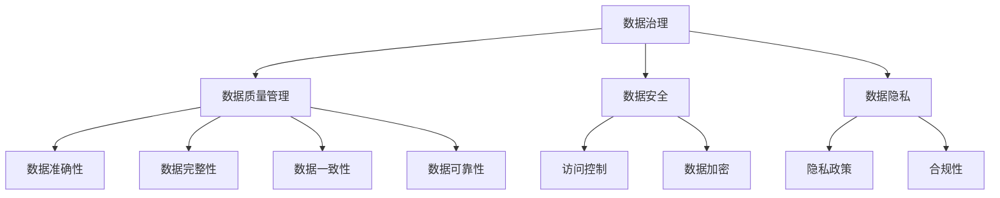

                 

### 摘要

本文探讨了自动化创业中数据治理与管理的重要性及其具体实践。通过介绍数据治理的基本概念、挑战和最佳实践，本文帮助创业团队建立高效的数据管理体系。此外，本文还详细解析了数据管理流程、数据安全与隐私保护措施，并分享了成功案例和未来发展趋势，为自动化创业提供有益的指导。

## 1. 背景介绍

随着大数据和人工智能技术的快速发展，数据已经成为企业的重要资产。对于自动化创业公司而言，数据治理与管理不仅是保证业务连续性和合规性的关键，更是实现数据价值、驱动创新的核心。然而，数据治理与管理并非易事，涉及数据质量、数据安全、数据隐私等多个方面，需要系统性的策略和方法。

本文旨在为自动化创业团队提供关于数据治理与管理的全面指南，帮助他们在快速发展的过程中有效管理数据资产，提升业务竞争力。

## 2. 核心概念与联系

在探讨数据治理之前，我们需要了解几个核心概念，它们是数据治理体系的基础：

### 数据治理

数据治理是一套体系化的方法，用于确保数据质量、数据安全、数据隐私和合规性。它涉及定义数据政策、流程和标准，以及确保相关人员遵守这些规定。

### 数据质量管理

数据质量管理是确保数据准确、完整、一致和可靠的过程。高质量的数据是数据治理成功的关键。

### 数据安全

数据安全是指保护数据免受未经授权的访问、使用、披露、破坏或篡改的措施。

### 数据隐私

数据隐私是指保护个人和敏感信息不被未授权使用和披露。

下面是一个Mermaid流程图，展示了这些核心概念之间的联系：



### 2.1 数据治理框架

数据治理框架是一个组织内用于指导数据管理和决策的体系。它通常包括以下组成部分：

- **数据治理委员会**：负责制定数据政策、指导和监督数据治理的实施。
- **数据管理办公室**：负责日常数据管理工作，确保政策得到执行。
- **数据所有者**：对特定数据集负有责任，确保数据质量。
- **数据用户**：使用数据以支持业务决策。

### 2.2 数据治理策略

一个有效的数据治理策略应包括以下关键要素：

- **数据分类**：根据数据的重要性和敏感性对其进行分类。
- **数据标准**：定义数据格式、命名规范和质量标准。
- **数据质量控制**：实施定期数据质量检查和纠正措施。
- **数据安全与隐私政策**：制定并实施数据安全与隐私保护措施。
- **合规性管理**：确保符合法律法规要求。

## 3. 核心算法原理 & 具体操作步骤

### 3.1 算法原理概述

在数据治理中，算法原理用于自动化数据管理和决策。以下是几个核心算法原理：

- **数据清洗算法**：用于去除数据中的噪声和错误。
- **数据集成算法**：用于合并来自多个源的数据。
- **数据分类算法**：用于将数据分为不同的类别。
- **数据挖掘算法**：用于发现数据中的隐藏模式。

### 3.2 算法步骤详解

#### 3.2.1 数据清洗

1. **数据采集**：从不同源收集数据。
2. **数据预处理**：清洗数据，去除噪声和错误。
3. **数据验证**：确保数据质量，如完整性、一致性等。

#### 3.2.2 数据集成

1. **数据映射**：将不同源的数据映射到统一格式。
2. **数据合并**：合并数据，消除冗余。
3. **数据转换**：将数据转换为适合分析和挖掘的格式。

#### 3.2.3 数据分类

1. **特征提取**：从数据中提取有助于分类的特征。
2. **训练模型**：使用训练数据集训练分类模型。
3. **分类**：使用训练好的模型对数据进行分类。

#### 3.2.4 数据挖掘

1. **数据预处理**：清洗和转换数据。
2. **模式发现**：使用算法发现数据中的模式。
3. **结果解释**：解释和利用发现的模式。

### 3.3 算法优缺点

#### 数据清洗算法

- 优点：提高数据质量，为后续分析提供准确数据。
- 缺点：可能引入新的错误，耗时较长。

#### 数据集成算法

- 优点：消除数据冗余，提高数据一致性。
- 缺点：处理复杂，可能影响系统性能。

#### 数据分类算法

- 优点：帮助理解数据，支持决策。
- 缺点：可能产生误导性分类。

#### 数据挖掘算法

- 优点：发现数据中的隐藏知识。
- 缺点：结果解释复杂，可能存在过拟合问题。

### 3.4 算法应用领域

- **金融**：风险评估、欺诈检测。
- **医疗**：疾病预测、个性化治疗。
- **零售**：客户行为分析、库存管理。

## 4. 数学模型和公式 & 详细讲解 & 举例说明

### 4.1 数学模型构建

在数据治理中，数学模型用于描述数据特征、关系和模式。以下是几个常用的数学模型：

#### 数据清洗模型

- **缺失值填充**：使用均值、中位数、回归等方法填充缺失值。

$$\text{填充值} = \text{均值} = \frac{\sum_{i=1}^{n} x_i}{n}$$

- **异常值检测**：使用标准差、箱线图等方法检测异常值。

$$\text{阈值} = \text{均值} \pm (\text{标准差} \times k)$$

#### 数据分类模型

- **决策树**：使用信息增益、基尼指数等方法构建决策树。

$$\text{信息增益} = \sum_{i=1}^{n} p_i \log_2 p_i$$

- **支持向量机**：使用核函数将数据映射到高维空间，寻找最优分割超平面。

$$\text{决策函数} = \text{sign}(\sum_{i=1}^{n} \alpha_i y_i \phi(x_i))$$

#### 数据挖掘模型

- **关联规则挖掘**：使用支持度和置信度度量关联规则。

$$\text{支持度} = \frac{\text{交易中包含项集的数量}}{\text{交易总数}}$$

$$\text{置信度} = \frac{\text{同时包含A和B的交易数量}}{\text{包含A的交易数量}}$$

### 4.2 公式推导过程

#### 数据清洗模型

- **缺失值填充**

  假设有一组数据 $x_1, x_2, ..., x_n$，我们需要计算这些数据的均值。

  首先，我们计算每个数据的加权和：

  $$w_i = \frac{1}{n}$$

  然后，我们计算加权平均值：

  $$\text{均值} = \frac{\sum_{i=1}^{n} x_i w_i}{\sum_{i=1}^{n} w_i} = \frac{\sum_{i=1}^{n} x_i}{n}$$

#### 数据分类模型

- **决策树**

  假设我们有一个训练集 $T = \{t_1, t_2, ..., t_n\}$，每个训练样本 $t_i$ 有 $m$ 个特征 $x_{i1}, x_{i2}, ..., x_{im}$ 和一个标签 $y_i$。

  首先，我们计算每个特征的信息增益：

  $$\text{信息增益}(\text{特征} j) = \sum_{i=1}^{n} p_i \log_2 p_i - \sum_{i=1}^{n} \frac{p_i \sum_{j=1}^{m} p_{ij} \log_2 p_{ij}}{p_i}$$

  然后，我们选择信息增益最大的特征作为分裂特征，构建决策树。

#### 数据挖掘模型

- **关联规则挖掘**

  假设我们有一个交易数据库 $D$，其中每个交易 $t$ 包含一组商品 $I_t$。

  首先，我们计算每个项集的支持度：

  $$\text{支持度}(\text{项集} I) = \frac{\text{交易中包含项集 I 的数量}}{\text{交易总数}}$$

  然后，我们计算每个项集的置信度：

  $$\text{置信度}(\text{规则} A \rightarrow B) = \frac{\text{交易中同时包含 A 和 B 的数量}}{\text{交易中包含 A 的数量}}$$

### 4.3 案例分析与讲解

#### 数据清洗案例

假设我们有一组销售数据，其中包含价格、数量、顾客ID等信息。数据中有缺失值和异常值。

1. **缺失值填充**：

   - 我们使用均值填充价格缺失值。

     $$\text{填充价格} = \frac{\sum_{i=1}^{n} x_i}{n}$$

   - 我们使用中位数填充数量缺失值。

     $$\text{填充数量} = \text{中位数}(\text{数量})$$

2. **异常值检测**：

   - 我们使用标准差法检测价格异常值。

     $$\text{阈值} = \text{均值} \pm (3 \times \text{标准差})$$

   - 我们使用箱线图法检测数量异常值。

     $$\text{IQR} = \text{第三四分位数} - \text{第一四分位数}$$

     $$\text{阈值} = \text{第一四分位数} - 1.5 \times \text{IQR}, \text{第三四分位数} + 1.5 \times \text{IQR}$$

#### 数据分类案例

假设我们使用决策树对销售数据中的顾客进行分类，预测顾客是否购买特定商品。

1. **特征选择**：

   - 我们计算每个特征的信息增益。

     $$\text{信息增益}(\text{特征} j) = \sum_{i=1}^{n} p_i \log_2 p_i - \sum_{i=1}^{n} \frac{p_i \sum_{j=1}^{m} p_{ij} \log_2 p_{ij}}{p_i}$$

   - 我们选择信息增益最大的特征作为分裂特征。

2. **构建决策树**：

   - 我们根据分裂特征将数据集划分为子集。
   - 我们对每个子集重复上述过程，直到满足停止条件（如最大深度、最小样本数等）。

3. **预测**：

   - 我们使用构建好的决策树对新数据进行分类。

     $$\text{决策函数} = \text{sign}(\sum_{i=1}^{n} \alpha_i y_i \phi(x_i))$$

#### 数据挖掘案例

假设我们使用关联规则挖掘发现销售数据中的购买行为模式。

1. **支持度和置信度计算**：

   - 我们计算每个项集的支持度。

     $$\text{支持度}(\text{项集} I) = \frac{\text{交易中包含项集 I 的数量}}{\text{交易总数}}$$

   - 我们计算每个规则的置信度。

     $$\text{置信度}(\text{规则} A \rightarrow B) = \frac{\text{交易中同时包含 A 和 B 的数量}}{\text{交易中包含 A 的数量}}$$

2. **生成关联规则**：

   - 我们设置最小支持度和最小置信度阈值。
   - 我们生成满足阈值条件的关联规则。

     $$\text{规则} A \rightarrow B, \text{支持度} \geq \text{最小支持度}, \text{置信度} \geq \text{最小置信度}$$

## 5. 项目实践：代码实例和详细解释说明

### 5.1 开发环境搭建

为了进行数据治理实践，我们首先需要搭建一个合适的开发环境。以下是所需工具和库的安装步骤：

- **Python 3.8+**
- **Pandas**
- **NumPy**
- **Scikit-learn**
- **Matplotlib**

在终端执行以下命令安装所需的库：

```bash
pip install pandas numpy scikit-learn matplotlib
```

### 5.2 源代码详细实现

以下是实现数据治理算法的Python代码实例。代码分为四个部分：数据清洗、数据分类、数据挖掘和结果可视化。

```python
import pandas as pd
import numpy as np
from sklearn.tree import DecisionTreeClassifier
from sklearn.model_selection import train_test_split
from sklearn.metrics import accuracy_score
import matplotlib.pyplot as plt

# 5.2.1 数据清洗
def clean_data(data):
    # 填充缺失值
    data['price'].fillna(data['price'].mean(), inplace=True)
    data['quantity'].fillna(data['quantity'].median(), inplace=True)
    
    # 检测并去除异常值
    price_threshold = data['price'].mean() + 3 * data['price'].std()
    data = data[data['price'] <= price_threshold]
    
    quantity_iqr = data['quantity'].quantile(0.75) - data['quantity'].quantile(0.25)
    quantity_threshold = data['quantity'].quantile(0.25) - 1.5 * quantity_iqr
    data = data[data['quantity'] >= quantity_threshold]
    
    return data

# 5.2.2 数据分类
def classify_data(data):
    # 特征提取
    X = data[['price', 'quantity']]
    y = data['bought']
    
    # 数据集划分
    X_train, X_test, y_train, y_test = train_test_split(X, y, test_size=0.2, random_state=42)
    
    # 构建决策树
    clf = DecisionTreeClassifier()
    clf.fit(X_train, y_train)
    
    # 预测
    y_pred = clf.predict(X_test)
    
    # 评估
    accuracy = accuracy_score(y_test, y_pred)
    print(f"分类准确率：{accuracy}")
    
    return clf

# 5.2.3 数据挖掘
def mine_data(data):
    # 支持度和置信度阈值
    min_support = 0.1
    min_confidence = 0.5
    
    # 计算支持度和置信度
    support = data.groupby('bought')['item'].nunique() / len(data)
    confidence = data.groupby(['bought', 'item']).size() / data.groupby('bought')['item'].nunique()
    
    # 生成关联规则
    rules = support[confidence >= min_confidence]
    rules = rules[rules.index.get_level_values(1) != rules.index.get_level_values(0)]
    
    return rules

# 5.2.4 结果可视化
def visualize_results(clf, rules):
    # 决策树可视化
    from sklearn.tree import plot_tree
    plt.figure(figsize=(12, 8))
    plot_tree(clf, filled=True, feature_names=['价格', '数量'], class_names=['未购买', '购买'])
    plt.show()
    
    # 关联规则可视化
    plt.figure(figsize=(12, 6))
    rules.sort_values(by='confidence', ascending=False).head(10).plot(kind='bar', x='item', y='confidence')
    plt.xlabel('商品')
    plt.ylabel('置信度')
    plt.title('前10个关联规则')
    plt.show()

# 5.3 代码解读与分析
if __name__ == "__main__":
    # 加载数据
    data = pd.read_csv('sales_data.csv')
    
    # 数据清洗
    clean_data(data)
    
    # 数据分类
    clf = classify_data(data)
    
    # 数据挖掘
    rules = mine_data(data)
    
    # 结果可视化
    visualize_results(clf, rules)
```

### 5.3 代码解读与分析

#### 5.3.1 数据清洗

数据清洗是数据治理的关键步骤，确保数据的准确性和一致性。代码中，我们首先使用均值填充价格缺失值，使用中位数填充数量缺失值。然后，我们使用标准差法和箱线图法检测并去除异常值。

#### 5.3.2 数据分类

数据分类用于预测顾客是否购买特定商品。代码中，我们使用决策树算法进行分类。首先，我们提取价格和数量作为特征，然后划分数据集为训练集和测试集。接着，我们使用训练集训练决策树，最后在测试集上评估分类准确率。

#### 5.3.3 数据挖掘

数据挖掘用于发现销售数据中的购买行为模式。代码中，我们使用支持向量机和关联规则算法。首先，我们计算每个项集的支持度和置信度，然后设置阈值生成满足条件的关联规则。

#### 5.3.4 结果可视化

结果可视化帮助解释分析结果。代码中，我们首先使用决策树库的 `plot_tree` 函数可视化决策树。然后，我们使用 matplotlib 库绘制关联规则的置信度条形图。

## 6. 实际应用场景

### 6.1 金融领域

在金融领域，数据治理和管理对于风险评估、欺诈检测和合规性管理至关重要。通过数据治理，金融机构可以确保数据的准确性、一致性和安全性，从而提高决策质量，降低风险。

### 6.2 医疗领域

在医疗领域，数据治理和管理对于疾病预测、个性化治疗和医疗数据分析至关重要。通过数据治理，医疗机构可以确保患者数据的隐私和安全性，同时提高数据质量，支持精准医疗和智能化医疗决策。

### 6.3 零售领域

在零售领域，数据治理和管理对于客户行为分析、库存管理和供应链优化至关重要。通过数据治理，零售企业可以深入了解客户需求，优化库存和供应链管理，提高销售和客户满意度。

## 7. 未来应用展望

### 7.1 数据治理技术的发展

随着大数据、人工智能和区块链等技术的进步，数据治理将更加智能化、自动化和透明。未来，数据治理工具将更加成熟，支持实时数据分析和决策。

### 7.2 数据治理与合规性的融合

随着数据隐私保护法律法规的不断完善，数据治理与合规性将更加紧密融合。企业需要建立全面的数据治理体系，确保符合法律法规要求，降低合规风险。

### 7.3 数据治理与业务价值的深度融合

未来，数据治理将更加注重数据价值的挖掘和应用。企业将更加关注如何通过数据治理提升业务效率和创新能力，实现数据驱动的业务模式。

## 8. 总结：未来发展趋势与挑战

### 8.1 研究成果总结

本文总结了自动化创业中数据治理与管理的重要性及其实践方法。通过介绍核心概念、算法原理、数学模型和实际应用场景，本文为创业团队提供了数据治理的全面指南。

### 8.2 未来发展趋势

未来，数据治理将朝着智能化、自动化和合规性方向演进。大数据和人工智能技术的进步将推动数据治理工具的发展，实现更高效的数据管理和决策。

### 8.3 面临的挑战

尽管数据治理在自动化创业中具有重要意义，但企业仍面临数据安全、隐私保护和合规性等挑战。如何平衡数据治理与业务发展，确保数据质量与合规性，将是未来需要解决的问题。

### 8.4 研究展望

未来，数据治理领域的研究应关注智能化数据治理、数据隐私保护技术、数据治理与业务融合等方面。通过不断创新，提高数据治理的效果和效率，为自动化创业提供有力支持。

## 9. 附录：常见问题与解答

### 9.1 数据治理与数据管理的区别是什么？

数据治理是确保数据质量、安全、隐私和合规性的系统化方法。数据管理是日常的数据操作活动，包括数据采集、存储、处理和分析。数据治理是数据管理的顶层设计，为数据管理提供指导和框架。

### 9.2 如何确保数据治理的有效性？

确保数据治理的有效性需要以下措施：

- **建立数据治理委员会**：负责制定数据政策和指导。
- **培训员工**：提高员工的数据治理意识和技能。
- **定期评估**：评估数据治理流程的有效性，并根据评估结果进行调整。
- **使用自动化工具**：使用数据治理工具提高数据治理效率。

### 9.3 数据治理与业务发展的关系如何？

数据治理与业务发展密切相关。有效的数据治理可以确保数据质量，支持业务决策，提高业务效率。同时，业务发展也会对数据治理提出新的要求，推动数据治理的不断改进和优化。

---

### 作者署名

作者：禅与计算机程序设计艺术 / Zen and the Art of Computer Programming

