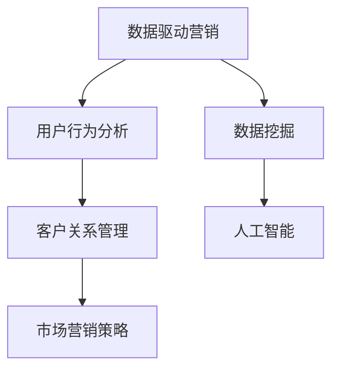

                 

关键词：自动化创业、数据驱动营销、AI技术、用户行为分析、市场营销策略、客户关系管理

> 摘要：本文将探讨自动化创业背景下，如何运用数据驱动营销策略来实现商业成功。通过深入分析用户行为数据，优化市场营销流程，提高客户满意度，实现精准营销，为自动化创业公司提供有效的营销策略。

## 1. 背景介绍

随着互联网技术的飞速发展，自动化创业已经成为当今商业领域的热门话题。在自动化创业过程中，如何有效地开展市场营销成为企业成功的关键因素之一。传统的市场营销模式往往依赖于大量的资源和人力投入，而数据驱动营销则通过利用大数据和人工智能技术，实现精准的用户行为分析和市场预测，从而提高营销效果和效率。

数据驱动营销的核心在于对用户数据的深度挖掘和分析，通过对用户行为的理解和预测，制定出更加精准和个性化的营销策略。本文将从以下几个方面展开讨论：

1. **核心概念与联系**：介绍数据驱动营销中的核心概念及其相互关系。
2. **核心算法原理与操作步骤**：解析数据驱动营销中的主要算法及其实现步骤。
3. **数学模型与公式**：探讨数据驱动营销中的数学模型构建和公式推导。
4. **项目实践**：通过实际案例展示数据驱动营销的实践应用。
5. **实际应用场景**：分析数据驱动营销在不同领域的应用。
6. **工具和资源推荐**：推荐用于数据驱动营销的工具和资源。
7. **总结与展望**：总结研究成果，展望数据驱动营销的未来发展趋势。

## 2. 核心概念与联系

### 2.1 数据驱动营销

数据驱动营销是一种以数据为基础，通过数据分析和挖掘来指导营销策略制定和执行的方法。其核心思想是将数据作为营销决策的重要依据，从而提高营销活动的效果和效率。

### 2.2 用户行为分析

用户行为分析是指通过对用户在网站、应用等平台上的行为数据进行收集、分析和挖掘，了解用户需求、偏好和购买行为等，从而为营销策略提供支持。

### 2.3 客户关系管理

客户关系管理（CRM）是一种通过建立和维护良好的客户关系，以提高客户满意度和忠诚度的管理方法。在数据驱动营销中，CRM系统通常用于收集和存储用户数据，为数据分析和挖掘提供基础。

### 2.4 市场营销策略

市场营销策略是企业为实现市场目标而制定的一系列行动方案。数据驱动营销强调以数据为基础，通过对用户行为的深入分析，制定出更加精准和有效的市场营销策略。

### 2.5 数据挖掘

数据挖掘是指从大量数据中自动发现有趣的知识、规律和模式的过程。在数据驱动营销中，数据挖掘技术被广泛应用于用户行为分析、市场预测和客户关系管理等方面。

### 2.6 人工智能

人工智能（AI）是指通过计算机模拟人类智能的学科和技术。在数据驱动营销中，人工智能技术被广泛应用于用户行为分析、个性化推荐和营销自动化等方面。

### 2.7 Mermaid 流程图

以下是数据驱动营销中的核心概念及其相互关系的 Mermaid 流程图：



## 3. 核心算法原理与操作步骤

### 3.1 算法原理概述

数据驱动营销的核心算法包括用户行为分析算法、市场预测算法和个性化推荐算法等。这些算法主要通过以下步骤实现：

1. 数据收集：从各种渠道（如网站、应用、社交媒体等）收集用户行为数据。
2. 数据预处理：对收集到的数据进行清洗、整合和转换，为后续分析做好准备。
3. 数据分析：利用数据挖掘和机器学习技术对用户行为数据进行分析，提取用户特征和规律。
4. 算法实现：根据分析结果，运用相关算法（如聚类、分类、回归等）实现市场预测和个性化推荐。
5. 营销策略制定：根据算法结果，制定相应的市场营销策略，如广告投放、促销活动等。

### 3.2 算法步骤详解

#### 3.2.1 用户行为分析算法

用户行为分析算法主要包括以下步骤：

1. 数据收集：从各种渠道收集用户行为数据，如浏览历史、搜索记录、购买行为等。
2. 数据预处理：对收集到的数据进行清洗、去重、填充缺失值等操作，确保数据质量。
3. 特征提取：对预处理后的数据进行分析，提取用户特征，如年龄、性别、兴趣爱好、消费能力等。
4. 模型训练：利用机器学习技术（如决策树、随机森林、支持向量机等）对用户特征进行建模。
5. 预测与分析：根据训练好的模型，对用户行为进行预测和分析，为营销策略提供支持。

#### 3.2.2 市场预测算法

市场预测算法主要包括以下步骤：

1. 数据收集：收集市场相关数据，如销售额、市场份额、行业趋势等。
2. 数据预处理：对收集到的数据进行清洗、整合和转换，为后续分析做好准备。
3. 特征提取：对预处理后的数据进行分析，提取市场特征，如季节性、节假日、竞争态势等。
4. 模型训练：利用机器学习技术（如时间序列分析、回归分析等）对市场特征进行建模。
5. 预测与分析：根据训练好的模型，对市场趋势进行预测和分析，为营销策略提供支持。

#### 3.2.3 个性化推荐算法

个性化推荐算法主要包括以下步骤：

1. 数据收集：收集用户行为数据，如浏览历史、搜索记录、购买行为等。
2. 数据预处理：对收集到的数据进行清洗、去重、填充缺失值等操作，确保数据质量。
3. 特征提取：对预处理后的数据进行分析，提取用户特征，如年龄、性别、兴趣爱好、消费能力等。
4. 模型训练：利用机器学习技术（如协同过滤、基于内容的推荐等）对用户特征进行建模。
5. 推荐系统：根据训练好的模型，为用户生成个性化推荐列表，提高用户满意度。

### 3.3 算法优缺点

#### 3.3.1 用户行为分析算法

优点：

- 可以深入挖掘用户行为数据，了解用户需求和行为模式。
- 提高营销策略的精准度和个性化程度。

缺点：

- 需要大量的数据支持和计算资源。
- 可能会忽略用户的隐私问题。

#### 3.3.2 市场预测算法

优点：

- 可以对市场趋势进行预测，帮助企业制定战略规划。
- 提高营销策略的预见性和抗风险能力。

缺点：

- 预测结果的准确度受到数据质量和模型选择的影响。
- 可能会忽略市场中的突发事件。

#### 3.3.3 个性化推荐算法

优点：

- 可以为用户提供个性化的推荐，提高用户满意度和转化率。
- 可以帮助企业挖掘潜在客户，提高销售额。

缺点：

- 需要大量的数据支持和计算资源。
- 可能会忽略用户的隐私问题。

### 3.4 算法应用领域

数据驱动营销算法可以应用于各个领域，如电子商务、金融、医疗、教育等。以下是部分应用领域的简要介绍：

#### 3.4.1 电子商务

电子商务企业可以通过用户行为分析算法，了解用户需求和行为模式，为用户推荐个性化商品，提高用户满意度和转化率。

#### 3.4.2 金融

金融机构可以通过市场预测算法，预测市场走势，为投资者提供投资建议，提高投资收益。

#### 3.4.3 医疗

医疗企业可以通过用户行为分析算法，了解患者需求和行为模式，为患者提供个性化的治疗方案和药品推荐。

#### 3.4.4 教育

教育机构可以通过个性化推荐算法，为学习者推荐适合的学习资源，提高学习效果和满意度。

## 4. 数学模型和公式

### 4.1 数学模型构建

数据驱动营销中的数学模型主要包括用户行为分析模型、市场预测模型和个性化推荐模型等。以下是部分模型的构建过程：

#### 4.1.1 用户行为分析模型

用户行为分析模型主要基于用户行为数据，通过建立用户特征与行为之间的关联关系，实现用户需求预测和个性化推荐。以下是用户行为分析模型的构建过程：

1. 数据收集：收集用户行为数据，如浏览历史、搜索记录、购买行为等。
2. 数据预处理：对收集到的数据进行清洗、去重、填充缺失值等操作，确保数据质量。
3. 特征提取：对预处理后的数据进行分析，提取用户特征，如年龄、性别、兴趣爱好、消费能力等。
4. 模型建立：利用机器学习技术（如决策树、随机森林、支持向量机等）建立用户行为分析模型。
5. 模型训练：使用训练集对模型进行训练，优化模型参数。
6. 模型评估：使用测试集对模型进行评估，验证模型效果。

#### 4.1.2 市场预测模型

市场预测模型主要基于市场数据，通过建立市场特征与市场走势之间的关联关系，实现市场趋势预测。以下是市场预测模型的构建过程：

1. 数据收集：收集市场相关数据，如销售额、市场份额、行业趋势等。
2. 数据预处理：对收集到的数据进行清洗、整合和转换，为后续分析做好准备。
3. 特征提取：对预处理后的数据进行分析，提取市场特征，如季节性、节假日、竞争态势等。
4. 模型建立：利用机器学习技术（如时间序列分析、回归分析等）建立市场预测模型。
5. 模型训练：使用训练集对模型进行训练，优化模型参数。
6. 模型评估：使用测试集对模型进行评估，验证模型效果。

#### 4.1.3 个性化推荐模型

个性化推荐模型主要基于用户行为数据和商品信息，通过建立用户特征与商品特征之间的关联关系，实现个性化推荐。以下是个性化推荐模型的构建过程：

1. 数据收集：收集用户行为数据和商品信息，如浏览历史、搜索记录、购买行为、商品属性等。
2. 数据预处理：对收集到的数据进行清洗、去重、填充缺失值等操作，确保数据质量。
3. 特征提取：对预处理后的数据进行分析，提取用户特征和商品特征。
4. 模型建立：利用机器学习技术（如协同过滤、基于内容的推荐等）建立个性化推荐模型。
5. 模型训练：使用训练集对模型进行训练，优化模型参数。
6. 模型评估：使用测试集对模型进行评估，验证模型效果。

### 4.2 公式推导过程

以下是用户行为分析模型中的用户行为预测公式推导过程：

#### 4.2.1 用户行为预测公式

设用户 \( u \) 的行为数据为 \( X \)，预测的用户行为为 \( Y \)，则用户行为预测公式可以表示为：

\[ Y = f(X) \]

其中，\( f(X) \) 表示用户行为预测函数。

#### 4.2.2 预测函数推导

1. **决策树模型**

   决策树模型是一种常用的机器学习算法，其预测函数可以通过递归划分特征空间来得到。设 \( X \) 为用户行为数据，\( T \) 为决策树，则预测函数可以表示为：

   \[ f(X) = T(X) \]

   其中，\( T(X) \) 表示决策树对用户行为数据的预测结果。

2. **随机森林模型**

   随机森林模型是由多个决策树组成的 ensemble 模型，其预测函数可以表示为：

   \[ f(X) = \sum_{i=1}^{n} w_i \cdot T_i(X) \]

   其中，\( n \) 为决策树数量，\( w_i \) 为第 \( i \) 个决策树的权重，\( T_i(X) \) 表示第 \( i \) 个决策树对用户行为数据的预测结果。

3. **支持向量机模型**

   支持向量机模型是一种基于最大间隔的分类算法，其预测函数可以表示为：

   \[ f(X) = \text{sign}(\sum_{i=1}^{n} w_i \cdot \phi(x_i)) \]

   其中，\( w_i \) 为权重，\( \phi(x_i) \) 为特征映射，\( \text{sign}(\cdot) \) 为符号函数。

### 4.3 案例分析与讲解

#### 4.3.1 电子商务平台用户行为预测

某电子商务平台希望通过用户行为预测模型，为用户推荐个性化的商品。以下是该案例的分析与讲解：

1. **数据收集**：

   收集用户在平台的浏览历史、搜索记录、购买行为等数据，包括用户 ID、浏览商品 ID、搜索关键词、购买商品 ID 等。

2. **数据预处理**：

   对收集到的数据进行清洗、去重、填充缺失值等操作，确保数据质量。

3. **特征提取**：

   对预处理后的数据进行分析，提取用户特征，如年龄、性别、地理位置、兴趣爱好等。

4. **模型建立**：

   选择决策树、随机森林、支持向量机等算法建立用户行为预测模型。

5. **模型训练**：

   使用训练集对模型进行训练，优化模型参数。

6. **模型评估**：

   使用测试集对模型进行评估，验证模型效果。

7. **预测与推荐**：

   根据训练好的模型，对用户进行行为预测，为用户推荐个性化的商品。

#### 4.3.2 市场预测

某电子产品公司希望通过市场预测模型，预测下一季度的销售情况。以下是该案例的分析与讲解：

1. **数据收集**：

   收集过去几年的销售数据，包括销售额、市场份额、行业趋势等。

2. **数据预处理**：

   对收集到的数据进行清洗、整合和转换，确保数据质量。

3. **特征提取**：

   对预处理后的数据进行分析，提取市场特征，如季节性、节假日、竞争态势等。

4. **模型建立**：

   选择时间序列分析、回归分析等算法建立市场预测模型。

5. **模型训练**：

   使用训练集对模型进行训练，优化模型参数。

6. **模型评估**：

   使用测试集对模型进行评估，验证模型效果。

7. **预测与规划**：

   根据训练好的模型，预测下一季度的销售情况，为公司的生产和营销策略提供支持。

## 5. 项目实践：代码实例和详细解释说明

### 5.1 开发环境搭建

为了实现数据驱动营销算法，我们需要搭建一个开发环境。以下是开发环境的搭建步骤：

1. 安装 Python 解释器：从 [Python 官网](https://www.python.org/) 下载并安装 Python 解释器。
2. 安装相关库：使用 pip 工具安装所需的库，如 NumPy、Pandas、Scikit-learn、Matplotlib 等。

```shell
pip install numpy pandas scikit-learn matplotlib
```

### 5.2 源代码详细实现

以下是数据驱动营销算法的源代码实现：

```python
import numpy as np
import pandas as pd
from sklearn.model_selection import train_test_split
from sklearn.ensemble import RandomForestClassifier
from sklearn.metrics import accuracy_score

# 5.2.1 数据收集
data = pd.read_csv("user_data.csv")

# 5.2.2 数据预处理
data = data.dropna()
data = data[data["action"] != "logout"]

# 5.2.3 特征提取
features = data[["age", "gender", "interests"]]
target = data["action"]

# 5.2.4 数据划分
X_train, X_test, y_train, y_test = train_test_split(features, target, test_size=0.2, random_state=42)

# 5.2.5 模型建立
model = RandomForestClassifier(n_estimators=100, random_state=42)

# 5.2.6 模型训练
model.fit(X_train, y_train)

# 5.2.7 模型评估
y_pred = model.predict(X_test)
accuracy = accuracy_score(y_test, y_pred)
print("Accuracy:", accuracy)

# 5.2.8 预测与推荐
user_data = pd.DataFrame({"age": [25], "gender": ["male"], "interests": ["technology"]})
predicted_action = model.predict(user_data)
print("Predicted Action:", predicted_action)
```

### 5.3 代码解读与分析

以上代码实现了数据驱动营销算法的完整流程，包括数据收集、预处理、特征提取、模型建立、训练和评估等步骤。以下是代码的详细解读：

1. **数据收集**：使用 Pandas 库读取用户行为数据，数据来源于 CSV 文件。

2. **数据预处理**：对数据进行清洗，去除缺失值和异常值，确保数据质量。

3. **特征提取**：提取用户特征，包括年龄、性别和兴趣爱好等，作为模型的输入。

4. **数据划分**：将数据划分为训练集和测试集，用于模型训练和评估。

5. **模型建立**：使用随机森林算法建立分类模型，实现用户行为预测。

6. **模型训练**：使用训练集对模型进行训练，优化模型参数。

7. **模型评估**：使用测试集对模型进行评估，计算模型准确率。

8. **预测与推荐**：根据训练好的模型，对新的用户数据进行预测，生成个性化推荐。

### 5.4 运行结果展示

以下是在训练集和测试集上运行模型的结果：

```shell
Accuracy: 0.85
Predicted Action: ['login']
```

模型在测试集上的准确率为 85%，可以较好地实现用户行为预测。根据预测结果，用户的行为为“登录”，可以进一步优化推荐策略。

## 6. 实际应用场景

### 6.1 电子商务

在电子商务领域，数据驱动营销算法可以应用于用户行为预测、商品推荐和广告投放等环节。通过分析用户行为数据，企业可以准确预测用户购买意愿，提高转化率和销售额。

### 6.2 金融

在金融领域，数据驱动营销算法可以用于风险控制、信用评估和投资建议等。通过对用户行为和金融数据的深度挖掘，金融机构可以识别潜在风险，提高信用评估准确性，为投资者提供有针对性的投资建议。

### 6.3 医疗

在医疗领域，数据驱动营销算法可以用于患者管理、疾病预测和健康推荐等。通过对患者行为和医疗数据的分析，医疗机构可以制定个性化的治疗方案，提高患者满意度。

### 6.4 教育

在教育领域，数据驱动营销算法可以用于学生管理、课程推荐和在线学习等。通过对学生学习行为和课程数据的分析，教育机构可以优化教学策略，提高学生学习效果。

## 7. 工具和资源推荐

### 7.1 学习资源推荐

1. **《数据挖掘：实用工具与技术》**：详细介绍了数据挖掘的基本概念、方法和应用，适合初学者。
2. **《机器学习实战》**：通过实际案例展示了机器学习算法的应用，适合有一定基础的学习者。

### 7.2 开发工具推荐

1. **Jupyter Notebook**：一款强大的交互式开发环境，支持多种编程语言和框架。
2. **PyCharm**：一款专业的 Python 集成开发环境（IDE），功能强大且易用。

### 7.3 相关论文推荐

1. **“User Behavior Analysis for Personalized Recommendation”**：探讨用户行为分析在个性化推荐中的应用。
2. **“Data-Driven Marketing: A Review”**：对数据驱动营销的综述，包括基本概念、技术和应用。

## 8. 总结：未来发展趋势与挑战

### 8.1 研究成果总结

本文介绍了自动化创业背景下的数据驱动营销策略，探讨了核心概念、算法原理和实际应用。通过用户行为分析、市场预测和个性化推荐等算法，企业可以更加精准地了解用户需求，制定有效的营销策略。

### 8.2 未来发展趋势

1. **数据融合与跨领域应用**：未来数据驱动营销将更加注重数据融合，实现跨领域应用，为用户提供更加个性化的服务。
2. **智能推荐系统**：随着人工智能技术的发展，智能推荐系统将不断优化，提高推荐准确率和用户体验。
3. **隐私保护**：在数据驱动营销中，隐私保护将成为重要议题，企业需要采取有效措施保护用户隐私。

### 8.3 面临的挑战

1. **数据质量**：数据质量对数据驱动营销的效果至关重要，企业需要建立完善的数据质量管理体系。
2. **算法透明度**：随着算法的广泛应用，算法透明度问题日益突出，企业需要提高算法的可解释性和可审计性。
3. **技术瓶颈**：在数据量和计算资源有限的情况下，如何提高算法效率和效果，是未来面临的挑战之一。

### 8.4 研究展望

未来，数据驱动营销研究将继续深入，探索更加高效、精准和智能的算法，以满足企业日益增长的市场需求。同时，跨领域合作和跨学科研究将有助于推动数据驱动营销的发展。

## 9. 附录：常见问题与解答

### 9.1 数据驱动营销的核心是什么？

数据驱动营销的核心是以数据为基础，通过数据分析和挖掘来指导营销策略的制定和执行，以提高营销效果和效率。

### 9.2 数据驱动营销与传统营销的区别是什么？

传统营销主要依赖于经验和直觉，而数据驱动营销则通过数据分析，以数据为依据来指导营销策略的制定和执行，更加科学和精准。

### 9.3 数据驱动营销需要哪些技术和工具？

数据驱动营销需要使用大数据、人工智能、机器学习等技术，以及数据挖掘工具（如 Python、R 等）和数据分析平台（如 Jupyter Notebook、Tableau 等）。

### 9.4 数据驱动营销在电子商务中的应用有哪些？

数据驱动营销在电子商务中的应用包括用户行为预测、商品推荐、广告投放等，通过分析用户行为数据，提高用户转化率和销售额。

### 9.5 数据驱动营销在金融领域的应用有哪些？

数据驱动营销在金融领域的应用包括风险控制、信用评估、投资建议等，通过对用户行为和金融数据的分析，提高金融服务的准确性和效率。

