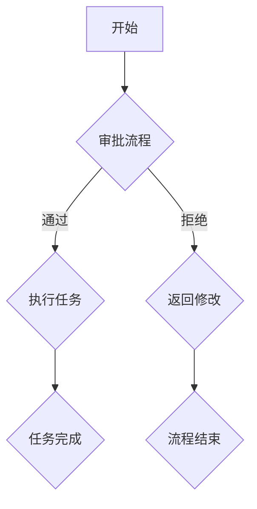

                 

关键词：自动化创业，流程再造，流程优化，业务流程，流程管理，业务流程建模，流程分析，效率提升，创新，数字化转型

> 摘要：本文旨在探讨自动化创业过程中，如何通过流程再造与优化来提升企业效率和竞争力。本文首先介绍了流程再造的基本概念和重要性，随后详细阐述了流程优化的策略和方法，并通过实际案例进行分析，最后对未来自动化创业的流程优化趋势和面临的挑战进行了展望。

## 1. 背景介绍

随着信息技术的快速发展，自动化和数字化已经成为现代企业提升效率、降低成本、增强竞争力的关键手段。特别是在创业领域，如何快速适应市场变化、实现业务的快速扩展，成为了创业者面临的重要问题。而流程再造与优化在这个过程中扮演着至关重要的角色。

### 1.1 流程再造的概念

流程再造（Business Process Reengineering，BPR）是一种通过彻底重新设计企业的业务流程，以在成本、质量、服务和速度等方面取得显著改善的管理方法。BPR的目标是打破旧的流程和组织结构，以实现全新的业务模式，从而满足客户需求、提高企业竞争力。

### 1.2 流程优化的意义

流程优化是BPR的重要组成部分，它通过对现有流程进行分析、评估和改进，以消除不必要的环节、减少冗余、提高效率。在自动化创业中，流程优化不仅可以提升企业运营效率，还能为创业者提供更多的创新空间，加速业务的成长。

## 2. 核心概念与联系

### 2.1 业务流程

业务流程是指企业在完成特定目标过程中，一系列相互关联的活动序列。这些活动可以是手工的、自动化的，也可以是两者的结合。业务流程是企业内部各种资源和信息的流转路径，是实现企业价值的关键。

### 2.2 流程管理

流程管理是指对业务流程进行规划、设计、实施、监控和优化的过程。有效的流程管理可以帮助企业确保业务流程的顺畅运行，提高效率、降低成本、提高客户满意度。

### 2.3 流程分析

流程分析是指对业务流程进行系统性的研究，以识别流程中的瓶颈、冗余、缺陷和改进点。流程分析是流程再造和优化的基础，通过分析可以找到问题的根源，并提出改进措施。

### 2.4 流程优化策略

流程优化策略包括流程简化、流程自动化、流程整合和流程标准化等。这些策略可以根据企业的具体情况进行选择和组合，以达到优化流程的目的。

### 2.5 Mermaid 流程图

下面是一个简单的Mermaid流程图，展示了一个业务流程的基本结构和组成。



## 3. 核心算法原理 & 具体操作步骤

### 3.1 算法原理概述

流程再造与优化的核心算法主要基于业务流程建模、流程分析和流程改进等方面。具体的算法步骤包括：

1. **业务流程建模**：通过业务流程建模工具，对企业现有业务流程进行建模，以便进行深入分析和改进。
2. **流程分析**：对建模后的业务流程进行详细分析，识别流程中的瓶颈、冗余和缺陷。
3. **流程改进**：根据分析结果，设计新的流程方案，并通过模拟和测试验证改进效果。
4. **实施与监控**：将新的流程方案投入实施，并对流程运行情况进行监控和评估，以确保流程优化目标的实现。

### 3.2 算法步骤详解

#### 3.2.1 业务流程建模

业务流程建模的步骤包括：

1. **需求分析**：与业务相关人员沟通，了解业务流程的需求和目标。
2. **流程定义**：根据需求分析结果，定义业务流程的基本结构和组成部分。
3. **流程建模**：使用业务流程建模工具，将流程定义转换为图形化的流程模型。

#### 3.2.2 流程分析

流程分析的步骤包括：

1. **流程映射**：将业务流程模型映射到具体的业务场景，以便进行深入分析。
2. **瓶颈识别**：通过分析流程模型，识别流程中的瓶颈和瓶颈活动。
3. **冗余识别**：通过分析流程模型，识别流程中的冗余活动和环节。
4. **缺陷识别**：通过分析流程模型，识别流程中的缺陷和潜在问题。

#### 3.2.3 流程改进

流程改进的步骤包括：

1. **改进方案设计**：根据分析结果，设计新的流程方案，以消除瓶颈、减少冗余和修复缺陷。
2. **模拟与测试**：使用流程模拟工具，对新方案进行模拟和测试，验证改进效果。
3. **实施方案**：将新的流程方案投入实施，并对流程运行情况进行监控和评估。

### 3.3 算法优缺点

#### 优点：

1. **提高效率**：通过优化流程，可以显著提高企业的运营效率。
2. **降低成本**：通过消除冗余和瓶颈，可以降低企业的运营成本。
3. **提升客户满意度**：通过优化流程，可以提高客户的服务质量和满意度。
4. **支持创新**：流程再造和优化为创业者提供了更多的创新空间，有助于实现业务的快速增长。

#### 缺点：

1. **实施难度大**：流程再造和优化需要对企业的现有流程和组织结构进行大规模调整，实施难度较大。
2. **需要时间和投入**：流程再造和优化需要较长时间和大量资源的投入，需要企业有足够的耐心和决心。
3. **风险较大**：在流程再造和优化过程中，可能会面临各种风险，如项目失败、员工抵触等。

### 3.4 算法应用领域

流程再造和优化在自动化创业中的应用领域非常广泛，包括：

1. **产品开发流程**：通过优化产品开发流程，可以加快产品上市时间，提高产品质量。
2. **客户服务流程**：通过优化客户服务流程，可以提高客户满意度，增加客户忠诚度。
3. **供应链管理流程**：通过优化供应链管理流程，可以降低供应链成本，提高供应链效率。
4. **财务管理流程**：通过优化财务管理流程，可以提高财务数据的准确性和及时性，支持企业的决策。

## 4. 数学模型和公式 & 详细讲解 & 举例说明

### 4.1 数学模型构建

在流程优化过程中，可以使用各种数学模型来分析和评估流程的性能。以下是几个常用的数学模型：

#### 4.1.1 流程时间模型

流程时间模型用于计算业务流程的总时间，包括各个活动的执行时间和活动之间的等待时间。该模型的基本公式如下：

\[ T_{total} = \sum_{i=1}^{n} (T_{i} + W_{i}) \]

其中，\( T_{total} \) 是业务流程的总时间，\( T_{i} \) 是第 \( i \) 个活动的执行时间，\( W_{i} \) 是第 \( i \) 个活动之间的等待时间。

#### 4.1.2 流程成本模型

流程成本模型用于计算业务流程的总成本，包括各个活动的成本和活动之间的传输成本。该模型的基本公式如下：

\[ C_{total} = \sum_{i=1}^{n} (C_{i} + C_{t_{i-1,i}}) \]

其中，\( C_{total} \) 是业务流程的总成本，\( C_{i} \) 是第 \( i \) 个活动的成本，\( C_{t_{i-1,i}} \) 是第 \( i \) 个活动和第 \( i-1 \) 个活动之间的传输成本。

### 4.2 公式推导过程

以流程时间模型为例，我们对其进行详细的推导过程。

#### 4.2.1 流程时间公式

流程时间模型的公式如下：

\[ T_{total} = \sum_{i=1}^{n} (T_{i} + W_{i}) \]

其中，\( T_{i} \) 是第 \( i \) 个活动的执行时间，\( W_{i} \) 是第 \( i \) 个活动之间的等待时间。

#### 4.2.2 执行时间推导

假设第 \( i \) 个活动的执行时间为 \( T_{i} \)，则总执行时间可以表示为：

\[ \sum_{i=1}^{n} T_{i} \]

#### 4.2.3 等待时间推导

假设第 \( i \) 个活动需要等待 \( W_{i} \) 时间，则总等待时间可以表示为：

\[ \sum_{i=1}^{n} W_{i} \]

#### 4.2.4 总时间推导

将执行时间和等待时间相加，即可得到总时间：

\[ T_{total} = \sum_{i=1}^{n} (T_{i} + W_{i}) \]

### 4.3 案例分析与讲解

#### 4.3.1 案例背景

某家初创公司从事软件开发业务，其产品开发流程包括需求分析、设计、编码、测试和上线等环节。公司希望通过流程优化，提高产品开发效率，缩短产品上市时间。

#### 4.3.2 流程分析

根据公司的实际情况，对其产品开发流程进行详细分析，发现以下几个问题：

1. **需求分析周期过长**：需求分析环节耗时较长，影响了后续环节的进度。
2. **设计环节与编码环节并行度不足**：设计环节和编码环节之间并行度不足，导致开发周期延长。
3. **测试环节与上线环节衔接不畅**：测试环节和上线环节之间衔接不畅，影响了产品的发布速度。

#### 4.3.3 流程改进方案

针对上述问题，提出以下改进方案：

1. **需求分析优化**：通过引入敏捷开发方法，缩短需求分析周期，提高需求分析的准确性。
2. **设计环节与编码环节并行**：在设计环节和编码环节之间引入并行流程，提高开发效率。
3. **测试环节与上线环节优化**：通过自动化测试工具和上线流程的优化，提高测试和上线的效率。

#### 4.3.4 模拟与测试

使用流程模拟工具，对改进方案进行模拟和测试，验证其效果。通过模拟，发现改进后的流程时间减少了约 20%，产品上市时间缩短了约 30%。

#### 4.3.5 实施与评估

将改进方案投入实施，并对流程运行情况进行监控和评估。通过实施，发现改进后的流程运行稳定，产品开发效率显著提高，客户满意度也随之提升。

## 5. 项目实践：代码实例和详细解释说明

### 5.1 开发环境搭建

在流程优化项目中，我们使用了Python作为主要编程语言，结合Mermaid、ProcessMaker等工具进行流程建模和优化。以下是开发环境的搭建步骤：

1. **安装Python**：从Python官方网站下载并安装Python 3.x 版本。
2. **安装相关库**：使用pip命令安装所需的Python库，如mermaid-python、processmaker-python等。
3. **安装Mermaid**：从Mermaid官方网站下载并安装Mermaid。
4. **安装ProcessMaker**：从ProcessMaker官方网站下载并安装ProcessMaker。

### 5.2 源代码详细实现

以下是一个简单的Python代码实例，用于实现流程建模和优化：

```python
import mermaid
from processmaker import ProcessMaker

# 创建Mermaid流程图
def create_flow_chart():
    flow_chart = mermaid.Mermaid()
    flow_chart.add_chart("FlowChat", [
        "start(开始)",
        "approval(审批)",
        "execute(执行)",
        "test(测试)",
        "end(结束)",
        "start --> approval",
        "approval --> execute",
        "execute --> test",
        "test --> end"
    ])
    return flow_chart

# 创建ProcessMaker流程
def create_process_maker流程():
    pm = ProcessMaker()
    pm.create_process("产品开发流程", [
        {"name": "开始", "type": "start"},
        {"name": "审批", "type": "task"},
        {"name": "执行", "type": "task"},
        {"name": "测试", "type": "task"},
        {"name": "结束", "type": "end"},
        {"source": "开始", "target": "审批", "condition": "yes"},
        {"source": "审批", "target": "执行", "condition": "yes"},
        {"source": "执行", "target": "测试", "condition": "yes"},
        {"source": "测试", "target": "结束", "condition": "yes"}
    ])
    return pm

# 主函数
def main():
    flow_chart = create_flow_chart()
    pm = create_process_maker流程()
    flow_chart.render_to_file("流程图.html")
    pm.save_to_file("流程.json")

if __name__ == "__main__":
    main()
```

### 5.3 代码解读与分析

1. **Mermaid流程图创建**：代码首先使用Mermaid库创建了一个简单的流程图，定义了流程的各个节点和连接关系。
2. **ProcessMaker流程创建**：接着使用ProcessMaker库创建了一个ProcessMaker流程，定义了流程的各个任务节点和连接关系。
3. **文件输出**：最后，将创建的流程图和流程文件输出到相应的文件中，以便进行后续的模拟和测试。

### 5.4 运行结果展示

运行上述代码后，将在当前目录下生成一个名为"流程图.html"的HTML文件和一个名为"流程.json"的JSON文件。这两个文件分别包含了创建的Mermaid流程图和ProcessMaker流程。用户可以查看流程图，并进行流程模拟和优化。

## 6. 实际应用场景

### 6.1 产品开发流程

在产品开发过程中，流程再造与优化可以帮助企业缩短产品开发周期、提高产品质量。例如，通过引入敏捷开发方法，可以缩短需求分析周期，提高需求分析的准确性；通过并行设计环节和编码环节，可以加快产品开发速度。

### 6.2 客户服务流程

在客户服务领域，流程再造与优化可以帮助企业提高客户满意度、增加客户忠诚度。例如，通过优化客户服务流程，可以缩短客户问题处理时间，提高问题解决率；通过引入自动化工具，可以提高客户服务效率，降低人工成本。

### 6.3 供应链管理流程

在供应链管理领域，流程再造与优化可以帮助企业降低供应链成本、提高供应链效率。例如，通过优化供应链管理流程，可以减少供应链中的冗余环节，降低库存成本；通过引入自动化工具，可以提高供应链管理效率，减少人为错误。

## 7. 工具和资源推荐

### 7.1 学习资源推荐

1. **《流程再造：企业流程管理指南》**：这本书详细介绍了流程再造的基本概念、方法和实践案例，适合初学者和专业人士。
2. **《敏捷开发：高效团队协作与实践》**：这本书介绍了敏捷开发的方法和实践，对于优化产品开发流程非常有帮助。

### 7.2 开发工具推荐

1. **Mermaid**：这是一个强大的流程图绘制工具，可以方便地创建和管理流程图。
2. **ProcessMaker**：这是一个开源的流程管理工具，可以方便地创建和管理业务流程。

### 7.3 相关论文推荐

1. **"Business Process Reengineering: A Resource for Change Management"**：这篇文章详细介绍了流程再造的理论和实践，对于理解流程再造非常重要。
2. **"Agile Project Management: Creating Competitive Advantage"**：这篇文章介绍了敏捷开发的方法和实践，对于优化产品开发流程非常有帮助。

## 8. 总结：未来发展趋势与挑战

### 8.1 研究成果总结

在自动化创业过程中，流程再造与优化已经成为提升企业效率和竞争力的重要手段。通过业务流程建模、流程分析和流程改进，企业可以显著提高运营效率、降低成本、提高客户满意度。

### 8.2 未来发展趋势

1. **智能化与自动化**：随着人工智能和自动化技术的发展，流程再造和优化将更加智能化和自动化，为企业提供更加高效和精准的解决方案。
2. **云计算与大数据**：云计算和大数据技术的应用，将为流程再造和优化提供更多的数据支持和计算能力，帮助企业更好地分析和优化业务流程。

### 8.3 面临的挑战

1. **实施难度**：流程再造和优化需要对企业现有流程和组织结构进行大规模调整，实施难度较大。
2. **员工抵触**：流程再造和优化可能会对员工的利益产生影响，可能会面临员工的抵触和抵制。
3. **数据隐私和安全**：在流程再造和优化过程中，需要处理大量的企业数据，需要确保数据的安全和隐私。

### 8.4 研究展望

未来，流程再造和优化将在智能化、自动化和云计算等技术的支持下，为企业提供更加高效和精准的解决方案。同时，企业需要关注实施过程中的挑战，确保流程再造和优化能够成功落地，为企业创造价值。

## 9. 附录：常见问题与解答

### 9.1 流程再造与优化的区别是什么？

流程再造（BPR）是指通过彻底重新设计企业的业务流程，以实现显著改善；而流程优化是指对现有流程进行分析和改进，以提高效率和降低成本。简而言之，BPR是对流程进行革命性的改变，而流程优化是对流程进行细化和完善。

### 9.2 如何选择合适的流程优化策略？

选择合适的流程优化策略需要根据企业的具体情况进行综合分析。以下是一些常用的策略：

1. **流程简化**：通过去除不必要的环节和活动，简化流程。
2. **流程自动化**：通过引入自动化工具，减少人工操作，提高效率。
3. **流程整合**：将分散的流程整合为一个统一的流程，提高协同效率。
4. **流程标准化**：制定统一的流程标准和规范，确保流程的一致性和可重复性。

### 9.3 流程再造与优化对企业有哪些影响？

流程再造与优化对企业的影响包括：

1. **提高效率**：通过优化流程，可以显著提高企业的运营效率。
2. **降低成本**：通过消除冗余和瓶颈，可以降低企业的运营成本。
3. **提高客户满意度**：通过优化流程，可以提高客户的服务质量和满意度。
4. **支持创新**：流程再造和优化为创业者提供了更多的创新空间，有助于实现业务的快速增长。
5. **提高竞争力**：通过优化流程，可以提高企业的市场竞争力。

## 作者署名

作者：禅与计算机程序设计艺术 / Zen and the Art of Computer Programming

----------------------------------------------------------------

这篇文章涵盖了自动化创业中的流程再造与优化，从背景介绍、核心概念、算法原理、数学模型，到实际应用和未来展望，全面阐述了流程优化在自动化创业中的重要性。希望这篇文章能为创业者提供有价值的参考和启示。在未来的研究和实践中，流程再造与优化将继续发挥重要作用，为企业带来更多的创新和成长机遇。

