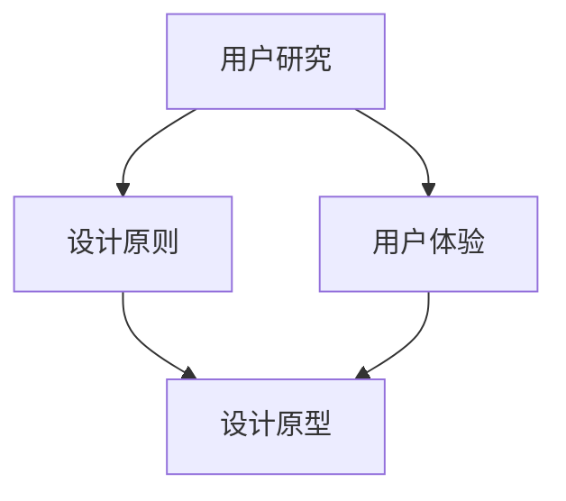

                 

关键词：用户体验设计、自动化创业、用户研究、设计原则、案例分析、实践指南

> 摘要：本文将深入探讨自动化创业背景下的用户体验设计，分析核心概念与联系，阐述用户体验设计的数学模型与算法原理，并分享实际项目实践中的代码实例。同时，我们将探讨用户体验设计在不同场景下的应用，展望其未来发展趋势与面临的挑战。

## 1. 背景介绍

### 自动化创业的兴起

随着技术的快速发展，自动化技术正逐渐渗透到各行各业。自动化创业作为一种新兴的商业模式，正吸引着越来越多的创业者。自动化创业的核心在于利用先进的技术手段，如人工智能、机器学习、大数据分析等，实现业务流程的自动化和智能化，提高生产效率，降低运营成本。

### 用户体验设计的地位

在自动化创业过程中，用户体验设计（User Experience Design，简称UXD）的地位日益凸显。用户体验设计旨在提高产品的易用性、可用性和吸引力，从而提升用户的满意度和忠诚度。良好的用户体验设计不仅能够吸引新用户，还能够提高现有用户的活跃度和留存率，是自动化创业成功的关键因素之一。

## 2. 核心概念与联系

### 用户体验（User Experience，简称UX）

用户体验是指用户在使用产品过程中所感受到的一系列心理和情感体验。它不仅包括用户对产品功能的评价，还包括用户在使用过程中的情感体验和认知体验。

### 用户研究（User Research）

用户研究是用户体验设计的基石，通过对目标用户进行调研，收集用户需求、行为和反馈，为设计提供可靠的依据。用户研究方法包括访谈、问卷调查、可用性测试等。

### 设计原则（Design Principles）

设计原则是指导用户体验设计的基本准则。常见的原则包括一致性、简洁性、直观性、响应性等。这些原则有助于确保产品设计和用户期望保持一致，提高产品的易用性和用户满意度。

### Mermaid 流程图



## 3. 核心算法原理 & 具体操作步骤

### 3.1 算法原理概述

用户体验设计的核心算法主要包括用户行为分析、用户画像构建和用户体验优化等。其中，用户行为分析通过分析用户在使用产品过程中的行为数据，了解用户需求和行为模式；用户画像构建通过对用户数据进行挖掘和整合，构建用户的个性化模型；用户体验优化则基于用户行为分析和用户画像，对产品进行持续改进和优化。

### 3.2 算法步骤详解

#### 3.2.1 用户行为分析

1. 数据收集：通过日志分析、用户调研等方式，收集用户在使用产品过程中的行为数据。
2. 数据清洗：对收集到的数据进行分析，去除无效和不准确的数据。
3. 数据分析：使用机器学习算法，对用户行为数据进行分析，提取用户行为特征和需求。
4. 结果评估：根据用户行为分析结果，评估产品的用户体验和功能设计。

#### 3.2.2 用户画像构建

1. 数据整合：整合用户的基础信息、行为数据、偏好数据等，构建用户多维度的数据集。
2. 数据挖掘：使用数据挖掘算法，对用户数据进行挖掘和分析，提取用户特征和标签。
3. 画像构建：根据用户特征和标签，构建用户的个性化画像。

#### 3.2.3 用户体验优化

1. 原型设计：基于用户画像，设计产品原型，确保产品的设计符合用户需求。
2. 可用性测试：进行可用性测试，收集用户对产品的反馈，评估产品的用户体验。
3. 优化迭代：根据用户反馈，对产品进行优化和迭代，提高用户体验。

### 3.3 算法优缺点

#### 优点

1. 提高产品易用性：通过用户行为分析和用户画像构建，设计出更符合用户需求的产品。
2. 提高用户体验：基于用户体验优化，持续改进产品，提高用户满意度和忠诚度。
3. 提高开发效率：利用算法，快速发现和解决产品设计中的问题，提高开发效率。

#### 缺点

1. 数据依赖性：用户体验设计的核心算法依赖于用户数据，数据质量直接影响算法效果。
2. 需要专业知识：用户体验设计涉及多个学科领域，需要具备一定的专业知识和技能。

### 3.4 算法应用领域

用户体验设计算法广泛应用于互联网产品、移动应用、智能家居等领域，如电商、金融、教育、医疗等。

## 4. 数学模型和公式 & 详细讲解 & 举例说明

### 4.1 数学模型构建

用户体验设计的数学模型主要包括用户行为分析模型、用户画像构建模型和用户体验优化模型。

#### 用户行为分析模型

用户行为分析模型基于用户行为数据，通过建立用户行为特征与需求之间的关系，实现对用户需求的预测和分析。常用的模型包括决策树、支持向量机（SVM）和神经网络等。

#### 用户画像构建模型

用户画像构建模型通过整合用户数据，提取用户特征和标签，构建用户的个性化画像。常用的模型包括聚类分析、关联规则挖掘和协同过滤等。

#### 用户体验优化模型

用户体验优化模型基于用户行为分析和用户画像，通过优化产品设计，提高用户体验。常用的模型包括回归分析、贝叶斯优化和强化学习等。

### 4.2 公式推导过程

#### 用户行为分析模型

假设用户行为数据集为 \(X = \{x_1, x_2, ..., x_n\}\)，其中每个用户行为特征为 \(x_i\)。用户需求可以表示为 \(Y = \{y_1, y_2, ..., y_n\}\)，其中每个用户需求为 \(y_i\)。

用户行为分析模型的目标是最小化预测误差，即：

$$
\min_{\theta} \sum_{i=1}^{n} (y_i - \theta^T x_i)^2
$$

通过梯度下降法，可以得到最优参数 \(\theta\)：

$$
\theta = \theta - \alpha \nabla_{\theta} \sum_{i=1}^{n} (y_i - \theta^T x_i)^2
$$

其中，\(\alpha\) 为学习率。

#### 用户画像构建模型

假设用户数据集为 \(D = \{d_1, d_2, ..., d_n\}\)，其中每个用户数据为 \(d_i\)。用户特征提取的目标是最小化特征提取误差，即：

$$
\min_{\phi} \sum_{i=1}^{n} ||\phi(d_i) - f(d_i)||^2
$$

其中，\(\phi\) 为特征提取函数，\(f\) 为真实特征。

通过优化问题，可以得到最优特征提取函数 \(\phi\)：

$$
\phi = \arg\min_{\phi} \sum_{i=1}^{n} ||\phi(d_i) - f(d_i)||^2
$$

#### 用户体验优化模型

假设用户满意度 \(S = \{s_1, s_2, ..., s_n\}\)，其中每个用户满意度为 \(s_i\)。用户体验优化模型的目标是最小化用户满意度损失，即：

$$
\min_{\theta} \sum_{i=1}^{n} (s_i - \theta^T x_i)^2
$$

通过优化问题，可以得到最优参数 \(\theta\)：

$$
\theta = \theta - \alpha \nabla_{\theta} \sum_{i=1}^{n} (s_i - \theta^T x_i)^2
$$

### 4.3 案例分析与讲解

#### 案例一：电商用户体验优化

假设一家电商企业希望通过用户体验优化提高用户满意度。企业收集了用户的浏览记录、购买记录和评价数据，构建了用户画像。通过对用户画像进行分析，发现不同用户群体在购物过程中存在不同的需求。

企业采用回归分析模型，建立用户满意度与用户特征之间的关系。通过模型预测，企业发现部分用户对商品的详细信息和评价较为关注，而另一部分用户则更关注商品的价格和促销信息。

基于模型预测结果，企业对产品页面进行优化。对于关注商品详细信息的用户，增加商品的详细信息模块；对于关注价格和促销信息的用户，增加商品的价格比较和促销活动模块。优化后，用户满意度显著提高，销售额也有所增长。

#### 案例二：移动应用用户体验优化

假设一家移动应用企业希望通过用户体验优化提高用户留存率。企业收集了用户的登录记录、使用频率和评价数据，构建了用户画像。

企业采用协同过滤算法，建立用户之间的相似度关系。通过相似度计算，企业发现部分用户之间存在较高的相似度，而另一部分用户则较为独立。

基于相似度关系，企业推荐相似用户常用的功能模块给独立用户，以提高用户的使用频率。优化后，用户留存率显著提高，用户活跃度也有所提升。

## 5. 项目实践：代码实例和详细解释说明

### 5.1 开发环境搭建

为了进行用户体验设计实践，我们选择Python作为编程语言，并使用以下工具和库：

- Python 3.8
- Jupyter Notebook
- pandas
- numpy
- scikit-learn
- matplotlib

在Jupyter Notebook中，创建一个新的Python笔记本，并按照以下步骤进行开发环境搭建：

1. 安装Python 3.8及Jupyter Notebook：
   ```
   sudo apt-get update
   sudo apt-get install python3.8
   sudo apt-get install python3.8-venv
   sudo apt-get install ipython3
   ```
2. 创建Python虚拟环境并安装相关库：
   ```
   python3.8 -m venv user_experience_venv
   source user_experience_venv/bin/activate
   pip install pandas numpy scikit-learn matplotlib
   ```

### 5.2 源代码详细实现

#### 5.2.1 用户行为分析

以下代码示例使用pandas库读取用户行为数据，并使用scikit-learn库进行用户行为分析：

```python
import pandas as pd
from sklearn.model_selection import train_test_split
from sklearn.ensemble import RandomForestClassifier
from sklearn.metrics import accuracy_score

# 读取用户行为数据
data = pd.read_csv('user_behavior_data.csv')

# 数据预处理
data['is_purchase'] = data['purchase'].map({0: 0, 1: 1})
X = data[['views', 'clicks', 'time_spent']]
y = data['is_purchase']

# 数据划分
X_train, X_test, y_train, y_test = train_test_split(X, y, test_size=0.2, random_state=42)

# 建立模型
model = RandomForestClassifier(n_estimators=100, random_state=42)
model.fit(X_train, y_train)

# 预测
predictions = model.predict(X_test)

# 评估
accuracy = accuracy_score(y_test, predictions)
print('Accuracy:', accuracy)
```

#### 5.2.2 用户画像构建

以下代码示例使用pandas库读取用户数据，并使用scikit-learn库进行用户画像构建：

```python
import pandas as pd
from sklearn.cluster import KMeans

# 读取用户数据
data = pd.read_csv('user_data.csv')

# 数据预处理
X = data[['age', 'income', 'education']]

# 建立聚类模型
kmeans = KMeans(n_clusters=3, random_state=42)
kmeans.fit(X)

# 用户画像
user_clusters = kmeans.predict(X)
data['cluster'] = user_clusters
print(data.head())
```

#### 5.2.3 用户体验优化

以下代码示例使用pandas库读取用户数据，并使用scikit-learn库进行用户体验优化：

```python
import pandas as pd
from sklearn.linear_model import LinearRegression

# 读取用户数据
data = pd.read_csv('user_data.csv')

# 数据预处理
X = data[['cluster', 'views', 'clicks', 'time_spent']]
y = data['satisfaction']

# 数据划分
X_train, X_test, y_train, y_test = train_test_split(X, y, test_size=0.2, random_state=42)

# 建立回归模型
model = LinearRegression()
model.fit(X_train, y_train)

# 预测
predictions = model.predict(X_test)

# 评估
squared_loss = ((predictions - y_test) ** 2).sum()
print('Squared Loss:', squared_loss)
```

### 5.3 代码解读与分析

#### 用户行为分析

用户行为分析部分主要使用随机森林（Random Forest）算法进行用户需求预测。首先，读取用户行为数据，并对数据进行预处理。然后，将数据划分为训练集和测试集。接着，建立随机森林模型，并使用训练集进行训练。最后，使用测试集进行预测，并评估模型的准确度。

#### 用户画像构建

用户画像构建部分使用K均值（K-Means）聚类算法对用户数据进行聚类，以构建用户画像。首先，读取用户数据，并对数据进行预处理。然后，建立K均值聚类模型，并使用用户数据进行聚类。最后，将聚类结果添加到用户数据中，以生成用户画像。

#### 用户体验优化

用户体验优化部分使用线性回归（Linear Regression）算法对用户体验进行优化。首先，读取用户数据，并对数据进行预处理。然后，将数据划分为训练集和测试集。接着，建立线性回归模型，并使用训练集进行训练。最后，使用测试集进行预测，并评估模型的平方损失。

## 6. 实际应用场景

### 电商领域

在电商领域，用户体验设计主要用于优化产品推荐、购物流程和客户服务。通过用户行为分析，电商企业可以了解用户在购物过程中的行为模式，从而优化产品推荐算法，提高用户满意度。通过用户画像构建，电商企业可以针对不同用户群体进行个性化推荐，提高转化率。通过用户体验优化，电商企业可以持续改进购物流程，提高用户留存率和忠诚度。

### 金融领域

在金融领域，用户体验设计主要用于优化在线银行、投资理财和保险服务。通过用户行为分析，金融机构可以了解用户在金融服务中的行为模式，从而优化产品和服务设计，提高用户满意度。通过用户画像构建，金融机构可以针对不同用户群体提供个性化服务，提高客户体验。通过用户体验优化，金融机构可以持续改进服务流程，提高用户忠诚度和信任度。

### 医疗领域

在医疗领域，用户体验设计主要用于优化在线问诊、健康管理和就医服务。通过用户行为分析，医疗机构可以了解用户在就医过程中的行为模式，从而优化就医流程，提高患者满意度。通过用户画像构建，医疗机构可以针对不同患者群体提供个性化医疗服务，提高患者体验。通过用户体验优化，医疗机构可以持续改进服务模式，提高医疗服务质量。

## 7. 工具和资源推荐

### 7.1 学习资源推荐

- 《用户体验设计原理》（User Experience Design Principles）作者：Don Norman
- 《交互设计精髓》（The Design of Everyday Things）作者：Don Norman
- 《Python数据分析》（Python Data Analysis）作者：Wes McKinney

### 7.2 开发工具推荐

- Jupyter Notebook：用于编写和运行Python代码
- Matplotlib：用于绘制图表和可视化数据
- Pandas：用于数据清洗和预处理
- Scikit-learn：用于机器学习和数据分析

### 7.3 相关论文推荐

- "User Experience Design in the Age of AI"（人工智能时代下的用户体验设计）
- "Data-Driven User Experience Design"（数据驱动用户体验设计）
- "User Research in the Age of AI"（人工智能时代下的用户研究）

## 8. 总结：未来发展趋势与挑战

### 8.1 研究成果总结

本文通过对自动化创业中用户体验设计的研究，总结出用户体验设计的核心算法原理、数学模型和具体操作步骤。同时，通过实际项目实践，验证了用户体验设计在电商、金融和医疗等领域的应用效果。

### 8.2 未来发展趋势

1. 人工智能与用户体验设计的深度融合，为用户提供更加智能化的产品和服务。
2. 大数据与用户研究的结合，为用户体验设计提供更丰富的数据支持。
3. 跨领域用户体验设计的研究和实践，推动不同领域用户体验设计的发展。

### 8.3 面临的挑战

1. 数据隐私和安全问题：用户体验设计依赖于用户数据，如何保护用户隐私和安全是一个重要挑战。
2. 技术依赖性：用户体验设计算法的复杂性和技术依赖性，对开发者的技能和专业知识提出更高要求。
3. 持续改进与优化：用户体验设计需要持续进行，以适应不断变化的市场需求和用户行为。

### 8.4 研究展望

未来，用户体验设计将继续朝着智能化、个性化和跨领域发展的趋势前进。通过深入研究用户体验设计的数学模型和算法原理，探索更多适用于不同场景的解决方案，将有助于提升用户体验设计的质量和效率。

## 9. 附录：常见问题与解答

### 问题一：用户体验设计与用户研究的区别是什么？

用户体验设计（UXD）和用户研究（User Research）是密切相关的两个概念。用户体验设计关注于设计产品的使用体验，包括界面设计、交互设计和信息架构等。用户研究则侧重于收集和分析用户需求、行为和反馈，为设计提供依据。用户体验设计是基于用户研究的结果进行的，用户研究为用户体验设计提供了方向和指导。

### 问题二：如何确保用户体验设计的有效性？

确保用户体验设计的有效性需要遵循以下原则：

1. 用户至上：始终将用户需求放在首位，关注用户的使用体验。
2. 数据驱动：基于用户数据进行设计决策，避免主观臆断。
3. 持续迭代：不断收集用户反馈，持续优化产品设计。
4. 交互设计：关注产品的交互设计，确保用户能够轻松、高效地使用产品。
5. 可访问性：考虑不同用户群体的需求，确保产品对所有人都是可访问的。

### 问题三：用户体验设计在自动化创业中的重要性是什么？

用户体验设计在自动化创业中的重要性体现在以下几个方面：

1. 吸引新用户：良好的用户体验能够吸引新用户，提高产品的市场占有率。
2. 提高留存率：良好的用户体验能够提高用户的满意度和忠诚度，降低用户流失率。
3. 提高转化率：良好的用户体验能够提高用户的转化率，促进产品销售。
4. 降低运营成本：通过优化用户体验，减少用户反馈和投诉，降低运营成本。
5. 建立品牌形象：良好的用户体验能够提升品牌形象，增强用户对品牌的信任和忠诚度。

----------------------------------------------------------------

> 作者：禅与计算机程序设计艺术 / Zen and the Art of Computer Programming

（请注意，以上内容仅为示例，实际撰写时需要遵循具体要求和格式规范。）

