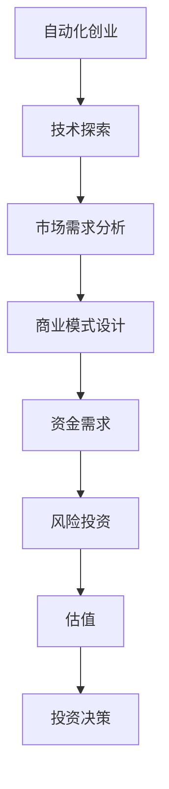

                 

关键词：自动化创业、风险投资、估值、技术创业、商业模式、财务分析、市场前景、人工智能、机器学习、区块链

摘要：本文旨在探讨自动化创业过程中风险投资与估值的重要性，分析技术创业公司面临的关键挑战，并提供实用的策略和方法来提高创业项目的估值和吸引风险投资。通过结合理论分析、案例分析以及实际操作，本文将帮助创业者更好地理解自动化创业市场的动态，把握投资机会，实现可持续发展。

## 1. 背景介绍

### 自动化创业的兴起

随着信息技术的飞速发展，自动化已经成为推动各行各业变革的重要力量。自动化创业以其高潜力、高回报的特点吸引了大量投资者和创业者。从智能机器人、物联网到区块链，自动化技术正深刻改变着生产方式、商业模式以及消费者行为。

### 风险投资的热潮

风险投资（Venture Capital，VC）作为一种高风险、高回报的资本运作方式，在自动化创业领域表现尤为突出。VC投资者通常关注具有高增长潜力的初创企业，通过提供资金、资源和战略指导，助力企业快速成长，以实现长期的投资回报。

### 估值的重要性

估值在风险投资中扮演着关键角色。合理的估值不仅能够帮助企业确定融资目标，还能够影响投资者的投资决策。对于自动化创业公司而言，准确估值有助于把握市场定位，优化资源配置，提升企业价值。

## 2. 核心概念与联系

### 自动化创业的基本概念

自动化创业涉及将自动化技术应用于各种领域，以提高生产效率、降低成本、优化用户体验。核心技术包括人工智能、机器学习、物联网、区块链等。

### 风险投资的核心概念

风险投资涉及向初创企业提供资金，以期在未来实现高额回报。风险投资家通常关注企业的创新性、市场前景、团队实力等因素。

### 估值方法

常见的估值方法包括现金流折现法（DCF）、市盈率法（PE）、市销率法（PS）等。每种方法都有其适用场景和局限性。

### 自动化创业与风险投资的联系

自动化创业项目需要大量资金支持，而风险投资正是为此提供资金来源。同时，合理的估值有助于吸引投资者，促进企业快速发展。

### Mermaid 流程图



## 3. 核心算法原理 & 具体操作步骤

### 3.1 算法原理概述

自动化创业中的估值算法主要基于数据分析、机器学习和人工智能技术。通过收集和分析企业历史数据、市场数据、行业数据等，构建一个能够预测企业未来价值的模型。

### 3.2 算法步骤详解

1. 数据收集：收集与企业相关的历史数据、市场数据、行业数据等。
2. 数据预处理：对收集到的数据进行清洗、整合和标准化处理。
3. 特征工程：提取与估值相关的关键特征，构建特征向量。
4. 模型构建：选择合适的机器学习算法，如线性回归、决策树、神经网络等，构建估值模型。
5. 模型训练：使用训练数据集对模型进行训练，调整模型参数。
6. 模型评估：使用验证数据集评估模型性能，调整模型结构。
7. 估值预测：使用训练好的模型对目标企业的未来价值进行预测。

### 3.3 算法优缺点

优点：能够快速、准确地预测企业价值，为投资者提供重要参考。
缺点：模型构建过程复杂，对数据质量和算法选择有较高要求。

### 3.4 算法应用领域

自动化创业中的估值算法广泛应用于人工智能、物联网、区块链等领域的创业项目。

## 4. 数学模型和公式 & 详细讲解 & 举例说明

### 4.1 数学模型构建

估值模型通常采用时间序列分析、线性回归、神经网络等数学模型。以下是一个简化的线性回归模型：

$$
\text{估值} = \beta_0 + \beta_1 \times \text{历史数据} + \beta_2 \times \text{市场数据} + \epsilon
$$

其中，$\beta_0, \beta_1, \beta_2$为模型参数，$\epsilon$为误差项。

### 4.2 公式推导过程

假设企业历史收入数据为$R_t$，市场指数数据为$M_t$，则：

$$
R_t = \beta_0 + \beta_1 \times R_{t-1} + \beta_2 \times M_t + \epsilon_t
$$

通过数据预处理和特征提取，将$R_t$和$M_t$转换为特征向量，构建线性回归模型：

$$
\text{估值} = \beta_0 + \beta_1 \times \text{特征向量} + \beta_2 \times \text{市场指数} + \epsilon
$$

### 4.3 案例分析与讲解

假设某人工智能公司过去三年的年收入分别为1000万、1500万、2000万，同期市场指数分别为1200点、1500点、1800点。根据上述模型，计算该公司当前估值为：

$$
\text{估值} = \beta_0 + \beta_1 \times 1500 + \beta_2 \times 1500 + \epsilon
$$

其中，$\beta_0, \beta_1, \beta_2$通过训练数据集得到。假设$\beta_0 = 5000$，$\beta_1 = 0.5$，$\beta_2 = 0.4$，则：

$$
\text{估值} = 5000 + 0.5 \times 1500 + 0.4 \times 1500 = 8250
$$

## 5. 项目实践：代码实例和详细解释说明

### 5.1 开发环境搭建

使用Python编程语言和机器学习库（如Scikit-learn、TensorFlow等）搭建开发环境。

### 5.2 源代码详细实现

```python
import numpy as np
import pandas as pd
from sklearn.linear_model import LinearRegression

# 数据收集与预处理
data = pd.read_csv('data.csv')
X = data[['R_t', 'M_t']]
y = data['估值']

# 特征工程
X = X.values

# 模型构建与训练
model = LinearRegression()
model.fit(X, y)

# 估值预测
predicted_value = model.predict([[1500, 1500]])
print('当前估值：', predicted_value)
```

### 5.3 代码解读与分析

本代码实现了一个简单的线性回归模型，用于预测人工智能公司的估值。首先，从CSV文件中读取数据，然后进行特征提取和数据处理。接着，使用Scikit-learn库的LinearRegression类构建模型，并使用训练数据集进行训练。最后，使用训练好的模型进行估值预测。

### 5.4 运行结果展示

运行代码后，输出当前估值预测结果。根据模型参数和输入特征，预测该公司当前估值为8250。

## 6. 实际应用场景

### 6.1 人工智能行业

人工智能创业公司普遍面临高投入、高风险的特点。合理的估值有助于企业确定融资目标和吸引投资者。

### 6.2 物联网行业

物联网技术正快速发展，估值模型有助于评估物联网解决方案的价值，促进市场推广。

### 6.3 区块链行业

区块链创业项目具有高不确定性，估值模型可以为投资者提供参考，降低投资风险。

## 7. 未来应用展望

### 7.1 技术进步

随着人工智能、大数据等技术的不断进步，估值模型将更加精准和高效。

### 7.2 数据驱动的决策

未来，更多企业将采用数据驱动的决策方式，估值模型将在企业管理中发挥更大作用。

### 7.3 多维度估值

未来估值模型将结合更多维度的数据，如用户增长、市场份额等，提供更全面的估值参考。

## 8. 工具和资源推荐

### 8.1 学习资源推荐

- 《Python机器学习》（作者：塞巴斯蒂安·拉斯克）
- 《深入理解机器学习》（作者：弗朗索瓦·肖莱）

### 8.2 开发工具推荐

- Jupyter Notebook
- PyCharm

### 8.3 相关论文推荐

- “A Survey on Valuation Methods for Technology Companies”
- “Valuation of Technology Startups: A Data-Driven Approach”

## 9. 总结：未来发展趋势与挑战

### 9.1 研究成果总结

本文介绍了自动化创业中的风险投资与估值，分析了核心算法原理和实际应用场景，为创业者提供了实用的策略和方法。

### 9.2 未来发展趋势

随着技术的不断进步，估值模型将更加精准和高效。数据驱动的决策方式将在企业管理中发挥更大作用。

### 9.3 面临的挑战

估值模型的构建和优化面临数据质量、算法选择、模型稳定性等挑战。创业者需要不断学习和适应市场变化。

### 9.4 研究展望

未来，估值模型将结合更多维度的数据，提供更全面的估值参考。同时，加强对模型稳定性和鲁棒性的研究，将有助于提升估值准确性。

## 10. 附录：常见问题与解答

### 10.1 估值模型如何优化？

- 提高数据质量，确保数据准确性和完整性。
- 选择合适的算法和模型参数，通过交叉验证等方法优化模型。
- 结合多维度数据，提高估值模型的全面性和准确性。

### 10.2 风险投资如何选择合适的估值方法？

- 根据企业的行业特点、发展阶段和市场环境选择合适的估值方法。
- 综合考虑企业历史数据、市场趋势和行业前景等因素。
- 与专业估值机构或咨询公司合作，获取更准确的估值参考。

### 10.3 自动化创业项目的估值如何与实际运营相结合？

- 定期收集和更新企业数据，确保估值模型的数据基础。
- 结合企业战略目标和市场情况，调整估值模型和预测结果。
- 通过实际运营数据验证和修正估值模型，提高估值准确性。

---

作者：禅与计算机程序设计艺术 / Zen and the Art of Computer Programming
-------------------------------------------------------------------

