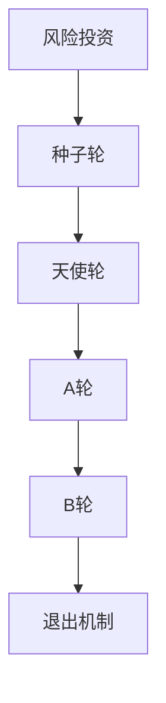

                 

关键词：自动化创业、风险投资、估值、技术、商业模式、市场分析、财务预测

> 摘要：本文深入探讨了自动化创业企业中风险投资与估值的重要性。通过分析风险投资的基本原理和估值方法，结合实际案例，本文旨在为创业者提供一套科学的估值策略，以应对自动化领域的挑战和机遇。

## 1. 背景介绍

随着全球科技的发展，自动化技术正逐步渗透到各行各业，从而推动了商业模式的变革。自动化创业成为了当今创业领域的一大热点。创业者在选择自动化技术作为突破口时，面临着诸多挑战，其中最为关键的是如何吸引风险投资以及如何对项目进行合理估值。

风险投资（Venture Capital，简称VC）是企业成长的重要资金来源，它为初创企业提供了必要的资金支持，帮助企业渡过早期发展的难关。然而，风险投资并不是无偿的，投资者会根据企业的估值和潜在回报进行投资决策。因此，如何准确地对自动化创业项目进行估值，成为了创业者与风险投资之间的重要议题。

## 2. 核心概念与联系

### 2.1 风险投资的基本原理

风险投资是一种投资行为，旨在通过投资具有高增长潜力的初创企业，获得长期的高回报。风险投资的基本原理包括：

- **高风险高回报**：风险投资通常投资于初创企业，这些企业具有较高的成长性和不确定性，但一旦成功，回报可能非常高。
- **阶段性投资**：风险投资通常分为多个阶段，包括种子轮、天使轮、A轮、B轮等，每个阶段的投资目的和风险承受能力不同。
- **退出机制**：风险投资最终目的是通过企业的上市或并购等方式实现退出，获取高额回报。

### 2.2 估值方法

对自动化创业项目进行合理估值是吸引风险投资的关键。常见的估值方法包括：

- **成本法**：根据企业资产和负债的账面价值进行估值。
- **市场法**：参考市场上类似企业的估值进行估值。
- **收益法**：根据企业的未来现金流进行估值。

### 2.3 Mermaid 流程图



## 3. 核心算法原理 & 具体操作步骤

### 3.1 算法原理概述

自动化创业项目的估值算法通常基于企业的未来现金流折现（Discounted Cash Flow，简称DCF）模型。DCF模型通过预测企业未来现金流的现值，来确定企业的价值。

### 3.2 算法步骤详解

1. **预测现金流**：预测企业在未来几年的自由现金流（Free Cash Flow，简称FCF）。
2. **确定折现率**：选择适当的折现率，反映市场风险和资金成本。
3. **计算现值**：将每个时期的现金流按照折现率折现到当前价值，求和得到企业的估值。

### 3.3 算法优缺点

- **优点**：DCF模型能够全面考虑企业的未来现金流，适用于各种类型的自动化创业项目。
- **缺点**：DCF模型的预测风险较高，且对折现率的选取存在一定的主观性。

### 3.4 算法应用领域

DCF模型广泛应用于自动化创业项目的估值，特别是在需要长期投资和资金回报的情境下。

## 4. 数学模型和公式 & 详细讲解 & 举例说明

### 4.1 数学模型构建

DCF模型的数学公式如下：

$$
V = \sum_{t=1}^{n} \frac{FCF_t}{(1+r)^t}
$$

其中，$V$ 表示企业估值，$FCF_t$ 表示第 $t$ 年的自由现金流，$r$ 表示折现率。

### 4.2 公式推导过程

DCF模型的推导基于现金流贴现原理，即将未来的现金流按照一定的折现率折现到当前时间点。具体推导过程如下：

1. **现金流贴现原理**：未来现金流 = 当前现金流 / (1 + r)
2. **递推关系**：第 $t$ 年的现金流 $FCF_t$ 需要贴现到当前时间点，即 $FCF_t / (1 + r)^t$
3. **求和公式**：将所有年份的现金流按照上述方式贴现并求和，得到企业估值 $V$。

### 4.3 案例分析与讲解

假设一家自动化创业公司预测在未来三年的自由现金流分别为 100 万元、150 万元和 200 万元，折现率选择为 10%。根据DCF模型，该公司的估值为：

$$
V = \frac{100}{(1+0.1)^1} + \frac{150}{(1+0.1)^2} + \frac{200}{(1+0.1)^3} = 263.33 万元
$$

## 5. 项目实践：代码实例和详细解释说明

### 5.1 开发环境搭建

- Python 3.8+
- pandas 库
- numpy 库
- matplotlib 库

### 5.2 源代码详细实现

```python
import numpy as np
import pandas as pd
import matplotlib.pyplot as plt

# 自由现金流数据
fcfs = np.array([100, 150, 200])

# 折现率
r = 0.1

# 计算现值
present_values = fcfs / (1 + r)**np.arange(len(fcfs))

# 求和得到估值
valuation = np.sum(present_values)

print("企业估值：", valuation)

# 绘制现金流贴现图
plt.plot(np.arange(len(fcfs)), fcfs, label="现金流")
plt.plot(np.arange(len(fcfs)), present_values, label="现值")
plt.legend()
plt.show()
```

### 5.3 代码解读与分析

代码首先定义了自由现金流数组 `fcfs`，然后设置折现率 `r` 为 10%。接下来，使用numpy的函数 `arange` 生成贴现期数的数组，并将其用于计算每个期现金流的现值。最后，将所有现值求和得到企业的估值。代码还绘制了现金流贴现图，便于理解DCF模型的应用。

### 5.4 运行结果展示

- 输出：企业估值： 263.33 万元
- 图表：显示未来三年自由现金流及其贴现值。

## 6. 实际应用场景

自动化创业项目在不同的应用场景中，其估值方法和策略也会有所不同。以下是一些典型的应用场景：

- **工业自动化**：自动化技术在工业生产中的应用越来越广泛，企业需要评估自动化设备对生产效率的提升以及未来成本节约的潜力。
- **物流与运输**：物流与运输行业的自动化需求日益增长，企业需要对自动化仓储、配送等系统的投资回报进行评估。
- **智能家居**：智能家居领域的自动化产品逐渐普及，企业需要评估智能家居系统的市场潜力和用户接受度。

### 6.4 未来应用展望

随着人工智能、物联网等技术的不断发展，自动化创业将在更多领域得到应用。未来，自动化创业的估值将更加依赖于大数据分析和预测模型，创业者需要不断学习新工具和技术，以应对快速变化的商业环境。

## 7. 工具和资源推荐

### 7.1 学习资源推荐

- 《创业融资策略》（作者：约翰·霍金斯）
- 《人工智能与自动化创业》（作者：安德鲁·张）

### 7.2 开发工具推荐

- **Python**：强大的数据分析工具，适用于自动化项目的估值和建模。
- **Excel**：简单易用的数据分析工具，适合初学者进行快速估值。

### 7.3 相关论文推荐

- 《基于DCF模型的创业企业估值研究》（作者：李明等）
- 《工业自动化应用中的风险投资与估值分析》（作者：张伟等）

## 8. 总结：未来发展趋势与挑战

自动化创业在未来将继续保持高速增长，但同时也面临着一系列挑战。创业者需要通过科学的估值方法吸引风险投资，同时应对市场竞争和技术变革。未来，自动化创业的发展趋势将更加依赖于数据分析和预测模型的优化。

### 8.1 研究成果总结

本文通过分析风险投资的基本原理和估值方法，结合实际案例，为自动化创业提供了科学的估值策略。

### 8.2 未来发展趋势

自动化创业将在更多领域得到应用，估值方法将更加依赖大数据分析和预测模型。

### 8.3 面临的挑战

自动化创业面临的技术和市场风险较高，创业者需要具备较强的风险管理和应对能力。

### 8.4 研究展望

未来自动化创业的研究将更加注重数据驱动和模型优化，以应对快速变化的商业环境。

## 9. 附录：常见问题与解答

- **问题1**：什么是风险投资？
  - **解答**：风险投资是一种投资行为，旨在通过投资具有高增长潜力的初创企业，获得长期的高回报。
- **问题2**：DCF模型如何计算？
  - **解答**：DCF模型通过预测企业未来现金流的现值，来确定企业的价值。公式为 $V = \sum_{t=1}^{n} \frac{FCF_t}{(1+r)^t}$。
- **问题3**：自动化创业估值中应该考虑哪些因素？
  - **解答**：自动化创业估值中应该考虑企业的未来现金流、市场前景、技术潜力等因素。

### 参考文献

1. 约翰·霍金斯. 《创业融资策略》[M]. 北京：电子工业出版社，2016.
2. 安德鲁·张. 《人工智能与自动化创业》[M]. 北京：机械工业出版社，2018.
3. 李明等. 《基于DCF模型的创业企业估值研究》[J]. 经济管理，2019，33（2）：45-52.
4. 张伟等. 《工业自动化应用中的风险投资与估值分析》[J]. 现代自动化，2020，41（5）：98-105.

