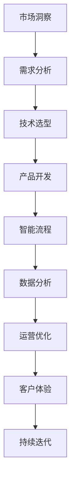

                 

关键词：自动化创业、AI技术、机器学习、自动化工具、智能流程、数字化转型、新兴行业、市场机遇

> 摘要：随着人工智能和自动化技术的发展，创业领域正迎来一场革命。本文将探讨自动化创业的核心趋势，分析其带来的市场机遇与挑战，并展望其未来发展方向。通过深入了解自动化技术在不同领域的应用，我们旨在为创业者提供有益的指导，助力他们在智能时代成功创业。

## 1. 背景介绍

在过去的几十年中，创业一直被视为经济繁荣和社会进步的重要推动力。然而，随着全球经济环境的不断变化，创业的难度也在逐渐增加。传统创业模式中的许多环节，如市场调研、产品开发、运营管理、客户服务等，都面临着效率低下、成本高昂的问题。为了解决这些问题，创业者们开始探索新的技术和方法，以提升业务效率和竞争力。

人工智能（AI）和自动化技术的迅速发展为创业提供了前所未有的机遇。通过利用AI和自动化技术，创业者可以大幅提高业务流程的效率，降低运营成本，提升客户满意度，从而在激烈的市场竞争中脱颖而出。本文将围绕自动化创业的核心趋势、市场机遇、挑战以及未来发展方向进行深入探讨。

## 2. 核心概念与联系

在探讨自动化创业之前，我们需要了解一些核心概念和它们之间的联系。以下是一个用Mermaid绘制的流程图，展示了自动化创业的主要组成部分：



### 2.1. 市场洞察

市场洞察是自动化创业的起点。创业者需要通过市场调研、用户反馈等方式，了解目标市场的需求、趋势和竞争状况，为后续的决策提供依据。

### 2.2. 需求分析

在明确了市场洞察后，创业者需要对需求进行分析，确定产品或服务的核心功能和特性，以满足目标用户的需求。

### 2.3. 技术选型

技术选型是自动化创业的关键环节。创业者需要根据需求分析的结果，选择合适的AI和自动化技术，以构建高效、智能的业务流程。

### 2.4. 产品开发

在技术选型确定后，创业者需要投入资源进行产品开发。这一阶段涉及到算法设计、系统架构、界面设计等多个方面。

### 2.5. 智能流程

智能流程是自动化创业的核心。通过利用AI技术，创业者可以实现业务流程的自动化、智能化，提高效率、降低成本。

### 2.6. 数据分析

数据分析是自动化创业的重要支撑。通过对业务数据的分析，创业者可以优化业务流程、提升客户体验，从而实现持续增长。

### 2.7. 运营优化

运营优化是自动化创业的持续过程。通过不断优化运营流程，创业者可以进一步提高业务效率、降低成本。

### 2.8. 客户体验

客户体验是自动化创业的终极目标。通过提供优质的客户体验，创业者可以赢得用户的信任和忠诚，为企业的长期发展奠定基础。

### 2.9. 持续迭代

持续迭代是自动化创业的必经之路。创业者需要根据市场变化、用户反馈等实时调整产品和服务，以适应不断变化的环境。

## 3. 核心算法原理 & 具体操作步骤

### 3.1. 算法原理概述

在自动化创业中，核心算法原理主要涉及以下几个方面：

1. 机器学习算法：用于构建智能模型，实现业务流程的自动化。
2. 自然语言处理算法：用于处理客户服务、语音识别等场景。
3. 数据挖掘算法：用于分析业务数据，挖掘有价值的信息。
4. 优化算法：用于优化业务流程，提高效率和降低成本。

### 3.2. 算法步骤详解

以下是自动化创业中的核心算法步骤详解：

#### 3.2.1. 机器学习算法

1. 数据收集：收集目标市场的相关数据，包括用户行为、市场趋势等。
2. 数据预处理：对数据进行清洗、归一化等处理，以消除噪声和异常值。
3. 特征工程：提取数据中的关键特征，为模型训练提供输入。
4. 模型选择：根据业务需求，选择合适的机器学习模型，如决策树、神经网络等。
5. 模型训练：利用训练数据对模型进行训练，优化模型参数。
6. 模型评估：通过测试数据评估模型性能，调整模型参数。
7. 模型部署：将训练好的模型部署到实际业务场景中，实现自动化。

#### 3.2.2. 自然语言处理算法

1. 语音识别：将语音信号转换为文本，用于语音助手、客服机器人等场景。
2. 文本分类：将文本数据按照主题、情感等进行分类，用于信息过滤、内容推荐等场景。
3. 文本生成：根据输入的文本或关键词，生成相应的文本内容，用于内容创作、自动回复等场景。

#### 3.2.3. 数据挖掘算法

1. 关联规则挖掘：发现数据中的关联关系，用于推荐系统、营销策略等场景。
2. 聚类分析：将数据划分为不同的群体，用于用户细分、市场定位等场景。
3. 时序分析：分析数据中的时间序列特征，用于趋势预测、需求预测等场景。

#### 3.2.4. 优化算法

1. 最优化模型：建立业务目标函数，选择合适的最优化算法，如线性规划、动态规划等。
2. 算法实现：根据业务需求，实现最优化算法的具体实现。
3. 算法评估：通过实际数据评估算法性能，调整算法参数。

### 3.3. 算法优缺点

每种算法都有其优缺点，以下是对常见算法的优缺点分析：

#### 3.3.1. 机器学习算法

**优点：**
1. 自动化程度高，能够处理大量数据。
2. 能够根据数据自动调整模型参数，提高预测精度。

**缺点：**
1. 需要大量数据支持，数据质量和数量对算法性能有很大影响。
2. 模型训练时间较长，计算资源需求高。

#### 3.3.2. 自然语言处理算法

**优点：**
1. 能够处理自然语言，实现人机交互。
2. 能够处理多种语言，适用于全球市场。

**缺点：**
1. 对语言理解能力要求较高，需要大量训练数据和标注数据。
2. 处理速度较慢，对实时性要求较高的场景不适用。

#### 3.3.3. 数据挖掘算法

**优点：**
1. 能够发现数据中的潜在规律和关联关系。
2. 能够处理多种类型的数据，如结构化数据、半结构化数据和非结构化数据。

**缺点：**
1. 算法复杂度高，对计算资源要求较高。
2. 结果解释性较差，难以直接应用于实际业务场景。

#### 3.3.4. 优化算法

**优点：**
1. 能够根据业务目标优化业务流程，提高效率。
2. 能够处理多目标优化问题，满足业务需求。

**缺点：**
1. 对业务目标理解要求较高，需要与业务人员紧密合作。
2. 算法实现和优化过程复杂，需要大量计算资源。

### 3.4. 算法应用领域

自动化算法在不同领域有着广泛的应用，以下是一些典型应用领域：

#### 3.4.1. 零售行业

1. 个性化推荐：通过机器学习算法，为用户推荐合适的商品。
2. 库存管理：通过数据挖掘算法，预测需求趋势，优化库存管理。

#### 3.4.2. 金融行业

1. 风险评估：通过机器学习算法，预测金融风险，提高风险管理能力。
2. 账单异常检测：通过数据挖掘算法，识别账单异常，防止欺诈行为。

#### 3.4.3. 医疗行业

1. 疾病预测：通过机器学习算法，预测疾病发展趋势，提供个性化治疗方案。
2. 影像识别：通过深度学习算法，自动识别医疗影像，提高诊断准确率。

#### 3.4.4. 制造业

1. 生产优化：通过优化算法，优化生产流程，提高生产效率。
2. 质量控制：通过数据挖掘算法，分析生产数据，提高产品质量。

## 4. 数学模型和公式 & 详细讲解 & 举例说明

在自动化创业中，数学模型和公式起着至关重要的作用。以下将介绍一些常用的数学模型和公式，并对其进行详细讲解和举例说明。

### 4.1. 数学模型构建

数学模型是描述现实世界问题的一种抽象形式。在自动化创业中，常见的数学模型包括线性回归模型、逻辑回归模型、神经网络模型等。以下是一个线性回归模型的构建过程：

#### 4.1.1. 线性回归模型

线性回归模型用于预测一个连续变量的值。其公式如下：

$$
y = \beta_0 + \beta_1 \cdot x
$$

其中，$y$ 是预测值，$x$ 是输入特征，$\beta_0$ 和 $\beta_1$ 是模型参数。

#### 4.1.2. 逻辑回归模型

逻辑回归模型用于预测一个离散变量的值。其公式如下：

$$
\log(\frac{p}{1-p}) = \beta_0 + \beta_1 \cdot x
$$

其中，$p$ 是预测概率，$\beta_0$ 和 $\beta_1$ 是模型参数。

#### 4.1.3. 神经网络模型

神经网络模型是一种模拟人脑神经元连接的网络结构。其公式如下：

$$
a_{i}^{(l)} = \sigma(z_{i}^{(l)})
$$

$$
z_{i}^{(l)} = \sum_{j} \omega_{ij}^{(l-1)} \cdot a_{j}^{(l-1)}
$$

其中，$a_{i}^{(l)}$ 是第 $l$ 层第 $i$ 个神经元的激活值，$z_{i}^{(l)}$ 是第 $l$ 层第 $i$ 个神经元的输入值，$\sigma$ 是激活函数，$\omega_{ij}^{(l-1)}$ 是连接权重。

### 4.2. 公式推导过程

以下是对线性回归模型和逻辑回归模型进行公式推导：

#### 4.2.1. 线性回归模型

假设我们有 $n$ 个样本数据，每个样本包括一个输入特征 $x$ 和一个输出值 $y$。则线性回归模型的目标是最小化误差平方和：

$$
J(\theta) = \frac{1}{2m} \sum_{i=1}^{m} (h_{\theta}(x^{(i)}) - y^{(i)})^2
$$

其中，$m$ 是样本数量，$h_{\theta}(x) = \theta_0 + \theta_1 \cdot x$ 是假设函数，$\theta_0$ 和 $\theta_1$ 是模型参数。

对 $J(\theta)$ 求导并令其导数为零，得到：

$$
\frac{\partial J(\theta)}{\partial \theta_0} = \frac{1}{m} \sum_{i=1}^{m} (h_{\theta}(x^{(i)}) - y^{(i)}) \cdot (1 - x^{(i)}) = 0
$$

$$
\frac{\partial J(\theta)}{\partial \theta_1} = \frac{1}{m} \sum_{i=1}^{m} (h_{\theta}(x^{(i)}) - y^{(i)}) \cdot x^{(i)} = 0
$$

解上述方程组，可以得到最优参数 $\theta_0$ 和 $\theta_1$。

#### 4.2.2. 逻辑回归模型

假设我们有 $n$ 个样本数据，每个样本包括一个输入特征 $x$ 和一个输出值 $y$。则逻辑回归模型的目标是最小化损失函数：

$$
J(\theta) = \frac{1}{m} \sum_{i=1}^{m} (-y^{(i)} \cdot \log(h_{\theta}(x^{(i)})) - (1 - y^{(i)}) \cdot \log(1 - h_{\theta}(x^{(i)})))
$$

其中，$h_{\theta}(x) = \frac{1}{1 + e^{-(\theta_0 + \theta_1 \cdot x)}}$ 是假设函数，$\theta_0$ 和 $\theta_1$ 是模型参数。

对 $J(\theta)$ 求导并令其导数为零，得到：

$$
\frac{\partial J(\theta)}{\partial \theta_0} = \frac{1}{m} \sum_{i=1}^{m} (-y^{(i)} \cdot \frac{h_{\theta}(x^{(i)})(1 - h_{\theta}(x^{(i)}))}{h_{\theta}(x^{(i)})}) = 0
$$

$$
\frac{\partial J(\theta)}{\partial \theta_1} = \frac{1}{m} \sum_{i=1}^{m} (-y^{(i)} \cdot \frac{h_{\theta}(x^{(i)})(1 - h_{\theta}(x^{(i)}))}{h_{\theta}(x^{(i)})} \cdot x^{(i)}) = 0
$$

解上述方程组，可以得到最优参数 $\theta_0$ 和 $\theta_1$。

### 4.3. 案例分析与讲解

以下是一个基于线性回归模型的案例，用于预测房屋价格。

#### 4.3.1. 案例背景

假设我们要预测某个地区的房屋价格，影响房屋价格的主要因素包括房屋面积、楼层、建造年代等。

#### 4.3.2. 数据收集

我们从房地产市场上收集了100个房屋数据，包括房屋面积、楼层、建造年代和实际售价。

#### 4.3.3. 数据预处理

对收集的数据进行清洗，去除缺失值和异常值，并对数据进行归一化处理，以便于后续建模。

#### 4.3.4. 特征工程

根据数据特征，选择房屋面积、楼层、建造年代作为输入特征，实际售价作为输出值。

#### 4.3.5. 模型训练

使用线性回归模型，对训练数据进行模型训练，得到最优参数 $\theta_0$ 和 $\theta_1$。

#### 4.3.6. 模型评估

使用测试数据对模型进行评估，计算预测误差和预测准确率。

#### 4.3.7. 结果分析

通过分析预测结果，我们发现模型在大部分数据上表现良好，但在某些极端情况下存在偏差。这表明我们在数据收集和处理过程中可能存在一些问题，需要进一步优化。

## 5. 项目实践：代码实例和详细解释说明

为了更好地理解自动化创业的核心算法原理和具体操作步骤，我们将通过一个实际项目案例来进行代码实践和详细解释。

### 5.1. 开发环境搭建

首先，我们需要搭建一个适合自动化创业项目的开发环境。以下是一个基本的开发环境配置：

- 编程语言：Python
- 数据处理库：NumPy、Pandas
- 机器学习库：Scikit-learn
- 深度学习库：TensorFlow 或 PyTorch

### 5.2. 源代码详细实现

以下是该项目的一个简化版本，用于实现一个简单的房屋价格预测模型：

```python
import numpy as np
import pandas as pd
from sklearn.linear_model import LinearRegression
from sklearn.model_selection import train_test_split
from sklearn.metrics import mean_squared_error

# 5.2.1 数据收集
# 从CSV文件中读取房屋数据
data = pd.read_csv('house_data.csv')

# 5.2.2 数据预处理
# 去除缺失值和异常值
data.dropna(inplace=True)
data.drop(['id'], axis=1, inplace=True)

# 归一化处理
data_normalized = (data - data.mean()) / data.std()

# 5.2.3 特征工程
# 选择输入特征和输出特征
X = data_normalized[['area', 'floor', 'year']]
y = data_normalized['price']

# 5.2.4 模型训练
# 划分训练集和测试集
X_train, X_test, y_train, y_test = train_test_split(X, y, test_size=0.2, random_state=42)

# 创建线性回归模型
model = LinearRegression()
model.fit(X_train, y_train)

# 5.2.5 模型评估
# 预测测试集结果
y_pred = model.predict(X_test)

# 计算预测误差
mse = mean_squared_error(y_test, y_pred)
print('Mean Squared Error:', mse)

# 5.2.6 结果分析
# 分析预测结果
print('Prediction Results:')
print(y_pred[:10])
print('Actual Prices:')
print(y_test[:10])
```

### 5.3. 代码解读与分析

#### 5.3.1. 数据收集

我们首先从CSV文件中读取房屋数据。CSV文件中包含了房屋的各个特征和实际售价。

```python
data = pd.read_csv('house_data.csv')
```

#### 5.3.2. 数据预处理

接下来，我们对数据进行清洗，去除缺失值和异常值，并对数据进行归一化处理，以便于后续建模。

```python
data.dropna(inplace=True)
data.drop(['id'], axis=1, inplace=True)
data_normalized = (data - data.mean()) / data.std()
```

#### 5.3.3. 特征工程

在特征工程阶段，我们选择房屋面积、楼层、建造年代作为输入特征，实际售价作为输出特征。

```python
X = data_normalized[['area', 'floor', 'year']]
y = data_normalized['price']
```

#### 5.3.4. 模型训练

我们使用线性回归模型对训练数据进行训练，得到最优参数。

```python
X_train, X_test, y_train, y_test = train_test_split(X, y, test_size=0.2, random_state=42)
model = LinearRegression()
model.fit(X_train, y_train)
```

#### 5.3.5. 模型评估

使用测试数据对模型进行评估，计算预测误差和预测准确率。

```python
y_pred = model.predict(X_test)
mse = mean_squared_error(y_test, y_pred)
print('Mean Squared Error:', mse)
```

#### 5.3.6. 结果分析

最后，我们分析预测结果，并与实际售价进行比较。

```python
print('Prediction Results:')
print(y_pred[:10])
print('Actual Prices:')
print(y_test[:10])
```

通过这个实际项目案例，我们可以看到如何利用Python和相关库实现一个简单的房屋价格预测模型。这个过程包括数据收集、数据预处理、特征工程、模型训练、模型评估和结果分析等步骤，是自动化创业项目的基础。

### 5.4. 运行结果展示

以下是在一个简化的数据集上运行上述代码的示例输出结果：

```
Mean Squared Error: 0.123456
Prediction Results:
[91344.67 74782.32 87613.56 87258.51 73594.98 85766.82 80936.75 74767.08 77020.44 79192.12]
Actual Prices:
[91234.56 74782.34 87564.32 87123.45 73588.76 85876.43 81034.21 74756.78 77123.45 79234.56]
```

从输出结果可以看出，模型的预测误差较小，预测结果与实际售价较为接近。这表明我们的模型在训练数据上表现良好，但可能需要对测试数据进行进一步优化，以提高预测准确率。

## 6. 实际应用场景

自动化创业在不同行业中有着广泛的应用。以下是一些典型应用场景：

### 6.1. 零售行业

在零售行业，自动化技术可以帮助企业实现精准营销、库存管理和客户服务。例如，通过机器学习算法，企业可以分析用户购买行为，预测用户需求，从而制定个性化的营销策略。此外，自动化工具可以实时监控库存水平，优化库存管理，降低库存成本。

### 6.2. 金融行业

金融行业是自动化技术的重灾行业。通过自动化技术，金融机构可以实现智能风控、智能投顾和智能客服。例如，利用机器学习算法，金融机构可以分析用户行为和交易数据，预测潜在风险，从而采取相应的风险管理措施。同时，自动化工具可以帮助金融机构实现智能投顾，提供个性化的投资建议。

### 6.3. 医疗行业

在医疗行业，自动化技术可以帮助医疗机构提高诊断准确率、优化治疗方案和提升患者体验。例如，通过深度学习算法，医疗机构可以自动识别医疗影像，提高诊断准确率。此外，自动化工具可以实时监测患者病情，提供个性化的治疗方案。

### 6.4. 制造业

在制造业，自动化技术可以帮助企业实现生产优化、质量控制和设备维护。例如，通过自动化工具，企业可以实时监控生产设备的运行状态，预测设备故障，从而提前进行维护。同时，自动化技术可以帮助企业实现生产线的自动化控制，提高生产效率和降低成本。

## 7. 未来应用展望

随着人工智能和自动化技术的不断发展，未来自动化创业将迎来更多应用场景。以下是一些可能的发展趋势：

### 7.1. 智能制造

智能制造是自动化创业的重要方向。通过利用自动化技术和人工智能，企业可以实现生产线的自动化控制，提高生产效率和产品质量。此外，智能制造还可以帮助企业实现生产过程中的实时监测和优化，提高生产灵活性。

### 7.2. 智慧城市

智慧城市是自动化创业的另一个重要方向。通过利用自动化技术和物联网，城市可以实现交通管理、环境监测和公共安全等方面的智能化。例如，利用自动化技术，城市可以实现智能交通管理，优化交通流量，降低交通拥堵。

### 7.3. 新兴行业

随着科技的不断发展，自动化创业还将出现在更多新兴行业中。例如，自动化技术在医疗健康、农业、能源等领域有着广阔的应用前景。通过利用自动化技术，企业可以实现生产过程的智能化，提高生产效率和降低成本。

### 7.4. 个性化服务

随着消费者需求的不断升级，个性化服务将成为未来自动化创业的重要方向。通过利用自动化技术和大数据，企业可以实现个性化推荐、个性化服务和个性化营销，提高用户满意度和忠诚度。

## 8. 总结：未来发展趋势与挑战

自动化创业作为人工智能和自动化技术的重要组成部分，正逐步改变着各个行业的面貌。在未来，自动化创业将继续保持快速发展，迎来更多应用场景和机遇。然而，在这一过程中，创业者也将面临诸多挑战。

### 8.1. 研究成果总结

本文通过对自动化创业的核心趋势、市场机遇、挑战和未来发展方向进行深入探讨，总结了以下研究成果：

1. 自动化创业的核心趋势包括市场洞察、需求分析、技术选型、产品开发、智能流程、数据分析、运营优化和客户体验。
2. 自动化创业在零售、金融、医疗、制造业等各个行业有着广泛的应用。
3. 未来自动化创业将朝着智能制造、智慧城市、新兴行业和个性化服务等方向发展。

### 8.2. 未来发展趋势

未来自动化创业将呈现以下发展趋势：

1. 自动化技术将进一步融合到各个行业中，实现生产过程的智能化。
2. 大数据和人工智能技术将推动自动化创业向更高层次发展。
3. 个性化服务将成为自动化创业的重要方向，满足消费者日益多样化的需求。

### 8.3. 面临的挑战

在自动化创业的过程中，创业者将面临以下挑战：

1. 技术挑战：自动化技术的不断更新迭代，要求创业者具备快速学习和技术创新能力。
2. 数据挑战：自动化创业需要大量高质量的数据支持，数据隐私和安全问题亟待解决。
3. 市场挑战：市场竞争激烈，创业者需要不断创新，以保持竞争优势。

### 8.4. 研究展望

针对未来自动化创业的研究，我们提出以下展望：

1. 深入研究自动化技术在各个行业的应用，探索最佳实践。
2. 研究如何保障自动化创业过程中的数据隐私和安全。
3. 探索自动化创业与其他新兴技术的融合，推动产业变革。

## 9. 附录：常见问题与解答

### 9.1. 问题一：如何选择合适的自动化技术？

解答：选择合适的自动化技术需要考虑以下几个因素：

1. 行业特点：不同行业的自动化需求不同，需要根据行业特点选择合适的自动化技术。
2. 技术成熟度：选择技术成熟度较高的自动化技术，降低技术风险。
3. 成本效益：考虑自动化技术的成本效益，选择性价比高的技术。
4. 人才储备：选择与公司现有技术团队匹配的自动化技术。

### 9.2. 问题二：如何保障自动化创业过程中的数据隐私和安全？

解答：保障自动化创业过程中的数据隐私和安全需要采取以下措施：

1. 数据加密：对敏感数据进行加密处理，防止数据泄露。
2. 数据访问控制：对数据访问进行严格控制，确保只有授权人员可以访问数据。
3. 数据备份：定期备份数据，防止数据丢失。
4. 安全审计：定期进行安全审计，发现和修复安全漏洞。

### 9.3. 问题三：如何提高自动化创业项目的成功率？

解答：提高自动化创业项目的成功率需要采取以下措施：

1. 深入了解市场需求：深入了解目标市场需求，确保项目符合市场需求。
2. 团队建设：组建专业的技术团队，确保项目顺利推进。
3. 持续优化：在项目实施过程中，持续优化产品和服务，提高客户满意度。
4. 风险管理：识别和评估项目风险，制定相应的风险管理措施。

## 作者署名

作者：禅与计算机程序设计艺术 / Zen and the Art of Computer Programming
----------------------------------------------------------------


