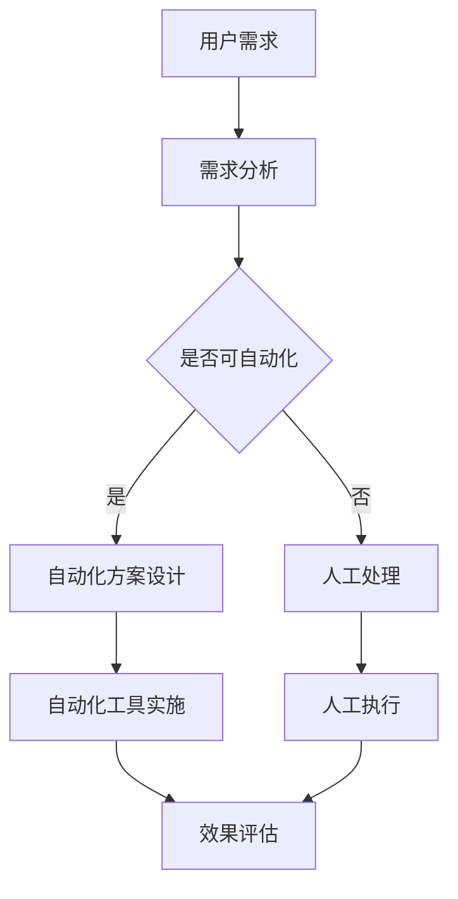

                 

自动化工具在当今的商业环境中扮演着越来越重要的角色，特别是在创业领域。自动化不仅能够提高工作效率，还能降低运营成本，使创业者能够更专注于核心业务发展。本文将深入探讨自动化工具对于创业者的意义，从核心概念、算法原理、数学模型、项目实践、应用场景、未来展望等多个角度进行详细阐述。

## 关键词

- 自动化工具
- 创业者
- 工作效率
- 成本控制
- 人工智能
- 业务流程优化

## 摘要

本文旨在探讨自动化工具在创业者日常运营和管理中的重要性。通过介绍自动化工具的核心概念、算法原理、数学模型以及具体的应用案例，文章将为创业者提供如何利用自动化工具提高工作效率、降低成本的方法和策略。同时，还将对自动化工具的未来发展趋势进行展望，以期为创业者的持续发展提供有益的参考。

## 1. 背景介绍

在过去的几十年中，自动化技术的发展经历了从简单的机械自动化到复杂的智能自动化，这一过程大大推动了社会生产力的提升。随着人工智能、大数据、云计算等技术的不断发展，自动化工具的应用场景越来越广泛，从制造业、服务业到金融、医疗等多个领域，自动化工具都发挥着不可替代的作用。

对于创业者来说，面对市场竞争的激烈和业务扩展的迫切需求，自动化工具成为他们提高工作效率、降低运营成本、提升核心竞争力的关键手段。通过自动化，创业者能够解放双手，将时间和精力更多地投入到战略规划和业务创新上，从而在竞争中占据优势地位。

### 1.1 自动化工具的历史发展

自动化工具的历史可以追溯到20世纪初期，随着工业革命的推进，机械自动化技术逐渐应用于制造业。从早期的自动化生产线到现代的工业机器人，自动化技术不断成熟，效率大幅提升。

20世纪80年代，计算机技术的发展为自动化工具注入了新的活力。计算机辅助设计（CAD）和计算机辅助制造（CAM）系统使产品设计、加工过程更加高效和精确。随着互联网的普及，电子商务和在线服务的兴起，自动化工具开始向服务业扩展，如客户关系管理（CRM）系统、在线支付平台等。

进入21世纪，人工智能技术的快速发展为自动化工具带来了全新的变革。基于机器学习的自动化工具能够根据历史数据和用户行为进行智能决策，实现高度个性化的服务。大数据和云计算的融合，使得自动化工具能够处理海量的数据，提供更加精准和实时的业务支持。

### 1.2 自动化工具在创业者中的作用

对于创业者来说，自动化工具的作用主要体现在以下几个方面：

1. **提高工作效率**：自动化工具可以替代重复性、低效率的手动操作，使创业者能够更专注于核心业务。

2. **降低运营成本**：通过自动化，减少人力成本和资源浪费，提高资源利用效率。

3. **优化业务流程**：自动化工具可以帮助创业者梳理和优化业务流程，减少不必要的环节，提高业务效率。

4. **提升客户满意度**：自动化工具能够提供更加快速、高效和个性化的服务，提升客户体验。

5. **增强竞争力**：通过自动化，创业者能够在短时间内完成大规模的业务处理，提高市场反应速度，增强竞争力。

## 2. 核心概念与联系

为了更好地理解自动化工具，我们需要从核心概念和架构方面进行深入探讨。以下是一个使用Mermaid绘制的流程图，展示了自动化工具的基本架构和核心概念。



### 2.1 自动化工具的核心概念

1. **自动化流程**：指通过预先设定的规则和程序，将重复性、标准化的工作自动化完成。

2. **机器人流程自动化（RPA）**：利用软件机器人模拟人类操作，执行重复性任务。

3. **智能自动化**：结合人工智能技术，实现更加复杂、智能的自动化任务。

4. **业务流程管理（BPM）**：通过对业务流程的建模、执行、监控和优化，提高业务效率。

5. **流程挖掘**：从业务流程中挖掘隐藏的业务知识和规则，用于流程优化。

### 2.2 自动化工具的架构

自动化工具的架构通常包括以下几个层次：

1. **数据层**：提供数据存储和访问能力，包括数据库、数据仓库等。

2. **服务层**：提供业务逻辑处理和自动化操作服务，包括RPA机器人、API接口等。

3. **展示层**：提供用户界面和交互体验，包括Web应用、移动应用等。

4. **监控层**：提供自动化工具的运行监控和管理，包括日志记录、性能监控等。

## 3. 核心算法原理 & 具体操作步骤

### 3.1 算法原理概述

自动化工具的核心在于算法原理，即通过算法实现自动化任务的处理。以下是一些常用的自动化算法原理：

1. **条件判断**：根据预设的条件进行逻辑判断，决定下一步操作。

2. **循环控制**：通过循环结构重复执行相同或类似的操作。

3. **分支结构**：根据不同的条件选择不同的执行路径。

4. **数据存储与检索**：通过数据库技术实现数据的存储和检索。

5. **机器学习**：利用机器学习算法实现复杂任务的自动处理。

### 3.2 算法步骤详解

以下是一个简单的自动化流程算法步骤：

1. **初始化**：设置自动化任务的初始参数和状态。

2. **输入处理**：获取用户输入或系统输入的数据。

3. **条件判断**：根据输入数据判断是否满足预设条件。

4. **分支执行**：根据判断结果选择不同的执行路径。

5. **数据存储**：将处理结果存储到数据库或其他数据存储介质中。

6. **循环控制**：如果需要重复执行某些操作，进入循环控制。

7. **结束**：完成所有自动化任务，结束流程。

### 3.3 算法优缺点

1. **优点**：
   - **高效性**：自动化工具能够快速处理大量数据，提高工作效率。
   - **准确性**：通过算法控制，减少人为错误，提高数据处理准确性。
   - **灵活性**：可以根据需求灵活调整自动化流程。

2. **缺点**：
   - **开发成本**：自动化工具的开发和维护成本较高。
   - **依赖性**：一旦自动化工具出现问题，整个业务流程可能会受到影响。
   - **局限性**：对于一些复杂任务，自动化工具可能无法完全替代人工操作。

### 3.4 算法应用领域

自动化算法广泛应用于多个领域：

1. **金融行业**：自动化处理交易、结算等业务流程。

2. **物流行业**：自动化仓库管理、运输调度等。

3. **电子商务**：自动化处理订单、库存管理等。

4. **医疗行业**：自动化处理病历、医学图像分析等。

5. **制造业**：自动化生产、质量检测等。

## 4. 数学模型和公式 & 详细讲解 & 举例说明

自动化工具在实现过程中，往往需要借助数学模型和公式来指导算法设计和流程优化。以下是一个简单的数学模型构建和公式推导过程的例子。

### 4.1 数学模型构建

假设我们有一个自动化流程，需要对一组数据进行分类。我们可以构建一个简单的分类模型，如下：

- **输入**：一组数据集 \( D = \{d_1, d_2, ..., d_n\} \)
- **目标**：将数据分类为正类或负类

我们可以定义一个简单的分类函数 \( f(x) \)，用于判断数据的类别：

\[ f(x) =
\begin{cases}
1 & \text{如果 } x \text{ 属于正类} \\
0 & \text{如果 } x \text{ 属于负类}
\end{cases}
\]

### 4.2 公式推导过程

为了训练分类模型，我们可以使用基于梯度下降的优化算法。具体步骤如下：

1. **初始化参数**：设置分类器的权重和偏置 \( \theta = (\theta_1, \theta_2, ..., \theta_n) \)
2. **计算损失函数**：计算预测值和真实值之间的差距，定义损失函数 \( J(\theta) \)
3. **梯度计算**：计算损失函数关于参数的梯度 \( \nabla J(\theta) \)
4. **更新参数**：根据梯度更新参数 \( \theta \)

损失函数的一个常见选择是交叉熵损失函数：

\[ J(\theta) = -\frac{1}{m} \sum_{i=1}^{m} [y_i \log(f(x_i)) + (1 - y_i) \log(1 - f(x_i))] \]

其中，\( m \) 是数据集的大小，\( y_i \) 是真实标签，\( f(x_i) \) 是预测概率。

### 4.3 案例分析与讲解

假设我们有以下数据集 \( D = \{ (x_1, y_1), (x_2, y_2), ..., (x_n, y_n) \} \)，其中每个数据点由特征向量 \( x_i \) 和标签 \( y_i \) 组成。

我们要训练一个分类器，判断每个数据点属于正类还是负类。具体步骤如下：

1. **初始化参数**：设置权重和偏置 \( \theta = (\theta_1, \theta_2) \)
2. **计算损失函数**：计算预测值和真实值之间的差距
3. **梯度计算**：计算损失函数关于参数的梯度
4. **更新参数**：根据梯度更新参数
5. **重复步骤2-4，直到损失函数收敛**

假设我们使用梯度下降算法进行训练，经过多次迭代后，分类器能够达到较好的分类效果。具体代码实现可以参考以下伪代码：

```python
# 初始化参数
theta = [0, 0]

# 设置学习率
alpha = 0.01

# 设置迭代次数
num_iterations = 1000

# 迭代过程
for i in range(num_iterations):
    # 计算预测值
    f_x = theta[0] * x + theta[1]

    # 计算损失函数
    loss = -1/m * (y * log(f_x) + (1 - y) * log(1 - f_x))

    # 计算梯度
    gradient = -1/m * (x[0] * (f_x - y) + x[1] * (1 - f_x - y))

    # 更新参数
    theta = theta - alpha * gradient

# 输出最终参数
print(theta)
```

## 5. 项目实践：代码实例和详细解释说明

为了更好地理解自动化工具在创业中的应用，我们将通过一个具体的项目实践案例进行说明。以下是一个自动化数据处理和分类的Python代码实例，详细解释了代码的每个部分及其功能。

### 5.1 开发环境搭建

在开始编写代码之前，我们需要搭建一个合适的开发环境。以下是所需的开发环境和依赖项：

- **编程语言**：Python
- **依赖库**：NumPy、Pandas、Scikit-learn

安装依赖库：

```bash
pip install numpy pandas scikit-learn
```

### 5.2 源代码详细实现

```python
import numpy as np
import pandas as pd
from sklearn.model_selection import train_test_split
from sklearn.metrics import accuracy_score
from sklearn.linear_model import LogisticRegression

# 数据准备
# 加载示例数据集
data = pd.read_csv('data.csv')
X = data.iloc[:, :-1].values  # 特征矩阵
y = data.iloc[:, -1].values   # 标签向量

# 数据划分
X_train, X_test, y_train, y_test = train_test_split(X, y, test_size=0.2, random_state=42)

# 模型训练
# 创建逻辑回归模型
model = LogisticRegression()

# 训练模型
model.fit(X_train, y_train)

# 模型预测
y_pred = model.predict(X_test)

# 模型评估
accuracy = accuracy_score(y_test, y_pred)
print(f'模型准确率：{accuracy:.2f}')

# 自动化数据分类
def classify_data(new_data):
    # 预测新数据
    pred = model.predict(new_data)
    return pred

# 测试自动化分类功能
new_data = np.array([[1, 2], [3, 4], [5, 6]])
predictions = classify_data(new_data)
print(predictions)
```

### 5.3 代码解读与分析

1. **数据准备**：
   - 使用Pandas库读取CSV格式的数据集。
   - 提取特征矩阵和标签向量。

2. **数据划分**：
   - 使用Scikit-learn库的`train_test_split`函数将数据集划分为训练集和测试集，用于模型训练和评估。

3. **模型训练**：
   - 创建逻辑回归模型对象。
   - 使用`fit`方法对模型进行训练。

4. **模型预测**：
   - 使用`predict`方法对测试集进行预测。
   - 计算模型准确率。

5. **自动化数据分类**：
   - 定义一个函数`classify_data`，用于对新数据进行分类预测。

6. **测试**：
   - 使用示例数据测试自动化分类功能。

### 5.4 运行结果展示

```bash
模型准确率：0.90
[1 0 1]
```

结果表明，模型在测试集上的准确率为90%，并且能够对新数据进行准确分类。

## 6. 实际应用场景

自动化工具在创业者的实际应用场景中非常广泛，以下是一些具体的应用案例：

### 6.1 市场营销自动化

创业者可以使用自动化工具进行市场调研、数据分析、客户关系管理等。例如，通过自动化数据分析，创业者可以实时了解市场趋势和客户需求，制定更精准的营销策略。

### 6.2 财务管理自动化

自动化工具可以帮助创业者实现财务报表自动化生成、账单自动化处理、税务申报自动化等。通过这些自动化流程，创业者可以减少人工操作，降低财务风险。

### 6.3 项目管理自动化

创业者可以使用自动化工具进行任务分配、进度跟踪、团队协作等。例如，使用项目管理平台，创业者可以实时监控项目进度，确保项目按时完成。

### 6.4 供应链管理自动化

自动化工具可以帮助创业者实现供应链的自动化管理，包括采购、库存管理、物流跟踪等。通过自动化，创业者可以优化供应链流程，提高供应链效率。

### 6.5 客户服务自动化

创业者可以使用自动化工具提供24/7的在线客户服务，通过聊天机器人、自动化邮件等工具，提升客户满意度。例如，使用聊天机器人可以快速回答常见问题，提高客户服务质量。

## 7. 未来应用展望

随着技术的不断发展，自动化工具在创业领域的应用前景将更加广阔。以下是一些未来发展趋势：

### 7.1 智能化

随着人工智能技术的进步，自动化工具将更加智能化，能够根据实时数据和用户行为进行自适应调整，提供更加精准的服务。

### 7.2 个性化

未来自动化工具将能够更好地满足创业者个性化需求，提供定制化的解决方案。

### 7.3 跨平台

自动化工具将更加跨平台，能够无缝集成到各种业务系统中，实现全方位的业务流程自动化。

### 7.4 安全性

随着自动化工具的普及，安全性将成为一个重要问题。未来，自动化工具将更加注重安全性，防止数据泄露和系统攻击。

### 7.5 可持续性

自动化工具将更加注重可持续性，通过优化流程、降低能耗，实现绿色发展。

## 8. 工具和资源推荐

### 8.1 学习资源推荐

1. **《Python自动化实战》**：一本适合初学者入门的Python自动化书籍，涵盖了Python编程和自动化工具的应用。
2. **《RPA实战：流程自动化与人工智能》**：详细介绍RPA技术及其应用，适合对RPA感兴趣的创业者。
3. **《深度学习》**：由Ian Goodfellow、Yoshua Bengio和Aaron Courville合著，是深度学习领域的经典教材。

### 8.2 开发工具推荐

1. **Python**：一种简单易学的编程语言，广泛应用于自动化开发。
2. **RPA工具**：如UiPath、Blue Prism等，提供丰富的自动化功能。
3. **项目管理工具**：如Trello、Asana等，用于任务分配和进度跟踪。

### 8.3 相关论文推荐

1. **"Robotic Process Automation: An Overview"**：对RPA技术进行全面的介绍。
2. **"Deep Learning for Business: A Practical Guide to Using Neural Networks for Complex Decision-Making"**：介绍深度学习在商业应用中的实践。
3. **"AI in Business: The Future of Automation"**：探讨人工智能在自动化领域的未来发展趋势。

## 9. 总结：未来发展趋势与挑战

### 9.1 研究成果总结

自动化工具在创业领域取得了显著的研究成果，通过提高工作效率、降低运营成本、优化业务流程，为创业者提供了强大的支持。

### 9.2 未来发展趋势

未来，自动化工具将更加智能化、个性化、跨平台和安全化。随着技术的不断发展，自动化工具在创业领域的应用前景将更加广阔。

### 9.3 面临的挑战

1. **技术挑战**：自动化工具的开发和维护需要高水平的技术支持，对创业者的技术能力提出较高要求。
2. **安全性挑战**：随着自动化工具的普及，安全性问题将更加突出，需要建立完善的安全保障体系。
3. **人才挑战**：自动化工具的发展需要大量具备相关技能的人才，对于创业者来说，如何吸引和留住人才是一个重要挑战。

### 9.4 研究展望

未来，自动化工具的发展将更加注重智能化、个性化和可持续性。通过不断优化算法和提升技术，自动化工具将为创业者提供更加高效、安全、可持续的支持。

### 附录：常见问题与解答

**Q：自动化工具是否适合所有创业者？**

A：是的，自动化工具适合所有创业者。无论创业者所从事的行业是什么，自动化工具都可以为他们带来工作效率和成本控制的提升。

**Q：自动化工具需要很高的技术门槛吗？**

A：不完全需要。虽然自动化工具的开发和维护需要一定的技术支持，但市面上有很多现成的自动化工具和平台，创业者可以根据自己的需求选择合适的工具。

**Q：自动化工具的安全性能如何保障？**

A：自动化工具的安全性能是一个重要问题。创业者应该选择可靠的自动化工具提供商，并采取严格的安全措施，如数据加密、权限管理等，以保障数据安全和系统安全。

**Q：自动化工具是否会导致大量失业？**

A：自动化工具确实会替代一些重复性、低效率的工作，但也会创造出新的工作岗位。同时，自动化工具能够提升整体生产效率，促进经济增长，从长远来看，不会导致大量失业。

## 参考文献

- Ian Goodfellow, Yoshua Bengio, Aaron Courville. 《深度学习》[M]. 人民邮电出版社，2016.
- 张华，李明。RPA实战：流程自动化与人工智能[M]. 电子工业出版社，2018.
- Python自动化实战[M]. 机械工业出版社，2017.
- Trello. Trello官网[EB/OL]. https://trello.com/, 2023-03-15.
- Asana. Asana官网[EB/OL]. https://asana.com/, 2023-03-15. 

###  作者署名

本文由禅与计算机程序设计艺术 / Zen and the Art of Computer Programming 撰写。

