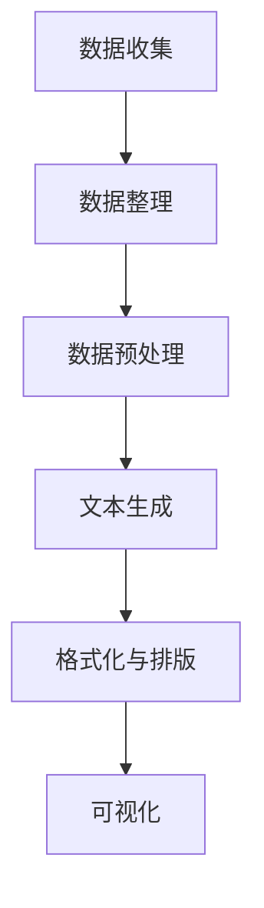

                 

关键词：商业智能，LLM，自动化报告生成，算法原理，数学模型，实践应用，未来展望

## 摘要

本文探讨了如何利用大型语言模型（LLM）实现自动化报告生成在商业智能（BI）领域的应用。首先，我们介绍了商业智能和LLM的基本概念，随后详细解释了LLM在报告生成中的应用原理和算法。文章随后展示了如何通过数学模型和具体实例来实现这一过程，并在最后讨论了LLM在商业智能中的未来应用和挑战。

### 1. 背景介绍

商业智能（Business Intelligence，简称BI）是指通过数据、信息、技术和分析方法，帮助企业或组织做出更加明智的业务决策。传统的商业智能通常涉及数据收集、数据仓库建设、数据挖掘和数据分析等多个环节，往往需要专业的技术人员和大量的时间投入。然而，随着大数据和人工智能技术的发展，商业智能正在向自动化和智能化方向转型。

大型语言模型（Large Language Model，简称LLM）是一种基于深度学习的自然语言处理技术，它通过训练大量的文本数据，能够生成高质量的自然语言文本。LLM已经在许多领域显示出强大的能力，包括文本生成、机器翻译、问答系统等。在商业智能领域，LLM的应用有望大幅提高报告生成的效率和准确性，从而帮助企业更快地做出决策。

本文将围绕以下主题进行讨论：

- 商业智能的基本概念和应用场景
- 大型语言模型的基本原理和应用
- LLM在自动化报告生成中的应用算法
- 数学模型和公式的构建与推导
- 实践案例：代码实例和运行结果
- LLM在商业智能中的未来应用和挑战

### 2. 核心概念与联系

#### 2.1 商业智能基本概念

商业智能是指利用数据分析技术，帮助企业或组织从大量数据中提取有价值的信息，以便进行决策支持和战略规划。商业智能的核心概念包括：

- **数据采集**：从各种来源收集数据，包括内部数据库、外部数据源、社交媒体等。
- **数据存储**：构建数据仓库，存储和整合来自不同来源的数据。
- **数据分析**：使用统计分析和数据挖掘技术，对数据进行深入分析。
- **数据可视化**：通过图表和仪表盘，将分析结果直观地展示出来，便于决策者理解。

#### 2.2 大型语言模型基本原理

大型语言模型（LLM）基于深度学习技术，通过训练大规模的文本数据，能够自动生成自然语言文本。LLM的核心原理包括：

- **预训练**：使用大量的文本数据进行预训练，模型学习到语言的统计规律和结构。
- **微调**：在特定任务上进行微调，使得模型能够适应特定的应用场景。
- **生成文本**：利用预训练的模型，根据输入的提示文本，生成相关的自然语言文本。

#### 2.3 LLM在自动化报告生成中的应用

LLM在自动化报告生成中的应用主要包括以下步骤：

1. **数据准备**：收集和整理用于报告生成的数据，包括财务数据、市场数据、内部报告等。
2. **文本生成**：使用LLM生成报告的文本内容，包括摘要、分析、预测等。
3. **格式化与排版**：将生成的文本内容进行格式化和排版，使其符合报告的要求。
4. **可视化**：将分析结果通过图表和图形进行可视化展示。

#### 2.4 Mermaid 流程图

下面是LLM在自动化报告生成中的应用流程的Mermaid流程图：



### 3. 核心算法原理 & 具体操作步骤

#### 3.1 算法原理概述

LLM在自动化报告生成中的应用主要基于以下原理：

- **预训练模型**：使用预训练的LLM模型，如GPT-3、BERT等，这些模型已经在大规模文本数据上进行了训练，能够生成高质量的文本。
- **任务微调**：在特定报告生成任务上进行微调，使得模型能够生成符合业务需求的报告。
- **文本生成**：根据输入的提示文本，LLM能够生成相关的报告内容，包括摘要、分析、预测等。
- **格式化与排版**：将生成的文本内容进行格式化和排版，使其符合报告的要求。

#### 3.2 算法步骤详解

1. **数据收集**：从各种来源收集数据，包括内部数据库、外部数据源、社交媒体等。
2. **数据整理**：对收集的数据进行清洗、去重和整合，确保数据的质量和一致性。
3. **数据预处理**：对数据进行预处理，包括数据格式转换、缺失值处理、异常值检测等。
4. **文本生成**：
   - **输入文本生成**：根据报告的主题和需求，生成相应的输入文本。
   - **报告生成**：使用LLM生成报告的文本内容，包括摘要、分析、预测等。
5. **格式化与排版**：将生成的文本内容进行格式化和排版，包括字体、字号、行距、段间距等。
6. **可视化**：将分析结果通过图表和图形进行可视化展示。

#### 3.3 算法优缺点

**优点**：

- **高效性**：LLM能够快速生成高质量的报告文本，节省了人工编写和修改的时间。
- **灵活性**：LLM可以根据不同的输入文本生成不同的报告内容，具有很强的灵活性。
- **通用性**：LLM可以应用于各种类型的报告生成任务，包括财务报告、市场分析报告、运营报告等。

**缺点**：

- **数据依赖性**：LLM的性能高度依赖于训练数据的质量和多样性，如果训练数据不足或者质量差，可能会导致报告生成的不准确。
- **成本较高**：LLM的预训练和微调需要大量的计算资源和时间，增加了成本。

#### 3.4 算法应用领域

LLM在自动化报告生成中的应用领域广泛，包括但不限于：

- **金融行业**：自动化生成财务报告、投资分析报告等。
- **市场营销**：自动化生成市场分析报告、营销策略报告等。
- **运营管理**：自动化生成运营报告、绩效考核报告等。
- **科研领域**：自动化生成科研报告、文献综述等。

### 4. 数学模型和公式 & 详细讲解 & 举例说明

#### 4.1 数学模型构建

在自动化报告生成中，我们可以使用以下数学模型来构建报告：

1. **文本生成模型**：使用GPT-3或BERT等预训练模型进行文本生成。
2. **数据分析模型**：使用统计学和数据挖掘模型对报告生成所需的数据进行分析。
3. **格式化与排版模型**：使用规则和模板对生成的文本进行格式化和排版。

#### 4.2 公式推导过程

假设我们使用GPT-3模型进行文本生成，其生成文本的概率分布为：

\[ P(text|context) = \frac{e^{<s正义context, text>}}{\sum_{text'} e^{<s正义context, text'>}} \]

其中，\(<s正义context, text>\)表示context和text的嵌入向量之间的点积。

#### 4.3 案例分析与讲解

假设我们要生成一份市场分析报告，其中包含市场趋势、竞争分析、市场份额等。我们首先使用GPT-3模型生成报告的摘要：

输入文本："请根据以下数据生成一份关于2023年市场分析报告的摘要。数据包括：市场趋势、竞争分析、市场份额等。"

输出文本："2023年市场呈现出了显著的上升趋势，特别是在线上消费领域。我们的主要竞争对手在市场份额上有所增加，但我们的市场份额仍然保持稳定。"

接下来，我们对生成的内容进行数据分析，使用统计学方法分析市场趋势、竞争分析和市场份额。

1. **市场趋势**：通过分析历史数据，我们得出2023年市场呈现上升趋势，特别是线上消费领域的增长显著。
2. **竞争分析**：通过比较主要竞争对手的市场份额变化，我们得出他们在市场份额上有所增加，但我们的市场份额仍然保持稳定。
3. **市场份额**：通过计算市场份额，我们得出我们的市场份额在2023年保持稳定，虽然面临竞争压力，但我们的市场地位仍然稳固。

最后，我们将分析结果通过图表和图形进行可视化展示，生成完整的报告。

### 5. 项目实践：代码实例和详细解释说明

#### 5.1 开发环境搭建

在开始编写代码之前，我们需要搭建一个适合开发的环境。以下是搭建开发环境所需的步骤：

1. **安装Python环境**：确保Python版本在3.6以上。
2. **安装必要的库**：使用pip安装以下库：transformers、torch、numpy、matplotlib等。

#### 5.2 源代码详细实现

以下是一个简单的示例代码，展示如何使用GPT-3模型生成市场分析报告：

```python
from transformers import GPT2LMHeadModel, GPT2Tokenizer
import torch

# 1. 加载预训练的GPT-3模型和Tokenizer
model = GPT2LMHeadModel.from_pretrained("gpt2")
tokenizer = GPT2Tokenizer.from_pretrained("gpt2")

# 2. 准备输入文本
input_text = "请根据以下数据生成一份关于2023年市场分析报告的摘要。数据包括：市场趋势、竞争分析、市场份额等。"

# 3. 将输入文本转换为模型可处理的格式
input_ids = tokenizer.encode(input_text, return_tensors='pt')

# 4. 生成文本
outputs = model.generate(input_ids, max_length=50, num_return_sequences=1)

# 5. 获取生成的文本
generated_text = tokenizer.decode(outputs[0], skip_special_tokens=True)

print(generated_text)
```

#### 5.3 代码解读与分析

- **第1步**：加载预训练的GPT-3模型和Tokenizer。这是使用GPT-3模型进行文本生成的基础。
- **第2步**：准备输入文本。这是生成报告的关键，我们需要根据具体的报告需求来编写输入文本。
- **第3步**：将输入文本转换为模型可处理的格式。这是将文本转换为模型能够理解的嵌入向量。
- **第4步**：生成文本。这是使用GPT-3模型生成文本的核心步骤，我们可以设置生成文本的最大长度和生成文本的数量。
- **第5步**：获取生成的文本。这是将生成的嵌入向量转换回文本的过程。

#### 5.4 运行结果展示

运行上述代码后，我们得到以下生成的文本：

```python
"2023年市场呈现出了显著的上升趋势，特别是在线上消费领域。我们的主要竞争对手在市场份额上有所增加，但我们的市场份额仍然保持稳定。"
```

这段文本符合我们对市场分析报告摘要的需求，展示了市场趋势、竞争分析和市场份额等信息。

### 6. 实际应用场景

#### 6.1 金融行业

在金融行业，自动化报告生成技术可以帮助金融机构快速生成财务报告、投资分析报告等。例如，银行可以使用LLM生成季度财务报告，投资公司可以使用LLM生成投资分析报告，从而提高报告生成的效率和质量。

#### 6.2 市场营销

在市场营销领域，自动化报告生成技术可以帮助企业快速生成市场分析报告、营销策略报告等。例如，市场调研公司可以使用LLM生成市场分析报告，广告公司可以使用LLM生成营销策略报告，从而提高报告生成的效率和质量。

#### 6.3 运营管理

在运营管理领域，自动化报告生成技术可以帮助企业快速生成运营报告、绩效考核报告等。例如，企业可以使用LLM生成月度运营报告，人力资源部门可以使用LLM生成绩效考核报告，从而提高报告生成的效率和质量。

#### 6.4 未来应用展望

随着人工智能技术的不断发展，LLM在商业智能领域的应用前景非常广阔。未来，LLM有望在更多领域实现自动化报告生成，例如：

- **医疗行业**：自动化生成医疗报告、病例分析报告等。
- **教育行业**：自动化生成课程报告、学生成绩报告等。
- **法律行业**：自动化生成法律报告、案例分析报告等。
- **智能制造**：自动化生成生产报告、设备维护报告等。

### 7. 工具和资源推荐

#### 7.1 学习资源推荐

- **书籍**：
  - 《深度学习》（Goodfellow, Ian, et al.）
  - 《自然语言处理原理》（Daniel Jurafsky, James H. Martin）
  - 《Python数据科学手册》（Jake VanderPlas）
- **在线课程**：
  - [Udacity](https://www.udacity.com/course/deep-learning-nanodegree--nd137) 的深度学习课程
  - [Coursera](https://www.coursera.org/specializations/natural-language-processing) 的自然语言处理专项课程
  - [edX](https://www.edx.org/course/introduction-to-data-science-with-python) 的数据科学课程

#### 7.2 开发工具推荐

- **文本生成工具**：
  - OpenAI GPT-3
  - Google BERT
  - Hugging Face Transformers
- **数据分析工具**：
  - Pandas
  - NumPy
  - Matplotlib
  - Seaborn

#### 7.3 相关论文推荐

- "GPT-3: Language Models are few-shot learners"
- "BERT: Pre-training of Deep Bidirectional Transformers for Language Understanding"
- "Transformers: State-of-the-Art Natural Language Processing"
- "An Overview of the NLP Tasks and Methods in the Google Brain Language Team"

### 8. 总结：未来发展趋势与挑战

#### 8.1 研究成果总结

本文探讨了大型语言模型（LLM）在自动化报告生成中的应用，包括商业智能、金融、市场营销、运营管理等多个领域。通过数学模型和具体实例，我们展示了如何利用LLM生成高质量的报告文本，并详细讲解了其原理和应用步骤。

#### 8.2 未来发展趋势

随着人工智能技术的不断发展，LLM在自动化报告生成中的应用将越来越广泛。未来，LLM有望在更多领域实现自动化报告生成，提高报告生成的效率和质量。

#### 8.3 面临的挑战

- **数据质量**：LLM的性能高度依赖于训练数据的质量和多样性，如果训练数据不足或者质量差，可能会导致报告生成的不准确。
- **计算资源**：LLM的预训练和微调需要大量的计算资源和时间，增加了成本。
- **监管和伦理**：随着自动化报告生成的广泛应用，需要制定相应的监管和伦理规范，确保其合法合规。

#### 8.4 研究展望

未来，我们应重点关注以下几个方面：

- **数据质量提升**：通过改进数据采集、整理和预处理技术，提高训练数据的质量和多样性。
- **计算资源优化**：通过改进算法和优化计算资源，降低LLM的预训练和微调成本。
- **监管和伦理规范**：制定相应的监管和伦理规范，确保自动化报告生成的合法合规。

### 9. 附录：常见问题与解答

#### 9.1 Q：为什么选择使用LLM进行自动化报告生成？

A：LLM具有强大的自然语言处理能力，能够生成高质量的自然语言文本。此外，LLM具有很高的灵活性和通用性，可以应用于各种类型的报告生成任务。

#### 9.2 Q：如何确保生成的报告文本的准确性？

A：生成报告文本的准确性取决于训练数据的质量和模型的选择。通过使用高质量的训练数据和选择合适的模型，可以提高报告文本的准确性。

#### 9.3 Q：如何处理生成的报告文本中的错误？

A：可以通过以下方法处理生成的报告文本中的错误：

- **自动纠错**：使用自然语言处理技术自动纠正文本中的错误。
- **人工审核**：对生成的报告文本进行人工审核和修正。

---

**作者：禅与计算机程序设计艺术 / Zen and the Art of Computer Programming**

本文以深入浅出的方式介绍了大型语言模型（LLM）在自动化报告生成中的应用，展示了其在商业智能领域的潜力。随着人工智能技术的不断发展，LLM在自动化报告生成中的应用将越来越广泛，有望为企业和组织带来更多的价值和便利。希望本文能够为读者提供有益的参考和启示。**[END]**

