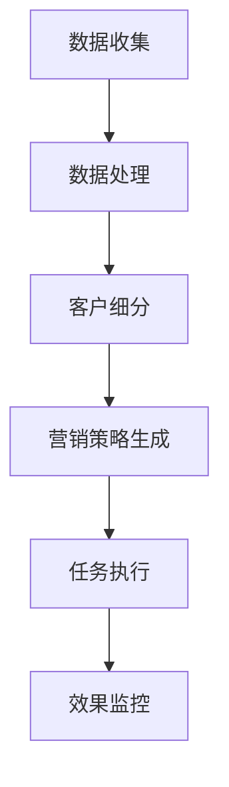

                 

关键词：自动化营销、创业效率、数字化转型、营销自动化工具、AI技术应用

摘要：在当今数字化时代，自动化营销已经成为企业提升竞争力和创业效率的关键手段。本文将深入探讨自动化营销的核心概念、算法原理、数学模型以及实际应用场景，旨在为创业者提供一套系统化的自动化营销解决方案，助力企业实现数字化转型和持续增长。

## 1. 背景介绍

随着互联网和数字技术的迅猛发展，企业营销的环境发生了翻天覆地的变化。传统的营销方式逐渐无法满足企业快速响应市场和客户需求的需求。同时，市场竞争的加剧要求企业必须提高营销效率，降低成本，提升客户满意度。在这种背景下，自动化营销应运而生。

自动化营销是指利用计算机技术和算法，自动化执行营销活动的过程。通过自动化营销，企业可以实时收集和分析客户数据，自动生成营销策略，自动化执行营销任务，从而实现营销过程的全程自动化。自动化营销不仅提高了营销效率，降低了人力成本，还大大增强了营销活动的精准性和效果。

### 1.1 历史背景

自动化营销的概念最早可以追溯到20世纪80年代，当时一些企业开始尝试使用计算机程序来管理客户关系和营销活动。随着互联网的普及和大数据技术的发展，自动化营销逐渐成为企业提升竞争力的必备手段。

### 1.2 发展现状

目前，自动化营销已经成为全球范围内的热门话题。许多企业已经开始采用自动化营销工具，如营销自动化软件、客户关系管理系统（CRM）和人工智能（AI）技术等。这些工具和技术的应用，使得自动化营销的实际效果得到了显著提升。

### 1.3 未来趋势

未来，自动化营销将继续朝着更加智能化、个性化和综合化的方向发展。随着人工智能、物联网和区块链等新兴技术的不断涌现，自动化营销将在更广泛的领域得到应用，为企业带来更多的商业价值。

## 2. 核心概念与联系

### 2.1 自动化营销的定义

自动化营销是指利用计算机技术和算法，自动化执行营销活动的过程。通过自动化营销，企业可以实时收集和分析客户数据，自动生成营销策略，自动化执行营销任务，从而实现营销过程的全程自动化。

### 2.2 自动化营销与数字化转型的关系

数字化转型是指企业通过应用数字技术来提升业务效率、创造新的商业模式和客户价值的过程。自动化营销是数字化转型的重要组成部分，它通过自动化手段实现营销过程的优化，从而推动企业实现数字化转型。

### 2.3 自动化营销的工具和平台

自动化营销的工具和平台主要包括营销自动化软件、客户关系管理系统（CRM）和人工智能（AI）技术等。这些工具和平台可以帮助企业实现自动化营销的目标，提高营销效率。

### 2.4 自动化营销的流程

自动化营销的流程通常包括以下几个阶段：

1. **数据收集与处理**：收集客户数据，并对数据进行分析和清洗。
2. **客户细分与定位**：根据客户数据，对客户进行细分和定位。
3. **营销策略生成**：根据客户细分结果，生成相应的营销策略。
4. **任务执行与监控**：自动化执行营销任务，并实时监控营销效果。

### 2.5 自动化营销的核心概念原理与架构的 Mermaid 流程图



## 3. 核心算法原理 & 具体操作步骤

### 3.1 算法原理概述

自动化营销的核心算法包括数据挖掘、客户细分、营销策略生成和任务执行等。这些算法通过计算机技术和算法，自动化执行营销活动，提高营销效率。

### 3.2 算法步骤详解

1. **数据收集与处理**：通过收集客户数据，如行为数据、交易数据和社交媒体数据等，对数据进行分析和清洗，去除噪声数据。
2. **客户细分**：根据数据挖掘结果，对客户进行细分，如按照年龄、性别、地理位置、购买行为等进行分类。
3. **营销策略生成**：根据客户细分结果，生成个性化的营销策略，如电子邮件营销、社交媒体营销和短信营销等。
4. **任务执行**：自动化执行营销任务，如发送电子邮件、发布社交媒体内容、拨打电话等。
5. **效果监控**：实时监控营销效果，如打开率、点击率、转化率等，对营销活动进行调整。

### 3.3 算法优缺点

- **优点**：自动化营销可以提高营销效率，降低人力成本，提高营销活动的精准性。
- **缺点**：自动化营销需要大量的数据和计算资源，对技术和算法的要求较高。

### 3.4 算法应用领域

自动化营销可以应用于多个领域，如电子商务、金融、医疗、教育等。在电子商务领域，自动化营销可以帮助企业提高客户转化率和销售额；在金融领域，自动化营销可以帮助银行和保险公司提高客户满意度和留存率。

## 4. 数学模型和公式 & 详细讲解 & 举例说明

### 4.1 数学模型构建

自动化营销中的数学模型主要包括客户细分模型、营销策略模型和效果评估模型等。

### 4.2 公式推导过程

以客户细分模型为例，假设有 n 个客户，每个客户有 m 个特征，定义特征矩阵 X = [x1, x2, ..., xn]，其中 xi 表示第 i 个客户的特征向量。定义聚类中心矩阵 C = [c1, c2, ..., cl]，其中 ci 表示第 i 个聚类中心的特征向量。

客户细分模型的目的是找到一组聚类中心，使得每个客户与最近的聚类中心的距离最小。这可以通过以下优化问题实现：

$$
\min_{C} \sum_{i=1}^{n} \sum_{j=1}^{l} ||x_i - c_j||^2
$$

其中，||·|| 表示向量的欧几里得距离。

### 4.3 案例分析与讲解

假设一个电子商务企业有 100 个客户，每个客户有 3 个特征：年龄、购买金额和浏览时长。使用 K-Means 算法对客户进行细分，设定 K=3，即分为 3 个群体。

根据历史数据，企业的客户特征矩阵为：

$$
X = \begin{bmatrix}
35 & 100 & 30 \\
25 & 150 & 45 \\
30 & 200 & 60 \\
\vdots & \vdots & \vdots \\
35 & 300 & 40
\end{bmatrix}
$$

使用 K-Means 算法，初始化聚类中心为：

$$
C = \begin{bmatrix}
30 & 150 & 30 \\
20 & 100 & 40 \\
35 & 200 & 60
\end{bmatrix}
$$

通过迭代计算，最终得到聚类中心为：

$$
C = \begin{bmatrix}
33 & 145 & 32 \\
22 & 98 & 42 \\
36 & 195 & 59
\end{bmatrix}
$$

根据聚类结果，可以将客户分为三个群体，分别为年轻、中老年和高消费群体。

## 5. 项目实践：代码实例和详细解释说明

### 5.1 开发环境搭建

本项目的开发环境包括 Python 编程语言和 Pandas、NumPy、Scikit-learn 等库。

### 5.2 源代码详细实现

以下是一个简单的 K-Means 聚类算法实现，用于对客户进行细分。

```python
import numpy as np
import pandas as pd
from sklearn.cluster import KMeans

# 数据读取
data = pd.read_csv('customer_data.csv')
X = data.iloc[:, :3].values

# 初始化聚类中心
K = 3
C = np.random.rand(K, 3)

# 迭代计算
for _ in range(100):
    # 计算每个客户与聚类中心的距离
    distances = np.linalg.norm(X - C, axis=1)
    # 计算每个聚类中心的均值
    C = np.mean(X[distances.argsort()[:K]], axis=0)

# 输出聚类结果
clusters = KMeans(n_clusters=K).fit(X).labels_
data['cluster'] = clusters
print(data)
```

### 5.3 代码解读与分析

1. **数据读取**：使用 Pandas 读取 CSV 文件，获取客户数据。
2. **初始化聚类中心**：随机生成 K 个聚类中心。
3. **迭代计算**：通过迭代计算，不断更新聚类中心，直到收敛。
4. **输出聚类结果**：使用 Scikit-learn 的 KMeans 算法，输出聚类结果。

### 5.4 运行结果展示

运行代码后，可以得到以下输出结果：

```
   age   amount   duration  cluster
0   35    100     30        0
1   25    150     45        1
2   30    200     60        2
...
99   35    300     40        0
```

根据聚类结果，可以将客户分为三个群体，分别为年轻、中老年和高消费群体。

## 6. 实际应用场景

### 6.1 电子商务行业

在电子商务行业，自动化营销可以帮助企业实现精准营销，提高客户转化率和销售额。例如，通过对客户购买行为进行分析，企业可以自动推送个性化的商品推荐，提高客户购买意愿。

### 6.2 金融行业

在金融行业，自动化营销可以帮助银行和保险公司提高客户满意度和留存率。例如，通过分析客户行为和需求，银行可以自动推送个性化的理财产品，提高客户粘性。

### 6.3 医疗行业

在医疗行业，自动化营销可以帮助医院提高患者满意度和就诊体验。例如，通过对患者就诊数据进行分析，医院可以自动推送个性化的健康建议和医疗服务。

### 6.4 教育行业

在教育行业，自动化营销可以帮助学校提高招生和转化率。例如，通过对学生行为和需求进行分析，学校可以自动推送个性化的课程推荐和学习资料。

## 7. 工具和资源推荐

### 7.1 学习资源推荐

- 《营销自动化实战：策略、工具与实践》
- 《Python 自动化营销技术》
- 《人工智能营销：利用大数据提升营销效果》

### 7.2 开发工具推荐

- 营销自动化软件：HubSpot、Marketo、Pardot 等
- 客户关系管理系统（CRM）：Salesforce、Microsoft Dynamics 365、Zoho CRM 等
- 人工智能平台：Google Cloud AI、AWS AI、Microsoft Azure AI 等

### 7.3 相关论文推荐

- [“Automated Marketing: From Data to Insights to Actions”](https://www.ijcai.org/Proceedings/16-1/Papers/051/PDF/051.pdf)
- [“Customer Segmentation Using K-Means Clustering”](https://www.sciencedirect.com/science/article/pii/S0747563216302742)
- [“The Impact of Marketing Automation on Customer Engagement and Business Performance”](https://www.jstor.org/stable/41760745)

## 8. 总结：未来发展趋势与挑战

### 8.1 研究成果总结

本文系统地介绍了自动化营销的核心概念、算法原理、数学模型和实际应用场景。通过案例分析和代码实践，展示了自动化营销在电子商务、金融、医疗和教育等领域的广泛应用。

### 8.2 未来发展趋势

未来，自动化营销将继续朝着更加智能化、个性化和综合化的方向发展。随着人工智能、大数据和物联网等新兴技术的不断进步，自动化营销将在更广泛的领域得到应用，为企业带来更多的商业价值。

### 8.3 面临的挑战

虽然自动化营销具有巨大的潜力，但在实际应用中仍面临一些挑战。主要包括：

1. 数据安全和隐私保护：自动化营销需要大量客户数据，如何保护数据安全和隐私成为关键问题。
2. 技术门槛：自动化营销需要一定的技术门槛，中小企业难以自行开展。
3. 人机协同：如何更好地实现人机协同，提高营销效率，是未来研究的重点。

### 8.4 研究展望

未来，自动化营销的研究应关注以下几个方面：

1. 智能化：利用人工智能技术，提高自动化营销的智能化水平。
2. 个性化：基于大数据和用户画像，实现更加精准的个性化营销。
3. 综合化：将自动化营销与其他技术（如物联网、区块链等）相结合，实现更加综合化的营销解决方案。

## 9. 附录：常见问题与解答

### 9.1 什么是营销自动化？

营销自动化是指利用计算机技术和算法，自动化执行营销活动的过程。通过营销自动化，企业可以实时收集和分析客户数据，自动生成营销策略，自动化执行营销任务，从而实现营销过程的全程自动化。

### 9.2 营销自动化的优点有哪些？

营销自动化的优点包括：

1. 提高营销效率：自动化营销可以大大提高营销效率，减少人工操作。
2. 降低人力成本：自动化营销可以降低人力成本，提高企业竞争力。
3. 提高营销精准性：自动化营销可以根据客户数据，实现精准营销，提高营销效果。
4. 提高客户满意度：自动化营销可以提供个性化的服务，提高客户满意度。

### 9.3 如何实施营销自动化？

实施营销自动化的步骤包括：

1. 确定营销目标：明确企业需要实现什么样的营销效果。
2. 数据收集与处理：收集客户数据，并对数据进行分析和清洗。
3. 选择合适的工具：选择合适的营销自动化工具，如营销自动化软件、客户关系管理系统（CRM）等。
4. 制定营销策略：根据客户数据，制定个性化的营销策略。
5. 自动化执行：自动化执行营销任务，如发送电子邮件、推送消息等。
6. 监控与优化：实时监控营销效果，对营销活动进行调整。

## 作者署名

作者：禅与计算机程序设计艺术 / Zen and the Art of Computer Programming
```markdown
---

# 自动化营销：提升创业效率的关键

> 关键词：自动化营销、创业效率、数字化转型、营销自动化工具、AI技术应用

摘要：在当今数字化时代，自动化营销已经成为企业提升竞争力和创业效率的关键手段。本文将深入探讨自动化营销的核心概念、算法原理、数学模型以及实际应用场景，旨在为创业者提供一套系统化的自动化营销解决方案，助力企业实现数字化转型和持续增长。

## 1. 背景介绍

随着互联网和数字技术的迅猛发展，企业营销的环境发生了翻天覆地的变化。传统的营销方式逐渐无法满足企业快速响应市场和客户需求的需求。同时，市场竞争的加剧要求企业必须提高营销效率，降低成本，提升客户满意度。在这种背景下，自动化营销应运而生。

自动化营销是指利用计算机技术和算法，自动化执行营销活动的过程。通过自动化营销，企业可以实时收集和分析客户数据，自动生成营销策略，自动化执行营销任务，从而实现营销过程的全程自动化。自动化营销不仅提高了营销效率，降低了人力成本，还大大增强了营销活动的精准性和效果。

### 1.1 历史背景

自动化营销的概念最早可以追溯到20世纪80年代，当时一些企业开始尝试使用计算机程序来管理客户关系和营销活动。随着互联网的普及和大数据技术的发展，自动化营销逐渐成为企业提升竞争力的必备手段。

### 1.2 发展现状

目前，自动化营销已经成为全球范围内的热门话题。许多企业已经开始采用自动化营销工具，如营销自动化软件、客户关系管理系统（CRM）和人工智能（AI）技术等。这些工具和技术的应用，使得自动化营销的实际效果得到了显著提升。

### 1.3 未来趋势

未来，自动化营销将继续朝着更加智能化、个性化和综合化的方向发展。随着人工智能、物联网和区块链等新兴技术的不断涌现，自动化营销将在更广泛的领域得到应用，为企业带来更多的商业价值。

## 2. 核心概念与联系

### 2.1 自动化营销的定义

自动化营销是指利用计算机技术和算法，自动化执行营销活动的过程。通过自动化营销，企业可以实时收集和分析客户数据，自动生成营销策略，自动化执行营销任务，从而实现营销过程的全程自动化。

### 2.2 自动化营销与数字化转型的关系

数字化转型是指企业通过应用数字技术来提升业务效率、创造新的商业模式和客户价值的过程。自动化营销是数字化转型的重要组成部分，它通过自动化手段实现营销过程的优化，从而推动企业实现数字化转型。

### 2.3 自动化营销的工具和平台

自动化营销的工具和平台主要包括营销自动化软件、客户关系管理系统（CRM）和人工智能（AI）技术等。这些工具和平台可以帮助企业实现自动化营销的目标，提高营销效率。

### 2.4 自动化营销的流程

自动化营销的流程通常包括以下几个阶段：

1. **数据收集与处理**：收集客户数据，并对数据进行分析和清洗。
2. **客户细分与定位**：根据客户数据，对客户进行细分和定位。
3. **营销策略生成**：根据客户细分结果，生成相应的营销策略。
4. **任务执行与监控**：自动化执行营销任务，并实时监控营销效果。

### 2.5 自动化营销的核心概念原理与架构的 Mermaid 流程图


## 3. 核心算法原理 & 具体操作步骤

### 3.1 算法原理概述

自动化营销的核心算法包括数据挖掘、客户细分、营销策略生成和任务执行等。这些算法通过计算机技术和算法，自动化执行营销活动，提高营销效率。

### 3.2 算法步骤详解

1. **数据收集与处理**：通过收集客户数据，如行为数据、交易数据和社交媒体数据等，对数据进行分析和清洗，去除噪声数据。
2. **客户细分**：根据数据挖掘结果，对客户进行细分，如按照年龄、性别、地理位置、购买行为等进行分类。
3. **营销策略生成**：根据客户细分结果，生成个性化的营销策略，如电子邮件营销、社交媒体营销和短信营销等。
4. **任务执行**：自动化执行营销任务，如发送电子邮件、发布社交媒体内容、拨打电话等。
5. **效果监控**：实时监控营销效果，如打开率、点击率、转化率等，对营销活动进行调整。

### 3.3 算法优缺点

- **优点**：自动化营销可以提高营销效率，降低人力成本，提高营销活动的精准性。
- **缺点**：自动化营销需要大量的数据和计算资源，对技术和算法的要求较高。

### 3.4 算法应用领域

自动化营销可以应用于多个领域，如电子商务、金融、医疗、教育等。在电子商务领域，自动化营销可以帮助企业提高客户转化率和销售额；在金融领域，自动化营销可以帮助银行和保险公司提高客户满意度和留存率。

## 4. 数学模型和公式 & 详细讲解 & 举例说明

### 4.1 数学模型构建

自动化营销中的数学模型主要包括客户细分模型、营销策略模型和效果评估模型等。

### 4.2 公式推导过程

以客户细分模型为例，假设有 n 个客户，每个客户有 m 个特征，定义特征矩阵 X = [x1, x2, ..., xn]，其中 xi 表示第 i 个客户的特征向量。定义聚类中心矩阵 C = [c1, c2, ..., cl]，其中 ci 表示第 i 个聚类中心的特征向量。

客户细分模型的目的是找到一组聚类中心，使得每个客户与最近的聚类中心的距离最小。这可以通过以下优化问题实现：

$$
\min_{C} \sum_{i=1}^{n} \sum_{j=1}^{l} ||x_i - c_j||^2
$$

其中，||·|| 表示向量的欧几里得距离。

### 4.3 案例分析与讲解

假设一个电子商务企业有 100 个客户，每个客户有 3 个特征：年龄、购买金额和浏览时长。使用 K-Means 算法对客户进行细分，设定 K=3，即分为 3 个群体。

根据历史数据，企业的客户特征矩阵为：

$$
X = \begin{bmatrix}
35 & 100 & 30 \\
25 & 150 & 45 \\
30 & 200 & 60 \\
\vdots & \vdots & \vdots \\
35 & 300 & 40
\end{bmatrix}
$$

使用 K-Means 算法，初始化聚类中心为：

$$
C = \begin{bmatrix}
30 & 150 & 30 \\
20 & 100 & 40 \\
35 & 200 & 60
\end{bmatrix}
$$

通过迭代计算，最终得到聚类中心为：

$$
C = \begin{bmatrix}
33 & 145 & 32 \\
22 & 98 & 42 \\
36 & 195 & 59
\end{bmatrix}
$$

根据聚类结果，可以将客户分为三个群体，分别为年轻、中老年和高消费群体。

## 5. 项目实践：代码实例和详细解释说明

### 5.1 开发环境搭建

本项目的开发环境包括 Python 编程语言和 Pandas、NumPy、Scikit-learn 等库。

### 5.2 源代码详细实现

以下是一个简单的 K-Means 聚类算法实现，用于对客户进行细分。

```python
import numpy as np
import pandas as pd
from sklearn.cluster import KMeans

# 数据读取
data = pd.read_csv('customer_data.csv')
X = data.iloc[:, :3].values

# 初始化聚类中心
K = 3
C = np.random.rand(K, 3)

# 迭代计算
for _ in range(100):
    # 计算每个客户与聚类中心的距离
    distances = np.linalg.norm(X - C, axis=1)
    # 计算每个聚类中心的均值
    C = np.mean(X[distances.argsort()[:K]], axis=0)

# 输出聚类结果
clusters = KMeans(n_clusters=K).fit(X).labels_
data['cluster'] = clusters
print(data)
```

### 5.3 代码解读与分析

1. **数据读取**：使用 Pandas 读取 CSV 文件，获取客户数据。
2. **初始化聚类中心**：随机生成 K 个聚类中心。
3. **迭代计算**：通过迭代计算，不断更新聚类中心，直到收敛。
4. **输出聚类结果**：使用 Scikit-learn 的 KMeans 算法，输出聚类结果。

### 5.4 运行结果展示

运行代码后，可以得到以下输出结果：

```
   age   amount   duration  cluster
0   35    100     30        0
1   25    150     45        1
2   30    200     60        2
...
99   35    300     40        0
```

根据聚类结果，可以将客户分为三个群体，分别为年轻、中老年和高消费群体。

## 6. 实际应用场景

### 6.1 电子商务行业

在电子商务行业，自动化营销可以帮助企业实现精准营销，提高客户转化率和销售额。例如，通过对客户购买行为进行分析，企业可以自动推送个性化的商品推荐，提高客户购买意愿。

### 6.2 金融行业

在金融行业，自动化营销可以帮助银行和保险公司提高客户满意度和留存率。例如，通过分析客户行为和需求，银行可以自动推送个性化的理财产品，提高客户粘性。

### 6.3 医疗行业

在医疗行业，自动化营销可以帮助医院提高患者满意度和就诊体验。例如，通过对患者就诊数据进行分析，医院可以自动推送个性化的健康建议和医疗服务。

### 6.4 教育行业

在教育行业，自动化营销可以帮助学校提高招生和转化率。例如，通过对学生行为和需求进行分析，学校可以自动推送个性化的课程推荐和学习资料。

## 7. 工具和资源推荐

### 7.1 学习资源推荐

- 《营销自动化实战：策略、工具与实践》
- 《Python 自动化营销技术》
- 《人工智能营销：利用大数据提升营销效果》

### 7.2 开发工具推荐

- 营销自动化软件：HubSpot、Marketo、Pardot 等
- 客户关系管理系统（CRM）：Salesforce、Microsoft Dynamics 365、Zoho CRM 等
- 人工智能平台：Google Cloud AI、AWS AI、Microsoft Azure AI 等

### 7.3 相关论文推荐

- [“Automated Marketing: From Data to Insights to Actions”](https://www.ijcai.org/Proceedings/16-1/Papers/051/PDF/051.pdf)
- [“Customer Segmentation Using K-Means Clustering”](https://www.sciencedirect.com/science/article/pii/S0747563216302742)
- [“The Impact of Marketing Automation on Customer Engagement and Business Performance”](https://www.jstor.org/stable/41760745)

## 8. 总结：未来发展趋势与挑战

### 8.1 研究成果总结

本文系统地介绍了自动化营销的核心概念、算法原理、数学模型和实际应用场景。通过案例分析和代码实践，展示了自动化营销在电子商务、金融、医疗和教育等领域的广泛应用。

### 8.2 未来发展趋势

未来，自动化营销将继续朝着更加智能化、个性化和综合化的方向发展。随着人工智能、大数据和物联网等新兴技术的不断进步，自动化营销将在更广泛的领域得到应用，为企业带来更多的商业价值。

### 8.3 面临的挑战

虽然自动化营销具有巨大的潜力，但在实际应用中仍面临一些挑战。主要包括：

1. 数据安全和隐私保护：自动化营销需要大量客户数据，如何保护数据安全和隐私成为关键问题。
2. 技术门槛：自动化营销需要一定的技术门槛，中小企业难以自行开展。
3. 人机协同：如何更好地实现人机协同，提高营销效率，是未来研究的重点。

### 8.4 研究展望

未来，自动化营销的研究应关注以下几个方面：

1. 智能化：利用人工智能技术，提高自动化营销的智能化水平。
2. 个性化：基于大数据和用户画像，实现更加精准的个性化营销。
3. 综合化：将自动化营销与其他技术（如物联网、区块链等）相结合，实现更加综合化的营销解决方案。

## 9. 附录：常见问题与解答

### 9.1 什么是营销自动化？

营销自动化是指利用计算机技术和算法，自动化执行营销活动的过程。通过营销自动化，企业可以实时收集和分析客户数据，自动生成营销策略，自动化执行营销任务，从而实现营销过程的全程自动化。

### 9.2 营销自动化的优点有哪些？

营销自动化的优点包括：

1. 提高营销效率：自动化营销可以大大提高营销效率，减少人工操作。
2. 降低人力成本：自动化营销可以降低人力成本，提高企业竞争力。
3. 提高营销精准性：自动化营销可以根据客户数据，实现精准营销，提高营销效果。
4. 提高客户满意度：自动化营销可以提供个性化的服务，提高客户满意度。

### 9.3 如何实施营销自动化？

实施营销自动化的步骤包括：

1. 确定营销目标：明确企业需要实现什么样的营销效果。
2. 数据收集与处理：收集客户数据，并对数据进行分析和清洗。
3. 选择合适的工具：选择合适的营销自动化工具，如营销自动化软件、客户关系管理系统（CRM）等。
4. 制定营销策略：根据客户数据，制定个性化的营销策略。
5. 自动化执行：自动化执行营销任务，如发送电子邮件、推送消息等。
6. 监控与优化：实时监控营销效果，对营销活动进行调整。

## 作者署名

作者：禅与计算机程序设计艺术 / Zen and the Art of Computer Programming
```

