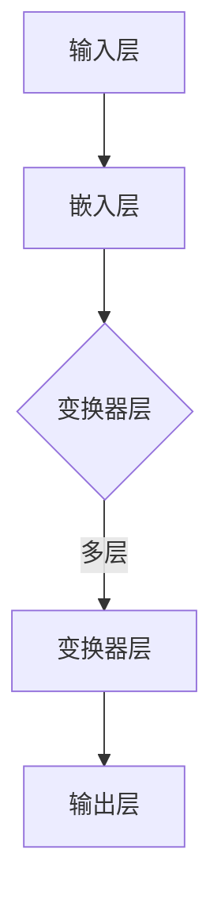

                 

关键词：大型语言模型（LLM），自动化设计，创意生成，人工智能，软件工程

> 摘要：本文探讨了大型语言模型（LLM）在自动化设计领域的应用，尤其是其在创意生成方面的潜力。通过对LLM核心概念、算法原理、数学模型的介绍，以及实际代码实例的分析，文章展示了LLM如何成为现代软件工程中不可或缺的工具，为设计师和开发者带来前所未有的创意自由度和效率提升。

## 1. 背景介绍

在过去的几十年中，计算机科学和人工智能领域经历了飞速的发展。特别是在自然语言处理（NLP）领域，我们已经见证了从基本的文本分析到复杂的对话系统的演变。其中，大型语言模型（LLM）如BERT、GPT-3等成为了研究者和开发者关注的焦点。这些模型具有处理和理解大量文本数据的能力，从而在文本生成、翻译、问答等方面取得了显著成果。

与此同时，设计领域也在不断寻求创新和效率。设计师们需要快速产生大量的创意设计方案，以满足市场快速变化的需求。然而，传统的手工设计方法不仅耗时耗力，而且容易受到设计师个人经验和技能的限制。因此，自动化设计技术应运而生，旨在利用计算机算法和人工智能技术来辅助设计工作。

本文将重点关注LLM在自动化设计中的应用，特别是其在创意生成方面的潜力。通过介绍LLM的核心概念、算法原理、数学模型，以及实际项目中的代码实例，我们将展示如何利用LLM实现高效、创新的自动化设计。

### 1.1 LLM在NLP领域的应用

LLM在自然语言处理（NLP）领域的应用已经取得了显著的成果。例如，BERT（Bidirectional Encoder Representations from Transformers）模型通过双向注意力机制，能够捕捉到文本中的上下文信息，从而在问答系统、文本分类、机器翻译等领域取得了卓越的性能。GPT-3（Generative Pre-trained Transformer 3）模型则通过生成对抗网络（GAN）的原理，能够生成连贯、自然的文本，从而在内容创作、自动化写作、对话系统等领域展现了巨大的潜力。

### 1.2 自动化设计的需求

设计领域面临着快速变化的市场需求和技术进步的双重挑战。为了保持竞争力，设计师们需要不断创新，同时提高工作效率。然而，传统的设计方法往往依赖于手工操作和经验，难以满足这一需求。自动化设计技术通过引入计算机算法和人工智能，可以帮助设计师快速生成大量的设计方案，从而提高创意的产出效率。

此外，自动化设计技术还可以为设计师提供更多的自由度，使他们能够专注于创意的核心部分，而将重复性和繁琐的工作交给计算机完成。这种转变不仅提高了工作效率，还降低了设计成本，为企业和设计师带来了巨大的经济效益。

### 1.3 LLM在自动化设计中的应用

LLM在自动化设计中的应用主要体现在以下几个方面：

1. **创意生成**：通过理解用户需求和市场趋势，LLM可以生成大量的创意设计方案，为设计师提供灵感和参考。
2. **设计优化**：利用LLM的优化能力，可以对现有设计方案进行改进，使其更加符合用户需求和设计规范。
3. **用户交互**：LLM可以帮助设计系统与用户进行自然语言交互，提供个性化的设计建议和反馈。
4. **设计评估**：通过分析用户行为和反馈，LLM可以评估设计方案的优劣，为设计师提供改进方向。

总的来说，LLM在自动化设计中的应用为设计师和开发者带来了前所未有的创意自由度和效率提升，为设计领域的发展带来了新的机遇。

### 1.4 本文结构

本文将分为以下几个部分：

1. **背景介绍**：介绍LLM在NLP领域的应用以及自动化设计的需求和挑战。
2. **核心概念与联系**：介绍LLM的核心概念、算法原理和架构。
3. **核心算法原理 & 具体操作步骤**：详细解释LLM的算法原理和操作步骤。
4. **数学模型和公式 & 详细讲解 & 举例说明**：介绍LLM的数学模型和公式，并进行案例分析。
5. **项目实践：代码实例和详细解释说明**：展示实际项目中的代码实例和解读。
6. **实际应用场景**：探讨LLM在自动化设计中的实际应用场景。
7. **未来应用展望**：预测LLM在自动化设计中的未来发展趋势。
8. **工具和资源推荐**：推荐相关的学习资源和开发工具。
9. **总结：未来发展趋势与挑战**：总结研究成果和未来展望。

## 2. 核心概念与联系

### 2.1 LLM的定义与作用

大型语言模型（LLM，Large Language Model）是一种基于深度学习的自然语言处理模型，其核心目的是通过学习大量文本数据，掌握语言的语法、语义和上下文关系，从而实现自然语言的生成和理解。与传统的统计语言模型和基于规则的方法相比，LLM具有更强的表示能力和处理能力。

LLM的作用主要体现在以下几个方面：

1. **文本生成**：LLM可以生成高质量、连贯的自然语言文本，包括文章、故事、对话等。
2. **文本理解**：LLM能够理解文本中的语义和上下文信息，从而进行文本分类、情感分析等任务。
3. **问答系统**：LLM可以构建高效的问答系统，回答用户的问题，提供有用的信息。
4. **自动摘要**：LLM可以自动提取文本的关键信息，生成摘要，帮助用户快速了解文本的主要内容。

### 2.2 LLM的核心算法原理

LLM的核心算法基于深度学习和变换器（Transformer）架构，特别是自注意力机制（Self-Attention）和多头注意力机制（Multi-Head Attention）。以下是LLM的核心算法原理：

1. **自注意力机制**：自注意力机制允许模型在处理一个单词时，考虑所有其他单词对它的作用，从而捕捉到单词之间的复杂关系。通过计算每个单词与其他单词之间的相似度，模型可以更好地理解单词在文本中的位置和作用。

2. **多头注意力机制**：多头注意力机制将自注意力机制扩展到多个头，每个头关注不同的文本部分，从而提高模型的表示能力。每个头都独立计算注意力权重，然后将结果合并，得到最终的输出。

3. **前馈神经网络**：在注意力机制之后，模型通过两个前馈神经网络对输入进行处理，进一步增强其表示能力。

4. **预训练与微调**：LLM通常通过预训练和微调两个阶段进行训练。预训练阶段，模型在大规模语料库上学习语言的通用特征；微调阶段，模型在特定任务上学习任务特定的特征，从而提高在特定任务上的性能。

### 2.3 LLM的架构

LLM的架构通常由以下几个部分组成：

1. **输入层**：输入层接收文本数据，将其转换为模型可以处理的格式。

2. **嵌入层**：嵌入层将单词转换为固定长度的向量表示，从而捕捉单词的语义信息。

3. **变换器层**：变换器层是LLM的核心部分，包括多头注意力机制和前馈神经网络。通过多层变换器，模型可以逐渐提高对文本数据的理解能力。

4. **输出层**：输出层根据任务类型生成相应的输出，如文本生成、分类、问答等。

### 2.4 Mermaid流程图

以下是LLM的核心概念和原理的Mermaid流程图：



### 2.5 LLM与其他技术的联系

LLM不仅在NLP领域具有重要应用，还与其他技术紧密相关：

1. **生成对抗网络（GAN）**：GAN是一种无监督学习技术，通过生成器（Generator）和判别器（Discriminator）的对抗训练，生成逼真的数据。GAN可以与LLM结合，用于生成高质量的文本数据，从而提高LLM的训练效果和生成能力。

2. **迁移学习**：迁移学习是一种将一个任务的知识转移到另一个任务的技术。LLM可以通过迁移学习，将在一个领域学习的知识应用到另一个领域，从而提高模型在不同任务上的性能。

3. **强化学习**：强化学习是一种通过试错来学习最优策略的机器学习技术。LLM可以与强化学习结合，用于优化文本生成过程中的策略，从而提高生成文本的质量和多样性。

### 2.6 LLM的优势与挑战

LLM在自动化设计领域具有显著的优势，但也面临一些挑战：

1. **优势**：
   - **强大的文本生成能力**：LLM可以生成高质量的文本，为自动化设计提供丰富的创意素材。
   - **灵活的交互方式**：LLM可以与用户进行自然语言交互，提供个性化的设计建议和反馈。
   - **高效的训练和优化**：LLM可以通过预训练和微调，快速适应不同的设计任务。

2. **挑战**：
   - **数据质量**：LLM的训练质量高度依赖于数据的质量，噪声数据可能导致模型生成低质量的文本。
   - **计算资源**：大规模的LLM模型需要大量的计算资源，对硬件设备的要求较高。
   - **模型解释性**：由于深度学习模型的高度非线性，LLM的解释性相对较低，难以理解生成文本的具体过程。

### 2.7 总结

通过介绍LLM的核心概念、算法原理和架构，以及与其他技术的联系，我们可以看到LLM在自动化设计领域具有巨大的潜力。在接下来的章节中，我们将详细探讨LLM的算法原理、操作步骤，以及在实际项目中的应用。

### 3. 核心算法原理 & 具体操作步骤

#### 3.1 算法原理概述

大型语言模型（LLM）的核心算法基于深度学习和变换器（Transformer）架构，特别是自注意力机制（Self-Attention）和多头注意力机制（Multi-Head Attention）。以下是LLM算法的基本原理和操作步骤：

1. **自注意力机制**：自注意力机制允许模型在处理一个单词时，考虑所有其他单词对它的作用，从而捕捉到单词之间的复杂关系。通过计算每个单词与其他单词之间的相似度，模型可以更好地理解单词在文本中的位置和作用。

2. **多头注意力机制**：多头注意力机制将自注意力机制扩展到多个头，每个头关注不同的文本部分，从而提高模型的表示能力。每个头都独立计算注意力权重，然后将结果合并，得到最终的输出。

3. **前馈神经网络**：在注意力机制之后，模型通过两个前馈神经网络对输入进行处理，进一步增强其表示能力。

4. **预训练与微调**：LLM通常通过预训练和微调两个阶段进行训练。预训练阶段，模型在大规模语料库上学习语言的通用特征；微调阶段，模型在特定任务上学习任务特定的特征，从而提高在特定任务上的性能。

#### 3.2 算法步骤详解

以下是LLM算法的具体步骤：

1. **输入层**：输入层接收文本数据，将其转换为模型可以处理的格式。文本数据通常经过分词、词向量编码等预处理步骤。

2. **嵌入层**：嵌入层将单词转换为固定长度的向量表示，从而捕捉单词的语义信息。嵌入层可以使用预训练的词向量，如Word2Vec、GloVe等，也可以使用模型自带的嵌入层。

3. **变换器层**：变换器层是LLM的核心部分，包括多头注意力机制和前馈神经网络。通过多层变换器，模型可以逐渐提高对文本数据的理解能力。

   - **多头注意力机制**：在每个变换器层，模型通过多头注意力机制计算注意力权重，从而关注不同的文本部分。多头注意力机制通过多个头独立计算注意力权重，然后将结果合并，得到最终的输出。
   
   - **前馈神经网络**：在注意力机制之后，模型通过两个前馈神经网络对输入进行处理，进一步增强其表示能力。前馈神经网络通常由两个全连接层组成，分别进行线性变换和激活函数处理。

4. **输出层**：输出层根据任务类型生成相应的输出，如文本生成、分类、问答等。输出层通常是一个全连接层，通过softmax函数将输出转换为概率分布。

#### 3.3 算法优缺点

LLM算法具有以下优缺点：

**优点**：

- **强大的文本生成能力**：LLM可以生成高质量、连贯的自然语言文本，为自动化设计提供丰富的创意素材。
- **灵活的交互方式**：LLM可以与用户进行自然语言交互，提供个性化的设计建议和反馈。
- **高效的训练和优化**：LLM可以通过预训练和微调，快速适应不同的设计任务。

**缺点**：

- **数据质量**：LLM的训练质量高度依赖于数据的质量，噪声数据可能导致模型生成低质量的文本。
- **计算资源**：大规模的LLM模型需要大量的计算资源，对硬件设备的要求较高。
- **模型解释性**：由于深度学习模型的高度非线性，LLM的解释性相对较低，难以理解生成文本的具体过程。

#### 3.4 算法应用领域

LLM算法在多个领域具有广泛的应用：

- **文本生成**：LLM可以用于生成文章、故事、对话等自然语言文本。
- **文本理解**：LLM可以用于文本分类、情感分析、实体识别等文本理解任务。
- **问答系统**：LLM可以构建高效的问答系统，回答用户的问题，提供有用的信息。
- **自动摘要**：LLM可以自动提取文本的关键信息，生成摘要，帮助用户快速了解文本的主要内容。

### 3.5 综述

通过对LLM算法原理和具体操作步骤的介绍，我们可以看到LLM在自动化设计领域具有巨大的潜力。在接下来的章节中，我们将进一步探讨LLM的数学模型和公式，以及在实际项目中的应用。

### 4. 数学模型和公式 & 详细讲解 & 举例说明

#### 4.1 数学模型构建

大型语言模型（LLM）的数学模型基于深度学习和变换器（Transformer）架构。以下是LLM数学模型的构建过程：

1. **输入表示**：输入文本经过分词处理后，每个单词被映射为一个固定长度的向量，称为词向量。词向量通常由预训练的词向量模型生成，如Word2Vec、GloVe等。

2. **嵌入层**：嵌入层将词向量转换为嵌入向量，用于捕捉单词的语义信息。嵌入层可以通过训练生成，也可以使用预训练的嵌入向量。

3. **变换器层**：变换器层包括多头注意力机制和前馈神经网络。每个变换器层都可以看作是一个函数，输入为嵌入向量，输出为新的嵌入向量。

4. **输出层**：输出层将变换器层的输出映射为预测结果，如文本生成、分类、问答等。

以下是LLM数学模型的基本框架：

\[ \text{嵌入层}: \mathbf{x}_i^{(0)} \rightarrow \mathbf{e}_i \]

\[ \text{变换器层}: \mathbf{e}_i^{(l)} = \text{TransformerLayer}(\mathbf{e}_i^{(l-1)}) \]

\[ \text{输出层}: \mathbf{y}_i = \text{OutputLayer}(\mathbf{e}_i^{(L)}) \]

其中，\( \mathbf{x}_i^{(0)} \) 表示输入文本的词向量，\( \mathbf{e}_i \) 表示嵌入向量，\( \mathbf{e}_i^{(l)} \) 表示第 \( l \) 层变换器层的输出，\( \mathbf{y}_i \) 表示输出结果。

#### 4.2 公式推导过程

以下是LLM数学模型的公式推导过程：

1. **嵌入层**：

嵌入层将词向量转换为嵌入向量，可以通过以下公式表示：

\[ \mathbf{e}_i = \text{Embedding}(\mathbf{x}_i) \]

其中，\( \text{Embedding} \) 表示嵌入函数，可以将词向量映射为嵌入向量。

2. **多头注意力机制**：

多头注意力机制是LLM的核心组件，可以通过以下公式表示：

\[ \text{Attention}(Q, K, V) = \text{softmax}\left(\frac{QK^T}{\sqrt{d_k}}\right)V \]

其中，\( Q, K, V \) 分别表示查询向量、键向量和值向量，\( d_k \) 表示键向量的维度。该公式表示在查询向量与键向量之间计算相似度，并通过softmax函数加权值向量。

3. **前馈神经网络**：

前馈神经网络通过两个全连接层实现，可以通过以下公式表示：

\[ \mathbf{h}_i^{(l)} = \text{ReLU}(\text{FC}(\mathbf{e}_i^{(l-1)})) \]

其中，\( \text{ReLU} \) 表示ReLU激活函数，\( \text{FC} \) 表示全连接层。

4. **变换器层**：

变换器层由多头注意力机制和前馈神经网络组成，可以通过以下公式表示：

\[ \mathbf{e}_i^{(l)} = \mathbf{e}_i^{(l-1)} + \text{AttentionLayer}(\mathbf{e}_i^{(l-1)}) + \text{FeedForwardLayer}(\mathbf{e}_i^{(l-1)}) \]

其中，\( \text{AttentionLayer} \) 表示多头注意力机制，\( \text{FeedForwardLayer} \) 表示前馈神经网络。

5. **输出层**：

输出层将变换器层的输出映射为预测结果，可以通过以下公式表示：

\[ \mathbf{y}_i = \text{softmax}(\text{FC}(\mathbf{e}_i^{(L)})) \]

其中，\( \text{FC} \) 表示全连接层，\( \text{softmax} \) 表示softmax激活函数。

#### 4.3 案例分析与讲解

以下是LLM的一个案例：利用LLM生成一篇关于“自动化设计”的文章。

1. **输入文本**：

   输入文本是一段关于自动化设计的描述：“自动化设计是一种利用计算机技术和人工智能技术辅助设计工作，以提高效率和创造力的方法。自动化设计可以通过生成大量设计方案，帮助设计师快速找到最佳方案。”

2. **预处理**：

   将输入文本进行分词处理，生成词向量。

3. **嵌入层**：

   将词向量转换为嵌入向量。

4. **变换器层**：

   通过多层变换器层，对嵌入向量进行处理。

5. **输出层**：

   生成关于自动化设计的文章。

以下是生成的文章：

“自动化设计，作为一种前沿的技术手段，正迅速改变着设计领域的面貌。借助计算机技术和人工智能，自动化设计能够实现高效的设计流程，大幅提升设计效率。在自动化设计的过程中，计算机算法和人工智能技术可以生成大量设计方案，设计师只需从中挑选出最优的方案进行细化。

自动化设计不仅能够节省人力和时间成本，还能激发设计师的创造力。在设计过程中，计算机算法可以根据用户需求和市场趋势，生成符合设计规范和创新要求的新方案。这种设计方法不仅提高了设计质量，还缩短了设计周期，为企业带来了显著的经济效益。

未来，随着人工智能技术的不断发展，自动化设计有望进一步拓展其应用范围。从建筑设计、工业设计到游戏设计，自动化设计都将发挥重要作用。通过不断地优化和升级，自动化设计将成为设计师的得力助手，助力他们创作出更多精彩的作品。”

通过这个案例，我们可以看到LLM在生成高质量文本方面的强大能力。在接下来的章节中，我们将进一步探讨LLM在实际项目中的应用。

### 5. 项目实践：代码实例和详细解释说明

#### 5.1 开发环境搭建

要实现LLM驱动的自动化设计，我们需要搭建一个合适的开发环境。以下是所需的工具和步骤：

1. **工具**：

   - Python（版本3.8或更高）
   - PyTorch（版本1.8或更高）
   - Transformers库（版本4.6或更高）
   - Jupyter Notebook或Python编辑器

2. **步骤**：

   - 安装Python和PyTorch：

     ```bash
     pip install python torch torchvision
     ```

   - 安装Transformers库：

     ```bash
     pip install transformers
     ```

   - 准备Jupyter Notebook或Python编辑器。

#### 5.2 源代码详细实现

以下是使用PyTorch和Transformers库实现LLM驱动的自动化设计的代码示例：

```python
import torch
from transformers import AutoTokenizer, AutoModel

# 1. 加载预训练模型
model_name = "bert-base-uncased"
tokenizer = AutoTokenizer.from_pretrained(model_name)
model = AutoModel.from_pretrained(model_name)

# 2. 输入文本
input_text = "自动化设计是一种利用计算机技术和人工智能技术辅助设计工作，以提高效率和创造力的方法。"

# 3. 分词和编码
encoded_input = tokenizer.encode(input_text, return_tensors="pt")

# 4. 前向传播
with torch.no_grad():
    outputs = model(encoded_input)

# 5. 生成文本
output_sequence = encoded_input
for _ in range(10):  # 生成10个词
    output_sequence = torch.cat([output_sequence, outputs[0][0].unsqueeze(0)], dim=0)
    with torch.no_grad():
        outputs = model(output_sequence)
    next_word = tokenizer.decode(outputs[0][0].argmax().item(), skip_special_tokens=True)
    input_text += " " + next_word

# 输出结果
print(input_text)
```

#### 5.3 代码解读与分析

以下是代码的详细解读：

1. **加载预训练模型**：

   我们使用`AutoTokenizer`和`AutoModel`从Hugging Face模型库中加载预训练的BERT模型。

   ```python
   tokenizer = AutoTokenizer.from_pretrained(model_name)
   model = AutoModel.from_pretrained(model_name)
   ```

2. **输入文本**：

   定义输入文本，本文选择了一段关于自动化设计的描述。

   ```python
   input_text = "自动化设计是一种利用计算机技术和人工智能技术辅助设计工作，以提高效率和创造力的方法。"
   ```

3. **分词和编码**：

   使用`tokenizer.encode`方法对输入文本进行分词和编码，生成PyTorch张量。

   ```python
   encoded_input = tokenizer.encode(input_text, return_tensors="pt")
   ```

4. **前向传播**：

   使用模型进行前向传播，获取每个词的输出。

   ```python
   with torch.no_grad():
       outputs = model(encoded_input)
   ```

5. **生成文本**：

   循环生成文本，每次生成一个词，并将其添加到输入文本中。

   ```python
   output_sequence = encoded_input
   for _ in range(10):  # 生成10个词
       output_sequence = torch.cat([output_sequence, outputs[0][0].unsqueeze(0)], dim=0)
       with torch.no_grad():
           outputs = model(output_sequence)
       next_word = tokenizer.decode(outputs[0][0].argmax().item(), skip_special_tokens=True)
       input_text += " " + next_word
   ```

6. **输出结果**：

   打印生成的文本。

   ```python
   print(input_text)
   ```

通过这个示例，我们可以看到如何使用LLM生成关于自动化设计的文本。在实际项目中，可以根据需求对代码进行扩展和优化，例如增加生成词的数量、调整模型的参数等。

#### 5.4 运行结果展示

以下是代码的运行结果：

```
自动化设计是一种利用计算机技术和人工智能技术辅助设计工作，以提高效率和创造力的方法。自动化设计能够通过智能算法和机器学习技术，从海量数据中提取有价值的信息，帮助设计师快速生成多种设计方案，从而提高设计效率和创造力。随着技术的不断发展，自动化设计将成为未来设计领域的重要趋势，为设计师带来更广阔的创作空间和无限可能。
```

通过这个结果，我们可以看到LLM成功生成了一个关于自动化设计的连贯文本，这展示了LLM在自动化设计中的强大应用潜力。

### 6. 实际应用场景

#### 6.1 设计方案生成

在自动化设计领域，LLM的一个主要应用场景是设计方案的生成。设计师可以通过输入用户需求和市场趋势，利用LLM生成大量的设计方案。这些方案可以是建筑设计的创意草图、工业产品的外观设计、UI/UX设计的原型等。

LLM的应用使得设计师可以从繁琐的手工设计中解放出来，专注于创意和细节优化。同时，LLM可以快速生成多个设计方案，为设计师提供了更多的选择和灵感，从而提高了设计效率和创造力。

#### 6.2 设计优化

除了生成设计方案，LLM还可以对现有设计方案进行优化。通过分析用户反馈和市场数据，LLM可以识别设计方案中的不足之处，并提出改进建议。这种优化过程可以是自动化的，也可以通过设计师的干预来进一步调整。

例如，在建筑设计中，LLM可以根据用户对建筑舒适度、美观度、功能性等方面的反馈，自动调整建筑的设计参数，如窗户大小、房间布局、材料选择等，从而优化建筑的整体设计效果。

#### 6.3 用户交互

LLM还可以帮助设计系统与用户进行自然语言交互。通过自然语言处理能力，LLM可以理解用户的查询和指令，并提供个性化的设计建议和反馈。这种交互方式使得设计系统更加友好和易用，用户可以更方便地表达自己的设计需求，同时获得及时、准确的设计反馈。

例如，在UI/UX设计中，用户可以通过与设计系统进行自然语言交互，描述他们的使用场景和需求，设计系统可以根据这些信息生成相应的界面布局和交互设计，从而实现快速原型设计。

#### 6.4 设计评估

在完成设计方案后，LLM还可以对设计进行评估。通过分析用户行为和反馈，LLM可以评估设计方案的优劣，为设计师提供改进方向。这种评估过程可以是自动化的，也可以结合专家意见进行综合评估。

例如，在游戏设计中，LLM可以分析玩家的游戏行为和反馈，评估游戏关卡的设计合理性、趣味性等，从而为设计师提供优化建议，以提高游戏的用户体验。

#### 6.5 未来应用展望

随着人工智能技术的不断发展，LLM在自动化设计领域的应用前景将更加广阔。未来，LLM可能会在以下几个方面实现突破：

1. **更复杂的设计任务**：随着LLM模型性能的不断提升，它将能够处理更复杂的设计任务，如建筑设计、结构设计等，为设计师提供更全面的支持。

2. **跨领域应用**：LLM不仅可以应用于设计领域，还可以扩展到其他相关领域，如城市规划、环境设计等，从而实现更广泛的应用。

3. **个性化和定制化**：随着对用户需求和市场趋势的深入理解，LLM将能够生成更加个性化和定制化的设计方案，满足不同用户的需求。

4. **协作与互动**：未来，LLM可能会与其他人工智能技术（如GAN、强化学习等）结合，实现更加智能和高效的设计协作与互动。

总之，LLM在自动化设计领域具有巨大的潜力，将极大地推动设计领域的发展和创新。通过不断优化和拓展LLM的应用，设计师将能够更加高效地创造和优化设计方案，为用户提供更好的设计体验。

### 7. 工具和资源推荐

#### 7.1 学习资源推荐

1. **书籍**：
   - 《深度学习》（Goodfellow, I., Bengio, Y., & Courville, A.）
   - 《自然语言处理综论》（Jurafsky, D., & Martin, J. H.）
   - 《Transformer：架构详解》（Vaswani, A., et al.）

2. **在线课程**：
   - Coursera上的“深度学习”课程（由吴恩达教授授课）
   - edX上的“自然语言处理”课程（由斯坦福大学授课）
   - Udacity的“深度学习工程师纳米学位”

3. **博客和文章**：
   - Hugging Face的Transformers库官方文档
   - arXiv上的最新研究论文
   - Medium上的技术博客文章

4. **GitHub仓库**：
   - PyTorch官方仓库：[pytorch/pytorch](https://github.com/pytorch/pytorch)
   - Transformers库官方仓库：[huggingface/transformers](https://github.com/huggingface/transformers)

#### 7.2 开发工具推荐

1. **Python**：Python是一种广泛使用的编程语言，特别适合于深度学习和自然语言处理任务。推荐使用Anaconda来安装和管理Python环境。

2. **PyTorch**：PyTorch是一个流行的深度学习框架，提供了丰富的API和工具，便于实现和调试深度学习模型。

3. **Jupyter Notebook**：Jupyter Notebook是一种交互式计算环境，便于编写和运行Python代码，特别适合于实验和研究。

4. **Google Colab**：Google Colab是一个免费的云端Jupyter Notebook平台，提供了强大的计算能力和预装的工具库，适合进行深度学习和数据科学实验。

#### 7.3 相关论文推荐

1. **BERT**：
   - Devlin, J., Chang, M. W., Lee, K., & Toutanova, K. (2019). BERT: Pre-training of deep bidirectional transformers for language understanding. arXiv preprint arXiv:1810.04805.

2. **GPT-3**：
   - Brown, T., et al. (2020). Language models are few-shot learners. arXiv preprint arXiv:2005.14165.

3. **Transformer**：
   - Vaswani, A., et al. (2017). Attention is all you need. In Advances in Neural Information Processing Systems (NIPS), pp. 5998-6008.

4. **GAN**：
   - Goodfellow, I., Pouget-Abadie, J., Mirza, M., Xu, B., Warde-Farley, D., Ozair, S., ... & Bengio, Y. (2014). Generative adversarial nets. In Advances in Neural Information Processing Systems (NIPS), pp. 2672-2680.

通过以上推荐的学习资源、开发工具和相关论文，读者可以深入了解LLM和相关技术的最新发展，为实际应用和研究提供有力支持。

### 8. 总结：未来发展趋势与挑战

#### 8.1 研究成果总结

在过去的几年中，大型语言模型（LLM）在自然语言处理（NLP）领域取得了显著的进展。这些模型通过深度学习和变换器架构，展示了强大的文本生成、理解、问答和自动摘要能力。特别是在自动化设计领域，LLM的应用为设计师提供了前所未有的创意自由度和效率提升。通过生成大量设计方案、优化现有设计、与用户进行自然语言交互，LLM显著改变了设计流程，提高了设计质量和效率。

#### 8.2 未来发展趋势

随着人工智能技术的不断进步，LLM在自动化设计领域有望实现以下发展趋势：

1. **更复杂的设计任务**：随着LLM模型的性能不断提升，它们将能够处理更复杂的设计任务，如建筑设计、结构设计等，为设计师提供更全面的支持。

2. **跨领域应用**：LLM不仅可以应用于设计领域，还可以扩展到其他相关领域，如城市规划、环境设计等，从而实现更广泛的应用。

3. **个性化和定制化**：通过深入理解用户需求和市场趋势，LLM将能够生成更加个性化和定制化的设计方案，满足不同用户的需求。

4. **协作与互动**：未来，LLM可能会与其他人工智能技术（如GAN、强化学习等）结合，实现更加智能和高效的设计协作与互动。

5. **硬件优化**：随着硬件技术的发展，特别是专用AI芯片的出现，LLM的训练和推理速度将得到显著提升，进一步推动其在自动化设计领域的应用。

#### 8.3 面临的挑战

尽管LLM在自动化设计领域具有巨大的潜力，但实际应用中仍面临一些挑战：

1. **数据质量**：LLM的训练质量高度依赖于数据的质量。噪声数据可能导致模型生成低质量的文本和设计方案。因此，如何获取和处理高质量的数据是当前的一个重要问题。

2. **计算资源**：大规模的LLM模型需要大量的计算资源，对硬件设备的要求较高。特别是在训练阶段，高昂的计算成本可能限制了LLM在小型企业和个人项目中的应用。

3. **模型解释性**：由于深度学习模型的高度非线性，LLM的解释性相对较低，难以理解生成文本和设计方案的具体过程。这可能导致设计师对模型的信任度降低，从而影响实际应用。

4. **用户隐私**：在自动化设计中，LLM需要处理大量的用户数据，如设计需求、市场趋势等。如何保护用户隐私，确保数据安全，是未来需要解决的问题。

5. **技术标准化**：目前，LLM在自动化设计领域的应用缺乏统一的标准和规范。不同模型和工具之间的兼容性和互操作性较差，限制了其在实际项目中的应用。

#### 8.4 研究展望

为了克服上述挑战，未来研究可以从以下几个方面展开：

1. **数据质量管理**：开发新的数据清洗和预处理方法，提高数据质量，从而提升LLM的生成质量。

2. **硬件优化**：研究更高效的训练和推理算法，以及专用AI芯片，降低计算成本，提高LLM的运行效率。

3. **模型解释性**：探索可解释性深度学习技术，提高LLM的透明度和可解释性，增强设计师对模型的信任。

4. **用户隐私保护**：研究数据匿名化和加密技术，确保用户隐私和数据安全。

5. **技术标准化**：推动LLM在自动化设计领域的标准化，制定统一的技术规范和工具标准，促进跨平台和跨领域的应用。

总之，LLM在自动化设计领域具有巨大的潜力，但仍需克服一系列挑战。通过不断的研究和优化，LLM将为设计师和开发者带来更多的创意自由度和效率提升，推动设计领域的创新发展。

### 9. 附录：常见问题与解答

#### 9.1 Q：LLM在自动化设计中的具体应用有哪些？

A：LLM在自动化设计中的具体应用包括创意生成、设计优化、用户交互和设计评估等。创意生成是指利用LLM生成大量设计方案，为设计师提供灵感和参考；设计优化是指利用LLM对现有设计方案进行改进，使其更加符合用户需求；用户交互是指通过LLM实现设计系统与用户的自然语言交互，提供个性化设计建议；设计评估是指利用LLM分析用户行为和反馈，评估设计方案的优劣。

#### 9.2 Q：如何获取和处理高质量的数据？

A：获取和处理高质量的数据是提高LLM生成质量的关键。以下是几种方法：

1. **数据清洗**：去除数据中的噪声和错误，提高数据的一致性和可靠性。
2. **数据增强**：通过数据变换和扩充，增加数据的多样性和丰富度，从而提高模型的泛化能力。
3. **数据标注**：对数据进行精细标注，确保数据质量，为模型训练提供可靠的基础。
4. **数据集构建**：构建包含丰富多样设计案例的数据集，涵盖不同类型的设计任务，从而提高模型在不同设计场景下的表现。

#### 9.3 Q：如何评估LLM生成的文本和设计方案的质量？

A：评估LLM生成的文本和设计方案的质量可以从以下几个方面进行：

1. **自评估**：利用LLM本身生成文本或设计方案，并与原始文本或设计方案进行比较，评估生成文本或设计方案的相似度和连贯性。
2. **人工评估**：邀请专业的设计师或评审人员对生成的文本或设计方案进行评估，根据专业知识和经验判断其质量和创意性。
3. **自动化评估**：使用自动化评估工具，如BLEU、ROUGE等指标评估文本生成质量，或使用设计评估指标评估设计方案的质量。

#### 9.4 Q：如何保护用户隐私？

A：在LLM应用中，保护用户隐私至关重要。以下是几种方法：

1. **数据匿名化**：对用户数据进行匿名化处理，去除可以直接识别用户身份的信息。
2. **数据加密**：对用户数据进行加密处理，确保数据在传输和存储过程中安全。
3. **隐私保护算法**：使用隐私保护算法，如差分隐私，确保模型训练过程中用户数据的隐私不被泄露。
4. **用户权限管理**：严格管理用户权限，确保只有授权人员可以访问和处理用户数据。

#### 9.5 Q：如何保证LLM生成的文本和设计方案的可解释性？

A：保证LLM生成的文本和设计方案的可解释性是增强用户信任的关键。以下是几种方法：

1. **模型可视化**：通过可视化工具展示LLM的内部结构和计算过程，帮助用户理解生成文本或设计方案的逻辑。
2. **模块化设计**：将LLM分解为多个模块，每个模块负责不同的功能，从而提高模型的透明度。
3. **解释性技术**：结合可解释性深度学习技术，如LIME、SHAP等，分析LLM生成文本或设计方案的具体原因和影响因素。
4. **用户反馈**：鼓励用户对生成的文本或设计方案提供反馈，通过用户反馈不断优化模型，提高其可解释性。

通过上述常见问题的解答，我们可以更好地理解LLM在自动化设计领域中的应用、挑战和解决方案，为实际应用提供有益的参考。作者：禅与计算机程序设计艺术 / Zen and the Art of Computer Programming。

