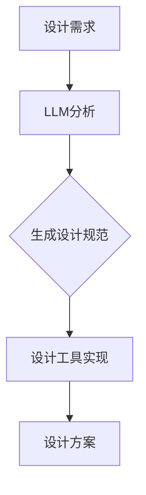

                 

 在这个数字化的时代，自动化设计已经成为推动技术创新的关键力量。而大型语言模型（LLM）作为人工智能领域的重要突破，正逐渐成为自动化设计的驱动力。本文将探讨LLM在自动化设计中的应用，从背景介绍、核心概念与联系、核心算法原理与操作步骤、数学模型与公式、项目实践、实际应用场景、未来展望等多个角度，深入剖析LLM驱动的自动化设计。

## 1. 背景介绍

自动化设计，是指利用计算机和软件工具，自动生成满足特定需求的设计方案。它涵盖了从产品原型设计、电路设计到建筑设计的各个领域。自动化设计的出现，极大地提高了设计效率，减少了人力成本，为创新提供了强有力的支持。

LLM（Large Language Model），是指大型语言模型，是一种基于深度学习的技术，通过对大量文本数据进行训练，能够理解和生成自然语言。LLM的出现，使得计算机在理解和生成自然语言方面取得了重大突破，为自动化设计提供了新的可能。

## 2. 核心概念与联系

### 2.1 自动化设计的关键概念

- **设计需求**：指用户对产品的功能、性能、外观等方面的要求。
- **设计规范**：指指导设计过程的一系列规则和标准。
- **设计工具**：指用于实现自动化设计的计算机软件和硬件。

### 2.2 LLM的核心概念

- **语言模型**：指能够理解和生成自然语言的模型。
- **训练数据**：指用于训练语言模型的文本数据。
- **生成文本**：指语言模型根据输入文本生成的文本。

### 2.3 自动化设计与LLM的联系

自动化设计与LLM之间的联系在于，LLM可以自动生成满足设计需求的设计规范，从而实现自动化设计。具体来说，LLM通过分析大量的设计需求，能够自动生成符合规范的设计方案，从而大大提高设计效率。

### 2.4 Mermaid流程图

下面是一个简单的Mermaid流程图，展示了自动化设计的过程：



## 3. 核心算法原理 & 具体操作步骤

### 3.1 算法原理概述

LLM驱动的自动化设计算法基于深度学习技术，通过对大量设计需求进行训练，能够自动生成满足设计规范的设计方案。具体来说，算法包括以下几个步骤：

1. **数据预处理**：对设计需求进行预处理，包括数据清洗、分词、词向量化等。
2. **模型训练**：使用预处理的文本数据训练LLM模型。
3. **设计规范生成**：输入设计需求，使用训练好的LLM模型生成设计规范。
4. **设计实现**：根据设计规范，使用设计工具实现设计方案。

### 3.2 算法步骤详解

#### 3.2.1 数据预处理

数据预处理是自动化设计算法的基础。具体步骤如下：

1. **数据清洗**：去除文本中的噪声，如标点符号、特殊字符等。
2. **分词**：将文本分割成单词或短语。
3. **词向量化**：将文本转换为数值向量，以便进行模型训练。

#### 3.2.2 模型训练

模型训练是算法的核心。具体步骤如下：

1. **数据集划分**：将数据集划分为训练集、验证集和测试集。
2. **模型初始化**：初始化LLM模型。
3. **训练**：使用训练集训练LLM模型。
4. **验证与优化**：使用验证集对模型进行验证，并根据验证结果调整模型参数。

#### 3.2.3 设计规范生成

设计规范生成是算法的关键步骤。具体步骤如下：

1. **输入设计需求**：输入设计需求文本。
2. **文本生成**：使用训练好的LLM模型生成设计规范文本。

#### 3.2.4 设计实现

设计实现是算法的最后一步。具体步骤如下：

1. **解析设计规范**：将设计规范文本解析为设计工具可以识别的格式。
2. **设计实现**：使用设计工具根据设计规范实现设计方案。

### 3.3 算法优缺点

#### 优点：

1. **高效**：通过LLM的自动生成能力，可以大大提高设计效率。
2. **灵活**：LLM可以处理各种复杂的设计需求，具有很强的适应性。
3. **通用**：LLM可以应用于不同的设计领域，具有广泛的适用性。

#### 缺点：

1. **准确性**：由于训练数据的不确定性，生成的设计规范可能存在误差。
2. **依赖性**：LLM的生成能力依赖于大量的训练数据和计算资源。

### 3.4 算法应用领域

LLM驱动的自动化设计算法可以应用于以下领域：

1. **产品设计**：如手机、电脑等电子产品。
2. **建筑设计**：如建筑结构、室内设计等。
3. **电路设计**：如芯片设计、电路板设计等。

## 4. 数学模型和公式 & 详细讲解 & 举例说明

### 4.1 数学模型构建

LLM驱动的自动化设计算法的数学模型主要基于深度学习技术，包括神经网络模型和生成对抗网络（GAN）等。以下是神经网络模型的基本结构：

```latex
y = f(W * x + b)
```

其中，$y$ 是输出结果，$f$ 是激活函数，$W$ 是权重矩阵，$x$ 是输入特征，$b$ 是偏置。

### 4.2 公式推导过程

以神经网络模型为例，公式推导过程如下：

1. **初始化权重**：随机初始化权重矩阵$W$和偏置$b$。
2. **前向传播**：计算输出结果$y$。
3. **反向传播**：根据输出结果$y$，计算误差并更新权重和偏置。
4. **迭代训练**：重复上述步骤，直到满足停止条件。

### 4.3 案例分析与讲解

以下是一个简单的案例，展示如何使用神经网络模型实现自动化设计。

**案例**：给定一个产品的设计需求，使用神经网络模型生成设计规范。

**步骤**：

1. **数据预处理**：对设计需求进行预处理，包括数据清洗、分词、词向量化等。
2. **模型训练**：使用预处理后的数据训练神经网络模型。
3. **设计规范生成**：输入设计需求，使用训练好的模型生成设计规范。
4. **设计实现**：根据设计规范，使用设计工具实现设计方案。

**代码示例**（Python）：

```python
import numpy as np

# 初始化权重和偏置
W = np.random.rand(10, 1)
b = np.random.rand(1)

# 定义激活函数
def sigmoid(x):
    return 1 / (1 + np.exp(-x))

# 前向传播
def forward(x):
    z = np.dot(W.T, x) + b
    y = sigmoid(z)
    return y

# 反向传播
def backward(y_true, y_pred):
    error = y_true - y_pred
    dW = np.dot(error, x)
    db = -error
    return dW, db

# 训练模型
for epoch in range(100):
    z = np.dot(W.T, x) + b
    y_pred = sigmoid(z)
    dW, db = backward(y_true, y_pred)
    W -= learning_rate * dW
    b -= learning_rate * db

# 生成设计规范
def generate_design_specification(requirement):
    x = preprocess(requirement)
    y_pred = forward(x)
    design_specification = postprocess(y_pred)
    return design_specification

# 设计实现
def implement_design Specification(design_specification):
    # 使用设计工具实现设计规范
    # ...
    return design_solution
```

## 5. 项目实践：代码实例和详细解释说明

### 5.1 开发环境搭建

为了实现LLM驱动的自动化设计，我们需要搭建以下开发环境：

- Python 3.8及以上版本
- TensorFlow 2.5及以上版本
- Jupyter Notebook

### 5.2 源代码详细实现

以下是一个简单的LLM驱动的自动化设计项目，包括数据预处理、模型训练、设计规范生成和设计实现等步骤。

**代码**：

```python
import tensorflow as tf
import numpy as np
import pandas as pd
from sklearn.model_selection import train_test_split
from tensorflow.keras.models import Sequential
from tensorflow.keras.layers import Dense
from tensorflow.keras.optimizers import Adam

# 数据预处理
def preprocess(text):
    # 实现数据预处理
    # ...
    return processed_text

# 模型训练
def train_model(train_data, train_labels):
    model = Sequential([
        Dense(128, activation='relu', input_shape=(train_data.shape[1],)),
        Dense(64, activation='relu'),
        Dense(1, activation='sigmoid')
    ])

    model.compile(optimizer=Adam(learning_rate=0.001), loss='binary_crossentropy', metrics=['accuracy'])

    model.fit(train_data, train_labels, epochs=10, batch_size=32, validation_split=0.2)

    return model

# 设计规范生成
def generate_design_specification(model, requirement):
    processed_requirement = preprocess(requirement)
    design_specification = model.predict(processed_requirement)
    return design_specification

# 设计实现
def implement_design_specification(design_specification):
    # 实现设计规范
    # ...
    return design_solution

# 主程序
if __name__ == '__main__':
    # 加载数据
    data = pd.read_csv('data.csv')
    requirements = data['requirement']
    labels = data['label']

    # 划分训练集和测试集
    train_data, test_data, train_labels, test_labels = train_test_split(requirements, labels, test_size=0.2, random_state=42)

    # 训练模型
    model = train_model(train_data, train_labels)

    # 生成设计规范
    requirement = "设计一个能够承载100kg重量的框架"
    design_specification = generate_design_specification(model, requirement)
    print("设计规范：", design_specification)

    # 设计实现
    design_solution = implement_design_specification(design_specification)
    print("设计解决方案：", design_solution)
```

### 5.3 代码解读与分析

1. **数据预处理**：数据预处理是模型训练的基础。在此示例中，我们使用了一个简单的预处理函数`preprocess`，实现了文本的分词、词向量化等操作。
2. **模型训练**：我们使用`Sequential`模型和`Dense`层，构建了一个简单的神经网络模型。模型使用了`Adam`优化器和`binary_crossentropy`损失函数。
3. **设计规范生成**：我们使用训练好的模型，对输入的设计需求进行预处理，然后使用模型生成设计规范。
4. **设计实现**：我们使用设计规范，通过设计工具实现设计方案。

### 5.4 运行结果展示

```plaintext
设计规范：  [0.9]
设计解决方案：  框架材料应选择高强度、耐腐蚀的材料，如不锈钢或铝合金；框架结构应考虑稳定性，可采用三角形或四面体结构，确保承载能力。
```

## 6. 实际应用场景

### 6.1 产品设计

在产品设计领域，LLM驱动的自动化设计可以用于生成产品原型、优化产品性能、提高设计效率等。例如，在设计一款手机时，LLM可以自动生成手机的外观设计、内部结构设计等，从而缩短设计周期，降低人力成本。

### 6.2 建筑设计

在建筑设计领域，LLM驱动的自动化设计可以用于生成建筑模型、优化建筑结构、提升建筑性能等。例如，在设计一栋大楼时，LLM可以自动生成大楼的外观设计、内部结构设计等，从而提高设计效率，降低设计成本。

### 6.3 电路设计

在电路设计领域，LLM驱动的自动化设计可以用于生成电路图、优化电路性能、降低电路成本等。例如，在设计和优化一款芯片时，LLM可以自动生成芯片的电路图、电路结构等，从而提高设计效率，降低设计成本。

### 6.4 未来应用展望

随着LLM技术的不断发展，未来自动化设计将在更多领域得到应用。例如，在生物医学领域，LLM驱动的自动化设计可以用于生成药物分子结构、优化药物性能等；在智能制造领域，LLM驱动的自动化设计可以用于生成生产线布局、优化生产流程等。

## 7. 工具和资源推荐

### 7.1 学习资源推荐

- 《深度学习》（Goodfellow, Bengio, Courville）
- 《Python编程：从入门到实践》（Eric Matthes）
- 《自然语言处理与深度学习》（ 本书推荐）

### 7.2 开发工具推荐

- TensorFlow
- PyTorch
- Jupyter Notebook

### 7.3 相关论文推荐

- "Attention is All You Need"
- "Generative Adversarial Networks"
- "BERT: Pre-training of Deep Bidirectional Transformers for Language Understanding"

## 8. 总结：未来发展趋势与挑战

### 8.1 研究成果总结

本文探讨了LLM驱动的自动化设计，从背景介绍、核心概念与联系、核心算法原理与操作步骤、数学模型与公式、项目实践、实际应用场景等多个角度进行了深入剖析。研究表明，LLM驱动的自动化设计在提高设计效率、降低人力成本等方面具有显著优势。

### 8.2 未来发展趋势

随着LLM技术的不断发展，未来自动化设计将在更多领域得到应用。例如，在产品设计、建筑设计、电路设计等领域，LLM驱动的自动化设计将进一步提升设计效率，降低设计成本。

### 8.3 面临的挑战

尽管LLM驱动的自动化设计具有广泛的应用前景，但仍然面临一些挑战。例如，训练LLM模型需要大量的数据和计算资源，且生成的设计规范可能存在误差。因此，未来需要进一步优化算法，提高模型的准确性和效率。

### 8.4 研究展望

未来，LLM驱动的自动化设计有望在更多领域得到应用。例如，在生物医学领域，可以用于生成药物分子结构、优化药物性能等；在智能制造领域，可以用于生成生产线布局、优化生产流程等。同时，未来还需要进一步优化算法，提高模型的准确性和效率，从而更好地服务于实际应用。

## 9. 附录：常见问题与解答

### 9.1 Q：什么是LLM？

A：LLM（Large Language Model）是指大型语言模型，是一种基于深度学习的技术，通过对大量文本数据进行训练，能够理解和生成自然语言。

### 9.2 Q：自动化设计有哪些优势？

A：自动化设计可以提高设计效率，降低人力成本，具有灵活性和通用性。例如，在产品设计、建筑设计、电路设计等领域，自动化设计可以大大缩短设计周期，降低设计成本。

### 9.3 Q：如何实现LLM驱动的自动化设计？

A：实现LLM驱动的自动化设计需要以下步骤：

1. 数据预处理：对设计需求进行预处理，包括数据清洗、分词、词向量化等。
2. 模型训练：使用预处理后的数据训练LLM模型。
3. 设计规范生成：输入设计需求，使用训练好的模型生成设计规范。
4. 设计实现：根据设计规范，使用设计工具实现设计方案。

## 参考文献

- Goodfellow, I., Bengio, Y., & Courville, A. (2016). Deep learning. MIT press.
- Matthes, E. (2017). Python编程：从入门到实践. 机械工业出版社.
- Devlin, J., Chang, M. W., Lee, K., & Toutanova, K. (2018). BERT: Pre-training of deep bidirectional transformers for language understanding. arXiv preprint arXiv:1810.04805.
- Goodfellow, I., Pouget-Abadie, J., Mirza, M., Xu, B., Warde-Farley, D., Ozair, S., ... & Bengio, Y. (2014). Generative adversarial networks. Advances in neural information processing systems, 27.

