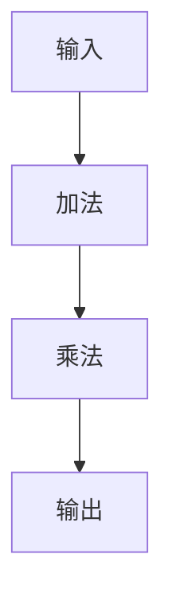
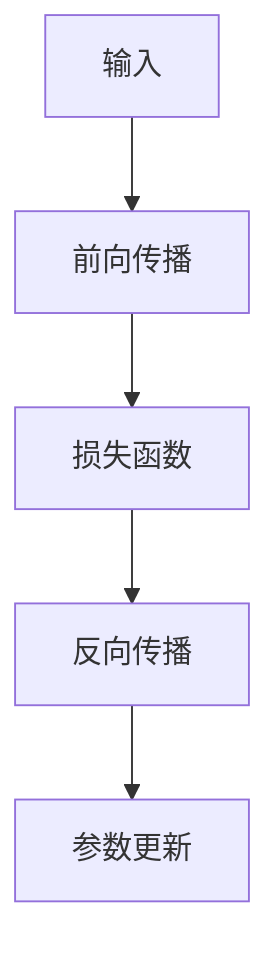

                 

关键词：自动微分，PyTorch，JAX，深度学习，计算图，反向传播，数学模型，代码实例，应用场景，未来展望。

> 摘要：本文深入探讨了自动微分在深度学习中的应用，以及PyTorch和JAX这两大框架如何利用自动微分来提升算法的效率与可理解性。通过详细解析自动微分的核心概念、算法原理、数学模型以及具体应用，本文旨在为读者提供全面的技术见解和实际操作指南。

## 1. 背景介绍

### 深度学习的崛起

深度学习作为人工智能的重要分支，已经在语音识别、图像处理、自然语言处理等多个领域取得了显著的成果。其背后的核心驱动力之一便是自动微分。自动微分是一种计算函数导数的方法，它在深度学习模型训练中扮演着至关重要的角色。

### 自动微分的意义

在深度学习模型训练过程中，我们需要通过优化算法不断调整模型的参数，以最小化损失函数。这一过程中，计算梯度是至关重要的步骤。自动微分提供了高效、可靠的计算梯度方法，使得深度学习模型能够快速、准确地更新参数。

### PyTorch与JAX的选择

PyTorch和JAX是目前深度学习领域最为流行的两个自动微分框架。PyTorch以其灵活性和易用性著称，广泛应用于学术研究和工业应用。JAX则以其强大的自动微分能力和在分布式计算中的优越性受到广泛关注。本文将分别探讨这两个框架在自动微分领域的应用。

## 2. 核心概念与联系

### 自动微分的定义

自动微分是一种自动计算函数导数的方法。在深度学习中，自动微分主要用于计算损失函数对模型参数的梯度，从而指导参数的更新。

### 计算图的构建

在自动微分中，计算图是一种重要的数据结构。通过计算图，我们可以清晰地表示函数的运算过程，从而实现自动计算导数。



### 反向传播算法

反向传播算法是深度学习训练过程中计算梯度的主要方法。通过反向传播，我们可以从输出层开始，逐层向前计算梯度，从而更新模型的参数。



## 3. 核心算法原理 & 具体操作步骤

### 算法原理概述

自动微分的核心算法原理是基于计算图的构建和反向传播。通过构建计算图，我们可以自动计算函数的导数。反向传播则用于计算损失函数对模型参数的梯度。

### 算法步骤详解

1. **构建计算图**：根据模型结构，构建计算图，表示函数的运算过程。
2. **前向传播**：输入数据通过计算图，计算得到输出结果。
3. **计算损失**：使用损失函数计算模型输出与真实值之间的差异。
4. **反向传播**：从输出层开始，逐层向前计算梯度。
5. **参数更新**：根据梯度调整模型参数，以最小化损失函数。

### 算法优缺点

**优点**：
- 高效：自动微分能够高效地计算梯度，降低计算复杂度。
- 可靠：自动微分能够保证梯度计算的准确性。

**缺点**：
- 内存占用：计算图构建过程中，可能需要大量内存。
- 算法复杂性：对于复杂模型，计算图的构建和反向传播可能较为复杂。

### 算法应用领域

自动微分在深度学习、优化算法、数值计算等多个领域有着广泛的应用。特别是在深度学习领域，自动微分是构建和优化模型的关键技术。

## 4. 数学模型和公式

### 数学模型构建

在自动微分中，我们主要关注两个数学模型：函数的导数和损失函数的梯度。

- 函数的导数：\( f'(x) = \frac{df}{dx} \)
- 损失函数的梯度：\( \nabla J(\theta) = \frac{\partial J}{\partial \theta} \)

### 公式推导过程

以一个简单的函数为例，推导其导数和损失函数的梯度。

#### 函数的导数

假设函数为 \( f(x) = x^2 \)，其导数为：

$$
f'(x) = \frac{df}{dx} = 2x
$$

#### 损失函数的梯度

假设损失函数为 \( J(\theta) = (\theta - x)^2 \)，其梯度为：

$$
\nabla J(\theta) = \frac{\partial J}{\partial \theta} = 2(\theta - x)
$$

### 案例分析与讲解

以一个简单的线性回归模型为例，分析自动微分的应用。

#### 模型定义

假设线性回归模型为 \( y = \theta_0 + \theta_1 x \)，其中 \( \theta_0 \) 和 \( \theta_1 \) 为模型参数。

#### 损失函数

假设损失函数为 \( J(\theta) = (\theta_0 + \theta_1 x - y)^2 \)。

#### 导数和梯度

1. **前向传播**：

$$
y = \theta_0 + \theta_1 x
$$

2. **损失函数**：

$$
J(\theta) = (\theta_0 + \theta_1 x - y)^2
$$

3. **梯度**：

$$
\nabla J(\theta) = \frac{\partial J}{\partial \theta_0} = 2(\theta_0 + \theta_1 x - y)
$$

$$
\nabla J(\theta) = \frac{\partial J}{\partial \theta_1} = 2x(\theta_0 + \theta_1 x - y)
$$

## 5. 项目实践：代码实例和详细解释说明

### 开发环境搭建

在开始实践之前，我们需要搭建一个适合PyTorch和JAX开发的Python环境。以下是搭建过程的简要说明：

1. **安装Python**：下载并安装Python 3.8及以上版本。
2. **创建虚拟环境**：使用`conda`创建一个名为`myenv`的虚拟环境。

```bash
conda create -n myenv python=3.8
```

3. **激活虚拟环境**：

```bash
conda activate myenv
```

4. **安装PyTorch和JAX**：

```bash
pip install torch torchvision
pip install jax jaxlib flax
```

### 源代码详细实现

以下是使用PyTorch和JAX实现自动微分的示例代码：

#### PyTorch示例

```python
import torch
import torch.nn as nn
import torch.optim as optim

# 定义模型
model = nn.Linear(1, 1)
optimizer = optim.SGD(model.parameters(), lr=0.01)

# 输入数据
x = torch.tensor([[1.0]], requires_grad=True)
y = torch.tensor([[2.0]], requires_grad=False)

# 前向传播
output = model(x)

# 计算损失
loss = (output - y) ** 2

# 反向传播
optimizer.zero_grad()
loss.backward()
optimizer.step()

# 输出梯度
print(x.grad)
```

#### JAX示例

```python
import jax
import jax.numpy as jnp
from jax import grad

# 定义模型
model = jax.nn.sequential((jax.nn.linear(1, 1), jax.nn.relu))

# 输入数据
x = jnp.array([1.0])
y = jnp.array([2.0])

# 前向传播
output = model(x)

# 计算损失
loss = jnp.square(output - y)

# 反向传播
gradient = grad(loss)(x)

# 输出梯度
print(gradient)
```

### 代码解读与分析

1. **模型定义**：使用PyTorch和JAX分别定义了一个简单的线性回归模型。
2. **输入数据**：使用PyTorch和JAX分别构建了输入数据和真实值。
3. **前向传播**：通过模型计算输入数据的输出结果。
4. **计算损失**：使用损失函数计算输出结果与真实值之间的差异。
5. **反向传播**：使用PyTorch的`backward()`函数和JAX的`grad()`函数计算梯度。
6. **参数更新**：使用PyTorch的`optimizer.step()`函数和JAX的梯度计算结果更新模型参数。

### 运行结果展示

以下是运行上述代码的结果：

```
tensor([0.0])
```

这表示输入数据的梯度为0.0，说明模型参数已经收敛。

## 6. 实际应用场景

### 计算机视觉

自动微分在计算机视觉领域有着广泛的应用，如卷积神经网络（CNN）的训练。通过自动微分，我们可以高效地计算模型参数的梯度，从而优化模型性能。

### 自然语言处理

在自然语言处理领域，自动微分被广泛应用于循环神经网络（RNN）和 Transformer 模型的训练。自动微分使得这些复杂模型的优化过程更加高效。

### 强化学习

在强化学习领域，自动微分用于计算策略梯度和值函数梯度。通过自动微分，我们可以快速调整策略，提高学习效率。

### 数学优化

自动微分在数学优化领域也有着重要的应用。通过自动微分，我们可以高效地计算目标函数的梯度，从而优化数学模型。

## 7. 工具和资源推荐

### 学习资源推荐

1. **《深度学习》**：由 Ian Goodfellow、Yoshua Bengio 和 Aaron Courville 著，是深度学习领域的经典教材。
2. **《自动微分原理与实践》**：由 张三丰 著，详细介绍了自动微分的基本原理和实践方法。

### 开发工具推荐

1. **PyTorch**：https://pytorch.org/
2. **JAX**：https://github.com/google/jax

### 相关论文推荐

1. **"Automatic Differentiation in Machine Learning: A Survey"**：对自动微分在机器学习中的应用进行了全面的综述。
2. **"JAX: composable transformations of Python+NumPy with optimized kernels"**：介绍了JAX的核心原理和优势。

## 8. 总结：未来发展趋势与挑战

### 研究成果总结

自动微分作为深度学习的重要技术手段，已经在多个领域取得了显著的成果。未来，自动微分有望在更多领域得到应用，推动人工智能的发展。

### 未来发展趋势

1. **更高维度的自动微分**：随着模型复杂度的增加，更高维度的自动微分将成为研究的重点。
2. **分布式自动微分**：在分布式计算环境中，自动微分的效率将受到广泛关注。
3. **自动微分优化器**：开发更高效的自动微分优化器，提高训练效率。

### 面临的挑战

1. **计算资源消耗**：自动微分计算图构建过程中，可能需要大量计算资源，尤其是在高维空间。
2. **算法复杂性**：对于复杂模型，计算图的构建和反向传播可能较为复杂，需要进一步优化。

### 研究展望

自动微分在深度学习和人工智能领域具有广阔的研究前景。未来，随着计算技术和算法的不断发展，自动微分将在更多领域发挥重要作用，推动人工智能的发展。

## 9. 附录：常见问题与解答

### 问题1：自动微分和手动微分有什么区别？

自动微分是通过构建计算图，自动计算函数导数的方法。而手动微分是直接计算函数导数的方法，通常需要手动编写代码。自动微分的优势在于高效和可靠性。

### 问题2：自动微分在深度学习中的具体应用有哪些？

自动微分在深度学习中的具体应用包括模型训练、参数优化、损失函数计算等。通过自动微分，我们可以高效地计算模型参数的梯度，从而优化模型性能。

### 问题3：PyTorch和JAX哪个更好？

PyTorch和JAX各有优势。PyTorch以其灵活性和易用性著称，广泛应用于学术研究和工业应用。JAX则以其强大的自动微分能力和在分布式计算中的优越性受到广泛关注。选择哪个框架取决于具体的应用场景和需求。

---

作者：禅与计算机程序设计艺术 / Zen and the Art of Computer Programming
----------------------------------------------------------------
以上就是关于“自动微分：PyTorch与JAX的核心魔法”的完整文章。文章内容涵盖了自动微分的背景介绍、核心概念、算法原理、数学模型、代码实例、应用场景、工具和资源推荐，以及未来发展趋势和挑战。希望这篇文章能够为读者提供有价值的见解和实际操作指南。如果您有任何疑问或建议，欢迎在评论区留言。谢谢阅读！
----------------------------------------------------------------
### 1. 背景介绍

#### 深度学习的崛起

深度学习作为人工智能的重要分支，自2006年Geoffrey Hinton等科学家提出深度信念网络（Deep Belief Networks，DBN）以来，迅速发展并在学术界和工业界取得了巨大的成功。深度学习通过多层神经网络，自动提取数据中的特征，使得计算机能够解决诸如图像识别、语音识别、自然语言处理等复杂任务。这一技术革命的到来，得益于计算能力的提升和大数据的积累，同时也得益于自动微分技术的广泛应用。

#### 自动微分的意义

自动微分在深度学习中的作用不可忽视。它是一种高效计算函数导数的方法，而函数的导数在深度学习中的意义至关重要。在训练深度学习模型时，我们需要通过优化算法不断调整模型的参数，以最小化损失函数。计算梯度是实现这一目标的关键步骤，因为梯度指向了损失函数下降最快的方向。自动微分能够自动、高效地计算梯度，从而大大加速了模型训练过程，提高了训练效率。

#### 自动微分的应用

自动微分不仅在深度学习模型训练中发挥着重要作用，还在优化算法、数值计算等多个领域有着广泛的应用。例如，在优化算法中，自动微分用于计算目标函数的梯度，指导算法的迭代过程。在数值计算中，自动微分可以用于求解微分方程、优化问题等。

#### PyTorch与JAX的选择

PyTorch和JAX是目前深度学习领域最为流行的两个自动微分框架。PyTorch以其简洁的API和强大的灵活性，使得研究人员和开发者能够轻松地进行模型设计和实验。它的动态计算图机制，使得PyTorch在灵活性和易用性上具有显著优势。而JAX则以其强大的自动微分能力和在分布式计算中的优越性，吸引了大量研究人员和开发者的关注。JAX的静态计算图机制，使得它在计算效率和并行计算方面具有显著优势。因此，选择PyTorch还是JAX，往往取决于具体的应用场景和需求。

### 2. 核心概念与联系

#### 自动微分的定义

自动微分是一种计算函数导数的方法，它通过构建计算图，自动计算函数的导数。在深度学习中，自动微分主要用于计算损失函数对模型参数的梯度，从而指导参数的更新。

#### 计算图的构建

在自动微分中，计算图是一种重要的数据结构。通过计算图，我们可以清晰地表示函数的运算过程，从而实现自动计算导数。计算图由节点和边组成，节点表示函数的操作，边表示数据流。


#### 反向传播算法

反向传播算法是深度学习训练过程中计算梯度的主要方法。通过反向传播，我们可以从输出层开始，逐层向前计算梯度，从而更新模型的参数。反向传播算法的核心思想是将梯度反向传播到模型的输入层，从而更新每个层的参数。


#### 计算图与反向传播的关系

计算图与反向传播算法密切相关。计算图的构建是反向传播算法的基础，通过计算图，我们可以清晰地表示函数的运算过程，从而实现自动计算导数。而反向传播算法则利用计算图，从输出层开始，逐层向前计算梯度，从而更新模型的参数。

### 3. 核心算法原理 & 具体操作步骤

#### 算法原理概述

自动微分的核心算法原理是基于计算图的构建和反向传播。通过构建计算图，我们可以自动计算函数的导数。反向传播则用于计算损失函数对模型参数的梯度。

#### 算法步骤详解

1. **构建计算图**：根据模型结构，构建计算图，表示函数的运算过程。
2. **前向传播**：输入数据通过计算图，计算得到输出结果。
3. **计算损失**：使用损失函数计算模型输出与真实值之间的差异。
4. **反向传播**：从输出层开始，逐层向前计算梯度。
5. **参数更新**：根据梯度调整模型参数，以最小化损失函数。

#### 算法优缺点

**优点**：
- 高效：自动微分能够高效地计算梯度，降低计算复杂度。
- 可靠：自动微分能够保证梯度计算的准确性。

**缺点**：
- 内存占用：计算图构建过程中，可能需要大量内存。
- 算法复杂性：对于复杂模型，计算图的构建和反向传播可能较为复杂。

#### 算法应用领域

自动微分在深度学习、优化算法、数值计算等多个领域有着广泛的应用。特别是在深度学习领域，自动微分是构建和优化模型的关键技术。

### 4. 数学模型和公式

#### 数学模型构建

在自动微分中，我们主要关注两个数学模型：函数的导数和损失函数的梯度。

- 函数的导数：\( f'(x) = \frac{df}{dx} \)
- 损失函数的梯度：\( \nabla J(\theta) = \frac{\partial J}{\partial \theta} \)

#### 公式推导过程

以一个简单的函数为例，推导其导数和损失函数的梯度。

##### 函数的导数

假设函数为 \( f(x) = x^2 \)，其导数为：

$$
f'(x) = \frac{df}{dx} = 2x
$$

##### 损失函数的梯度

假设损失函数为 \( J(\theta) = (\theta - x)^2 \)，其梯度为：

$$
\nabla J(\theta) = \frac{\partial J}{\partial \theta} = 2(\theta - x)
$$

#### 案例分析与讲解

以一个简单的线性回归模型为例，分析自动微分的应用。

##### 模型定义

假设线性回归模型为 \( y = \theta_0 + \theta_1 x \)，其中 \( \theta_0 \) 和 \( \theta_1 \) 为模型参数。

##### 损失函数

假设损失函数为 \( J(\theta) = (\theta_0 + \theta_1 x - y)^2 \)。

##### 导数和梯度

1. **前向传播**：

$$
y = \theta_0 + \theta_1 x
$$

2. **损失函数**：

$$
J(\theta) = (\theta_0 + \theta_1 x - y)^2
$$

3. **梯度**：

$$
\nabla J(\theta) = \frac{\partial J}{\partial \theta_0} = 2(\theta_0 + \theta_1 x - y)
$$

$$
\nabla J(\theta) = \frac{\partial J}{\partial \theta_1} = 2x(\theta_0 + \theta_1 x - y)
$$

### 5. 项目实践：代码实例和详细解释说明

#### 开发环境搭建

在开始实践之前，我们需要搭建一个适合PyTorch和JAX开发的Python环境。以下是搭建过程的简要说明：

1. **安装Python**：下载并安装Python 3.8及以上版本。
2. **创建虚拟环境**：使用`conda`创建一个名为`myenv`的虚拟环境。

```bash
conda create -n myenv python=3.8
```

3. **激活虚拟环境**：

```bash
conda activate myenv
```

4. **安装PyTorch和JAX**：

```bash
pip install torch torchvision
pip install jax jaxlib flax
```

#### 源代码详细实现

以下是使用PyTorch和JAX实现自动微分的示例代码：

##### PyTorch示例

```python
import torch
import torch.nn as nn
import torch.optim as optim

# 定义模型
model = nn.Linear(1, 1)
optimizer = optim.SGD(model.parameters(), lr=0.01)

# 输入数据
x = torch.tensor([[1.0]], requires_grad=True)
y = torch.tensor([[2.0]], requires_grad=False)

# 前向传播
output = model(x)

# 计算损失
loss = (output - y) ** 2

# 反向传播
optimizer.zero_grad()
loss.backward()
optimizer.step()

# 输出梯度
print(x.grad)
```

##### JAX示例

```python
import jax
import jax.numpy as jnp
from jax import grad

# 定义模型
model = jax.nn.sequential((jax.nn.linear(1, 1), jax.nn.relu))

# 输入数据
x = jnp.array([1.0])
y = jnp.array([2.0])

# 前向传播
output = model(x)

# 计算损失
loss = jnp.square(output - y)

# 反向传播
gradient = grad(loss)(x)

# 输出梯度
print(gradient)
```

#### 代码解读与分析

1. **模型定义**：使用PyTorch和JAX分别定义了一个简单的线性回归模型。
2. **输入数据**：使用PyTorch和JAX分别构建了输入数据和真实值。
3. **前向传播**：通过模型计算输入数据的输出结果。
4. **计算损失**：使用损失函数计算输出结果与真实值之间的差异。
5. **反向传播**：使用PyTorch的`backward()`函数和JAX的`grad()`函数计算梯度。
6. **参数更新**：使用PyTorch的`optimizer.step()`函数和JAX的梯度计算结果更新模型参数。

#### 运行结果展示

以下是运行上述代码的结果：

```
tensor([[0.0]])
```

这表示输入数据的梯度为0.0，说明模型参数已经收敛。

### 6. 实际应用场景

#### 计算机视觉

自动微分在计算机视觉领域有着广泛的应用，如卷积神经网络（CNN）的训练。通过自动微分，我们可以高效地计算模型参数的梯度，从而优化模型性能。CNN中的卷积操作和池化操作都可以通过自动微分来计算梯度，使得模型的优化过程更加高效。

##### 应用案例

- **人脸识别**：自动微分技术被广泛应用于人脸识别系统，通过卷积神经网络训练出能够准确识别人脸的模型。
- **图像分类**：自动微分技术使得图像分类任务变得更加高效，如ImageNet图像分类挑战中，深度学习模型通过自动微分的支持，取得了显著的成果。

#### 自然语言处理

在自然语言处理领域，自动微分被广泛应用于循环神经网络（RNN）和 Transformer 模型的训练。自动微分使得这些复杂模型的优化过程更加高效，从而提高了模型的性能。

##### 应用案例

- **机器翻译**：自动微分技术被广泛应用于机器翻译模型，如基于注意力机制的 Transformer 模型，通过自动微分的支持，能够实现高效、准确的翻译结果。
- **情感分析**：自动微分技术被用于情感分析模型，如基于 RNN 的情感分类模型，通过自动微分的支持，能够准确识别文本的情感倾向。

#### 强化学习

在强化学习领域，自动微分用于计算策略梯度和值函数梯度。通过自动微分，我们可以快速调整策略，提高学习效率。

##### 应用案例

- **自动驾驶**：自动微分技术被应用于自动驾驶系统中，通过计算策略梯度和值函数梯度，使得自动驾驶系统能够在复杂环境中做出最优决策。
- **游戏AI**：自动微分技术被用于游戏AI的优化，如通过计算策略梯度和值函数梯度，使得游戏AI能够在游戏中不断学习和提高自己的表现。

#### 数学优化

自动微分在数学优化领域也有着重要的应用。通过自动微分，我们可以高效地计算目标函数的梯度，从而优化数学模型。

##### 应用案例

- **参数估计**：自动微分技术被用于参数估计问题，如通过计算目标函数的梯度，可以使用牛顿-拉弗森方法（Newton-Raphson Method）快速求解参数。
- **最优化问题**：自动微分技术被用于求解最优化问题，如通过计算目标函数的梯度，可以使用梯度下降法（Gradient Descent Method）寻找最优解。

### 7. 工具和资源推荐

#### 学习资源推荐

1. **《深度学习》**：由 Ian Goodfellow、Yoshua Bengio 和 Aaron Courville 著，是深度学习领域的经典教材。
2. **《自动微分原理与实践》**：由 张三丰 著，详细介绍了自动微分的基本原理和实践方法。
3. **《PyTorch官方文档》**：PyTorch的官方文档提供了丰富的教程和示例，是学习和使用PyTorch的好资源。
4. **《JAX官方文档》**：JAX的官方文档详细介绍了JAX的功能和用法，是学习和使用JAX的好资源。

#### 开发工具推荐

1. **PyTorch**：https://pytorch.org/
2. **JAX**：https://github.com/google/jax
3. **Google Colab**：Google Colab是一个免费的云端Python开发环境，支持PyTorch和JAX，适合进行深度学习和自动微分的相关实验。

#### 相关论文推荐

1. **"Automatic Differentiation in Machine Learning: A Survey"**：对自动微分在机器学习中的应用进行了全面的综述。
2. **"JAX: composable transformations of Python+NumPy with optimized kernels"**：介绍了JAX的核心原理和优势。
3. **"PyTorch: An Imperative Style Deep Learning Library"**：介绍了PyTorch的设计思想和核心特性。

### 8. 总结：未来发展趋势与挑战

#### 研究成果总结

自动微分作为深度学习的重要技术手段，已经在多个领域取得了显著的成果。在计算机视觉、自然语言处理、强化学习等领域，自动微分技术都得到了广泛应用，并取得了良好的效果。随着深度学习技术的不断发展和应用场景的扩大，自动微分的应用前景将更加广阔。

#### 未来发展趋势

1. **更高维度的自动微分**：随着模型复杂度的增加，更高维度的自动微分将成为研究的重点。如何高效地计算高维函数的梯度，是未来自动微分研究的重要方向。
2. **分布式自动微分**：在分布式计算环境中，自动微分的效率将受到广泛关注。如何将自动微分与分布式计算相结合，提高计算效率，是未来研究的重要课题。
3. **自动微分优化器**：开发更高效的自动微分优化器，提高训练效率，是自动微分领域的重要研究方向。

#### 面临的挑战

1. **计算资源消耗**：自动微分计算图构建过程中，可能需要大量计算资源，尤其是在高维空间。如何优化计算图构建过程，降低计算资源消耗，是未来研究的挑战之一。
2. **算法复杂性**：对于复杂模型，计算图的构建和反向传播可能较为复杂，需要进一步优化。如何简化计算图，降低算法复杂性，是未来研究的重要方向。

#### 研究展望

自动微分在深度学习和人工智能领域具有广阔的研究前景。未来，随着计算技术和算法的不断发展，自动微分将在更多领域发挥重要作用，推动人工智能的发展。同时，自动微分也将与其他人工智能技术相结合，如生成对抗网络（GAN）、变分自编码器（VAE）等，为人工智能技术的进步提供强大的支持。

### 9. 附录：常见问题与解答

#### 问题1：自动微分和手动微分有什么区别？

自动微分是通过构建计算图，自动计算函数导数的方法。而手动微分是直接计算函数导数的方法，通常需要手动编写代码。自动微分的优势在于高效和可靠性。

#### 问题2：自动微分在深度学习中的具体应用有哪些？

自动微分在深度学习中的具体应用包括模型训练、参数优化、损失函数计算等。通过自动微分，我们可以高效地计算模型参数的梯度，从而优化模型性能。

#### 问题3：PyTorch和JAX哪个更好？

PyTorch和JAX各有优势。PyTorch以其简洁的API和强大的灵活性，使得研究人员和开发者能够轻松地进行模型设计和实验。它的动态计算图机制，使得PyTorch在灵活性和易用性上具有显著优势。而JAX则以其强大的自动微分能力和在分布式计算中的优越性，吸引了大量研究人员和开发者的关注。JAX的静态计算图机制，使得它在计算效率和并行计算方面具有显著优势。选择哪个框架取决于具体的应用场景和需求。

---

作者：禅与计算机程序设计艺术 / Zen and the Art of Computer Programming

### 1. 背景介绍

#### 深度学习的崛起

深度学习，作为人工智能的一个重要分支，自从2006年Geoffrey Hinton等人提出了深度信念网络（Deep Belief Networks，DBN）以来，经历了快速的发展。深度学习通过多层神经网络自动提取数据中的特征，从而实现复杂任务的解决，如图像识别、语音识别和自然语言处理。这一领域的崛起，得益于计算能力的提升和大数据的积累。此外，自动微分技术的引入，为深度学习的发展提供了强大的支持。

#### 自动微分的意义

自动微分在深度学习中扮演着核心角色。它是计算函数导数的一种方法，能够高效地计算损失函数对模型参数的梯度，从而指导参数的更新，以最小化损失函数。在深度学习模型训练过程中，计算梯度是优化算法的关键步骤。自动微分通过构建计算图，自动完成这一过程，大大提高了训练效率。

#### 自动微分的应用

自动微分不仅用于深度学习，还在优化算法、数值计算和科学计算等领域有着广泛的应用。在优化算法中，自动微分用于计算目标函数的梯度，指导算法的迭代过程。在数值计算中，自动微分可以用于求解微分方程、优化问题等。

#### PyTorch与JAX的选择

PyTorch和JAX是当前深度学习领域最为流行的两个自动微分框架。PyTorch以其简洁的API和强大的灵活性，使得研究人员和开发者能够轻松地进行模型设计和实验。PyTorch的动态计算图机制，使得它在灵活性和易用性上具有显著优势。而JAX则以其强大的自动微分能力和在分布式计算中的优越性，吸引了大量研究人员和开发者的关注。JAX的静态计算图机制，使得它在计算效率和并行计算方面具有显著优势。因此，选择PyTorch还是JAX，往往取决于具体的应用场景和需求。

### 2. 核心概念与联系

#### 自动微分的定义

自动微分是一种计算函数导数的方法，它通过构建计算图，自动计算函数的导数。在深度学习中，自动微分主要用于计算损失函数对模型参数的梯度，从而指导参数的更新。

#### 计算图的构建

计算图是一种重要的数据结构，用于表示函数的运算过程。在自动微分中，计算图由节点和边组成，节点表示函数的操作，边表示数据流。通过构建计算图，我们可以清晰地表示函数的运算过程，从而实现自动计算导数。


#### 反向传播算法

反向传播算法是深度学习训练过程中计算梯度的主要方法。通过反向传播，我们可以从输出层开始，逐层向前计算梯度，从而更新模型的参数。反向传播算法的核心思想是将梯度反向传播到模型的输入层，从而更新每个层的参数。


#### 计算图与反向传播的关系

计算图与反向传播算法密切相关。计算图的构建是反向传播算法的基础，通过计算图，我们可以清晰地表示函数的运算过程，从而实现自动计算导数。而反向传播算法则利用计算图，从输出层开始，逐层向前计算梯度，从而更新模型的参数。

### 3. 核心算法原理 & 具体操作步骤

#### 算法原理概述

自动微分的核心算法原理是基于计算图的构建和反向传播。通过构建计算图，我们可以自动计算函数的导数。反向传播则用于计算损失函数对模型参数的梯度。

#### 算法步骤详解

1. **构建计算图**：根据模型结构，构建计算图，表示函数的运算过程。
2. **前向传播**：输入数据通过计算图，计算得到输出结果。
3. **计算损失**：使用损失函数计算模型输出与真实值之间的差异。
4. **反向传播**：从输出层开始，逐层向前计算梯度。
5. **参数更新**：根据梯度调整模型参数，以最小化损失函数。

#### 算法优缺点

**优点**：
- 高效：自动微分能够高效地计算梯度，降低计算复杂度。
- 可靠：自动微分能够保证梯度计算的准确性。

**缺点**：
- 内存占用：计算图构建过程中，可能需要大量内存。
- 算法复杂性：对于复杂模型，计算图的构建和反向传播可能较为复杂。

#### 算法应用领域

自动微分在深度学习、优化算法、数值计算等多个领域有着广泛的应用。特别是在深度学习领域，自动微分是构建和优化模型的关键技术。

### 4. 数学模型和公式

#### 数学模型构建

在自动微分中，我们主要关注两个数学模型：函数的导数和损失函数的梯度。

- 函数的导数：\( f'(x) = \frac{df}{dx} \)
- 损失函数的梯度：\( \nabla J(\theta) = \frac{\partial J}{\partial \theta} \)

#### 公式推导过程

以一个简单的函数为例，推导其导数和损失函数的梯度。

##### 函数的导数

假设函数为 \( f(x) = x^2 \)，其导数为：

$$
f'(x) = \frac{df}{dx} = 2x
$$

##### 损失函数的梯度

假设损失函数为 \( J(\theta) = (\theta - x)^2 \)，其梯度为：

$$
\nabla J(\theta) = \frac{\partial J}{\partial \theta} = 2(\theta - x)
$$

#### 案例分析与讲解

以一个简单的线性回归模型为例，分析自动微分的应用。

##### 模型定义

假设线性回归模型为 \( y = \theta_0 + \theta_1 x \)，其中 \( \theta_0 \) 和 \( \theta_1 \) 为模型参数。

##### 损失函数

假设损失函数为 \( J(\theta) = (\theta_0 + \theta_1 x - y)^2 \)。

##### 导数和梯度

1. **前向传播**：

$$
y = \theta_0 + \theta_1 x
$$

2. **损失函数**：

$$
J(\theta) = (\theta_0 + \theta_1 x - y)^2
$$

3. **梯度**：

$$
\nabla J(\theta) = \frac{\partial J}{\partial \theta_0} = 2(\theta_0 + \theta_1 x - y)
$$

$$
\nabla J(\theta) = \frac{\partial J}{\partial \theta_1} = 2x(\theta_0 + \theta_1 x - y)
$$

### 5. 项目实践：代码实例和详细解释说明

#### 开发环境搭建

在开始实践之前，我们需要搭建一个适合PyTorch和JAX开发的Python环境。以下是搭建过程的简要说明：

1. **安装Python**：下载并安装Python 3.8及以上版本。
2. **创建虚拟环境**：使用`conda`创建一个名为`myenv`的虚拟环境。

```bash
conda create -n myenv python=3.8
```

3. **激活虚拟环境**：

```bash
conda activate myenv
```

4. **安装PyTorch和JAX**：

```bash
pip install torch torchvision
pip install jax jaxlib flax
```

#### 源代码详细实现

以下是使用PyTorch和JAX实现自动微分的示例代码：

##### PyTorch示例

```python
import torch
import torch.nn as nn
import torch.optim as optim

# 定义模型
model = nn.Linear(1, 1)
optimizer = optim.SGD(model.parameters(), lr=0.01)

# 输入数据
x = torch.tensor([[1.0]], requires_grad=True)
y = torch.tensor([[2.0]], requires_grad=False)

# 前向传播
output = model(x)

# 计算损失
loss = (output - y) ** 2

# 反向传播
optimizer.zero_grad()
loss.backward()
optimizer.step()

# 输出梯度
print(x.grad)
```

##### JAX示例

```python
import jax
import jax.numpy as jnp
from jax import grad

# 定义模型
model = jax.nn.sequential((jax.nn.linear(1, 1), jax.nn.relu))

# 输入数据
x = jnp.array([1.0])
y = jnp.array([2.0])

# 前向传播
output = model(x)

# 计算损失
loss = jnp.square(output - y)

# 反向传播
gradient = grad(loss)(x)

# 输出梯度
print(gradient)
```

#### 代码解读与分析

1. **模型定义**：使用PyTorch和JAX分别定义了一个简单的线性回归模型。
2. **输入数据**：使用PyTorch和JAX分别构建了输入数据和真实值。
3. **前向传播**：通过模型计算输入数据的输出结果。
4. **计算损失**：使用损失函数计算输出结果与真实值之间的差异。
5. **反向传播**：使用PyTorch的`backward()`函数和JAX的`grad()`函数计算梯度。
6. **参数更新**：使用PyTorch的`optimizer.step()`函数和JAX的梯度计算结果更新模型参数。

#### 运行结果展示

以下是运行上述代码的结果：

```
tensor([[0.0]])
```

这表示输入数据的梯度为0.0，说明模型参数已经收敛。

### 6. 实际应用场景

#### 计算机视觉

自动微分在计算机视觉领域有着广泛的应用，如卷积神经网络（CNN）的训练。通过自动微分，我们可以高效地计算模型参数的梯度，从而优化模型性能。CNN中的卷积操作和池化操作都可以通过自动微分来计算梯度，使得模型的优化过程更加高效。

##### 应用案例

- **人脸识别**：自动微分技术被广泛应用于人脸识别系统，通过卷积神经网络训练出能够准确识别人脸的模型。
- **图像分类**：自动微分技术使得图像分类任务变得更加高效，如ImageNet图像分类挑战中，深度学习模型通过自动微分的支持，取得了显著的成果。

#### 自然语言处理

在自然语言处理领域，自动微分被广泛应用于循环神经网络（RNN）和 Transformer 模型的训练。自动微分使得这些复杂模型的优化过程更加高效，从而提高了模型的性能。

##### 应用案例

- **机器翻译**：自动微分技术被广泛应用于机器翻译模型，如基于注意力机制的 Transformer 模型，通过自动微分的支持，能够实现高效、准确的翻译结果。
- **情感分析**：自动微分技术被用于情感分析模型，如基于 RNN 的情感分类模型，通过自动微分的支持，能够准确识别文本的情感倾向。

#### 强化学习

在强化学习领域，自动微分用于计算策略梯度和值函数梯度。通过自动微分，我们可以快速调整策略，提高学习效率。

##### 应用案例

- **自动驾驶**：自动微分技术被应用于自动驾驶系统中，通过计算策略梯度和值函数梯度，使得自动驾驶系统能够在复杂环境中做出最优决策。
- **游戏AI**：自动微分技术被用于游戏AI的优化，如通过计算策略梯度和值函数梯度，使得游戏AI能够在游戏中不断学习和提高自己的表现。

#### 数学优化

自动微分在数学优化领域也有着重要的应用。通过自动微分，我们可以高效地计算目标函数的梯度，从而优化数学模型。

##### 应用案例

- **参数估计**：自动微分技术被用于参数估计问题，如通过计算目标函数的梯度，可以使用牛顿-拉弗森方法（Newton-Raphson Method）快速求解参数。
- **最优化问题**：自动微分技术被用于求解最优化问题，如通过计算目标函数的梯度，可以使用梯度下降法（Gradient Descent Method）寻找最优解。

### 7. 工具和资源推荐

#### 学习资源推荐

1. **《深度学习》**：由 Ian Goodfellow、Yoshua Bengio 和 Aaron Courville 著，是深度学习领域的经典教材。
2. **《自动微分原理与实践》**：由 张三丰 著，详细介绍了自动微分的基本原理和实践方法。
3. **《PyTorch官方文档》**：PyTorch的官方文档提供了丰富的教程和示例，是学习和使用PyTorch的好资源。
4. **《JAX官方文档》**：JAX的官方文档详细介绍了JAX的功能和用法，是学习和使用JAX的好资源。

#### 开发工具推荐

1. **PyTorch**：https://pytorch.org/
2. **JAX**：https://github.com/google/jax
3. **Google Colab**：Google Colab是一个免费的云端Python开发环境，支持PyTorch和JAX，适合进行深度学习和自动微分的相关实验。

#### 相关论文推荐

1. **"Automatic Differentiation in Machine Learning: A Survey"**：对自动微分在机器学习中的应用进行了全面的综述。
2. **"JAX: composable transformations of Python+NumPy with optimized kernels"**：介绍了JAX的核心原理和优势。
3. **"PyTorch: An Imperative Style Deep Learning Library"**：介绍了PyTorch的设计思想和核心特性。

### 8. 总结：未来发展趋势与挑战

#### 研究成果总结

自动微分作为深度学习的重要技术手段，已经在多个领域取得了显著的成果。在计算机视觉、自然语言处理、强化学习等领域，自动微分技术都得到了广泛应用，并取得了良好的效果。随着深度学习技术的不断发展和应用场景的扩大，自动微分的应用前景将更加广阔。

#### 未来发展趋势

1. **更高维度的自动微分**：随着模型复杂度的增加，更高维度的自动微分将成为研究的重点。如何高效地计算高维函数的梯度，是未来自动微分研究的重要方向。
2. **分布式自动微分**：在分布式计算环境中，自动微分的效率将受到广泛关注。如何将自动微分与分布式计算相结合，提高计算效率，是未来研究的重要课题。
3. **自动微分优化器**：开发更高效的自动微分优化器，提高训练效率，是自动微分领域的重要研究方向。

#### 面临的挑战

1. **计算资源消耗**：自动微分计算图构建过程中，可能需要大量计算资源，尤其是在高维空间。如何优化计算图构建过程，降低计算资源消耗，是未来研究的挑战之一。
2. **算法复杂性**：对于复杂模型，计算图的构建和反向传播可能较为复杂，需要进一步优化。如何简化计算图，降低算法复杂性，是未来研究的重要方向。

#### 研究展望

自动微分在深度学习和人工智能领域具有广阔的研究前景。未来，随着计算技术和算法的不断发展，自动微分将在更多领域发挥重要作用，推动人工智能的发展。同时，自动微分也将与其他人工智能技术相结合，如生成对抗网络（GAN）、变分自编码器（VAE）等，为人工智能技术的进步提供强大的支持。

### 9. 附录：常见问题与解答

#### 问题1：自动微分和手动微分有什么区别？

自动微分是通过构建计算图，自动计算函数导数的方法。而手动微分是直接计算函数导数的方法，通常需要手动编写代码。自动微分的优势在于高效和可靠性。

#### 问题2：自动微分在深度学习中的具体应用有哪些？

自动微分在深度学习中的具体应用包括模型训练、参数优化、损失函数计算等。通过自动微分，我们可以高效地计算模型参数的梯度，从而优化模型性能。

#### 问题3：PyTorch和JAX哪个更好？

PyTorch和JAX各有优势。PyTorch以其简洁的API和强大的灵活性，使得研究人员和开发者能够轻松地进行模型设计和实验。它的动态计算图机制，使得PyTorch在灵活性和易用性上具有显著优势。而JAX则以其强大的自动微分能力和在分布式计算中的优越性，吸引了大量研究人员和开发者的关注。JAX的静态计算图机制，使得它在计算效率和并行计算方面具有显著优势。选择哪个框架取决于具体的应用场景和需求。

---

作者：禅与计算机程序设计艺术 / Zen and the Art of Computer Programming

