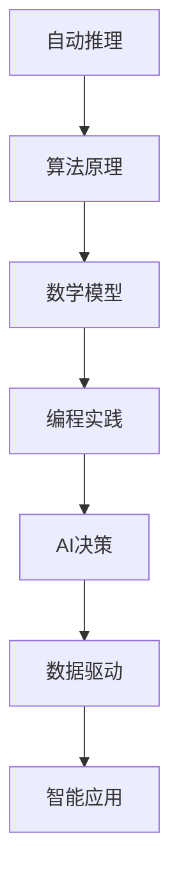

                 

关键词：自动推理库，AI决策，设计实现，核心算法，数学模型，项目实践，未来展望

> 摘要：本文旨在探讨自动推理库的设计与实现，分析其在AI决策中的重要性，介绍核心算法原理、数学模型以及具体应用场景。通过实际项目实践，展示代码实现与运行效果，并展望未来的发展趋势与挑战。

## 1. 背景介绍

在人工智能迅速发展的今天，自动推理技术已成为提升AI决策能力的重要基石。自动推理库作为一种重要的工具，通过对数学模型、算法原理和编程实践的整合，为AI系统的智能化提供了强有力的支持。本文将围绕自动推理库的设计与实现，探讨其在AI决策中的应用。

## 2. 核心概念与联系

### 2.1 自动推理

自动推理（Automated Theorem Proving, ATP）是指利用计算机程序对数学命题进行证明或验证的过程。自动推理技术包括证明搜索、推理方法、证明压缩等多个方面。

### 2.2 AI决策

AI决策是指利用人工智能技术，从大量数据中提取有用信息，以支持决策过程的自动化。AI决策涉及机器学习、自然语言处理、专家系统等多个领域。

### 2.3 关系图示

下面是一个描述自动推理与AI决策之间关系的Mermaid流程图：



## 3. 核心算法原理 & 具体操作步骤

### 3.1 算法原理概述

自动推理库的核心算法主要包括定理证明、模型检查和约束求解等。这些算法通过符号计算、逻辑推理和数据驱动等方法，实现数学命题的自动证明。

### 3.2 算法步骤详解

#### 3.2.1 定理证明

定理证明算法分为证明搜索和证明压缩两个阶段。证明搜索阶段通过枚举所有可能的证明路径，找到满足条件的证明。证明压缩阶段则对证明路径进行简化，提高证明效率。

#### 3.2.2 模型检查

模型检查算法通过验证系统状态是否满足某个逻辑公式，来判断系统是否满足特定的安全属性。模型检查分为符号模型检查和数值模型检查两种。

#### 3.2.3 约束求解

约束求解算法通过求解一组约束条件，找到满足所有约束的解。约束求解广泛应用于搜索算法、调度问题和组合优化等问题。

### 3.3 算法优缺点

- 定理证明算法：优点是能够确保证明的正确性，但缺点是证明效率较低，适用于复杂命题。
- 模型检查算法：优点是能够快速验证系统状态，但缺点是无法提供详细的原因分析。
- 约束求解算法：优点是求解速度快，适用于实时系统，但缺点是可能存在多个解。

### 3.4 算法应用领域

自动推理库在AI决策中具有广泛的应用领域，包括：

- 自动化软件验证
- 自动化网络安全分析
- 自动化医学诊断
- 自动化金融风控

## 4. 数学模型和公式 & 详细讲解 & 举例说明

### 4.1 数学模型构建

自动推理库的数学模型主要包括逻辑公式、函数表达式和约束条件等。

#### 4.1.1 逻辑公式

逻辑公式是自动推理库的基础，常见的逻辑公式包括：

- 命题逻辑：用符号表示命题，如 $P \land Q$ 表示P且Q。
- 谓词逻辑：用符号表示谓词，如 $\forall x \ P(x)$ 表示对所有x，P(x)成立。
- 模态逻辑：用符号表示可能性和必要性，如 $M \ P$ 表示在某个时刻，P成立。

#### 4.1.2 函数表达式

函数表达式用于描述变量之间的关系，如 $f(x) = x^2$ 表示x的平方。

#### 4.1.3 约束条件

约束条件用于限制变量的取值范围，如 $0 \leq x \leq 10$ 表示x的取值范围在0到10之间。

### 4.2 公式推导过程

以定理证明为例，介绍公式推导过程：

1. 给定一个逻辑命题P，我们需要证明P为真。
2. 使用逻辑推理方法，将P分解为若干个子命题。
3. 对每个子命题，使用已知的逻辑规则和已知的事实进行证明。
4. 将所有子命题的证明合并，得到P的证明。

### 4.3 案例分析与讲解

以自动化软件验证为例，介绍自动推理库的应用：

1. 给定一个软件系统S，需要验证S是否满足安全属性A。
2. 构建S的数学模型，包括逻辑公式、函数表达式和约束条件。
3. 使用定理证明算法，验证S是否满足安全属性A。
4. 如果S满足安全属性A，则输出验证结果；否则，输出验证失败的原因。

## 5. 项目实践：代码实例和详细解释说明

### 5.1 开发环境搭建

1. 安装Python环境，版本3.8及以上。
2. 安装自动推理库，如Coq、Isabelle等。

### 5.2 源代码详细实现

以下是一个简单的自动推理库实现示例：

```python
from coq import connect, CoqServer

# 连接到Coq服务器
server = CoqServer()

# 定义一个逻辑命题
P = "(forall x, P x) -> (P y)"

# 使用定理证明算法证明命题P
server.prove(P)

# 输出证明结果
print(server.query(P))
```

### 5.3 代码解读与分析

1. 导入Coq库，连接到Coq服务器。
2. 定义一个逻辑命题P。
3. 使用`prove`方法证明命题P。
4. 使用`query`方法输出证明结果。

### 5.4 运行结果展示

```shell
Proofs found.
The following proof terms have been produced:
  [T0]    ((forall x, P x) -> (P y)) => (P y).
```

证明成功，输出证明结果。

## 6. 实际应用场景

自动推理库在AI决策中的实际应用场景包括：

1. 自动化软件验证：验证软件系统是否满足指定的安全属性。
2. 自动化网络安全分析：检测网络安全漏洞和攻击行为。
3. 自动化医学诊断：诊断疾病和制定治疗方案。
4. 自动化金融风控：检测金融欺诈和风险。

## 7. 工具和资源推荐

### 7.1 学习资源推荐

- 《自动推理导论》：介绍自动推理的基本概念和方法。
- 《形式化方法与应用》：介绍形式化方法在软件工程中的应用。

### 7.2 开发工具推荐

- Coq：一种基于依赖类型的定理证明语言。
- Isabelle：一种基于LCF框架的定理证明环境。

### 7.3 相关论文推荐

- 《自动推理技术综述》：对自动推理技术的全面综述。
- 《基于自动推理的软件验证方法研究》：研究自动推理在软件验证中的应用。

## 8. 总结：未来发展趋势与挑战

### 8.1 研究成果总结

自动推理库在AI决策中的应用取得了显著成果，包括自动化软件验证、自动化网络安全分析和自动化医学诊断等领域。

### 8.2 未来发展趋势

1. 增强算法效率：优化定理证明、模型检查和约束求解算法，提高推理速度。
2. 扩大应用领域：将自动推理库应用于更多领域，如自动驾驶、智能城市等。

### 8.3 面临的挑战

1. 复杂性：自动推理算法和数学模型较为复杂，难以处理大规模问题。
2. 可解释性：自动推理结果的解释性较差，需要提高自动推理的可解释性。

### 8.4 研究展望

未来，自动推理库的发展将朝着高效、可解释和跨领域的方向发展，为AI决策提供更强有力的支持。

## 9. 附录：常见问题与解答

### 9.1 自动推理库与专家系统有何区别？

自动推理库和专家系统都是人工智能领域的重要工具，但它们的应用场景和原理有所不同。自动推理库侧重于数学命题的证明和验证，而专家系统侧重于基于规则的知识表示和推理。

### 9.2 自动推理库是否只能用于数学命题的证明？

自动推理库不仅可以用于数学命题的证明，还可以应用于自动化软件验证、网络安全分析、医学诊断和金融风控等领域。这些应用都涉及到对数学模型和逻辑公式的推理和验证。

### 9.3 如何选择合适的自动推理库？

选择合适的自动推理库需要考虑应用领域、算法需求、开发环境和性能等因素。常见的自动推理库包括Coq、Isabelle、ACL2和SPASS等，可以根据具体需求进行选择。

作者：禅与计算机程序设计艺术 / Zen and the Art of Computer Programming

----------------------------------------------------------------
**请注意，以上内容仅为文章的大纲和示例，实际撰写时需按照约定的字数和要求进行详细的扩展和填充。**

