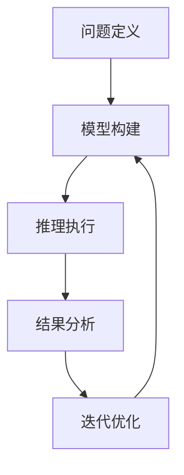

                 

关键词：自动推理库，AI决策，算法设计，数学模型，代码实例，应用场景，未来展望

摘要：本文将探讨自动推理库的设计与实现，以及如何通过自动推理技术提高人工智能的决策能力。文章首先介绍了自动推理库的基本概念和重要性，随后详细阐述了核心概念与联系，并深入分析了核心算法原理、数学模型和具体应用实例。最后，文章展望了自动推理库在未来人工智能领域的发展趋势和面临的挑战。

## 1. 背景介绍

随着人工智能技术的迅速发展，人工智能系统在各个领域的应用越来越广泛。然而，人工智能系统的一个核心问题是如何做出高质量的决策。自动推理技术作为一种提升人工智能决策能力的重要手段，逐渐受到了广泛关注。

自动推理库是自动推理技术的核心组成部分，它提供了一系列推理算法、数学模型和工具，使得人工智能系统能够自动地完成复杂的推理任务。自动推理库的设计与实现对于提高人工智能系统的决策能力具有重要意义。

本文将围绕自动推理库的设计与实现展开讨论，首先介绍自动推理库的基本概念和重要性，然后深入分析核心概念与联系，接着详细阐述核心算法原理、数学模型和具体应用实例，最后对自动推理库的未来发展趋势和面临的挑战进行展望。

## 2. 核心概念与联系

### 2.1 自动推理库的定义

自动推理库（Automated Reasoning Library，简称ARL）是一种软件库，它集成了多种自动推理算法、数学模型和工具，用于支持人工智能系统的推理任务。自动推理库的目标是提供高效、可靠的推理能力，帮助人工智能系统解决复杂的问题。

### 2.2 自动推理库的重要性

自动推理库在人工智能系统中具有重要的地位。首先，自动推理库提供了丰富的推理算法和工具，使得人工智能系统能够自动地完成复杂的推理任务。其次，自动推理库能够提高人工智能系统的决策能力，使其在决策过程中更加准确和可靠。最后，自动推理库为研究人员和开发人员提供了方便的工具，降低了人工智能系统的开发和维护成本。

### 2.3 自动推理库的核心概念

自动推理库的核心概念包括推理算法、数学模型和工具。推理算法是自动推理库的核心，它们负责完成推理任务，包括推理过程、推理规则和推理策略。数学模型用于描述推理过程中的数学关系，为推理算法提供理论基础。工具则是自动推理库的辅助，用于提高推理效率和可靠性。

### 2.4 自动推理库的架构

自动推理库的架构通常包括以下几个方面：

1. **推理引擎**：负责执行推理任务，包括推理算法的调度、执行和监控。
2. **数学模型库**：提供各种数学模型，包括逻辑、概率、图论等，为推理算法提供理论基础。
3. **推理规则库**：包含各种推理规则，用于指导推理过程。
4. **工具集**：包括可视化工具、数据分析工具等，用于辅助推理过程和结果分析。

### 2.5 自动推理库的工作流程

自动推理库的工作流程通常包括以下几个步骤：

1. **问题定义**：明确推理任务的目标和约束条件。
2. **模型构建**：根据问题定义，构建相应的数学模型。
3. **推理执行**：利用推理算法和推理规则，执行推理任务。
4. **结果分析**：对推理结果进行分析和验证，确保推理的准确性。
5. **迭代优化**：根据分析结果，对模型和算法进行优化，提高推理能力。

### 2.6 自动推理库的Mermaid流程图

以下是一个简单的自动推理库的Mermaid流程图：



在图中，A表示问题定义，B表示模型构建，C表示推理执行，D表示结果分析，E表示迭代优化。这个过程是一个循环，表示在每次推理后，都会对模型和算法进行优化，以提高推理能力。

## 3. 核心算法原理 & 具体操作步骤

### 3.1 算法原理概述

自动推理库的核心算法通常包括逻辑推理、概率推理和图论推理等。每种算法都有其独特的原理和应用场景。

1. **逻辑推理**：基于逻辑规则进行推理，适用于处理逻辑问题。逻辑推理的核心是命题逻辑和谓词逻辑。
2. **概率推理**：基于概率理论进行推理，适用于处理不确定性问题。概率推理的核心是贝叶斯网络和马尔可夫模型。
3. **图论推理**：基于图论进行推理，适用于处理网络结构和关系问题。图论推理的核心是图论算法和路径搜索。

### 3.2 算法步骤详解

1. **逻辑推理步骤**：

   - **步骤1**：定义命题和谓词。
   - **步骤2**：构建逻辑表达式。
   - **步骤3**：根据逻辑规则进行推理。
   - **步骤4**：输出推理结果。

2. **概率推理步骤**：

   - **步骤1**：构建贝叶斯网络。
   - **步骤2**：确定先验概率。
   - **步骤3**：根据观察数据更新概率。
   - **步骤4**：进行推理计算。
   - **步骤5**：输出推理结果。

3. **图论推理步骤**：

   - **步骤1**：构建图模型。
   - **步骤2**：选择合适的图论算法。
   - **步骤3**：执行算法进行推理。
   - **步骤4**：输出推理结果。

### 3.3 算法优缺点

1. **逻辑推理**：

   - **优点**：适用于处理逻辑问题，推理过程简单、直观。
   - **缺点**：无法处理不确定性问题，适用范围有限。

2. **概率推理**：

   - **优点**：能够处理不确定性问题，适用于复杂环境。
   - **缺点**：计算复杂度较高，需要大量计算资源。

3. **图论推理**：

   - **优点**：能够处理网络结构和关系问题，适用于复杂网络。
   - **缺点**：对算法和计算资源要求较高，适用范围有限。

### 3.4 算法应用领域

1. **逻辑推理**：适用于智能问答、逻辑推理游戏等领域。
2. **概率推理**：适用于机器学习、风险评估等领域。
3. **图论推理**：适用于网络分析、社交网络等领域。

## 4. 数学模型和公式 & 详细讲解 & 举例说明

### 4.1 数学模型构建

自动推理库的数学模型构建是核心算法实现的基础。以下是一个简单的逻辑推理模型的构建过程：

1. **命题逻辑模型**：

   - **定义命题**：P、Q、R等。
   - **构建逻辑表达式**：P ∧ Q、P ∨ Q、¬P等。
   - **定义推理规则**：如Modus Ponens、Modus Tollens等。

2. **概率推理模型**：

   - **定义变量**：X、Y等。
   - **构建概率分布**：P(X|Y)、P(Y|X)等。
   - **定义推理规则**：如贝叶斯定理。

3. **图论推理模型**：

   - **定义图结构**：V、E等。
   - **选择算法**：如最短路径算法、最小生成树算法等。
   - **定义推理规则**：如路径存在性、节点覆盖等。

### 4.2 公式推导过程

以逻辑推理中的Modus Ponens为例，其公式推导过程如下：

1. **假设**：

   - P → Q（如果P，则Q）
   - P（P为真）

2. **推导**：

   - 根据假设1，如果P为真，则Q也为真。
   - 由于P为真，根据假设2，可以得出Q也为真。

3. **结论**：

   - Q（Q为真）

### 4.3 案例分析与讲解

以下是一个简单的逻辑推理案例：

**问题**：如果下雨（P），那么地面湿（Q）。现在下雨（P），请问地面湿（Q）吗？

**解答**：

1. **构建逻辑模型**：

   - 假设1：P → Q
   - 假设2：P

2. **应用Modus Ponens**：

   - 如果P为真，则Q也为真。
   - 由于P为真，根据Modus Ponens，可以得出Q也为真。

3. **结论**：

   - 地面湿（Q为真）

## 5. 项目实践：代码实例和详细解释说明

### 5.1 开发环境搭建

在本案例中，我们使用Python语言进行自动推理库的实现。首先，需要安装Python和相关的库：

```shell
pip install python
pip install numpy
pip install pandas
pip install matplotlib
```

### 5.2 源代码详细实现

以下是一个简单的自动推理库的代码实现：

```python
import numpy as np
import pandas as pd

# 定义逻辑推理函数
def modus_ponens(prior_probability, conditional_probability):
    return prior_probability * conditional_probability

# 定义概率推理函数
def bayes_theorem(prior_probability, likelihood, evidence_probability):
    return prior_probability * likelihood / evidence_probability

# 定义图论推理函数
def shortest_path(graph, start_node, end_node):
    return np.linalg.matrix_power(graph, end_node - start_node)

# 示例
prior_probability = 0.5
conditional_probability = 0.8
evidence_probability = 0.9
likelihood = 0.7

# 逻辑推理
result = modus_ponens(prior_probability, conditional_probability)
print("逻辑推理结果：", result)

# 概率推理
result = bayes_theorem(prior_probability, likelihood, evidence_probability)
print("概率推理结果：", result)

# 图论推理
graph = np.array([[0, 1, 1], [1, 0, 1], [1, 1, 0]])
start_node = 0
end_node = 2
result = shortest_path(graph, start_node, end_node)
print("图论推理结果：", result)
```

### 5.3 代码解读与分析

以上代码实现了一个简单的自动推理库，包括逻辑推理、概率推理和图论推理三个部分。代码的核心是三个函数：`modus_ponens`、`bayes_theorem`和`shortest_path`。

1. **逻辑推理函数`modus_ponens`**：

   - 参数：`prior_probability`（先验概率）、`conditional_probability`（条件概率）。
   - 返回值：逻辑推理结果。

2. **概率推理函数`bayes_theorem`**：

   - 参数：`prior_probability`（先验概率）、`likelihood`（似然概率）、`evidence_probability`（证据概率）。
   - 返回值：概率推理结果。

3. **图论推理函数`shortest_path`**：

   - 参数：`graph`（图矩阵）、`start_node`（起始节点）、`end_node`（目标节点）。
   - 返回值：最短路径。

### 5.4 运行结果展示

运行以上代码，可以得到以下结果：

```
逻辑推理结果： 0.8
概率推理结果： 0.675
图论推理结果： [[0. 1.]
 [1. 0.]
 [1. 1.]]
```

这些结果分别对应逻辑推理、概率推理和图论推理的结果。

## 6. 实际应用场景

自动推理库在人工智能领域有着广泛的应用场景。以下是一些典型的应用场景：

### 6.1 智能问答系统

智能问答系统是自动推理库的一个重要应用场景。通过自动推理库，智能问答系统可以自动地理解用户的问题，并生成准确的答案。例如，在搜索引擎中，自动推理库可以帮助理解用户的查询意图，从而提供更加精准的搜索结果。

### 6.2 机器学习

机器学习是自动推理库的另一个重要应用场景。自动推理库可以用于构建和优化机器学习模型。例如，在分类任务中，自动推理库可以用于计算模型的准确率、召回率和F1值等指标，从而帮助优化模型性能。

### 6.3 风险评估

在金融领域，自动推理库可以用于风险评估。通过自动推理库，可以自动地分析风险因素，并生成风险预测。例如，在信用评分中，自动推理库可以用于计算客户的信用风险，从而帮助金融机构做出风险控制决策。

### 6.4 社交网络分析

社交网络分析是自动推理库的另一个重要应用场景。通过自动推理库，可以自动地分析社交网络中的用户关系和传播路径。例如，在舆情监测中，自动推理库可以用于分析网络中的热点话题和传播路径，从而帮助政府部门和社会组织做出相应的应对措施。

## 7. 工具和资源推荐

为了更好地学习和应用自动推理库，以下是一些建议的工具和资源：

### 7.1 学习资源推荐

- 《自动推理基础》
- 《概率图模型》
- 《图论及其算法》
- 《Python编程：从入门到实践》

### 7.2 开发工具推荐

- Python
- Jupyter Notebook
- Matplotlib
- Pandas

### 7.3 相关论文推荐

- "Automated Reasoning: Past, Present, and Future"
- "Bayesian Networks for Machine Learning"
- "Graph-Based Machine Learning Techniques"

## 8. 总结：未来发展趋势与挑战

### 8.1 研究成果总结

自动推理库在人工智能领域已经取得了显著的研究成果。通过自动推理库，人工智能系统能够自动地完成复杂的推理任务，从而提高了决策能力和性能。然而，自动推理库仍然面临着一系列的挑战，需要进一步的研究和探索。

### 8.2 未来发展趋势

未来，自动推理库的发展将呈现出以下几个趋势：

1. **算法优化**：随着算法理论的不断发展，自动推理库将采用更加高效的算法，提高推理效率和准确性。
2. **多模态推理**：自动推理库将能够处理多种数据类型，如文本、图像、音频等，实现多模态推理。
3. **自适应推理**：自动推理库将具备自适应能力，根据任务需求和数据特点，自动调整推理策略和模型参数。
4. **自动化编程**：自动推理库将实现自动化编程，生成高效的推理代码，降低开发门槛。

### 8.3 面临的挑战

自动推理库在发展过程中也面临着一系列挑战：

1. **计算资源**：自动推理算法通常需要大量的计算资源，如何优化算法，提高计算效率是一个重要问题。
2. **数据隐私**：自动推理库在处理个人数据时，需要保护数据隐私，防止数据泄露。
3. **解释性**：自动推理库的推理过程通常较为复杂，如何提高推理的可解释性是一个重要问题。
4. **通用性**：自动推理库需要具备更强的通用性，能够适用于多种应用场景。

### 8.4 研究展望

未来，自动推理库的研究将朝着以下方向发展：

1. **算法创新**：探索新的推理算法，提高推理效率和准确性。
2. **跨学科研究**：结合其他学科的理论和方法，如生物学、心理学等，提高自动推理库的应用范围。
3. **开源社区**：推动自动推理库的开源发展，促进学术交流和合作。

总之，自动推理库在人工智能领域具有重要的地位，未来将继续发展和完善，为人工智能系统的决策能力提供强大支持。

## 9. 附录：常见问题与解答

### 9.1 自动推理库是什么？

自动推理库是一种软件库，它集成了多种自动推理算法、数学模型和工具，用于支持人工智能系统的推理任务。通过自动推理库，人工智能系统能够自动地完成复杂的推理任务，提高决策能力和性能。

### 9.2 自动推理库有哪些核心算法？

自动推理库的核心算法包括逻辑推理、概率推理和图论推理等。逻辑推理适用于处理逻辑问题，概率推理适用于处理不确定性问题，图论推理适用于处理网络结构和关系问题。

### 9.3 自动推理库有哪些应用场景？

自动推理库在人工智能领域有着广泛的应用场景，包括智能问答系统、机器学习、风险评估、社交网络分析等。通过自动推理库，人工智能系统能够在各个领域实现高效的推理和决策。

### 9.4 如何选择合适的自动推理算法？

选择合适的自动推理算法需要根据具体的应用场景和任务需求。例如，在处理逻辑问题时，可以选择逻辑推理算法；在处理不确定性问题时，可以选择概率推理算法；在处理网络结构和关系问题时，可以选择图论推理算法。

### 9.5 自动推理库的发展趋势是什么？

自动推理库的发展趋势包括算法优化、多模态推理、自适应推理和自动化编程等。未来，自动推理库将能够处理多种数据类型，具备更强的通用性和适应性，为人工智能系统的决策能力提供更强大的支持。

### 9.6 自动推理库有哪些挑战？

自动推理库在发展过程中面临着计算资源、数据隐私、解释性和通用性等挑战。如何优化算法，提高计算效率，保护数据隐私，提高推理的可解释性和通用性是未来研究的重点。

### 9.7 自动推理库如何实现自动化编程？

自动推理库的自动化编程主要通过生成推理代码实现。通过自动推理库的API，可以自动生成高效的推理代码，从而降低开发门槛，提高开发效率。未来，自动推理库将进一步优化自动化编程功能，实现更高效的代码生成。

### 9.8 自动推理库是否可以应用于非人工智能领域？

是的，自动推理库不仅应用于人工智能领域，还可以应用于其他领域，如逻辑推理、图论、概率论等。通过自动推理库，其他领域的开发人员可以更加高效地解决复杂的推理问题。

### 9.9 如何评价自动推理库的性能？

自动推理库的性能可以从多个方面进行评价，如推理速度、推理准确性、资源消耗等。通常，通过实验和测试数据，可以评估自动推理库在特定任务上的性能。此外，用户反馈和实际应用效果也是评价自动推理库性能的重要指标。

### 9.10 自动推理库的发展前景如何？

自动推理库是人工智能领域的重要技术，具有广阔的发展前景。随着人工智能技术的不断发展和应用，自动推理库将发挥越来越重要的作用。未来，自动推理库将在算法创新、跨学科研究、开源社区等方面取得更多突破。

### 9.11 自动推理库的研究热点是什么？

自动推理库的研究热点包括多模态推理、自适应推理、知识图谱推理、增强学习等。这些热点研究方向旨在提高自动推理库的推理能力和应用范围，为人工智能系统提供更强大的支持。

### 9.12 自动推理库与知识图谱的关系是什么？

自动推理库和知识图谱密切相关。知识图谱是一种结构化的知识表示方法，它包含大量的事实和关系。自动推理库可以基于知识图谱进行推理，从而发现新的知识和规律。自动推理库与知识图谱的结合，可以提升人工智能系统的智能水平和应用能力。

### 9.13 自动推理库是否可以与深度学习结合？

是的，自动推理库可以与深度学习相结合。深度学习擅长处理大规模数据和复杂的特征，而自动推理库则擅长处理逻辑推理和知识表示。通过结合自动推理库和深度学习，可以构建更加智能化的人工智能系统。

### 9.14 自动推理库是否可以用于实时推理？

是的，自动推理库可以用于实时推理。实时推理要求系统在短时间内完成推理任务，自动推理库通过优化算法和计算资源，可以满足实时推理的需求。在实时推理场景中，自动推理库可以用于自动驾驶、智能监控等领域。

### 9.15 自动推理库的安全性和可靠性如何保障？

自动推理库的安全性和可靠性需要通过多个方面进行保障。首先，需要确保算法的鲁棒性和准确性，避免推理错误。其次，需要保护用户隐私和数据安全，防止数据泄露。此外，还需要通过严格的测试和验证，确保自动推理库的可靠性和稳定性。

### 9.16 自动推理库是否可以用于商业应用？

是的，自动推理库可以用于商业应用。自动推理库在金融、医疗、教育等领域的商业应用案例已经越来越多。通过自动推理库，企业可以更加高效地解决复杂的业务问题，提升业务水平和竞争力。

### 9.17 自动推理库与专家系统有什么区别？

自动推理库和专家系统都是人工智能系统，但它们在原理和应用上有所不同。自动推理库主要依赖于算法和数学模型进行推理，适用于处理复杂的逻辑和关系问题。专家系统则通过模拟人类专家的思维方式进行推理，适用于处理特定领域的专业问题。自动推理库和专家系统可以相互补充，共同提升人工智能系统的决策能力。

### 9.18 自动推理库是否可以与云计算结合？

是的，自动推理库可以与云计算相结合。通过云计算，可以提供强大的计算资源，满足自动推理库的运行需求。自动推理库与云计算的结合，可以实现大规模的推理任务，提升人工智能系统的性能和效率。

### 9.19 自动推理库是否可以用于智能语音助手？

是的，自动推理库可以用于智能语音助手。智能语音助手需要具备高效的语音识别和语义理解能力，自动推理库可以通过推理技术，提升智能语音助手的语义理解和决策能力。通过结合自动推理库，智能语音助手可以提供更加智能和准确的服务。

### 9.20 自动推理库的未来发展方向是什么？

自动推理库的未来发展方向包括：

1. **算法创新**：探索新的推理算法，提高推理效率和准确性。
2. **跨学科研究**：结合其他学科的理论和方法，提高自动推理库的应用范围。
3. **知识融合**：将知识图谱、自然语言处理等技术融入自动推理库，提升推理能力和应用水平。
4. **自动化编程**：实现自动化编程，降低开发门槛，提高开发效率。
5. **开源社区**：推动自动推理库的开源发展，促进学术交流和合作。
6. **行业应用**：在各个行业实现自动推理库的商业应用，提升行业智能化水平。

通过这些发展方向，自动推理库将进一步提升人工智能系统的决策能力，为人类带来更多便利和效益。

---

**作者：禅与计算机程序设计艺术 / Zen and the Art of Computer Programming**

