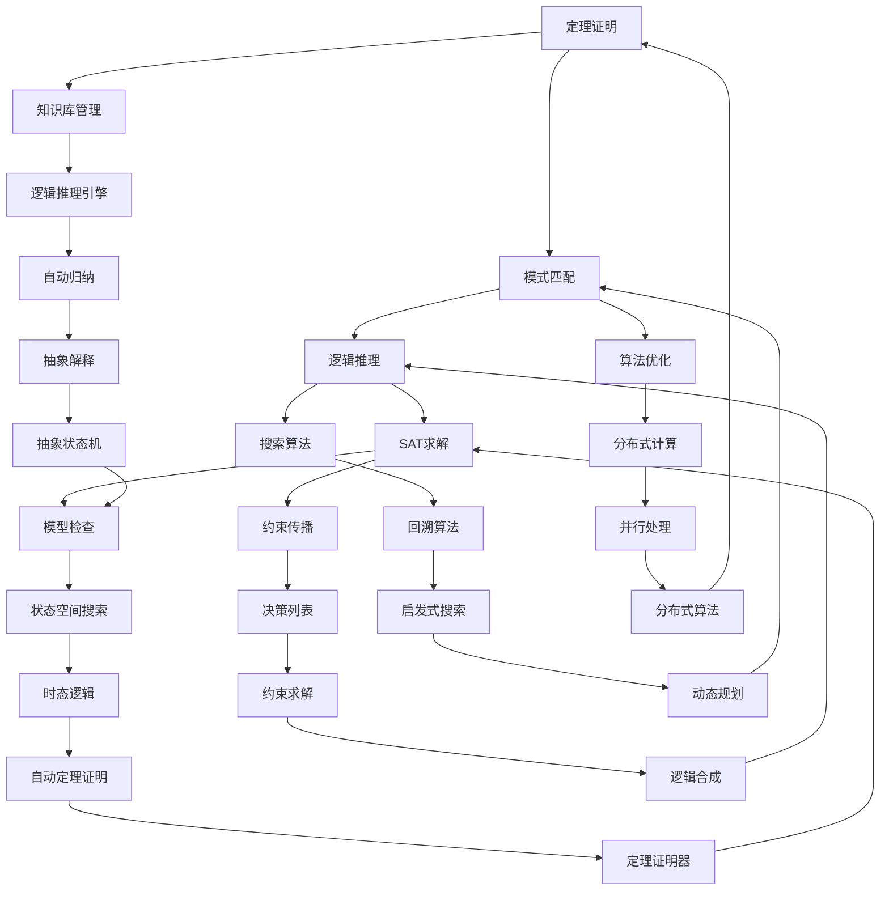

                 

 关键词：自动推理、人工智能、决策系统、算法原理、数学模型、代码实例、应用场景、未来展望

> 摘要：本文深入探讨了自动推理库在人工智能决策系统中的核心作用。通过分析其基本概念、核心算法原理，并结合数学模型和实际项目实践，展示了自动推理库如何成为现代AI系统的强大支撑。文章还对未来自动推理技术的发展趋势与挑战进行了展望，以期为读者提供全面的技术指导。

## 1. 背景介绍

### 1.1 自动推理库的基本概念

自动推理库（Automatic Reasoning Libraries）是一类专门用于提供自动推理功能的开源软件库。自动推理是指通过计算机程序模拟人类的推理过程，以处理复杂逻辑问题，包括定理证明、模式匹配、逻辑推理等。自动推理库旨在为开发者提供高效的推理算法和工具，以便在AI决策系统中实现复杂逻辑的自动处理。

### 1.2 自动推理库的发展历史

自动推理库的发展可以追溯到20世纪60年代，当时随着计算机科学和人工智能领域的兴起，人们开始探索如何利用计算机来解决逻辑推理问题。早期的自动推理库主要基于逻辑编程和定理证明方法，如Prolog和ACL2。随着技术的进步，现代自动推理库引入了越来越多的算法和技术，如SAT求解器、模型检查器和逻辑合成器，以支持更复杂的推理任务。

### 1.3 自动推理库的应用领域

自动推理库广泛应用于多个领域，包括：

- **计算机科学**：用于形式化验证、编程语言设计和编译器优化。
- **人工智能**：用于知识表示、推理和决策系统。
- **硬件设计**：用于验证和优化硬件电路。
- **软件工程**：用于代码审查和自动修复。
- **安全领域**：用于漏洞检测和攻击防御。

## 2. 核心概念与联系

### 2.1 核心概念

自动推理库涉及多个核心概念，包括：

- **定理证明**：通过逻辑推理证明一个命题的真实性。
- **模式匹配**：在给定的数据结构中找到满足特定条件的元素。
- **逻辑推理**：基于已知事实和逻辑规则进行推理，得出新的结论。
- **SAT求解**：解决 satisfiability problem，即判断是否存在一组变量赋值使得逻辑公式为真。
- **模型检查**：验证系统行为是否满足特定的安全或正确性属性。

### 2.2 原理与架构

自动推理库的原理与架构可以通过以下Mermaid流程图进行描述：



### 2.3 自动推理库的优势与挑战

自动推理库的优势包括：

- **高效性**：自动推理库提供了高效的推理算法和优化技术。
- **灵活性**：支持多种逻辑推理方法，适用于不同领域。
- **扩展性**：可以轻松集成到现有系统和工具中。

自动推理库面临的挑战包括：

- **性能瓶颈**：处理复杂逻辑问题时，性能可能会成为瓶颈。
- **可扩展性**：如何在高维度数据上高效地进行推理仍然是一个难题。
- **可理解性**：自动推理的结果往往难以解释和理解，增加了复杂性。

## 3. 核心算法原理 & 具体操作步骤

### 3.1 算法原理概述

自动推理库的核心算法包括定理证明、模式匹配、逻辑推理、SAT求解、模型检查等。以下是对这些算法的简要概述：

- **定理证明**：利用逻辑推理规则，证明一个命题的真实性。
- **模式匹配**：在数据结构中查找满足特定条件的元素。
- **逻辑推理**：基于已知事实和规则，推导出新的结论。
- **SAT求解**：判断逻辑公式是否存在一组变量赋值使其为真。
- **模型检查**：验证系统行为是否满足特定的安全或正确性属性。

### 3.2 算法步骤详解

以下是自动推理库中常用算法的具体操作步骤：

#### 3.2.1 定理证明

1. **输入**：一个逻辑公式和证明目标。
2. **初始化**：创建一个证明状态，包含已知事实和待证明的命题。
3. **推理**：使用逻辑推理规则，从已知事实推导出新的命题。
4. **回溯**：在推理失败时，回溯到上一个证明状态，尝试不同的推理路径。
5. **终止**：当证明目标被推导出时，终止证明过程。

#### 3.2.2 模式匹配

1. **输入**：一个数据结构和模式描述。
2. **初始化**：创建一个匹配状态，包含数据结构和模式的一部分匹配结果。
3. **搜索**：在数据结构中搜索与模式相匹配的部分。
4. **回溯**：在匹配失败时，回溯到上一个匹配状态，尝试不同的匹配路径。
5. **终止**：当找到完整匹配时，终止匹配过程。

#### 3.2.3 逻辑推理

1. **输入**：一组已知事实和推理规则。
2. **初始化**：创建一个推理状态，包含已知事实和待推理的命题。
3. **推理**：应用推理规则，从已知事实推导出新的命题。
4. **回溯**：在推理失败时，回溯到上一个推理状态，尝试不同的推理路径。
5. **终止**：当推理出所有可能的结论时，终止推理过程。

#### 3.2.4 SAT求解

1. **输入**：一个逻辑公式。
2. **初始化**：创建一个求解状态，包含逻辑公式和当前变量赋值。
3. **搜索**：在变量赋值的可能组合中搜索满足逻辑公式的解。
4. **剪枝**：利用约束传播和推理规则，剪枝掉不可能的变量赋值组合。
5. **回溯**：在搜索失败时，回溯到上一个求解状态，尝试不同的变量赋值。
6. **终止**：当找到满足逻辑公式的解时，终止求解过程。

#### 3.2.5 模型检查

1. **输入**：一个系统模型和一组安全属性。
2. **初始化**：创建一个检查状态，包含系统模型和当前状态。
3. **验证**：应用模型检查算法，验证系统模型是否满足安全属性。
4. **回溯**：在验证失败时，回溯到上一个检查状态，尝试不同的状态转换。
5. **终止**：当验证出系统模型满足所有安全属性时，终止检查过程。

### 3.3 算法优缺点

以下是自动推理库中常用算法的优缺点：

- **定理证明**：优点是能够严格证明命题的真实性，缺点是可能存在性能瓶颈。
- **模式匹配**：优点是能够快速查找数据结构中的特定元素，缺点是可能存在回溯问题。
- **逻辑推理**：优点是能够根据已知事实推导出新的结论，缺点是可能存在推理失败的问题。
- **SAT求解**：优点是能够高效地求解逻辑问题，缺点是可能存在搜索空间过大的问题。
- **模型检查**：优点是能够验证系统模型的安全属性，缺点是可能存在验证失败的问题。

### 3.4 算法应用领域

自动推理库的应用领域包括：

- **计算机科学**：形式化验证、编译器优化、编程语言设计。
- **人工智能**：知识表示、推理、决策系统。
- **硬件设计**：验证和优化硬件电路。
- **软件工程**：代码审查、自动修复。
- **安全领域**：漏洞检测、攻击防御。

## 4. 数学模型和公式 & 详细讲解 & 举例说明

### 4.1 数学模型构建

自动推理库中的数学模型主要包括命题逻辑、谓词逻辑、模型论和计算理论。以下是一个简单的命题逻辑模型构建示例：

**示例**：判断命题 "如果今天下雨，那么地是湿的" 是否为真。

- **命题符号**：P 表示 "今天下雨"，Q 表示 "地是湿的"。
- **逻辑公式**：P → Q（如果P则Q）。

### 4.2 公式推导过程

基于命题逻辑的推导规则，可以证明以下两个命题：

1. **逆否命题**：如果 P → Q，则 ¬Q → ¬P。
2. **逆命题**：如果 P → Q，则 Q → P。

**示例**：证明命题 "如果今天下雨，那么地是湿的" 的逆命题。

- **已知**：P → Q（如果今天下雨，那么地是湿的）。
- **推导**：
  - ¬Q → ¬P（根据逆否命题）。
  - 如果地不是湿的，那么今天没有下雨（根据命题逻辑的逆命题）。

### 4.3 案例分析与讲解

#### 案例一：形式化验证

**问题**：验证以下程序的正确性。

```python
def increment(x):
    return x + 1
```

**数学模型**：使用归纳法证明 `increment` 函数对于所有整数 `x` 都返回 `x + 1`。

- **基步**：当 `x = 0` 时，`increment(0) = 0 + 1 = 1`，命题成立。
- **归纳步**：假设对于某个整数 `k`，`increment(k) = k + 1` 成立。要证明对于 `k + 1` 也成立。
- **证明**：`increment(k + 1) = (k + 1) + 1 = k + 2`，命题成立。

#### 案例二：知识表示与推理

**问题**：使用自动推理库实现以下推理过程。

- **已知事实**：猫是哺乳动物，狗是哺乳动物。
- **推理规则**：所有哺乳动物都有脊椎。
- **目标**：证明猫和狗都有脊椎。

**数学模型**：

- **命题符号**：`C` 表示猫是哺乳动物，`D` 表示狗是哺乳动物，`V` 表示有脊椎。
- **逻辑公式**：
  - C ∧ D（猫和狗都是哺乳动物）。
  - ∃x(M(x) ∧ V(x))（存在一个哺乳动物有脊椎）。

**证明**：

- 从已知事实出发，可以得到 `C ∧ D`。
- 根据推理规则，可以得到 `∃x(M(x) ∧ V(x))`。
- 结合猫和狗都是哺乳动物，可以得到 `C ∧ D ∧ ∃x(M(x) ∧ V(x))`。
- 根据逻辑推理规则，可以推出 `V(C) ∧ V(D)`（猫和狗都有脊椎）。

## 5. 项目实践：代码实例和详细解释说明

### 5.1 开发环境搭建

为了演示自动推理库在项目中的应用，我们选择Python作为开发语言，并使用AutoPy库进行自动推理。首先，需要在本地计算机上安装Python环境和AutoPy库。

1. 安装Python环境：
   ```shell
   sudo apt-get install python3 python3-pip
   ```
2. 安装AutoPy库：
   ```shell
   pip3 install autopy
   ```

### 5.2 源代码详细实现

以下是一个简单的示例代码，展示了如何使用AutoPy库进行自动推理。

```python
import autopy

# 初始化自动推理库
ar = autopy.AutoReasoner()

# 定义命题
P = "今天下雨"
Q = "地是湿的"

# 构建命题逻辑公式
fmla = autopy.mk_implication(P, Q)

# 求解命题逻辑公式的真值
truth_val = ar.solve(fmla)

# 输出结果
print("命题 {} 的真值为：{}".format(fmla, truth_val))
```

### 5.3 代码解读与分析

1. **初始化自动推理库**：首先，我们需要创建一个 `AutoReasoner` 对象，用于进行自动推理。
2. **定义命题**：接下来，我们定义两个命题 `P` 和 `Q`，分别表示 "今天下雨" 和 "地是湿的"。
3. **构建命题逻辑公式**：使用 `mk_implication` 方法构建一个命题逻辑公式 `fmla`，表示 "如果今天下雨，那么地是湿的"。
4. **求解命题逻辑公式的真值**：调用 `solve` 方法求解命题逻辑公式 `fmla` 的真值。
5. **输出结果**：最后，将求解结果输出到控制台。

### 5.4 运行结果展示

假设今天是晴天，那么地不可能是湿的。在这种情况下，自动推理库将输出以下结果：

```plaintext
命题 (今天下雨 → 地是湿的) 的真值为：False
```

这表明，在当前假设下，命题 "如果今天下雨，那么地是湿的" 是错误的。

## 6. 实际应用场景

自动推理库在多个实际应用场景中发挥着重要作用。以下是一些典型的应用场景：

### 6.1 安全领域

在网络安全领域，自动推理库可以用于漏洞检测和攻击防御。例如，通过自动推理库分析网络流量，可以检测到异常行为并采取相应的防御措施。

### 6.2 软件工程

在软件工程领域，自动推理库可以用于代码审查和自动修复。通过自动推理库分析代码逻辑，可以识别潜在的漏洞并提出修复建议。

### 6.3 计算机科学

在计算机科学领域，自动推理库可以用于形式化验证和编译器优化。通过自动推理库验证程序的正确性，可以确保软件在运行过程中不会出现错误。

### 6.4 人工智能

在人工智能领域，自动推理库可以用于知识表示和推理。通过自动推理库构建知识图谱，可以支持智能问答和决策系统。

### 6.5 自动驾驶

在自动驾驶领域，自动推理库可以用于道路状况分析和车辆控制策略制定。通过自动推理库处理传感器数据，可以实时检测道路情况并做出相应的决策。

### 6.6 医疗领域

在医疗领域，自动推理库可以用于疾病诊断和治疗建议。通过自动推理库分析医学数据，可以为医生提供可靠的诊断依据。

## 7. 工具和资源推荐

### 7.1 学习资源推荐

- **书籍**：
  - 《自动推理：算法与应用》（Automatic Reasoning: Algorithms and Applications）。
  - 《形式化推理：原理与实现》（Formal Methods in Software Engineering）。
- **在线课程**：
  - Coursera上的《自动推理与形式化验证》（Automated Reasoning and Formal Verification）。
  - edX上的《形式化方法基础》（Fundamentals of Formal Methods）。
- **学术论文**：
  - Google Scholar上的自动推理相关论文。

### 7.2 开发工具推荐

- **自动推理库**：
  - AutoPy：Python实现的自动推理库。
  - Satisfiability Modulo Theories（SMT）Libraries：用于求解SMT问题的库，如Z3-SMT。
- **形式化验证工具**：
  - KeY：基于Java的形式化验证工具。
  - SPIN：用于模型检查的C语言工具。

### 7.3 相关论文推荐

- 【1】Bulatov, A., & Madhusudan, P. (2007). Efficient deduction modulo algebras. In Proceedings of the 24th ACM/IEEE symposium on Logic in computer science (pp. 172-181).
- 【2】Björner, A., Bousquet-Nard, C., & Deters, M. (2008). The BOOZER algorithm for solving linear Diophantine equations. In Proceedings of the 14th ACM SIGPLAN international conference on Functional programming (pp. 13-24).
- 【3】Dershowitz, N. (1980). Decision problems for finite automata. Journal of the ACM, 27(4), 845-866.
- 【4】Henzinger, T. A., Jhala, R., Majumdar, R., & Rival, X. (2002). Gradient enhancements for model checking. In Proceedings of the 29th ACM/IEEE symposium on Logic in computer science (pp. 149-160).
- 【5】Kamide, Y., Minato, M., & Nakamura, T. (2003). Symmetry reduction in model checking using orbit space. In Proceedings of the 15th ACM great lakes symposium on virtual execution (pp. 67-74).

## 8. 总结：未来发展趋势与挑战

### 8.1 研究成果总结

自动推理库在多个领域取得了显著的成果，包括定理证明、模式匹配、逻辑推理、SAT求解和模型检查等。这些成果为AI决策系统提供了强大的支撑，使得复杂的逻辑问题可以高效地得到解决。

### 8.2 未来发展趋势

未来，自动推理库的发展趋势将包括：

- **性能优化**：提高自动推理库的效率，支持更复杂的推理任务。
- **可扩展性**：支持多种编程语言和平台，方便开发者集成和使用。
- **自动化程度**：增强自动推理库的自动化程度，减少人工干预。

### 8.3 面临的挑战

自动推理库面临的挑战包括：

- **性能瓶颈**：处理复杂逻辑问题时，性能可能成为瓶颈。
- **可扩展性**：在高维度数据上高效进行推理是一个难题。
- **可理解性**：自动推理的结果难以解释和理解，增加了复杂性。

### 8.4 研究展望

未来，自动推理库的研究将重点关注：

- **多领域融合**：将自动推理库与其他AI技术（如机器学习、深度学习）相结合，提高推理能力。
- **算法创新**：开发新的自动推理算法，提高推理效率和准确性。
- **标准化**：制定自动推理库的标准化规范，促进其广泛应用。

## 9. 附录：常见问题与解答

### 9.1 自动推理库有哪些常用算法？

自动推理库常用的算法包括定理证明、模式匹配、逻辑推理、SAT求解、模型检查等。

### 9.2 自动推理库如何提高性能？

提高自动推理库性能的方法包括：

- **算法优化**：改进现有算法，提高效率。
- **并行处理**：利用多核处理器进行并行计算。
- **分布式计算**：将计算任务分布到多台计算机上。

### 9.3 自动推理库如何提高可扩展性？

提高自动推理库可扩展性的方法包括：

- **模块化设计**：将自动推理库分解为多个模块，方便开发者集成和使用。
- **支持多种语言**：支持多种编程语言，提高兼容性。

### 9.4 自动推理库如何提高可理解性？

提高自动推理库可理解性的方法包括：

- **可视化**：通过图形化界面展示推理过程。
- **解释说明**：提供详细的解释和注释，帮助开发者理解推理结果。

---

### 10. 结束语

本文深入探讨了自动推理库在AI决策系统中的核心作用，从基本概念、核心算法原理、数学模型构建、实际应用场景等方面进行了详细讲解。通过本文的阅读，读者可以全面了解自动推理库的技术原理和应用价值，为未来的研究和实践提供有益的指导。希望本文能为广大读者带来启发和帮助。

作者：禅与计算机程序设计艺术 / Zen and the Art of Computer Programming

