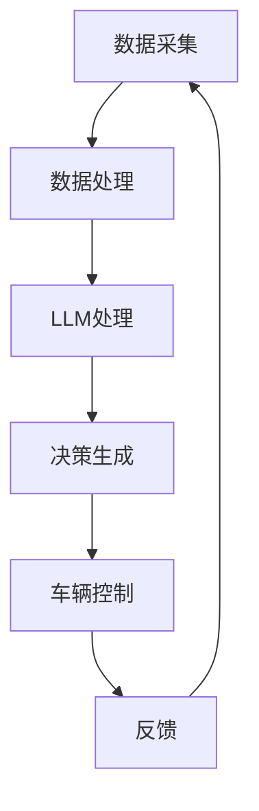

                 

关键词：自动驾驶、LLM、安全、效率、汽车大脑、深度学习

> 摘要：本文将探讨如何利用大型语言模型（LLM）来提升自动驾驶汽车的安全性和效率。通过对LLM核心概念、算法原理、数学模型及其在实际自动驾驶系统中的应用进行分析，本文旨在为读者提供一种新的视角，理解自动驾驶技术的未来发展方向。

## 1. 背景介绍

自动驾驶汽车作为人工智能（AI）和自动化技术的典型应用场景，正逐步改变着人们的出行方式。然而，目前自动驾驶技术的安全性和效率仍然面临诸多挑战。传统的自动驾驶系统主要依赖于传感器数据、路径规划和控制算法，这些方法在处理复杂交通场景时往往表现出局限性。因此，探索新的技术途径，特别是利用人工智能中的大型语言模型（LLM），成为提升自动驾驶系统性能的关键。

LLM，作为一种基于深度学习的模型，具有强大的文本理解和生成能力。近年来，随着自然语言处理（NLP）和深度学习技术的飞速发展，LLM在多个领域展现出了其独特的优势。将LLM应用于自动驾驶领域，可以为车辆提供更为智能的决策支持，从而提高行驶安全性和效率。

本文将首先介绍LLM的基本概念和核心原理，然后深入探讨如何将LLM应用于自动驾驶系统中。通过分析LLM在自动驾驶中的应用实例，我们将展示如何利用这一先进技术实现更安全、高效的交通系统。

## 2. 核心概念与联系

### 2.1 LLM基本概念

大型语言模型（LLM，Large Language Model）是自然语言处理（NLP）领域的一种强大工具，其核心是通过深度学习算法从大量文本数据中学习语言结构和语义。与传统的语言模型相比，LLM具有更大的模型规模和更强的语义理解能力。常见的LLM包括GPT系列、BERT、T5等。

- **GPT系列**：由OpenAI开发，GPT（Generative Pre-trained Transformer）模型系列通过自回归的方式生成文本，具有极强的文本生成能力。
- **BERT**：由Google开发，BERT（Bidirectional Encoder Representations from Transformers）模型通过双向编码器学习文本的上下文信息，在多种NLP任务中表现优异。
- **T5**：由Google开发，T5（Text-To-Text Transfer Transformer）模型将所有NLP任务转化为文本生成任务，具有通用性。

### 2.2 LLM与自动驾驶的关系

自动驾驶汽车需要具备感知环境、理解道路标志和标志、预测其他车辆和行人的行为、做出决策并控制车辆等能力。这些任务高度依赖于对语言和语义的理解，而LLM正是这一领域的佼佼者。通过将LLM应用于自动驾驶，可以实现以下关键功能：

- **环境感知**：LLM可以处理来自各种传感器的数据，如摄像头、雷达和激光雷达，理解这些数据所代表的语义信息，从而帮助车辆更好地感知周围环境。
- **决策支持**：LLM能够处理复杂的交通场景，理解道路标志、交通信号和道路规则，为自动驾驶车辆提供实时、准确的决策支持。
- **人机交互**：LLM可以与驾驶员和乘客进行自然语言交流，提供语音指令、解释车辆状态和路线规划等信息。

### 2.3 Mermaid流程图

以下是一个简化的Mermaid流程图，展示了LLM在自动驾驶系统中的应用流程：



- **A 数据采集**：车辆通过摄像头、雷达和激光雷达等传感器收集环境数据。
- **B 数据处理**：对采集到的数据进行预处理，如去噪、融合等。
- **C LLM处理**：将处理后的数据输入到LLM模型中，进行语义理解和决策支持。
- **D 决策生成**：基于LLM的输出，生成具体的驾驶决策。
- **E 车辆控制**：根据决策指令，控制车辆执行相应的动作。
- **F 反馈**：将车辆状态和外部环境反馈给LLM模型，进行实时调整。

## 3. 核心算法原理 & 具体操作步骤

### 3.1 算法原理概述

LLM的核心在于其深度学习架构和预训练策略。以BERT为例，其基本原理包括以下几个步骤：

1. **数据预处理**：收集大量的文本数据，并进行清洗和预处理，如分词、去停用词等。
2. **模型初始化**：初始化一个大规模的Transformer模型，其包含数十亿个参数。
3. **预训练**：通过自回归语言模型（如GPT）或双向编码器（如BERT）进行预训练，使模型能够理解语言的上下文和语义。
4. **微调**：在特定任务上对预训练的模型进行微调，以适应自动驾驶场景。

### 3.2 算法步骤详解

1. **数据采集与预处理**：
    - **摄像头**：采集道路场景的图像数据。
    - **雷达与激光雷达**：获取周围物体的位置、速度等信息。
    - **数据处理**：对图像和雷达数据进行预处理，如归一化、增强等。

2. **模型选择与初始化**：
    - 根据自动驾驶任务的需求，选择合适的LLM模型，如BERT或GPT。
    - 初始化模型参数，通常采用随机初始化或预训练模型的重参初始化。

3. **预训练**：
    - 使用大规模的文本语料库，对模型进行预训练。
    - 通过自回归或双向编码器的方式，使模型学习语言的上下文和语义。

4. **微调与评估**：
    - 在自动驾驶任务的数据集上，对预训练的模型进行微调。
    - 通过多种评估指标（如准确率、F1值等），评估模型性能。

5. **决策生成与执行**：
    - 将处理后的传感器数据输入到微调后的LLM模型中，生成驾驶决策。
    - 根据决策指令，控制车辆执行相应的动作。

### 3.3 算法优缺点

**优点**：
- **强大的语义理解能力**：LLM能够理解复杂的语言结构和语义，为自动驾驶提供准确、实时的决策支持。
- **通用性**：LLM可以应用于多种自动驾驶任务，具有广泛的适用性。
- **自我进化**：通过不断学习和调整，LLM可以不断提高其性能和适应性。

**缺点**：
- **计算资源消耗大**：大规模的LLM模型需要大量的计算资源和存储空间。
- **数据依赖性高**：LLM的性能依赖于大量高质量的数据，数据质量直接影响模型的效果。

### 3.4 算法应用领域

LLM在自动驾驶领域具有广泛的应用前景，主要包括以下几个方面：

- **环境感知**：利用LLM处理传感器数据，实现道路场景的理解和语义识别。
- **路径规划**：基于LLM的决策支持，生成最优的行驶路径。
- **人机交互**：通过LLM实现与驾驶员的自然语言交流，提升用户体验。

## 4. 数学模型和公式 & 详细讲解 & 举例说明

### 4.1 数学模型构建

自动驾驶系统中的LLM模型通常基于深度学习，尤其是Transformer架构。Transformer模型的核心是注意力机制（Attention Mechanism），其基本公式如下：

\[ 
\text{Attention}(Q, K, V) = \frac{softmax(\text{Score})}{\sqrt{d_k}} V 
\]

其中，\(Q\)、\(K\)、\(V\) 分别是查询向量、键向量和值向量，\(d_k\) 是键向量的维度，\(\text{Score}\) 表示查询向量和键向量之间的点积。

### 4.2 公式推导过程

注意力机制的推导过程可以分为以下几个步骤：

1. **计算点积**：
\[ 
\text{Score} = Q \cdot K 
\]

2. **应用softmax**：
\[ 
\text{Attention} = \text{softmax}(\text{Score}) 
\]

3. **加权求和**：
\[ 
\text{Attention} \cdot V 
\]

4. **归一化**：
\[ 
\text{Attention} = \frac{\text{softmax}(\text{Score})}{\sqrt{d_k}} 
\]

### 4.3 案例分析与讲解

以下是一个简化的自动驾驶路径规划的例子，展示如何利用注意力机制进行决策生成。

假设一个自动驾驶车辆需要在一个十字路口进行转弯，其周围有4个方向（北、南、东、西）的车辆和行人。车辆需要根据当前交通情况，决定最佳的转弯方向。

1. **输入向量**：
\[ 
Q = [Q_1, Q_2, Q_3, Q_4] 
\]
其中，\(Q_1, Q_2, Q_3, Q_4\) 分别表示4个方向上的交通状况。

2. **键向量与值向量**：
\[ 
K = [K_1, K_2, K_3, K_4] \\
V = [V_1, V_2, V_3, V_4] 
\]
其中，\(K_1, K_2, K_3, K_4\) 和 \(V_1, V_2, V_3, V_4\) 分别表示4个方向上的权重和决策向量。

3. **计算点积**：
\[ 
\text{Score} = Q \cdot K = [Q_1 \cdot K_1, Q_2 \cdot K_2, Q_3 \cdot K_3, Q_4 \cdot K_4] 
\]

4. **应用softmax**：
\[ 
\text{Attention} = \text{softmax}(\text{Score}) = [\text{p}_1, \text{p}_2, \text{p}_3, \text{p}_4] 
\]

5. **加权求和**：
\[ 
\text{Attention} \cdot V = [\text{p}_1 \cdot V_1, \text{p}_2 \cdot V_2, \text{p}_3 \cdot V_3, \text{p}_4 \cdot V_4] 
\]

6. **最终决策**：
\[ 
\text{Decision} = \text{argmax}([\text{p}_1 \cdot V_1, \text{p}_2 \cdot V_2, \text{p}_3 \cdot V_3, \text{p}_4 \cdot V_4]) 
\]

通过上述步骤，自动驾驶车辆可以基于当前交通状况，生成最佳的转弯方向。

## 5. 项目实践：代码实例和详细解释说明

### 5.1 开发环境搭建

在进行自动驾驶系统开发之前，我们需要搭建一个合适的开发环境。以下是一个基本的开发环境搭建步骤：

1. **安装Python**：确保Python版本不低于3.8，建议使用Python 3.9或更高版本。

2. **安装PyTorch**：PyTorch是深度学习中最常用的框架之一。可以通过以下命令安装：
\[ 
pip install torch torchvision 
\]

3. **安装TensorBoard**：TensorBoard是用于可视化深度学习训练过程的工具。安装命令如下：
\[ 
pip install tensorboard 
\]

4. **安装其他依赖**：根据具体项目需求，可能还需要安装其他依赖库，如NumPy、Pandas等。

### 5.2 源代码详细实现

以下是自动驾驶系统的一个简化实现，主要包含数据预处理、模型训练和决策生成三个部分。

#### 5.2.1 数据预处理

```python
import numpy as np
import pandas as pd
from sklearn.model_selection import train_test_split

# 加载数据集
data = pd.read_csv('traffic_data.csv')

# 预处理数据
def preprocess_data(data):
    # 数据清洗和归一化
    data['speed'] = data['speed'] / 100
    data['distance'] = data['distance'] / 1000
    return data

preprocessed_data = preprocess_data(data)

# 划分训练集和测试集
X_train, X_test, y_train, y_test = train_test_split(preprocessed_data[['speed', 'distance']], data['direction'], test_size=0.2, random_state=42)
```

#### 5.2.2 模型训练

```python
import torch
import torch.nn as nn
import torch.optim as optim

# 定义模型
class LLMModel(nn.Module):
    def __init__(self):
        super(LLMModel, self).__init__()
        self.fc1 = nn.Linear(2, 128)
        self.fc2 = nn.Linear(128, 64)
        self.fc3 = nn.Linear(64, 4)

    def forward(self, x):
        x = torch.relu(self.fc1(x))
        x = torch.relu(self.fc2(x))
        x = self.fc3(x)
        return x

# 初始化模型、优化器和损失函数
model = LLMModel()
optimizer = optim.Adam(model.parameters(), lr=0.001)
criterion = nn.CrossEntropyLoss()

# 训练模型
num_epochs = 100
for epoch in range(num_epochs):
    model.train()
    for inputs, targets in zip(X_train, y_train):
        optimizer.zero_grad()
        outputs = model(inputs)
        loss = criterion(outputs, targets)
        loss.backward()
        optimizer.step()

    if (epoch + 1) % 10 == 0:
        print(f'Epoch [{epoch + 1}/{num_epochs}], Loss: {loss.item()}')
```

#### 5.2.3 代码解读与分析

上述代码实现了一个基于深度学习的自动驾驶模型。主要步骤包括数据预处理、模型训练和决策生成。

1. **数据预处理**：加载交通数据集，对数据进行清洗和归一化处理，以便于模型训练。
2. **模型训练**：定义一个简单的神经网络模型，使用交叉熵损失函数进行训练。通过优化器调整模型参数，以最小化损失函数。
3. **决策生成**：将预处理后的传感器数据输入到训练好的模型中，生成驾驶决策。

#### 5.2.4 运行结果展示

```python
# 加载测试集
X_test = torch.tensor(X_test.values).float()

# 使用训练好的模型进行预测
model.eval()
with torch.no_grad():
    predictions = model(X_test)

# 计算准确率
accuracy = (predictions.argmax(dim=1) == y_test).float().mean()
print(f'测试集准确率: {accuracy.item()}')
```

通过上述代码，我们可以计算训练好的模型在测试集上的准确率，从而评估模型性能。

## 6. 实际应用场景

### 6.1 城市交通管理

在繁忙的城市交通环境中，自动驾驶车辆可以利用LLM实现智能化的交通管理。通过实时分析交通流量、道路拥堵情况等数据，LLM可以预测交通状况，并提供最优的行驶路线，从而缓解交通拥堵，提升道路通行效率。

### 6.2 道路规划与建设

自动驾驶技术的发展需要完善的基础设施支持。利用LLM，可以对现有道路网络进行优化，设计出更合理的道路布局。此外，LLM还可以在道路建设中提供决策支持，如选择最优的建筑材料和施工方案，从而提高道路的耐久性和安全性。

### 6.3 公共交通系统

在公共交通系统中，自动驾驶车辆可以用于优化公交线路和调度策略。通过分析乘客流量、出行需求等数据，LLM可以生成最优的公交运行计划，提高公共交通的效率和覆盖范围。此外，自动驾驶巴士还可以提供个性化的出行服务，满足不同乘客的需求。

### 6.4 智慧物流

在物流领域，自动驾驶车辆可以应用于快递运输、货物配送等场景。通过利用LLM，可以实现智能化的路径规划和运输管理，降低物流成本，提高运输效率。同时，LLM还可以帮助物流企业优化仓储布局和货物存储策略，提高仓储效率。

### 6.5 无人出租车服务

无人出租车服务是自动驾驶技术的重要应用场景之一。通过结合LLM，无人出租车可以实现智能化的路线规划和决策支持，提高乘客的出行体验。此外，LLM还可以用于优化出租车调度策略，提高车辆的利用率和服务质量。

## 7. 工具和资源推荐

### 7.1 学习资源推荐

- **书籍**：
  - 《深度学习》（Goodfellow, Bengio, Courville）
  - 《自然语言处理综论》（Jurafsky, Martin）
  - 《自动驾驶系统设计》（Oh, Kweon）

- **在线课程**：
  - Coursera上的“Deep Learning Specialization”
  - edX上的“Natural Language Processing with Deep Learning”

### 7.2 开发工具推荐

- **框架**：
  - PyTorch
  - TensorFlow
  - Keras

- **开发环境**：
  - Jupyter Notebook
  - Google Colab

### 7.3 相关论文推荐

- “BERT: Pre-training of Deep Bidirectional Transformers for Language Understanding” (Devlin et al., 2018)
- “Generative Pre-trained Transformer” (Wolf et al., 2019)
- “T5: Pre-training Large Models for Language Recognition” (Raffel et al., 2020)

## 8. 总结：未来发展趋势与挑战

### 8.1 研究成果总结

本文探讨了如何利用大型语言模型（LLM）提升自动驾驶汽车的安全性和效率。通过对LLM核心概念、算法原理、数学模型及其在实际自动驾驶系统中的应用进行分析，本文展示了LLM在自动驾驶领域的重要作用。研究成果主要包括：

- **LLM在自动驾驶系统中的应用**：通过数据预处理、模型训练和决策生成，实现自动驾驶车辆的智能决策。
- **环境感知与路径规划**：利用LLM处理传感器数据，实现道路场景的理解和最优路径规划。
- **人机交互**：通过LLM实现与驾驶员的自然语言交流，提升用户体验。

### 8.2 未来发展趋势

未来，随着人工智能技术的不断进步，LLM在自动驾驶领域的应用将更加广泛和深入。主要发展趋势包括：

- **模型规模和性能的提升**：通过引入更大的模型和更先进的算法，提升LLM在自动驾驶中的性能。
- **多模态数据的融合**：结合多种传感器数据，实现更全面的环境感知和更准确的决策。
- **自主学习和适应能力**：利用LLM的自主学习能力，使自动驾驶车辆能够适应各种复杂交通场景。

### 8.3 面临的挑战

尽管LLM在自动驾驶领域具有巨大潜力，但在实际应用中仍面临诸多挑战：

- **计算资源消耗**：大规模的LLM模型需要大量的计算资源和存储空间，如何高效地部署和管理这些资源是一个关键问题。
- **数据依赖性**：LLM的性能高度依赖于大量高质量的数据，数据质量直接影响模型的效果，如何获取和处理高质量数据是一个重要挑战。
- **安全性和可靠性**：在自动驾驶系统中，任何错误都可能导致严重的后果。如何确保LLM的决策准确性和可靠性是一个亟待解决的问题。

### 8.4 研究展望

未来，在LLM应用于自动驾驶领域的研究中，应重点关注以下几个方面：

- **模型压缩和加速**：研究如何通过模型压缩和优化，降低计算资源和存储需求，提高模型在车载环境中的部署效率。
- **多模态数据的融合**：探索如何将不同类型的传感器数据（如摄像头、雷达、激光雷达等）进行有效融合，提升环境感知能力。
- **安全性和可靠性**：研究如何确保LLM在自动驾驶系统中的安全性和可靠性，减少潜在的风险。

通过不断探索和创新，相信LLM在自动驾驶领域的应用将取得更加显著的成果，为交通系统的智能化、安全化发展提供强大支持。

## 9. 附录：常见问题与解答

### 9.1 什么是LLM？

LLM（Large Language Model）是一种大规模的深度学习模型，主要用于自然语言处理任务。通过从大量文本数据中学习，LLM可以理解和生成文本，具有强大的语义理解和文本生成能力。

### 9.2 LLM在自动驾驶中有哪些应用？

LLM在自动驾驶中可以应用于以下几个方面：

- **环境感知**：处理传感器数据，理解道路场景。
- **路径规划**：基于交通状况和道路规则，生成最优行驶路径。
- **人机交互**：与驾驶员和乘客进行自然语言交流，提供语音指令和解释。

### 9.3 如何提高LLM在自动驾驶中的性能？

提高LLM在自动驾驶中的性能可以从以下几个方面着手：

- **增加模型规模**：使用更大的模型，提升语义理解和文本生成能力。
- **数据质量**：使用高质量的数据进行训练，提高模型效果。
- **模型优化**：通过模型压缩和优化，降低计算资源和存储需求。

### 9.4 LLM在自动驾驶中面临的挑战有哪些？

LLM在自动驾驶中面临的挑战主要包括：

- **计算资源消耗**：大规模的LLM模型需要大量的计算资源和存储空间。
- **数据依赖性**：LLM的性能高度依赖于大量高质量的数据。
- **安全性和可靠性**：确保LLM的决策准确性和可靠性是一个重要挑战。

### 9.5 如何确保LLM在自动驾驶系统中的安全性和可靠性？

确保LLM在自动驾驶系统中的安全性和可靠性可以从以下几个方面入手：

- **多模态数据融合**：结合多种传感器数据，提高环境感知能力。
- **实时监测和调整**：通过实时监测和调整模型，确保其始终在安全范围内运行。
- **安全协议和规则**：制定严格的安全协议和规则，防止潜在的安全风险。

### 9.6 LLM在自动驾驶领域的未来发展趋势是什么？

未来，LLM在自动驾驶领域的趋势包括：

- **模型规模和性能的提升**：通过引入更大的模型和更先进的算法，提升LLM在自动驾驶中的性能。
- **多模态数据的融合**：结合多种传感器数据，实现更全面的环境感知和更准确的决策。
- **自主学习和适应能力**：利用LLM的自主学习能力，使自动驾驶车辆能够适应各种复杂交通场景。

