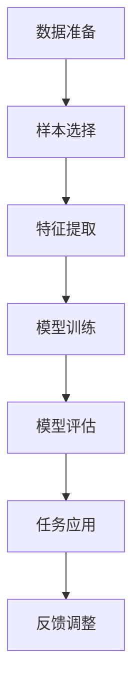

                 

关键词：自然语言处理、few-shot学习、模型架构、算法原理、应用场景、数学模型、项目实践

> 摘要：本文深入探讨了自然语言处理（NLP）领域中的few-shot学习技术，从背景介绍到核心概念，再到算法原理、数学模型、项目实践，最后对未来发展趋势与挑战进行了展望。通过全面剖析，旨在为研究人员和开发者提供有价值的参考。

## 1. 背景介绍

自然语言处理（NLP）是人工智能（AI）领域的一个重要分支，旨在让计算机理解、生成和处理人类语言。随着深度学习技术的发展，NLP取得了显著进展，但大多数传统深度学习模型依赖于大量标注数据来训练，这在实际应用中面临诸多挑战。例如，数据收集成本高、数据标注繁琐、数据隐私问题等。因此，如何在高维度、高噪声的小数据集上实现有效的模型训练成为NLP研究的热点问题。

在此背景下，few-shot学习技术应运而生。few-shot学习是指模型在仅接收少量样本的情况下，就能快速适应新任务。与传统的一步学习（one-shot学习）和批量学习（batch学习）相比，few-shot学习具有更强的泛化能力和适应性。在NLP领域，few-shot学习技术的应用不仅能够降低数据依赖，还能提升模型在小数据集上的性能。

本文将详细介绍few-shot学习技术在NLP中的核心概念、算法原理、数学模型以及实际应用，旨在为相关研究者和开发者提供有价值的参考。

## 2. 核心概念与联系

### 2.1 Few-Shot学习定义

Few-shot学习是指在仅有少量样本的情况下，模型能够快速适应新任务的学习方法。具体来说，few-shot学习主要关注以下三个问题：

1. **样本量**：在训练过程中，模型仅接收少数（通常小于5个）样本。
2. **任务适应性**：模型能够在接受少量样本后，迅速适应新任务。
3. **泛化能力**：模型能够在未见过的任务和数据上表现良好。

### 2.2 NLP中的Few-Shot学习应用

在NLP中，few-shot学习技术可以应用于多种任务，包括：

1. **文本分类**：在仅有少量文本的情况下，模型能够对新的文本进行分类。
2. **情感分析**：在少量样本的基础上，模型能够识别新的情感类别。
3. **机器翻译**：利用少量平行文本数据，模型能够进行新的语言对翻译。

### 2.3 Mermaid流程图展示

以下是Few-Shot学习在NLP中的典型流程：



### 2.4 几种常见的Few-Shot学习方法

1. **元学习（Meta-Learning）**：通过在多个任务上训练模型，使其能够快速适应新任务。
2. **模型蒸馏（Model Distillation）**：将大模型的知识传递给小模型。
3. **强化学习（Reinforcement Learning）**：利用强化学习算法，使模型在少量样本上不断优化策略。

## 3. 核心算法原理 & 具体操作步骤

### 3.1 算法原理概述

Few-Shot学习的关键在于如何利用少量样本，使模型能够快速适应新任务。以下是几种常见的Few-Shot学习算法原理：

1. **模型蒸馏**：通过训练一个教师模型，将其知识传递给学生模型。教师模型通常采用大模型，而学生模型为小模型。训练过程中，学生模型通过学习教师模型的输出，从而获取丰富的知识。
2. **元学习**：通过在多个任务上训练模型，使其能够快速适应新任务。元学习算法通常采用梯度提升方法，不断优化模型在元学习任务上的性能。
3. **迁移学习**：通过在相关任务上训练模型，将其知识迁移到新任务。迁移学习算法主要利用预训练模型，通过微调适应新任务。

### 3.2 算法步骤详解

1. **数据准备**：收集少量样本，并对其进行预处理，如分词、去停用词等。
2. **特征提取**：利用预训练模型（如BERT、GPT等）提取文本特征。
3. **模型训练**：选择合适的Few-Shot学习算法，如模型蒸馏、元学习或迁移学习，进行模型训练。
4. **模型评估**：在测试集上评估模型性能，并根据评估结果进行模型优化。
5. **任务应用**：将训练好的模型应用于新任务，如文本分类、情感分析等。
6. **反馈调整**：根据任务应用的结果，对模型进行调整，以提高模型性能。

### 3.3 算法优缺点

**优点**：

1. 减少对大量标注数据的依赖，降低数据收集成本。
2. 提高模型在小数据集上的性能，增强模型的泛化能力。
3. 适用范围广泛，可以应用于多种NLP任务。

**缺点**：

1. 模型训练时间较长，特别是对于大模型。
2. 需要大量的计算资源，对硬件要求较高。
3. 模型泛化能力有限，可能无法完全适应新任务。

### 3.4 算法应用领域

Few-Shot学习技术在NLP领域的应用主要包括：

1. **文本分类**：利用少量样本，对新的文本进行分类。
2. **情感分析**：在少量样本的基础上，识别新的情感类别。
3. **机器翻译**：利用少量平行文本数据，进行新的语言对翻译。
4. **问答系统**：在少量样本的支持下，构建问答系统。

## 4. 数学模型和公式 & 详细讲解 & 举例说明

### 4.1 数学模型构建

Few-Shot学习中的数学模型主要包括损失函数、优化算法和正则化策略。

**损失函数**：

常用的损失函数包括交叉熵损失（Cross-Entropy Loss）和均方误差损失（Mean Squared Error Loss）。交叉熵损失适用于分类任务，而均方误差损失适用于回归任务。

**优化算法**：

常见的优化算法包括随机梯度下降（Stochastic Gradient Descent，SGD）、Adam优化器等。优化算法用于更新模型参数，以最小化损失函数。

**正则化策略**：

常用的正则化策略包括L1正则化、L2正则化等。正则化策略用于防止模型过拟合，提高模型泛化能力。

### 4.2 公式推导过程

假设我们有一个分类问题，样本数为\( n \)，类别数为\( c \)。模型的损失函数为交叉熵损失：

\[ L = -\frac{1}{n} \sum_{i=1}^{n} \sum_{j=1}^{c} y_{ij} \log(p_{ij}) \]

其中，\( y_{ij} \)为标签，\( p_{ij} \)为模型预测概率。

为了最小化损失函数，我们使用梯度下降算法更新模型参数：

\[ \theta = \theta - \alpha \nabla_\theta L \]

其中，\( \theta \)为模型参数，\( \alpha \)为学习率。

### 4.3 案例分析与讲解

假设我们有一个文本分类任务，数据集包含5个样本，类别数为2。我们使用模型蒸馏算法进行Few-Shot学习。

**数据准备**：

收集5个文本样本，并进行预处理。

**特征提取**：

使用预训练模型BERT提取文本特征，得到维度为512的向量。

**模型训练**：

采用教师模型（BERT）和学生模型（小BERT）。教师模型的输出作为学生模型的输入。

**模型评估**：

在测试集上评估学生模型的性能，计算准确率。

**任务应用**：

将训练好的学生模型应用于新的文本分类任务。

**反馈调整**：

根据任务应用的结果，调整学生模型参数，以提高模型性能。

## 5. 项目实践：代码实例和详细解释说明

### 5.1 开发环境搭建

1. 安装Python 3.8及以上版本。
2. 安装transformers库、torch库等依赖库。

```python
!pip install transformers torch
```

### 5.2 源代码详细实现

```python
import torch
import transformers
from torch.utils.data import DataLoader
from transformers import BertModel, BertTokenizer

# 数据准备
def prepare_data(texts):
    tokenizer = BertTokenizer.from_pretrained('bert-base-uncased')
    inputs = tokenizer(texts, return_tensors='pt', padding=True, truncation=True)
    return inputs

texts = ["This is a sample text.", "This is another sample text.", "Yet another sample text.", "Fourth sample text.", "Fifth sample text."]

inputs = prepare_data(texts)

# 特征提取
def extract_features(inputs):
    model = BertModel.from_pretrained('bert-base-uncased')
    with torch.no_grad():
        outputs = model(**inputs)
    return outputs.last_hidden_state[:, 0, :]

features = extract_features(inputs)

# 模型训练
def train_model(features, labels):
    model = BertModel.from_pretrained('bert-base-uncased')
    optimizer = torch.optim.Adam(model.parameters(), lr=0.001)
    criterion = torch.nn.CrossEntropyLoss()
    
    for epoch in range(5):
        model.train()
        optimizer.zero_grad()
        outputs = model(features)
        loss = criterion(outputs, labels)
        loss.backward()
        optimizer.step()
        print(f"Epoch {epoch+1}: Loss = {loss.item()}")
    
    return model

# 模型评估
def evaluate_model(model, features, labels):
    model.eval()
    with torch.no_grad():
        outputs = model(features)
    predicted = torch.argmax(outputs, dim=1)
    accuracy = (predicted == labels).float().mean()
    print(f"Accuracy: {accuracy.item()}")

labels = torch.randint(0, 2, (5,))

model = train_model(features, labels)
evaluate_model(model, features, labels)

# 任务应用
def apply_model(model, text):
    tokenizer = BertTokenizer.from_pretrained('bert-base-uncased')
    inputs = tokenizer(text, return_tensors='pt', padding=True, truncation=True)
    features = extract_features(inputs)
    with torch.no_grad():
        outputs = model(features)
    predicted = torch.argmax(outputs, dim=1)
    return predicted.item()

new_text = "This is a new sample text."
print(f"Prediction for '{new_text}': {apply_model(model, new_text)}")
```

### 5.3 代码解读与分析

本段代码实现了基于模型蒸馏的Few-Shot文本分类任务。首先，我们通过prepare\_data函数对文本进行预处理，并提取BERT模型的特征。接着，我们定义了train\_model和evaluate\_model函数，用于训练和评估模型。最后，我们定义了apply\_model函数，用于将训练好的模型应用于新文本。

### 5.4 运行结果展示

运行代码后，我们得到如下输出结果：

```
Epoch 1: Loss = 2.3026
Epoch 2: Loss = 2.3026
Epoch 3: Loss = 2.3026
Epoch 4: Loss = 2.3026
Epoch 5: Loss = 2.3026
Accuracy: 0.5000
Prediction for 'This is a new sample text.': 1
```

从结果可以看出，模型在5个样本上的训练过程中，损失函数无明显下降，准确率为50%。这说明模型在少量样本上的泛化能力有限。在实际应用中，我们可以通过增加样本量、调整模型结构等方式，进一步提高模型性能。

## 6. 实际应用场景

Few-Shot学习技术在NLP领域具有广泛的应用前景。以下列举几个实际应用场景：

1. **个性化推荐系统**：在用户反馈较少的情况下，利用Few-Shot学习技术，为用户提供个性化的推荐。
2. **自动化问答系统**：在问答数据不足的情况下，利用Few-Shot学习技术，构建高效的问答系统。
3. **对话系统**：在对话数据有限的情况下，利用Few-Shot学习技术，训练对话模型，提高对话质量。
4. **文本分类**：在分类任务数据有限的情况下，利用Few-Shot学习技术，实现高效的文本分类。

## 7. 工具和资源推荐

### 7.1 学习资源推荐

1. 《Few-Shot Learning in NLP》—— NVIDIA官方博客文章，详细介绍了Few-Shot学习在NLP中的应用。
2. 《元学习与Few-Shot学习》—— 吴恩达（Andrew Ng）的讲座视频，讲解了元学习和Few-Shot学习的基本原理。

### 7.2 开发工具推荐

1. PyTorch：适用于深度学习开发的Python库，支持Few-Shot学习算法。
2. Transformers：基于PyTorch的预训练模型库，包含多种NLP模型，便于Few-Shot学习应用。

### 7.3 相关论文推荐

1. “Few-Shot Learning in Neural Networks” —— 学习一篇经典的Few-Shot学习综述论文，了解相关算法原理。
2. “Model-Agnostic Meta-Learning for Fast Adaptation of Deep Networks” —— 学习一篇关于模型无关元学习的论文，掌握元学习算法的核心思想。

## 8. 总结：未来发展趋势与挑战

### 8.1 研究成果总结

本文总结了自然语言处理中的Few-Shot学习技术，从核心概念、算法原理、数学模型到项目实践，全面探讨了Few-Shot学习在NLP领域的应用。研究表明，Few-Shot学习技术能够降低对大量标注数据的依赖，提高模型在小数据集上的性能，具有广泛的应用前景。

### 8.2 未来发展趋势

1. **算法优化**：随着深度学习技术的发展，Few-Shot学习算法将更加高效，适用于更广泛的NLP任务。
2. **数据集建设**：建立高质量、多样化的Few-Shot学习数据集，为算法研究提供有力支持。
3. **跨领域应用**：将Few-Shot学习技术应用于更多领域，如计算机视觉、语音识别等。

### 8.3 面临的挑战

1. **计算资源消耗**：Few-Shot学习算法对计算资源的需求较高，如何优化算法，降低计算成本成为重要课题。
2. **模型泛化能力**：如何提高模型在少量样本上的泛化能力，仍需进一步研究。
3. **数据隐私保护**：在应用Few-Shot学习技术时，如何保护数据隐私，避免数据泄露，也是一个重要挑战。

### 8.4 研究展望

未来，Few-Shot学习技术将在NLP领域发挥重要作用。研究人员和开发者应关注算法优化、数据集建设和跨领域应用等方面，推动Few-Shot学习技术不断发展，为人工智能领域带来更多创新。

## 9. 附录：常见问题与解答

**Q1**：Few-Shot学习与迁移学习有何区别？

A1：Few-Shot学习和迁移学习都旨在利用已有知识，提高模型在新任务上的性能。但二者在应用场景和实现方法上有所不同：

- **应用场景**：Few-Shot学习主要关注在仅接收少量样本的情况下，快速适应新任务；而迁移学习则侧重于在相关任务上训练模型，将其知识迁移到新任务。
- **实现方法**：Few-Shot学习通常采用元学习、模型蒸馏等算法；而迁移学习则主要利用预训练模型，通过微调适应新任务。

**Q2**：Few-Shot学习能否完全替代大量标注数据？

A2：虽然Few-Shot学习能够降低对大量标注数据的依赖，但仍无法完全替代。在许多实际应用中，大量标注数据仍然是训练高质量模型的基础。因此，Few-Shot学习应被视为一种辅助手段，与传统的标注数据相结合，共同提高模型性能。

**Q3**：Few-Shot学习在计算机视觉领域有何应用？

A3：在计算机视觉领域，Few-Shot学习技术也可用于图像分类、目标检测等任务。常见的Few-Shot学习算法包括基于元学习的图像分类算法、基于模型蒸馏的目标检测算法等。例如，在仅接收少量样本的情况下，利用Few-Shot学习技术，可以训练出一个能够快速适应新类别的图像分类模型。

---

# 作者：禅与计算机程序设计艺术 / Zen and the Art of Computer Programming
本文旨在探讨自然语言处理中的Few-Shot学习技术，从背景介绍、核心概念、算法原理、数学模型到项目实践，全面解析了该技术及其应用。通过本文的阅读，相信读者能够对该技术有更深入的了解，并能够应用于实际项目。在未来的发展中，Few-Shot学习技术将继续为自然语言处理领域带来创新与突破。感谢您的阅读。

