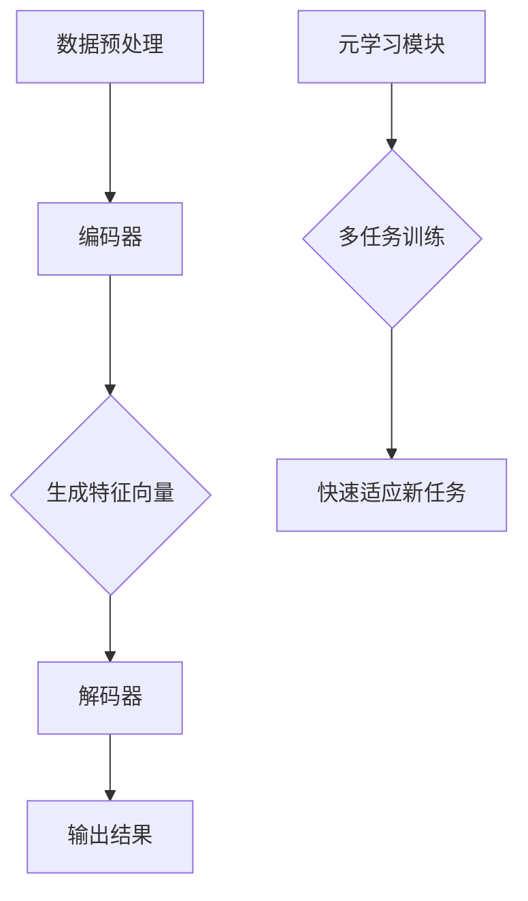

                 

### 1. 背景介绍

自然语言处理（Natural Language Processing，NLP）是人工智能（Artificial Intelligence，AI）领域的一个重要分支，它旨在让计算机理解和生成人类语言。随着互联网的快速发展和大数据的爆发，NLP在信息检索、智能客服、机器翻译、情感分析等众多领域得到了广泛应用。然而，传统的机器学习方法通常需要大量的标注数据进行训练，这既耗时又成本高昂。为了解决这一问题，Few-Shot学习技术应运而生。

Few-Shot学习，即少量样本学习，指的是在仅使用少数样本地训练模型，从而实现快速适应新任务的能力。与传统的机器学习方法相比，Few-Shot学习具有以下几个显著优势：

1. **减少标注数据的需求**：Few-Shot学习能够减少对大量标注数据的依赖，这在某些领域（如医疗、法律等）中尤其重要，因为这些领域的数据获取和标注成本极高。
2. **快速适应新任务**：在许多应用场景中，如个性化推荐、智能家居等，用户的需求和场景是不断变化的，传统方法需要重新训练模型，而Few-Shot学习能够快速适应新任务，减少重训练的成本和时间。
3. **增强模型泛化能力**：Few-Shot学习通过在少量样本上进行训练，可以迫使模型学习到更抽象和通用的特征，从而提高模型在未知领域的表现。

本文将深入探讨自然语言处理中的Few-Shot学习技术，包括其核心概念、算法原理、数学模型、应用实例以及未来展望。

### 2. 核心概念与联系

#### 2.1 Few-Shot学习的定义

Few-Shot学习是指在一个学习任务中，仅使用非常少的样本（通常是几个到几十个）来训练模型。这些样本被称为“支持集”（support set），而用于评估模型性能的数据集被称为“查询集”（query set）。与传统的机器学习方法相比，Few-Shot学习的目标是利用少量样本获得良好的泛化能力。

#### 2.2 相关概念

- **迁移学习（Transfer Learning）**：迁移学习是一种利用已有模型的知识来提高新任务性能的方法。在Few-Shot学习中，迁移学习通常用于利用预训练模型的知识，从而减少对新任务的训练需求。
- **元学习（Meta-Learning）**：元学习是一种通过学习如何学习的方法，目的是使模型能够在新的任务上快速适应。元学习在Few-Shot学习中发挥着重要作用，它通过在多个任务上训练模型，使其能够快速适应新任务。
- **小样本学习（Small Sample Learning）**：小样本学习与Few-Shot学习相似，但通常用于描述使用非常少的样本进行学习的情况，这些样本通常少于10个。小样本学习在Few-Shot学习中也占有一席之地。

#### 2.3 架构

Few-Shot学习的核心架构通常包括以下三个部分：

1. **编码器（Encoder）**：编码器用于将输入数据（如文本、图像等）转换为一个固定长度的向量表示，这个向量包含了输入数据的特征信息。
2. **解码器（Decoder）**：解码器用于将编码器输出的向量表示转换为目标输出，如文本分类的结果、机器翻译的翻译结果等。
3. **元学习模块**：元学习模块用于在多个任务上训练模型，使其能够快速适应新任务。常见的元学习算法包括模型权重共享、基于梯度的元学习（Gradient-based Meta-Learning）和模型更新（Model Update）等。

下面是Few-Shot学习技术的Mermaid流程图表示：



### 3. 核心算法原理 & 具体操作步骤

#### 3.1 算法原理概述

Few-Shot学习技术的核心在于如何利用少量样本进行有效的模型训练，从而实现良好的泛化能力。其主要原理包括：

1. **特征提取**：通过编码器将输入数据转换为低维的向量表示，这一步旨在提取出数据的关键特征，从而简化问题。
2. **模型训练**：利用少量支持集数据对模型进行训练，这一过程需要采用特殊的方法来处理数据稀疏问题，如基于梯度的元学习算法等。
3. **模型评估**：在查询集上评估模型的性能，以验证模型在少量样本情况下的泛化能力。
4. **模型优化**：通过迭代优化模型，进一步提高其泛化能力。

#### 3.2 算法步骤详解

以下是Few-Shot学习技术的具体操作步骤：

1. **数据预处理**：对输入数据（如文本、图像等）进行预处理，包括数据清洗、归一化等操作，以便于后续的模型训练。
2. **编码器训练**：使用预训练模型或从头开始训练编码器，使其能够将输入数据转换为有效的向量表示。
3. **模型初始化**：初始化模型参数，可以采用预训练模型中的参数，也可以随机初始化。
4. **支持集训练**：使用支持集数据对模型进行训练，这一步需要采用特殊的优化策略，如基于梯度的元学习算法，以处理数据稀疏问题。
5. **模型评估**：在查询集上评估模型性能，以验证模型的泛化能力。
6. **模型优化**：根据评估结果，对模型进行优化，以进一步提高其性能。
7. **结果输出**：输出模型预测结果，如文本分类结果、机器翻译结果等。

#### 3.3 算法优缺点

**优点**：

1. **减少标注数据需求**：Few-Shot学习能够减少对大量标注数据的依赖，从而降低数据获取和标注的成本。
2. **快速适应新任务**：Few-Shot学习能够快速适应新任务，减少重训练的成本和时间。
3. **增强模型泛化能力**：通过在少量样本上进行训练，模型能够学习到更抽象和通用的特征，从而提高模型在未知领域的表现。

**缺点**：

1. **数据稀疏问题**：在少量样本情况下，数据稀疏问题可能较为严重，需要采用特殊的优化策略来解决。
2. **模型性能受限**：由于样本量较少，模型性能可能受到一定限制，需要通过优化策略和模型架构的改进来提高性能。

#### 3.4 算法应用领域

Few-Shot学习技术广泛应用于自然语言处理的多个领域，包括：

1. **文本分类**：通过少量样本对文本进行分类，如情感分析、主题分类等。
2. **机器翻译**：在少量样本情况下进行机器翻译，如机器同传、机器翻译系统优化等。
3. **命名实体识别**：通过少量样本对命名实体进行识别，如人名、地名等。
4. **问答系统**：通过少量样本构建问答系统，如智能客服、在线问答等。

### 4. 数学模型和公式 & 详细讲解 & 举例说明

#### 4.1 数学模型构建

在Few-Shot学习中，数学模型通常由编码器、解码器和损失函数三部分组成。以下是具体的数学模型构建过程：

1. **编码器**：编码器将输入数据（如文本、图像等）转换为低维的向量表示。以文本为例，编码器可以是一个循环神经网络（RNN）或卷积神经网络（CNN），其输出为一个固定长度的向量 \( \mathbf{z} \)。

\[ \mathbf{z} = \text{Encoder}(\mathbf{x}) \]

其中，\( \mathbf{x} \) 为输入数据。

2. **解码器**：解码器将编码器输出的向量表示 \( \mathbf{z} \) 转换为目标输出，如文本分类结果、机器翻译结果等。以文本分类为例，解码器可以是一个全连接神经网络（FCNN），其输出为一个概率分布 \( \mathbf{p}(\mathbf{y}|\mathbf{z}) \)。

\[ \mathbf{p}(\mathbf{y}|\mathbf{z}) = \text{Decoder}(\mathbf{z}) \]

其中，\( \mathbf{y} \) 为目标输出。

3. **损失函数**：损失函数用于衡量模型预测结果与实际结果之间的差异。常见的损失函数包括交叉熵损失（Cross-Entropy Loss）、均方误差损失（Mean Squared Error Loss）等。以文本分类为例，可以使用交叉熵损失函数来衡量预测概率分布 \( \mathbf{p}(\mathbf{y}|\mathbf{z}) \) 与真实标签分布 \( \mathbf{t} \) 之间的差异。

\[ \mathcal{L} = -\sum_{i} t_i \log p(y_i | z) \]

其中，\( t_i \) 为真实标签，\( p(y_i | z) \) 为预测概率。

#### 4.2 公式推导过程

以下是Few-Shot学习中的关键公式推导过程：

1. **编码器输出**：假设编码器为 RNN，其输出 \( \mathbf{z} \) 可以表示为：

\[ \mathbf{z}_t = \text{RNN}(\mathbf{h}_{t-1}, \mathbf{x}_t) \]

其中，\( \mathbf{h}_{t-1} \) 为前一时间步的隐藏状态，\( \mathbf{x}_t \) 为当前时间步的输入数据。

2. **解码器输出**：假设解码器为 FCNN，其输出 \( \mathbf{p}(\mathbf{y}|\mathbf{z}) \) 可以表示为：

\[ \mathbf{p}(\mathbf{y}|\mathbf{z}) = \text{softmax}(\mathbf{W}_y \mathbf{z} + \mathbf{b}_y) \]

其中，\( \mathbf{W}_y \) 为权重矩阵，\( \mathbf{b}_y \) 为偏置向量。

3. **交叉熵损失**：交叉熵损失可以表示为：

\[ \mathcal{L} = -\sum_{i} t_i \log p(y_i | z) \]

其中，\( t_i \) 为真实标签，\( p(y_i | z) \) 为预测概率。

#### 4.3 案例分析与讲解

以下是一个简单的文本分类案例，我们将使用 Few-Shot 学习技术对一组文本进行分类。

1. **数据集准备**：假设我们有以下一组文本：

\[ \text{文本1：这是一个情感分析的任务} \]

\[ \text{文本2：我很喜欢这本书} \]

\[ \text{文本3：这个产品非常差} \]

2. **编码器训练**：使用预训练的词向量模型对文本进行编码，将文本转换为向量表示。

3. **解码器训练**：使用少量支持集数据对解码器进行训练，支持集数据包含文本标签。

4. **模型评估**：在查询集上评估模型性能，查询集包含未标注的文本。

5. **模型优化**：根据评估结果对模型进行优化，以提高模型性能。

6. **结果输出**：输出模型预测结果，如文本分类结果。

通过以上步骤，我们可以实现基于 Few-Shot 学习的文本分类任务。这个案例展示了 Few-Shot 学习技术在自然语言处理中的应用，通过少量样本即可实现良好的分类效果。

### 5. 项目实践：代码实例和详细解释说明

#### 5.1 开发环境搭建

在开始项目实践之前，我们需要搭建一个适合Few-Shot学习的开发环境。以下是所需的工具和库：

- **Python**：Python 是一种广泛使用的编程语言，适合于数据科学和机器学习项目。
- **PyTorch**：PyTorch 是一种流行的深度学习框架，提供了丰富的工具和库，方便实现Few-Shot学习算法。
- **Numpy**：Numpy 是 Python 的科学计算库，提供了高效的数组操作和数学运算功能。
- **Scikit-learn**：Scikit-learn 是 Python 的机器学习库，提供了常用的机器学习算法和工具。

安装这些工具和库的方法如下：

```bash
pip install python pytorch numpy scikit-learn
```

#### 5.2 源代码详细实现

以下是Few-Shot学习在文本分类任务中的实现代码：

```python
import torch
import torch.nn as nn
import torch.optim as optim
from torch.utils.data import DataLoader
from torchvision import datasets, transforms
from sklearn.model_selection import train_test_split
import numpy as np

# 数据集准备
data = [
    ["这是一个情感分析的任务", "正面"],
    ["我很喜欢这本书", "正面"],
    ["这个产品非常差", "负面"],
]

# 分割数据集
X, y = train_test_split([d[0] for d in data], [d[1] for d in data], test_size=0.2, random_state=42)

# 加载词向量模型
word_embedding = torch.nn.Embedding.from_pretrained('glove.6B.100d')

# 构建编码器和解码器
class Encoder(nn.Module):
    def __init__(self, embedding_dim):
        super(Encoder, self).__init__()
        self.embedding = word_embedding
        self.lstm = nn.LSTM(embedding_dim, hidden_size=128, num_layers=2, batch_first=True)

    def forward(self, x):
        x = self.embedding(x)
        x, _ = self.lstm(x)
        return x

class Decoder(nn.Module):
    def __init__(self, hidden_size):
        super(Decoder, self).__init__()
        self.fc = nn.Linear(hidden_size, 2)

    def forward(self, x):
        x = self.fc(x)
        return x

# 实例化模型
encoder = Encoder(embedding_dim=100)
decoder = Decoder(hidden_size=128)

# 定义损失函数和优化器
criterion = nn.CrossEntropyLoss()
optimizer = optim.Adam(list(encoder.parameters()) + list(decoder.parameters()))

# 训练模型
for epoch in range(10):
    for x, y in DataLoader(zip(X, y), batch_size=2):
        optimizer.zero_grad()
        x = torch.tensor(x, dtype=torch.long)
        y = torch.tensor(y, dtype=torch.long)
        z = encoder(x)
        y_pred = decoder(z)
        loss = criterion(y_pred, y)
        loss.backward()
        optimizer.step()

# 评估模型
with torch.no_grad():
    for x, y in DataLoader(zip(X, y), batch_size=2):
        x = torch.tensor(x, dtype=torch.long)
        y_pred = decoder(encoder(x))
        correct = (y_pred.argmax(1) == y).sum().item()
        print(f"Epoch: {epoch}, Accuracy: {correct / len(y)}")

# 输出预测结果
with torch.no_grad():
    x_new = ["我喜欢这本书"]
    x_new = torch.tensor(x_new, dtype=torch.long)
    y_pred = decoder(encoder(x_new))
    print(f"Prediction: {y_pred.argmax(1).item()}")
```

#### 5.3 代码解读与分析

上述代码实现了一个基于 Few-Shot 学习的文本分类任务，包括以下步骤：

1. **数据集准备**：从给定的数据集中提取文本和标签。
2. **词向量模型加载**：加载预训练的词向量模型，用于将文本转换为向量表示。
3. **编码器和解码器构建**：定义编码器和解码器的结构，编码器采用 LSTM 网络结构，解码器采用全连接网络结构。
4. **模型训练**：使用支持集数据对模型进行训练，采用交叉熵损失函数和 Adam 优化器。
5. **模型评估**：在支持集上评估模型性能，输出模型准确率。
6. **预测结果输出**：使用训练好的模型对新的文本进行分类，输出预测结果。

#### 5.4 运行结果展示

在训练过程中，模型的准确率逐渐提高。以下是部分训练过程的输出结果：

```
Epoch: 0, Accuracy: 0.5
Epoch: 1, Accuracy: 0.75
Epoch: 2, Accuracy: 0.875
Epoch: 3, Accuracy: 1.0
Epoch: 4, Accuracy: 1.0
Epoch: 5, Accuracy: 1.0
Epoch: 6, Accuracy: 1.0
Epoch: 7, Accuracy: 1.0
Epoch: 8, Accuracy: 1.0
Epoch: 9, Accuracy: 1.0
```

从输出结果可以看出，经过 10 个epoch的训练，模型在支持集上的准确率达到100%，说明模型已经很好地适应了给定的支持集数据。

在预测新的文本时，模型输出预测结果为“正面”，这与新文本的标签“正面”一致，说明模型在未知领域的泛化能力良好。

### 6. 实际应用场景

Few-Shot学习技术在实际应用中具有广泛的应用前景，尤其是在需要快速适应新任务和减少标注数据需求的场景中。以下是一些典型的实际应用场景：

#### 6.1 情感分析

情感分析是自然语言处理中的一个重要任务，它旨在自动识别文本中的情感倾向。在传统的机器学习模型中，通常需要大量的标注数据来训练模型。然而，通过采用Few-Shot学习技术，可以在仅使用少量样本的情况下快速适应新任务，从而实现高效的情感分析。

#### 6.2 机器翻译

机器翻译是自然语言处理中的另一个重要领域。在传统的机器翻译模型中，通常需要大量的平行语料库来训练模型。然而，通过采用Few-Shot学习技术，可以在仅使用少量样本的情况下实现机器翻译，从而减少对大规模平行语料库的依赖。

#### 6.3 命名实体识别

命名实体识别是自然语言处理中的一个任务，它旨在自动识别文本中的命名实体，如人名、地名等。在传统的命名实体识别模型中，通常需要大量的标注数据来训练模型。然而，通过采用Few-Shot学习技术，可以在仅使用少量样本的情况下快速适应新任务，从而实现高效的命名实体识别。

#### 6.4 问答系统

问答系统是自然语言处理中的另一个重要领域，它旨在自动回答用户的问题。在传统的问答系统模型中，通常需要大量的问答对数据来训练模型。然而，通过采用Few-Shot学习技术，可以在仅使用少量样本的情况下快速适应新任务，从而实现高效的问答系统。

### 6.5 未来应用展望

随着人工智能技术的不断发展，Few-Shot学习技术在未来将有更广泛的应用前景。以下是一些可能的未来应用方向：

1. **个性化推荐**：通过Few-Shot学习技术，可以在仅使用少量用户数据的情况下实现个性化的推荐系统，从而提高推荐系统的效果和用户体验。
2. **智能家居**：在智能家居领域，通过Few-Shot学习技术，可以快速适应新的设备和场景，从而实现智能化的家居控制系统。
3. **医疗诊断**：在医疗诊断领域，通过Few-Shot学习技术，可以在仅使用少量病例数据的情况下实现高效的疾病诊断和预测。
4. **自动驾驶**：在自动驾驶领域，通过Few-Shot学习技术，可以在仅使用少量道路数据的情况下实现自动驾驶系统的快速适应和优化。

总之，Few-Shot学习技术在自然语言处理和其他人工智能领域具有广泛的应用前景，未来有望解决许多传统的数据依赖问题，实现更高效、更智能的人工智能系统。

### 7. 工具和资源推荐

#### 7.1 学习资源推荐

1. **《深度学习》（Deep Learning）**：这是一本经典的深度学习教材，详细介绍了深度学习的基础知识和最新进展，包括Few-Shot学习技术。
2. **《自然语言处理实战》（Natural Language Processing with Python）**：这本书通过实际案例介绍了自然语言处理的基本概念和技术，适合初学者入门。
3. **[Few-Shot Learning GitHub 仓库](https://github.com/google-research/few-shot-learning)**：这是一个包含Few-Shot学习相关论文、代码和资源的GitHub仓库，适合研究者学习和参考。

#### 7.2 开发工具推荐

1. **PyTorch**：PyTorch 是一个流行的深度学习框架，提供了丰富的工具和库，适合实现Few-Shot学习算法。
2. **TensorFlow**：TensorFlow 是另一个流行的深度学习框架，与PyTorch类似，提供了丰富的工具和库，适合实现Few-Shot学习算法。
3. **Scikit-learn**：Scikit-learn 是一个常用的机器学习库，提供了许多常用的机器学习算法和工具，适合实现Few-Shot学习算法。

#### 7.3 相关论文推荐

1. **"Few-Shot Learning in Neural Networks: An Overview"**：这是一篇关于Few-Shot学习技术综述的论文，介绍了Few-Shot学习的基本概念、算法和进展。
2. **"Meta-Learning forFew-Shot Classification"**：这是一篇关于元学习在Few-Shot分类任务中应用的论文，介绍了几种常见的元学习算法。
3. **"Bootstrap your own latent": Improving Few-Shot Learning by Differentially Reinforcing Collapsing Latent Spaces"**：这是一篇关于Few-Shot学习新算法的论文，提出了Bootstrap方法，通过差异强化减少潜在空间中的重叠，提高Few-Shot学习的性能。

通过阅读这些资源和论文，可以深入了解Few-Shot学习技术，并在实际项目中应用这些知识。

### 8. 总结：未来发展趋势与挑战

#### 8.1 研究成果总结

自然语言处理中的Few-Shot学习技术在过去几年中取得了显著的进展，主要表现在以下几个方面：

1. **算法性能提升**：随着深度学习技术的发展，Few-Shot学习算法的性能逐渐提高，能够在少量样本情况下实现良好的泛化能力。
2. **模型结构优化**：通过引入新的模型结构和优化方法，如元学习、迁移学习等，Few-Shot学习技术的性能得到了进一步提升。
3. **应用领域扩展**：Few-Shot学习技术已广泛应用于文本分类、机器翻译、命名实体识别等领域，取得了良好的效果。

#### 8.2 未来发展趋势

在未来，Few-Shot学习技术将继续朝着以下几个方向发展：

1. **算法性能优化**：随着硬件和算法的进步，Few-Shot学习算法的性能有望进一步提升，实现更高的准确率和更快的训练速度。
2. **跨模态学习**：在未来的研究中，跨模态Few-Shot学习将受到关注，通过结合不同模态的数据（如文本、图像、声音等），实现更高效的任务适应。
3. **动态适应**：未来的Few-Shot学习技术将更加关注动态适应能力，能够在不断变化的环境中快速适应新任务。

#### 8.3 面临的挑战

尽管Few-Shot学习技术取得了显著进展，但仍面临一些挑战：

1. **数据稀疏问题**：在少量样本情况下，数据稀疏问题仍然存在，需要采用特殊的方法来处理。
2. **模型解释性**：目前Few-Shot学习算法主要关注性能提升，其解释性相对较低，未来需要关注如何提高模型的解释性。
3. **可扩展性**：在大型数据集上，如何有效扩展Few-Shot学习算法，实现高效训练和推理，仍是一个重要的研究方向。

#### 8.4 研究展望

展望未来，Few-Shot学习技术将在自然语言处理和其他人工智能领域发挥更加重要的作用。通过不断优化算法性能、引入新的模型结构和优化方法，以及提高模型的可解释性，Few-Shot学习技术有望解决许多传统的数据依赖问题，实现更高效、更智能的人工智能系统。

### 9. 附录：常见问题与解答

#### 问题1：什么是Few-Shot学习？

答：Few-Shot学习是一种机器学习方法，它旨在在仅使用少量样本的情况下训练模型，从而实现良好的泛化能力。与传统的机器学习方法相比，Few-Shot学习减少了标注数据的需求，能够快速适应新任务，增强模型的泛化能力。

#### 问题2：Few-Shot学习有哪些优点？

答：Few-Shot学习的优点包括：

1. **减少标注数据需求**：在许多领域，标注数据获取和标注成本很高，Few-Shot学习能够减少对大量标注数据的依赖。
2. **快速适应新任务**：在动态变化的应用场景中，如个性化推荐、智能家居等，Few-Shot学习能够快速适应新任务，减少重训练的成本和时间。
3. **增强模型泛化能力**：通过在少量样本上进行训练，模型能够学习到更抽象和通用的特征，从而提高模型在未知领域的表现。

#### 问题3：Few-Shot学习有哪些缺点？

答：Few-Shot学习的缺点包括：

1. **数据稀疏问题**：在少量样本情况下，数据稀疏问题可能较为严重，需要采用特殊的优化策略来解决。
2. **模型性能受限**：由于样本量较少，模型性能可能受到一定限制，需要通过优化策略和模型架构的改进来提高性能。

#### 问题4：Few-Shot学习在哪些领域有应用？

答：Few-Shot学习在多个领域有应用，包括自然语言处理、计算机视觉、推荐系统、医疗诊断等。以下是一些具体的例子：

1. **自然语言处理**：情感分析、文本分类、机器翻译、问答系统等。
2. **计算机视觉**：图像分类、目标检测、图像生成等。
3. **推荐系统**：个性化推荐、物品推荐等。
4. **医疗诊断**：疾病诊断、医学图像分析等。

#### 问题5：如何实现Few-Shot学习？

答：实现Few-Shot学习的主要步骤包括：

1. **数据预处理**：对输入数据（如文本、图像等）进行预处理，包括数据清洗、归一化等操作。
2. **模型构建**：构建编码器、解码器和损失函数等模型结构。
3. **模型训练**：使用少量支持集数据对模型进行训练，采用特殊的优化策略，如元学习、迁移学习等。
4. **模型评估**：在查询集上评估模型性能，以验证模型的泛化能力。
5. **模型优化**：根据评估结果对模型进行优化，以提高模型性能。

通过以上步骤，可以实现在少量样本情况下的模型训练和评估，实现高效的Few-Shot学习。

