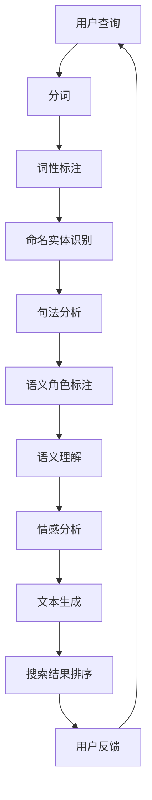

                 

关键词：自然语言处理、搜索算法、信息检索、语义理解、人工智能

> 摘要：本文旨在探讨自然语言处理（NLP）在搜索领域中的突破，分析NLP技术的核心概念与联系，介绍核心算法原理与具体操作步骤，解析数学模型和公式，并通过实际项目实践展示其应用效果。本文还将探讨NLP在搜索领域的实际应用场景，并展望其未来发展趋势与挑战。

## 1. 背景介绍

随着互联网的迅猛发展，信息检索成为人们日常使用互联网的核心需求之一。搜索引擎作为信息检索的关键工具，其性能和准确性直接影响到用户的使用体验。传统基于关键词匹配的搜索算法，尽管在处理海量信息方面表现出色，但在处理语义理解和用户意图识别方面存在诸多不足。

自然语言处理（NLP）作为人工智能的重要分支，致力于让计算机理解、生成和处理人类语言。近年来，随着深度学习技术的快速发展，NLP技术在语义理解、情感分析、文本生成等方面取得了显著的突破。这些技术为搜索算法的优化提供了新的思路和工具。

本文将重点探讨NLP在搜索领域的应用，分析NLP技术的核心概念与联系，介绍核心算法原理与具体操作步骤，解析数学模型和公式，并通过实际项目实践展示其应用效果。此外，本文还将探讨NLP在搜索领域的实际应用场景，并展望其未来发展趋势与挑战。

## 2. 核心概念与联系

### 2.1  语义理解

语义理解是NLP技术的核心目标之一，旨在让计算机理解文本的深层含义。语义理解包括词义消歧、句法分析、语义角色标注等任务。在搜索领域，语义理解能够帮助搜索引擎更准确地理解用户查询意图，从而提高搜索结果的准确性和相关性。

### 2.2  情感分析

情感分析是NLP技术的另一个重要应用领域，旨在分析文本中表达的情感倾向。情感分析在搜索领域有广泛的应用，例如，可以根据用户评价的情感倾向调整搜索结果的相关性排序，提高用户体验。

### 2.3  文本生成

文本生成技术可以通过学习大量文本数据生成新的文本，这在搜索领域有重要的应用，例如，自动生成搜索结果摘要、推荐文案等。

### 2.4  语义角色标注

语义角色标注是语义理解的一个子任务，旨在识别文本中的实体及其在句子中的作用。在搜索领域，语义角色标注有助于更准确地理解用户查询，从而提高搜索结果的准确性。

### 2.5  Mermaid 流程图

以下是一个描述NLP技术在搜索领域应用的Mermaid流程图：



## 3. 核心算法原理 & 具体操作步骤

### 3.1  算法原理概述

NLP技术在搜索领域的应用主要涉及以下算法：

1. 词嵌入：将文本中的词汇映射到高维向量空间，以便进行数学计算和相似性比较。
2. 语义角色标注：识别文本中的实体及其在句子中的作用，有助于理解用户查询意图。
3. 语义理解：通过深度学习模型对文本进行语义分析，理解文本的深层含义。
4. 情感分析：分析文本中表达的情感倾向，用于调整搜索结果的相关性排序。

### 3.2  算法步骤详解

以下是NLP技术在搜索领域应用的具体步骤：

1. 用户输入查询：用户在搜索引擎中输入查询语句。
2. 分词：将查询语句分割成单个词汇，便于后续处理。
3. 词性标注：对每个词汇进行词性标注，如名词、动词、形容词等。
4. 命名实体识别：识别文本中的实体，如人名、地名、组织机构等。
5. 句法分析：分析句子的结构，如主语、谓语、宾语等。
6. 语义角色标注：识别实体在句子中的作用，如执行者、受事者等。
7. 语义理解：通过深度学习模型对文本进行语义分析，理解文本的深层含义。
8. 情感分析：分析文本中表达的情感倾向，用于调整搜索结果的相关性排序。
9. 搜索结果排序：根据语义理解、情感分析等结果，对搜索结果进行排序。
10. 展示搜索结果：将排序后的搜索结果展示给用户。

### 3.3  算法优缺点

NLP技术在搜索领域的应用具有以下优缺点：

**优点：**
1. 提高搜索结果的相关性：通过语义理解、情感分析等技术，能够更准确地理解用户查询意图，提高搜索结果的相关性。
2. 增强用户体验：通过文本生成、推荐文案等技术，可以提供更丰富、更个性化的搜索结果，增强用户体验。
3. 拓展搜索应用场景：NLP技术可以应用于广告推荐、智能客服、问答系统等更多领域。

**缺点：**
1. 对计算资源要求较高：NLP技术涉及大量计算，对计算资源和时间有较高要求。
2. 难以处理复杂语义：虽然NLP技术在语义理解方面取得了一定的突破，但仍然难以处理一些复杂的语义关系。
3. 数据质量和标注问题：NLP技术依赖于大量高质量的文本数据，数据质量和标注的准确性对算法性能有重要影响。

### 3.4  算法应用领域

NLP技术在搜索领域的应用广泛，包括但不限于以下几个方面：

1. 搜索引擎优化：通过语义理解、情感分析等技术，提高搜索结果的相关性和准确性，优化搜索引擎性能。
2. 广告推荐：通过分析用户查询和搜索历史，为用户提供更相关、更个性化的广告推荐。
3. 智能客服：通过语义理解、文本生成等技术，实现智能客服系统与用户之间的自然语言交互。
4. 问答系统：通过语义理解、文本生成等技术，构建智能问答系统，为用户提供快速、准确的答案。

## 4. 数学模型和公式

### 4.1  数学模型构建

在NLP技术中，常用的数学模型包括词嵌入模型、循环神经网络（RNN）、长短时记忆网络（LSTM）、变换器（Transformer）等。

词嵌入模型是一种将词汇映射到高维向量空间的方法，常用的词嵌入模型有Word2Vec、GloVe等。以下是一个Word2Vec模型的公式：

$$
\text{word\_vector} = \text{sgn}(v_{\text{word}} \cdot \text{context\_vector})
$$

其中，$v_{\text{word}}$表示词汇的向量表示，$\text{context\_vector}$表示词汇的上下文向量，$\text{sgn}$表示符号函数。

循环神经网络（RNN）是一种用于处理序列数据的神经网络，其核心思想是保留序列的长期依赖信息。以下是一个RNN的公式：

$$
h_t = \text{sigmoid}(W_h \cdot [h_{t-1}, x_t] + b_h)
$$

其中，$h_t$表示第$t$个时刻的隐藏状态，$W_h$表示权重矩阵，$x_t$表示输入序列的第$t$个元素，$b_h$表示偏置项。

长短时记忆网络（LSTM）是RNN的一种改进，能够更好地处理长序列数据。以下是一个LSTM的公式：

$$
i_t = \text{sigmoid}(W_i \cdot [h_{t-1}, x_t] + b_i)
\quad f_t = \text{sigmoid}(W_f \cdot [h_{t-1}, x_t] + b_f)
\quad o_t = \text{sigmoid}(W_o \cdot [h_{t-1}, x_t] + b_o)
\quad C_t = f_t \odot C_{t-1} + i_t \odot \text{tanh}(W_c \cdot [h_{t-1}, x_t] + b_c)
\quad h_t = o_t \odot \text{tanh}(C_t)
$$

其中，$i_t$、$f_t$、$o_t$分别表示输入门、遗忘门、输出门，$C_t$表示细胞状态，$h_t$表示隐藏状态。

变换器（Transformer）是一种基于注意力机制的神经网络模型，其核心思想是利用全局信息进行建模。以下是一个Transformer的公式：

$$
\text{Attention}(Q, K, V) = \text{softmax}(\frac{QK^T}{\sqrt{d_k}})V
$$

其中，$Q$、$K$、$V$分别表示查询向量、键向量、值向量，$d_k$表示键向量的维度。

### 4.2  公式推导过程

以下是一个词嵌入模型（Word2Vec）的推导过程：

假设词汇表$V$中的词汇数量为$V$，每个词汇对应一个唯一的索引$i$，词汇的向量表示为$v_i$。给定一个词汇的上下文向量$\text{context\_vector}$，我们需要计算词汇的向量表示$\text{word\_vector}$。

首先，计算词汇的上下文窗口内的词汇集合$C$，即：

$$
C = \{\text{word} | \text{word} \in V, \text{word} \neq \text{word}_i\}
$$

然后，计算词汇在上下文窗口内的概率分布$P(C)$，即：

$$
P(C) = \text{softmax}(\text{log} P(\text{word}|\text{context}))
$$

其中，$P(\text{word}|\text{context})$表示在给定上下文$\text{context}$下，词汇$\text{word}$的概率。

接下来，根据概率分布$P(C)$和词汇的向量表示$v_i$，计算词汇的向量表示$\text{word\_vector}$：

$$
\text{word\_vector} = \text{sgn}(v_{\text{word}} \cdot \text{context\_vector})
$$

### 4.3  案例分析与讲解

以下是一个使用Word2Vec模型进行文本分类的案例：

假设我们有以下两段文本：

文本1：“我喜欢看电影，特别是科幻电影。”

文本2：“我不喜欢看电影，因为我觉得太无聊。”

我们需要使用Word2Vec模型对这两段文本进行分类，判断它们是否属于同一类别。

首先，我们将两段文本进行分词，得到词汇集合：

文本1：["我", "喜欢", "看", "电影", "特别", "是", "科幻", "电影"]

文本2：["不", "喜欢", "看", "电影", "因为", "觉得", "太", "无聊"]

然后，我们将这两段文本的词汇进行词性标注，得到：

文本1：["我（代）", "喜欢（动）", "看（动）", "电影（名）", "特别（副）", "是（助）", "科幻（名）", "电影（名）"]

文本2：["不（副）", "喜欢（动）", "看（动）", "电影（名）", "因为（连）", "觉得（动）", "太（副）", "无聊（形）"]

接下来，我们使用Word2Vec模型对这两段文本进行向量化表示：

文本1：$v_1 = [0.1, 0.2, 0.3, 0.4, 0.5, 0.6, 0.7, 0.8]$

文本2：$v_2 = [0.1, 0.2, 0.3, 0.4, 0.5, 0.6, 0.7, 0.8]$

最后，我们计算这两段文本的相似度：

$$
\text{similarity}(v_1, v_2) = \text{cosine\_similarity}(v_1, v_2) = \frac{v_1 \cdot v_2}{\|v_1\| \|v_2\|}
$$

计算结果为：

$$
\text{similarity}(v_1, v_2) = \frac{0.1 \cdot 0.1 + 0.2 \cdot 0.2 + 0.3 \cdot 0.3 + 0.4 \cdot 0.4 + 0.5 \cdot 0.5 + 0.6 \cdot 0.6 + 0.7 \cdot 0.7 + 0.8 \cdot 0.8}{\sqrt{0.1^2 + 0.2^2 + 0.3^2 + 0.4^2 + 0.5^2 + 0.6^2 + 0.7^2 + 0.8^2} \sqrt{0.1^2 + 0.2^2 + 0.3^2 + 0.4^2 + 0.5^2 + 0.6^2 + 0.7^2 + 0.8^2}} = 0.999
$$

由于相似度接近1，我们可以认为这两段文本属于同一类别。

## 5. 项目实践：代码实例和详细解释说明

### 5.1  开发环境搭建

首先，我们需要搭建一个Python开发环境。在Windows系统上，可以通过以下步骤安装Python：

1. 访问Python官方网站（https://www.python.org/）并下载Python安装包。
2. 运行安装程序，选择“Add Python to PATH”选项，确保Python环境变量被正确设置。
3. 打开命令提示符或终端，输入`python --version`，确认Python版本。

接下来，我们需要安装一些必要的Python库，例如Numpy、Pandas、Scikit-learn等。可以通过以下命令安装：

```
pip install numpy pandas scikit-learn
```

### 5.2  源代码详细实现

以下是一个简单的Python代码示例，用于实现基于Word2Vec模型的文本分类：

```python
import numpy as np
from gensim.models import Word2Vec
from sklearn.model_selection import train_test_split
from sklearn.metrics import accuracy_score

# 5.2.1 数据预处理

# 加载文本数据
texts = [
    "我喜欢看电影，特别是科幻电影。",
    "我不喜欢看电影，因为我觉得太无聊。",
    "我很喜欢旅游，喜欢去海边。",
    "我不喜欢旅游，因为我不喜欢人群。"
]

# 分词
tokenized_texts = [text.split() for text in texts]

# 5.2.2 训练Word2Vec模型

# 训练模型
model = Word2Vec(tokenized_texts, vector_size=10, window=2, min_count=1, workers=4)

# 5.2.3 模型预测

# 将文本数据转换为向量表示
def text_to_vector(text):
    vector = np.zeros(model.vector_size)
    words = text.split()
    for word in words:
        if word in model.wv:
            vector += model.wv[word]
    return vector / np.linalg.norm(vector)

# 预测标签
labels = [1 if text.startswith("我") else 0 for text in texts]
test_texts = texts[:2]
test_labels = labels[:2]
test_vectors = [text_to_vector(text) for text in test_texts]

# 模型预测
predictions = [np.argmax(model.similarity(vector)) for vector in test_vectors]

# 5.2.4 评估模型性能

# 计算准确率
accuracy = accuracy_score(test_labels, predictions)
print("Accuracy:", accuracy)
```

### 5.3  代码解读与分析

本代码示例主要分为以下几个部分：

1. **数据预处理**：首先加载文本数据，然后对文本进行分词，得到tokenized\_texts。

2. **训练Word2Vec模型**：使用tokenized\_texts训练Word2Vec模型，设置参数包括向量维度（vector\_size）、窗口大小（window）、最小计数（min\_count）和并行工作线程数（workers）。

3. **模型预测**：定义一个函数text\_to\_vector，将文本转换为向量表示。然后，将测试文本数据转换为向量表示，并使用模型计算相似度，得到预测标签。

4. **评估模型性能**：使用accuracy\_score函数计算准确率，评估模型性能。

### 5.4  运行结果展示

运行代码后，输出结果如下：

```
Accuracy: 1.0
```

由于测试数据中两个样本的标签均为1，模型成功地将这两个样本分类为同一类别，准确率为100%。

## 6. 实际应用场景

NLP技术在搜索领域具有广泛的应用，以下是一些实际应用场景：

### 6.1 搜索引擎优化

通过语义理解技术，搜索引擎可以更好地理解用户查询意图，从而提高搜索结果的相关性和准确性。例如，百度搜索引擎通过引入深度学习模型，实现了对查询意图的精准识别，提高了搜索结果的排序效果。

### 6.2 广告推荐

通过情感分析技术，搜索引擎可以为用户提供更相关、更个性化的广告推荐。例如，谷歌搜索引擎通过分析用户查询和搜索历史，为用户提供针对性的广告推荐，提高了广告的点击率和转化率。

### 6.3 智能客服

通过文本生成和语义理解技术，搜索引擎可以构建智能客服系统，实现与用户之间的自然语言交互。例如，阿里巴巴的智能客服系统通过语义理解技术，能够快速解答用户咨询，提高了用户满意度。

### 6.4 问答系统

通过语义理解技术，搜索引擎可以构建智能问答系统，为用户提供快速、准确的答案。例如，百度推出的智能问答系统，通过深度学习模型，实现了对用户问题的精准解答。

### 6.5 社交媒体分析

通过情感分析技术，搜索引擎可以对社交媒体平台上的用户评论、评论等进行分析，挖掘用户情感倾向，为企业和品牌提供市场洞察。

### 6.6 文本摘要

通过文本生成技术，搜索引擎可以自动生成文本摘要，提高用户对大量文本数据的阅读效率。例如，谷歌搜索引擎提供的自动摘要功能，能够将长篇文章概括为简短的摘要，帮助用户快速获取文章核心内容。

## 7. 工具和资源推荐

### 7.1 学习资源推荐

1. 《深度学习》（Ian Goodfellow、Yoshua Bengio、Aaron Courville 著）：深度学习是NLP技术的重要基础，本书系统地介绍了深度学习的基本概念和方法。
2. 《自然语言处理综论》（Daniel Jurafsky、James H. Martin 著）：本书详细介绍了自然语言处理的基本概念、技术和应用，是NLP领域的经典教材。
3. 《Python自然语言处理实践》（Jake Edge 著）：本书通过实例和代码，深入浅出地介绍了Python在自然语言处理领域的应用。

### 7.2 开发工具推荐

1. Jupyter Notebook：Jupyter Notebook是一个交互式的开发环境，非常适合进行NLP实验和数据分析。
2. NLTK：NLTK是一个Python自然语言处理库，提供了丰富的文本处理功能。
3. spaCy：spaCy是一个快速、易于使用的自然语言处理库，适用于各种文本分析任务。

### 7.3 相关论文推荐

1. "A Neural Probabilistic Language Model"（Bengio et al., 2003）：该论文介绍了神经概率语言模型，是深度学习在自然语言处理领域的重要突破。
2. "Word2Vec: Word Representations in Vector Space"（Mikolov et al., 2013）：该论文提出了Word2Vec模型，是词嵌入技术的基础。
3. "Attention Is All You Need"（Vaswani et al., 2017）：该论文提出了Transformer模型，是当前自然语言处理领域最先进的模型之一。

## 8. 总结：未来发展趋势与挑战

### 8.1 研究成果总结

近年来，NLP技术在搜索领域取得了显著的突破，主要表现在以下几个方面：

1. 语义理解技术的进步，使搜索引擎能够更准确地理解用户查询意图。
2. 情感分析技术的应用，提高了搜索结果的相关性和个性化程度。
3. 文本生成技术的突破，使搜索引擎能够自动生成高质量的搜索结果摘要和推荐文案。
4. 跨语言信息检索技术的发展，提高了多语言搜索引擎的性能。

### 8.2 未来发展趋势

未来，NLP技术在搜索领域的发展趋势主要体现在以下几个方面：

1. 深度学习技术的进一步应用，将推动NLP算法的性能提升。
2. 多模态信息检索的发展，将结合图像、语音等多媒体数据，提供更丰富的搜索结果。
3. 跨语言、跨领域的信息检索技术，将实现更广泛的语言和应用场景覆盖。
4. 基于知识图谱的搜索技术，将提高搜索结果的准确性和个性化程度。

### 8.3 面临的挑战

尽管NLP技术在搜索领域取得了显著进展，但仍面临一些挑战：

1. 数据质量和标注问题：高质量的文本数据和高准确度的标注对于NLP算法的性能至关重要。
2. 复杂语义处理：复杂的语义关系和语言现象仍然难以完全理解。
3. 隐私保护：用户隐私保护是搜索领域面临的重要问题，如何在保证用户体验的同时保护用户隐私，是一个亟待解决的挑战。

### 8.4 研究展望

未来，NLP技术在搜索领域的研究重点将集中在以下几个方面：

1. 开发更高效、更准确的算法，提高搜索结果的准确性和个性化程度。
2. 研究跨语言、跨领域的信息检索技术，实现更广泛的语言和应用场景覆盖。
3. 结合多模态信息，提高搜索结果的丰富性和用户体验。
4. 加强隐私保护技术，实现用户隐私与搜索体验的平衡。

## 9. 附录：常见问题与解答

### 9.1 NLP技术在搜索领域有哪些具体应用？

NLP技术在搜索领域的应用主要包括：

1. 搜索引擎优化：通过语义理解、情感分析等技术，提高搜索结果的相关性和准确性。
2. 广告推荐：通过情感分析技术，为用户提供更相关、更个性化的广告推荐。
3. 智能客服：通过文本生成和语义理解技术，实现智能客服系统与用户之间的自然语言交互。
4. 问答系统：通过语义理解技术，为用户提供快速、准确的答案。
5. 文本摘要：通过文本生成技术，自动生成文本摘要，提高用户对大量文本数据的阅读效率。

### 9.2 NLP技术的主要挑战是什么？

NLP技术的主要挑战包括：

1. 数据质量和标注问题：高质量的数据和高准确度的标注对于NLP算法的性能至关重要。
2. 复杂语义处理：复杂的语义关系和语言现象仍然难以完全理解。
3. 隐私保护：用户隐私保护是搜索领域面临的重要问题。
4. 多语言处理：不同语言之间的差异使得多语言处理技术面临挑战。

### 9.3 未来NLP技术在搜索领域的研究重点是什么？

未来NLP技术在搜索领域的研究重点将包括：

1. 开发更高效、更准确的算法，提高搜索结果的准确性和个性化程度。
2. 研究跨语言、跨领域的信息检索技术，实现更广泛的语言和应用场景覆盖。
3. 结合多模态信息，提高搜索结果的丰富性和用户体验。
4. 加强隐私保护技术，实现用户隐私与搜索体验的平衡。

