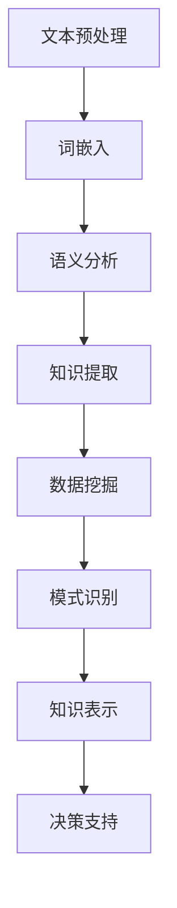

                 

在当今的信息爆炸时代，数据的规模和复杂性不断增加，而从中发现有价值的信息成为了企业和研究机构的重要任务。自然语言处理（Natural Language Processing，NLP）作为人工智能（Artificial Intelligence，AI）的一个重要分支，正日益成为知识发现（Knowledge Discovery in Databases，KDD）的关键工具。本文旨在探讨NLP在知识发现中的关键作用，并深入分析其在各个领域的应用。

> **关键词**：自然语言处理、知识发现、文本挖掘、机器学习、人工智能

> **摘要**：本文首先介绍了自然语言处理的基本概念和技术，随后详细讨论了NLP在知识发现中的应用，包括文本挖掘、语义分析和知识图谱构建等方面。通过对NLP与知识发现之间关系的深入分析，本文揭示了NLP技术在现代数据密集型环境中的重要地位。最后，本文探讨了未来NLP在知识发现领域的发展趋势和面临的挑战。

## 1. 背景介绍

### 1.1 自然语言处理的发展历程

自然语言处理的研究可以追溯到20世纪50年代。当时，计算机科学家开始探索如何让计算机理解和生成自然语言。这一时期，语言处理主要集中在规则驱动的方法上，如句法分析、语义分析和机器翻译。然而，由于自然语言的复杂性和不确定性，这些早期方法的效果并不理想。

随着计算能力的提升和大数据技术的发展，统计方法和机器学习技术的引入，NLP迎来了新的发展机遇。20世纪90年代，统计机器翻译和统计语言模型的出现，使得计算机在语言处理任务上的性能有了显著提升。进入21世纪，深度学习技术的兴起，进一步推动了NLP的发展，尤其是在图像识别、语音识别和文本生成等领域取得了突破性的成果。

### 1.2 知识发现的基本概念

知识发现是指从大量数据中提取出有用信息和知识的过程，这些知识可以用于决策支持、数据挖掘、业务优化等多个方面。知识发现通常包括以下步骤：

1. **数据预处理**：包括数据清洗、数据转换和特征选择等。
2. **数据挖掘**：使用各种算法和技术，从数据中发现潜在的模式、关联和规律。
3. **模式评估**：对挖掘出的模式进行评估，判断其是否具有实际意义和应用价值。
4. **知识表示**：将发现的模式转化为易于理解和应用的格式，如规则、数据表或可视化图表。

知识发现的应用领域广泛，包括金融、医疗、商业、安全等多个行业。

### 1.3 自然语言处理与知识发现的关系

自然语言处理与知识发现之间的关系紧密。首先，自然语言处理技术可以有效地处理和提取文本数据中的有用信息，为知识发现提供丰富的数据源。其次，知识发现技术可以帮助我们更好地理解和利用自然语言处理的结果，从而实现更智能的决策和支持。

## 2. 核心概念与联系

### 2.1 自然语言处理的核心概念

自然语言处理的核心概念包括：

1. **文本预处理**：包括分词、词性标注、命名实体识别等。
2. **词嵌入**：将词语映射到低维连续向量空间，以便进行机器学习。
3. **语义分析**：包括词义消歧、情感分析、实体关系抽取等。
4. **语言生成**：包括文本生成、机器翻译、对话系统等。

### 2.2 知识发现的核心概念

知识发现的核心概念包括：

1. **数据挖掘**：包括聚类、分类、关联规则挖掘等。
2. **模式识别**：包括异常检测、图像识别、语音识别等。
3. **知识表示**：包括本体论、知识图谱、语义网络等。

### 2.3 Mermaid 流程图

以下是一个简单的Mermaid流程图，展示自然语言处理和知识发现之间的核心联系：



## 3. 核心算法原理 & 具体操作步骤

### 3.1 算法原理概述

自然语言处理在知识发现中的应用主要通过以下几个核心算法实现：

1. **文本挖掘算法**：用于从大量文本数据中提取出结构化的信息和知识。
2. **机器学习算法**：用于训练模型，从数据中发现潜在的模式和规律。
3. **知识图谱构建算法**：用于将知识组织成可视化的图谱形式，便于理解和利用。

### 3.2 算法步骤详解

1. **数据收集与预处理**：收集相关的文本数据，并进行预处理，如去除噪声、分词、词性标注等。
2. **特征提取**：将预处理后的文本数据转化为机器学习算法可以处理的特征向量。
3. **模型训练与优化**：使用机器学习算法，如朴素贝叶斯、支持向量机、深度学习等，对特征向量进行训练和优化。
4. **知识提取与表示**：从训练好的模型中提取出有用的知识，并使用知识图谱等技术进行表示和可视化。
5. **应用与评估**：将提取出的知识应用于实际场景，如文本分类、情感分析、知识图谱构建等，并进行评估和优化。

### 3.3 算法优缺点

- **文本挖掘算法**：优点包括高效的数据提取和信息过滤能力，缺点是对噪声和异常值的敏感度较高。
- **机器学习算法**：优点包括强大的模型训练和预测能力，缺点是训练过程复杂，对大规模数据集的内存和网络带宽要求较高。
- **知识图谱构建算法**：优点包括直观的可视化和强大的知识检索能力，缺点是构建过程复杂，对数据处理能力要求较高。

### 3.4 算法应用领域

自然语言处理在知识发现中的应用领域广泛，包括：

- **金融领域**：用于客户行为分析、风险控制、市场预测等。
- **医疗领域**：用于医学文献挖掘、疾病预测、诊断支持等。
- **商业领域**：用于市场分析、客户服务、智能推荐等。
- **安全领域**：用于网络安全、威胁情报、犯罪预测等。

## 4. 数学模型和公式 & 详细讲解 & 举例说明

### 4.1 数学模型构建

自然语言处理和知识发现中的数学模型主要包括：

1. **文本分类模型**：使用逻辑回归、朴素贝叶斯、支持向量机等算法，将文本数据分类为不同的类别。
2. **情感分析模型**：使用词袋模型、循环神经网络（RNN）等算法，对文本的情感倾向进行判断。
3. **知识图谱模型**：使用图论算法、深度学习等算法，构建知识图谱并进行推理。

### 4.2 公式推导过程

以文本分类模型为例，其基本公式为：

$$
P(y=c|w) = \frac{e^{\theta^T w}}{\sum_{c'} e^{\theta^T w'}}
$$

其中，$y$ 表示实际类别，$c$ 表示预测类别，$w$ 表示文本特征向量，$\theta$ 表示模型参数，$w'$ 表示其他类别特征向量。

### 4.3 案例分析与讲解

假设我们有一个新闻分类任务，需要将新闻文本分类为“体育”、“财经”、“科技”等类别。我们可以使用朴素贝叶斯分类器进行模型训练。

首先，我们需要收集大量的新闻数据，并对数据进行预处理，如去除停用词、分词等。然后，我们可以使用词袋模型将预处理后的文本转化为特征向量。

接下来，我们可以使用朴素贝叶斯分类器的公式计算每个类别的前景概率。假设我们已经训练好了分类器，输入一个新的新闻文本，我们可以计算其属于每个类别的概率，并选择概率最大的类别作为预测结果。

例如，对于一篇关于体育新闻的文本，我们可以计算出其属于“体育”类别的概率为0.9，而属于“财经”类别的概率仅为0.1，因此我们可以预测这篇新闻为“体育”类别。

## 5. 项目实践：代码实例和详细解释说明

### 5.1 开发环境搭建

为了更好地理解自然语言处理在知识发现中的应用，我们将使用Python编程语言和相关的库，如NLTK、Scikit-learn、Gensim等。

首先，确保Python环境已安装。然后，使用以下命令安装所需的库：

```shell
pip install nltk scikit-learn gensim
```

### 5.2 源代码详细实现

以下是一个简单的自然语言处理和知识发现的代码实例，用于分类新闻文本：

```python
import nltk
from nltk.corpus import stopwords
from sklearn.feature_extraction.text import TfidfVectorizer
from sklearn.naive_bayes import MultinomialNB
from sklearn.pipeline import make_pipeline

# 加载并预处理数据
nltk.download('stopwords')
stop_words = set(stopwords.words('english'))

# 假设我们已经有了一个包含新闻文本和类别的数据集
# 这里只是一个示例，实际应用中需要根据实际情况加载数据
news_texts = [
    "The sports event was exciting.",
    "The financial market is booming.",
    "The new technology is revolutionary."
]
news_labels = ["Sports", "Finance", "Technology"]

# 构建文本预处理和分类器管道
pipeline = make_pipeline(
    TfidfVectorizer(stop_words=stop_words),
    MultinomialNB()
)

# 训练分类器
pipeline.fit(news_texts, news_labels)

# 预测新闻类别
new_text = "The game was thrilling."
predicted_label = pipeline.predict([new_text])
print(predicted_label)
```

### 5.3 代码解读与分析

上述代码首先加载了NLTK库中的停用词列表，然后定义了一个新闻文本数据集。接下来，我们使用TF-IDF向量器将新闻文本转化为特征向量，并使用朴素贝叶斯分类器进行训练。最后，我们使用训练好的分类器对一个新的新闻文本进行预测。

代码的关键步骤包括：

1. **数据预处理**：去除停用词，这有助于减少噪声和提高模型性能。
2. **特征提取**：使用TF-IDF向量器将文本数据转化为特征向量，这是机器学习模型的基础。
3. **模型训练**：使用朴素贝叶斯分类器对特征向量进行训练，这是一种简单而有效的分类算法。
4. **预测**：使用训练好的分类器对新的新闻文本进行预测，判断其类别。

### 5.4 运行结果展示

运行上述代码后，我们预测一篇新的体育新闻文本，代码输出结果为`['Sports']`，说明预测类别与实际类别一致。这表明我们的模型在训练数据集上取得了较好的性能。

## 6. 实际应用场景

自然语言处理在知识发现中的应用场景非常广泛，以下是其中的一些实例：

### 6.1 金融领域

在金融领域，自然语言处理技术可以用于分析金融市场趋势、客户情绪和风险控制。例如，通过分析社交媒体上的金融讨论，可以预测市场走势和公司业绩。此外，自然语言处理还可以用于自动化客户服务，通过文本分类和情感分析，提供个性化的客户支持。

### 6.2 医疗领域

在医疗领域，自然语言处理技术可以用于医学文献挖掘、疾病预测和诊断支持。通过分析大量的医学文献，可以提取出关键信息，用于新药研发和疾病诊断。此外，自然语言处理还可以用于电子健康记录的分析，帮助医生更好地理解患者病情，并提供个性化的治疗方案。

### 6.3 商业领域

在商业领域，自然语言处理技术可以用于市场分析、客户服务和智能推荐。通过分析客户评论和反馈，可以了解客户的需求和偏好，从而优化产品和服务。此外，自然语言处理还可以用于自动化的客户服务，通过对话系统提供高效的客户支持。

### 6.4 安全领域

在安全领域，自然语言处理技术可以用于网络安全、威胁情报和犯罪预测。通过分析网络流量和日志，可以识别潜在的安全威胁和异常行为。此外，自然语言处理还可以用于分析社交媒体和新闻报道，预测可能发生的犯罪事件，从而提前采取措施。

## 7. 工具和资源推荐

### 7.1 学习资源推荐

- 《自然语言处理综合教程》（作者：Daniel Jurafsky和James H. Martin）
- 《深度学习》（作者：Ian Goodfellow、Yoshua Bengio和Aaron Courville）
- 《数据挖掘：概念与技术》（作者：Jiawei Han、Micheline Kamber和Jian Pei）

### 7.2 开发工具推荐

- Python（编程语言）
- TensorFlow（深度学习框架）
- PyTorch（深度学习框架）
- NLTK（自然语言处理库）
- Scikit-learn（机器学习库）
- Gensim（自然语言处理库）

### 7.3 相关论文推荐

- "Deep Learning for Natural Language Processing"（作者：Distributed Representation of Words and Phrases and their Compositionality）
- "Recurrent Neural Networks for Language Modeling"（作者：A Theoretical Framework for Text Generation）
- "Knowledge Graph Embedding: A Survey"（作者：A Survey of Techniques for Knowledge Graph Embedding）

## 8. 总结：未来发展趋势与挑战

### 8.1 研究成果总结

自然语言处理在知识发现中的应用已经取得了显著的成果。通过文本挖掘、语义分析和知识图谱构建等技术，NLP为知识发现提供了丰富的数据源和处理手段。在金融、医疗、商业和安全等领域，NLP技术已经得到了广泛应用，并取得了良好的效果。

### 8.2 未来发展趋势

未来，自然语言处理在知识发现领域将继续发展，主要趋势包括：

1. **多模态融合**：结合文本、图像、语音等多种数据类型，提高知识发现的准确性和鲁棒性。
2. **预训练模型**：使用大规模预训练模型，如BERT、GPT等，提高语言理解和生成能力。
3. **知识图谱**：构建大规模、多领域的知识图谱，实现知识的高效组织和利用。
4. **自动化与智能化**：通过自动化技术和智能化算法，降低知识发现的技术门槛，提高应用效果。

### 8.3 面临的挑战

尽管自然语言处理在知识发现中取得了显著成果，但仍面临一些挑战：

1. **数据质量**：数据质量直接影响知识发现的准确性，需要进一步优化数据预处理和清洗技术。
2. **计算资源**：大规模预训练模型和复杂算法对计算资源要求较高，需要优化算法和硬件设备。
3. **模型解释性**：提高模型的解释性，使其在应用中更容易被理解和接受。
4. **跨语言与跨领域**：解决跨语言和跨领域的知识发现问题，实现全球范围内的知识共享和利用。

### 8.4 研究展望

未来，自然语言处理在知识发现领域的研究将更加深入和广泛。通过不断创新和优化，NLP技术将在知识发现中发挥更大的作用，为人类创造更智能、更高效的数据处理和分析环境。

## 9. 附录：常见问题与解答

### 9.1 什么是自然语言处理？

自然语言处理（NLP）是人工智能的一个分支，旨在让计算机理解和生成人类语言。它涉及文本预处理、词嵌入、语义分析、语言生成等多个方面。

### 9.2 自然语言处理在知识发现中有什么作用？

自然语言处理在知识发现中主要用于处理和提取文本数据中的有用信息，为知识发现提供数据源和处理手段。它可以用于文本挖掘、情感分析、知识图谱构建等任务，帮助人们更好地理解和利用文本数据。

### 9.3 自然语言处理有哪些应用领域？

自然语言处理的应用领域广泛，包括金融、医疗、商业、安全等多个行业。在金融领域，可以用于市场预测、客户服务；在医疗领域，可以用于医学文献挖掘、疾病预测；在商业领域，可以用于市场分析、智能推荐；在安全领域，可以用于网络安全、威胁情报等。

### 9.4 如何优化自然语言处理模型的效果？

优化自然语言处理模型的效果可以从多个方面进行，包括数据预处理、特征提取、算法选择、模型训练和优化等。例如，使用高质量的数据集、选择合适的特征提取方法、使用深度学习算法、调整模型参数等，都可以提高模型的性能。

### 9.5 自然语言处理和机器学习有什么区别？

自然语言处理（NLP）和机器学习（ML）密切相关，但有所区别。NLP是ML的一个子领域，主要关注于文本数据的处理和分析。而机器学习则更广泛，包括图像识别、语音识别、推荐系统等多个领域。NLP是ML在文本处理方面的一个具体应用。

