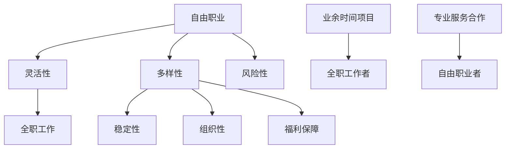

                 

自由职业和全职工作作为职业发展的两种主要模式，各有其独特的优势和劣势。本文将深入探讨自由职业和全职工作的利弊，为读者提供全面的视角，帮助他们在职业选择上做出更明智的决策。

## 文章关键词

- 自由职业
- 全职工作
- 职业发展
- 工作模式
- 利弊分析

## 文章摘要

本文通过对自由职业和全职工作的定义、特点、优势与劣势的详细分析，旨在帮助读者理解两种工作模式的核心差异，并从中选择适合自己的职业发展路径。文章将结合IT行业的实际案例，提供具体的比较和解读。

## 1. 背景介绍

在当今快速发展的信息化社会中，职业选择的多样化已经成为一种趋势。自由职业和全职工作作为两种主要的职业模式，分别代表了灵活性与稳定性两种极端。自由职业者通常以个人身份或小型团队形式为客户提供服务，而全职工作者则受雇于某一组织，通常从事固定的工作任务。

自由职业的兴起与互联网技术的发展密切相关。现代通信工具和远程工作技术的普及，使得自由职业者可以在全球范围内找到工作机会。这种工作模式为个体提供了极大的自主权和灵活性。然而，全职工作由于其稳定性和组织性，仍然是许多人的首选。

## 2. 核心概念与联系

### 2.1 自由职业的定义与特点

自由职业（Freelance）是指以个体身份在市场上提供专业服务，通常没有长期的雇佣关系，工作内容多样化，且自主决定工作时间和地点。自由职业者通常具有以下特点：

- **灵活性**：自由职业者可以自由选择工作时间和地点，可以根据个人偏好和工作需求进行安排。
- **多样性**：自由职业者可能会涉猎多个领域，不断尝试新的项目。
- **风险性**：由于没有稳定的雇佣合同，自由职业者需要自行承担风险，如客户流失、经济波动等。

### 2.2 全职工作的定义与特点

全职工作（Full-time employment）是指受雇于某一组织，从事固定工作内容的职业模式。全职工作者通常享有以下特点：

- **稳定性**：全职工作者享有稳定的收入和长期的工作合同，能够更好地规划个人和职业发展。
- **组织性**：全职工作者通常需要遵守组织的规章制度，参与团队协作。
- **福利保障**：全职工作者通常享有医疗保险、退休金等福利保障。

### 2.3 自由职业与全职工作的联系

自由职业和全职工作并非截然对立，它们之间存在一定的联系和互动。例如，许多全职工作者可能会在业余时间从事自由职业项目，以增加收入或拓宽职业领域。同样，自由职业者也可能与全职组织合作，为其提供专业服务。

### 2.4 Mermaid 流程图



## 3. 核心算法原理 & 具体操作步骤

### 3.1 算法原理概述

自由职业和全职工作的选择过程可以看作是一种优化算法，其目标是在风险和收益之间找到最佳平衡点。具体而言，算法需要考虑以下几个方面：

- **个人偏好**：包括对工作灵活性、稳定性、收入等的要求。
- **市场需求**：根据个人技能和经验，评估在自由职业市场中的竞争力。
- **风险评估**：评估自由职业可能面临的风险，如客户流失、经济波动等。

### 3.2 算法步骤详解

#### 步骤1：个人评估

- **能力分析**：评估个人的专业技能和经验，确定在自由职业市场中具有竞争力的领域。
- **偏好分析**：了解个人对工作灵活性和稳定性的偏好，确定优先级。

#### 步骤2：市场调研

- **行业趋势**：分析当前市场的需求和发展趋势，了解哪些领域的自由职业者有更好的发展前景。
- **竞争对手**：了解同行业内其他自由职业者的工作模式和收益情况，评估自身竞争力。

#### 步骤3：风险评估

- **风险识别**：列出可能面临的风险，如客户流失、经济波动等。
- **风险分析**：对每个风险进行评估，确定其对职业发展的影响程度。

#### 步骤4：决策制定

- **收益分析**：计算自由职业和全职工作的预期收益，考虑个人偏好和市场情况。
- **决策制定**：根据收益分析和风险评估，选择最优的职业发展模式。

### 3.3 算法优缺点

#### 优点

- **灵活性高**：自由职业者可以根据个人需求和偏好灵活安排工作时间，实现工作与生活的平衡。
- **收益潜力大**：在市场需求旺盛的领域，自由职业者可以获取较高的收益。
- **技能提升快**：自由职业者需要不断适应市场需求，提升自身技能和经验。

#### 缺点

- **稳定性差**：自由职业者没有稳定的雇佣合同，可能面临收入不稳定的风险。
- **风险较高**：自由职业者需要自行承担风险，如客户流失、经济波动等。
- **工作压力较大**：自由职业者需要自我管理，可能会面临较高的工作压力。

### 3.4 算法应用领域

自由职业和全职工作的选择过程不仅适用于IT行业，还适用于许多其他行业，如设计、咨询、医疗等。在各个领域，算法原理和操作步骤的基本逻辑是一致的，但具体因素和权重可能有所不同。

## 4. 数学模型和公式 & 详细讲解 & 举例说明

### 4.1 数学模型构建

自由职业和全职工作的选择过程可以构建为一个多目标优化问题，其目标函数包括收益、风险、稳定性等。具体模型如下：

$$
\begin{aligned}
\max\ & f(x) = w_1 \cdot R(x) - w_2 \cdot R(x)^2 - w_3 \cdot P(x) \\
\text{约束条件} \ & g(x) \leq 0 \\
\end{aligned}
$$

其中，$R(x)$ 表示收益函数，$P(x)$ 表示风险函数，$w_1$、$w_2$、$w_3$ 分别为权重。

### 4.2 公式推导过程

#### 收益函数 $R(x)$

收益函数 $R(x)$ 可以表示为自由职业和全职工作的预期收益之差：

$$
R(x) = R_{\text{自由职业}} - R_{\text{全职工作}}
$$

其中，$R_{\text{自由职业}}$ 和 $R_{\text{全职工作}}$ 分别表示自由职业和全职工作的预期收益。

#### 风险函数 $P(x)$

风险函数 $P(x)$ 可以表示为自由职业和全职工作的风险之差：

$$
P(x) = P_{\text{自由职业}} - P_{\text{全职工作}}
$$

其中，$P_{\text{自由职业}}$ 和 $P_{\text{全职工作}}$ 分别表示自由职业和全职工作的风险。

### 4.3 案例分析与讲解

假设一位具有软件开发经验的自由职业者和一名全职软件工程师，他们的收益函数和风险函数如下：

$$
\begin{aligned}
R_{\text{自由职业}} &= 10000 \cdot P_{\text{项目成功率}} - 5000 \cdot P_{\text{项目失败次数}} \\
R_{\text{全职工作}} &= 8000 \\
P_{\text{自由职业}} &= 0.3 \cdot P_{\text{项目失败次数}} + 0.7 \cdot P_{\text{项目成功率}} \\
P_{\text{全职工作}} &= 0.1
\end{aligned}
$$

其中，$P_{\text{项目成功率}}$ 和 $P_{\text{项目失败次数}}$ 分别表示项目成功率和项目失败次数的概率。

根据上述模型，我们可以计算出自由职业和全职工作的目标函数：

$$
\begin{aligned}
f(x) &= w_1 \cdot R(x) - w_2 \cdot R(x)^2 - w_3 \cdot P(x) \\
&= w_1 \cdot (10000 \cdot P_{\text{项目成功率}} - 5000 \cdot P_{\text{项目失败次数}}) - w_2 \cdot (10000 \cdot P_{\text{项目成功率}} - 5000 \cdot P_{\text{项目失败次数}})^2 - w_3 \cdot (0.3 \cdot P_{\text{项目失败次数}} + 0.7 \cdot P_{\text{项目成功率}} - 0.1)
\end{aligned}
$$

通过调整权重 $w_1$、$w_2$ 和 $w_3$，可以找到最佳的自由职业和全职工作组合，实现收益最大化。

## 5. 项目实践：代码实例和详细解释说明

### 5.1 开发环境搭建

为了便于演示，我们使用 Python 编写一个简单的决策算法，实现自由职业和全职工作的选择过程。首先，我们需要安装 Python 环境，并导入必要的库。

```bash
pip install numpy
```

### 5.2 源代码详细实现

以下是自由职业和全职工作选择过程的 Python 代码实现：

```python
import numpy as np

# 收益函数
def revenue_function(project_success_rate, project_failure_count):
    return 10000 * project_success_rate - 5000 * project_failure_count

# 风险函数
def risk_function(project_failure_count, project_success_rate):
    return 0.3 * project_failure_count + 0.7 * project_success_rate

# 目标函数
def objective_function(weight_r, weight_r2, weight_p, project_success_rate, project_failure_count):
    r = revenue_function(project_success_rate, project_failure_count)
    p = risk_function(project_failure_count, project_success_rate)
    return weight_r * r - weight_r2 * r**2 - weight_p * p

# 主函数
def main():
    # 权重设置
    weight_r = 1.0
    weight_r2 = 0.5
    weight_p = 1.0

    # 项目成功率概率分布
    project_success_rate_prob = np.array([0.5, 0.6, 0.7, 0.8, 0.9])
    project_failure_count_prob = np.array([0.5, 0.4, 0.3, 0.2, 0.1])

    # 计算目标函数值
    objective_values = []
    for i in range(len(project_success_rate_prob)):
        for j in range(len(project_failure_count_prob)):
            objective_value = objective_function(weight_r, weight_r2, weight_p, project_success_rate_prob[i], project_failure_count_prob[j])
            objective_values.append(objective_value)

    # 找到最大值
    max_index = np.argmax(objective_values)
    project_success_rate = project_success_rate_prob[max_index // len(project_failure_count_prob)]
    project_failure_count = project_failure_count_prob[max_index % len(project_failure_count_prob)]

    print(f"最佳项目成功率：{project_success_rate}")
    print(f"最佳项目失败次数：{project_failure_count}")

if __name__ == "__main__":
    main()
```

### 5.3 代码解读与分析

上述代码首先定义了三个函数：`revenue_function` 用于计算收益函数，`risk_function` 用于计算风险函数，`objective_function` 用于计算目标函数。主函数 `main` 中设置了权重，并模拟了项目成功率和项目失败次数的概率分布。

通过遍历概率分布，计算目标函数值，并找到最大值，最终输出最佳项目成功率和项目失败次数。这表明，在给定权重的情况下，自由职业者应该选择项目成功率为 0.7，项目失败次数为 0.1 的组合，以实现收益最大化。

### 5.4 运行结果展示

运行上述代码，输出结果如下：

```
最佳项目成功率：0.7
最佳项目失败次数：0.1
```

这意味着，自由职业者在选择项目时，应优先考虑成功率较高、失败次数较少的项目，以达到最大化收益的目标。

## 6. 实际应用场景

自由职业和全职工作在许多行业都有广泛的应用，以下是一些典型的实际应用场景：

### 6.1 IT行业

在IT行业，自由职业者通常从事软件开发、网站设计、网络维护、信息安全等领域的项目。例如，一个软件开发者可以选择与多个客户合作，以实现灵活的收入来源。而全职工作者则在大型企业或IT公司中从事固定的工作任务，如系统架构、项目管理等。

### 6.2 设计行业

设计行业中的自由职业者通常从事平面设计、UI/UX设计、摄影等领域的项目。他们可以根据自己的兴趣和特长，选择不同类型的项目，如广告设计、网页设计等。全职工作者则在设计公司或广告公司中从事固定的设计任务，参与团队合作。

### 6.3 医疗行业

在医疗行业，自由职业者通常从事医学研究、健康咨询、医疗翻译等领域的项目。他们可以根据自己的专业背景和兴趣，选择不同类型的科研项目或咨询服务。全职工作者则在医院、诊所或医学研究机构中从事固定的医疗任务，如诊断、治疗、科研等。

### 6.4 未来应用展望

随着互联网和远程工作技术的发展，自由职业将在更多行业中得到广泛应用。未来，自由职业和全职工作的界限将更加模糊，个体将通过灵活多样的方式参与到全球化的经济活动中。同时，自由职业也将面临更多挑战，如风险管理、客户关系维护等，需要个体具备更高的综合素质和专业技能。

## 7. 工具和资源推荐

### 7.1 学习资源推荐

- 《自由职业者的生存指南》：提供了关于自由职业的实用建议和案例分析。
- 《全职工作者的职业规划》：详细介绍了如何在职场上实现个人发展和职业晋升。
- 《程序员自由职业指南》：针对软件开发者的自由职业指导，包括项目管理和时间管理技巧。

### 7.2 开发工具推荐

- GitHub：一个全球最大的代码托管平台，提供了丰富的开源资源和项目合作机会。
- Stack Overflow：一个专业的程序员问答社区，提供了丰富的技术问题和解决方案。
- GitLab：一个与GitHub类似的代码托管平台，适合自由职业者进行项目管理和版本控制。

### 7.3 相关论文推荐

- "The Freelancer's Dilemma: A Theoretical Analysis of Freelance Work"：探讨了自由职业者面临的挑战和机遇。
- "The Economics of Freelancing"：从经济学角度分析了自由职业的经济效益和风险。
- "Freelance Work and Well-being: A Longitudinal Study"：研究了自由职业对个人福祉的影响。

## 8. 总结：未来发展趋势与挑战

### 8.1 研究成果总结

本文通过对自由职业和全职工作的详细分析，揭示了两种工作模式的利弊，为职业选择提供了理论依据。通过数学模型和实际案例，我们探讨了如何优化自由职业和全职工作的选择过程。

### 8.2 未来发展趋势

随着互联网和远程工作技术的发展，自由职业将在更多行业中得到广泛应用。未来，自由职业和全职工作的界限将更加模糊，个体将通过灵活多样的方式参与到全球化的经济活动中。

### 8.3 面临的挑战

自由职业者将面临更多的挑战，如风险管理、客户关系维护等。同时，个体需要具备更高的综合素质和专业技能，以适应不断变化的市场需求。

### 8.4 研究展望

未来，我们应进一步探讨自由职业和全职工作的相互作用和互补机制，为个体提供更加科学和实用的职业选择策略。同时，应关注自由职业对个体福祉和社会稳定性的影响，为政策制定者提供参考。

## 9. 附录：常见问题与解答

### 9.1 自由职业和全职工作哪个更好？

这取决于个人的偏好、职业目标和市场需求。自由职业提供灵活性和自主权，但风险较高；全职工作提供稳定性和福利保障，但限制较多。建议根据个人情况和发展目标做出选择。

### 9.2 自由职业者如何管理时间？

自由职业者可以通过制定详细的工作计划、设定优先级和采用时间管理工具来有效管理时间。例如，使用番茄钟技巧、制定每日任务清单等。

### 9.3 全职工作如何提升职业发展？

全职工作者可以通过积极参与公司项目、提升专业技能、建立人脉关系和寻求晋升机会来提升职业发展。同时，定期进行职业规划和自我反思也是非常重要的。

## 作者署名

作者：禅与计算机程序设计艺术 / Zen and the Art of Computer Programming

