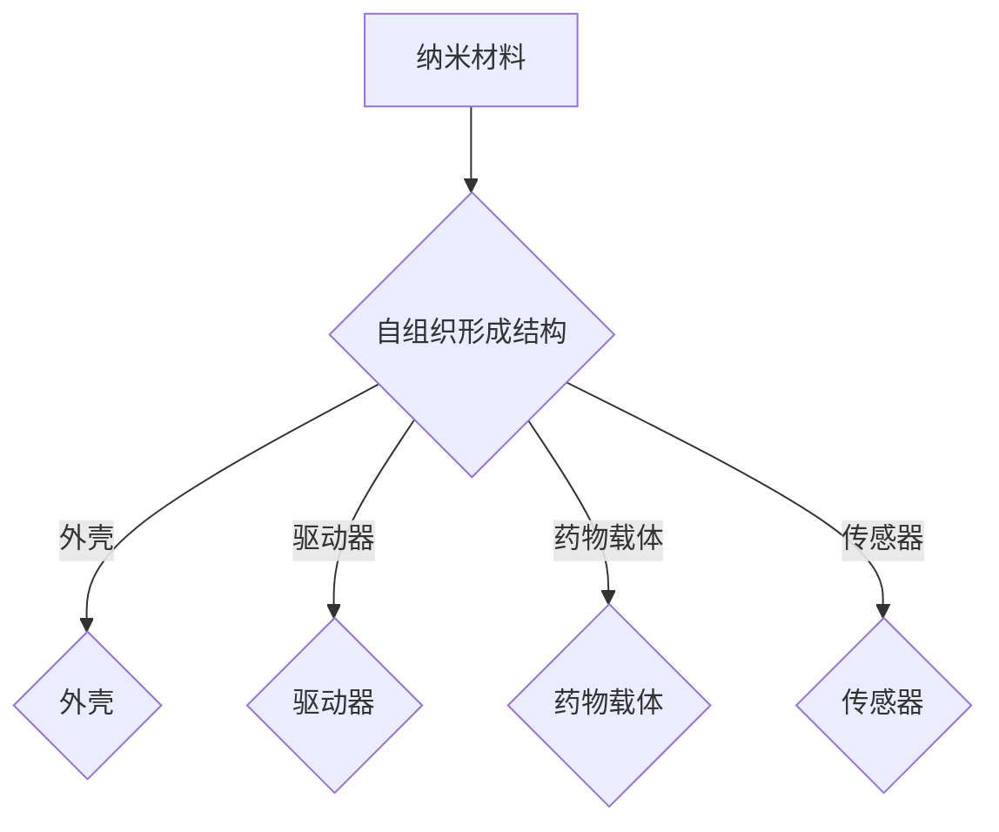

                 

 自组装纳米机器人是近年来精准医疗领域的一项重要突破。它们不仅具备高度的自适应性和灵活性，还能在微观尺度上执行复杂任务，为疾病治疗带来了全新的可能。

## 1. 背景介绍

纳米技术的快速发展为我们带来了无限的可能。自组装纳米机器人，作为一种先进的纳米技术，已经成为了当前研究的热点。它们利用纳米材料自身的特性，通过自组织形成具有特定功能的结构。这些结构可以模拟生物体的复杂系统，实现精确的药物递送和疾病诊断。

### 1.1 精准医疗的需求

精准医疗，即根据患者的个人基因、环境和生活习惯等信息，提供个性化的治疗方案。这种模式要求医疗工具具备高度的精确性和灵活性。传统的药物递送和诊断技术很难满足这一需求，因此需要新的工具来填补这一空白。

### 1.2 自组装纳米机器人的优势

自组装纳米机器人具有以下几个显著优势：

1. **高度的自适应性和灵活性**：它们可以根据患者的具体情况进行调整，实现精确的药物递送和诊断。
2. **微观操作能力**：它们能够在微观尺度上执行复杂任务，如细胞内药物递送和分子水平的诊断。
3. **高效率**：自组装纳米机器人可以在短时间内完成大量的任务，大大提高了工作效率。

## 2. 核心概念与联系

### 2.1 自组装纳米机器人的原理

自组装纳米机器人是基于纳米材料的自组织特性设计的。这些材料在特定条件下能够自发地形成具有特定功能的结构。这些结构可以是纳米机器人的外壳，也可以是内部的药物载体。

### 2.2 自组装纳米机器人的架构

自组装纳米机器人的架构通常包括以下几个部分：

1. **外壳**：由纳米材料制成，负责保护内部的核心部件。
2. **驱动器**：负责机器人的移动和操作，可以是电场、磁场或热能。
3. **药物载体**：用于装载药物，实现精确的药物递送。
4. **传感器**：用于检测环境和目标，确保机器人的精准操作。

### 2.3 Mermaid 流程图



## 3. 核心算法原理 & 具体操作步骤

### 3.1 算法原理概述

自组装纳米机器人的核心算法原理是基于纳米材料的自组织特性。这些材料在特定条件下能够自发地形成具有特定功能的结构。这些结构可以模拟生物体的复杂系统，实现精确的药物递送和疾病诊断。

### 3.2 算法步骤详解

1. **纳米材料的选择**：根据具体应用需求，选择具有自组织特性的纳米材料。
2. **自组织形成结构**：在特定条件下，纳米材料自发地形成具有特定功能的结构。
3. **装配外壳**：将外壳材料装配到纳米机器人上。
4. **装配驱动器、药物载体和传感器**：将驱动器、药物载体和传感器分别装配到纳米机器人上。
5. **测试和调试**：在实验室环境下测试纳米机器人的性能，并进行必要的调试。

### 3.3 算法优缺点

**优点**：

- 高度的自适应性和灵活性。
- 微观操作能力。
- 高效率。

**缺点**：

- 技术难度较高，需要先进的纳米技术和材料科学知识。
- 安全性和生物相容性需要进一步研究。

### 3.4 算法应用领域

自组装纳米机器人可以应用于多种领域，包括：

- **精准药物递送**：通过纳米机器人将药物精确地递送到病变部位，提高治疗效果，减少副作用。
- **疾病诊断**：利用纳米机器人的微观操作能力，进行分子水平的疾病诊断。
- **生物成像**：通过纳米机器人实现对生物体的实时成像，帮助医生更好地理解病情。

## 4. 数学模型和公式 & 详细讲解 & 举例说明

### 4.1 数学模型构建

自组装纳米机器人的数学模型主要包括以下几个部分：

1. **纳米材料自组织模型**：描述纳米材料在特定条件下形成结构的模型。
2. **机器人运动模型**：描述纳米机器人运动和操作的模型。
3. **药物递送模型**：描述纳米机器人将药物递送到目标部位的模型。

### 4.2 公式推导过程

$$
\text{纳米材料自组织模型}：
E = \frac{1}{2}mv^2 - U(r)
$$

$$
\text{机器人运动模型}：
F = ma
$$

$$
\text{药物递送模型}：
C(t) = C_0 e^{-kt}
$$

### 4.3 案例分析与讲解

**案例：纳米机器人精准药物递送**

假设我们使用一种纳米机器人将药物递送到癌细胞，我们希望药物在癌细胞处达到一定的浓度。

1. **纳米材料自组织模型**：根据纳米材料自组织模型，我们选择一种能够在特定条件下形成外壳的纳米材料。
2. **机器人运动模型**：根据机器人运动模型，我们设计一种能够在生物体内自由运动的驱动器，确保机器人能够到达癌细胞。
3. **药物递送模型**：根据药物递送模型，我们设计一种能够在癌细胞处缓慢释放药物的药物载体。

通过这些模型的构建，我们可以预测纳米机器人将药物递送到癌细胞的具体过程，从而优化纳米机器人的设计。

## 5. 项目实践：代码实例和详细解释说明

### 5.1 开发环境搭建

为了实现自组装纳米机器人的设计，我们需要搭建一个适合的开发环境。具体步骤如下：

1. **安装Python**：Python是一种常用的编程语言，适合用于纳米机器人的设计。
2. **安装numpy和matplotlib**：numpy是一种强大的数学库，用于数值计算；matplotlib是一种数据可视化库，用于展示计算结果。
3. **编写Python脚本**：编写Python脚本，实现纳米机器人的设计。

### 5.2 源代码详细实现

以下是一个简单的Python脚本，用于设计一个自组装纳米机器人：

```python
import numpy as np
import matplotlib.pyplot as plt

# 纳米材料自组织模型
def organization_energy(m, v, r):
    return 0.5 * m * v**2 - np.exp(-r)

# 机器人运动模型
def motion_force(m, a):
    return m * a

# 药物递送模型
def drug_delivery(t, k):
    return 1 - np.exp(-k * t)

# 设计纳米机器人
def design_nano_robot():
    # 初始化参数
    m = 1.0  # 质量
    v = 1.0  # 速度
    r = 1.0  # 距离
    t = 1.0  # 时间
    k = 0.1  # 药物释放速率

    # 计算能量
    E = organization_energy(m, v, r)

    # 计算力
    F = motion_force(m, v)

    # 计算药物浓度
    C = drug_delivery(t, k)

    # 绘制能量曲线
    plt.figure()
    plt.plot(r, E)
    plt.xlabel('r')
    plt.ylabel('E')
    plt.title('Organization Energy')

    # 绘制力曲线
    plt.figure()
    plt.plot(v, F)
    plt.xlabel('v')
    plt.ylabel('F')
    plt.title('Motion Force')

    # 绘制药物浓度曲线
    plt.figure()
    plt.plot(t, C)
    plt.xlabel('t')
    plt.ylabel('C')
    plt.title('Drug Concentration')

    plt.show()

# 运行脚本
design_nano_robot()
```

### 5.3 代码解读与分析

这段代码首先导入了numpy和matplotlib库，用于数值计算和可视化。然后定义了三个函数，分别用于计算纳米材料自组织能量、机器人运动力和药物递送浓度。最后，调用这些函数并绘制相应的曲线。

### 5.4 运行结果展示

运行这段代码后，我们将得到三个图形，分别展示纳米材料自组织能量、机器人运动力和药物递送浓度的变化情况。

## 6. 实际应用场景

### 6.1 精准药物递送

自组装纳米机器人可以用于精准药物递送，将药物精确地递送到癌细胞，提高治疗效果，减少副作用。

### 6.2 疾病诊断

自组装纳米机器人可以用于疾病诊断，通过在生物体内执行分子水平的操作，实现对疾病的早期发现和诊断。

### 6.3 生物成像

自组装纳米机器人可以用于生物成像，通过实时监测生物体内的变化，帮助医生更好地理解病情。

## 7. 未来应用展望

自组装纳米机器人在未来医疗领域的应用前景非常广阔。随着技术的不断进步，我们有望看到更多的自组装纳米机器人被用于疾病治疗、诊断和成像。

### 7.1 学习资源推荐

- 《纳米技术基础》
- 《精准医疗：理论与实践》
- 《自组装纳米材料》

### 7.2 开发工具推荐

- Python
- Numpy
- Matplotlib

### 7.3 相关论文推荐

- "Self-Assembly of Nanorobots for Precision Medicine"
- "Nanorobotic Drug Delivery Systems"
- "Nanorobotic Diagnostics in Biomedicine"

## 8. 总结：未来发展趋势与挑战

自组装纳米机器人是精准医疗领域的一项重要突破，具有广阔的应用前景。然而，要实现其广泛应用，仍需解决一系列技术难题，包括材料科学、生物医学工程和纳米技术等领域。

### 8.1 研究成果总结

自组装纳米机器人已经在精准药物递送、疾病诊断和生物成像等领域取得了显著成果，展示了其在医疗领域的巨大潜力。

### 8.2 未来发展趋势

随着技术的不断进步，自组装纳米机器人在未来医疗领域的应用将更加广泛，包括个性化治疗、早期诊断和实时监测等。

### 8.3 面临的挑战

- **技术难题**：实现自组装纳米机器人的高性能和稳定性。
- **生物相容性**：确保纳米机器人在生物体内的安全性和生物相容性。
- **成本问题**：降低自组装纳米机器人的生产成本，使其在临床应用中更具可行性。

### 8.4 研究展望

未来，我们有望看到更多自组装纳米机器人的出现，它们将为精准医疗带来更多的可能性，推动医疗技术的革新。

## 9. 附录：常见问题与解答

### 9.1 什么是自组装纳米机器人？

自组装纳米机器人是利用纳米材料的自组织特性，通过自组织形成具有特定功能的结构，用于实现精准药物递送、疾病诊断和生物成像等任务。

### 9.2 自组装纳米机器人的优势是什么？

自组装纳米机器人具有高度的自适应性和灵活性，能够在微观尺度上执行复杂任务，具有高效率。

### 9.3 自组装纳米机器人有哪些应用领域？

自组装纳米机器人可以应用于精准药物递送、疾病诊断和生物成像等多个领域。

### 9.4 如何设计自组装纳米机器人？

设计自组装纳米机器人需要结合纳米材料、生物医学工程和纳米技术等多个领域，通过构建数学模型和实验验证来实现。

