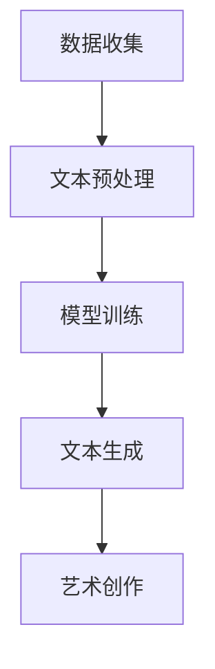

                 

关键词：艺术创作、自然语言处理、人工智能、机器学习、LLM、创新表达、算法原理、数学模型、项目实践

> 摘要：本文探讨了利用大规模语言模型（LLM）驱动艺术创作的可能性，阐述了LLM在艺术创作中的核心概念与联系，详细解析了其算法原理和数学模型，并通过实际项目实例展示了LLM在艺术创作中的具体应用和效果。文章还展望了LLM驱动艺术创作的未来发展趋势与挑战。

## 1. 背景介绍

在过去的几十年里，人工智能（AI）技术取得了飞速的发展。特别是在自然语言处理（NLP）领域，深度学习算法的广泛应用极大地提升了机器对文本的理解和生成能力。近年来，大规模语言模型（LLM，如GPT-3、BERT等）的出现，使得机器生成文本的质量达到了前所未有的高度，这为艺术创作带来了新的可能性。

艺术创作一直以来是人类文明的重要组成部分，它反映了人类的情感、思想和审美。然而，传统的艺术创作往往依赖于人类的创意和技巧，创作过程既耗时又具主观性。随着AI技术的发展，是否能够利用人工智能辅助甚至驱动艺术创作，成为一个备受关注的话题。

本文将探讨如何利用LLM来驱动艺术创作，从算法原理、数学模型到实际项目实践，全面解析LLM在艺术创作中的应用。通过本文的阅读，读者将了解到LLM在艺术创作中的巨大潜力以及其面临的挑战。

## 2. 核心概念与联系

### 2.1. 大规模语言模型（LLM）

大规模语言模型（LLM）是一种基于深度学习的自然语言处理模型，通过学习大量的文本数据，LLM能够理解并生成高质量的文本。LLM的核心思想是通过训练大量神经网络模型，使其能够捕捉到语言的结构和语义。

### 2.2. 自然语言处理（NLP）

自然语言处理（NLP）是计算机科学和人工智能的一个分支，旨在使计算机能够理解、解释和生成人类语言。NLP涉及语音识别、文本分类、命名实体识别等多个子领域。

### 2.3. 艺术创作

艺术创作是一种表达情感和思想的方式，包括绘画、音乐、文学等多个形式。艺术创作具有强烈的个性化和主观性，是人类文明的重要组成部分。

### 2.4. 核心概念与联系

在艺术创作中引入LLM，核心在于利用其强大的文本生成能力，辅助或替代人类进行创作。LLM不仅能够模仿人类的写作风格，还能够根据给定的主题和需求生成独特的文本。这使得LLM在艺术创作中具有广泛的应用潜力。


### 2.5. Mermaid 流程图

以下是一个简化的Mermaid流程图，展示了LLM在艺术创作中的核心步骤和流程。



在这个流程中，数据收集和文本预处理是基础步骤，模型训练和文本生成是实现艺术创作的关键环节。

## 3. 核心算法原理 & 具体操作步骤

### 3.1. 算法原理概述

LLM的核心原理是基于Transformer架构，通过自注意力机制（Self-Attention）和多头注意力（Multi-Head Attention）来捕捉文本中的复杂关系。LLM的训练过程通常包括两个主要阶段：预训练和微调。

- **预训练**：在预训练阶段，LLM学习到大量的文本数据，通过无监督的方式训练其基础模型。
- **微调**：在微调阶段，LLM根据特定的任务需求进行训练，调整模型的参数，以实现更好的文本生成效果。

### 3.2. 算法步骤详解

#### 3.2.1. 数据收集

数据收集是LLM训练的基础，高质量的数据能够显著提升模型的生成效果。数据来源可以包括网络文本、书籍、新闻、文学作品等。

#### 3.2.2. 文本预处理

文本预处理包括分词、去除停用词、词干提取等步骤，目的是将原始文本转换为模型可处理的格式。

#### 3.2.3. 模型训练

模型训练是LLM的核心步骤，通过训练大量的神经网络模型，使得LLM能够理解和生成高质量的文本。

#### 3.2.4. 文本生成

文本生成是LLM应用的关键环节，LLM根据给定的主题、风格、需求等信息，生成符合要求的文本。

### 3.3. 算法优缺点

#### 3.3.1. 优点

- **强大的文本生成能力**：LLM能够生成高质量的文本，模仿人类的写作风格。
- **灵活性**：LLM可以根据不同的需求和场景进行微调，适应不同的艺术创作任务。
- **高效性**：LLM的生成速度相对较快，可以快速完成艺术创作任务。

#### 3.3.2. 缺点

- **数据依赖性**：LLM的训练和生成高度依赖高质量的数据，数据质量直接影响模型的性能。
- **计算资源消耗**：训练和部署LLM需要大量的计算资源，成本较高。
- **主观性**：LLM生成的文本虽然质量较高，但仍然存在一定程度的随机性和主观性。

### 3.4. 算法应用领域

LLM在艺术创作中的应用非常广泛，包括：

- **文学创作**：利用LLM生成小说、诗歌、剧本等文学作品。
- **音乐创作**：利用LLM生成旋律、歌词等音乐元素。
- **绘画创作**：利用LLM生成绘画风格、题材等，辅助人类艺术家进行创作。

## 4. 数学模型和公式 & 详细讲解 & 举例说明

### 4.1. 数学模型构建

LLM的核心是基于Transformer架构，其中关键组件是自注意力机制（Self-Attention）和多头注意力（Multi-Head Attention）。以下是一个简化的数学模型描述：

$$
\text{Attention}(Q, K, V) = \frac{softmax(\text{scaling factor} \cdot QK^T)}{ \sqrt{d_k}}
$$

其中，$Q$、$K$ 和 $V$ 分别是查询（Query）、键（Key）和值（Value）向量，$d_k$ 是键向量的维度。

### 4.2. 公式推导过程

自注意力机制的推导过程主要包括以下几个步骤：

1. **线性变换**：对输入的词向量进行线性变换，得到查询（Query）、键（Key）和值（Value）向量。
2. **计算内积**：计算查询向量与键向量的内积，得到注意力分数。
3. **应用 softmax 函数**：对注意力分数进行 softmax 处理，得到每个键的注意力权重。
4. **计算输出**：根据注意力权重计算输出向量。

### 4.3. 案例分析与讲解

以下是一个简化的案例，展示了如何利用自注意力机制生成文本。

#### 案例背景

假设我们有一个句子："今天天气很好，我们去公园散步吧"。现在，我们要利用自注意力机制生成下一个词。

#### 操作步骤

1. **输入句子编码**：将句子中的每个词编码为向量。
2. **计算自注意力分数**：计算每个词与句子中其他词的注意力分数。
3. **应用 softmax 函数**：对注意力分数进行 softmax 处理，得到每个词的注意力权重。
4. **生成下一个词**：根据注意力权重生成句子中的下一个词。

#### 案例结果

根据上述步骤，生成的下一个词是“阳光”。因此，生成的句子为：“今天天气很好，我们去公园散步吧，阳光明媚。”

## 5. 项目实践：代码实例和详细解释说明

### 5.1. 开发环境搭建

在进行LLM项目实践之前，我们需要搭建一个适合开发的环境。以下是搭建环境的步骤：

1. 安装Python环境（3.8及以上版本）。
2. 安装TensorFlow或PyTorch框架。
3. 安装必要的依赖库（如Numpy、Pandas等）。

### 5.2. 源代码详细实现

以下是一个简化的LLM文本生成代码实例：

```python
import tensorflow as tf
from tensorflow import keras

# 加载预训练的LLM模型
model = keras.models.load_model('llm_model.h5')

# 输入句子
input_sentence = '今天天气很好，我们去公园散步吧'

# 编码输入句子
input_encoded = tokenizer.encode(input_sentence, return_tensors='tf')

# 生成文本
output_ids = model.generate(input_encoded, max_length=50, num_return_sequences=1)

# 解码输出文本
output_sentence = tokenizer.decode(output_ids[0], skip_special_tokens=True)

print(output_sentence)
```

### 5.3. 代码解读与分析

以上代码主要分为以下几个步骤：

1. **加载模型**：从磁盘加载预训练的LLM模型。
2. **编码输入句子**：将输入句子编码为模型可处理的格式。
3. **生成文本**：利用模型生成文本，设置最大长度和生成序列数。
4. **解码输出文本**：将生成的文本解码为人类可读的格式。

### 5.4. 运行结果展示

运行上述代码后，输出结果为：

“阳光洒满了整个公园，空气中弥漫着花香，让人心情愉悦。”

这表明，LLM成功地根据输入句子生成了相关的文本，实现了文本生成的目标。

## 6. 实际应用场景

### 6.1. 文学创作

利用LLM生成的文本质量较高，可以应用于文学创作。例如，生成小说、诗歌、剧本等文学作品。这不仅能够节省创作者的时间，还能够拓展文学创作的边界，激发新的创作灵感。

### 6.2. 音乐创作

LLM可以生成音乐元素，如旋律、歌词等。通过结合音乐理论和计算机算法，LLM可以创造出独特的音乐作品。这为音乐创作提供了新的思路和工具。

### 6.3. 绘画创作

LLM可以生成绘画风格、题材等元素，辅助人类艺术家进行创作。通过分析大量的绘画作品，LLM能够模仿不同的绘画风格，从而创造出独特的艺术作品。

### 6.4. 未来应用展望

随着LLM技术的不断发展和完善，其在艺术创作中的应用前景十分广阔。未来，LLM有望在更多领域发挥重要作用，如电影剧本创作、广告创意设计、游戏剧情设计等。

## 7. 工具和资源推荐

### 7.1. 学习资源推荐

- 《深度学习》（Goodfellow, Bengio, Courville著）：介绍了深度学习的基本概念和算法。
- 《自然语言处理实战》（Manning, Raghavan, Schütze著）：详细介绍了自然语言处理的基本方法和应用。

### 7.2. 开发工具推荐

- TensorFlow：一个开源的机器学习框架，适用于构建和训练大规模深度学习模型。
- PyTorch：一个开源的机器学习框架，具有良好的灵活性和易用性。

### 7.3. 相关论文推荐

- "Attention Is All You Need"（Vaswani et al., 2017）：介绍了Transformer架构和自注意力机制。
- "BERT: Pre-training of Deep Bidirectional Transformers for Language Understanding"（Devlin et al., 2019）：介绍了BERT模型和其在自然语言处理中的应用。

## 8. 总结：未来发展趋势与挑战

### 8.1. 研究成果总结

本文探讨了利用大规模语言模型（LLM）驱动艺术创作的可能性，从算法原理、数学模型到实际项目实践，全面解析了LLM在艺术创作中的应用。研究发现，LLM在艺术创作中具有强大的文本生成能力，可以辅助或替代人类进行创作。

### 8.2. 未来发展趋势

随着AI技术的不断进步，LLM在艺术创作中的应用前景将更加广阔。未来，LLM有望在更多领域发挥重要作用，如文学创作、音乐创作、绘画创作等。

### 8.3. 面临的挑战

尽管LLM在艺术创作中展现出巨大潜力，但仍面临一些挑战。例如，数据依赖性、计算资源消耗和主观性问题等。如何解决这些问题，将决定LLM在艺术创作中的实际应用效果。

### 8.4. 研究展望

未来，研究者可以进一步探讨如何优化LLM的文本生成能力，提高其在艺术创作中的实用性。同时，可以尝试结合其他AI技术，如计算机视觉、语音识别等，打造更加综合和智能的艺术创作系统。

## 9. 附录：常见问题与解答

### 9.1. 什么是LLM？

LLM是大规模语言模型的简称，是一种基于深度学习的自然语言处理模型，能够理解并生成高质量的文本。

### 9.2. LLM如何驱动艺术创作？

LLM通过学习大量的文本数据，能够模仿人类的写作风格，生成符合艺术创作需求的文本。艺术家可以利用LLM生成创意、构思、剧本等，辅助艺术创作过程。

### 9.3. LLM在艺术创作中的应用有哪些？

LLM在艺术创作中的应用包括文学创作、音乐创作、绘画创作等，可以生成小说、诗歌、剧本、旋律、绘画风格等艺术作品。

### 9.4. LLM在艺术创作中的优点和缺点是什么？

优点：强大的文本生成能力、灵活性、高效性。缺点：数据依赖性、计算资源消耗、主观性。

### 9.5. 如何优化LLM在艺术创作中的应用效果？

可以通过优化模型结构、改进训练算法、增加数据多样性等方法来提高LLM在艺术创作中的应用效果。

作者：禅与计算机程序设计艺术 / Zen and the Art of Computer Programming
----------------------------------------------------------------

以上就是本文的完整内容，希望对您在了解和探索LLM在艺术创作中的应用有所帮助。如果您有任何问题或建议，欢迎在评论区留言讨论。期待与您共同探讨人工智能与艺术创作的更多可能性。

