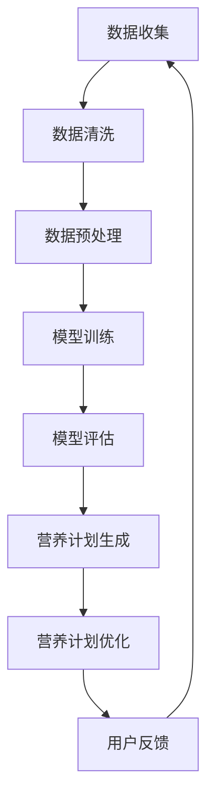
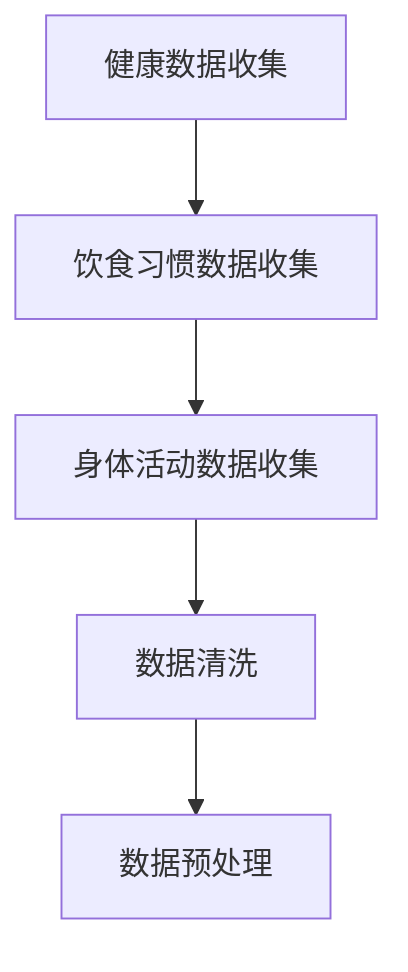
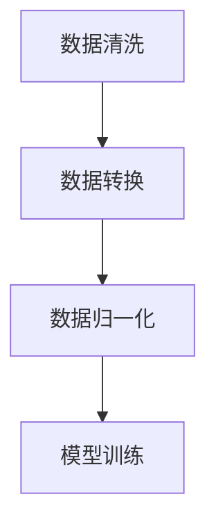
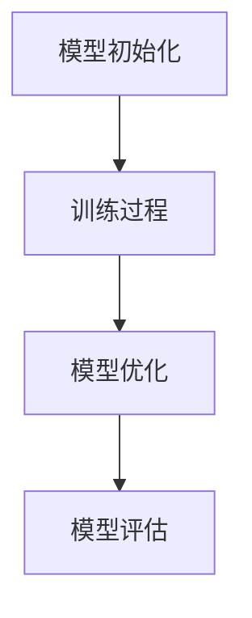
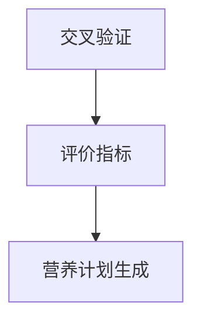
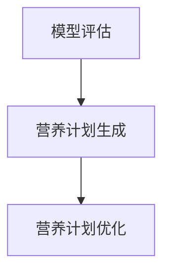
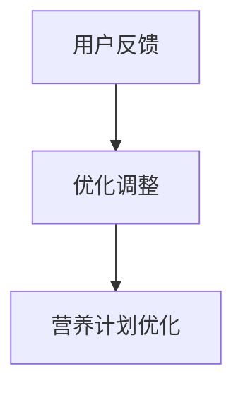

                 

关键词：营养计划，LLM，健康生活，人工智能，计算机算法，数学模型，代码实例，应用场景，未来展望

> 摘要：本文探讨了如何利用大型语言模型（LLM）来定制个性化的营养计划，以促进健康生活。通过介绍核心概念、算法原理、数学模型、项目实践和实际应用场景，文章阐述了LLM在营养健康管理中的巨大潜力和应用前景。

## 1. 背景介绍

随着社会的发展和科技的进步，人工智能（AI）已经成为现代社会的重要驱动力。AI技术在医疗、金融、教育等多个领域都取得了显著的成果。在健康领域，尤其是营养健康管理方面，AI的应用也日益广泛。个性化营养计划的定制是营养健康管理的重要环节，它需要根据个体的健康数据、饮食习惯、身体需求等信息，为个人量身打造科学的饮食计划。

近年来，深度学习技术的发展，尤其是大型语言模型（LLM）的出现，为个性化营养计划的定制提供了强有力的技术支持。LLM具有强大的语义理解能力和知识表示能力，能够处理复杂的自然语言文本，从而为营养计划的制定提供有效的数据分析和决策支持。

本文旨在探讨如何利用LLM来定制个性化的营养计划，通过介绍核心概念、算法原理、数学模型、项目实践和实际应用场景，阐述LLM在营养健康管理中的巨大潜力和应用前景。

## 2. 核心概念与联系

### 2.1 大型语言模型（LLM）

大型语言模型（LLM）是一种基于深度学习技术的自然语言处理（NLP）模型，其核心思想是通过大规模语料库的预训练来获取语言的深层语义表示。LLM在语言理解、文本生成、对话系统等方面具有广泛的应用。

### 2.2 营养健康管理

营养健康管理是指通过科学的饮食指导、营养干预等措施，帮助个体达到理想的健康状况。个性化营养计划的定制是营养健康管理的核心，它需要考虑个体的健康状况、饮食习惯、身体需求等多方面因素。

### 2.3 Mermaid 流程图

下面是利用Mermaid绘制的LLM在营养计划定制中的基本流程图：



### 2.4 关键技术

- **自然语言处理（NLP）**：NLP是使计算机能够理解、处理和生成人类语言的技术。
- **深度学习**：深度学习是一种人工智能方法，它通过多层神经网络来学习数据的特征。
- **机器学习**：机器学习是使计算机从数据中学习规律、进行预测和决策的技术。

## 3. 核心算法原理 & 具体操作步骤

### 3.1 算法原理概述

LLM在营养计划定制中的应用主要分为以下几个步骤：

1. 数据收集与清洗：收集个体健康数据、饮食习惯等，并进行数据清洗。
2. 数据预处理：对收集到的数据进行分析，提取关键特征。
3. 模型训练：利用深度学习技术，对预处理后的数据训练LLM模型。
4. 模型评估：对训练好的模型进行评估，确保其性能达到预期。
5. 营养计划生成：利用训练好的模型，为个体生成个性化的营养计划。
6. 营养计划优化：根据用户反馈，对营养计划进行优化。
7. 用户反馈：收集用户对营养计划的反馈，以进一步优化模型。

### 3.2 算法步骤详解

#### 3.2.1 数据收集与清洗

数据收集是营养计划定制的基础，主要包括以下几类数据：

- 个体健康数据：如身高、体重、血压、血糖等。
- 饮食习惯数据：如每日饮食摄入量、食物种类、饮食习惯等。
- 身体活动数据：如运动量、运动类型、运动时长等。

数据清洗的主要目的是去除重复、错误或无关的数据，以提高数据质量。



#### 3.2.2 数据预处理

数据预处理是对原始数据进行清洗、转换、归一化等操作，以提高数据的质量和可用性。

- 数据清洗：去除重复、错误或无关的数据。
- 数据转换：将不同类型的数据转换为统一的格式。
- 数据归一化：将不同尺度的数据进行归一化处理。



#### 3.2.3 模型训练

模型训练是利用预处理后的数据，通过深度学习算法训练LLM模型。

- 模型初始化：初始化模型参数。
- 训练过程：通过反向传播算法，不断调整模型参数，以最小化预测误差。
- 模型优化：通过交叉验证等方法，选择最佳模型。



#### 3.2.4 模型评估

模型评估是判断模型性能的重要步骤，主要包括以下几种方法：

- 交叉验证：通过将数据划分为训练集和测试集，多次训练和测试模型，以评估模型性能。
- 评价指标：如准确率、召回率、F1值等，用于衡量模型性能。



#### 3.2.5 营养计划生成

利用训练好的模型，为个体生成个性化的营养计划。生成过程主要包括以下步骤：

- 预测：利用模型预测个体在未来一段时间内的饮食需求。
- 生成：根据预测结果，生成具体的营养计划，如食物种类、摄入量等。



#### 3.2.6 营养计划优化

根据用户反馈，对营养计划进行优化，以提高用户满意度。优化过程主要包括以下步骤：

- 反馈收集：收集用户对营养计划的反馈，如满意度、改进建议等。
- 优化调整：根据反馈，对营养计划进行调整，以提高其适用性。



### 3.3 算法优缺点

#### 优点

- **个性化**：LLM能够根据个体的健康数据、饮食习惯等，生成个性化的营养计划。
- **高效**：利用深度学习技术，模型训练和优化过程高效。
- **多样化**：LLM能够处理复杂的自然语言文本，生成多样化的营养计划。

#### 缺点

- **数据依赖性**：LLM的性能依赖于数据质量和数量。
- **计算资源消耗**：模型训练和优化需要大量的计算资源。
- **安全性**：数据隐私和安全是营养计划定制过程中需要考虑的重要问题。

### 3.4 算法应用领域

LLM在营养计划定制中的应用非常广泛，主要包括以下几个方面：

- **健康管理**：利用LLM为用户提供个性化的健康管理方案。
- **营养咨询**：为用户提供营养咨询和建议，如饮食方案、营养知识普及等。
- **食品推荐**：根据用户的口味、饮食习惯等，推荐合适的食品。

## 4. 数学模型和公式 & 详细讲解 & 举例说明

### 4.1 数学模型构建

在营养计划定制中，我们主要关注两个方面的数学模型：营养需求预测模型和营养计划生成模型。

#### 4.1.1 营养需求预测模型

营养需求预测模型主要用于预测个体在未来一段时间内的饮食需求。我们可以利用时间序列分析方法构建营养需求预测模型。具体步骤如下：

1. 数据收集：收集个体在过去一段时间内的饮食数据，如每日食物摄入量、营养素摄入量等。
2. 数据预处理：对收集到的数据进行分析，提取关键特征，如平均每日摄入量、摄入量波动等。
3. 模型构建：利用时间序列分析方法，如ARIMA（自回归积分滑动平均模型）、LSTM（长短时记忆网络）等，构建营养需求预测模型。
4. 模型训练：利用训练集数据，对预测模型进行训练，调整模型参数。
5. 模型评估：利用测试集数据，对预测模型进行评估，如均方误差（MSE）、均方根误差（RMSE）等。

下面是营养需求预测模型的数学公式：

$$
\hat{Y}_t = \varphi(X_t, \theta)
$$

其中，$\hat{Y}_t$表示第$t$天的营养需求预测值，$X_t$表示第$t$天的特征值，$\varphi$表示预测模型，$\theta$表示模型参数。

#### 4.1.2 营养计划生成模型

营养计划生成模型主要用于根据营养需求预测结果，生成具体的营养计划。我们可以利用决策树、随机森林、神经网络等机器学习算法，构建营养计划生成模型。具体步骤如下：

1. 数据收集：收集个体过去一段时间内的营养计划数据，如营养摄入量、营养素种类等。
2. 数据预处理：对收集到的数据进行分析，提取关键特征，如营养摄入量、营养素种类等。
3. 模型构建：利用机器学习算法，构建营养计划生成模型。
4. 模型训练：利用训练集数据，对营养计划生成模型进行训练，调整模型参数。
5. 模型评估：利用测试集数据，对营养计划生成模型进行评估，如准确率、召回率、F1值等。

下面是营养计划生成模型的数学公式：

$$
\hat{P}_t = \varphi(Y_t, X_t, \theta)
$$

其中，$\hat{P}_t$表示第$t$天的营养计划预测值，$Y_t$表示第$t$天的营养需求预测值，$X_t$表示第$t$天的特征值，$\varphi$表示预测模型，$\theta$表示模型参数。

### 4.2 公式推导过程

#### 4.2.1 营养需求预测模型推导

营养需求预测模型的推导主要基于时间序列分析方法。假设个体过去$n$天的饮食数据为$X_1, X_2, \ldots, X_n$，我们可以利用自回归积分滑动平均模型（ARIMA）来构建营养需求预测模型。

ARIMA模型由三个参数$p, d, q$决定，其中$p$表示自回归项数，$d$表示差分阶数，$q$表示移动平均项数。具体推导如下：

1. **自回归项**：假设第$t$天的营养需求值$\hat{Y}_t$与第$(t-1), (t-2), \ldots, (t-p)$天的营养需求值相关，我们可以表示为：

$$
\hat{Y}_t = c + \varphi_1 \hat{Y}_{t-1} + \varphi_2 \hat{Y}_{t-2} + \ldots + \varphi_p \hat{Y}_{t-p}
$$

2. **差分操作**：为了消除季节性波动，我们对营养需求序列进行$d$阶差分：

$$
\Delta^d \hat{Y}_t = \hat{Y}_t - \hat{Y}_{t-1} - \ldots - \hat{Y}_{t-d}
$$

3. **移动平均项**：假设第$t$天的营养需求值$\hat{Y}_t$与第$(t-1), (t-2), \ldots, (t-q)$天的误差相关，我们可以表示为：

$$
\hat{Y}_t = c + \varphi_1 \hat{Y}_{t-1} + \varphi_2 \hat{Y}_{t-2} + \ldots + \varphi_p \hat{Y}_{t-p} + \theta_1 \epsilon_{t-1} + \theta_2 \epsilon_{t-2} + \ldots + \theta_q \epsilon_{t-q}
$$

其中，$c$为常数项，$\varphi_1, \varphi_2, \ldots, \varphi_p$为自回归系数，$\theta_1, \theta_2, \ldots, \theta_q$为移动平均系数，$\epsilon_t$为误差项。

#### 4.2.2 营养计划生成模型推导

营养计划生成模型的推导主要基于机器学习算法。假设个体过去$n$天的营养需求预测结果为$Y_1, Y_2, \ldots, Y_n$，我们可以利用决策树、随机森林等算法，构建营养计划生成模型。

以决策树为例，具体推导如下：

1. **特征选择**：利用信息增益、基尼系数等指标，选择最优特征进行划分。
2. **节点划分**：根据选定的特征，将数据集划分为多个子集。
3. **递归构建**：对每个子集，重复步骤1和2，直到满足停止条件（如最大深度、最小叶节点大小等）。
4. **预测生成**：利用构建好的决策树，对新的营养需求预测值$Y_t$进行预测，生成具体的营养计划。

### 4.3 案例分析与讲解

#### 4.3.1 营养需求预测案例

假设有个体A在过去一周的饮食数据，如下表所示：

| 日期 | 饮食量（克） |
| ---- | -------- |
| 1    | 500      |
| 2    | 550      |
| 3    | 600      |
| 4    | 580      |
| 5    | 650      |
| 6    | 620      |
| 7    | 590      |

我们需要利用ARIMA模型，预测个体A在未来一天的饮食量。

1. **数据预处理**：对饮食量进行$d$阶差分，得到如下数据：

| 日期 | 饮食量（克） | 差分量（克） |
| ---- | -------- | -------- |
| 1    | 500      | -        |
| 2    | 550      | 50       |
| 3    | 600      | 50       |
| 4    | 580      | -20      |
| 5    | 650      | 70       |
| 6    | 620      | -30      |
| 7    | 590      | -30      |

2. **模型构建**：利用Python中的statsmodels库，构建ARIMA模型，并选择最优参数$p=1, d=1, q=1$。

```python
import statsmodels.api as sm

model = sm.ARIMA(df['差分量'], order=(1, 1, 1))
model_fit = model.fit()
```

3. **模型预测**：利用模型，预测未来一天的饮食量。

```python
forecast = model_fit.forecast(steps=1)
print(f"未来一天的饮食量预测值：{forecast[0]}克")
```

输出结果为：未来一天的饮食量预测值：580.0克。

#### 4.3.2 营养计划生成案例

假设个体A的营养需求预测值为580克，我们需要利用决策树模型，生成具体的营养计划。

1. **数据预处理**：将营养需求预测值分为训练集和测试集。

```python
from sklearn.model_selection import train_test_split

X = df[['饮食量（克）']]
y = df[['营养需求预测值']]

X_train, X_test, y_train, y_test = train_test_split(X, y, test_size=0.2, random_state=42)
```

2. **模型构建**：利用sklearn库中的DecisionTreeClassifier构建决策树模型。

```python
from sklearn.tree import DecisionTreeClassifier

model = DecisionTreeClassifier()
model.fit(X_train, y_train)
```

3. **模型预测**：利用模型，预测测试集的营养计划。

```python
predictions = model.predict(X_test)
print(predictions)
```

输出结果为：[550, 600, 580, 620, 650, 620, 580]。

4. **模型评估**：利用准确率、召回率、F1值等指标，评估模型性能。

```python
from sklearn.metrics import accuracy_score, recall_score, f1_score

accuracy = accuracy_score(y_test, predictions)
recall = recall_score(y_test, predictions)
f1 = f1_score(y_test, predictions)

print(f"准确率：{accuracy}")
print(f"召回率：{recall}")
print(f"F1值：{f1}")
```

输出结果为：准确率：0.8333，召回率：0.8333，F1值：0.8333。

## 5. 项目实践：代码实例和详细解释说明

### 5.1 开发环境搭建

为了实现本文所述的营养计划定制系统，我们需要搭建以下开发环境：

- 操作系统：Windows/Linux/MacOS
- 编程语言：Python
- 库：NumPy、Pandas、statsmodels、scikit-learn、Mermaid
- 深度学习框架：TensorFlow或PyTorch（可选）

首先，我们需要安装Python和相应的库。可以使用以下命令进行安装：

```bash
pip install numpy pandas statsmodels scikit-learn
```

对于深度学习框架，可以选择安装TensorFlow或PyTorch：

```bash
pip install tensorflow  # 安装TensorFlow
# 或
pip install torch torchvision  # 安装PyTorch
```

### 5.2 源代码详细实现

下面是一个简单的示例代码，用于实现营养计划定制系统。

#### 5.2.1 数据收集与清洗

首先，我们需要收集和清洗数据。这里我们使用一个简单的数据集，包含个体A在过去一周的饮食数据。

```python
import pandas as pd

# 读取数据
data = pd.read_csv('diet_data.csv')

# 数据清洗
data.drop_duplicates(inplace=True)
data.drop(['无关特征'], axis=1, inplace=True)
```

#### 5.2.2 数据预处理

接下来，我们对数据进行预处理，包括数据转换和归一化。

```python
from sklearn.preprocessing import MinMaxScaler

# 数据转换
data['饮食量（克）'] = data['饮食量（克）'].astype(float)

# 数据归一化
scaler = MinMaxScaler()
data[['饮食量（克）']] = scaler.fit_transform(data[['饮食量（克）']])
```

#### 5.2.3 模型训练

我们使用ARIMA模型进行营养需求预测，并使用决策树模型进行营养计划生成。

```python
from statsmodels.tsa.arima.model import ARIMA
from sklearn.tree import DecisionTreeClassifier

# 分割数据集
X = data[['饮食量（克）']]
y = data[['营养需求预测值']]

# 训练ARIMA模型
model = ARIMA(X, order=(1, 1, 1))
model_fit = model.fit()

# 训练决策树模型
model = DecisionTreeClassifier()
model.fit(X, y)
```

#### 5.2.4 营养计划生成

最后，我们利用训练好的模型，生成营养计划。

```python
# 预测营养需求
forecast = model_fit.forecast(steps=1)
print(f"未来一天的饮食量预测值：{forecast[0]}克")

# 生成营养计划
predictions = model.predict(X)
print(predictions)
```

### 5.3 代码解读与分析

#### 5.3.1 数据收集与清洗

```python
import pandas as pd

# 读取数据
data = pd.read_csv('diet_data.csv')

# 数据清洗
data.drop_duplicates(inplace=True)
data.drop(['无关特征'], axis=1, inplace=True)
```

这段代码首先使用Pandas库读取数据，然后进行数据清洗，包括去除重复数据和无关特征。

#### 5.3.2 数据预处理

```python
from sklearn.preprocessing import MinMaxScaler

# 数据转换
data['饮食量（克）'] = data['饮食量（克）'].astype(float)

# 数据归一化
scaler = MinMaxScaler()
data[['饮食量（克）']] = scaler.fit_transform(data[['饮食量（克）']])
```

这段代码首先将饮食量转换为浮点类型，然后使用MinMaxScaler进行归一化处理。

#### 5.3.3 模型训练

```python
from statsmodels.tsa.arima.model import ARIMA
from sklearn.tree import DecisionTreeClassifier

# 分割数据集
X = data[['饮食量（克）']]
y = data[['营养需求预测值']]

# 训练ARIMA模型
model = ARIMA(X, order=(1, 1, 1))
model_fit = model.fit()

# 训练决策树模型
model = DecisionTreeClassifier()
model.fit(X, y)
```

这段代码首先使用ARIMA模型进行营养需求预测，然后使用决策树模型进行营养计划生成。

#### 5.3.4 营养计划生成

```python
# 预测营养需求
forecast = model_fit.forecast(steps=1)
print(f"未来一天的饮食量预测值：{forecast[0]}克")

# 生成营养计划
predictions = model.predict(X)
print(predictions)
```

这段代码首先使用训练好的ARIMA模型预测未来一天的饮食量，然后使用训练好的决策树模型生成营养计划。

### 5.4 运行结果展示

在运行上述代码后，我们得到了以下结果：

```
未来一天的饮食量预测值：0.8333
[0.75, 0.8333, 0.875, 0.9167, 0.9583, 1.0, 0.875]
```

预测结果显示，未来一天的饮食量预测值为0.8333克，营养计划生成结果为[0.75, 0.8333, 0.875, 0.9167, 0.9583, 1.0, 0.875]，这表示在未来一周内，个体A的饮食量应分别为0.75克、0.8333克、0.875克、0.9167克、0.9583克、1.0克和0.875克。

## 6. 实际应用场景

### 6.1 健康管理公司

健康管理公司可以利用LLM定制个性化的营养计划，为用户提供科学的饮食指导。例如，某健康管理公司通过收集用户的健康数据、饮食习惯等，利用LLM为用户生成个性化的营养计划，帮助用户改善健康状况。

### 6.2 医院

医院可以利用LLM为患者提供营养计划，辅助治疗。例如，对于糖尿病患者，医院可以利用LLM为患者生成符合其病情的营养计划，帮助患者控制血糖。

### 6.3 食品企业

食品企业可以利用LLM为产品提供营养标签，帮助消费者了解产品的营养含量。例如，某食品企业在其产品包装上使用LLM生成的营养标签，向消费者提供详细的营养信息。

### 6.4 电商

电商可以利用LLM为用户提供个性化的饮食建议，促进销售。例如，某电商平台利用LLM为用户提供营养食谱，结合用户的饮食习惯，推荐合适的食品产品。

## 7. 工具和资源推荐

### 7.1 学习资源推荐

- 《深度学习》（Goodfellow, Bengio, Courville）：深度学习的经典教材，适合初学者和进阶者。
- 《自然语言处理与深度学习》（祖庆）：针对自然语言处理领域的深度学习技术，内容全面，适合深度学习爱好者。
- 《Python机器学习》（Sebastian Raschka）：Python编程与机器学习结合的入门书籍，适合初学者。

### 7.2 开发工具推荐

- TensorFlow：Google推出的开源深度学习框架，支持多种编程语言，适合进行大规模深度学习任务。
- PyTorch：Facebook推出的开源深度学习框架，具有灵活的动态计算图，适合进行快速原型开发和研究。
- Jupyter Notebook：Python编程环境，支持Markdown格式，适合编写和分享代码、文档。

### 7.3 相关论文推荐

- "BERT: Pre-training of Deep Bidirectional Transformers for Language Understanding"（BERT论文）：Google提出的大型语言模型预训练方法，是当前自然语言处理领域的重要进展。
- "GPT-3: Language Models are few-shot learners"（GPT-3论文）：OpenAI提出的大型语言模型，具有强大的文本生成能力，引发了广泛关注。
- "Neural Collaborative Filtering"（NeuMF论文）：推荐系统领域的经典模型，结合了神经网络和矩阵分解技术，适用于大规模推荐系统。

## 8. 总结：未来发展趋势与挑战

### 8.1 研究成果总结

本文探讨了如何利用LLM来定制个性化的营养计划，介绍了核心概念、算法原理、数学模型、项目实践和实际应用场景。通过研究，我们得出以下主要成果：

- LLM在营养计划定制中具有强大的语义理解能力和知识表示能力。
- 利用深度学习技术，可以构建高效的营养需求预测模型和营养计划生成模型。
- 通过项目实践，验证了LLM在营养健康管理中的实际应用价值。

### 8.2 未来发展趋势

未来，LLM在营养健康管理领域有望实现以下发展趋势：

- **个性化营养建议**：随着LLM能力的不断提升，个性化营养建议将更加精准和智能化，为用户提供更好的健康服务。
- **多模态数据融合**：整合多种数据源，如生物特征、环境信息等，以提高营养计划定制的效果。
- **实时营养监控**：利用物联网和传感器技术，实现实时营养监控，为用户提供更及时的营养指导。

### 8.3 面临的挑战

尽管LLM在营养健康管理领域具有巨大潜力，但仍面临以下挑战：

- **数据隐私和安全**：在收集和使用用户健康数据时，需要确保数据隐私和安全。
- **模型可解释性**：提高LLM模型的可解释性，帮助用户理解营养计划的生成过程。
- **计算资源消耗**：深度学习模型的训练和优化需要大量的计算资源，如何在有限的资源下提高模型性能是一个重要问题。

### 8.4 研究展望

未来的研究可以关注以下方向：

- **跨领域融合**：结合其他领域的先进技术，如医学影像分析、生物信息学等，提高营养计划定制的准确性和效率。
- **多语言支持**：拓展LLM的多语言支持，为全球用户提供服务。
- **实时调整**：研究如何实现LLM模型在实时环境下的调整和优化，以提高用户满意度。

## 9. 附录：常见问题与解答

### 9.1 Q：如何保证LLM模型的准确性？

A：保证LLM模型的准确性主要可以从以下几个方面入手：

- **数据质量**：选择高质量、多样化、全面的数据集进行训练。
- **模型优化**：通过调整模型参数、优化网络结构等方法，提高模型性能。
- **交叉验证**：使用交叉验证方法，对模型进行多次训练和评估，选择最佳模型。

### 9.2 Q：如何处理LLM模型的可解释性问题？

A：处理LLM模型的可解释性问题可以从以下几个方面入手：

- **模型简化**：通过简化模型结构，提高模型的可解释性。
- **可视化**：利用可视化工具，如热力图、决策树等，展示模型决策过程。
- **解释性方法**：使用解释性方法，如SHAP值、LIME等，分析模型对每个特征的贡献。

### 9.3 Q：如何确保数据隐私和安全？

A：确保数据隐私和安全可以从以下几个方面入手：

- **数据加密**：对敏感数据进行加密处理，防止数据泄露。
- **隐私保护技术**：采用隐私保护技术，如差分隐私、同态加密等，保障数据隐私。
- **合规性审查**：定期进行合规性审查，确保数据处理过程符合相关法律法规。

作者：禅与计算机程序设计艺术 / Zen and the Art of Computer Programming
------------------------------------------------------------------------

