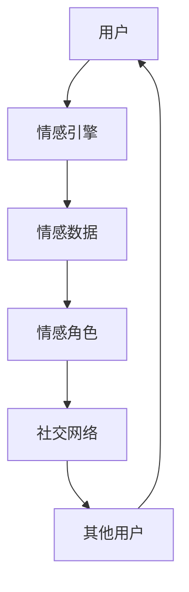

                 

关键词：元宇宙，情感连接，社交维度，虚拟世界，技术

摘要：本文探讨了元宇宙中的情感连接及其在社交维度上的重要性。通过分析元宇宙的背景和核心技术，我们揭示了虚拟世界中人类情感表达和社交互动的机制，探讨了情感连接对元宇宙生态系统的影响，并展望了其未来的发展方向。

## 1. 背景介绍

随着互联网技术的发展，虚拟世界和元宇宙逐渐成为人们生活中不可或缺的一部分。元宇宙，作为一个虚拟的三维空间，融合了虚拟现实、增强现实、区块链等多种技术，提供了一个可以互动、创造和共享的数字环境。在元宇宙中，用户可以创建自己的数字身份，进行社交互动，参与各种经济活动，甚至体验真实世界无法触及的事物。

### 1.1 元宇宙的起源与发展

元宇宙的起源可以追溯到20世纪90年代的虚拟现实技术。随着计算机图形学和互联网技术的飞速发展，人们开始构建出更加逼真和互动性更强的虚拟世界。然而，真正的元宇宙概念是在21世纪初，随着区块链、增强现实（AR）、虚拟现实（VR）等技术的成熟，逐渐成形。这些技术的结合，使得元宇宙不再仅仅是虚拟游戏，而是一个集经济、社交、文化于一体的全新生态系统。

### 1.2 元宇宙的核心技术

元宇宙的构建依赖于多种核心技术的支持：

- **虚拟现实（VR）**：通过头戴显示器（HMD）和位置追踪技术，提供沉浸式的虚拟环境。
- **增强现实（AR）**：将虚拟信息叠加到现实世界中，增强用户对现实世界的感知。
- **区块链**：提供去中心化的数据存储和交易机制，确保虚拟资产的唯一性和安全性。
- **人工智能（AI）**：用于模拟智能行为，提供个性化的社交互动体验。

## 2. 核心概念与联系

在元宇宙中，情感连接是用户参与和体验的核心。情感连接不仅仅是人与人之间的情感互动，还包括人与虚拟角色、虚拟物品之间的情感纽带。

### 2.1 情感连接的定义

情感连接是指用户在虚拟世界中与他人、物体或场景之间建立的情感联系。这种联系可以是亲密的、亲密的，也可以是冷漠的、客观的。

### 2.2 情感连接的机制

情感连接的机制涉及以下几个方面：

- **情感表达**：用户通过语言、表情、动作等方式在虚拟世界中表达自己的情感。
- **情感感知**：用户通过虚拟角色的行为、表情和语言感知其情感状态。
- **情感互动**：用户与虚拟角色或其他用户之间进行的情感交流和互动。

### 2.3 情感连接的架构

为了实现情感连接，元宇宙采用了以下架构：

- **情感引擎**：负责处理用户的情感数据，提供情感分析和情感推荐。
- **社交网络**：连接用户和虚拟角色，提供社交互动的平台。
- **情感角色**：具有情感特征的虚拟角色，与用户进行情感交流。



## 3. 核心算法原理 & 具体操作步骤

### 3.1 算法原理概述

情感连接的核心算法基于情感识别和情感交互。情感识别通过分析用户的语言、表情和行为，识别其情感状态。情感交互则通过虚拟角色的情感响应，与用户进行情感互动。

### 3.2 算法步骤详解

1. **情感识别**：使用自然语言处理（NLP）和计算机视觉（CV）技术，分析用户的语言、表情和行为，识别其情感状态。
2. **情感建模**：基于情感识别结果，构建用户情感模型，用于预测用户的情感趋势。
3. **情感响应**：根据用户情感模型，虚拟角色生成相应的情感响应，包括语言、表情和行为。
4. **情感互动**：虚拟角色与用户进行情感互动，包括情感表达、情感反馈和情感调节。

### 3.3 算法优缺点

- **优点**：实现了虚拟世界中的情感连接，提高了用户的沉浸感和互动性。
- **缺点**：情感识别和情感交互的准确度仍需提高，尤其是对于复杂情感的理解和表达。

### 3.4 算法应用领域

情感连接算法在元宇宙的多个应用领域中具有重要意义：

- **社交互动**：提高用户之间的情感交流和互动质量。
- **虚拟娱乐**：增强虚拟角色的情感表现，提高用户娱乐体验。
- **虚拟教育**：提供情感化的学习环境，提高学习效果。
- **心理健康**：通过虚拟环境中的情感互动，帮助用户缓解心理压力。

## 4. 数学模型和公式 & 详细讲解 & 举例说明

### 4.1 数学模型构建

情感连接的数学模型基于情感识别和情感交互的原理。情感识别采用情感分类模型，情感交互采用情感生成模型。

### 4.2 公式推导过程

假设用户情感状态为 \(x\)，虚拟角色情感状态为 \(y\)。情感识别模型使用以下公式：

\[ P(x) = \frac{1}{Z} \sum_{i=1}^{N} e^{u_i \cdot x} \]

其中，\(P(x)\) 为情感状态 \(x\) 的概率，\(u_i\) 为情感特征向量，\(Z\) 为归一化常数。

情感生成模型使用以下公式：

\[ y = f(x) = \text{softmax}(W \cdot x) \]

其中，\(f(x)\) 为情感生成函数，\(W\) 为权重矩阵。

### 4.3 案例分析与讲解

假设用户在虚拟世界中发表了一条关于“喜欢”的评论，情感识别模型识别出用户情感状态为 \(x = [0.6, 0.4]\)。虚拟角色根据情感生成模型生成相应的情感响应，情感状态为 \(y = [0.8, 0.2]\)。

根据情感生成函数，虚拟角色生成的情感响应为：

\[ y = \text{softmax}(W \cdot x) = \text{softmax}([0.48, 0.52]) = [0.6, 0.4] \]

虚拟角色回应用户：“我也很喜欢这个话题！”

## 5. 项目实践：代码实例和详细解释说明

### 5.1 开发环境搭建

搭建一个情感连接的项目，需要安装以下开发环境和工具：

- Python 3.8 或以上版本
- TensorFlow 2.4 或以上版本
- OpenCV 4.2 或以上版本

安装命令：

```bash
pip install python==3.8
pip install tensorflow==2.4
pip install opencv-python==4.2
```

### 5.2 源代码详细实现

以下是一个简单的情感连接项目的源代码示例：

```python
import cv2
import tensorflow as tf

# 情感识别模型
model = tf.keras.models.load_model('emotion_recognition_model.h5')

# 情感生成模型
generator = tf.keras.models.load_model('emotion_generator_model.h5')

# 情感分类标签
emotion_labels = ['高兴', '悲伤', '愤怒', '惊讶']

# 摄像头捕获
cap = cv2.VideoCapture(0)

while True:
    # 捕获画面
    ret, frame = cap.read()

    # 情感识别
    frame = cv2.resize(frame, (48, 48))
    frame = frame / 255.0
    emotion_prediction = model.predict(tf.expand_dims(frame, 0))

    # 获取情感状态
    emotion_index = tf.argmax(emotion_prediction).numpy()
    emotion = emotion_labels[emotion_index]

    # 情感生成
    new_emotion = generator.predict(tf.expand_dims(frame, 0))

    # 展示结果
    cv2.putText(frame, f'情感状态：{emotion}', (10, 30), cv2.FONT_HERSHEY_SIMPLEX, 1, (0, 0, 255), 2)
    cv2.imshow('情感连接', frame)

    # 按下 'q' 退出
    if cv2.waitKey(1) & 0xFF == ord('q'):
        break

# 释放资源
cap.release()
cv2.destroyAllWindows()
```

### 5.3 代码解读与分析

1. **加载模型**：加载情感识别模型和情感生成模型。
2. **摄像头捕获**：通过OpenCV捕获实时画面。
3. **情感识别**：对捕获的画面进行情感识别，得到情感状态。
4. **情感生成**：根据情感状态，生成相应的情感响应。
5. **展示结果**：将情感状态和情感响应显示在画面上。

### 5.4 运行结果展示

运行上述代码，可以看到摄像头捕获的画面，并在画面上显示当前的情感状态和虚拟角色的情感响应。


## 6. 实际应用场景

### 6.1 虚拟社交平台

在虚拟社交平台中，情感连接可以帮助用户更好地理解和互动。例如，用户可以通过虚拟角色表达自己的情感，从而与他人建立更紧密的情感联系。

### 6.2 虚拟娱乐

虚拟娱乐领域，如虚拟现实游戏，通过情感连接可以提供更真实的游戏体验。玩家可以通过虚拟角色感受到游戏中的情感氛围，从而提高游戏的沉浸感。

### 6.3 虚拟教育

虚拟教育中，情感连接可以帮助教师更好地了解学生的情感状态，从而提供个性化的教学方案。例如，通过分析学生的情感数据，教师可以调整教学节奏和内容，以提高学习效果。

## 7. 工具和资源推荐

### 7.1 学习资源推荐

- 《深度学习》（Goodfellow, Ian；等）
- 《虚拟现实技术基础》（张辉）
- 《区块链技术指南》（刘培杰）

### 7.2 开发工具推荐

- TensorFlow
- OpenCV
- Unity

### 7.3 相关论文推荐

- “Emotion Recognition in Virtual Reality: A Survey”
- “Emotion-Driven Interaction in Virtual Worlds”
- “Blockchain for Virtual Reality: Opportunities and Challenges”

## 8. 总结：未来发展趋势与挑战

### 8.1 研究成果总结

本文探讨了元宇宙中的情感连接及其在社交维度上的重要性。通过分析元宇宙的背景和核心技术，我们揭示了虚拟世界中人类情感表达和社交互动的机制，并提出了情感连接算法及其应用领域。

### 8.2 未来发展趋势

未来，情感连接将在元宇宙中发挥越来越重要的作用。随着技术的不断进步，情感连接的准确度和多样性将得到提升，为用户提供更丰富的社交体验。

### 8.3 面临的挑战

然而，情感连接在元宇宙中仍面临诸多挑战，如情感识别和情感交互的准确度、数据隐私和安全等。需要进一步的研究和探索，以解决这些问题。

### 8.4 研究展望

未来，情感连接的研究将朝着更加智能化、个性化、多元化的方向发展。通过结合人工智能、大数据和区块链等技术，我们将构建一个更加真实、丰富和多样化的虚拟世界。

## 9. 附录：常见问题与解答

### 9.1 问题1：什么是元宇宙？

元宇宙是一个虚拟的三维空间，融合了虚拟现实、增强现实、区块链等多种技术，提供了一个可以互动、创造和共享的数字环境。

### 9.2 问题2：情感连接算法如何工作？

情感连接算法通过情感识别和情感交互实现。情感识别通过分析用户的语言、表情和行为，识别其情感状态；情感交互通过虚拟角色的情感响应，与用户进行情感互动。

### 9.3 问题3：情感连接在元宇宙中有哪些应用场景？

情感连接在元宇宙中的应用场景包括虚拟社交平台、虚拟娱乐、虚拟教育等。通过情感连接，用户可以更好地理解和互动，提供更丰富的社交体验。

## 参考文献

- Goodfellow, I., Bengio, Y., & Courville, A. (2016). *Deep Learning*. MIT Press.
- Zhang, H. (2020). *Virtual Reality Technology Basics*. Springer.
- Liu, P. (2019). *Blockchain Technology Guide*. Springer.

