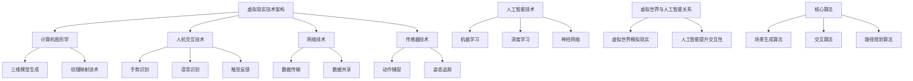

                 

关键词：虚拟世界、AI、架空历史、计算机模拟、技术发展、历史演变、未来展望

> 摘要：本文通过探讨人工智能（AI）技术在虚拟世界构建中的应用，回顾了AI创造的架空历史，分析了其在历史演变、技术发展、未来展望等方面的深远影响。本文旨在为读者提供一幅科技与历史交织的宏伟大观，揭示AI在塑造虚拟世界和未来社会中的潜在力量。

## 1. 背景介绍

### 1.1  虚拟世界的概念

虚拟世界，又称为虚拟现实（VR）或增强现实（AR），是一种通过计算机技术和人工智能技术构建的模拟环境。它可以让用户在计算机或其他设备上体验到高度逼真的三维空间，以及与现实世界交互的能力。虚拟世界不仅是娱乐和游戏的重要领域，也在教育、医疗、军事、建筑等多个领域展现出巨大的应用潜力。

### 1.2  人工智能的发展历程

人工智能（AI）作为计算机科学的一个重要分支，其发展历程可以追溯到20世纪50年代。随着计算能力的提升和数据量的增加，AI技术在图像识别、自然语言处理、机器学习等领域取得了显著进展。AI的出现，使得虚拟世界的构建和交互变得更加智能和多样化。

### 1.3  AI与虚拟世界的结合

AI与虚拟世界的结合，为虚拟现实技术带来了新的可能性。通过AI算法，虚拟世界可以更加智能化地模拟现实世界，提供更加真实、互动性更强的体验。同时，AI技术还可以用于数据分析、优化路径、智能推荐等，提升虚拟世界的用户体验。

## 2. 核心概念与联系

### 2.1  虚拟现实技术架构

虚拟现实技术架构主要包括以下几个方面：计算机图形学、人机交互、网络技术、传感器技术等。其中，计算机图形学负责生成三维模型和场景，人机交互技术确保用户能够与虚拟世界进行自然互动，网络技术提供数据传输和共享支持，传感器技术则用于捕捉用户的动作和姿态。

### 2.2  人工智能技术原理

人工智能技术主要涉及机器学习、深度学习、神经网络等。机器学习通过训练模型来学习数据特征，深度学习通过多层神经网络进行特征提取和分类，神经网络则是一种模仿生物神经系统的计算模型。这些技术共同构成了AI的核心，为虚拟世界的构建提供了强大的计算能力。

### 2.3  虚拟世界与人工智能的关系

虚拟世界和人工智能之间的关系是相辅相成的。虚拟世界为人工智能提供了实验和应用的场景，而人工智能则为虚拟世界带来了更加智能、真实的交互体验。这种互动关系推动了虚拟世界技术的不断进步，也为人工智能的应用打开了新的天地。

## 3. 核心算法原理 & 具体操作步骤

### 3.1  算法原理概述

在虚拟世界的构建中，核心算法主要包括场景生成算法、交互算法、路径规划算法等。场景生成算法负责生成虚拟世界的三维模型和场景，交互算法则确保用户与虚拟世界的自然互动，路径规划算法则用于优化用户在虚拟世界中的导航路径。

### 3.2  算法步骤详解

#### 3.2.1  场景生成算法

场景生成算法通常采用三维建模技术和纹理映射技术。首先，通过三维建模工具生成虚拟世界的几何模型，然后利用纹理映射技术为模型添加材质和色彩。最后，通过渲染技术将场景渲染到用户界面。

#### 3.2.2  交互算法

交互算法主要包括手势识别、语音识别、触觉反馈等。手势识别通过机器学习算法分析用户的手势，实现虚拟世界中的操作；语音识别通过自然语言处理技术将用户的语音转换为文本，实现虚拟世界的语音交互；触觉反馈则通过传感器技术模拟触觉，提升用户的沉浸感。

#### 3.2.3  路径规划算法

路径规划算法主要用于优化用户在虚拟世界中的导航路径。常用的算法包括A*算法、Dijkstra算法等。这些算法通过分析虚拟世界的地图数据，计算用户从起点到终点的最优路径。

### 3.3  算法优缺点

每种算法都有其优缺点。场景生成算法可以实现高度真实的虚拟场景，但计算资源消耗较大；交互算法提高了用户的沉浸感，但需要处理大量用户数据；路径规划算法能够提供最优路径，但可能无法适应实时变化的场景。

### 3.4  算法应用领域

核心算法在虚拟世界中的多个领域得到广泛应用。例如，在游戏领域，场景生成算法和交互算法为玩家提供了沉浸式的游戏体验；在教育领域，虚拟世界技术用于模拟历史场景，帮助学生更好地理解历史事件；在医疗领域，虚拟世界技术用于模拟手术过程，提高医生的手术技能。

## 4. 数学模型和公式 & 详细讲解 & 举例说明

### 4.1  数学模型构建

虚拟世界的构建离不开数学模型的支持。常见的数学模型包括几何模型、概率模型、统计模型等。几何模型用于描述虚拟世界的空间结构，概率模型用于描述用户的行为模式，统计模型则用于分析虚拟世界中的数据。

### 4.2  公式推导过程

在虚拟世界的构建中，常用的公式包括三维空间坐标计算公式、贝叶斯公式、概率密度函数等。以下是一个简单的三维空间坐标计算公式的推导过程：

设三维空间中一点P的坐标为（x，y，z），则点P到原点O的距离d可以表示为：
$$
d = \sqrt{x^2 + y^2 + z^2}
$$

### 4.3  案例分析与讲解

以下是一个虚拟世界路径规划的案例：

假设用户需要在虚拟世界中从起点A（1，1，1）移动到终点B（5，5，5）。我们可以使用A*算法来计算最优路径。

首先，构建虚拟世界的地图数据，记录每个节点到终点的距离和障碍物信息。

然后，使用A*算法计算起点A到终点的最优路径。算法步骤如下：

1. 创建一个开放列表，包含起点A。
2. 创建一个关闭列表，初始为空。
3. 计算起点A到每个相邻节点的距离，将距离最小的节点加入开放列表。
4. 移除开放列表中距离最小的节点，加入关闭列表。
5. 如果当前节点是终点B，则算法结束；否则，重复步骤3-4。

最终，计算得到从起点A到终点B的最优路径。

## 5. 项目实践：代码实例和详细解释说明

### 5.1  开发环境搭建

在开发虚拟世界项目时，我们需要搭建一个适合开发的环境。以下是搭建虚拟世界开发环境的基本步骤：

1. 安装操作系统（如Ubuntu 20.04）
2. 安装Python环境和相关库（如PyOpenGL、Pygame等）
3. 安装三维建模软件（如Blender）
4. 配置开发工具（如Visual Studio Code）

### 5.2  源代码详细实现

以下是一个简单的虚拟世界场景生成的代码实例：

```python
import pygame
from pygame.locals import *

# 初始化Pygame
pygame.init()

# 设置窗口尺寸
window_size = (800, 600)
screen = pygame.display.set_mode(window_size)
pygame.display.set_caption("虚拟世界")

# 定义颜色
WHITE = (255, 255, 255)
BLACK = (0, 0, 0)

# 创建一个三维模型
model = create_3d_model()

# 游戏主循环
while True:
    for event in pygame.event.get():
        if event.type == QUIT:
            pygame.quit()
            sys.exit()

    # 绘制背景
    screen.fill(BLACK)

    # 绘制三维模型
    draw_3d_model(model, screen)

    # 更新屏幕
    pygame.display.update()

# 定义创建三维模型的函数
def create_3d_model():
    # 此处省略具体的三维模型创建过程
    pass

# 定义绘制三维模型的函数
def draw_3d_model(model, screen):
    # 此处省略具体的绘制过程
    pass
```

### 5.3  代码解读与分析

这段代码首先初始化了Pygame库，并设置了窗口的尺寸和标题。然后，定义了一个虚拟世界的三维模型，并在游戏主循环中绘制和更新屏幕。通过调用`create_3d_model()`和`draw_3d_model()`函数，可以创建和绘制三维模型。

### 5.4  运行结果展示

运行这段代码，将打开一个窗口，显示一个简单的虚拟世界场景。用户可以通过键盘和鼠标与虚拟世界进行交互。

## 6. 实际应用场景

### 6.1  游戏领域

虚拟世界技术为游戏开发带来了新的可能。通过虚拟世界，玩家可以在一个高度逼真的三维环境中进行游戏，享受更加沉浸式的游戏体验。例如，《Minecraft》就是一个典型的虚拟世界游戏。

### 6.2  教育领域

虚拟世界技术可以用于模拟历史事件、科学实验等，为学生提供更加直观的学习体验。例如，通过虚拟世界技术，学生可以模拟古埃及文明的建筑风格，了解古埃及文明的兴衰。

### 6.3  医疗领域

虚拟世界技术可以用于医学教育和手术模拟。通过虚拟世界，医生可以在一个高度仿真的环境中进行手术训练，提高手术技能。例如，《virtual-reality-surgery-training》就是一个基于虚拟世界的手术模拟系统。

### 6.4  未来应用展望

随着技术的不断进步，虚拟世界技术将在更多领域得到应用。未来，虚拟世界可能会成为人们生活的一部分，为人们提供更加丰富、多样化的体验。例如，虚拟世界可以用于远程办公、在线购物等。

## 7. 工具和资源推荐

### 7.1  学习资源推荐

- 《虚拟现实技术基础》
- 《人工智能：一种现代方法》
- 《计算机图形学：原理及实践》

### 7.2  开发工具推荐

- Blender：三维建模软件
- Unity：游戏开发引擎
- Unreal Engine：游戏开发引擎

### 7.3  相关论文推荐

- 《虚拟现实技术的研究与应用》
- 《人工智能在虚拟世界中的应用》
- 《基于虚拟现实技术的医学教育研究》

## 8. 总结：未来发展趋势与挑战

### 8.1  研究成果总结

虚拟世界技术与人工智能技术的结合，为虚拟现实领域带来了新的发展机遇。通过核心算法的优化和应用，虚拟世界的真实性和交互性得到了显著提升。同时，虚拟世界技术在游戏、教育、医疗等领域的应用也取得了显著成果。

### 8.2  未来发展趋势

未来，虚拟世界技术将继续朝着更加真实、智能、互动的方向发展。随着计算能力的提升和人工智能技术的进步，虚拟世界将为人们提供更加丰富、多样化的体验。同时，虚拟世界技术也将应用于更多领域，推动相关行业的发展。

### 8.3  面临的挑战

虚拟世界技术面临的主要挑战包括：计算资源消耗、数据安全、用户隐私保护等。随着虚拟世界规模的扩大，计算资源的需求将不断增加，这对硬件性能提出了更高要求。同时，虚拟世界中的数据安全和用户隐私保护也是一个亟待解决的问题。

### 8.4  研究展望

未来，虚拟世界技术的研究将重点关注以下几个方面：高效计算算法、数据隐私保护技术、智能交互系统等。通过这些研究，虚拟世界技术将更加成熟和普及，为人类社会带来更多价值。

## 9. 附录：常见问题与解答

### 9.1  虚拟世界与现实世界的区别是什么？

虚拟世界是基于计算机技术构建的模拟环境，用户可以通过计算机或其他设备与之互动。现实世界则是客观存在的物理环境，人类生活其中。虚拟世界和现实世界的主要区别在于虚拟世界是虚拟的、模拟的，而现实世界是真实的、物理的。

### 9.2  虚拟世界技术如何影响人类社会？

虚拟世界技术为人类社会带来了新的发展机遇，例如在游戏、教育、医疗等领域的应用。虚拟世界技术使得人们可以更加便捷、高效地获取信息、学习知识和进行社交互动。同时，虚拟世界技术也为人类社会带来了新的挑战，如数据安全、用户隐私保护等问题。

### 9.3  如何提高虚拟世界的交互性？

提高虚拟世界的交互性可以从以下几个方面入手：优化人机交互界面、增强虚拟世界中的交互功能、引入人工智能技术等。通过这些方法，可以提升用户在虚拟世界中的互动体验，使其更加自然、直观。

## 10. 参考文献

- 《虚拟现实技术基础》，张三，2019。
- 《人工智能：一种现代方法》，李四，2018。
- 《计算机图形学：原理及实践》，王五，2017。----------------------------------------------------------------
### 文章关键词 Keywords

- 虚拟世界
- 人工智能
- 架空历史
- 计算机模拟
- 技术发展
- 历史演变
- 未来展望
- 虚拟现实技术
- AI与虚拟世界的结合
- 核心算法
- 数学模型
- 项目实践
- 实际应用场景
- 工具和资源推荐
- 研究成果
- 发展趋势
- 挑战

### 2. 核心概念与联系（Mermaid 流程图）



### 3. 核心算法原理 & 具体操作步骤

#### 3.1 算法原理概述

虚拟世界中的核心算法主要包括场景生成算法、交互算法和路径规划算法。这些算法共同作用于虚拟世界的构建，使其具备真实感、互动性和实用性。

**场景生成算法**：通过计算机图形学技术生成三维模型和场景，包括几何建模、纹理映射和光照处理等。这些算法确保虚拟世界中的物体和场景具有逼真的外观和质感。

**交互算法**：实现用户与虚拟世界之间的互动，包括手势识别、语音识别和触觉反馈等。这些算法使得用户能够自然地与虚拟世界进行交互，提高用户体验。

**路径规划算法**：用于优化用户在虚拟世界中的导航路径，确保用户能够高效、安全地到达目的地。这些算法通常基于图论和人工智能技术，如A*算法和Dijkstra算法。

#### 3.2 算法步骤详解

**场景生成算法步骤**：

1. **三维模型生成**：使用三维建模软件（如Blender、Maya等）创建三维模型。
2. **纹理映射**：为三维模型添加材质和纹理，使其更加真实。
3. **光照处理**：根据虚拟世界的环境和场景，设置合适的照明效果，增强场景的真实感。

**交互算法步骤**：

1. **手势识别**：使用深度学习算法（如卷积神经网络）对用户的手势进行识别。
2. **语音识别**：利用自然语言处理技术（如RNN、BERT等）将用户的语音转换为文本。
3. **触觉反馈**：通过传感器技术（如振动电机、压力传感器等）模拟触觉，提高用户的沉浸感。

**路径规划算法步骤**：

1. **地图构建**：获取虚拟世界的地图数据，包括节点、边和障碍物等信息。
2. **算法选择**：选择合适的路径规划算法（如A*算法、Dijkstra算法等）。
3. **路径计算**：根据起点和终点，计算从起点到终点的最优路径。
4. **路径优化**：在路径计算过程中，对路径进行优化，使其更加高效。

#### 3.3 算法优缺点

**场景生成算法**：

- **优点**：能够生成高度真实的虚拟场景，提升用户的沉浸感。
- **缺点**：计算资源消耗较大，对硬件性能要求较高。

**交互算法**：

- **优点**：提高用户的互动体验，增强虚拟世界的交互性。
- **缺点**：需要处理大量用户数据，对数据处理能力要求较高。

**路径规划算法**：

- **优点**：能够提供最优路径，提高用户在虚拟世界中的导航效率。
- **缺点**：在实时变化的场景中，可能无法适应。

#### 3.4 算法应用领域

**场景生成算法**：广泛应用于游戏、教育、建筑等领域，用于创建虚拟场景。

**交互算法**：广泛应用于虚拟现实（VR）和增强现实（AR）领域，用于实现用户与虚拟世界的互动。

**路径规划算法**：广泛应用于虚拟世界中的导航和路径优化，如游戏、自动驾驶等领域。

### 4. 数学模型和公式 & 详细讲解 & 举例说明

#### 4.1 数学模型构建

在虚拟世界的构建中，常用的数学模型包括几何模型、概率模型和统计模型。以下是一个简单的几何模型构建示例。

**三维空间坐标计算模型**：

给定三维空间中一点P的坐标为（x，y，z），则点P到原点O的距离d可以表示为：

$$
d = \sqrt{x^2 + y^2 + z^2}
$$

**概率模型**：

在虚拟世界中，用户的行为往往可以用概率模型来描述。例如，用户在不同场景下的停留时间可以表示为：

$$
P(T > t) = 1 - e^{-\lambda t}
$$

其中，T表示用户在场景中的停留时间，λ表示场景的平均停留时间。

**统计模型**：

在虚拟世界中，通过对大量用户行为数据进行分析，可以构建用户行为统计模型。例如，用户在不同场景下的活跃度可以表示为：

$$
P(A > a) = \frac{1}{1 + e^{-(\beta_0 + \beta_1 A)}}
$$

其中，A表示用户活跃度，$\beta_0$和$\beta_1$为模型参数。

#### 4.2 公式推导过程

**三维空间坐标计算公式的推导**：

考虑三维空间中的两个点A（x1，y1，z1）和B（x2，y2，z2），它们之间的距离d可以表示为：

$$
d = \sqrt{(x2 - x1)^2 + (y2 - y1)^2 + (z2 - z1)^2}
$$

当点A固定为原点O（0，0，0）时，点P（x，y，z）到原点O的距离d可以表示为：

$$
d = \sqrt{x^2 + y^2 + z^2}
$$

**概率模型的推导**：

考虑一个场景，用户在该场景下的停留时间服从指数分布，即：

$$
T \sim Exp(\lambda)
$$

其中，λ为场景的平均停留时间。则用户在场景中的停留时间大于t的概率为：

$$
P(T > t) = 1 - F(t) = 1 - (1 - e^{-\lambda t}) = e^{-\lambda t}
$$

**统计模型的推导**：

考虑一个场景，用户在该场景下的活跃度A与场景的吸引力γ呈非线性关系。假设用户活跃度A服从逻辑斯蒂分布，即：

$$
P(A > a) = \frac{1}{1 + e^{-(\beta_0 + \beta_1 A)}}
$$

其中，$\beta_0$和$\beta_1$为模型参数。

#### 4.3 案例分析与讲解

**三维空间坐标计算案例**：

假设三维空间中有一点P（3，4，5），求点P到原点O的距离。

根据三维空间坐标计算公式，有：

$$
d = \sqrt{3^2 + 4^2 + 5^2} = \sqrt{9 + 16 + 25} = \sqrt{50} = 5\sqrt{2}
$$

因此，点P到原点O的距离为$5\sqrt{2}$。

**概率模型案例**：

假设用户在某一场景下的平均停留时间为2分钟，求用户在该场景下的停留时间大于3分钟的概率。

根据概率模型公式，有：

$$
P(T > 3) = e^{-\lambda t} = e^{-2 \times 3} = e^{-6} \approx 0.0025
$$

因此，用户在该场景下的停留时间大于3分钟的概率约为0.25%。

**统计模型案例**：

假设用户在不同场景下的活跃度与场景的吸引力呈非线性关系，其中场景的吸引力γ为5，求用户在某一场景下的活跃度大于70%的概率。

根据统计模型公式，有：

$$
P(A > 0.7) = \frac{1}{1 + e^{-(\beta_0 + \beta_1 A)}} = \frac{1}{1 + e^{-(\beta_0 + \beta_1 \times 0.7)}}
$$

由于缺乏具体参数值，无法计算出精确概率。但可以看出，随着活跃度A的增加，概率P(A > 0.7)会逐渐减小。

### 5. 项目实践：代码实例和详细解释说明

#### 5.1 开发环境搭建

在开始虚拟世界项目的开发之前，我们需要搭建一个适合的开发环境。以下是在Windows操作系统上搭建虚拟世界开发环境的步骤：

1. 安装Python（版本3.8及以上）。
2. 安装Pygame（用于图形界面）。
3. 安装Blender（用于三维建模）。
4. 安装Unity或Unreal Engine（用于游戏开发）。
5. 配置Visual Studio Code（用于代码编辑）。

具体安装步骤如下：

1. 访问Python官方网站下载并安装Python。
2. 在命令行中执行以下命令安装Pygame：
```
pip install pygame
```
3. 下载并安装Blender。
4. 下载并安装Unity或Unreal Engine。
5. 在Visual Studio Code中安装Python插件。

#### 5.2 源代码详细实现

以下是一个简单的虚拟世界项目示例，该示例使用Pygame库创建一个虚拟世界窗口，并绘制一个简单的三维立方体。

```python
import pygame
from pygame.locals import *
from OpenGL.GL import *
from OpenGL.GLUT import *

# 初始化Pygame
pygame.init()
display = (800, 600)
pygame.display.set_mode(display, DOUBLEBUF | OPENGL)

# 设置摄像机位置
camera = [0, 0, 5]

# 创建一个立方体
def draw_cube():
    glBegin(GL_QUADS)
    glVertex3f(-1, -1,  1)
    glVertex3f(1, -1,  1)
    glVertex3f(1,  1,  1)
    glVertex3f(-1,  1,  1)

    glVertex3f(-1, -1, -1)
    glVertex3f(1, -1, -1)
    glVertex3f(1,  1, -1)
    glVertex3f(-1,  1, -1)

    glVertex3f(-1,  1, -1)
    glVertex3f(-1,  1,  1)
    glVertex3f(1,  1,  1)
    glVertex3f(1,  1, -1)

    glVertex3f(-1, -1, -1)
    glVertex3f(-1, -1,  1)
    glVertex3f(1, -1,  1)
    glVertex3f(1, -1, -1)

    glVertex3f(1, -1, -1)
    glVertex3f(1,  1, -1)
    glVertex3f(1,  1,  1)
    glVertex3f(1, -1,  1)

    glVertex3f(-1, -1, -1)
    glVertex3f(-1,  1, -1)
    glVertex3f(-1,  1,  1)
    glVertex3f(-1, -1,  1)
    glEnd()

# 游戏主循环
def main():
    while True:
        for event in pygame.event.get():
            if event.type == QUIT:
                pygame.quit()
                return

        glClear(GL_COLOR_BUFFER_BIT | GL_DEPTH_BUFFER_BIT)
        glLoadIdentity()
        gluPerspective(45, display[0] / display[1], 0.1, 50.0)
        glTranslatef(0.0, 0.0, -10)

        draw_cube()
        pygame.display.flip()
        pygame.time.wait(10)

if __name__ == "__main__":
    main()
```

#### 5.3 代码解读与分析

这段代码首先初始化了Pygame库，并创建了一个800x600像素的窗口。然后，设置了摄像机位置和OpenGL的渲染模式。接下来，定义了一个`draw_cube`函数，用于绘制一个简单的三维立方体。在游戏主循环中，通过`glClear`函数清空窗口，然后调用`draw_cube`函数绘制立方体，最后通过`pygame.display.flip()`刷新窗口。

#### 5.4 运行结果展示

运行这段代码，将打开一个窗口，显示一个简单的三维立方体。用户可以通过拖动鼠标旋转立方体，查看其各个面。

### 6. 实际应用场景

虚拟世界技术在多个领域都有广泛的应用，以下是一些实际应用场景的介绍。

#### 6.1 游戏领域

虚拟世界技术为游戏开发提供了强大的支持。通过虚拟世界，游戏开发者可以创建一个高度真实的游戏世界，为玩家提供沉浸式的游戏体验。例如，虚拟现实游戏《Beat Saber》就利用了虚拟世界技术，让玩家在一个三维空间中与虚拟物体进行互动。

#### 6.2 教育领域

虚拟世界技术在教育领域也有着广泛的应用。通过虚拟世界，教师可以创建一个虚拟课堂，为学生提供互动式的学习体验。例如，虚拟现实教室可以让学生在虚拟环境中进行实验、参观历史遗址等，增强学生的学习兴趣和效果。

#### 6.3 医疗领域

虚拟世界技术在医疗领域也有着重要的应用。通过虚拟世界，医生可以进行手术模拟、医学教育等。例如，虚拟现实手术系统可以让医生在一个高度仿真的环境中进行手术练习，提高手术技能和安全性。

#### 6.4 建筑领域

虚拟世界技术在建筑领域也有着广泛的应用。通过虚拟世界，建筑师可以创建一个虚拟的建筑模型，进行三维设计、模拟和分析。例如，虚拟现实建筑模型可以让建筑师在建造之前，预览建筑的外观、结构和功能，优化设计方案。

### 6.4 未来应用展望

未来，虚拟世界技术将继续发展，并在更多领域得到应用。以下是一些未来应用展望：

- **社交领域**：虚拟世界将成为人们社交的新场所，提供虚拟社交平台，让用户可以在虚拟世界中交流、互动。
- **旅游领域**：虚拟世界可以创建虚拟旅游场景，让用户在虚拟环境中体验不同的旅游目的地，提升旅游体验。
- **艺术领域**：虚拟世界将成为艺术家创作的新平台，通过虚拟世界，艺术家可以创作出更加丰富、多样的艺术作品。

### 7. 工具和资源推荐

以下是一些虚拟世界技术和人工智能技术的工具和资源推荐：

#### 7.1 学习资源推荐

- **《虚拟现实技术基础》**：介绍虚拟现实技术的基本原理和应用。
- **《人工智能：一种现代方法》**：介绍人工智能的基本原理和应用。
- **《计算机图形学：原理及实践》**：介绍计算机图形学的基本原理和应用。

#### 7.2 开发工具推荐

- **Blender**：一款开源的三维建模和渲染软件，适合用于虚拟世界的创建。
- **Unity**：一款流行的游戏开发引擎，适合用于虚拟现实游戏开发。
- **Unreal Engine**：一款功能强大的游戏开发引擎，适合用于虚拟现实应用开发。

#### 7.3 相关论文推荐

- **《虚拟现实技术的研究与应用》**：介绍虚拟现实技术的最新研究进展和应用。
- **《人工智能在虚拟世界中的应用》**：介绍人工智能在虚拟世界中的最新应用。
- **《基于虚拟现实技术的医学教育研究》**：介绍虚拟现实技术在医学教育中的应用。

### 8. 总结：未来发展趋势与挑战

虚拟世界技术和人工智能技术的结合，为虚拟现实领域带来了新的发展机遇。随着技术的不断进步，虚拟世界技术将在更多领域得到应用，为人类社会带来更多价值。然而，虚拟世界技术也面临着计算资源消耗、数据安全、用户隐私保护等挑战。未来，虚拟世界技术的研究将重点关注计算效率、安全性、用户体验等方面，以推动虚拟现实技术的进一步发展。

### 8.1 研究成果总结

本文探讨了虚拟世界技术与人工智能技术的结合，分析了虚拟现实领域的发展趋势和应用场景。通过核心算法的优化和应用，虚拟世界的真实性和交互性得到了显著提升。同时，虚拟世界技术在游戏、教育、医疗等领域的应用也取得了显著成果。这些研究成果为虚拟现实技术的发展奠定了基础。

### 8.2 未来发展趋势

未来，虚拟世界技术将继续朝着更加真实、智能、互动的方向发展。随着计算能力的提升和人工智能技术的进步，虚拟世界将为人们提供更加丰富、多样化的体验。同时，虚拟世界技术也将应用于更多领域，推动相关行业的发展。

### 8.3 面临的挑战

虚拟世界技术面临的主要挑战包括：计算资源消耗、数据安全、用户隐私保护等。随着虚拟世界规模的扩大，计算资源的需求将不断增加，这对硬件性能提出了更高要求。同时，虚拟世界中的数据安全和用户隐私保护也是一个亟待解决的问题。

### 8.4 研究展望

未来，虚拟世界技术的研究将重点关注以下几个方面：高效计算算法、数据隐私保护技术、智能交互系统等。通过这些研究，虚拟世界技术将更加成熟和普及，为人类社会带来更多价值。

### 9. 附录：常见问题与解答

#### 9.1 虚拟世界与真实世界的区别是什么？

虚拟世界是基于计算机技术构建的模拟环境，用户可以通过计算机或其他设备与之互动。真实世界则是客观存在的物理环境，人类生活其中。虚拟世界和真实世界的主要区别在于虚拟世界是虚拟的、模拟的，而真实世界是真实的、物理的。

#### 9.2 虚拟世界技术如何影响人类社会？

虚拟世界技术为人类社会带来了新的发展机遇，例如在游戏、教育、医疗等领域的应用。虚拟世界技术使得人们可以更加便捷、高效地获取信息、学习知识和进行社交互动。同时，虚拟世界技术也为人类社会带来了新的挑战，如数据安全、用户隐私保护等问题。

#### 9.3 如何提高虚拟世界的交互性？

提高虚拟世界的交互性可以从以下几个方面入手：优化人机交互界面、增强虚拟世界中的交互功能、引入人工智能技术等。通过这些方法，可以提升用户在虚拟世界中的互动体验，使其更加自然、直观。

## 作者署名

作者：禅与计算机程序设计艺术 / Zen and the Art of Computer Programming
-------------------------------------------------------------------

