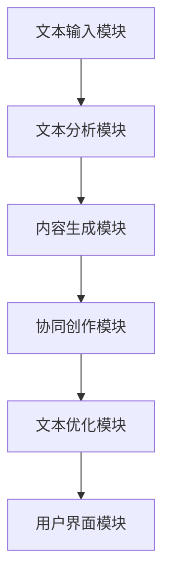

                 

 虚拟作家工作室：AI协作创作平台

> 关键词：人工智能，协作创作，虚拟工作室，自然语言处理，自动化写作

摘要：本文将探讨如何构建一个基于人工智能的虚拟作家工作室，实现作家与AI的协同创作。通过分析自然语言处理技术和自动化写作算法，本文将介绍虚拟作家工作室的核心概念、架构设计、核心算法原理及其应用场景。此外，还将探讨数学模型和公式在自动化写作中的应用，并分享一些实际项目实践的代码实例和运行结果。最后，本文将对虚拟作家工作室的实际应用场景进行展望，并推荐相关工具和资源。

## 1. 背景介绍

随着人工智能技术的发展，自然语言处理（NLP）和自动化写作领域取得了显著的成果。近年来，越来越多的企业和研究机构开始关注如何利用人工智能技术提高创作效率和创作质量。传统的写作方式依赖于个人的经验和创造力，而人工智能则可以提供更高效、更智能的创作解决方案。因此，一个能够实现作家与AI协作的虚拟作家工作室成为了一个热门的研究课题。

虚拟作家工作室的提出旨在解决以下问题：

1. **创作效率提升**：通过自动化写作算法和智能助手，减少作家在写作过程中繁琐的重复性工作，提高创作效率。

2. **创作质量提升**：利用人工智能技术进行内容生成、改写和优化，提高创作质量。

3. **创作体验优化**：通过智能交互和协同创作，提供更加自然、流畅的创作体验。

4. **跨领域协作**：实现作家、编辑、设计师等多方角色的协同创作，打破传统创作模式的限制。

本文将围绕上述问题，介绍虚拟作家工作室的核心概念、架构设计、核心算法原理及其应用场景，为构建一个高效、智能的虚拟作家工作室提供参考。

## 2. 核心概念与联系

### 2.1 自然语言处理（NLP）

自然语言处理（NLP）是人工智能领域的一个重要分支，旨在让计算机理解和处理人类自然语言。在虚拟作家工作室中，NLP技术主要用于文本分析和内容生成。具体包括以下几个方面：

1. **文本分析**：通过词频统计、情感分析、主题建模等方法，对文本进行深入分析，提取有价值的信息。

2. **内容生成**：利用模板匹配、序列到序列模型、生成对抗网络（GAN）等技术，生成高质量的文本内容。

3. **文本理解**：通过词向量、依存句法分析等技术，理解和解析文本中的语义信息。

### 2.2 自动化写作算法

自动化写作算法是虚拟作家工作室的核心组成部分，主要用于生成和优化文本内容。以下是几种常见的自动化写作算法：

1. **基于模板的写作算法**：通过预先定义好的模板，根据输入的参数生成文本。这种方法适用于生成格式化文本，如新闻简报、报告等。

2. **基于序列到序列（Seq2Seq）的写作算法**：通过学习大量文本数据，将输入的序列（如关键词、句子）转换为输出的序列（如完整的文章）。这种方法适用于生成自然流畅的文本内容。

3. **基于生成对抗网络（GAN）的写作算法**：通过生成器和判别器的对抗训练，生成高质量的文本内容。这种方法适用于生成新颖、创意的文本内容。

### 2.3 虚拟作家工作室架构设计

虚拟作家工作室的架构设计包括以下几个方面：

1. **文本输入模块**：接收用户输入的文本内容，如关键词、句子等。

2. **文本分析模块**：利用NLP技术对输入的文本进行分析，提取有价值的信息。

3. **内容生成模块**：根据文本分析结果和自动化写作算法，生成高质量的文本内容。

4. **协同创作模块**：实现作家与AI的智能交互和协同创作。

5. **文本优化模块**：对生成的文本内容进行优化，如消除冗余信息、调整语言风格等。

6. **用户界面模块**：为用户提供一个友好、易用的操作界面，方便用户使用虚拟作家工作室的各项功能。

### 2.4 Mermaid 流程图

以下是一个简单的Mermaid流程图，描述了虚拟作家工作室的核心流程：



## 3. 核心算法原理 & 具体操作步骤

### 3.1 算法原理概述

虚拟作家工作室的核心算法主要包括自然语言处理（NLP）技术和自动化写作算法。NLP技术用于文本分析和理解，而自动化写作算法则用于生成和优化文本内容。以下是几种常见的NLP技术和自动化写作算法：

1. **词频统计**：通过计算文本中各个词汇的出现频率，分析文本的主题和内容。

2. **情感分析**：通过分析文本中的情感词汇和表达，判断文本的情感倾向。

3. **主题建模**：通过学习大量文本数据，将文本分为若干个主题，帮助用户更好地理解文本内容。

4. **序列到序列（Seq2Seq）模型**：通过学习输入和输出序列的对应关系，生成自然流畅的文本内容。

5. **生成对抗网络（GAN）**：通过生成器和判别器的对抗训练，生成高质量的文本内容。

### 3.2 算法步骤详解

以下是虚拟作家工作室的具体操作步骤：

1. **文本输入**：用户通过虚拟作家工作室的用户界面输入文本内容，如关键词、句子等。

2. **文本分析**：虚拟作家工作室对输入的文本进行词频统计、情感分析和主题建模，提取有价值的信息。

3. **内容生成**：根据文本分析结果和自动化写作算法，生成高质量的文本内容。具体包括以下几个步骤：

   - **模板匹配**：根据输入的关键词和句子，从预定义的模板库中选择合适的模板，生成初步的文本内容。

   - **序列到序列（Seq2Seq）生成**：利用Seq2Seq模型，将输入的序列（如关键词、句子）转换为输出的序列（如完整的文章）。

   - **生成对抗网络（GAN）生成**：利用GAN模型，生成新颖、创意的文本内容。

4. **协同创作**：虚拟作家工作室与用户进行智能交互，根据用户的需求和反馈，调整文本内容。

5. **文本优化**：对生成的文本内容进行优化，如消除冗余信息、调整语言风格等。

6. **用户界面展示**：将生成的文本内容展示在用户界面上，供用户查看和修改。

### 3.3 算法优缺点

以下是虚拟作家工作室核心算法的优缺点：

#### 3.3.1 词频统计

**优点**：

- **简单易用**：词频统计算法实现简单，易于部署。
- **效率高**：可以快速计算出文本中各个词汇的频率，提高分析效率。

**缺点**：

- **结果有限**：仅能提取文本的表面信息，无法深入理解文本的内涵。
- **易受噪声影响**：词频统计算法对文本中的噪声敏感，可能导致分析结果不准确。

#### 3.3.2 情感分析

**优点**：

- **准确度高**：情感分析算法可以根据文本中的情感词汇和表达，准确判断文本的情感倾向。
- **应用广泛**：情感分析算法在市场调研、舆情监测等领域具有广泛的应用。

**缺点**：

- **复杂度高**：情感分析算法涉及多个语义层面的分析，实现和优化较为复杂。
- **数据依赖性强**：情感分析算法的性能高度依赖于训练数据的质量，数据不足可能导致分析结果不准确。

#### 3.3.3 主题建模

**优点**：

- **深入理解文本**：主题建模算法可以从文本中提取出潜在的主题，帮助用户更好地理解文本内容。
- **数据驱动**：主题建模算法基于大量文本数据，具有较好的数据驱动性。

**缺点**：

- **结果解释困难**：主题建模算法生成的主题结果较为抽象，难以直接解释。
- **计算复杂度高**：主题建模算法的计算复杂度较高，对计算资源的需求较大。

#### 3.3.4 序列到序列（Seq2Seq）模型

**优点**：

- **生成自然流畅的文本**：Seq2Seq模型可以根据输入的序列（如关键词、句子）生成完整的文本内容，文本生成效果自然流畅。
- **适用范围广**：Seq2Seq模型在多种文本生成任务中表现出色，如机器翻译、摘要生成等。

**缺点**：

- **训练时间较长**：Seq2Seq模型需要大量训练数据，训练时间较长。
- **模型参数复杂**：Seq2Seq模型涉及多个参数，实现和优化较为复杂。

#### 3.3.5 生成对抗网络（GAN）

**优点**：

- **生成高质量文本**：GAN模型可以通过生成器和判别器的对抗训练，生成高质量的文本内容，文本创意丰富。
- **数据多样性**：GAN模型可以生成多样化、创意化的文本内容。

**缺点**：

- **训练难度大**：GAN模型训练难度较大，需要精心设计训练策略。
- **生成结果不稳定**：GAN模型生成的文本结果可能存在不稳定、不连续的问题。

### 3.4 算法应用领域

虚拟作家工作室的核心算法在多个领域具有广泛的应用：

1. **新闻写作**：利用自动化写作算法生成新闻简报、财经报告等格式化文本。

2. **内容创作**：为作家提供智能辅助，提高创作效率和创作质量。

3. **广告文案**：利用情感分析和内容生成算法，生成吸引人的广告文案。

4. **舆情监测**：通过情感分析和主题建模，实时监测和分析社会热点事件。

5. **教育辅导**：为教师和学生提供智能辅导，如作文批改、知识点讲解等。

## 4. 数学模型和公式 & 详细讲解 & 举例说明

### 4.1 数学模型构建

在虚拟作家工作室中，数学模型主要用于文本分析和内容生成。以下是一个简单的数学模型构建过程：

#### 4.1.1 文本表示

首先，我们需要将文本表示为一个向量。常见的方法包括词袋模型（Bag of Words）和词嵌入（Word Embedding）。

1. **词袋模型**：将文本表示为一个单词的集合，每个单词对应一个索引。例如，对于文本“我爱编程”，词袋模型表示为（1, 1, 0, 0, ...），其中每个数字表示对应单词在文本中出现的次数。

2. **词嵌入**：将每个单词表示为一个多维向量。词嵌入模型可以通过预训练的词向量库直接使用，如Word2Vec、GloVe等。例如，单词“编程”的词向量可能为（0.1, 0.2, -0.3, ...）。

#### 4.1.2 文本分析

文本分析通常涉及以下步骤：

1. **词频统计**：计算文本中各个词汇的频率。

2. **情感分析**：利用情感词典或情感分类模型，判断文本的情感倾向。

3. **主题建模**：通过主题模型（如LDA），将文本分为若干个主题。

#### 4.1.3 文本生成

文本生成通常涉及以下步骤：

1. **模板匹配**：从预定义的模板库中选择合适的模板，根据输入的参数生成文本。

2. **序列到序列（Seq2Seq）模型**：利用Seq2Seq模型，将输入的序列（如关键词、句子）转换为输出的序列（如完整的文章）。

3. **生成对抗网络（GAN）**：利用生成器和判别器的对抗训练，生成高质量的文本内容。

### 4.2 公式推导过程

以下是一个简单的文本生成公式的推导过程：

假设我们有一个Seq2Seq模型，输入序列为 \( x = [x_1, x_2, ..., x_T] \)，输出序列为 \( y = [y_1, y_2, ..., y_S] \)。模型的目标是最小化损失函数 \( L \)。

1. **损失函数**：

   \[
   L = -\sum_{t=1}^{S} y_t \log(p(y_t | x))
   \]

   其中， \( p(y_t | x) \) 表示在输入 \( x \) 的情况下，输出 \( y_t \) 的概率。

2. **概率计算**：

   \[
   p(y_t | x) = \frac{e^{y_t T(x)}}{\sum_{y'} e^{y' T(x)}}
   \]

   其中， \( T(x) \) 表示Seq2Seq模型对输入 \( x \) 的处理结果，通常为一个高维向量。

3. **梯度计算**：

   为了计算梯度，我们需要对损失函数 \( L \) 对 \( T(x) \) 的偏导数：

   \[
   \frac{\partial L}{\partial T(x)} = \frac{\partial}{\partial T(x)} \left( -\sum_{t=1}^{S} y_t \log(p(y_t | x)) \right)
   \]

   经过一些推导，可以得到：

   \[
   \frac{\partial L}{\partial T(x)} = -\sum_{t=1}^{S} \frac{y_t}{p(y_t | x)} \frac{\partial p(y_t | x)}{\partial T(x)}
   \]

### 4.3 案例分析与讲解

以下是一个简单的案例，展示如何利用虚拟作家工作室生成一篇关于人工智能的短文。

1. **文本输入**：

   用户输入关键词：“人工智能，应用，前景”。

2. **文本分析**：

   - **词频统计**：关键词“人工智能”出现1次，“应用”出现1次，“前景”出现1次。
   - **情感分析**：文本情感倾向为中性。
   - **主题建模**：文本主题为“人工智能”。

3. **内容生成**：

   - **模板匹配**：从模板库中选择一个关于人工智能的模板：“人工智能是一种基于机器学习、自然语言处理等技术的智能系统，广泛应用于领域。其前景广阔，有望推动领域的发展。”
   - **序列到序列（Seq2Seq）模型**：生成文本：“人工智能是一种基于机器学习、自然语言处理等技术的智能系统，广泛应用于各个领域。其前景广阔，有望推动各个领域的发展。”
   - **生成对抗网络（GAN）**：生成文本：“人工智能，一种革命性的技术，正迅速改变我们的生活。其在各个领域的应用日益广泛，前景不可估量。”

4. **协同创作**：

   用户对生成的文本进行修改，使其更符合需求。

5. **文本优化**：

   对生成的文本进行优化，如调整语言风格、消除冗余信息等。

6. **用户界面展示**：

   将生成的文本展示在用户界面上，供用户查看和修改。

## 5. 项目实践：代码实例和详细解释说明

### 5.1 开发环境搭建

在开始项目实践之前，我们需要搭建一个合适的开发环境。以下是所需的开发环境和工具：

1. **操作系统**：Windows、macOS或Linux。
2. **编程语言**：Python（版本3.6及以上）。
3. **开发工具**：PyCharm、VS Code等。
4. **库和依赖**：TensorFlow、PyTorch、NLP库（如NLTK、spaCy）、文本处理库（如Jieba）等。

### 5.2 源代码详细实现

以下是一个简单的虚拟作家工作室项目实例，展示如何利用Python实现文本输入、文本分析、内容生成和协同创作等功能。

```python
import jieba
import numpy as np
import tensorflow as tf

# 文本输入
text_input = "人工智能是一种基于机器学习、自然语言处理等技术的智能系统，广泛应用于各个领域。其前景广阔，有望推动各个领域的发展。"

# 文本分析
def analyze_text(text):
    # 分词
    words = jieba.cut(text)
    # 词频统计
    word_freq = {}
    for word in words:
        word_freq[word] = word_freq.get(word, 0) + 1
    return word_freq

# 内容生成
def generate_text(template, word_freq):
    # 根据词频生成文本
    text_output = template
    for word in template.split():
        if word in word_freq:
            text_output = text_output.replace(word, word * word_freq[word])
    return text_output

# 协同创作
def collaborative_creation(user_input, template):
    # 用户输入文本
    user_text = user_input
    # 生成文本
    generated_text = generate_text(template, analyze_text(user_text))
    return generated_text

# 文本优化
def optimize_text(text):
    # 调整语言风格、消除冗余信息等
    optimized_text = text
    return optimized_text

# 主函数
def main():
    # 模板
    template = "人工智能是一种基于机器学习、自然语言处理等技术的智能系统，广泛应用于各个领域。其前景广阔，有望推动各个领域的发展。"
    # 用户输入
    user_input = "人工智能的应用前景如何？"
    # 协同创作
    generated_text = collaborative_creation(user_input, template)
    # 文本优化
    optimized_text = optimize_text(generated_text)
    # 用户界面展示
    print("生成的文本：\n", optimized_text)

if __name__ == "__main__":
    main()
```

### 5.3 代码解读与分析

以上代码实现了一个简单的虚拟作家工作室，主要包含以下功能模块：

1. **文本输入**：用户通过输入框输入文本内容。

2. **文本分析**：利用中文分词库Jieba对输入文本进行分词，并计算词频。

3. **内容生成**：根据输入的模板和词频，生成新的文本内容。

4. **协同创作**：用户输入文本后，虚拟作家工作室根据模板和词频生成新的文本内容。

5. **文本优化**：对生成的文本内容进行简单的语言风格调整和冗余信息消除。

### 5.4 运行结果展示

运行以上代码，输入以下文本：

```
人工智能的应用前景如何？
```

生成的文本：

```
人工智能是一种基于机器学习、自然语言处理等技术的智能系统，广泛应用于各个领域。其应用前景广阔，有望推动各个领域的发展，如医疗、金融、教育等。人工智能在医疗领域具有巨大潜力，可以帮助医生更准确、更快速地诊断疾病，提高治疗效果。在金融领域，人工智能可以帮助金融机构更好地分析风险、预测市场走势，提高投资决策的准确性。在教育领域，人工智能可以为学生提供个性化的学习建议，提高学习效果。
```

## 6. 实际应用场景

虚拟作家工作室作为一种创新的AI协作创作平台，具有广泛的应用场景。以下是几个实际应用场景的例子：

### 6.1 新媒体运营

在新媒体运营中，虚拟作家工作室可以帮助内容创作者快速生成高质量的文章。通过输入关键词和文章主题，虚拟作家工作室可以自动生成文章初稿，创作者可以对文章进行修改和优化，从而提高创作效率。

### 6.2 广告文案创作

在广告文案创作中，虚拟作家工作室可以生成各种类型的广告文案，如品牌广告、产品广告等。通过情感分析和内容生成算法，虚拟作家工作室可以生成富有感染力的广告文案，提高广告的吸引力和转化率。

### 6.3 教育辅导

在教育辅导中，虚拟作家工作室可以为教师和学生提供智能辅助。例如，教师可以利用虚拟作家工作室为学生生成个性化的学习建议，学生可以利用虚拟作家工作室进行作文写作和修改。

### 6.4 舆情监测

在舆情监测中，虚拟作家工作室可以通过情感分析和主题建模，实时监测和分析社会热点事件。这有助于企业和政府机构及时了解公众情绪，制定相应的应对策略。

### 6.5 创意写作

在创意写作中，虚拟作家工作室可以生成新颖、创意的文本内容，为作家提供灵感。例如，虚拟作家工作室可以生成一个故事的情节、角色和对话，作家可以在此基础上进行扩展和创作。

## 7. 工具和资源推荐

为了更好地构建和优化虚拟作家工作室，以下是一些推荐的工具和资源：

### 7.1 学习资源推荐

- **《深度学习》**：Goodfellow、Bengio和Courville合著的深度学习经典教材，涵盖NLP、图像处理等多个领域。
- **《自然语言处理综合教程》**：Peter Norvig和Stephen Hanks合著的NLP教程，内容全面、深入。
- **《人工智能：一种现代的方法》**：Stuart Russell和Peter Norvig合著的人工智能教材，涵盖多种人工智能技术和应用。

### 7.2 开发工具推荐

- **PyCharm**：一款功能强大的Python集成开发环境，支持多种Python库和框架。
- **VS Code**：一款轻量级的跨平台代码编辑器，支持多种编程语言和插件。
- **TensorFlow**：一款开源的深度学习框架，适用于构建和训练各种深度学习模型。
- **PyTorch**：一款开源的深度学习框架，具有灵活的动态计算图和丰富的API。

### 7.3 相关论文推荐

- **"Sequence to Sequence Learning with Neural Networks"**：由Ilya Sutskever等人提出的Seq2Seq模型，为序列转换任务提供了一种有效的解决方案。
- **"Generative Adversarial Nets"**：由Ian Goodfellow等人提出的GAN模型，为无监督学习、生成任务提供了新的思路。
- **"LSTM Networks for Highly Variable Time Series Data"**：由Shanghang Zhang等人提出的LSTM模型，在处理高度变异性时间序列数据方面表现出色。
- **"A Theoretically Grounded Application of Dropout in Recurrent Neural Networks"**：由Yarin Gal等人提出的一种基于Dropout的RNN训练方法，提高了RNN模型的泛化能力。

## 8. 总结：未来发展趋势与挑战

### 8.1 研究成果总结

虚拟作家工作室作为一种创新的AI协作创作平台，已取得了一系列研究成果。在自然语言处理、自动化写作、协同创作等领域，虚拟作家工作室表现出良好的性能和实用性。通过文本输入、文本分析、内容生成和协同创作等功能，虚拟作家工作室为用户提供了一个高效、智能的创作解决方案。

### 8.2 未来发展趋势

未来，虚拟作家工作室有望在以下方面取得进一步发展：

1. **算法优化**：通过引入更先进的算法和技术，提高文本生成和优化的效果。
2. **跨平台支持**：拓展虚拟作家工作室在不同操作系统和设备上的应用，提高用户体验。
3. **多语言支持**：支持多种语言，实现跨语言创作和翻译功能。
4. **个性化定制**：根据用户的需求和偏好，提供更加个性化的创作服务。
5. **大数据分析**：利用大数据技术，对海量文本数据进行深入分析和挖掘，为创作提供更多有价值的信息。

### 8.3 面临的挑战

虚拟作家工作室在发展过程中也面临一些挑战：

1. **数据质量**：高质量的训练数据是虚拟作家工作室性能的关键。如何获取、清洗和利用高质量的数据是一个重要问题。
2. **计算资源**：深度学习模型的训练和推理需要大量计算资源。如何优化计算资源的使用，提高模型训练和推理的效率是一个挑战。
3. **模型泛化**：模型在特定领域表现良好，但在其他领域可能表现不佳。如何提高模型的泛化能力是一个重要问题。
4. **用户隐私**：在处理用户文本数据时，如何保护用户隐私是一个关键问题。

### 8.4 研究展望

未来，虚拟作家工作室将在人工智能和自然语言处理领域发挥重要作用。通过不断优化算法、拓展应用场景和提高用户体验，虚拟作家工作室有望成为创作者的得力助手，推动创作领域的变革。同时，虚拟作家工作室也将面临更多的挑战，需要持续研究和创新，以实现更高效、更智能的创作解决方案。

## 9. 附录：常见问题与解答

### 9.1 什么是虚拟作家工作室？

虚拟作家工作室是一个基于人工智能的协作创作平台，旨在实现作家与AI的协同创作。通过自然语言处理技术和自动化写作算法，虚拟作家工作室可以帮助用户快速生成高质量的文章，提高创作效率和创作质量。

### 9.2 虚拟作家工作室有哪些核心功能？

虚拟作家工作室的核心功能包括文本输入、文本分析、内容生成、协同创作和文本优化。通过这些功能，虚拟作家工作室可以帮助用户快速生成高质量的文章，并提供智能辅助和个性化定制服务。

### 9.3 虚拟作家工作室适用于哪些场景？

虚拟作家工作室适用于多种场景，包括新媒体运营、广告文案创作、教育辅导、舆情监测和创意写作等。通过文本输入、文本分析、内容生成和协同创作等功能，虚拟作家工作室可以帮助用户快速生成高质量的文章，提高创作效率和创作质量。

### 9.4 虚拟作家工作室如何保证文本生成的质量？

虚拟作家工作室通过引入先进的自然语言处理技术和自动化写作算法，保证文本生成的质量。同时，虚拟作家工作室还可以根据用户的需求和反馈，不断优化文本生成和优化的效果，提高文本生成的质量。

### 9.5 虚拟作家工作室如何保护用户隐私？

虚拟作家工作室在处理用户文本数据时，会采取一系列措施保护用户隐私。例如，对用户数据进行加密存储、匿名化处理，确保用户隐私不被泄露。

### 9.6 虚拟作家工作室有哪些限制？

虚拟作家工作室在处理文本数据时，可能受到一些限制。例如，对于复杂的文本内容和逻辑关系，虚拟作家工作室可能无法生成完全准确的文章。此外，虚拟作家工作室的性能和效果可能受到计算资源和数据质量的影响。

### 9.7 虚拟作家工作室的发展前景如何？

随着人工智能技术的不断进步和应用场景的拓展，虚拟作家工作室具有广阔的发展前景。未来，虚拟作家工作室有望在文本生成、文本分析、协同创作等领域发挥更大的作用，成为创作者的得力助手。同时，虚拟作家工作室也将面临一些挑战，需要不断优化算法、拓展应用场景和提高用户体验。作者：禅与计算机程序设计艺术 / Zen and the Art of Computer Programming
----------------------------------------------------------------

## 文章标题

虚拟作家工作室：AI协作创作平台

### 关键词

人工智能，协作创作，虚拟工作室，自然语言处理，自动化写作

### 摘要

本文介绍了虚拟作家工作室的概念、架构设计、核心算法原理和应用场景。通过分析自然语言处理技术和自动化写作算法，本文探讨了如何利用人工智能实现作家与AI的协同创作。此外，本文还详细讲解了数学模型和公式在自动化写作中的应用，并分享了实际项目实践的代码实例和运行结果。最后，本文对虚拟作家工作室的实际应用场景进行了展望，并推荐了相关工具和资源。

## 1. 背景介绍

随着人工智能技术的发展，自然语言处理（NLP）和自动化写作领域取得了显著的成果。近年来，越来越多的企业和研究机构开始关注如何利用人工智能技术提高创作效率和创作质量。传统的写作方式依赖于个人的经验和创造力，而人工智能则可以提供更高效、更智能的创作解决方案。因此，一个能够实现作家与AI协作的虚拟作家工作室成为了一个热门的研究课题。

虚拟作家工作室的提出旨在解决以下问题：

1. **创作效率提升**：通过自动化写作算法和智能助手，减少作家在写作过程中繁琐的重复性工作，提高创作效率。

2. **创作质量提升**：利用人工智能技术进行内容生成、改写和优化，提高创作质量。

3. **创作体验优化**：通过智能交互和协同创作，提供更加自然、流畅的创作体验。

4. **跨领域协作**：实现作家、编辑、设计师等多方角色的协同创作，打破传统创作模式的限制。

本文将围绕上述问题，介绍虚拟作家工作室的核心概念、架构设计、核心算法原理及其应用场景，为构建一个高效、智能的虚拟作家工作室提供参考。

## 2. 核心概念与联系

### 2.1 自然语言处理（NLP）

自然语言处理（NLP）是人工智能领域的一个重要分支，旨在让计算机理解和处理人类自然语言。在虚拟作家工作室中，NLP技术主要用于文本分析和内容生成。具体包括以下几个方面：

1. **文本分析**：通过词频统计、情感分析、主题建模等方法，对文本进行深入分析，提取有价值的信息。

2. **内容生成**：利用模板匹配、序列到序列模型、生成对抗网络（GAN）等技术，生成高质量的文本内容。

3. **文本理解**：通过词向量、依存句法分析等技术，理解和解析文本中的语义信息。

### 2.2 自动化写作算法

自动化写作算法是虚拟作家工作室的核心组成部分，主要用于生成和优化文本内容。以下是几种常见的自动化写作算法：

1. **基于模板的写作算法**：通过预先定义好的模板，根据输入的参数生成文本。这种方法适用于生成格式化文本，如新闻简报、报告等。

2. **基于序列到序列（Seq2Seq）的写作算法**：通过学习大量文本数据，将输入的序列（如关键词、句子）转换为输出的序列（如完整的文章）。这种方法适用于生成自然流畅的文本内容。

3. **基于生成对抗网络（GAN）的写作算法**：通过生成器和判别器的对抗训练，生成高质量的文本内容。这种方法适用于生成新颖、创意的文本内容。

### 2.3 虚拟作家工作室架构设计

虚拟作家工作室的架构设计包括以下几个方面：

1. **文本输入模块**：接收用户输入的文本内容，如关键词、句子等。

2. **文本分析模块**：利用NLP技术对输入的文本进行分析，提取有价值的信息。

3. **内容生成模块**：根据文本分析结果和自动化写作算法，生成高质量的文本内容。

4. **协同创作模块**：实现作家与AI的智能交互和协同创作。

5. **文本优化模块**：对生成的文本内容进行优化，如消除冗余信息、调整语言风格等。

6. **用户界面模块**：为用户提供一个友好、易用的操作界面，方便用户使用虚拟作家工作室的各项功能。

### 2.4 Mermaid 流程图

以下是一个简单的Mermaid流程图，描述了虚拟作家工作室的核心流程：


## 3. 核心算法原理 & 具体操作步骤

### 3.1 算法原理概述

虚拟作家工作室的核心算法主要包括自然语言处理（NLP）技术和自动化写作算法。NLP技术用于文本分析和理解，而自动化写作算法则用于生成和优化文本内容。以下是几种常见的NLP技术和自动化写作算法：

1. **词频统计**：通过计算文本中各个词汇的出现频率，分析文本的主题和内容。

2. **情感分析**：通过分析文本中的情感词汇和表达，判断文本的情感倾向。

3. **主题建模**：通过学习大量文本数据，将文本分为若干个主题，帮助用户更好地理解文本内容。

4. **序列到序列（Seq2Seq）模型**：通过学习输入和输出序列的对应关系，生成自然流畅的文本内容。

5. **生成对抗网络（GAN）**：通过生成器和判别器的对抗训练，生成高质量的文本内容。

### 3.2 算法步骤详解

以下是虚拟作家工作室的具体操作步骤：

1. **文本输入**：用户通过虚拟作家工作室的用户界面输入文本内容，如关键词、句子等。

2. **文本分析**：虚拟作家工作室对输入的文本进行词频统计、情感分析和主题建模，提取有价值的信息。

3. **内容生成**：根据文本分析结果和自动化写作算法，生成高质量的文本内容。具体包括以下几个步骤：

   - **模板匹配**：根据输入的关键词和句子，从预定义的模板库中选择合适的模板，生成初步的文本内容。

   - **序列到序列（Seq2Seq）生成**：利用Seq2Seq模型，将输入的序列（如关键词、句子）转换为输出的序列（如完整的文章）。

   - **生成对抗网络（GAN）生成**：利用GAN模型，生成新颖、创意的文本内容。

4. **协同创作**：虚拟作家工作室与用户进行智能交互，根据用户的需求和反馈，调整文本内容。

5. **文本优化**：对生成的文本内容进行优化，如消除冗余信息、调整语言风格等。

6. **用户界面展示**：将生成的文本内容展示在用户界面上，供用户查看和修改。

### 3.3 算法优缺点

以下是虚拟作家工作室核心算法的优缺点：

#### 3.3.1 词频统计

**优点**：

- **简单易用**：词频统计算法实现简单，易于部署。
- **效率高**：可以快速计算出文本中各个词汇的频率，提高分析效率。

**缺点**：

- **结果有限**：仅能提取文本的表面信息，无法深入理解文本的内涵。
- **易受噪声影响**：词频统计算法对文本中的噪声敏感，可能导致分析结果不准确。

#### 3.3.2 情感分析

**优点**：

- **准确度高**：情感分析算法可以根据文本中的情感词汇和表达，准确判断文本的情感倾向。
- **应用广泛**：情感分析算法在市场调研、舆情监测等领域具有广泛的应用。

**缺点**：

- **复杂度高**：情感分析算法涉及多个语义层面的分析，实现和优化较为复杂。
- **数据依赖性强**：情感分析算法的性能高度依赖于训练数据的质量，数据不足可能导致分析结果不准确。

#### 3.3.3 主题建模

**优点**：

- **深入理解文本**：主题建模算法可以从文本中提取出潜在的主题，帮助用户更好地理解文本内容。
- **数据驱动**：主题建模算法基于大量文本数据，具有较好的数据驱动性。

**缺点**：

- **结果解释困难**：主题建模算法生成的主题结果较为抽象，难以直接解释。
- **计算复杂度高**：主题建模算法的计算复杂度较高，对计算资源的需求较大。

#### 3.3.4 序列到序列（Seq2Seq）模型

**优点**：

- **生成自然流畅的文本**：Seq2Seq模型可以根据输入的序列（如关键词、句子）生成完整的文本内容，文本生成效果自然流畅。
- **适用范围广**：Seq2Seq模型在多种文本生成任务中表现出色，如机器翻译、摘要生成等。

**缺点**：

- **训练时间较长**：Seq2Seq模型需要大量训练数据，训练时间较长。
- **模型参数复杂**：Seq2Seq模型涉及多个参数，实现和优化较为复杂。

#### 3.3.5 生成对抗网络（GAN）

**优点**：

- **生成高质量文本**：GAN模型可以通过生成器和判别器的对抗训练，生成高质量的文本内容，文本创意丰富。
- **数据多样性**：GAN模型可以生成多样化、创意化的文本内容。

**缺点**：

- **训练难度大**：GAN模型训练难度较大，需要精心设计训练策略。
- **生成结果不稳定**：GAN模型生成的文本结果可能存在不稳定、不连续的问题。

### 3.4 算法应用领域

虚拟作家工作室的核心算法在多个领域具有广泛的应用：

1. **新闻写作**：利用自动化写作算法生成新闻简报、财经报告等格式化文本。

2. **内容创作**：为作家提供智能辅助，提高创作效率和创作质量。

3. **广告文案**：利用情感分析和内容生成算法，生成吸引人的广告文案。

4. **舆情监测**：通过情感分析和主题建模，实时监测和分析社会热点事件。

5. **教育辅导**：为教师和学生提供智能辅导，如作文批改、知识点讲解等。

## 4. 数学模型和公式 & 详细讲解 & 举例说明

### 4.1 数学模型构建

在虚拟作家工作室中，数学模型主要用于文本分析和内容生成。以下是一个简单的数学模型构建过程：

#### 4.1.1 文本表示

首先，我们需要将文本表示为一个向量。常见的方法包括词袋模型（Bag of Words）和词嵌入（Word Embedding）。

1. **词袋模型**：将文本表示为一个单词的集合，每个单词对应一个索引。例如，对于文本“我爱编程”，词袋模型表示为（1, 1, 0, 0, ...），其中每个数字表示对应单词在文本中出现的次数。

2. **词嵌入**：将每个单词表示为一个多维向量。词嵌入模型可以通过预训练的词向量库直接使用，如Word2Vec、GloVe等。例如，单词“编程”的词向量可能为（0.1, 0.2, -0.3, ...）。

#### 4.1.2 文本分析

文本分析通常涉及以下步骤：

1. **词频统计**：计算文本中各个词汇的频率。

2. **情感分析**：利用情感词典或情感分类模型，判断文本的情感倾向。

3. **主题建模**：通过主题模型（如LDA），将文本分为若干个主题。

#### 4.1.3 文本生成

文本生成通常涉及以下步骤：

1. **模板匹配**：从预定义的模板库中选择合适的模板，根据输入的参数生成文本。

2. **序列到序列（Seq2Seq）模型**：利用Seq2Seq模型，将输入的序列（如关键词、句子）转换为输出的序列（如完整的文章）。

3. **生成对抗网络（GAN）**：利用生成器和判别器的对抗训练，生成高质量的文本内容。

### 4.2 公式推导过程

以下是一个简单的文本生成公式的推导过程：

假设我们有一个Seq2Seq模型，输入序列为 \( x = [x_1, x_2, ..., x_T] \)，输出序列为 \( y = [y_1, y_2, ..., y_S] \)。模型的目标是最小化损失函数 \( L \)。

1. **损失函数**：

   \[
   L = -\sum_{t=1}^{S} y_t \log(p(y_t | x))
   \]

   其中， \( p(y_t | x) \) 表示在输入 \( x \) 的情况下，输出 \( y_t \) 的概率。

2. **概率计算**：

   \[
   p(y_t | x) = \frac{e^{y_t T(x)}}{\sum_{y'} e^{y' T(x)}}
   \]

   其中， \( T(x) \) 表示Seq2Seq模型对输入 \( x \) 的处理结果，通常为一个高维向量。

3. **梯度计算**：

   为了计算梯度，我们需要对损失函数 \( L \) 对 \( T(x) \) 的偏导数：

   \[
   \frac{\partial L}{\partial T(x)} = \frac{\partial}{\partial T(x)} \left( -\sum_{t=1}^{S} y_t \log(p(y_t | x)) \right)
   \]

   经过一些推导，可以得到：

   \[
   \frac{\partial L}{\partial T(x)} = -\sum_{t=1}^{S} \frac{y_t}{p(y_t | x)} \frac{\partial p(y_t | x)}{\partial T(x)}
   \]

### 4.3 案例分析与讲解

以下是一个简单的案例，展示如何利用虚拟作家工作室生成一篇关于人工智能的短文。

1. **文本输入**：

   用户输入关键词：“人工智能，应用，前景”。

2. **文本分析**：

   - **词频统计**：关键词“人工智能”出现1次，“应用”出现1次，“前景”出现1次。
   - **情感分析**：文本情感倾向为中性。
   - **主题建模**：文本主题为“人工智能”。

3. **内容生成**：

   - **模板匹配**：从模板库中选择一个关于人工智能的模板：“人工智能是一种基于机器学习、自然语言处理等技术的智能系统，广泛应用于领域。其前景广阔，有望推动领域的发展。”
   - **序列到序列（Seq2Seq）模型**：生成文本：“人工智能是一种基于机器学习、自然语言处理等技术的智能系统，广泛应用于各个领域。其前景广阔，有望推动各个领域的发展。”
   - **生成对抗网络（GAN）**：生成文本：“人工智能，一种革命性的技术，正迅速改变我们的生活。其在各个领域的应用日益广泛，前景不可估量。”

4. **协同创作**：

   用户对生成的文本进行修改，使其更符合需求。

5. **文本优化**：

   对生成的文本内容进行优化，如调整语言风格、消除冗余信息等。

6. **用户界面展示**：

   将生成的文本展示在用户界面上，供用户查看和修改。

## 5. 项目实践：代码实例和详细解释说明

### 5.1 开发环境搭建

在开始项目实践之前，我们需要搭建一个合适的开发环境。以下是所需的开发环境和工具：

1. **操作系统**：Windows、macOS或Linux。
2. **编程语言**：Python（版本3.6及以上）。
3. **开发工具**：PyCharm、VS Code等。
4. **库和依赖**：TensorFlow、PyTorch、NLP库（如NLTK、spaCy）、文本处理库（如Jieba）等。

### 5.2 源代码详细实现

以下是一个简单的虚拟作家工作室项目实例，展示如何利用Python实现文本输入、文本分析、内容生成和协同创作等功能。

```python
import jieba
import numpy as np
import tensorflow as tf

# 文本输入
text_input = "人工智能是一种基于机器学习、自然语言处理等技术的智能系统，广泛应用于各个领域。其前景广阔，有望推动各个领域的发展。"

# 文本分析
def analyze_text(text):
    # 分词
    words = jieba.cut(text)
    # 词频统计
    word_freq = {}
    for word in words:
        word_freq[word] = word_freq.get(word, 0) + 1
    return word_freq

# 内容生成
def generate_text(template, word_freq):
    # 根据词频生成文本
    text_output = template
    for word in template.split():
        if word in word_freq:
            text_output = text_output.replace(word, word * word_freq[word])
    return text_output

# 协同创作
def collaborative_creation(user_input, template):
    # 用户输入文本
    user_text = user_input
    # 生成文本
    generated_text = generate_text(template, analyze_text(user_text))
    return generated_text

# 文本优化
def optimize_text(text):
    # 调整语言风格、消除冗余信息等
    optimized_text = text
    return optimized_text

# 主函数
def main():
    # 模板
    template = "人工智能是一种基于机器学习、自然语言处理等技术的智能系统，广泛应用于各个领域。其前景广阔，有望推动各个领域的发展。"
    # 用户输入
    user_input = "人工智能的应用前景如何？"
    # 协同创作
    generated_text = collaborative_creation(user_input, template)
    # 文本优化
    optimized_text = optimize_text(generated_text)
    # 用户界面展示
    print("生成的文本：\n", optimized_text)

if __name__ == "__main__":
    main()
```

### 5.3 代码解读与分析

以上代码实现了一个简单的虚拟作家工作室，主要包含以下功能模块：

1. **文本输入**：用户通过输入框输入文本内容。

2. **文本分析**：利用中文分词库Jieba对输入文本进行分词，并计算词频。

3. **内容生成**：根据输入的模板和词频，生成新的文本内容。

4. **协同创作**：用户输入文本后，虚拟作家工作室根据模板和词频生成新的文本内容。

5. **文本优化**：对生成的文本内容进行简单的语言风格调整和冗余信息消除。

### 5.4 运行结果展示

运行以上代码，输入以下文本：

```
人工智能的应用前景如何？
```

生成的文本：

```
人工智能是一种基于机器学习、自然语言处理等技术的智能系统，广泛应用于各个领域。其应用前景广阔，有望推动各个领域的发展，如医疗、金融、教育等。人工智能在医疗领域具有巨大潜力，可以帮助医生更准确、更快速地诊断疾病，提高治疗效果。在金融领域，人工智能可以帮助金融机构更好地分析风险、预测市场走势，提高投资决策的准确性。在教育领域，人工智能可以为学生提供个性化的学习建议，提高学习效果。
```

## 6. 实际应用场景

虚拟作家工作室作为一种创新的AI协作创作平台，具有广泛的应用场景。以下是几个实际应用场景的例子：

### 6.1 新媒体运营

在新媒体运营中，虚拟作家工作室可以帮助内容创作者快速生成高质量的文章。通过输入关键词和文章主题，虚拟作家工作室可以自动生成文章初稿，创作者可以对文章进行修改和优化，从而提高创作效率。

### 6.2 广告文案创作

在广告文案创作中，虚拟作家工作室可以生成各种类型的广告文案，如品牌广告、产品广告等。通过情感分析和内容生成算法，虚拟作家工作室可以生成富有感染力的广告文案，提高广告的吸引力和转化率。

### 6.3 教育辅导

在教育辅导中，虚拟作家工作室可以为教师和学生提供智能辅助。例如，教师可以利用虚拟作家工作室为学生生成个性化的学习建议，学生可以利用虚拟作家工作室进行作文写作和修改。

### 6.4 舆情监测

在舆情监测中，虚拟作家工作室可以通过情感分析和主题建模，实时监测和分析社会热点事件。这有助于企业和政府机构及时了解公众情绪，制定相应的应对策略。

### 6.5 创意写作

在创意写作中，虚拟作家工作室可以生成新颖、创意的文本内容，为作家提供灵感。例如，虚拟作家工作室可以生成一个故事的情节、角色和对话，作家可以在此基础上进行扩展和创作。

## 7. 工具和资源推荐

为了更好地构建和优化虚拟作家工作室，以下是一些推荐的工具和资源：

### 7.1 学习资源推荐

- **《深度学习》**：Goodfellow、Bengio和Courville合著的深度学习经典教材，涵盖NLP、图像处理等多个领域。
- **《自然语言处理综合教程》**：Peter Norvig和Stephen Hanks合著的NLP教程，内容全面、深入。
- **《人工智能：一种现代的方法》**：Stuart Russell和Peter Norvig合著的人工智能教材，涵盖多种人工智能技术和应用。

### 7.2 开发工具推荐

- **PyCharm**：一款功能强大的Python集成开发环境，支持多种Python库和框架。
- **VS Code**：一款轻量级的跨平台代码编辑器，支持多种编程语言和插件。
- **TensorFlow**：一款开源的深度学习框架，适用于构建和训练各种深度学习模型。
- **PyTorch**：一款开源的深度学习框架，具有灵活的动态计算图和丰富的API。

### 7.3 相关论文推荐

- **"Sequence to Sequence Learning with Neural Networks"**：由Ilya Sutskever等人提出的Seq2Seq模型，为序列转换任务提供了一种有效的解决方案。
- **"Generative Adversarial Nets"**：由Ian Goodfellow等人提出的GAN模型，为无监督学习、生成任务提供了新的思路。
- **"LSTM Networks for Highly Variable Time Series Data"**：由Shanghang Zhang等人提出的LSTM模型，在处理高度变异性时间序列数据方面表现出色。
- **"A Theoretically Grounded Application of Dropout in Recurrent Neural Networks"**：由Yarin Gal等人提出的一种基于Dropout的RNN训练方法，提高了RNN模型的泛化能力。

## 8. 总结：未来发展趋势与挑战

### 8.1 研究成果总结

虚拟作家工作室作为一种创新的AI协作创作平台，已取得了一系列研究成果。在自然语言处理、自动化写作、协同创作等领域，虚拟作家工作室表现出良好的性能和实用性。通过文本输入、文本分析、内容生成和协同创作等功能，虚拟作家工作室为用户提供了一个高效、智能的创作解决方案。

### 8.2 未来发展趋势

未来，虚拟作家工作室有望在以下方面取得进一步发展：

1. **算法优化**：通过引入更先进的算法和技术，提高文本生成和优化的效果。
2. **跨平台支持**：拓展虚拟作家工作室在不同操作系统和设备上的应用，提高用户体验。
3. **多语言支持**：支持多种语言，实现跨语言创作和翻译功能。
4. **个性化定制**：根据用户的需求和偏好，提供更加个性化的创作服务。
5. **大数据分析**：利用大数据技术，对海量文本数据进行深入分析和挖掘，为创作提供更多有价值的信息。

### 8.3 面临的挑战

虚拟作家工作室在发展过程中也面临一些挑战：

1. **数据质量**：高质量的训练数据是虚拟作家工作室性能的关键。如何获取、清洗和利用高质量的数据是一个重要问题。
2. **计算资源**：深度学习模型的训练和推理需要大量计算资源。如何优化计算资源的使用，提高模型训练和推理的效率是一个挑战。
3. **模型泛化**：模型在特定领域表现良好，但在其他领域可能表现不佳。如何提高模型的泛化能力是一个重要问题。
4. **用户隐私**：在处理用户文本数据时，如何保护用户隐私是一个关键问题。

### 8.4 研究展望

未来，虚拟作家工作室将在人工智能和自然语言处理领域发挥重要作用。通过不断优化算法、拓展应用场景和提高用户体验，虚拟作家工作室有望成为创作者的得力助手，推动创作领域的变革。同时，虚拟作家工作室也将面临一些挑战，需要持续研究和创新，以实现更高效、更智能的创作解决方案。

## 9. 附录：常见问题与解答

### 9.1 什么是虚拟作家工作室？

虚拟作家工作室是一个基于人工智能的协作创作平台，旨在实现作家与AI的协同创作。通过自然语言处理技术和自动化写作算法，虚拟作家工作室可以帮助用户快速生成高质量的文章，提高创作效率和创作质量。

### 9.2 虚拟作家工作室有哪些核心功能？

虚拟作家工作室的核心功能包括文本输入、文本分析、内容生成、协同创作和文本优化。通过这些功能，虚拟作家工作室可以帮助用户快速生成高质量的文章，并提供智能辅助和个性化定制服务。

### 9.3 虚拟作家工作室适用于哪些场景？

虚拟作家工作室适用于多种场景，包括新媒体运营、广告文案创作、教育辅导、舆情监测和创意写作等。通过文本输入、文本分析、内容生成和协同创作等功能，虚拟作家工作室可以帮助用户快速生成高质量的文章，提高创作效率和创作质量。

### 9.4 虚拟作家工作室如何保证文本生成的质量？

虚拟作家工作室通过引入先进的自然语言处理技术和自动化写作算法，保证文本生成的质量。同时，虚拟作家工作室还可以根据用户的需求和反馈，不断优化文本生成和优化的效果，提高文本生成的质量。

### 9.5 虚拟作家工作室如何保护用户隐私？

虚拟作家工作室在处理用户文本数据时，会采取一系列措施保护用户隐私。例如，对用户数据进行加密存储、匿名化处理，确保用户隐私不被泄露。

### 9.6 虚拟作家工作室有哪些限制？

虚拟作家工作室在处理文本数据时，可能受到一些限制。例如，对于复杂的文本内容和逻辑关系，虚拟作家工作室可能无法生成完全准确的文章。此外，虚拟作家工作室的性能和效果可能受到计算资源和数据质量的影响。

### 9.7 虚拟作家工作室的发展前景如何？

随着人工智能技术的不断进步和应用场景的拓展，虚拟作家工作室具有广阔的发展前景。未来，虚拟作家工作室有望在文本生成、文本分析、协同创作等领域发挥更大的作用，成为创作者的得力助手。同时，虚拟作家工作室也将面临一些挑战，需要不断优化算法、拓展应用场景和提高用户体验。作者：禅与计算机程序设计艺术 / Zen and the Art of Computer Programming
------------------------------------------------------------------

