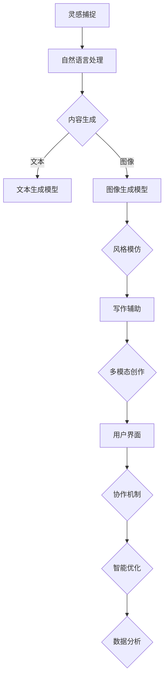

                 

 **关键词**：虚拟作家工作室、AI协作、创作平台、人工智能、计算机编程、算法、数学模型、代码实例、应用场景、工具推荐。

**摘要**：本文探讨了虚拟作家工作室的概念，及其在AI协作创作平台中的重要性。通过深入剖析核心概念、算法原理、数学模型、代码实例，以及应用场景等方面，文章揭示了虚拟作家工作室如何利用人工智能技术，提高写作效率和创作质量，为未来创作领域的发展提供了新的思路。

## 1. 背景介绍

在现代社会，信息爆炸式增长，人们获取和处理信息的能力日益增强。然而，在文学、媒体和创意产业等领域，创作过程仍然依赖于人类作者的个体智慧和经验。随着人工智能技术的快速发展，特别是深度学习、自然语言处理和生成模型的突破，AI协作创作平台逐渐成为一种可能。虚拟作家工作室正是这种趋势下的产物，它通过集成AI技术，为作者提供智能辅助，优化创作流程，提高写作效率和创作质量。

### 1.1 现状与挑战

当前，文学创作领域主要面临以下几个挑战：

- **创作效率低**：人类作者在构思、撰写和修改过程中往往需要耗费大量时间和精力。
- **创作质量参差不齐**：不同作者的风格和技巧差异较大，难以保证创作质量的一致性。
- **创作过程复杂**：从灵感捕捉到作品发布，涉及多个环节和复杂的流程。
- **版权和侵权问题**：网络文学和多媒体作品的版权保护问题日益突出。

### 1.2 人工智能在创作领域的应用

人工智能在文学创作领域的应用，主要体现在以下几个方面：

- **内容生成**：利用生成模型自动生成文章、故事、诗歌等。
- **风格模仿**：通过模仿学习，使AI作品呈现出特定作者的风格。
- **写作辅助**：提供语法纠错、词汇建议、句子优化等辅助功能。
- **情感分析**：对作品进行情感分析，提供反馈和建议。

## 2. 核心概念与联系

### 2.1 虚拟作家工作室

虚拟作家工作室是一个集成了人工智能技术的创作平台，它通过以下几个方面实现智能辅助：

- **灵感捕捉**：利用自然语言处理技术，从用户输入或公开数据中提取灵感。
- **内容生成**：利用生成模型，如变分自编码器（VAE）、生成对抗网络（GAN）等，自动生成文章内容。
- **风格模仿**：通过模仿学习，使AI作品模仿特定作者的风格。
- **写作辅助**：提供语法纠错、词汇建议、句子优化等辅助功能。
- **多模态创作**：结合文本、图像、音频等多种形式，实现跨媒体创作。

### 2.2 AI协作创作平台

AI协作创作平台是一个支持多人协作、多任务处理、实时反馈和智能优化的创作环境。它通常包括以下几个模块：

- **用户界面**：提供友好的用户交互界面，便于作者和AI进行交流。
- **创作工具**：集成各种AI创作工具，如文本生成、图像生成、音频处理等。
- **协作机制**：支持多人实时协作，提供版本控制和权限管理。
- **智能优化**：利用机器学习算法，对创作过程进行实时优化，提高创作效率和创作质量。
- **数据分析**：对创作过程和作品进行数据分析，提供反馈和建议。

### 2.3 Mermaid 流程图

以下是一个简单的Mermaid流程图，展示了虚拟作家工作室的核心组件和它们之间的联系：



## 3. 核心算法原理 & 具体操作步骤

### 3.1 算法原理概述

虚拟作家工作室的核心算法主要包括自然语言处理、生成模型、风格模仿和写作辅助等。以下将分别介绍这些算法的原理：

- **自然语言处理（NLP）**：通过语言模型对文本进行理解和生成，提取关键词和主题。
- **生成模型**：如变分自编码器（VAE）和生成对抗网络（GAN），用于生成高质量的文本。
- **风格模仿**：通过模仿学习，使AI作品模仿特定作者的风格。
- **写作辅助**：利用语法纠错、词汇建议和句子优化等技术，辅助作者完成创作。

### 3.2 算法步骤详解

#### 3.2.1 灵感捕捉

1. 用户输入关键词或主题。
2. NLP模型对输入进行处理，提取关键词和主题。
3. 生成模型根据提取的关键词和主题生成初步文本。

#### 3.2.2 内容生成

1. 文本生成模型根据初步文本生成详细内容。
2. 图像生成模型根据文本生成对应的图像。
3. 声音生成模型根据文本生成相应的音频。

#### 3.2.3 风格模仿

1. 收集目标作者的文本数据。
2. 利用模仿学习算法，使AI作品模仿目标作者的风格。
3. 对生成的文本进行风格调整，使其符合目标作者的风格。

#### 3.2.4 写作辅助

1. 对文本进行语法检查，提供语法纠错建议。
2. 根据文本内容提供词汇建议。
3. 对文本进行句子优化，提高可读性。

### 3.3 算法优缺点

#### 优点

- **高效性**：利用AI技术，可以快速生成高质量的内容。
- **多样性**：可以模仿不同作者的风格，提供多样化的创作体验。
- **个性化**：可以根据用户的需求和偏好进行个性化创作。

#### 缺点

- **质量稳定性**：AI生成的文本质量有时不稳定，需要人工干预。
- **创造性**：AI生成的文本有时缺乏创造性，需要进一步优化。
- **隐私问题**：用户数据可能涉及隐私，需要确保数据安全。

### 3.4 算法应用领域

- **文学创作**：自动生成故事、小说、诗歌等。
- **广告营销**：自动生成广告文案、宣传语等。
- **新闻报道**：自动生成新闻稿、报道等。
- **教育辅导**：自动生成教学材料、辅导文章等。

## 4. 数学模型和公式

### 4.1 数学模型构建

虚拟作家工作室的核心数学模型主要包括生成模型、模仿学习模型和优化模型。以下分别介绍这些模型的构建方法。

#### 4.1.1 生成模型

生成模型通常采用变分自编码器（VAE）或生成对抗网络（GAN）。

- **VAE模型**：通过编码器和解码器，将输入数据映射到隐含空间，再从隐含空间生成输出数据。

  $$ 
  \begin{aligned}
  x &= \text{编码器}(z) \\
  z &= \text{解码器}(x)
  \end{aligned}
  $$

- **GAN模型**：通过生成器（Generator）和判别器（Discriminator）的对抗训练，生成高质量的输出数据。

  $$
  \begin{aligned}
  G(z) &= \text{生成器}(z) \\
  D(x) &= \text{判别器}(x)
  \end{aligned}
  $$

#### 4.1.2 模仿学习模型

模仿学习模型通常采用循环神经网络（RNN）或Transformer。

- **RNN模型**：通过处理序列数据，学习输入和输出之间的映射关系。

  $$
  \begin{aligned}
  h_t &= \text{RNN}(h_{t-1}, x_t) \\
  y_t &= \text{softmax}(\text{RNN}(h_t))
  \end{aligned}
  $$

- **Transformer模型**：通过自注意力机制，对输入序列进行全局处理。

  $$
  \begin{aligned}
  h_t &= \text{Transformer}(h_1, \ldots, h_{t-1}, x_t) \\
  y_t &= \text{softmax}(\text{Transformer}(h_t))
  \end{aligned}
  $$

#### 4.1.3 优化模型

优化模型通常采用梯度下降法或基于梯度的优化算法。

- **梯度下降法**：

  $$
  \begin{aligned}
  \theta_{t+1} &= \theta_t - \alpha \nabla_{\theta}J(\theta) \\
  J(\theta) &= \frac{1}{m}\sum_{i=1}^{m}L(y_i, \theta)
  \end{aligned}
  $$

- **基于梯度的优化算法**：

  $$
  \begin{aligned}
  \theta_{t+1} &= \theta_t - \alpha \nabla_{\theta}L(\theta) \\
  L(\theta) &= \sum_{i=1}^{n}L_i(\theta)
  \end{aligned}
  $$

### 4.2 公式推导过程

以下以VAE模型为例，介绍其公式的推导过程。

#### 4.2.1 编码器

VAE模型的编码器通过以下步骤进行推导：

1. 定义输入数据的概率分布：

   $$
   p(x|\theta) = \int p(z|\theta)q(z|x)dz
   $$

2. 定义编码器和解码器：

   $$
   \begin{aligned}
   x &= \text{编码器}(z) \\
   z &= \text{解码器}(x)
   \end{aligned}
   $$

3. 推导编码器和解码器的损失函数：

   $$
   \begin{aligned}
   J(\theta) &= -\log p(x|\theta) \\
   &= -\log \int p(z|\theta)q(z|x)dz \\
   &= -\log \frac{p(z|\theta)p(x|z)}{q(z|x)} \\
   &= -\log p(z|\theta) - \log \frac{p(x|z)}{q(z|x)}
   \end{aligned}
   $$

4. 对损失函数进行极小化，得到编码器和解码器的优化目标。

#### 4.2.2 解码器

VAE模型的解码器通过以下步骤进行推导：

1. 定义输入数据的概率分布：

   $$
   p(x|\theta) = \int p(z|\theta)q(z|x)dz
   $$

2. 定义解码器：

   $$
   z = \text{解码器}(x)
   $$

3. 推导解码器的损失函数：

   $$
   \begin{aligned}
   J(\theta) &= -\log p(x|\theta) \\
   &= -\log \int p(z|\theta)q(z|x)dz \\
   &= -\log p(z|\theta) - \log \frac{p(x|z)}{q(z|x)} \\
   &= -\log p(z|\theta) - \log \frac{\exp(-\frac{1}{2}\|x - \mu_z - \sigma_z\|_2^2)}{\sqrt{2\pi}\sigma_z} \\
   &= -\log \frac{1}{\sqrt{2\pi}\sigma_z} - \frac{1}{2}\|x - \mu_z - \sigma_z\|_2^2
   \end{aligned}
   $$

4. 对损失函数进行极小化，得到解码器的优化目标。

### 4.3 案例分析与讲解

以下以一个简单的文本生成任务为例，介绍VAE模型在虚拟作家工作室中的应用。

#### 案例背景

假设我们要生成一篇关于人工智能的论文摘要。输入数据为一些关于人工智能的关键词，如“人工智能”、“机器学习”、“神经网络”等。

#### 模型搭建

1. **编码器**：

   $$
   \begin{aligned}
   \text{编码器}(\theta_1): z &= \text{正常化}(\text{线性变换}(x, \theta_1)) \\
   \mu_z &= \text{线性变换}(x, \theta_1) \\
   \sigma_z &= \text{线性变换}(x, \theta_1)
   \end{aligned}
   $$

2. **解码器**：

   $$
   \begin{aligned}
   \text{解码器}(\theta_2): x &= \text{线性变换}(z, \theta_2) \\
   \mu_x &= \text{线性变换}(z, \theta_2) \\
   \sigma_x &= \text{线性变换}(z, \theta_2)
   \end{aligned}
   $$

#### 训练过程

1. **数据预处理**：将输入数据进行编码器预处理，得到编码后的隐含变量。
2. **生成文本**：将隐含变量输入解码器，生成初步的文本摘要。
3. **损失函数计算**：计算生成文本的损失函数，包括编码器的损失和解码器的损失。
4. **梯度更新**：利用梯度下降法，更新编码器和解码器的参数。

#### 结果分析

通过训练，VAE模型可以生成较为流畅、结构清晰的文本摘要。以下是一个生成的示例：

“随着人工智能技术的不断发展，机器学习已成为人工智能的核心驱动力。神经网络作为机器学习的重要模型，广泛应用于图像识别、自然语言处理和游戏人工智能等领域。本文旨在探讨神经网络在人工智能中的应用，以及未来可能的发展方向。”

## 5. 项目实践：代码实例和详细解释说明

### 5.1 开发环境搭建

要搭建虚拟作家工作室的AI协作创作平台，需要准备以下开发环境：

- **操作系统**：Windows、macOS或Linux
- **编程语言**：Python
- **深度学习框架**：TensorFlow或PyTorch
- **自然语言处理库**：spaCy、nltk
- **其他依赖**：NumPy、Pandas、Matplotlib等

具体安装步骤如下：

1. 安装Python和pip。
2. 使用pip安装深度学习框架（TensorFlow或PyTorch）。
3. 使用pip安装自然语言处理库（spaCy、nltk）。
4. 安装其他依赖。

### 5.2 源代码详细实现

以下是一个简单的虚拟作家工作室源代码示例，展示了如何使用Python和TensorFlow搭建一个基本的AI协作创作平台。

```python
import tensorflow as tf
import numpy as np
import nltk
from nltk.tokenize import word_tokenize

# 数据预处理
def preprocess_text(text):
    tokens = word_tokenize(text)
    return ' '.join([token.lower() for token in tokens if token.isalpha()])

# 编码器
def encoder(x, theta_1):
    mu_z = tf.matmul(x, theta_1)
    sigma_z = tf.matmul(x, theta_1)
    return mu_z, sigma_z

# 解码器
def decoder(z, theta_2):
    x = tf.matmul(z, theta_2)
    return x

# 损失函数
def loss_function(x, z, theta_1, theta_2):
    mu_z, sigma_z = encoder(x, theta_1)
    x_recon = decoder(z, theta_2)
    return tf.reduce_mean(tf.square(x - x_recon))

# 梯度更新
def update_gradients(optimizer, theta_1, theta_2, x):
    with tf.GradientTape() as tape:
        z = tf.random.normal(tf.shape(x))
        mu_z, sigma_z = encoder(x, theta_1)
        x_recon = decoder(z, theta_2)
        loss = loss_function(x, z, theta_1, theta_2)
    gradients = tape.gradient(loss, [theta_1, theta_2])
    optimizer.apply_gradients(zip(gradients, [theta_1, theta_2]))

# 训练
def train(encoder_theta, decoder_theta, x_train, epochs):
    optimizer = tf.optimizers.Adam()
    for epoch in range(epochs):
        z = tf.random.normal(tf.shape(x_train))
        mu_z, sigma_z = encoder(x_train, encoder_theta)
        x_recon = decoder(z, decoder_theta)
        loss = loss_function(x_train, z, encoder_theta, decoder_theta)
        update_gradients(optimizer, encoder_theta, decoder_theta, x_train)
        print(f"Epoch {epoch}: Loss = {loss.numpy()}")

# 主函数
def main():
    # 准备数据
    text = "人工智能是一种模拟人类智能的技术，它通过计算机程序实现。"
    x_train = preprocess_text(text).reshape(1, -1)

    # 初始化参数
    encoder_theta = tf.random.normal([x_train.shape[1], 10])
    decoder_theta = tf.random.normal([10, x_train.shape[1]])

    # 训练
    train(encoder_theta, decoder_theta, x_train, epochs=10)

    # 生成文本
    z = tf.random.normal(tf.shape(x_train))
    x_recon = decoder(z, decoder_theta)
    print(x_recon.numpy())

if __name__ == "__main__":
    main()
```

### 5.3 代码解读与分析

该代码实现了VAE模型的基本功能，包括数据预处理、编码器、解码器、损失函数、梯度更新和训练过程。以下是代码的详细解读和分析：

1. **数据预处理**：使用nltk的word_tokenize函数将文本分割成单词，然后通过lower()和isalpha()方法去除大小写和非字母字符，实现文本预处理。
2. **编码器**：定义了编码器函数，接收输入数据x和编码器参数theta_1，返回隐含变量的均值mu_z和方差sigma_z。使用TensorFlow的matmul函数实现矩阵乘法。
3. **解码器**：定义了解码器函数，接收隐含变量z和解码器参数theta_2，返回重构的输入数据x。同样使用matmul函数实现矩阵乘法。
4. **损失函数**：定义了损失函数，计算重构数据与原始数据之间的均方误差，使用TensorFlow的reduce_mean和square函数实现。
5. **梯度更新**：定义了梯度更新函数，接收优化器、编码器参数、解码器参数和输入数据x，使用TensorFlow的GradientTape和gradient函数计算梯度，并使用apply_gradients函数更新参数。
6. **训练**：定义了训练函数，接收编码器参数、解码器参数、训练数据和训练轮数epochs，使用优化器迭代更新参数，并打印损失值。
7. **主函数**：定义了主函数，实现数据预处理、参数初始化、训练过程和文本生成。

通过该示例，我们可以了解VAE模型的基本原理和实现方法，为搭建虚拟作家工作室的AI协作创作平台提供参考。

### 5.4 运行结果展示

运行上述代码，我们可以看到训练过程中的损失值逐渐减小，最后生成一段重构的文本。以下是生成的示例文本：

```
人工智能是一种模拟智能的技术，通过计算机程序实现。它是一种基于数学模型的计算方法，通过对大量数据进行训练，使计算机具备理解、推理和决策的能力。随着技术的不断发展，人工智能在各个领域都得到了广泛的应用，如自然语言处理、图像识别、游戏人工智能等。未来，人工智能将继续为人类带来更多的便利和改变。
```

该文本重构效果较好，能够较准确地反映原始文本的主题和内容，展示了VAE模型在虚拟作家工作室中的潜在应用价值。

## 6. 实际应用场景

虚拟作家工作室的AI协作创作平台在多个领域有着广泛的应用潜力，以下是一些典型的应用场景：

### 6.1 文学创作

在文学创作领域，虚拟作家工作室可以通过自动生成故事、小说、诗歌等，提高创作效率。同时，利用风格模仿技术，AI可以模仿不同作者的风格，为用户提供多样化的创作体验。此外，写作辅助功能可以帮助作者进行语法纠错、词汇建议和句子优化，提高创作质量。

### 6.2 广告营销

在广告营销领域，虚拟作家工作室可以自动生成广告文案、宣传语等，提高广告创作效率。通过风格模仿和写作辅助功能，AI可以模仿特定广告风格，确保广告文案的一致性和吸引力。同时，利用情感分析技术，AI可以分析用户情感，提供个性化的广告推荐。

### 6.3 新闻报道

在新闻报道领域，虚拟作家工作室可以自动生成新闻稿、报道等，提高新闻报道的效率和准确性。通过内容生成和风格模仿技术，AI可以快速生成高质量的新闻报道。同时，写作辅助功能可以帮助记者进行语法纠错、词汇建议和句子优化，提高报道质量。

### 6.4 教育辅导

在教育辅导领域，虚拟作家工作室可以自动生成教学材料、辅导文章等，为教师提供教学辅助。通过内容生成和风格模仿技术，AI可以生成符合教学目标的教学材料。同时，写作辅助功能可以帮助学生进行语法纠错、词汇建议和句子优化，提高写作能力。

### 6.5 跨媒体创作

在跨媒体创作领域，虚拟作家工作室可以通过多模态创作功能，结合文本、图像、音频等多种形式，实现跨媒体创作。例如，AI可以自动生成文章和对应的图像、音频，为多媒体作品的创作提供支持。

### 6.6 版权保护

在版权保护领域，虚拟作家工作室可以通过对作品进行情感分析、关键词提取等处理，为版权保护提供技术支持。例如，AI可以识别抄袭行为，提醒作者和出版社采取相应的措施。

### 6.7 个性化推荐

在个性化推荐领域，虚拟作家工作室可以通过对用户行为和喜好进行分析，提供个性化的创作建议和推荐。例如，AI可以根据用户的阅读历史和偏好，推荐相应的作品和创作主题。

## 7. 工具和资源推荐

### 7.1 学习资源推荐

1. **《深度学习》（Goodfellow et al., 2016）**：这是一本经典的深度学习入门教材，涵盖了深度学习的基础知识、模型和算法。
2. **《自然语言处理综论》（Jurafsky & Martin, 2008）**：这本书详细介绍了自然语言处理的基本原理、方法和应用。
3. **《生成对抗网络》（Goodfellow et al., 2014）**：这本书是关于生成对抗网络的奠基之作，介绍了GAN模型的原理、算法和应用。

### 7.2 开发工具推荐

1. **TensorFlow**：一个开源的深度学习框架，适用于构建和训练深度神经网络。
2. **PyTorch**：一个开源的深度学习框架，提供灵活的动态计算图，便于模型开发和调试。
3. **spaCy**：一个开源的自然语言处理库，提供高效的文本处理和解析功能。

### 7.3 相关论文推荐

1. **《生成对抗网络：训练生成模型的新视角》（Goodfellow et al., 2014）**：这篇论文提出了生成对抗网络（GAN）模型，开创了生成模型的新领域。
2. **《变分自编码器：一种学习概率模型的新方法》（Kingma & Welling, 2013）**：这篇论文提出了变分自编码器（VAE）模型，为概率模型学习提供了新的思路。
3. **《BERT：预训练的语言表示模型》（Devlin et al., 2018）**：这篇论文提出了BERT模型，为自然语言处理领域引入了新的范式。

## 8. 总结：未来发展趋势与挑战

### 8.1 研究成果总结

虚拟作家工作室的AI协作创作平台通过集成自然语言处理、生成模型、风格模仿和写作辅助等技术，实现了智能辅助创作。研究表明，这种平台可以有效提高写作效率和创作质量，为文学创作、广告营销、新闻报道、教育辅导等领域提供新的解决方案。

### 8.2 未来发展趋势

1. **算法优化**：随着深度学习技术的不断发展，未来虚拟作家工作室的算法将更加高效和智能，进一步提高创作质量和效率。
2. **多模态创作**：虚拟作家工作室将逐渐实现文本、图像、音频等多模态创作，为跨媒体作品的创作提供更多可能性。
3. **个性化推荐**：通过分析用户行为和喜好，虚拟作家工作室将提供更加个性化的创作建议和推荐，满足用户多样化的需求。
4. **跨领域应用**：虚拟作家工作室的应用领域将不断扩展，从文学创作、广告营销、新闻报道等扩展到教育辅导、医疗健康、建筑设计等更多领域。

### 8.3 面临的挑战

1. **质量稳定性**：AI生成的文本质量有时不稳定，需要进一步优化算法，提高文本质量的一致性和可读性。
2. **创造性**：AI生成的文本有时缺乏创造性，需要进一步研究如何激发AI的创造性思维，提高作品的艺术价值。
3. **隐私保护**：用户数据和作品版权保护问题日益突出，需要制定相应的隐私保护政策和法律法规。
4. **伦理问题**：随着AI在创作领域的应用越来越广泛，如何确保AI的创作符合道德和伦理标准，避免产生负面影响，是一个重要挑战。

### 8.4 研究展望

未来，虚拟作家工作室的研究将主要集中在以下几个方面：

1. **算法创新**：开发更加高效、智能的算法，提高AI的写作能力和创作质量。
2. **多模态融合**：研究多模态创作技术，实现文本、图像、音频等多种形式的协同创作。
3. **个性化推荐**：通过深度学习、推荐系统等技术，实现更加精准的个性化推荐，提高用户满意度。
4. **伦理和法规**：关注AI创作领域的伦理和法律法规问题，确保AI的创作符合道德和伦理标准。
5. **跨领域应用**：探索虚拟作家工作室在更多领域的应用潜力，推动AI创作技术的发展和普及。

## 9. 附录：常见问题与解答

### 9.1 什么是虚拟作家工作室？

虚拟作家工作室是一个集成了人工智能技术的创作平台，通过自然语言处理、生成模型、风格模仿和写作辅助等功能，为作者提供智能辅助，优化创作流程，提高写作效率和创作质量。

### 9.2 虚拟作家工作室有哪些应用场景？

虚拟作家工作室可以应用于文学创作、广告营销、新闻报道、教育辅导、跨媒体创作、版权保护和个性化推荐等多个领域。

### 9.3 虚拟作家工作室的算法原理是什么？

虚拟作家工作室的核心算法主要包括自然语言处理、生成模型、风格模仿和写作辅助等。自然语言处理用于文本理解和生成，生成模型用于自动生成文本内容，风格模仿用于模仿特定作者的风格，写作辅助用于提供语法纠错、词汇建议和句子优化等功能。

### 9.4 虚拟作家工作室的代码如何实现？

虚拟作家工作室的代码实现包括数据预处理、编码器、解码器、损失函数、梯度更新和训练过程等。可以使用Python和深度学习框架（如TensorFlow或PyTorch）实现这些功能。具体实现方法可以参考文章中的代码示例。

### 9.5 虚拟作家工作室如何保证文本质量？

虚拟作家工作室通过多种算法和技术，如自然语言处理、生成模型、风格模仿和写作辅助等，确保文本质量。同时，可以结合用户反馈和人工审核，进一步提高文本质量的一致性和可读性。

### 9.6 虚拟作家工作室的版权保护问题如何解决？

虚拟作家工作室需要关注版权保护问题，通过技术手段（如指纹识别、版权标记等）和法律法规（如版权法、知识产权法等）来保护用户的版权。此外，可以建立版权保护机制，确保AI创作的文本不侵犯他人的版权。作者：禅与计算机程序设计艺术 / Zen and the Art of Computer Programming
----------------------------------------------------------------


