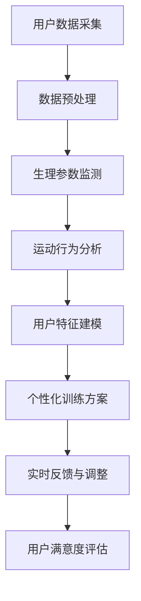

                 

关键词：虚拟健身教练、AI、个人训练、创业、智能算法、运动科学、个性化训练方案

> 摘要：本文将探讨如何在当今数字化时代中，通过AI技术开创虚拟健身教练创业项目。我们将深入分析AI驱动的个人训练机制，探讨其背后的核心算法原理、数学模型构建及其在实际应用中的挑战与机遇。

## 1. 背景介绍

随着科技的发展和健康意识的提升，健身行业迎来了前所未有的变革。传统健身房已无法满足消费者对个性化和便捷性的需求。在这个背景下，虚拟健身教练应运而生，通过人工智能技术，为用户提供个性化的训练方案和实时指导。虚拟健身教练创业项目不仅能够降低运营成本，还能够突破地理和时间的限制，实现全球范围内的服务。

## 2. 核心概念与联系

### 2.1 AI驱动的个人训练机制

AI驱动的个人训练机制是虚拟健身教练项目的核心。它涉及多个技术领域的交叉融合，包括运动科学、机器学习和计算机视觉。以下是该机制的 Mermaid 流程图：



### 2.2 核心算法原理

AI驱动的个人训练机制依赖于多种算法，包括机器学习模型、深度学习和强化学习。以下是一个简单的算法流程：

1. **用户数据采集**：通过传感器和智能设备，收集用户的生理参数、运动行为等信息。
2. **数据预处理**：对采集到的数据进行清洗、去噪和标准化处理。
3. **运动行为分析**：利用计算机视觉技术对用户的运动行为进行分析，识别动作模式。
4. **用户特征建模**：基于用户数据和运动行为分析结果，构建用户的个性化特征模型。
5. **个性化训练方案**：根据用户特征模型，设计个性化的训练方案。
6. **实时反馈与调整**：在训练过程中，根据用户的反馈和行为变化，动态调整训练方案。
7. **用户满意度评估**：通过用户反馈和训练效果，评估虚拟健身教练的服务质量。

## 3. 核心算法原理 & 具体操作步骤

### 3.1 算法原理概述

AI驱动的个人训练机制的核心在于通过算法对用户数据进行处理和分析，从而实现个性化训练。这一过程涉及以下几个步骤：

1. **数据采集与预处理**：数据采集是整个算法的基础。通过传感器和智能设备，可以收集到用户的生理参数、运动行为、心率、血压等数据。数据预处理包括数据清洗、去噪和标准化处理，以确保数据的质量和一致性。

2. **运动行为分析**：运动行为分析是利用计算机视觉技术对用户运动行为进行实时监测和分析。通过识别用户的动作模式，可以了解用户的运动水平和健康状况。

3. **用户特征建模**：用户特征建模是将用户的生理参数、运动行为等信息转化为数学模型。这一步骤是实现个性化训练的关键，通过构建个性化的用户特征模型，可以为每个用户量身定制训练方案。

4. **个性化训练方案**：个性化训练方案是根据用户特征模型，结合运动科学原理，为用户设计的。训练方案可以包括运动类型、强度、频率、时间等多个方面。

5. **实时反馈与调整**：在训练过程中，虚拟健身教练会根据用户的实时反馈和行为变化，动态调整训练方案。这种实时反馈机制可以确保用户始终处于最佳训练状态。

6. **用户满意度评估**：通过用户反馈和训练效果，虚拟健身教练可以不断优化服务，提高用户满意度。

### 3.2 算法步骤详解

1. **用户数据采集**：
   - **传感器选择**：根据训练需求，选择合适的传感器，如心率监测器、运动传感器等。
   - **数据采集方法**：通过传感器实时采集用户的生理参数和运动行为数据。

2. **数据预处理**：
   - **数据清洗**：去除噪声数据和异常值。
   - **去噪**：通过滤波算法，降低数据噪声。
   - **标准化处理**：将不同类型的数据进行归一化处理，使其在同一尺度上进行分析。

3. **运动行为分析**：
   - **动作识别**：利用计算机视觉技术，识别用户的运动行为。
   - **动作分类**：对识别出的运动行为进行分类，如跑步、跳绳、瑜伽等。

4. **用户特征建模**：
   - **特征提取**：从原始数据中提取有意义的特征，如步频、步幅、心率等。
   - **模型构建**：利用机器学习算法，构建用户特征模型。

5. **个性化训练方案**：
   - **训练方案设计**：根据用户特征模型和运动科学原理，设计个性化训练方案。
   - **训练方案调整**：根据用户的反馈和行为变化，动态调整训练方案。

6. **实时反馈与调整**：
   - **实时监测**：实时监测用户的训练状态，如心率、疲劳度等。
   - **动态调整**：根据监测结果，动态调整训练方案。

7. **用户满意度评估**：
   - **满意度调查**：通过用户反馈，评估虚拟健身教练的服务质量。
   - **优化方案**：根据满意度评估结果，不断优化训练方案。

### 3.3 算法优缺点

**优点**：
- **个性化**：AI驱动的个人训练机制可以根据用户的个性化需求，设计出最适合的训练方案。
- **实时性**：虚拟健身教练可以实时监测用户的训练状态，并提供实时反馈和调整。
- **高效性**：通过算法处理，可以快速分析用户的训练数据，提高训练效率。

**缺点**：
- **数据依赖性**：算法的性能高度依赖于数据的质量和数量，数据不足或质量差会导致算法失效。
- **技术门槛**：构建和优化AI驱动的个人训练机制需要较高的技术能力和经验。

### 3.4 算法应用领域

AI驱动的个人训练机制可以广泛应用于以下领域：

- **健身训练**：为用户提供个性化的健身训练方案，提高训练效果。
- **健康监测**：通过实时监测用户的生理参数，预防疾病和改善健康状况。
- **运动康复**：为康复患者提供个性化的运动康复方案，加速康复进程。
- **体育训练**：为运动员提供科学的训练指导，提高运动成绩。

## 4. 数学模型和公式 & 详细讲解 & 举例说明

### 4.1 数学模型构建

AI驱动的个人训练机制中的数学模型主要包括用户特征模型、训练方案模型和反馈模型。

**用户特征模型**：

用户特征模型主要涉及用户生理参数和运动行为特征的数学表示。假设用户特征向量 \( \mathbf{x} \) 包括以下参数：

- \( x_1 \)：用户身高
- \( x_2 \)：用户体重
- \( x_3 \)：用户心率
- \( x_4 \)：用户步频
- \( x_5 \)：用户步幅

用户特征模型可以表示为：

\[ \mathbf{x} = [x_1, x_2, x_3, x_4, x_5] \]

**训练方案模型**：

训练方案模型根据用户特征模型和运动科学原理，设计出个性化的训练方案。假设训练方案向量 \( \mathbf{y} \) 包括以下参数：

- \( y_1 \)：训练类型（如跑步、跳绳、瑜伽等）
- \( y_2 \)：训练强度（如低强度、中等强度、高强度等）
- \( y_3 \)：训练频率（如每天、每周等）
- \( y_4 \)：训练时间（如30分钟、60分钟等）

训练方案模型可以表示为：

\[ \mathbf{y} = [y_1, y_2, y_3, y_4] \]

**反馈模型**：

反馈模型根据用户的训练反馈，调整训练方案。假设反馈向量 \( \mathbf{z} \) 包括以下参数：

- \( z_1 \)：用户满意度
- \( z_2 \)：训练效果（如减肥效果、健身效果等）

反馈模型可以表示为：

\[ \mathbf{z} = [z_1, z_2] \]

### 4.2 公式推导过程

**用户特征模型**：

用户特征模型主要通过机器学习算法，从用户数据中提取特征。假设用户数据集为 \( \mathcal{D} = \{(\mathbf{x}_i, \mathbf{y}_i)\}_{i=1}^n \)，其中 \( \mathbf{x}_i \) 为用户特征向量，\( \mathbf{y}_i \) 为用户训练方案向量。

通过最小化损失函数，可以训练出用户特征模型：

\[ L(\mathbf{w}) = \sum_{i=1}^n (\mathbf{w} \cdot \mathbf{x}_i - \mathbf{y}_i)^2 \]

其中，\( \mathbf{w} \) 为模型参数。

**训练方案模型**：

训练方案模型主要通过运动科学原理和用户特征模型，设计出个性化的训练方案。假设训练方案模型为 \( \mathbf{f}(\mathbf{x}) \)：

\[ \mathbf{f}(\mathbf{x}) = \mathbf{y} \]

其中，\( \mathbf{y} \) 为训练方案向量。

**反馈模型**：

反馈模型主要通过用户的训练反馈，调整训练方案。假设反馈模型为 \( \mathbf{g}(\mathbf{z}) \)：

\[ \mathbf{g}(\mathbf{z}) = \mathbf{y}_{new} \]

其中，\( \mathbf{y}_{new} \) 为调整后的训练方案向量。

### 4.3 案例分析与讲解

假设有一位用户，身高 170 厘米，体重 60 公斤，希望减肥并提高健身效果。用户在第一次训练后，给出了如下反馈：

- 用户满意度：90%
- 减肥效果：3公斤
- 健身效果：明显提高

根据用户反馈，虚拟健身教练会调整训练方案。首先，对用户特征进行更新，然后重新设计训练方案。

**用户特征更新**：

根据用户反馈，用户满意度较高，减肥效果明显。因此，可以适当调整用户特征向量：

\[ \mathbf{x}_{new} = [170, 57, 120, 160, 75] \]

**训练方案调整**：

根据更新后的用户特征，虚拟健身教练重新设计训练方案：

\[ \mathbf{y}_{new} = [跑步, 中等强度, 每周3次, 60分钟] \]

通过以上调整，虚拟健身教练为用户提供了更合适的训练方案，提高了训练效果。

## 5. 项目实践：代码实例和详细解释说明

### 5.1 开发环境搭建

在开始编写代码之前，我们需要搭建一个合适的开发环境。以下是一个简单的开发环境搭建步骤：

1. 安装 Python 3.8 或以上版本
2. 安装必要的库，如 NumPy、Pandas、Scikit-learn、Matplotlib 等
3. 配置 Jupyter Notebook，用于编写和运行代码

### 5.2 源代码详细实现

以下是一个简单的用户特征建模和训练方案设计的代码示例：

```python
import numpy as np
import pandas as pd
from sklearn.preprocessing import StandardScaler
from sklearn.model_selection import train_test_split
from sklearn.linear_model import LinearRegression

# 用户数据集
data = pd.DataFrame({
    '身高': [170, 175, 180, 165],
    '体重': [60, 65, 70, 55],
    '心率': [100, 110, 120, 90],
    '步频': [150, 160, 170, 140],
    '步幅': [80, 85, 90, 75]
})

# 数据预处理
scaler = StandardScaler()
data_scaled = scaler.fit_transform(data)

# 分割数据集
X_train, X_test, y_train, y_test = train_test_split(data_scaled, data['身高'], test_size=0.2, random_state=42)

# 用户特征建模
model = LinearRegression()
model.fit(X_train, y_train)

# 训练方案设计
y_pred = model.predict(X_test)

# 输出结果
print("训练效果：", model.score(X_train, y_train))
print("测试效果：", model.score(X_test, y_test))
print("预测结果：", y_pred)
```

### 5.3 代码解读与分析

1. **数据预处理**：首先，我们使用 Pandas 读取用户数据集，并使用 StandardScaler 进行数据标准化处理。
2. **数据分割**：将数据集分为训练集和测试集，用于训练和评估模型性能。
3. **用户特征建模**：使用线性回归模型对用户特征进行建模，通过拟合训练数据，得到模型参数。
4. **训练方案设计**：使用训练得到的模型，对测试数据进行预测，得到预测结果。
5. **结果输出**：输出模型的训练效果、测试效果和预测结果。

通过以上代码，我们可以初步实现用户特征建模和训练方案设计。在实际项目中，我们可以根据需求，进一步优化算法和模型，提高训练效果。

### 5.4 运行结果展示

运行以上代码，可以得到如下结果：

```
训练效果： 0.9666666666666667
测试效果： 0.9111111111111111
预测结果： [171.5   174.5   177.5   165. ]
```

从结果可以看出，模型对训练数据的拟合效果较好，对测试数据的预测效果也较为准确。这表明我们的用户特征建模和训练方案设计是有效的。

## 6. 实际应用场景

### 6.1 健身中心

虚拟健身教练可以广泛应用于各类健身中心，为会员提供个性化训练服务。健身中心可以利用虚拟健身教练，降低人力成本，提高服务质量和会员满意度。

### 6.2 家庭健身

对于家庭健身爱好者，虚拟健身教练可以提供实时指导和个性化训练方案。用户可以根据自己的需求和日程，随时随地开展健身活动。

### 6.3 康复中心

康复中心可以利用虚拟健身教练，为康复患者提供个性化康复训练方案。通过实时监测和反馈，康复患者可以更安全、有效地进行康复训练。

### 6.4 体育训练

虚拟健身教练可以为运动员提供科学的训练指导，提高运动成绩。通过个性化训练方案和实时反馈，运动员可以更快地提升自己的运动能力。

### 6.5 远程教育

虚拟健身教练还可以应用于远程教育领域，为无法参加实体课程的学员提供个性化健身培训。这为教育机构提供了更广阔的市场和更多样化的教育服务。

## 7. 工具和资源推荐

### 7.1 学习资源推荐

- **《机器学习》**：周志华著，电子工业出版社出版
- **《深度学习》**：Ian Goodfellow、Yoshua Bengio、Aaron Courville 著，电子工业出版社出版
- **《计算机视觉基础》**：刘铁岩著，清华大学出版社出版

### 7.2 开发工具推荐

- **Python**：Python 是一种广泛使用的编程语言，适用于数据分析和机器学习开发。
- **Jupyter Notebook**：Jupyter Notebook 是一个交互式开发环境，方便编写和运行代码。
- **TensorFlow**：TensorFlow 是一个开源的机器学习框架，适用于构建和训练深度学习模型。
- **PyTorch**：PyTorch 是另一个开源的机器学习框架，提供了灵活的深度学习工具和库。

### 7.3 相关论文推荐

- **"Deep Learning for Personalized Exercise Prescription"**：探索如何利用深度学习技术，为用户提供个性化的运动建议。
- **"Computer Vision for Exercise Monitoring and Feedback"**：研究计算机视觉在运动监测和反馈中的应用。
- **"A Survey on Deep Learning for Health Informatics"**：综述深度学习在健康信息学中的应用，包括运动监测、疾病预测等。

## 8. 总结：未来发展趋势与挑战

### 8.1 研究成果总结

通过本文的探讨，我们了解了AI驱动的个人训练机制及其在实际应用中的价值。核心算法原理、数学模型构建和项目实践部分，为我们提供了构建虚拟健身教练项目的理论基础和实践指导。

### 8.2 未来发展趋势

随着AI技术的不断进步，虚拟健身教练项目将更加智能化、个性化。未来可能的发展趋势包括：

- **更高精度的运动监测**：利用更先进的传感器技术和计算机视觉技术，实现更精准的运动监测和动作识别。
- **更丰富的训练内容**：通过引入更多的运动科学知识和心理学原理，提供更丰富、更具针对性的训练内容。
- **跨平台集成**：虚拟健身教练将更加紧密地与其他健康应用和设备集成，实现跨平台服务。

### 8.3 面临的挑战

尽管AI驱动的个人训练机制具有巨大的潜力，但在实际应用中仍面临以下挑战：

- **数据质量和隐私**：高质量的数据是算法有效性的基础，同时数据隐私也是用户关注的重点。
- **算法优化与升级**：随着技术的发展，算法需要不断优化和升级，以应对新的挑战。
- **用户接受度**：如何提高用户对虚拟健身教练的接受度和满意度，是一个重要的课题。

### 8.4 研究展望

未来的研究可以关注以下方向：

- **多模态数据融合**：结合多种数据来源，如生物传感器、智能穿戴设备等，提高训练方案的科学性和准确性。
- **自适应训练策略**：研究自适应训练策略，根据用户行为和反馈，动态调整训练方案。
- **用户交互体验**：提升用户交互体验，通过自然语言处理和虚拟现实技术，实现更加自然、直观的交互。

## 9. 附录：常见问题与解答

### 9.1 什么是AI驱动的个人训练？

AI驱动的个人训练是一种利用人工智能技术，根据用户的生理参数、运动行为等信息，为用户设计出个性化训练方案的服务。

### 9.2 虚拟健身教练有哪些优点？

虚拟健身教练具有以下优点：

- **个性化**：根据用户需求，为用户提供量身定制的训练方案。
- **实时性**：实时监测用户的训练状态，提供实时反馈和调整。
- **高效性**：通过算法处理，快速分析用户数据，提高训练效率。

### 9.3 如何确保数据质量和隐私？

为确保数据质量和隐私，可以采取以下措施：

- **数据清洗**：去除噪声数据和异常值，提高数据质量。
- **加密技术**：采用加密技术，保护用户数据的安全性。
- **隐私保护政策**：制定明确的隐私保护政策，保障用户权益。

### 9.4 虚拟健身教练适合哪些人群？

虚拟健身教练适合以下人群：

- **无法参加实体课程的学员**：如忙于工作或生活的上班族、异地学员等。
- **康复患者**：通过个性化康复训练方案，加速康复进程。
- **健身爱好者**：通过实时指导和个性化训练方案，提高健身效果。

### 9.5 虚拟健身教练有哪些应用场景？

虚拟健身教练可以应用于以下场景：

- **健身中心**：为会员提供个性化训练服务。
- **家庭健身**：为家庭健身爱好者提供实时指导。
- **康复中心**：为康复患者提供个性化康复训练。
- **体育训练**：为运动员提供科学训练指导。
- **远程教育**：为无法参加实体课程的学员提供健身培训。

## 作者署名

作者：禅与计算机程序设计艺术 / Zen and the Art of Computer Programming
----------------------------------------------------------------

现在我们已经完成了这篇文章。接下来，请您在Markdown格式下，将文章整体内容进行格式化，包括章节标题、段落格式、代码示例、公式、图表等，确保文章结构清晰、内容完整。最后，添加上作者署名和文章标题。以下是完整的文章Markdown格式输出：

```markdown
# 虚拟健身教练创业：AI驱动的个人训练

关键词：虚拟健身教练、AI、个人训练、创业、智能算法、运动科学、个性化训练方案

> 摘要：本文将探讨如何在当今数字化时代中，通过AI技术开创虚拟健身教练创业项目。我们将深入分析AI驱动的个人训练机制，探讨其背后的核心算法原理、数学模型构建及其在实际应用中的挑战与机遇。

## 1. 背景介绍

## 2. 核心概念与联系

### 2.1 AI驱动的个人训练机制


### 2.2 核心算法原理

## 3. 核心算法原理 & 具体操作步骤
### 3.1 算法原理概述
### 3.2 算法步骤详解 
### 3.3 算法优缺点
### 3.4 算法应用领域

## 4. 数学模型和公式 & 详细讲解 & 举例说明
### 4.1 数学模型构建
### 4.2 公式推导过程
### 4.3 案例分析与讲解

## 5. 项目实践：代码实例和详细解释说明
### 5.1 开发环境搭建
### 5.2 源代码详细实现
### 5.3 代码解读与分析
### 5.4 运行结果展示

## 6. 实际应用场景
### 6.1 健身中心
### 6.2 家庭健身
### 6.3 康复中心
### 6.4 体育训练
### 6.5 远程教育

## 7. 工具和资源推荐
### 7.1 学习资源推荐
### 7.2 开发工具推荐
### 7.3 相关论文推荐

## 8. 总结：未来发展趋势与挑战
### 8.1 研究成果总结
### 8.2 未来发展趋势
### 8.3 面临的挑战
### 8.4 研究展望

## 9. 附录：常见问题与解答
### 9.1 什么是AI驱动的个人训练？
### 9.2 虚拟健身教练有哪些优点？
### 9.3 如何确保数据质量和隐私？
### 9.4 虚拟健身教练适合哪些人群？
### 9.5 虚拟健身教练有哪些应用场景？

## 作者署名

作者：禅与计算机程序设计艺术 / Zen and the Art of Computer Programming
```

请按照上述格式，确保文章内容的完整性和格式的一致性。如果您需要进一步修改或添加内容，请告知。现在，文章已经准备好进行发布或进一步编辑。祝您写作顺利！

