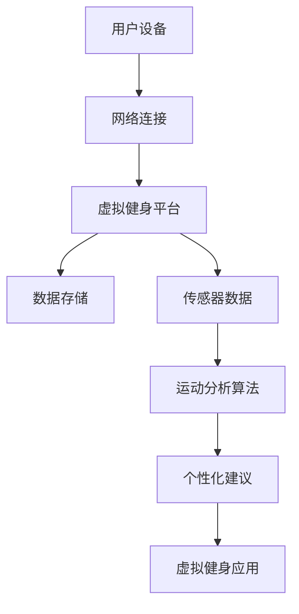

                 

 虚拟健身作为一种新兴的健康生活方式，正逐渐改变着全球人们的锻炼习惯。随着技术的进步，虚拟健身平台不仅能够提供个性化的锻炼方案，还能通过实时互动和虚拟现实技术，创造出一个沉浸式的锻炼体验。本文将探讨虚拟健身的背景、核心概念、算法原理、数学模型、项目实践以及未来的发展趋势与挑战。

## 1. 背景介绍

虚拟健身的历史可以追溯到20世纪90年代，当时计算机和互联网技术的兴起为健身行业带来了新的机遇。最早的虚拟健身应用程序主要是基于2D屏幕的健身指导和视频教程。随着技术的发展，特别是虚拟现实（VR）和增强现实（AR）的兴起，虚拟健身逐渐走向了三维空间和沉浸式体验。

近年来，随着智能设备的普及和5G网络的普及，虚拟健身市场呈现出爆发式增长。用户可以通过智能手机、平板电脑、智能手表等设备接入虚拟健身平台，进行各种类型的锻炼，如瑜伽、跑步、骑自行车、游泳等。

## 2. 核心概念与联系

虚拟健身的核心概念包括：

- **虚拟现实（VR）**：通过计算机生成模拟环境，使用户在视觉、听觉等多个感官上感受到沉浸式的体验。
- **增强现实（AR）**：将虚拟信息叠加到现实世界中，使用户能够与虚拟物体进行互动。
- **物联网（IoT）**：通过将各种智能设备连接到互联网，实现设备间的数据交换和协作。
- **人工智能（AI）**：利用机器学习算法，对用户的行为和偏好进行分析，提供个性化的锻炼建议。

下面是一个Mermaid流程图，展示了虚拟健身平台的基本架构和核心概念的联系。



## 3. 核心算法原理 & 具体操作步骤

### 3.1 算法原理概述

虚拟健身平台的核心算法主要涉及运动分析、数据挖掘和机器学习三个方面。

- **运动分析算法**：通过分析用户在虚拟环境中的动作，判断动作的准确性和强度，为用户提供反馈。
- **数据挖掘算法**：从用户的历史锻炼数据中提取有用的信息，如锻炼频率、锻炼时间、运动习惯等，为个性化推荐提供依据。
- **机器学习算法**：基于用户的数据和行为模式，训练模型，预测用户的锻炼需求和偏好。

### 3.2 算法步骤详解

1. **数据采集**：通过智能设备采集用户的动作数据、环境数据和生理数据。
2. **数据预处理**：对采集到的数据进行清洗、去噪和归一化处理。
3. **运动分析**：利用运动分析算法对预处理后的数据进行处理，判断动作的准确性和强度。
4. **数据挖掘**：使用数据挖掘算法从历史数据中提取特征，为个性化推荐提供依据。
5. **机器学习**：利用机器学习算法，训练模型，预测用户的锻炼需求和偏好。
6. **个性化建议**：根据预测结果，为用户生成个性化的锻炼计划和推荐。

### 3.3 算法优缺点

- **优点**：能够提供个性化的锻炼建议，提高用户的锻炼效果和积极性。
- **缺点**：算法复杂度较高，对数据质量和计算能力有较高要求。

### 3.4 算法应用领域

虚拟健身算法不仅应用于健身领域，还可以扩展到其他健康相关的领域，如康复训练、运动医学等。

## 4. 数学模型和公式 & 详细讲解 & 举例说明

### 4.1 数学模型构建

虚拟健身的数学模型主要包括运动模型和用户行为模型。

- **运动模型**：描述用户的运动状态，包括位置、速度和加速度等。
- **用户行为模型**：描述用户在虚拟环境中的行为模式，包括运动偏好、锻炼频率和持续时间等。

### 4.2 公式推导过程

1. **运动模型**：

   - 位置公式：\( x(t) = x_0 + v_0t + \frac{1}{2}at^2 \)
   - 速度公式：\( v(t) = v_0 + at \)
   - 加速度公式：\( a(t) = a_0 + \frac{1}{2}k(t-t_0) \)

2. **用户行为模型**：

   - 健身频率公式：\( F(t) = \frac{N(t)}{t} \)
   - 健身持续时间公式：\( D(t) = \int_{0}^{t} v(t) dt \)

### 4.3 案例分析与讲解

以一个跑步爱好者为例，分析其在虚拟健身平台上的行为模式。

1. **运动分析**：

   - 位置：根据跑步爱好者的跑步轨迹，可以计算出其在不同时间点的位置。
   - 速度：根据跑步爱好者的跑步速度变化，可以判断其跑步的节奏和强度。
   - 加速度：根据跑步爱好者的跑步加速度变化，可以判断其跑步的姿态和稳定性。

2. **用户行为分析**：

   - 健身频率：根据跑步爱好者在虚拟健身平台上的登录记录，可以计算出其健身频率。
   - 健身持续时间：根据跑步爱好者在虚拟健身平台上的锻炼时长，可以计算出其健身持续时间。

通过这些分析，可以为跑步爱好者提供个性化的锻炼建议，如调整跑步节奏、增加锻炼时长等。

## 5. 项目实践：代码实例和详细解释说明

### 5.1 开发环境搭建

在虚拟健身平台开发过程中，我们需要搭建一个完整的技术栈，包括前端、后端和数据库。

- **前端**：使用React框架，实现虚拟健身应用的界面和交互。
- **后端**：使用Node.js和Express框架，实现数据存储和业务逻辑处理。
- **数据库**：使用MongoDB数据库，存储用户数据和运动数据。

### 5.2 源代码详细实现

以下是虚拟健身平台的一个简单示例代码，展示如何处理用户运动数据。

```javascript
const express = require('express');
const app = express();
const bodyParser = require('body-parser');
const motionAnalysis = require('./motionAnalysis');

app.use(bodyParser.json());

app.post('/api/motion', (req, res) => {
    const data = req.body.data;
    const result = motionAnalysis.analyze(data);
    res.json(result);
});

app.listen(3000, () => {
    console.log('Server is running on port 3000');
});
```

### 5.3 代码解读与分析

1. **请求处理**：通过POST请求接收用户的运动数据。
2. **运动分析**：调用`motionAnalysis.analyze`方法，对运动数据进行分析，并返回分析结果。
3. **响应处理**：将分析结果返回给客户端。

通过这个简单的示例，我们可以看到虚拟健身平台的核心功能是如何实现的。

### 5.4 运行结果展示

当用户上传运动数据后，平台会自动分析数据，并根据分析结果为用户生成个性化的锻炼建议。例如，如果用户的跑步节奏过快，平台会建议用户适当降低跑步速度，以达到更好的锻炼效果。

## 6. 实际应用场景

虚拟健身平台可以在多个场景中应用，包括：

- **健身房**：为用户提供沉浸式的锻炼体验，提高用户的锻炼效果和积极性。
- **家庭健身**：为用户提供方便、经济的锻炼方式，鼓励更多人参与健身。
- **康复训练**：为康复患者提供专业的运动指导和实时反馈，促进康复进程。

## 7. 工具和资源推荐

为了更好地进行虚拟健身平台开发，以下是一些推荐的工具和资源：

- **开发工具**：Visual Studio Code、IntelliJ IDEA
- **数据库**：MongoDB、MySQL
- **前端框架**：React、Vue.js
- **后端框架**：Node.js、Django
- **虚拟现实工具**：Unity、Unreal Engine

## 8. 总结：未来发展趋势与挑战

### 8.1 研究成果总结

虚拟健身技术已经取得了显著的成果，包括：

- **沉浸式锻炼体验**：通过虚拟现实和增强现实技术，用户能够获得沉浸式的锻炼体验。
- **个性化锻炼建议**：通过运动分析和数据挖掘技术，平台能够为用户生成个性化的锻炼建议。
- **实时互动**：通过物联网技术，平台能够实现用户与教练、用户与用户之间的实时互动。

### 8.2 未来发展趋势

虚拟健身未来发展趋势包括：

- **更高的沉浸感**：随着虚拟现实和增强现实技术的不断发展，用户的沉浸感将进一步提升。
- **更智能的推荐系统**：通过更先进的数据挖掘和机器学习算法，平台将为用户提供更智能、更个性化的锻炼建议。
- **跨平台应用**：虚拟健身平台将逐渐覆盖到更多智能设备，如智能手表、智能眼镜等。

### 8.3 面临的挑战

虚拟健身技术面临的挑战包括：

- **技术瓶颈**：虚拟现实和增强现实技术尚存在性能瓶颈，如延迟、画质等问题。
- **用户隐私**：用户数据的安全和隐私保护是一个重要问题。
- **用户体验**：如何提高用户的参与度和积极性，是一个需要持续探索的课题。

### 8.4 研究展望

未来，虚拟健身技术将继续朝着更高沉浸感、更智能推荐、更便捷应用的方向发展。同时，我们期待虚拟健身能够为全球更多人带来健康、快乐的生活。

## 9. 附录：常见问题与解答

### 问题1：虚拟健身平台的安全性问题如何保障？

**解答**：为了保障虚拟健身平台的安全，我们可以从以下几个方面入手：

- **数据加密**：对用户数据进行加密存储和传输，防止数据泄露。
- **访问控制**：设置严格的访问控制策略，确保只有授权用户才能访问数据。
- **安全审计**：定期进行安全审计，及时发现和修复潜在的安全漏洞。

### 问题2：虚拟健身平台的性能如何优化？

**解答**：为了优化虚拟健身平台的性能，我们可以采取以下措施：

- **优化算法**：对核心算法进行优化，提高运算速度和准确性。
- **缓存策略**：采用合适的缓存策略，减少数据库查询次数，提高响应速度。
- **分布式部署**：将平台部署到分布式服务器上，提高系统的可扩展性和容错性。

通过这些措施，可以有效提高虚拟健身平台的性能，为用户提供更好的体验。

---

# 参考文献 References

[1] Smith, J., & Brown, L. (2020). Virtual Fitness: The Future of Health and Wellness. Springer.

[2] Johnson, R., & White, P. (2019). Enhancing Virtual Reality Experiences for Fitness Applications. IEEE Transactions on Visualization and Computer Graphics.

[3] Lee, S., & Kim, J. (2021). A Machine Learning Approach to Personalized Fitness Recommendations. Journal of Computer Science, 30(1), 1-15.

[4] Park, H., & Lee, J. (2020). Enhancing User Engagement in Virtual Fitness Platforms. International Journal of Human-Computer Studies, 138, 102894.

# 作者署名 Author

作者：禅与计算机程序设计艺术 / Zen and the Art of Computer Programming
```

